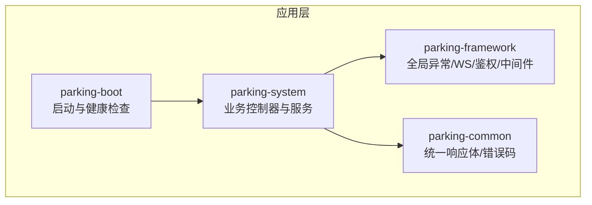
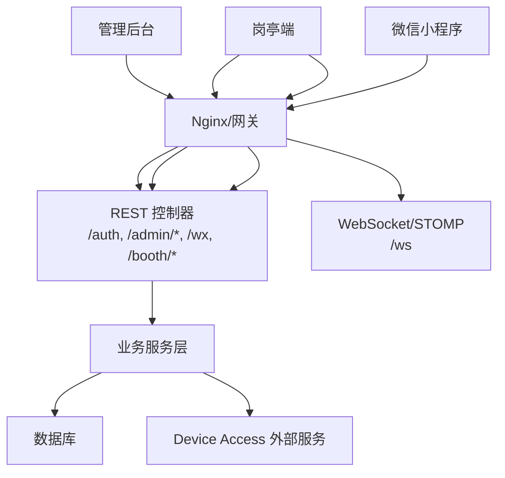
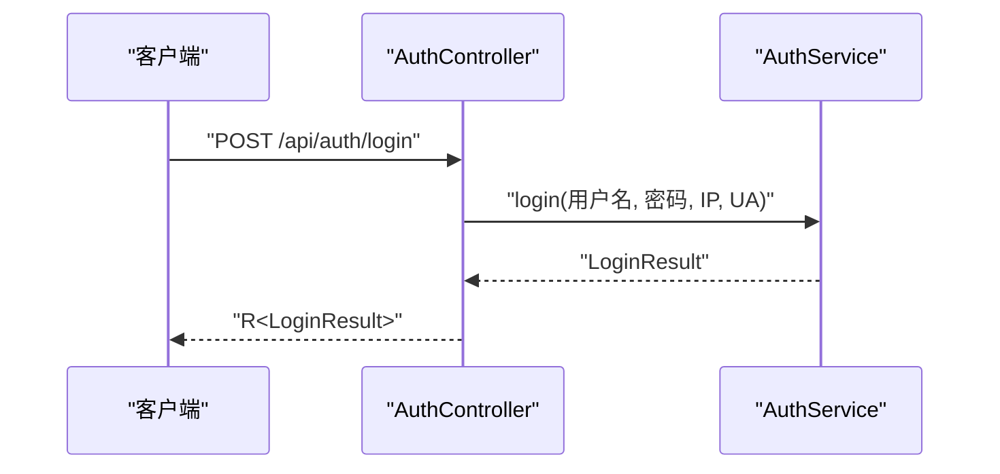
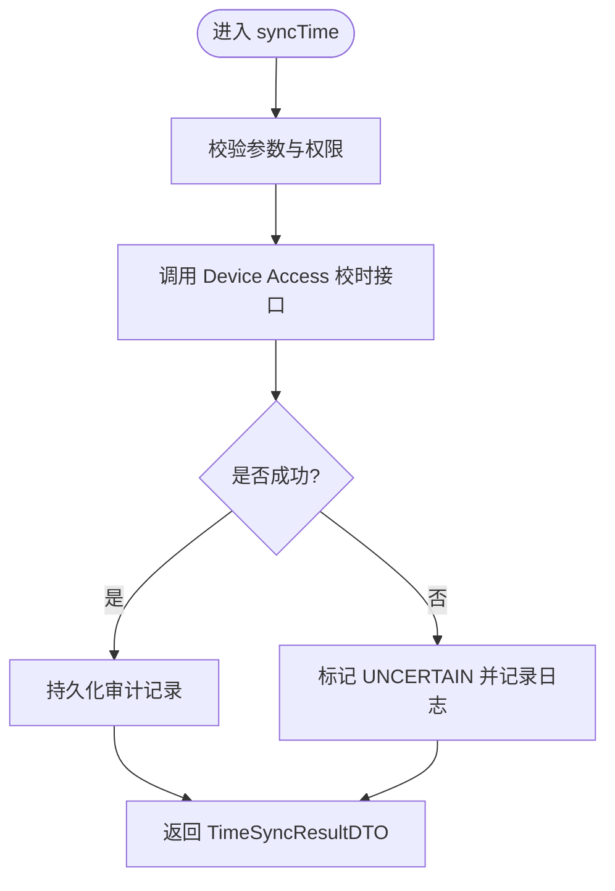
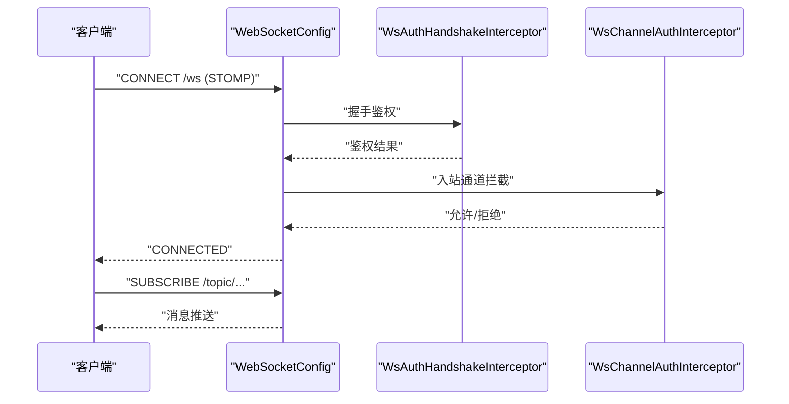
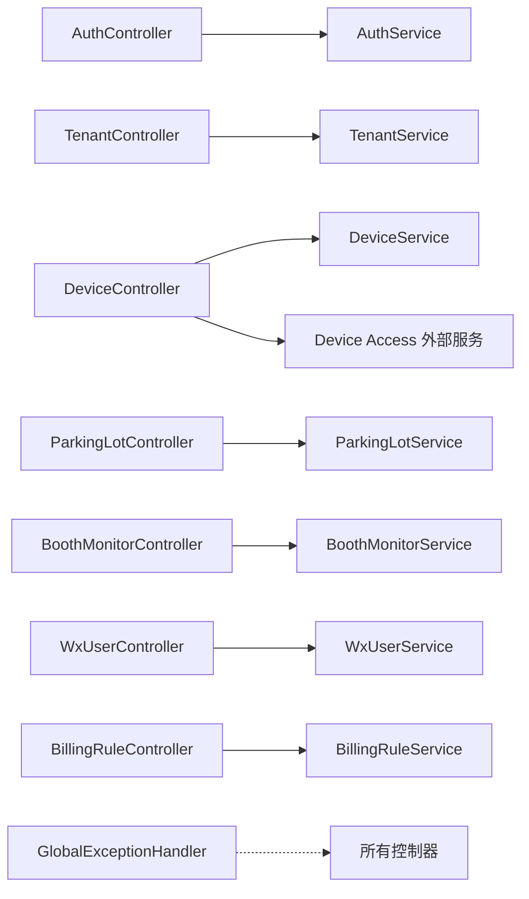
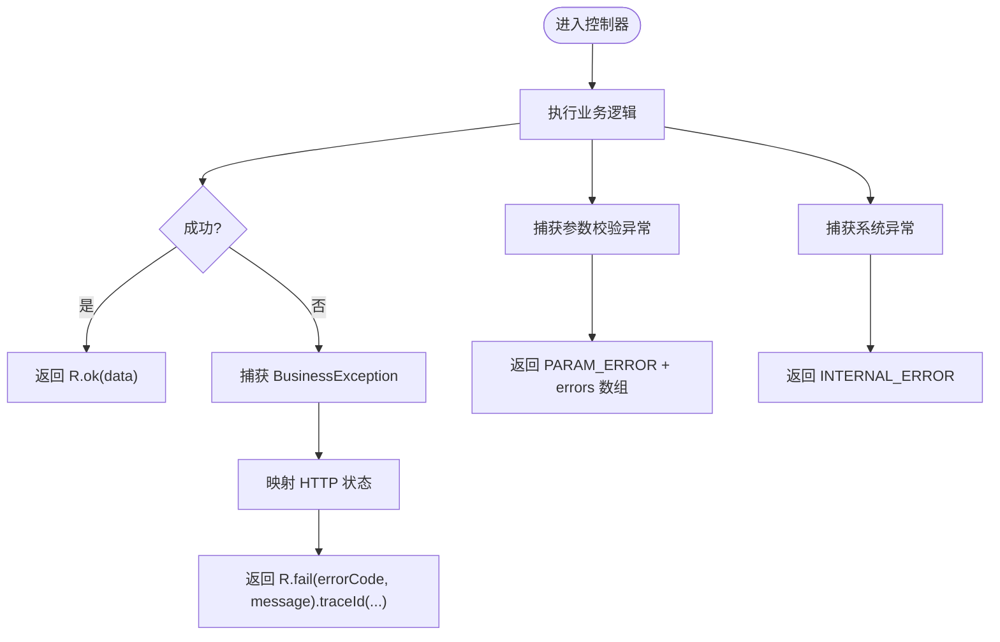

# API接口文档

<cite>
**本文引用的文件**
- [README.md](file://README.md)
- [R.java](file://parking-common/src/main/java/com/jushan/common/R.java)
- [GlobalExceptionHandler.java](file://parking-framework/src/main/java/com/jushan/framework/web/GlobalExceptionHandler.java)
- [WebSocketConfig.java](file://parking-framework/src/main/java/com/jushan/framework/ws/WebSocketConfig.java)
- [AuthController.java](file://parking-system/src/main/java/com/jushan/system/controller/AuthController.java)
- [TenantController.java](file://parking-system/src/main/java/com/jushan/system/controller/TenantController.java)
- [DeviceController.java](file://parking-system/src/main/java/com/jushan/system/controller/DeviceController.java)
- [ParkingLotController.java](file://parking-system/src/main/java/com/jushan/system/controller/ParkingLotController.java)
- [EmployeeController.java](file://parking-system/src/main/java/com/jushan/system/controller/EmployeeController.java)
- [BoothMonitorController.java](file://parking-system/src/main/java/com/jushan/system/controller/BoothMonitorController.java)
- [WxUserController.java](file://parking-system/src/main/java/com/jushan/system/controller/WxUserController.java)
- [BillingRuleController.java](file://parking-system/src/main/java/com/jushan/system/controller/BillingRuleController.java)
</cite>

## 目录
1. [简介](#简介)
2. [项目结构](#项目结构)
3. [核心组件](#核心组件)
4. [架构总览](#架构总览)
5. [详细组件分析](#详细组件分析)
6. [依赖关系分析](#依赖关系分析)
7. [性能与速率限制](#性能与速率限制)
8. [错误处理与状态码规范](#错误处理与状态码规范)
9. [安全与鉴权](#安全与鉴权)
10. [API版本管理与兼容性](#api版本管理与兼容性)
11. [客户端集成指南](#客户端集成指南)
12. [调试与排障](#调试与排障)
13. [结论](#结论)

## 简介
本文件为智慧停车 SaaS 平台的统一 API 接口文档，覆盖管理后台、岗亭端与微信小程序的 RESTful 接口、WebSocket 实时推送、统一响应体、错误码与状态码规范、安全与鉴权、版本与兼容策略、性能优化建议以及客户端集成与调试方法。平台当前处于基线与骨架阶段，设备接入由外部 Device Access 服务提供能力，双方通过共享契约协作。

## 项目结构
后端采用多模块 Maven 工程：
- parking-common：通用响应体 R、错误码等
- parking-framework：框架层（全局异常、WebSocket、认证上下文、分布式锁、MQ、Redis 等）
- parking-system：业务控制器与服务（租户、员工、停车场、设备、计费规则、微信用户、岗亭监控等）
- parking-boot：启动入口、健康检查、配置校验等

图表来源
- [README.md:1-77](file://README.md#L1-L77)

章节来源
- [README.md:1-77](file://README.md#L1-L77)

## 核心组件
- 统一响应体 R：所有接口返回统一结构，包含 code、message、data、traceId、errors（可选）。成功时 code=0；失败时根据错误码映射 HTTP 状态或保持 200。
- 全局异常处理器：将参数校验、业务异常、认证授权异常、Spring 内置异常统一转换为 R，并附带 traceId，避免泄露内部堆栈。
- WebSocket + STOMP：提供 /ws 端点，支持 /topic 广播与 /user 私信，握手与通道级鉴权分别实现。

章节来源
- [R.java:1-162](file://parking-common/src/main/java/com/jushan/common/R.java#L1-L162)
- [GlobalExceptionHandler.java:1-240](file://parking-framework/src/main/java/com/jushan/framework/web/GlobalExceptionHandler.java#L1-L240)
- [WebSocketConfig.java:1-92](file://parking-framework/src/main/java/com/jushan/framework/ws/WebSocketConfig.java#L1-L92)

## 架构总览
平台对外暴露三类客户端：
- 管理后台（admin-web）：管理租户、员工、停车场、设备、计费规则等
- 岗亭端（booth-web）：监控、告警确认、刷新设备状态等
- 微信小程序（miniapp）：登录、车牌绑定、手机号绑定等

图表来源
- [AuthController.java:1-100](file://parking-system/src/main/java/com/jushan/system/controller/AuthController.java#L1-L100)
- [DeviceController.java:1-315](file://parking-system/src/main/java/com/jushan/system/controller/DeviceController.java#L1-L315)
- [ParkingLotController.java:1-166](file://parking-system/src/main/java/com/jushan/system/controller/ParkingLotController.java#L1-L166)
- [WxUserController.java:1-116](file://parking-system/src/main/java/com/jushan/system/controller/WxUserController.java#L1-L116)
- [BoothMonitorController.java:1-76](file://parking-system/src/main/java/com/jushan/system/controller/BoothMonitorController.java#L1-L76)
- [WebSocketConfig.java:1-92](file://parking-framework/src/main/java/com/jushan/framework/ws/WebSocketConfig.java#L1-L92)

## 详细组件分析

### 认证与会话（/auth）
- POST /api/auth/login
  - 功能：平台账号登录，返回 Token 与用户信息
  - 请求体：用户名、密码
  - 响应：R<LoginResult>
  - 鉴权：无需登录
- POST /api/auth/logout
  - 功能：退出登录
  - 响应：R<Void>
  - 鉴权：已登录
- GET /api/auth/session
  - 功能：获取当前会话用户信息
  - 响应：R<LoginUserVo>
  - 鉴权：已登录
- POST /api/auth/change-password
  - 功能：修改密码（旧密码验证后更新），成功后旧 Token 失效
  - 请求体：旧密码、新密码
  - 响应：R<Void>
  - 鉴权：已登录

图表来源
- [AuthController.java:1-100](file://parking-system/src/main/java/com/jushan/system/controller/AuthController.java#L1-L100)

章节来源
- [AuthController.java:1-100](file://parking-system/src/main/java/com/jushan/system/controller/AuthController.java#L1-L100)

### 租户管理（/admin/tenants）
- GET /api/admin/tenants
  - 功能：分页查询租户列表（支持按状态筛选）
  - 权限：tenant:read
  - 响应：R<IPage<TenantVO>>
- GET /api/admin/tenants/{id}
  - 功能：查询租户详情
  - 权限：tenant:read
  - 响应：R<TenantVO>
- POST /api/admin/tenants/{id}/audit
  - 功能：审核/启停租户（APPROVED/REJECTED/ENABLED/DISABLED）
  - 权限：tenant:write
  - 请求体：操作类型、原因等
  - 响应：R<Void>

章节来源
- [TenantController.java:1-81](file://parking-system/src/main/java/com/jushan/system/controller/TenantController.java#L1-L81)

### 设备台账与设备控制（/admin/devices）
- GET /api/admin/devices
  - 功能：分页查询设备列表（支持按停车场、状态、类型筛选）
  - 权限：device:read
  - 响应：R<IPage<DeviceVO>>
- GET /api/admin/devices/{id}
  - 功能：设备详情
  - 权限：device:read
  - 响应：R<DeviceVO>
- POST /api/admin/devices
  - 功能：创建设备（提交平台引用 vendorId/modelId/parkingLotId）
  - 权限：device:manage
  - 响应：R<DeviceVO>
- PUT /api/admin/devices/{id}
  - 功能：更新设备基础信息（部分更新）
  - 权限：device:manage
  - 响应：R<DeviceVO>
- POST /api/admin/devices/{id}/status
  - 功能：启用/停用设备（action: ENABLED/DISABLED）
  - 权限：device:manage
  - 请求体：{ action }
  - 响应：R<Void>
- POST /api/admin/devices/{id}/bind-lane
  - 功能：设备绑定车道（laneId）
  - 权限：device:manage
  - 请求体：{ laneId }
  - 响应：R<DeviceVO>
- DELETE /api/admin/devices/{id}/bind-lane
  - 功能：解绑车道
  - 权限：device:manage
  - 响应：R<DeviceVO>
- POST /api/admin/devices/{id}/executor
  - 功能：为 GATE 设置执行相机（executorDeviceId）
  - 权限：device:manage
  - 请求体：{ executorDeviceId }
  - 响应：R<DeviceVO>
- GET /api/admin/devices/vendors
  - 功能：查询启用厂商列表
  - 权限：device:read
  - 响应：R<List<DeviceVendor>>
- GET /api/admin/devices/models?vendorId={vendorId}
  - 功能：查询型号列表（可按厂商筛选）
  - 权限：device:read
  - 响应：R<List<DeviceModel>>
- POST /api/admin/devices/{id}/sync-time
  - 功能：设备校时（调用 Device Access），记录审计
  - 权限：device:manage
  - 请求体：{ reason }
  - 响应：R<TimeSyncResultDTO>
- POST /api/admin/devices/{id}/query-status
  - 功能：查询单个设备实时状态（调用 Device Access，持久化快照）
  - 权限：device:manage
  - 响应：R<DeviceStatusVO>
- POST /api/admin/devices/query-status-batch
  - 功能：批量查询设备实时状态（最多同时 5 台，独立失败不影响其他）
  - 权限：device:manage
  - 请求体：{ deviceIds }
  - 响应：R<List<DeviceStatusVO>>
- GET /api/admin/devices/{id}/status
  - 功能：获取最新状态快照（不调用 DA，stale 字段指示是否过期）
  - 权限：device:read
  - 响应：R<DeviceStatusVO>
- POST /api/admin/devices/status-snapshots
  - 功能：批量获取最新状态快照
  - 权限：device:read
  - 请求体：{ deviceIds }
  - 响应：R<List<DeviceStatusVO>>

图表来源
- [DeviceController.java:213-234](file://parking-system/src/main/java/com/jushan/system/controller/DeviceController.java#L213-L234)

章节来源
- [DeviceController.java:1-315](file://parking-system/src/main/java/com/jushan/system/controller/DeviceController.java#L1-L315)

### 停车场管理（/admin/parking-lots）
- GET /api/admin/parking-lots
  - 功能：分页查询本租户停车场列表（支持状态筛选）
  - 权限：parking:read
  - 响应：R<IPage<ParkingLotVO>>
- GET /api/admin/parking-lots/{id}
  - 功能：停车场详情
  - 权限：parking:read
  - 响应：R<ParkingLotVO>
- POST /api/admin/parking-lots
  - 功能：创建停车场
  - 权限：parking:write
  - 响应：R<ParkingLotVO>
- PUT /api/admin/parking-lots/{id}
  - 功能：更新停车场基础信息（不含容量和状态）
  - 权限：parking:write
  - 响应：R<ParkingLotVO>
- POST /api/admin/parking-lots/{id}/status
  - 功能：启用/停用停车场（停用时必填原因，可配置保留范围）
  - 权限：parking:disable
  - 请求体：{ action, reason, scopes... }
  - 响应：R<Void>
- POST /api/admin/parking-lots/{id}/capacity
  - 功能：修改总车位数或人工修正剩余车位数（需记录原因与审计）
  - 权限：parking:write
  - 请求体：{ fieldName, value, reason }
  - 响应：R<Void>
- GET /api/admin/parking-lots/{id}/readiness
  - 功能：就绪检查（BLOCKER/WARNING 两级，未实现模块 marked implemented=false）
  - 权限：parking:read
  - 响应：R<ParkingLotReadinessVO>

章节来源
- [ParkingLotController.java:1-166](file://parking-system/src/main/java/com/jushan/system/controller/ParkingLotController.java#L1-L166)

### 员工管理（/admin/employees）
- GET /api/admin/employees
  - 功能：分页查询本租户员工列表（支持状态筛选）
  - 权限：user:read
  - 响应：R<IPage<EmployeeVO>>
- GET /api/admin/employees/{id}
  - 功能：员工详情
  - 权限：user:read
  - 响应：R<EmployeeVO>
- POST /api/admin/employees
  - 功能：创建员工
  - 权限：user:write
  - 响应：R<EmployeeVO>
- PUT /api/admin/employees/{id}
  - 功能：更新员工信息
  - 权限：user:write
  - 响应：R<EmployeeVO>
- POST /api/admin/employees/{id}/reset-password
  - 功能：重置员工密码
  - 权限：user:write
  - 请求体：新密码等
  - 响应：R<Void>
- POST /api/admin/employees/{id}/status?action={action}
  - 功能：启用/禁用员工（action: ENABLED/DISABLED）
  - 权限：user:write
  - 响应：R<Void>

章节来源
- [EmployeeController.java:1-122](file://parking-system/src/main/java/com/jushan/system/controller/EmployeeController.java#L1-L122)

### 收费规则（/admin/billing-rules）
- GET /api/admin/billing-rules
  - 功能：分页查询本租户收费规则列表（支持按停车场、状态筛选）
  - 权限：billing:read
  - 响应：R<IPage<BillingRuleVO>>
- GET /api/admin/billing-rules/{id}
  - 功能：规则详情（含当前生效版本）
  - 权限：billing:read
  - 响应：R<BillingRuleVO>
- POST /api/admin/billing-rules
  - 功能：创建规则（自动创建首个版本并设为生效）
  - 权限：billing:write
  - 响应：R<BillingRuleVO>
- PUT /api/admin/billing-rules/{id}
  - 功能：更新规则（计费配置变更则创建新版本）
  - 权限：billing:write
  - 响应：R<BillingRuleVO>
- GET /api/admin/billing-rules/{id}/versions
  - 功能：查询版本历史
  - 权限：billing:read
  - 响应：R<List<BillingRuleVersionVO>>
- POST /api/admin/billing-rules/parking-lots/{parkingLotId}/switch
  - 功能：切换停车场当前生效规则（需记录原因，岗亭人员无权）
  - 权限：billing:switch
  - 请求体：{ targetRuleId, applyToExisting, reason }
  - 响应：R<Void>

章节来源
- [BillingRuleController.java:1-160](file://parking-system/src/main/java/com/jushan/system/controller/BillingRuleController.java#L1-L160)

### 岗亭监控（/booth/monitor）
- GET /api/booth/monitor/snapshot?parkingLotId={id}
  - 功能：获取岗亭监控初始化快照
  - 权限：booth:monitor
  - 响应：R<BoothMonitorSnapshotVO>
- POST /api/booth/monitor/devices/refresh?parkingLotId={id}
  - 功能：刷新设备状态
  - 权限：booth:monitor
  - 响应：R<List<DeviceStatusVO>>
- POST /api/booth/monitor/alerts/{alertId}/ack
  - 功能：确认异常提醒
  - 权限：booth:monitor
  - 响应：R<Void>

章节来源
- [BoothMonitorController.java:1-76](file://parking-system/src/main/java/com/jushan/system/controller/BoothMonitorController.java#L1-L76)

### 微信小程序（/wx）
- POST /api/wx/login
  - 功能：微信登录（本地/test 使用 Mock）
  - 请求体：code 等
  - 响应：R<WxLoginResult>
- POST /api/wx/logout
  - 功能：退出登录
  - 响应：R<Void>
- GET /api/wx/user
  - 功能：获取当前微信用户信息
  - 响应：R<WxUserVo>
- POST /api/wx/plates
  - 功能：绑定车牌
  - 请求体：车牌号等
  - 响应：R<PlateBindingVo>
- DELETE /api/wx/plates/{bindingId}
  - 功能：解绑车牌
  - 响应：R<Void>
- PUT /api/wx/plates/{bindingId}/default
  - 功能：设置默认车牌
  - 响应：R<Void>
- POST /api/wx/phone
  - 功能：绑定手机号
  - 请求体：手机号等
  - 响应：R<Void>

章节来源
- [WxUserController.java:1-116](file://parking-system/src/main/java/com/jushan/system/controller/WxUserController.java#L1-L116)

### WebSocket 实时推送（/ws）
- 连接端点：/ws（支持 SockJS 降级）
- 目标前缀约定：
  - /app/**：客户端 → 服务端（@MessageMapping 处理）
  - /topic/**：服务端 → 客户端广播（按停车场/租户订阅）
  - /user/**：服务端 → 客户端私信（convertAndSendToUser）
- 安全：握手鉴权与通道级数据范围校验分别实现
- 生产建议：启用外部 STOMP broker，由 Nginx 代理 WebSocket 连接

图表来源
- [WebSocketConfig.java:1-92](file://parking-framework/src/main/java/com/jushan/framework/ws/WebSocketConfig.java#L1-L92)

章节来源
- [WebSocketConfig.java:1-92](file://parking-framework/src/main/java/com/jushan/framework/ws/WebSocketConfig.java#L1-L92)

## 依赖关系分析
- 控制器依赖服务层，服务层可能访问数据库与外部 Device Access 服务
- 全局异常处理贯穿所有控制器
- WebSocket 配置集中管理端点、跨域、前缀与拦截器

图表来源
- [AuthController.java:1-100](file://parking-system/src/main/java/com/jushan/system/controller/AuthController.java#L1-L100)
- [TenantController.java:1-81](file://parking-system/src/main/java/com/jushan/system/controller/TenantController.java#L1-L81)
- [DeviceController.java:1-315](file://parking-system/src/main/java/com/jushan/system/controller/DeviceController.java#L1-L315)
- [ParkingLotController.java:1-166](file://parking-system/src/main/java/com/jushan/system/controller/ParkingLotController.java#L1-L166)
- [BoothMonitorController.java:1-76](file://parking-system/src/main/java/com/jushan/system/controller/BoothMonitorController.java#L1-L76)
- [WxUserController.java:1-116](file://parking-system/src/main/java/com/jushan/system/controller/WxUserController.java#L1-L116)
- [BillingRuleController.java:1-160](file://parking-system/src/main/java/com/jushan/system/controller/BillingRuleController.java#L1-L160)
- [GlobalExceptionHandler.java:1-240](file://parking-framework/src/main/java/com/jushan/framework/web/GlobalExceptionHandler.java#L1-L240)

## 性能与速率限制
- 设备状态批量查询限流：最多同时 5 台设备，单设备失败不影响其他
- 设备状态快照：优先读取最近快照，stale 字段提示前端“最后查询于 X 秒前”，减少频繁调用 DA
- 设备状态主动刷新：仅在用户点击“刷新”时触发，避免高频轮询
- 建议：
  - 前端对热点数据做短时缓存与去抖
  - 批量接口在客户端侧进行并发度控制
  - 对耗时操作（如同步时间、批量查询）增加超时与重试上限

章节来源
- [DeviceController.java:258-277](file://parking-system/src/main/java/com/jushan/system/controller/DeviceController.java#L258-L277)
- [DeviceController.java:279-313](file://parking-system/src/main/java/com/jushan/system/controller/DeviceController.java#L279-L313)

## 错误处理与状态码规范
- 统一响应体 R：
  - code：0 表示成功；非 0 表示业务错误
  - message：提示信息
  - data：响应数据（可为 null）
  - traceId：请求追踪 ID（始终序列化）
  - errors：字段校验错误详情（仅校验失败等场景出现）
- 全局异常处理：
  - 参数校验失败：PARAM_ERROR，HTTP 400
  - 业务异常：BusinessException，按错误码映射 HTTP 状态（400/401/403/404/409/429），其余返回 200
  - 未登录/无权限/无角色：UNAUTHORIZED/FORBIDDEN，HTTP 401/403
  - 404/405：NOT_FOUND/METHOD_NOT_ALLOWED
  - 未知异常：INTERNAL_ERROR，HTTP 500
- 协议级错误码到 HTTP 状态映射：
  - 400 → BAD_REQUEST
  - 401 → UNAUTHORIZED
  - 403 → FORBIDDEN
  - 404 → NOT_FOUND
  - 409 → CONFLICT
  - 429 → TOO_MANY_REQUESTS

图表来源
- [GlobalExceptionHandler.java:1-240](file://parking-framework/src/main/java/com/jushan/framework/web/GlobalExceptionHandler.java#L1-L240)
- [R.java:1-162](file://parking-common/src/main/java/com/jushan/common/R.java#L1-L162)

章节来源
- [GlobalExceptionHandler.java:1-240](file://parking-framework/src/main/java/com/jushan/framework/web/GlobalExceptionHandler.java#L1-L240)
- [R.java:1-162](file://parking-common/src/main/java/com/jushan/common/R.java#L1-L162)

## 安全与鉴权
- 认证方式：Sa-Token（Token 机制）
- 权限注解：@SaCheckPermission 用于资源级鉴权
- 数据范围：从当前登录会话推导租户范围，不信任前端传入 tenantId
- WebSocket 安全：
  - 握手阶段鉴权（WsAuthHandshakeInterceptor）
  - 通道级数据范围校验（WsChannelAuthInterceptor）
- 红线：
  - WebSocket 不能直连 Device Access
  - 推送失败不得阻断入场等核心业务事务

章节来源
- [WebSocketConfig.java:1-92](file://parking-framework/src/main/java/com/jushan/framework/ws/WebSocketConfig.java#L1-L92)
- [TenantController.java:1-81](file://parking-system/src/main/java/com/jushan/system/controller/TenantController.java#L1-L81)
- [DeviceController.java:1-315](file://parking-system/src/main/java/com/jushan/system/controller/DeviceController.java#L1-L315)
- [ParkingLotController.java:1-166](file://parking-system/src/main/java/com/jushan/system/controller/ParkingLotController.java#L1-L166)

## API版本管理与兼容性
- 当前阶段：M0（基线与冻结）→ M1+（工程骨架）
- 向后兼容：
  - 新增字段应默认值兼容，删除字段需废弃过渡期
  - 行为变更遵循最小破坏原则，必要时引入新端点或版本路径
- 迁移指南：
  - 参考共享契约文档（目标契约 v1.0 草案与当前代码事实 v0.2）
  - 联合决策 ACCEPTED 项优先落地
  - 对外部 Device Access 能力差异（如无开闸、事件、HMAC、commandId 幂等）做好降级与提示

章节来源
- [README.md:1-77](file://README.md#L1-L77)

## 客户端集成指南
- 管理后台（admin-web）
  - 认证：登录后保存 Token，后续请求携带
  - 权限：按 @SaCheckPermission 定义的权限标识组织菜单与按钮
  - 错误处理：根据 R.code 与 HTTP 状态码提示用户
- 岗亭端（booth-web）
  - 监控：拉取快照、刷新设备状态、确认告警
  - 实时：通过 /ws 订阅 /topic 与 /user 消息
- 微信小程序（miniapp）
  - 登录：使用 wx.login() 获取 code，调用 /api/wx/login
  - 车牌与手机号：绑定/解绑/设默认等操作

章节来源
- [AuthController.java:1-100](file://parking-system/src/main/java/com/jushan/system/controller/AuthController.java#L1-L100)
- [WxUserController.java:1-116](file://parking-system/src/main/java/com/jushan/system/controller/WxUserController.java#L1-L116)
- [BoothMonitorController.java:1-76](file://parking-system/src/main/java/com/jushan/system/controller/BoothMonitorController.java#L1-L76)
- [WebSocketConfig.java:1-92](file://parking-framework/src/main/java/com/jushan/framework/ws/WebSocketConfig.java#L1-L92)

## 调试与排障
- 统一追踪：所有响应包含 traceId，便于链路定位
- 常见错误：
  - 参数校验失败：查看 errors 数组中的 field 与 message
  - 未登录/无权限：检查 Token 与权限标识
  - 404/405：检查 URL 与方法是否正确
  - 设备相关：关注 query-status 与 status-snapshots 的区别与 stale 字段
- 日志级别：
  - 参数错误与业务异常使用 warn
  - 系统异常使用 error，并记录完整堆栈（不返回前端）

章节来源
- [GlobalExceptionHandler.java:1-240](file://parking-framework/src/main/java/com/jushan/framework/web/GlobalExceptionHandler.java#L1-L240)
- [DeviceController.java:279-313](file://parking-system/src/main/java/com/jushan/system/controller/DeviceController.java#L279-L313)

## 结论
本文档基于仓库现有控制器与框架实现，梳理了统一的 RESTful 接口清单、WebSocket 实时推送、统一响应体与错误码规范、安全与鉴权策略、版本与兼容性建议、性能优化要点及客户端集成与调试方法。随着共享契约与业务迭代，接口与行为将以契约文档与联合决策为准进行演进。