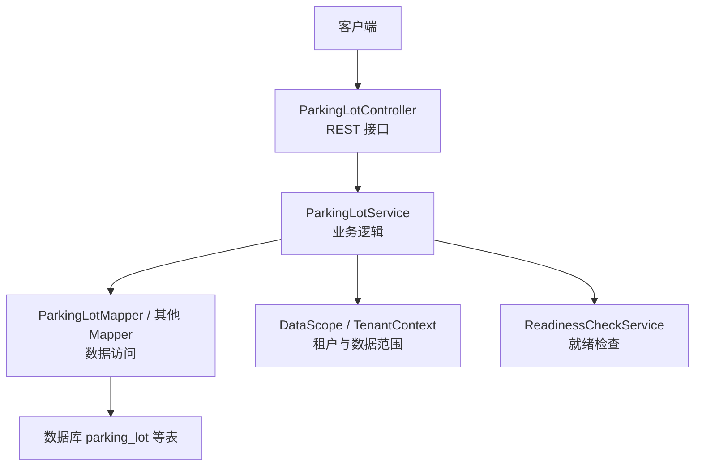
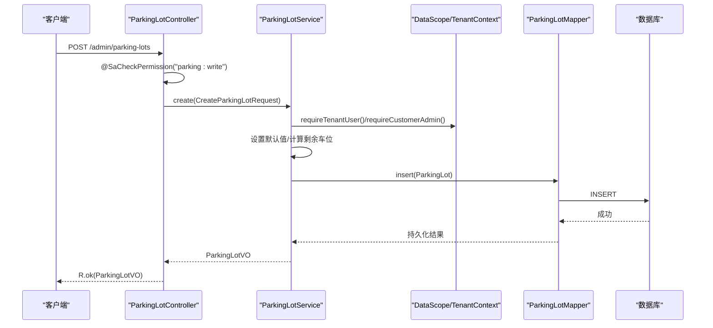
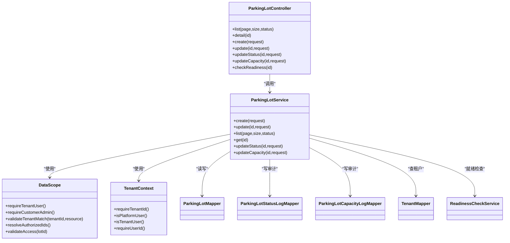
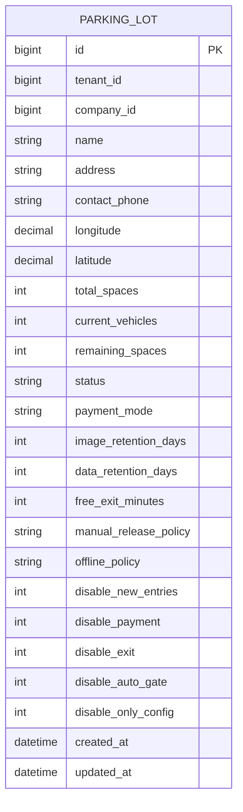

# 停车场基础管理接口

<cite>
**本文引用的文件**
- [ParkingLotController.java](file://parking-system/src/main/java/com/jushan/system/controller/ParkingLotController.java)
- [ParkingLotService.java](file://parking-system/src/main/java/com/jushan/system/service/ParkingLotService.java)
- [CreateParkingLotRequest.java](file://parking-system/src/main/java/com/jushan/system/dto/CreateParkingLotRequest.java)
- [UpdateParkingLotRequest.java](file://parking-system/src/main/java/com/jushan/system/dto/UpdateParkingLotRequest.java)
- [ParkingLotStatusRequest.java](file://parking-system/src/main/java/com/jushan/system/dto/ParkingLotStatusRequest.java)
- [ParkingLotCapacityRequest.java](file://parking-system/src/main/java/com/jushan/system/dto/ParkingLotCapacityRequest.java)
- [ParkingLotVO.java](file://parking-system/src/main/java/com/jushan/system/vo/ParkingLotVO.java)
- [ParkingLot.java](file://parking-system/src/main/java/com/jushan/system/entity/ParkingLot.java)
- [TenantContext.java](file://parking-framework/src/main/java/com/jushan/framework/auth/TenantContext.java)
- [DataScope.java](file://parking-framework/src/main/java/com/jushan/framework/auth/DataScope.java)
</cite>

## 目录
1. [简介](#简介)
2. [项目结构](#项目结构)
3. [核心组件](#核心组件)
4. [架构总览](#架构总览)
5. [详细组件分析](#详细组件分析)
6. [依赖分析](#依赖分析)
7. [性能考虑](#性能考虑)
8. [故障排查指南](#故障排查指南)
9. [结论](#结论)
10. [附录](#附录)

## 简介
本文件为“停车场基础管理”接口的权威 API 文档，覆盖停车场的创建、查询、更新、状态变更与容量调整等能力。重点说明：
- 分页查询与状态筛选
- 请求参数校验规则
- 多租户数据隔离与权限控制（parking:read、parking:write、parking:disable）
- 错误处理与业务规则
- 完整的请求/响应示例（字段级说明）

## 项目结构
后端采用分层架构：
- 控制器层：暴露 REST 接口，负责鉴权与入参校验
- 服务层：实现业务逻辑、事务与审计记录
- DTO/VO/Entity：分别承载请求体、响应视图与持久化实体
- 框架层：提供租户上下文与数据范围控制

图示来源
- [ParkingLotController.java](file://parking-system/src/main/java/com/jushan/system/controller/ParkingLotController.java)
- [ParkingLotService.java](file://parking-system/src/main/java/com/jushan/system/service/ParkingLotService.java)
- [DataScope.java](file://parking-framework/src/main/java/com/jushan/framework/auth/DataScope.java)
- [TenantContext.java](file://parking-framework/src/main/java/com/jushan/framework/auth/TenantContext.java)

章节来源
- [ParkingLotController.java](file://parking-system/src/main/java/com/jushan/system/controller/ParkingLotController.java)
- [ParkingLotService.java](file://parking-system/src/main/java/com/jushan/system/service/ParkingLotService.java)

## 核心组件
- ParkingLotController：对外暴露 /admin/parking-lots 系列接口，使用注解进行权限控制与参数校验
- ParkingLotService：实现 CRUD、状态切换、容量变更、就绪检查集成与审计日志写入
- DTO/VO/Entity：定义请求参数、返回视图与数据库实体映射

章节来源
- [ParkingLotController.java](file://parking-system/src/main/java/com/jushan/system/controller/ParkingLotController.java)
- [ParkingLotService.java](file://parking-system/src/main/java/com/jushan/system/service/ParkingLotService.java)
- [CreateParkingLotRequest.java](file://parking-system/src/main/java/com/jushan/system/dto/CreateParkingLotRequest.java)
- [UpdateParkingLotRequest.java](file://parking-system/src/main/java/com/jushan/system/dto/UpdateParkingLotRequest.java)
- [ParkingLotVO.java](file://parking-system/src/main/java/com/jushan/system/vo/ParkingLotVO.java)
- [ParkingLot.java](file://parking-system/src/main/java/com/jushan/system/entity/ParkingLot.java)

## 架构总览
以下时序图展示“创建停车场”的端到端流程，包括权限校验、参数校验、默认值填充、持久化与审计。

图示来源
- [ParkingLotController.java](file://parking-system/src/main/java/com/jushan/system/controller/ParkingLotController.java)
- [ParkingLotService.java](file://parking-system/src/main/java/com/jushan/system/service/ParkingLotService.java)
- [DataScope.java](file://parking-framework/src/main/java/com/jushan/framework/auth/DataScope.java)
- [TenantContext.java](file://parking-framework/src/main/java/com/jushan/framework/auth/TenantContext.java)

## 详细组件分析

### 接口清单与权限
- 分页查询列表
  - 方法：GET /admin/parking-lots
  - 权限：parking:read
  - 参数：page（默认 1）、size（默认 20）、status（可选：ENABLED/DISABLED）
- 查询详情
  - 方法：GET /admin/parking-lots/{id}
  - 权限：parking:read
- 创建停车场
  - 方法：POST /admin/parking-lots
  - 权限：parking:write
- 更新停车场基础信息
  - 方法：PUT /admin/parking-lots/{id}
  - 权限：parking:write
- 启用/停用停车场
  - 方法：POST /admin/parking-lots/{id}/status
  - 权限：parking:disable
- 修改容量
  - 方法：POST /admin/parking-lots/{id}/capacity
  - 权限：parking:write

章节来源
- [ParkingLotController.java](file://parking-system/src/main/java/com/jushan/system/controller/ParkingLotController.java)

### 分页查询接口
- 路径：GET /admin/parking-lots
- 权限：parking:read
- 请求参数
  - page：页码，整数，默认 1
  - size：每页大小，整数，默认 20
  - status：状态筛选，字符串，可选；允许值 ENABLED、DISABLED
- 响应体
  - 统一包装 R<IPage<ParkingLotVO>>
  - IPage 包含 records 列表与分页元信息（如 total、pages、current、size 等）
- 数据范围
  - 仅返回当前租户范围内的停车场
  - 受限角色仅能查看已授权的停车场（通过 DataScope 解析授权集合）
- 排序
  - 按创建时间降序

章节来源
- [ParkingLotController.java](file://parking-system/src/main/java/com/jushan/system/controller/ParkingLotController.java)
- [ParkingLotService.java](file://parking-system/src/main/java/com/jushan/system/service/ParkingLotService.java)
- [DataScope.java](file://parking-framework/src/main/java/com/jushan/framework/auth/DataScope.java)

### 创建停车场接口
- 路径：POST /admin/parking-lots
- 权限：parking:write
- 请求体：CreateParkingLotRequest
  - companyId：所属公司 ID，必填
  - name：停车场名称，必填，最长 128 字符
  - address：地址，选填，最长 255 字符
  - contactPhone：联系电话，选填，最长 20 字符
  - longitude：经度，选填
  - latitude：纬度，选填
  - totalSpaces：总车位数，必填，非负
  - paymentMode：支付模式，选填
  - imageRetentionDays：抓拍图片保存天数，选填
  - dataRetentionDays：业务数据保存天数，选填
  - freeExitMinutes：缴费后免费离场时间（分钟），选填
  - manualReleasePolicy：人工放行策略，选填
  - offlinePolicy：离线运行策略，选填
  - duplicateEntryPolicy：重复入场策略，选填
- 业务规则
  - 新停车场初始状态为 DISABLED，需通过就绪检查后方可启用
  - 自动设置默认值（支付模式、保留天数、免费离场时长、策略等）
  - 剩余车位初始等于总车位数
- 响应体：R<ParkingLotVO>

章节来源
- [ParkingLotController.java](file://parking-system/src/main/java/com/jushan/system/controller/ParkingLotController.java)
- [CreateParkingLotRequest.java](file://parking-system/src/main/java/com/jushan/system/dto/CreateParkingLotRequest.java)
- [ParkingLotService.java](file://parking-system/src/main/java/com/jushan/system/service/ParkingLotService.java)

### 更新停车场接口
- 路径：PUT /admin/parking-lots/{id}
- 权限：parking:write
- 请求体：UpdateParkingLotRequest（所有字段可选，仅更新非 null 字段）
  - companyId：所属公司 ID，选填
  - name：停车场名称，最长 128 字符
  - address：地址，最长 255 字符
  - contactPhone：联系电话，最长 20 字符
  - longitude：经度，选填
  - latitude：纬度，选填
  - paymentMode：支付模式，选填
  - imageRetentionDays：抓拍图片保存天数，至少 1 天
  - dataRetentionDays：业务数据保存天数，至少 1 天
  - freeExitMinutes：缴费后免费离场时间（分钟），非负
  - manualReleasePolicy：人工放行策略，选填
  - offlinePolicy：离线运行策略，选填
  - duplicateEntryPolicy：重复入场策略，选填
- 响应体：R<ParkingLotVO>

章节来源
- [ParkingLotController.java](file://parking-system/src/main/java/com/jushan/system/controller/ParkingLotController.java)
- [UpdateParkingLotRequest.java](file://parking-system/src/main/java/com/jushan/system/dto/UpdateParkingLotRequest.java)
- [ParkingLotService.java](file://parking-system/src/main/java/com/jushan/system/service/ParkingLotService.java)

### 启用/停用停车场接口
- 路径：POST /admin/parking-lots/{id}/status
- 权限：parking:disable
- 请求体：ParkingLotStatusRequest
  - action：操作类型，必填；允许 ENABLED、DISABLED
  - reason：原因，action=DISABLED 时必填
  - disableNewEntries/disablePayment/disableExit/disableAutoGate/disableOnlyConfig：停用时可配置保留范围（布尔或整型标记）
- 业务规则
  - 启用前必须通过就绪检查，存在阻塞项则拒绝启用
  - 状态流转严格校验（仅允许在禁用与启用之间切换）
  - 条件更新防止并发覆盖
- 响应体：R<Void>

章节来源
- [ParkingLotController.java](file://parking-system/src/main/java/com/jushan/system/controller/ParkingLotController.java)
- [ParkingLotService.java](file://parking-system/src/main/java/com/jushan/system/service/ParkingLotService.java)
- [ParkingLotStatusRequest.java](file://parking-system/src/main/java/com/jushan/system/dto/ParkingLotStatusRequest.java)

### 修改容量接口
- 路径：POST /admin/parking-lots/{id}/capacity
- 权限：parking:write
- 请求体：ParkingLotCapacityRequest
  - fieldName：目标字段，必填；允许 total_spaces、remaining_spaces
  - value：新值，必填
  - reason：原因，必填
- 业务规则
  - 无变化直接跳过
  - 使用乐观锁（基于 beforeValue）防止并发覆盖
  - 写入容量变更审计日志
- 响应体：R<Void>

章节来源
- [ParkingLotController.java](file://parking-system/src/main/java/com/jushan/system/controller/ParkingLotController.java)
- [ParkingLotService.java](file://parking-system/src/main/java/com/jushan/system/service/ParkingLotService.java)
- [ParkingLotCapacityRequest.java](file://parking-system/src/main/java/com/jushan/system/dto/ParkingLotCapacityRequest.java)

### 请求/响应示例（字段说明）
以下为字段级示例说明（以 JSON 键名形式呈现，便于对接）：
- 创建停车场请求 CreateParkingLotRequest
  - {
    "companyId": 1,
    "name": "示例停车场",
    "address": "示例地址",
    "contactPhone": "13800000000",
    "longitude": 120.123456,
    "latitude": 30.123456,
    "totalSpaces": 100,
    "paymentMode": "PLATFORM",
    "imageRetentionDays": 30,
    "dataRetentionDays": 365,
    "freeExitMinutes": 15,
    "manualReleasePolicy": "ADMIN_ONLY",
    "offlinePolicy": "ALLOW_ENTRY_EXIT",
    "duplicateEntryPolicy": "REJECT"
  }
- 更新停车场请求 UpdateParkingLotRequest（仅传需要更新的字段）
  - {
    "name": "示例停车场-更新",
    "contactPhone": "13900000000",
    "imageRetentionDays": 60
  }
- 启用/停用请求 ParkingLotStatusRequest
  - {
    "action": "DISABLED",
    "reason": "设备维护中",
    "disableNewEntries": 0,
    "disablePayment": 0,
    "disableExit": 0,
    "disableAutoGate": 1,
    "disableOnlyConfig": 1
  }
- 修改容量请求 ParkingLotCapacityRequest
  - {
    "fieldName": "total_spaces",
    "value": 120,
    "reason": "扩容调整"
  }
- 通用响应 R<T>
  - {
    "code": 200,
    "message": "成功",
    "data": { ... }
  }

章节来源
- [CreateParkingLotRequest.java](file://parking-system/src/main/java/com/jushan/system/dto/CreateParkingLotRequest.java)
- [UpdateParkingLotRequest.java](file://parking-system/src/main/java/com/jushan/system/dto/UpdateParkingLotRequest.java)
- [ParkingLotStatusRequest.java](file://parking-system/src/main/java/com/jushan/system/dto/ParkingLotStatusRequest.java)
- [ParkingLotCapacityRequest.java](file://parking-system/src/main/java/com/jushan/system/dto/ParkingLotCapacityRequest.java)
- [ParkingLotVO.java](file://parking-system/src/main/java/com/jushan/system/vo/ParkingLotVO.java)

### 多租户与权限控制
- 多租户隔离
  - 所有操作从当前登录会话推导租户范围，不信任前端传入 tenantId
  - 列表查询强制附加租户条件，平台用户不可通过此接口跨租户访问
- 数据范围（P0）
  - 客户管理员可查看本租户全部停车场
  - 受限角色（如停车场管理员、运维、财务、岗亭）仅可查看 employee_parking_lot 明确授权的停车场
- 权限点
  - parking:read：查看列表与详情
  - parking:write：创建/编辑停车场、修改容量
  - parking:disable：启用/停用停车场（仅超级管理员与客户管理员）

章节来源
- [ParkingLotController.java](file://parking-system/src/main/java/com/jushan/system/controller/ParkingLotController.java)
- [ParkingLotService.java](file://parking-system/src/main/java/com/jushan/system/service/ParkingLotService.java)
- [DataScope.java](file://parking-framework/src/main/java/com/jushan/framework/auth/DataScope.java)
- [TenantContext.java](file://parking-framework/src/main/java/com/jushan/framework/auth/TenantContext.java)

### 错误处理与业务规则
- 参数校验错误
  - 必填缺失、长度超限、数值越界等将触发参数错误
- 未授权/无权限
  - 未登录或会话过期、缺少对应权限点
- 业务错误
  - 状态非法、状态流转冲突、启用前就绪检查未通过、容量并发覆盖等
- 常见错误码语义
  - PARAM_ERROR：参数错误
  - UNAUTHORIZED：未认证或未授权
  - BUSINESS_ERROR：业务规则不满足
  - NOT_FOUND：资源不存在

章节来源
- [ParkingLotService.java](file://parking-system/src/main/java/com/jushan/system/service/ParkingLotService.java)

### 就绪检查（启用前置条件）
- 启用前调用就绪检查，若存在 BLOCKER 级别问题则拒绝启用
- 检查结果包含 BLOCKER 与 WARNING 两类，前者阻断启用，后者仅提示

章节来源
- [ParkingLotService.java](file://parking-system/src/main/java/com/jushan/system/service/ParkingLotService.java)

## 依赖分析

图示来源
- [ParkingLotController.java](file://parking-system/src/main/java/com/jushan/system/controller/ParkingLotController.java)
- [ParkingLotService.java](file://parking-system/src/main/java/com/jushan/system/service/ParkingLotService.java)
- [DataScope.java](file://parking-framework/src/main/java/com/jushan/framework/auth/DataScope.java)
- [TenantContext.java](file://parking-framework/src/main/java/com/jushan/framework/auth/TenantContext.java)

## 性能考虑
- 分页查询使用 MyBatis-Plus 分页插件，避免全量加载
- 列表查询根据授权集合生成 IN 条件，减少不必要的数据扫描
- 状态与容量更新采用条件更新（乐观锁），降低并发冲突风险
- 默认值在服务层集中设置，减少数据库层负担

[本节为通用指导，无需源码引用]

## 故障排查指南
- 常见问题定位
  - 参数校验失败：检查必填字段、长度与数值范围
  - 权限不足：确认当前用户具备 parking:read/write/disable 相应权限
  - 状态变更失败：检查当前状态是否允许目标动作，以及是否存在并发覆盖
  - 启用失败：查看就绪检查结果中的 BLOCKER 项并逐项修复
- 建议
  - 开启链路追踪与审计日志，结合操作人 ID 与原因快速回溯
  - 对容量与状态变更增加重试与幂等保护

章节来源
- [ParkingLotService.java](file://parking-system/src/main/java/com/jushan/system/service/ParkingLotService.java)

## 结论
本接口围绕停车场的基础管理能力，提供了完善的权限控制、多租户隔离、数据范围限制与审计机制。通过统一的参数校验与业务规则，确保数据一致性与系统稳定性。建议在上线前完善就绪检查模块，并对关键路径补充监控告警。

[本节为总结性内容，无需源码引用]

## 附录

### 数据模型（简化）

图示来源
- [ParkingLot.java](file://parking-system/src/main/java/com/jushan/system/entity/ParkingLot.java)