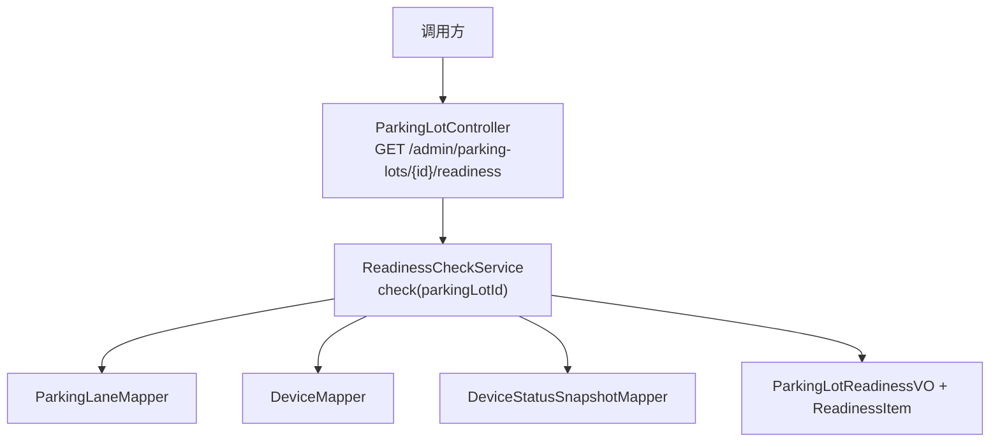
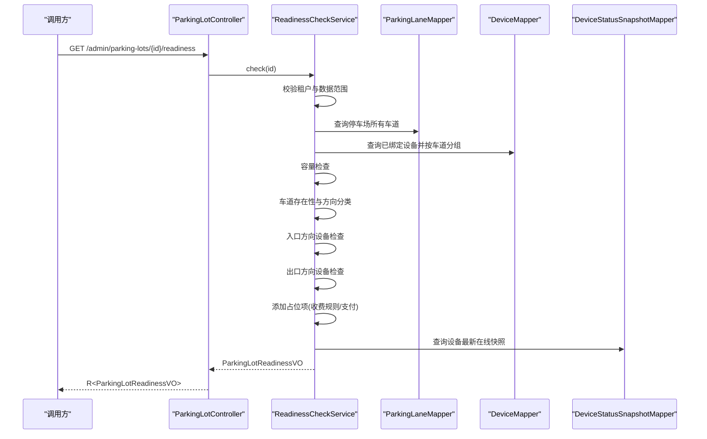
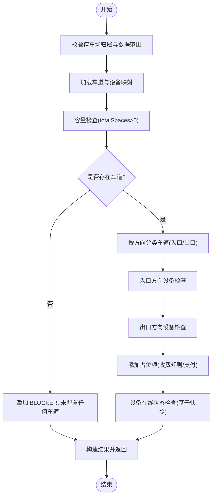
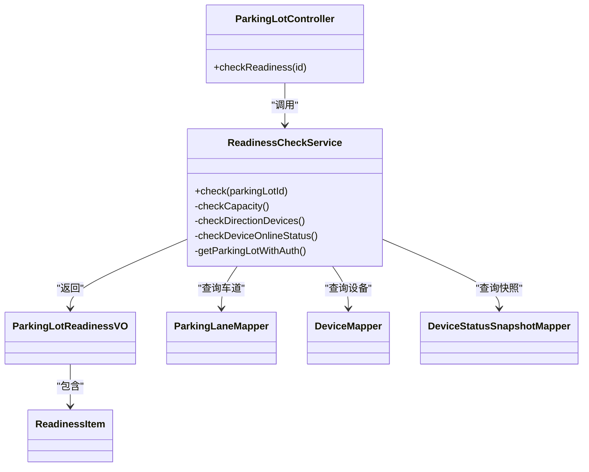

# 停车场就绪检查接口

<cite>
**本文引用的文件列表**
- [ParkingLotController.java](file://parking-system/src/main/java/com/jushan/system/controller/ParkingLotController.java)
- [ReadinessCheckService.java](file://parking-system/src/main/java/com/jushan/system/service/ReadinessCheckService.java)
- [ParkingLotReadinessVO.java](file://parking-system/src/main/java/com/jushan/system/vo/ParkingLotReadinessVO.java)
- [ReadinessItem.java](file://parking-system/src/main/java/com/jushan/system/vo/ReadinessItem.java)
- [ReadinessCheckIntegrationTest.java](file://parking-boot/src/test/java/com/jushan/boot/controller/ReadinessCheckIntegrationTest.java)
</cite>

## 目录
1. [简介](#简介)
2. [项目结构](#项目结构)
3. [核心组件](#核心组件)
4. [架构总览](#架构总览)
5. [详细组件分析](#详细组件分析)
6. [依赖关系分析](#依赖关系分析)
7. [性能与可用性考虑](#性能与可用性考虑)
8. [故障排查指南](#故障排查指南)
9. [结论](#结论)
10. [附录：API 定义与示例](#附录api-定义与示例)

## 简介
本接口用于在启用停车场前进行“就绪检查”，覆盖车道配置、设备绑定、执行相机、容量等关键项，并返回 BLOCKER（阻塞）和 WARNING（提示）两类检查结果。未实现模块以占位项明确标记 implemented=false，避免误判为通过。前端可据此决定是否允许启用以及需要引导用户完成哪些配置。

## 项目结构
该能力位于 parking-system 模块中，由控制器暴露 HTTP 接口，服务层实现具体检查逻辑，VO 对象承载返回结构。

图示来源
- [ParkingLotController.java:157-164](file://parking-system/src/main/java/com/jushan/system/controller/ParkingLotController.java#L157-L164)
- [ReadinessCheckService.java:95-161](file://parking-system/src/main/java/com/jushan/system/service/ReadinessCheckService.java#L95-L161)
- [ParkingLotReadinessVO.java:14-50](file://parking-system/src/main/java/com/jushan/system/vo/ParkingLotReadinessVO.java#L14-L50)
- [ReadinessItem.java:12-89](file://parking-system/src/main/java/com/jushan/system/vo/ReadinessItem.java#L12-L89)

章节来源
- [ParkingLotController.java:143-165](file://parking-system/src/main/java/com/jushan/system/controller/ParkingLotController.java#L143-L165)
- [ReadinessCheckService.java:29-161](file://parking-system/src/main/java/com/jushan/system/service/ReadinessCheckService.java#L29-L161)

## 核心组件
- 控制器：提供 GET /admin/parking-lots/{id}/readiness，权限要求 parking:read。
- 服务：ReadinessCheckService.check 负责数据读取与规则校验，汇总 BLOCKER/WARNING 结果。
- 返回值：ParkingLotReadinessVO 包含 ready、blockerCount、warningCount 及 items 明细；每条 ReadinessItem 含 code、level、category、message、laneName、implemented。

章节来源
- [ParkingLotController.java:157-164](file://parking-system/src/main/java/com/jushan/system/controller/ParkingLotController.java#L157-L164)
- [ReadinessCheckService.java:95-161](file://parking-system/src/main/java/com/jushan/system/service/ReadinessCheckService.java#L95-L161)
- [ParkingLotReadinessVO.java:14-50](file://parking-system/src/main/java/com/jushan/system/vo/ParkingLotReadinessVO.java#L14-L50)
- [ReadinessItem.java:12-89](file://parking-system/src/main/java/com/jushan/system/vo/ReadinessItem.java#L12-L89)

## 架构总览
请求进入控制器后，服务层依次执行以下检查：
- 容量检查：totalSpaces 必须大于 0
- 车道存在性：至少一条入口/出口方向车道
- 方向设备检查：入口/出口分别检查相机、道闸、执行相机是否齐全且启用
- 占位项：收费规则、支付配置尚未实现，标记 implemented=false
- 设备在线状态：基于最新快照判断在线/离线/未知/过期

图示来源
- [ParkingLotController.java:157-164](file://parking-system/src/main/java/com/jushan/system/controller/ParkingLotController.java#L157-L164)
- [ReadinessCheckService.java:95-161](file://parking-system/src/main/java/com/jushan/system/service/ReadinessCheckService.java#L95-L161)
- [ReadinessCheckService.java:292-345](file://parking-system/src/main/java/com/jushan/system/service/ReadinessCheckService.java#L292-L345)

## 详细组件分析

### 接口定义
- 路径：GET /admin/parking-lots/{id}/readiness
- 权限：parking:read
- 入参：path id（Long）
- 出参：R<ParkingLotReadinessVO>

章节来源
- [ParkingLotController.java:157-164](file://parking-system/src/main/java/com/jushan/system/controller/ParkingLotController.java#L157-L164)

### 返回结构：ParkingLotReadinessVO
- parkingLotId：停车场 ID
- parkingLotName：停车场名称
- ready：整体是否就绪（无 BLOCKER 即为 true）
- blockerCount：BLOCKER 数量
- warningCount：WARNING 数量
- items：检查项明细列表

章节来源
- [ParkingLotReadinessVO.java:14-50](file://parking-system/src/main/java/com/jushan/system/vo/ParkingLotReadinessVO.java#L14-L50)

### 检查项：ReadinessItem
- code：检查编码（如 NO_ENTRY_LANE、ENTRY_CAMERA_MISSING 等）
- level：严重级别（BLOCKER 或 WARNING）
- category：分类（LANE、DEVICE、CAPACITY、CHARGE_RULE、PAYMENT、DEVICE_STATUS）
- message：可读中文消息
- laneName：关联车道名（非车道级检查时为 null）
- implemented：后端逻辑是否已实现（false 表示占位）

工厂方法约定：
- blocker(...) → level=BLOCKER, implemented=true
- warning(...) → level=WARNING, implemented=true
- placeholder(...) → level=WARNING, implemented=false

章节来源
- [ReadinessItem.java:12-89](file://parking-system/src/main/java/com/jushan/system/vo/ReadinessItem.java#L12-L89)

### 检查规则与处理流程

图示来源
- [ReadinessCheckService.java:95-161](file://parking-system/src/main/java/com/jushan/system/service/ReadinessCheckService.java#L95-L161)
- [ReadinessCheckService.java:165-171](file://parking-system/src/main/java/com/jushan/system/service/ReadinessCheckService.java#L165-L171)
- [ReadinessCheckService.java:187-276](file://parking-system/src/main/java/com/jushan/system/service/ReadinessCheckService.java#L187-L276)
- [ReadinessCheckService.java:292-345](file://parking-system/src/main/java/com/jushan/system/service/ReadinessCheckService.java#L292-L345)

#### 阻塞级别（BLOCKER）与警告级别（WARNING）
- BLOCKER：阻止启用停车场，需修复后方可启用
- WARNING：仅提示，不阻止启用，但建议尽快处理
- 未实现模块：使用 placeholder 构造的项，level=WARNING 且 implemented=false，不得假通过

章节来源
- [ReadinessCheckService.java:147-153](file://parking-system/src/main/java/com/jushan/system/service/ReadinessCheckService.java#L147-L153)
- [ReadinessItem.java:50-53](file://parking-system/src/main/java/com/jushan/system/vo/ReadinessItem.java#L50-L53)

#### 关键检查项说明
- 容量检查：totalSpaces 为空或 ≤0 → BLOCKER
- 车道存在性：无任何车道 → BLOCKER；缺少入口或出口方向 → BLOCKER
- 方向设备检查（入口/出口分别评估）：
  - 单条车道维度：
    - 未绑定相机 → WARNING
    - 相机已停用 → WARNING
    - 未绑定道闸 → WARNING
    - 道闸已停用 → WARNING
    - 道闸未设置执行相机 → WARNING
  - 方向维度汇总：
    - 若任一车道完全就绪（有启用相机+启用道闸+道闸有执行相机），则方向维度不产生 BLOCKER
    - 否则根据缺失情况产生对应 BLOCKER（相机缺失/停用、道闸缺失/停用、道闸无执行相机）
- 占位项：收费规则、支付配置 → WARNING + implemented=false
- 设备在线状态（基于快照）：
  - 从未查询过状态 → WARNING
  - 快照过期（超过阈值）→ WARNING
  - 明确离线 → WARNING

章节来源
- [ReadinessCheckService.java:165-171](file://parking-system/src/main/java/com/jushan/system/service/ReadinessCheckService.java#L165-L171)
- [ReadinessCheckService.java:187-276](file://parking-system/src/main/java/com/jushan/system/service/ReadinessCheckService.java#L187-L276)
- [ReadinessCheckService.java:292-345](file://parking-system/src/main/java/com/jushan/system/service/ReadinessCheckService.java#L292-L345)

## 依赖关系分析
- 控制器依赖服务层，服务层依赖多个 Mapper 访问数据库
- 服务层内部对设备状态快照进行查询，结合时间阈值判定是否过期
- 权限与数据范围校验在服务层内完成，确保跨租户隔离

图示来源
- [ParkingLotController.java:157-164](file://parking-system/src/main/java/com/jushan/system/controller/ParkingLotController.java#L157-L164)
- [ReadinessCheckService.java:95-161](file://parking-system/src/main/java/com/jushan/system/service/ReadinessCheckService.java#L95-L161)
- [ParkingLotReadinessVO.java:14-50](file://parking-system/src/main/java/com/jushan/system/vo/ParkingLotReadinessVO.java#L14-L50)
- [ReadinessItem.java:12-89](file://parking-system/src/main/java/com/jushan/system/vo/ReadinessItem.java#L12-L89)

章节来源
- [ReadinessCheckService.java:69-87](file://parking-system/src/main/java/com/jushan/system/service/ReadinessCheckService.java#L69-L87)

## 性能与可用性考虑
- 批量查询优化：先一次性查询停车场所有车道与设备，再按车道分组，减少多次往返
- 快照过期阈值：默认 120 秒，可根据实际部署调整
- 日志统计：记录 BLOCKER/WARNING 计数，便于监控与排障
- 幂等性：就绪检查为只读操作，天然幂等

[本节为通用指导，无需源码引用]

## 故障排查指南
- 未配置任何车道：检查是否已创建并保存车道记录
- 缺少入口/出口方向：确认车道 direction 字段是否为 ENTRY/MIXED 或 EXIT/MIXED
- 相机/道闸缺失或未启用：核对设备绑定与设备状态
- 道闸未设置执行相机：确认道闸设备的执行相机关联字段
- 总车位数为 0 或空：更新停车场 totalSpaces
- 设备离线或状态未知：检查设备状态快照采集链路是否正常
- 权限拒绝：确认当前用户具备 parking:read 权限
- 跨租户访问被拒：确认当前会话所属租户与目标停车场一致

章节来源
- [ReadinessCheckService.java:127-171](file://parking-system/src/main/java/com/jushan/system/service/ReadinessCheckService.java#L127-L171)
- [ReadinessCheckService.java:292-345](file://parking-system/src/main/java/com/jushan/system/service/ReadinessCheckService.java#L292-L345)
- [ParkingLotController.java:157-164](file://parking-system/src/main/java/com/jushan/system/controller/ParkingLotController.java#L157-L164)

## 结论
该就绪检查接口以“最小必要”的方式帮助运营人员在启用停车场前快速定位问题，并通过 BLOCKER/WARNING 两级分级与 implemented 标记，兼顾了当前能力边界与后续扩展。建议在前端将 BLOCKER 作为禁用启用的硬性条件，WARNING 作为待办清单展示。

[本节为总结性内容，无需源码引用]

## 附录：API 定义与示例

### 接口定义
- 方法：GET
- 路径：/admin/parking-lots/{id}/readiness
- 权限：parking:read
- 响应体：R<ParkingLotReadinessVO>

章节来源
- [ParkingLotController.java:157-164](file://parking-system/src/main/java/com/jushan/system/controller/ParkingLotController.java#L157-L164)

### 返回结构说明
- ParkingLotReadinessVO
  - parkingLotId：Long
  - parkingLotName：String
  - ready：boolean（无 BLOCKER 为 true）
  - blockerCount：int
  - warningCount：int
  - items：List<ReadinessItem>
- ReadinessItem
  - code：String
  - level：String（BLOCKER 或 WARNING）
  - category：String（LANE/DEVICE/CAPACITY/CHARGE_RULE/PAYMENT/DEVICE_STATUS）
  - message：String
  - laneName：String（可为 null）
  - implemented：boolean（false 表示占位）

章节来源
- [ParkingLotReadinessVO.java:14-50](file://parking-system/src/main/java/com/jushan/system/vo/ParkingLotReadinessVO.java#L14-L50)
- [ReadinessItem.java:12-89](file://parking-system/src/main/java/com/jushan/system/vo/ReadinessItem.java#L12-L89)

### 检查结果示例（示意）
以下为常见场景下的返回结构示意（字段含义见上表）：
- 完整配置（ready=true，blockerCount=0，warningCount≥0）
- 缺车道（ready=false，blockerCount≥1）
- 缺入口/出口方向（ready=false，blockerCount≥1）
- 缺相机/道闸/执行相机（ready=false，blockerCount≥1，同时逐车道出现 WARNING）
- 相机/道闸停用（ready=false，blockerCount≥1）
- 总车位为 0（ready=false，blockerCount≥1）
- 占位项（收费规则/支付/设备在线）→ WARNING 且 implemented=false

章节来源
- [ReadinessCheckIntegrationTest.java:29-68](file://parking-boot/src/test/java/com/jushan/boot/controller/ReadinessCheckIntegrationTest.java#L29-L68)
- [ReadinessCheckService.java:147-153](file://parking-system/src/main/java/com/jushan/system/service/ReadinessCheckService.java#L147-L153)