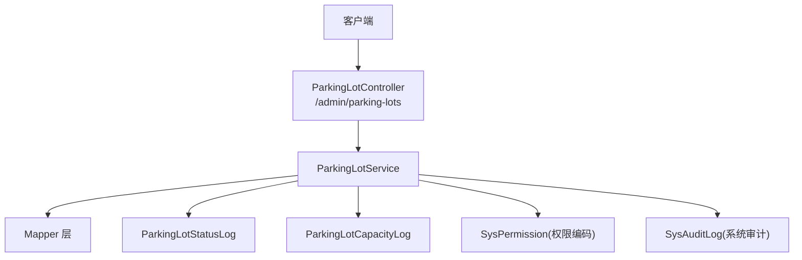
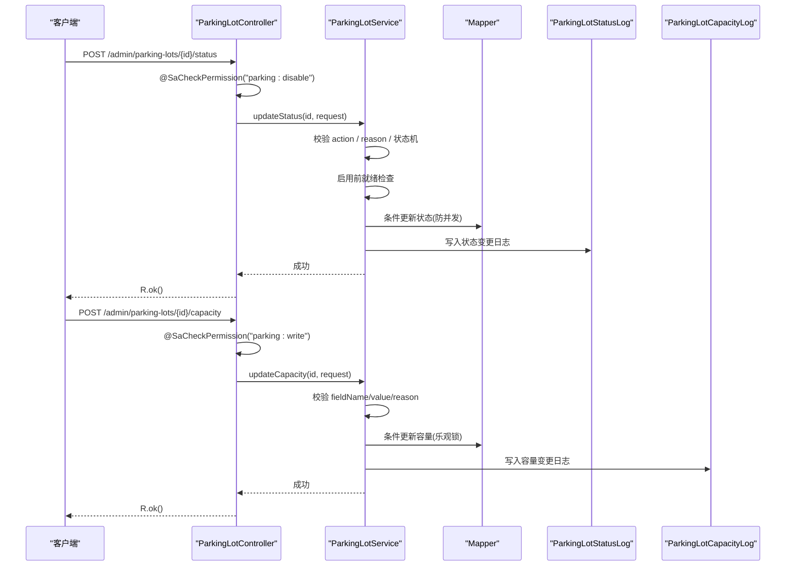
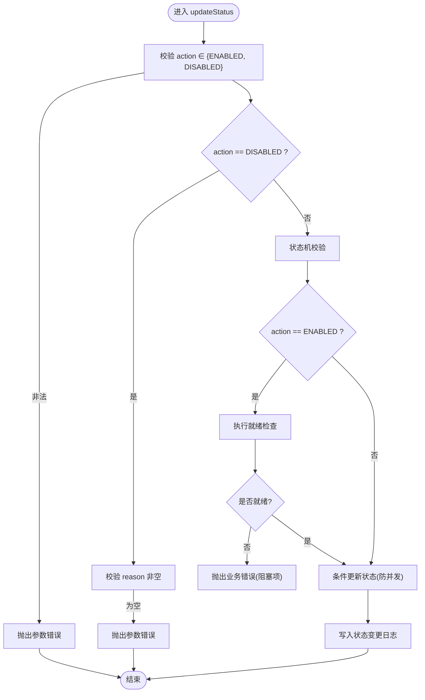
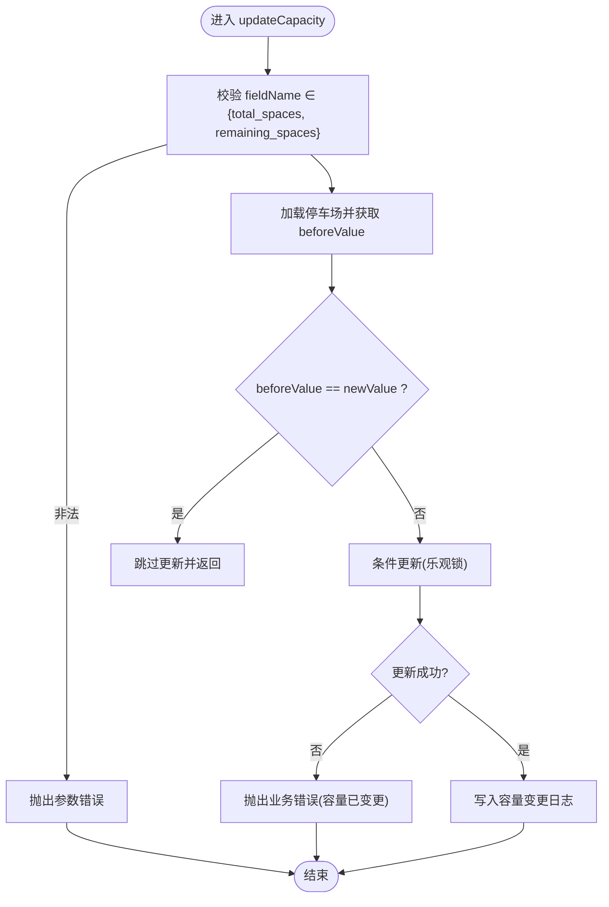
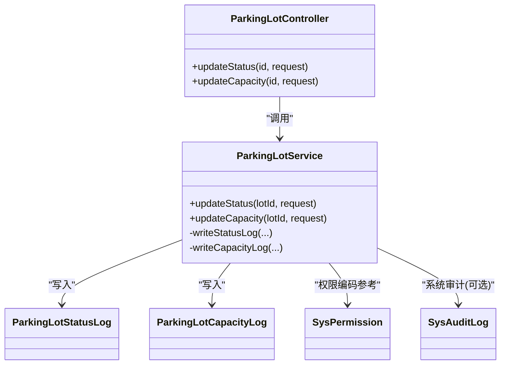

# 停车场状态与容量管理接口

<cite>
**本文引用的文件**   
- [ParkingLotController.java](file://parking-system/src/main/java/com/jushan/system/controller/ParkingLotController.java)
- [ParkingLotService.java](file://parking-system/src/main/java/com/jushan/system/service/ParkingLotService.java)
- [ParkingLotStatusRequest.java](file://parking-system/src/main/java/com/jushan/system/dto/ParkingLotStatusRequest.java)
- [ParkingLotCapacityRequest.java](file://parking-system/src/main/java/com/jushan/system/dto/ParkingLotCapacityRequest.java)
- [SysPermission.java](file://parking-system/src/main/java/com/jushan/system/entity/SysPermission.java)
- [SysAuditLog.java](file://parking-system/src/main/java/com/jushan/system/entity/SysAuditLog.java)
- [ParkingLotStatusLog.java](file://parking-system/src/main/java/com/jushan/system/entity/ParkingLotStatusLog.java)
- [ParkingLotCapacityLog.java](file://parking-system/src/main/java/com/jushan/system/entity/ParkingLotCapacityLog.java)
</cite>

## 目录
1. [简介](#简介)
2. [项目结构](#项目结构)
3. [核心组件](#核心组件)
4. [架构总览](#架构总览)
5. [详细组件分析](#详细组件分析)
6. [依赖关系分析](#依赖关系分析)
7. [性能考虑](#性能考虑)
8. [故障排查指南](#故障排查指南)
9. [结论](#结论)
10. [附录](#附录)

## 简介
本文件面向运营端与管理端，提供“停车场启用/停用”和“容量修改”两类接口的完整 API 文档。内容涵盖：
- 请求参数定义与校验规则（含必填项、取值范围）
- 权限控制差异（parking:disable 仅超级管理员与客户管理员可用）
- 完整的请求/响应示例
- 审计日志记录机制（业务变更日志与系统级审计日志）

## 项目结构
与本次文档相关的后端实现位于 parking-system 模块中，主要包含控制器、服务层、DTO 与实体类：
- 控制器：ParkingLotController
- 服务层：ParkingLotService
- 请求 DTO：ParkingLotStatusRequest、ParkingLotCapacityRequest
- 权限与审计实体：SysPermission、SysAuditLog
- 业务审计日志实体：ParkingLotStatusLog、ParkingLotCapacityLog

图表来源
- [ParkingLotController.java:35-166](file://parking-system/src/main/java/com/jushan/system/controller/ParkingLotController.java#L35-L166)
- [ParkingLotService.java:52-111](file://parking-system/src/main/java/com/jushan/system/service/ParkingLotService.java#L52-L111)
- [ParkingLotStatusLog.java:16-42](file://parking-system/src/main/java/com/jushan/system/entity/ParkingLotStatusLog.java#L16-L42)
- [ParkingLotCapacityLog.java:16-45](file://parking-system/src/main/java/com/jushan/system/entity/ParkingLotCapacityLog.java#L16-L45)
- [SysPermission.java:18-33](file://parking-system/src/main/java/com/jushan/system/entity/SysPermission.java#L18-L33)
- [SysAuditLog.java:19-69](file://parking-system/src/main/java/com/jushan/system/entity/SysAuditLog.java#L19-L69)

章节来源
- [ParkingLotController.java:35-166](file://parking-system/src/main/java/com/jushan/system/controller/ParkingLotController.java#L35-L166)
- [ParkingLotService.java:52-111](file://parking-system/src/main/java/com/jushan/system/service/ParkingLotService.java#L52-L111)

## 核心组件
- 控制器 ParkingLotController
  - 暴露 /admin/parking-lots/{id}/status 与 /admin/parking-lots/{id}/capacity 两个接口
  - 使用 @SaCheckPermission 进行权限校验
- 服务层 ParkingLotService
  - 实现启用/停用的状态流转、就绪检查、并发安全更新与审计日志写入
  - 实现容量字段的人工修正与审计日志写入
- 请求 DTO
  - ParkingLotStatusRequest：action、reason 及停用限制开关
  - ParkingLotCapacityRequest：fieldName、value、reason
- 审计与权限
  - SysPermission：权限编码模型（module:action）
  - SysAuditLog：高风险操作审计日志
  - ParkingLotStatusLog / ParkingLotCapacityLog：业务变更审计日志

章节来源
- [ParkingLotController.java:106-141](file://parking-system/src/main/java/com/jushan/system/controller/ParkingLotController.java#L106-L141)
- [ParkingLotService.java:316-475](file://parking-system/src/main/java/com/jushan/system/service/ParkingLotService.java#L316-L475)
- [ParkingLotStatusRequest.java:12-36](file://parking-system/src/main/java/com/jushan/system/dto/ParkingLotStatusRequest.java#L12-L36)
- [ParkingLotCapacityRequest.java:14-28](file://parking-system/src/main/java/com/jushan/system/dto/ParkingLotCapacityRequest.java#L14-L28)
- [SysPermission.java:18-33](file://parking-system/src/main/java/com/jushan/system/entity/SysPermission.java#L18-L33)
- [SysAuditLog.java:19-69](file://parking-system/src/main/java/com/jushan/system/entity/SysAuditLog.java#L19-L69)
- [ParkingLotStatusLog.java:16-42](file://parking-system/src/main/java/com/jushan/system/entity/ParkingLotStatusLog.java#L16-L42)
- [ParkingLotCapacityLog.java:16-45](file://parking-system/src/main/java/com/jushan/system/entity/ParkingLotCapacityLog.java#L16-L45)

## 架构总览
以下序列图展示“启用/停用”与“容量修改”的调用链路、权限校验、业务校验与审计落库过程。

图表来源
- [ParkingLotController.java:116-141](file://parking-system/src/main/java/com/jushan/system/controller/ParkingLotController.java#L116-L141)
- [ParkingLotService.java:329-475](file://parking-system/src/main/java/com/jushan/system/service/ParkingLotService.java#L329-L475)
- [ParkingLotStatusLog.java:16-42](file://parking-system/src/main/java/com/jushan/system/entity/ParkingLotStatusLog.java#L16-L42)
- [ParkingLotCapacityLog.java:16-45](file://parking-system/src/main/java/com/jushan/system/entity/ParkingLotCapacityLog.java#L16-L45)

## 详细组件分析

### 接口一：启用/停用停车场
- 接口路径
  - POST /admin/parking-lots/{id}/status
- 权限要求
  - parking:disable（仅超级管理员与客户管理员；停车场管理员无权）
- 请求体：ParkingLotStatusRequest
  - action: 必填，枚举 ENABLED/DISABLED
  - reason: 当 action=DISABLED 时必填；ENABLED 可选
  - disableNewEntries/disablePayment/disableExit/disableAutoGate/disableOnlyConfig: 停用时可选的限制开关（整数 0/1）
- 业务规则
  - 仅允许在 DISABLED↔ENABLED 之间切换
  - 启用前执行就绪检查，存在阻塞项则拒绝启用
  - 使用条件更新防止并发覆盖
- 响应
  - 统一返回 R<Void>，成功返回空数据
- 错误码与提示
  - 参数错误：无效 action、停用未填原因等
  - 业务错误：状态已变更、重复启用/停用、就绪不通过等
  - 未授权：无 parking:disable 权限或会话异常

图表来源
- [ParkingLotService.java:329-409](file://parking-system/src/main/java/com/jushan/system/service/ParkingLotService.java#L329-L409)
- [ParkingLotStatusRequest.java:12-36](file://parking-system/src/main/java/com/jushan/system/dto/ParkingLotStatusRequest.java#L12-L36)

章节来源
- [ParkingLotController.java:116-122](file://parking-system/src/main/java/com/jushan/system/controller/ParkingLotController.java#L116-L122)
- [ParkingLotService.java:329-409](file://parking-system/src/main/java/com/jushan/system/service/ParkingLotService.java#L329-L409)
- [ParkingLotStatusRequest.java:12-36](file://parking-system/src/main/java/com/jushan/system/dto/ParkingLotStatusRequest.java#L12-L36)

#### 请求/响应示例
- 启用停车场
  - 请求
    - URL: POST /admin/parking-lots/123/status
    - Body: {"action":"ENABLED","reason":"就绪检查通过，恢复运营"}
  - 响应
    - { "code": 200, "data": null }
- 停用停车场
  - 请求
    - URL: POST /admin/parking-lots/123/status
    - Body: {"action":"DISABLED","reason":"设备离线，暂停入场","disableNewEntries":0,"disablePayment":0,"disableExit":0,"disableAutoGate":0,"disableOnlyConfig":0}
  - 响应
    - { "code": 200, "data": null }

### 接口二：修改容量（总车位/剩余车位人工修正）
- 接口路径
  - POST /admin/parking-lots/{id}/capacity
- 权限要求
  - parking:write（客户管理员与停车场管理员均可）
- 请求体：ParkingLotCapacityRequest
  - fieldName: 必填，枚举 total_spaces / remaining_spaces
  - value: 必填，≥0
  - reason: 必填，最长 255 字符
- 业务规则
  - 仅支持对 total_spaces 或 remaining_spaces 进行修改
  - 若前后值相同则跳过更新
  - 使用乐观锁（基于 beforeValue）防止并发覆盖
- 响应
  - 统一返回 R<Void>，成功返回空数据
- 错误码与提示
  - 参数错误：非法 fieldName、value 为负数、reason 为空等
  - 业务错误：容量已被他人修改导致更新失败

图表来源
- [ParkingLotService.java:422-475](file://parking-system/src/main/java/com/jushan/system/service/ParkingLotService.java#L422-L475)
- [ParkingLotCapacityRequest.java:14-28](file://parking-system/src/main/java/com/jushan/system/dto/ParkingLotCapacityRequest.java#L14-L28)

章节来源
- [ParkingLotController.java:134-141](file://parking-system/src/main/java/com/jushan/system/controller/ParkingLotController.java#L134-L141)
- [ParkingLotService.java:422-475](file://parking-system/src/main/java/com/jushan/system/service/ParkingLotService.java#L422-L475)
- [ParkingLotCapacityRequest.java:14-28](file://parking-system/src/main/java/com/jushan/system/dto/ParkingLotCapacityRequest.java#L14-L28)

#### 请求/响应示例
- 修改总车位
  - 请求
    - URL: POST /admin/parking-lots/123/capacity
    - Body: {"fieldName":"total_spaces","value":200,"reason":"新增一层车位"}
  - 响应
    - { "code": 200, "data": null }
- 人工修正剩余车位
  - 请求
    - URL: POST /admin/parking-lots/123/capacity
    - Body: {"fieldName":"remaining_spaces","value":150,"reason":"盘点后修正"}
  - 响应
    - { "code": 200, "data": null }

### 权限控制说明
- parking:read：查看列表与详情（管理员、财务、运维、岗亭均可用）
- parking:write：创建/编辑停车场、修改容量（客户管理员与停车场管理员）
- parking:disable：启用/停用停车场（仅超级管理员与客户管理员；停车场管理员无权）
- 权限编码模型由 SysPermission 维护，格式 module:action

章节来源
- [ParkingLotController.java:25-30](file://parking-system/src/main/java/com/jushan/system/controller/ParkingLotController.java#L25-L30)
- [SysPermission.java:18-33](file://parking-system/src/main/java/com/jushan/system/entity/SysPermission.java#L18-L33)

## 依赖关系分析
- 控制器依赖服务层完成业务处理
- 服务层依赖 Mapper 进行持久化，依赖审计实体写入日志
- 权限注解在控制器层生效，服务层再次做角色/租户上下文校验

图表来源
- [ParkingLotController.java:35-166](file://parking-system/src/main/java/com/jushan/system/controller/ParkingLotController.java#L35-L166)
- [ParkingLotService.java:500-544](file://parking-system/src/main/java/com/jushan/system/service/ParkingLotService.java#L500-L544)
- [ParkingLotStatusLog.java:16-42](file://parking-system/src/main/java/com/jushan/system/entity/ParkingLotStatusLog.java#L16-L42)
- [ParkingLotCapacityLog.java:16-45](file://parking-system/src/main/java/com/jushan/system/entity/ParkingLotCapacityLog.java#L16-L45)
- [SysPermission.java:18-33](file://parking-system/src/main/java/com/jushan/system/entity/SysPermission.java#L18-L33)
- [SysAuditLog.java:19-69](file://parking-system/src/main/java/com/jushan/system/entity/SysAuditLog.java#L19-L69)

## 性能考虑
- 启用/停用采用条件更新（基于当前状态），避免并发覆盖
- 容量修改采用乐观锁（基于 beforeValue），减少锁粒度
- 就绪检查仅在启用路径触发，避免不必要的开销
- 建议在高并发场景下结合分布式锁或幂等键进一步保障一致性（如需）

[本节为通用指导，无需代码引用]

## 故障排查指南
- 常见参数错误
  - action 不是 ENABLED/DISABLED
  - 停用未填写 reason
  - fieldName 不是 total_spaces/remaining_spaces
  - value < 0
- 常见业务错误
  - 状态已是目标状态（重复启用/停用）
  - 启用前就绪检查未通过（存在 BLOCKER）
  - 容量被他人修改导致更新失败（请刷新重试）
- 权限问题
  - 缺少 parking:disable 或 parking:write 权限
  - 会话过期或未登录
- 审计定位
  - 查看 ParkingLotStatusLog 与 ParkingLotCapacityLog 确认变更轨迹
  - 必要时结合 SysAuditLog 进行系统级审计回溯

章节来源
- [ParkingLotService.java:329-475](file://parking-system/src/main/java/com/jushan/system/service/ParkingLotService.java#L329-L475)
- [ParkingLotStatusLog.java:16-42](file://parking-system/src/main/java/com/jushan/system/entity/ParkingLotStatusLog.java#L16-L42)
- [ParkingLotCapacityLog.java:16-45](file://parking-system/src/main/java/com/jushan/system/entity/ParkingLotCapacityLog.java#L16-L45)
- [SysAuditLog.java:19-69](file://parking-system/src/main/java/com/jushan/system/entity/SysAuditLog.java#L19-L69)

## 结论
- 启用/停用接口具备严格的权限与状态机约束，并在启用前执行就绪检查
- 容量修改接口支持总车位与剩余车位的人工修正，具备完善的审计追踪
- 所有关键变更均落库至对应审计表，便于追溯与合规审查

[本节为总结性内容，无需代码引用]

## 附录

### 字段与枚举速查
- ParkingLotStatusRequest
  - action: 必填，ENABLED/DISABLED
  - reason: DISABLED 时必填
  - disableNewEntries/disablePayment/disableExit/disableAutoGate/disableOnlyConfig: 停用时可选限制开关（0/1）
- ParkingLotCapacityRequest
  - fieldName: 必填，total_spaces/remaining_spaces
  - value: 必填，≥0
  - reason: 必填，≤255 字符

章节来源
- [ParkingLotStatusRequest.java:12-36](file://parking-system/src/main/java/com/jushan/system/dto/ParkingLotStatusRequest.java#L12-L36)
- [ParkingLotCapacityRequest.java:14-28](file://parking-system/src/main/java/com/jushan/system/dto/ParkingLotCapacityRequest.java#L14-L28)