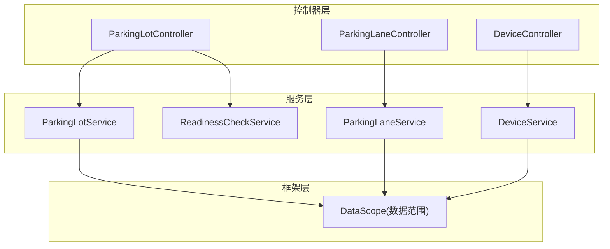
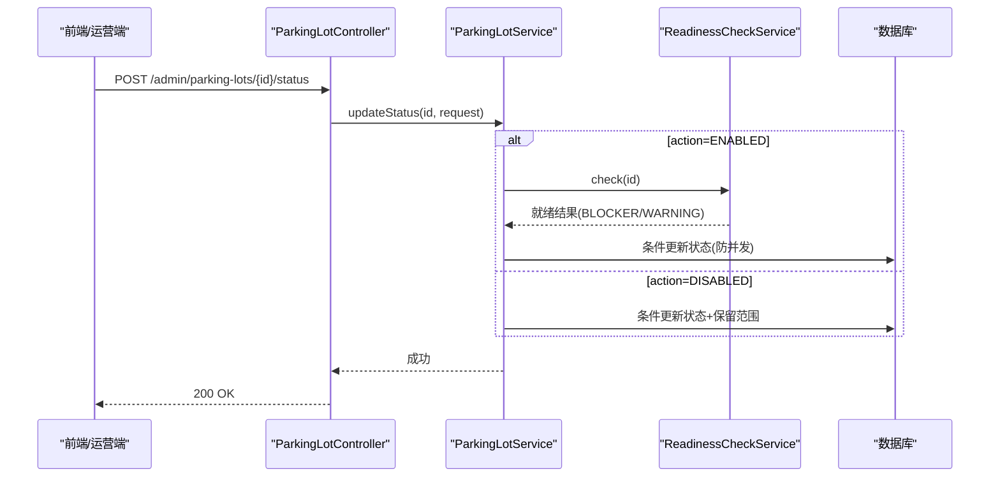
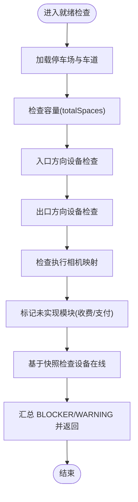
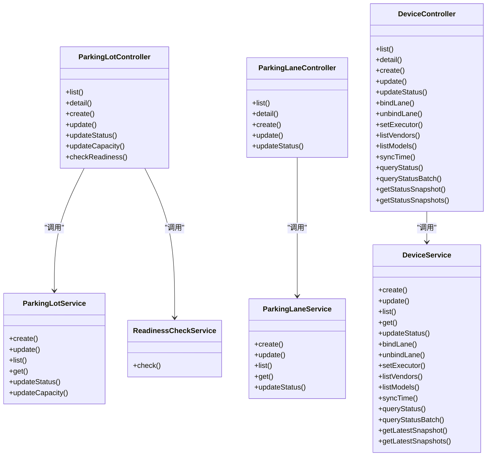

# 停车场管理接口

<cite>
**本文引用的文件**   
- [ParkingLotController.java](file://parking-system/src/main/java/com/jushan/system/controller/ParkingLotController.java)
- [ParkingLaneController.java](file://parking-system/src/main/java/com/jushan/system/controller/ParkingLaneController.java)
- [DeviceController.java](file://parking-system/src/main/java/com/jushan/system/controller/DeviceController.java)
- [ParkingLotService.java](file://parking-system/src/main/java/com/jushan/system/service/ParkingLotService.java)
- [ParkingLaneService.java](file://parking-system/src/main/java/com/jushan/system/service/ParkingLaneService.java)
- [DeviceService.java](file://parking-system/src/main/java/com/jushan/system/service/DeviceService.java)
- [ReadinessCheckService.java](file://parking-system/src/main/java/com/jushan/system/service/ReadinessCheckService.java)
- [ParkingLotReadinessVO.java](file://parking-system/src/main/java/com/jushan/system/vo/ParkingLotReadinessVO.java)
- [DataScope.java](file://parking-framework/src/main/java/com/jushan/framework/auth/DataScope.java)
- [section_04_api.md](file://docs/开发计划/section_04_api.md)
- [parking-lane.ts](file://admin-web/src/api/parking-lane.ts)
</cite>

## 目录
1. [简介](#简介)
2. [项目结构](#项目结构)
3. [核心组件](#核心组件)
4. [架构总览](#架构总览)
5. [详细组件分析](#详细组件分析)
6. [依赖关系分析](#依赖关系分析)
7. [性能与容量监控](#性能与容量监控)
8. [故障排查指南](#故障排查指南)
9. [结论](#结论)
10. [附录：API 规范与示例](#附录api-规范与示例)

## 简介
本文件为“智慧停车 SaaS 平台”的停车场管理接口文档，覆盖以下能力：
- 停车场 CRUD、状态管理（启用/停用）、容量变更与审计
- 车道管理（创建/更新/启停）及方向策略
- 设备台账管理（厂商/型号、绑定/解绑、执行相机设置）
- 设备实时状态查询与快照、批量查询限流
- 设备校时命令与审计记录
- 多租户数据隔离与权限控制
- 就绪检查（启用前校验）
- 性能优化建议与最佳实践

说明：
- 所有写操作需携带鉴权令牌；读接口需具备对应只读权限。
- 多租户隔离通过上下文推导 tenant_id，不信任前端传入的 tenantId。
- 当前 Device Access v0.2 未实现开闸等部分能力，相关占位逻辑已标注。

## 项目结构
后端采用分层架构：
- Controller 层：REST 接口定义、参数校验、权限注解
- Service 层：业务规则、事务、并发控制、审计日志
- Mapper 层：数据访问
- Framework 层：多租户上下文、数据范围、全局异常处理等

图表来源
- [ParkingLotController.java:35-165](file://parking-system/src/main/java/com/jushan/system/controller/ParkingLotController.java#L35-L165)
- [ParkingLaneController.java:32-121](file://parking-system/src/main/java/com/jushan/system/controller/ParkingLaneController.java#L32-L121)
- [DeviceController.java:38-314](file://parking-system/src/main/java/com/jushan/system/controller/DeviceController.java#L38-L314)
- [ParkingLotService.java:49-105](file://parking-system/src/main/java/com/jushan/system/service/ParkingLotService.java#L49-L105)
- [ParkingLaneService.java:59-96](file://parking-system/src/main/java/com/jushan/system/service/ParkingLaneService.java#L59-L96)
- [DeviceService.java:70-136](file://parking-system/src/main/java/com/jushan/system/service/DeviceService.java#L70-L136)
- [DataScope.java:158-179](file://parking-framework/src/main/java/com/jushan/framework/auth/DataScope.java#L158-L179)

章节来源
- [ParkingLotController.java:35-165](file://parking-system/src/main/java/com/jushan/system/controller/ParkingLotController.java#L35-L165)
- [ParkingLaneController.java:32-121](file://parking-system/src/main/java/com/jushan/system/controller/ParkingLaneController.java#L32-L121)
- [DeviceController.java:38-314](file://parking-system/src/main/java/com/jushan/system/controller/DeviceController.java#L38-L314)

## 核心组件
- 停车场管理
  - 列表/详情/创建/更新
  - 启用/停用（含就绪检查）
  - 容量变更（总车位/剩余车位人工修正）
- 车道管理
  - 列表/详情/创建/更新
  - 启停、方向与自动放行策略
- 设备管理
  - 厂商/型号查询
  - 设备 CRUD、启停
  - 设备与车道绑定/解绑、GATE 执行相机设置
  - 设备校时、状态查询与快照、批量查询限流

章节来源
- [ParkingLotController.java:50-165](file://parking-system/src/main/java/com/jushan/system/controller/ParkingLotController.java#L50-L165)
- [ParkingLaneController.java:44-121](file://parking-system/src/main/java/com/jushan/system/controller/ParkingLaneController.java#L44-L121)
- [DeviceController.java:50-314](file://parking-system/src/main/java/com/jushan/system/controller/DeviceController.java#L50-L314)

## 架构总览

图表来源
- [ParkingLotController.java:116-122](file://parking-system/src/main/java/com/jushan/system/controller/ParkingLotController.java#L116-L122)
- [ParkingLotService.java:312-411](file://parking-system/src/main/java/com/jushan/system/service/ParkingLotService.java#L312-L411)
- [ReadinessCheckService.java:144-171](file://parking-system/src/main/java/com/jushan/system/service/ReadinessCheckService.java#L144-L171)

## 详细组件分析

### 停车场管理 API
- 基础信息
  - GET /admin/parking-lots — 分页列表（支持 status 筛选）
  - GET /admin/parking-lots/{id} — 详情
  - POST /admin/parking-lots — 创建（默认初始状态为停用）
  - PUT /admin/parking-lots/{id} — 更新基础信息（不含容量与状态）
- 状态管理
  - POST /admin/parking-lots/{id}/status — 启用/停用（启用前进行就绪检查）
- 容量管理
  - POST /admin/parking-lots/{id}/capacity — 修改 total_spaces 或 remaining_spaces（必填原因，写入审计）
- 就绪检查
  - GET /admin/parking-lots/{id}/readiness — 返回 BLOCKER/WARNING 项

权限要求
- parking:read：列表、详情、就绪检查
- parking:write：创建、更新、容量变更
- parking:disable：启用/停用（仅超级管理员与客户管理员）

关键业务规则
- 新停车场默认停用，必须通过就绪检查后方可启用
- 启用/停用使用条件更新防止并发覆盖
- 停用可配置保留范围（入场/缴费/出场/自动开闸/仅限制后台配置）
- 容量变更前后值写入审计表

请求/响应要点
- 列表分页：page、size、status
- 状态变更：action 枚举 ENABLED/DISABLED；停用需 reason
- 容量变更：fieldName 枚举 total_spaces/remaining_spaces；value 整数；reason 必填
- 就绪检查：返回 ready、blockerCount、warningCount、items[]

章节来源
- [ParkingLotController.java:50-165](file://parking-system/src/main/java/com/jushan/system/controller/ParkingLotController.java#L50-L165)
- [ParkingLotService.java:118-165](file://parking-system/src/main/java/com/jushan/system/service/ParkingLotService.java#L118-L165)
- [ParkingLotService.java:264-286](file://parking-system/src/main/java/com/jushan/system/service/ParkingLotService.java#L264-L286)
- [ParkingLotService.java:312-411](file://parking-system/src/main/java/com/jushan/system/service/ParkingLotService.java#L312-L411)
- [ParkingLotService.java:424-477](file://parking-system/src/main/java/com/jushan/system/service/ParkingLotService.java#L424-L477)
- [ParkingLotReadinessVO.java:1-50](file://parking-system/src/main/java/com/jushan/system/vo/ParkingLotReadinessVO.java#L1-L50)
- [ReadinessCheckService.java:144-171](file://parking-system/src/main/java/com/jushan/system/service/ReadinessCheckService.java#L144-L171)

### 车道管理 API
- 列表/详情/创建/更新
  - GET /admin/lanes — 分页（parkingLotId 必填，支持 status/direction 筛选）
  - GET /admin/lanes/{id} — 详情（包含绑定设备列表）
  - POST /admin/lanes — 创建（direction 枚举 ENTRY/EXIT/MIXED；autoReleasePolicy 枚举 AUTO/MANUAL/AFTER_PAY）
  - PUT /admin/lanes/{id} — 部分更新（编码唯一性校验）
- 启停
  - POST /admin/lanes/{id}/status — action 枚举 ENABLED/DISABLED

权限要求
- parking:read：列表、详情
- parking:write：创建、更新、启停

关键业务规则
- 同一停车场内 lane.code 唯一
- 方向与自动放行策略枚举校验
- 启停使用条件更新防止并发覆盖

章节来源
- [ParkingLaneController.java:44-121](file://parking-system/src/main/java/com/jushan/system/controller/ParkingLaneController.java#L44-L121)
- [ParkingLaneService.java:108-155](file://parking-system/src/main/java/com/jushan/system/service/ParkingLaneService.java#L108-L155)
- [ParkingLaneService.java:166-231](file://parking-system/src/main/java/com/jushan/system/service/ParkingLaneService.java#L166-L231)
- [ParkingLaneService.java:248-276](file://parking-system/src/main/java/com/jushan/system/service/ParkingLaneService.java#L248-L276)
- [ParkingLaneService.java:301-331](file://parking-system/src/main/java/com/jushan/system/service/ParkingLaneService.java#L301-L331)

### 设备管理 API
- 厂商/型号
  - GET /admin/devices/vendors — 启用厂商列表
  - GET /admin/devices/models?vendorId=... — 启用型号列表（可选按厂商）
- 设备 CRUD
  - GET /admin/devices — 分页（parkingLotId 必填，支持 status/deviceType 筛选）
  - GET /admin/devices/{id} — 详情
  - POST /admin/devices — 创建（同厂商 device_sn 唯一；同停车场 code 唯一）
  - PUT /admin/devices/{id} — 部分更新（禁止直接传 device_sn）
  - POST /admin/devices/{id}/status — 启停
- 车道绑定关系
  - POST /admin/devices/{id}/bind-lane — 绑定到车道（同类型设备在同一车道唯一）
  - DELETE /admin/devices/{id}/bind-lane — 解绑（同时清空 executor）
  - POST /admin/devices/{id}/executor — 为 GATE 设置执行相机（必须与 GATE 同车道、同停车场、已启用且类型为 CAMERA）
- 设备校时
  - POST /admin/devices/{id}/sync-time — 调用 Device Access 校时并持久化审计
- 设备状态查询与快照
  - POST /admin/devices/{id}/query-status — 实时查询（触发 DA HTTP 调用并落盘快照）
  - POST /admin/devices/query-status-batch — 批量实时查询（并发度限制）
  - GET /admin/devices/{id}/status — 最新快照（不触发 DA）
  - POST /admin/devices/status-snapshots — 批量获取快照

权限要求
- device:read：列表、详情、厂商/型号、快照
- device:manage：CRUD、启停、绑定/解绑、执行相机、校时、实时查询

关键业务规则
- 设备与车道必须在同一停车场；同车道同类型设备唯一
- GATE 绑定后需重新指定执行相机
- 设备状态快照过期阈值 60 秒，前端据此显示 stale
- 批量实时查询最大单次 50 台，并发度 5（信号量限流）

章节来源
- [DeviceController.java:50-314](file://parking-system/src/main/java/com/jushan/system/controller/DeviceController.java#L50-L314)
- [DeviceService.java:148-211](file://parking-system/src/main/java/com/jushan/system/service/DeviceService.java#L148-L211)
- [DeviceService.java:224-283](file://parking-system/src/main/java/com/jushan/system/service/DeviceService.java#L224-L283)
- [DeviceService.java:299-334](file://parking-system/src/main/java/com/jushan/system/service/DeviceService.java#L299-L334)
- [DeviceService.java:375-404](file://parking-system/src/main/java/com/jushan/system/service/DeviceService.java#L375-L404)
- [DeviceService.java:418-478](file://parking-system/src/main/java/com/jushan/system/service/DeviceService.java#L418-L478)
- [DeviceService.java:486-509](file://parking-system/src/main/java/com/jushan/system/service/DeviceService.java#L486-L509)
- [DeviceService.java:521-560](file://parking-system/src/main/java/com/jushan/system/service/DeviceService.java#L521-L560)
- [DeviceService.java:575-615](file://parking-system/src/main/java/com/jushan/system/service/DeviceService.java#L575-L615)
- [DeviceService.java:786-849](file://parking-system/src/main/java/com/jushan/system/service/DeviceService.java#L786-L849)
- [DeviceService.java:867-929](file://parking-system/src/main/java/com/jushan/system/service/DeviceService.java#L867-L929)
- [DeviceService.java:940-972](file://parking-system/src/main/java/com/jushan/system/service/DeviceService.java#L940-L972)

### 多租户与权限控制
- 多租户隔离
  - 所有接口从会话推导 tenant_id，不信任前端传入
  - 受限角色（如停车场管理员、设备运维）仅能访问授权停车场（P0 停车场级数据范围）
- 权限点
  - parking:read/write/disable
  - device:read/manage
- 平台用户可跨租户访问；租户用户受限于 DataScope 解析的范围

章节来源
- [DataScope.java:158-179](file://parking-framework/src/main/java/com/jushan/framework/auth/DataScope.java#L158-L179)
- [ParkingLotService.java:264-286](file://parking-system/src/main/java/com/jushan/system/service/ParkingLotService.java#L264-L286)
- [ParkingLaneService.java:354-363](file://parking-system/src/main/java/com/jushan/system/service/ParkingLaneService.java#L354-L363)
- [DeviceService.java:1044-1069](file://parking-system/src/main/java/com/jushan/system/service/DeviceService.java#L1044-L1069)

### 就绪检查流程

图表来源
- [ReadinessCheckService.java:144-171](file://parking-system/src/main/java/com/jushan/system/service/ReadinessCheckService.java#L144-L171)
- [ParkingLotReadinessVO.java:1-50](file://parking-system/src/main/java/com/jushan/system/vo/ParkingLotReadinessVO.java#L1-L50)

## 依赖关系分析

图表来源
- [ParkingLotController.java:35-165](file://parking-system/src/main/java/com/jushan/system/controller/ParkingLotController.java#L35-L165)
- [ParkingLotService.java:49-105](file://parking-system/src/main/java/com/jushan/system/service/ParkingLotService.java#L49-L105)
- [ReadinessCheckService.java:144-171](file://parking-system/src/main/java/com/jushan/system/service/ReadinessCheckService.java#L144-L171)
- [ParkingLaneController.java:32-121](file://parking-system/src/main/java/com/jushan/system/controller/ParkingLaneController.java#L32-L121)
- [ParkingLaneService.java:59-96](file://parking-system/src/main/java/com/jushan/system/service/ParkingLaneService.java#L59-L96)
- [DeviceController.java:38-314](file://parking-system/src/main/java/com/jushan/system/controller/DeviceController.java#L38-L314)
- [DeviceService.java:70-136](file://parking-system/src/main/java/com/jushan/system/service/DeviceService.java#L70-L136)

## 性能与容量监控
- 设备状态查询
  - 实时查询会触发外部 HTTP 调用，应仅在用户主动刷新时调用
  - 列表轮询优先使用快照接口，避免频繁网络开销
  - 批量实时查询限制单次最多 50 台，并发度 5，失败不影响其他设备
- 快照新鲜度
  - 超过 60 秒标记为 stale，前端展示“最后查询于 X 秒前”
- 容量监控
  - 容量变更写入审计表，便于追溯
  - 启用前就绪检查包含容量、设备在线等关键项

章节来源
- [DeviceService.java:786-849](file://parking-system/src/main/java/com/jushan/system/service/DeviceService.java#L786-L849)
- [DeviceService.java:867-929](file://parking-system/src/main/java/com/jushan/system/service/DeviceService.java#L867-L929)
- [DeviceService.java:940-972](file://parking-system/src/main/java/com/jushan/system/service/DeviceService.java#L940-L972)
- [ParkingLotService.java:424-477](file://parking-system/src/main/java/com/jushan/system/service/ParkingLotService.java#L424-L477)
- [ReadinessCheckService.java:144-171](file://parking-system/src/main/java/com/jushan/system/service/ReadinessCheckService.java#L144-L171)

## 故障排查指南
- 常见错误
  - 参数错误：无效的状态/方向/策略/设备类型等
  - 业务错误：重复绑定、状态已是目标状态、容量未变化跳过、设备/车道不属于同一停车场
  - 未实现：Device Access v0.2 未实现开闸等能力
- 定位方法
  - 查看统一返回码与消息
  - 关注审计日志（设备校时、容量变更、状态变更）
  - 设备状态快照中的 lastErrorCode/lastErrorMessage 字段

章节来源
- [DeviceController.java:140-183](file://parking-system/src/main/java/com/jushan/system/controller/DeviceController.java#L140-L183)
- [DeviceService.java:575-615](file://parking-system/src/main/java/com/jushan/system/service/DeviceService.java#L575-L615)
- [DeviceService.java:786-849](file://parking-system/src/main/java/com/jushan/system/service/DeviceService.java#L786-L849)

## 结论
本套接口围绕“停车场—车道—设备”的核心模型，提供完整的生命周期管理与运行态监控能力。通过多租户与数据范围控制保障安全隔离，结合就绪检查与审计机制提升上线质量与可追溯性。建议在后续迭代中完善计费、支付、无感支付等预留能力，并持续优化高并发场景下的限流与缓存策略。

## 附录：API 规范与示例

### 通用约定
- 鉴权：Authorization: Bearer {token}
- 多租户：tenant_id 由服务端从会话推导，超管可通过请求头显式指定
- 软删除：业务表含 deleted_at，删除为软删
- 金额：以字符串型整数分为主，内部使用高精度类型
- 车牌：大写并按规范校验，存储大写，查询忽略大小写
- 幂等：除明确只读接口外，POST/PUT/DELETE 建议携带幂等键（X-Idempotency-Key）
- 时间：ISO 8601

章节来源
- [section_04_api.md:28-39](file://docs/开发计划/section_04_api.md#L28-L39)

### 停车场接口清单与示例

- 列表
  - 路径：GET /admin/parking-lots
  - 参数：page, size, status(可选)
  - 响应：分页对象 records[] 包含 id/name/address/totalSpaces/currentVehicles/remainingSpaces/status 等
- 详情
  - 路径：GET /admin/parking-lots/{id}
  - 响应：同上单条对象
- 创建
  - 路径：POST /admin/parking-lots
  - 请求体：name, address, contactPhone, longitude, latitude, totalSpaces, paymentMode, imageRetentionDays, dataRetentionDays, freeExitMinutes, manualReleasePolicy, offlinePolicy, duplicateEntryPolicy
  - 响应：新建停车场 VO
- 更新
  - 路径：PUT /admin/parking-lots/{id}
  - 请求体：仅非空字段更新
- 启用/停用
  - 路径：POST /admin/parking-lots/{id}/status
  - 请求体：{ action:"ENABLED|DISABLED", reason?, disableNewEntries?, disablePayment?, disableExit?, disableAutoGate?, disableOnlyConfig? }
  - 说明：启用前进行就绪检查；停用需 reason
- 容量变更
  - 路径：POST /admin/parking-lots/{id}/capacity
  - 请求体：{ fieldName:"total_spaces|remaining_spaces", value:int, reason:string }
- 就绪检查
  - 路径：GET /admin/parking-lots/{id}/readiness
  - 响应：{ parkingLotId, parkingLotName, ready, blockerCount, warningCount, items:[{code,message,level,implemented}] }

章节来源
- [ParkingLotController.java:50-165](file://parking-system/src/main/java/com/jushan/system/controller/ParkingLotController.java#L50-L165)
- [ParkingLotService.java:118-165](file://parking-system/src/main/java/com/jushan/system/service/ParkingLotService.java#L118-L165)
- [ParkingLotService.java:312-411](file://parking-system/src/main/java/com/jushan/system/service/ParkingLotService.java#L312-L411)
- [ParkingLotService.java:424-477](file://parking-system/src/main/java/com/jushan/system/service/ParkingLotService.java#L424-L477)
- [ParkingLotReadinessVO.java:1-50](file://parking-system/src/main/java/com/jushan/system/vo/ParkingLotReadinessVO.java#L1-L50)

### 车道接口清单与示例

- 列表
  - 路径：GET /admin/lanes
  - 参数：page, size, parkingLotId(必填), status(可选), direction(可选)
  - 响应：分页对象 records[] 包含 id/parkingLotId/name/code/direction/status/isKeyLane/autoReleasePolicy/description/devices[]
- 详情
  - 路径：GET /admin/lanes/{id}
  - 响应：同上单条对象（含 devices[]）
- 创建
  - 路径：POST /admin/lanes
  - 请求体：{ parkingLotId, name, code, direction:"ENTRY|EXIT|MIXED", isKeyLane?:boolean, autoReleasePolicy:"AUTO|MANUAL|AFTER_PAY", description? }
- 更新
  - 路径：PUT /admin/lanes/{id}
  - 请求体：仅非空字段更新（code 唯一性校验）
- 启停
  - 路径：POST /admin/lanes/{id}/status
  - 请求体：{ action:"ENABLED|DISABLED" }

章节来源
- [ParkingLaneController.java:44-121](file://parking-system/src/main/java/com/jushan/system/controller/ParkingLaneController.java#L44-L121)
- [ParkingLaneService.java:108-155](file://parking-system/src/main/java/com/jushan/system/service/ParkingLaneService.java#L108-L155)
- [ParkingLaneService.java:166-231](file://parking-system/src/main/java/com/jushan/system/service/ParkingLaneService.java#L166-L231)
- [ParkingLaneService.java:248-276](file://parking-system/src/main/java/com/jushan/system/service/ParkingLaneService.java#L248-L276)
- [ParkingLaneService.java:301-331](file://parking-system/src/main/java/com/jushan/system/service/ParkingLaneService.java#L301-L331)

### 设备接口清单与示例

- 厂商/型号
  - GET /admin/devices/vendors
  - GET /admin/devices/models?vendorId=?
- 列表/详情/创建/更新/启停
  - GET /admin/devices
  - GET /admin/devices/{id}
  - POST /admin/devices
  - PUT /admin/devices/{id}
  - POST /admin/devices/{id}/status
- 绑定/解绑/执行相机
  - POST /admin/devices/{id}/bind-lane { laneId }
  - DELETE /admin/devices/{id}/bind-lane
  - POST /admin/devices/{id}/executor { executorDeviceId }
- 校时
  - POST /admin/devices/{id}/sync-time { reason? }
- 状态查询与快照
  - POST /admin/devices/{id}/query-status
  - POST /admin/devices/query-status-batch { deviceIds[] }
  - GET /admin/devices/{id}/status
  - POST /admin/devices/status-snapshots { deviceIds[] }

章节来源
- [DeviceController.java:50-314](file://parking-system/src/main/java/com/jushan/system/controller/DeviceController.java#L50-L314)
- [DeviceService.java:148-211](file://parking-system/src/main/java/com/jushan/system/service/DeviceService.java#L148-L211)
- [DeviceService.java:224-283](file://parking-system/src/main/java/com/jushan/system/service/DeviceService.java#L224-L283)
- [DeviceService.java:299-334](file://parking-system/src/main/java/com/jushan/system/service/DeviceService.java#L299-L334)
- [DeviceService.java:375-404](file://parking-system/src/main/java/com/jushan/system/service/DeviceService.java#L375-L404)
- [DeviceService.java:418-478](file://parking-system/src/main/java/com/jushan/system/service/DeviceService.java#L418-L478)
- [DeviceService.java:486-509](file://parking-system/src/main/java/com/jushan/system/service/DeviceService.java#L486-L509)
- [DeviceService.java:521-560](file://parking-system/src/main/java/com/jushan/system/service/DeviceService.java#L521-L560)
- [DeviceService.java:575-615](file://parking-system/src/main/java/com/jushan/system/service/DeviceService.java#L575-L615)
- [DeviceService.java:786-849](file://parking-system/src/main/java/com/jushan/system/service/DeviceService.java#L786-L849)
- [DeviceService.java:867-929](file://parking-system/src/main/java/com/jushan/system/service/DeviceService.java#L867-L929)
- [DeviceService.java:940-972](file://parking-system/src/main/java/com/jushan/system/service/DeviceService.java#L940-L972)

### 前端对接参考（管理端）
- 车道 API 封装（列表/详情/创建/更新/启停）
  - 参考文件：[parking-lane.ts](file://admin-web/src/api/parking-lane.ts)
- 设备绑定/解绑交互（UI 侧）
  - 参考文件：[device/index.vue](file://admin-web/src/views/device/index.vue)

章节来源
- [parking-lane.ts:1-58](file://admin-web/src/api/parking-lane.ts#L1-L58)
- [device/index.vue:349-385](file://admin-web/src/views/device/index.vue#L349-L385)