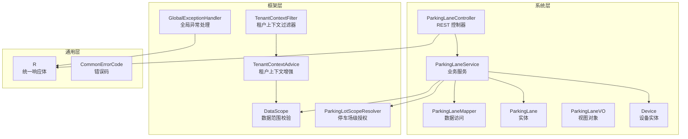
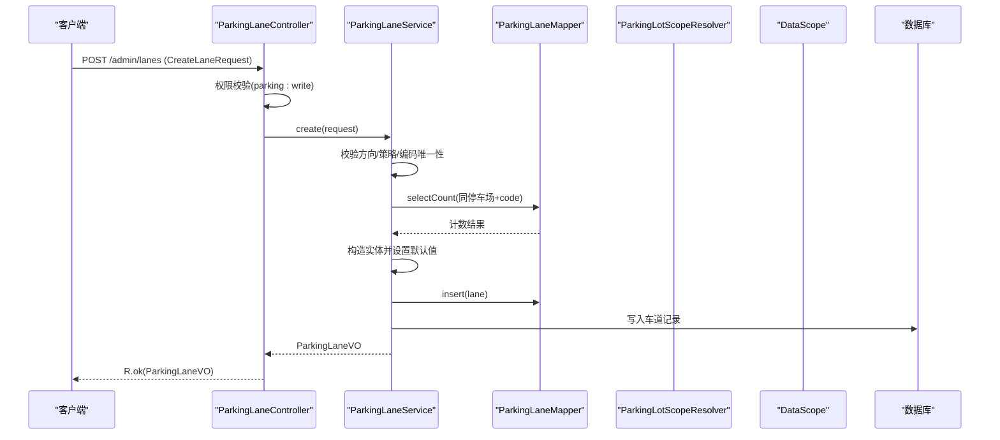
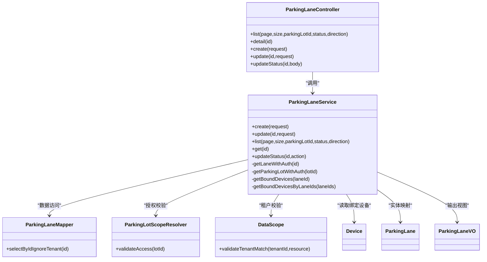

# 车道管理接口

<cite>
**本文引用的文件**
- [ParkingLaneController.java](file://parking-system/src/main/java/com/jushan/system/controller/ParkingLaneController.java)
- [ParkingLaneService.java](file://parking-system/src/main/java/com/jushan/system/service/ParkingLaneService.java)
- [CreateLaneRequest.java](file://parking-system/src/main/java/com/jushan/system/dto/CreateLaneRequest.java)
- [UpdateLaneRequest.java](file://parking-system/src/main/java/com/jushan/system/dto/UpdateLaneRequest.java)
- [ParkingLaneVO.java](file://parking-system/src/main/java/com/jushan/system/vo/ParkingLaneVO.java)
- [ParkingLane.java](file://parking-system/src/main/java/com/jushan/system/entity/ParkingLane.java)
- [ParkingLaneMapper.java](file://parking-system/src/main/java/com/jushan/system/mapper/ParkingLaneMapper.java)
- [Device.java](file://parking-system/src/main/java/com/jushan/system/entity/Device.java)
- [ParkingLotScopeResolver.java](file://parking-system/src/main/java/com/jushan/system/service/ParkingLotScopeResolver.java)
- [DataScope.java](file://parking-framework/src/main/java/com/jushan/framework/auth/DataScope.java)
- [TenantContextAdvice.java](file://parking-framework/src/main/java/com/jushan/framework/auth/TenantContextAdvice.java)
- [TenantContextFilter.java](file://parking-framework/src/main/java/com/jushan/framework/auth/TenantContextFilter.java)
- [TenantContextInterceptor.java](file://parking-framework/src/main/java/com/jushan/framework/auth/TenantContextInterceptor.java)
- [GlobalExceptionHandler.java](file://parking-framework/src/main/java/com/jushan/framework/web/GlobalExceptionHandler.java)
- [R.java](file://parking-common/src/main/java/com/jushan/common/R.java)
- [CommonErrorCode.java](file://parking-common/src/main/java/com/jushan/common/CommonErrorCode.java)
- [V20260711008__parking_lane.sql](file://parking-boot/src/main/resources/db/migration/V20260711008__parking_lane.sql)
- [V20260711010__lane_device_binding.sql](file://parking-boot/src/main/resources/db/migration/V20260711010__lane_device_binding.sql)
</cite>

## 目录
1. [简介](#简介)
2. [项目结构](#项目结构)
3. [核心组件](#核心组件)
4. [架构总览](#架构总览)
5. [详细组件分析](#详细组件分析)
6. [依赖关系分析](#依赖关系分析)
7. [性能考虑](#性能考虑)
8. [故障排查指南](#故障排查指南)
9. [结论](#结论)
10. [附录](#附录)

## 简介
本文件为“车道管理接口”的完整 API 文档，覆盖车道的创建、查询、更新、删除（通过状态启用/停用）等 CRUD 能力，并说明：
- 车道类型管理：入口车道、出口车道、混合车道
- 设备绑定关系管理：车道与设备的关联查询
- CreateLaneRequest 与 UpdateLaneRequest 的字段说明与校验规则
- 车道与停车场的关联关系、数据一致性保证
- 权限控制与多租户数据隔离实现方式
- 完整的请求/响应示例与错误处理说明

## 项目结构
车道管理相关代码位于 parking-system 模块，控制器在 controller 包，服务在 service 包，DTO/VO/Entity/Mapper 分别位于对应子包。框架层提供租户上下文、权限校验与全局异常处理。

图表来源
- [ParkingLaneController.java:1-122](file://parking-system/src/main/java/com/jushan/system/controller/ParkingLaneController.java#L1-L122)
- [ParkingLaneService.java:1-443](file://parking-system/src/main/java/com/jushan/system/service/ParkingLaneService.java#L1-L443)
- [ParkingLaneMapper.java:1-28](file://parking-system/src/main/java/com/jushan/system/mapper/ParkingLaneMapper.java#L1-L28)
- [ParkingLane.java:1-93](file://parking-system/src/main/java/com/jushan/system/entity/ParkingLane.java#L1-L93)
- [ParkingLaneVO.java:1-66](file://parking-system/src/main/java/com/jushan/system/vo/ParkingLaneVO.java#L1-L66)
- [Device.java:1-134](file://parking-system/src/main/java/com/jushan/system/entity/Device.java#L1-L134)
- [DataScope.java](file://parking-framework/src/main/java/com/jushan/framework/auth/DataScope.java)
- [TenantContextAdvice.java](file://parking-framework/src/main/java/com/jushan/framework/auth/TenantContextAdvice.java)
- [TenantContextFilter.java](file://parking-framework/src/main/java/com/jushan/framework/auth/TenantContextFilter.java)
- [GlobalExceptionHandler.java](file://parking-framework/src/main/java/com/jushan/framework/web/GlobalExceptionHandler.java)
- [R.java](file://parking-common/src/main/java/com/jushan/common/R.java)
- [CommonErrorCode.java](file://parking-common/src/main/java/com/jushan/common/CommonErrorCode.java)

章节来源
- [ParkingLaneController.java:1-122](file://parking-system/src/main/java/com/jushan/system/controller/ParkingLaneController.java#L1-L122)
- [ParkingLaneService.java:1-443](file://parking-system/src/main/java/com/jushan/system/service/ParkingLaneService.java#L1-L443)

## 核心组件
- 控制器：提供 REST 端点，负责参数接收、权限注解、日志记录与统一响应封装。
- 服务：实现业务逻辑，包括参数校验、唯一性检查、状态流转、数据隔离与设备绑定查询。
- 数据访问：MyBatis-Plus Mapper，支持分页与条件查询；提供忽略租户拦截器的按 ID 查询方法。
- 实体与视图：ParkingLane 实体映射数据库表；ParkingLaneVO 作为对外返回视图，包含设备列表扩展。
- 框架支撑：租户上下文注入、数据范围校验、停车场级授权、全局异常处理与统一响应。

章节来源
- [ParkingLaneController.java:1-122](file://parking-system/src/main/java/com/jushan/system/controller/ParkingLaneController.java#L1-L122)
- [ParkingLaneService.java:1-443](file://parking-system/src/main/java/com/jushan/system/service/ParkingLaneService.java#L1-L443)
- [ParkingLaneMapper.java:1-28](file://parking-system/src/main/java/com/jushan/system/mapper/ParkingLaneMapper.java#L1-L28)
- [ParkingLane.java:1-93](file://parking-system/src/main/java/com/jushan/system/entity/ParkingLane.java#L1-L93)
- [ParkingLaneVO.java:1-66](file://parking-system/src/main/java/com/jushan/system/vo/ParkingLaneVO.java#L1-L66)

## 架构总览
以下时序图展示“创建车道”的调用链路与安全校验流程。

图表来源
- [ParkingLaneController.java:83-90](file://parking-system/src/main/java/com/jushan/system/controller/ParkingLaneController.java#L83-L90)
- [ParkingLaneService.java:108-155](file://parking-system/src/main/java/com/jushan/system/service/ParkingLaneService.java#L108-L155)
- [ParkingLaneMapper.java:1-28](file://parking-system/src/main/java/com/jushan/system/mapper/ParkingLaneMapper.java#L1-L28)

## 详细组件分析

### 接口定义与权限控制
- 基础路径：/admin/lanes
- 权限要求：
  - 查看：parking:read
  - 写操作（创建/更新/状态变更）：parking:write
- 多租户与数据隔离：
  - 所有操作基于当前登录会话推导租户范围，不信任前端传入的 tenantId
  - 通过停车场归属进行二次校验，确保跨租户不可越权访问
  - 平台用户可跨租户查看（由停车场级授权解析器控制）

章节来源
- [ParkingLaneController.java:17-31](file://parking-system/src/main/java/com/jushan/system/controller/ParkingLaneController.java#L17-L31)
- [ParkingLaneController.java:55-76](file://parking-system/src/main/java/com/jushan/system/controller/ParkingLaneController.java#L55-L76)
- [ParkingLaneController.java:83-103](file://parking-system/src/main/java/com/jushan/system/controller/ParkingLaneController.java#L83-L103)
- [ParkingLaneController.java:113-120](file://parking-system/src/main/java/com/jushan/system/controller/ParkingLaneController.java#L113-L120)
- [ParkingLaneService.java:338-363](file://parking-system/src/main/java/com/jushan/system/service/ParkingLaneService.java#L338-L363)
- [DataScope.java](file://parking-framework/src/main/java/com/jushan/framework/auth/DataScope.java)
- [TenantContextAdvice.java](file://parking-framework/src/main/java/com/jushan/framework/auth/TenantContextAdvice.java)
- [TenantContextFilter.java](file://parking-framework/src/main/java/com/jushan/framework/auth/TenantContextFilter.java)
- [TenantContextInterceptor.java](file://parking-framework/src/main/java/com/jushan/framework/auth/TenantContextInterceptor.java)

### 分页查询车道列表
- 端点：GET /admin/lanes
- 参数：
  - page：页码，默认 1
  - size：每页大小，默认 20
  - parkingLotId：必填，用于限定范围
  - status：可选，ENABLED/DISABLED
  - direction：可选，ENTRY/EXIT/MIXED
- 行为：
  - 校验停车场存在且属于当前租户
  - 按停车场筛选，支持状态与方向过滤
  - 批量加载绑定设备信息并填充到 VO

章节来源
- [ParkingLaneController.java:55-64](file://parking-system/src/main/java/com/jushan/system/controller/ParkingLaneController.java#L55-L64)
- [ParkingLaneService.java:248-276](file://parking-system/src/main/java/com/jushan/system/service/ParkingLaneService.java#L248-L276)

### 查询车道详情
- 端点：GET /admin/lanes/{id}
- 行为：
  - 按 ID 查询车道并校验停车场归属
  - 返回车道基本信息及绑定设备列表

章节来源
- [ParkingLaneController.java:71-76](file://parking-system/src/main/java/com/jushan/system/controller/ParkingLaneController.java#L71-L76)
- [ParkingLaneService.java:284-289](file://parking-system/src/main/java/com/jushan/system/service/ParkingLaneService.java#L284-L289)

### 创建车道
- 端点：POST /admin/lanes
- 请求体：CreateLaneRequest
- 行为：
  - 校验停车场归属
  - 校验方向与自动放行策略合法性
  - 校验车道编码在停车场内唯一
  - 设置默认值（状态、关键车道标记、策略等）
  - 持久化并返回 VO

章节来源
- [ParkingLaneController.java:83-90](file://parking-system/src/main/java/com/jushan/system/controller/ParkingLaneController.java#L83-L90)
- [ParkingLaneService.java:108-155](file://parking-system/src/main/java/com/jushan/system/service/ParkingLaneService.java#L108-L155)

### 更新车道基础信息
- 端点：PUT /admin/lanes/{id}
- 请求体：UpdateLaneRequest（部分更新，仅非 null 字段生效）
- 行为：
  - 校验停车场归属
  - 若更新编码，需检查同停车场内唯一（排除自身）
  - 校验方向与自动放行策略合法性
  - 更新后返回最新 VO

章节来源
- [ParkingLaneController.java:97-103](file://parking-system/src/main/java/com/jushan/system/controller/ParkingLaneController.java#L97-L103)
- [ParkingLaneService.java:166-231](file://parking-system/src/main/java/com/jushan/system/service/ParkingLaneService.java#L166-L231)

### 启用或停用车道
- 端点：POST /admin/lanes/{id}/status
- 请求体：{"action": "ENABLED|DISABLED"}
- 行为：
  - 校验 action 合法
  - 防止并发覆盖（条件更新）
  - 状态流转校验（避免重复启用/停用）

章节来源
- [ParkingLaneController.java:113-120](file://parking-system/src/main/java/com/jushan/system/controller/ParkingLaneController.java#L113-L120)
- [ParkingLaneService.java:301-331](file://parking-system/src/main/java/com/jushan/system/service/ParkingLaneService.java#L301-L331)

### 删除车道
- 说明：当前未提供显式删除端点。建议采用软删除或禁用策略，结合业务需求评估是否新增 DELETE /admin/lanes/{id} 端点。

[本节为概念性说明，不涉及具体文件分析]

### 请求与响应模型

#### CreateLaneRequest 字段说明与校验规则
- parkingLotId：必填，所属停车场 ID
- name：必填，长度不超过 128
- code：必填，长度不超过 64，同停车场内唯一
- direction：必填，取值 ENTRY/EXIT/MIXED
- isKeyLane：可选，是否为关键车道（1/0）
- autoReleasePolicy：可选，取值 AUTO/MANUAL/AFTER_PAY
- description：可选，长度不超过 255

章节来源
- [CreateLaneRequest.java:1-66](file://parking-system/src/main/java/com/jushan/system/dto/CreateLaneRequest.java#L1-L66)
- [ParkingLaneService.java:108-155](file://parking-system/src/main/java/com/jushan/system/service/ParkingLaneService.java#L108-L155)

#### UpdateLaneRequest 字段说明与校验规则
- name：可选，长度不超过 128
- code：可选，长度不超过 64，同停车场内唯一（排除自身）
- direction：可选，取值 ENTRY/EXIT/MIXED
- isKeyLane：可选
- autoReleasePolicy：可选，取值 AUTO/MANUAL/AFTER_PAY
- description：可选，长度不超过 255

章节来源
- [UpdateLaneRequest.java:1-56](file://parking-system/src/main/java/com/jushan/system/dto/UpdateLaneRequest.java#L1-L56)
- [ParkingLaneService.java:166-231](file://parking-system/src/main/java/com/jushan/system/service/ParkingLaneService.java#L166-L231)

#### ParkingLaneVO 字段说明
- id：车道 ID
- parkingLotId：所属停车场 ID
- name：名称
- code：编码
- direction：方向
- status：状态
- isKeyLane：是否关键车道
- autoReleasePolicy：自动放行策略
- description：备注
- devices：绑定设备列表（T21 扩展）
- createdAt/updatedAt：时间戳

章节来源
- [ParkingLaneVO.java:1-66](file://parking-system/src/main/java/com/jushan/system/vo/ParkingLaneVO.java#L1-L66)

### 设备绑定关系管理
- 绑定关系：设备实体 Device 包含 laneId 字段，表示设备绑定的车道
- 查询：
  - 单个车道详情：返回该车道绑定的设备列表
  - 分页列表：批量查询并按 laneId 分组填充至 VO
- 注意：
  - 当前未提供独立的绑定/解绑接口，设备绑定通过设备侧维护 laneId 完成
  - 设备主数据源为 device 表，SN 在同厂商内唯一，禁止前端直接传入 SN

章节来源
- [Device.java:1-134](file://parking-system/src/main/java/com/jushan/system/entity/Device.java#L1-L134)
- [ParkingLaneService.java:396-441](file://parking-system/src/main/java/com/jushan/system/service/ParkingLaneService.java#L396-L441)

### 数据一致性与事务
- 创建/更新/状态变更均使用事务注解保障原子性
- 状态变更采用条件更新防止并发覆盖
- 编码唯一性在服务层进行校验，避免重复

章节来源
- [ParkingLaneService.java:108-155](file://parking-system/src/main/java/com/jushan/system/service/ParkingLaneService.java#L108-L155)
- [ParkingLaneService.java:166-231](file://parking-system/src/main/java/com/jushan/system/service/ParkingLaneService.java#L166-L231)
- [ParkingLaneService.java:301-331](file://parking-system/src/main/java/com/jushan/system/service/ParkingLaneService.java#L301-L331)

### 权限控制与多租户数据隔离
- 权限：
  - 使用 Sa-Token 注解进行方法级权限校验
- 多租户：
  - 通过过滤器与增强器注入租户上下文
  - DataScope 校验停车场归属与租户匹配
  - 停车场级授权解析器进一步限制访问范围
- 平台用户：
  - 可在授权范围内跨租户查看

章节来源
- [ParkingLaneController.java:55-76](file://parking-system/src/main/java/com/jushan/system/controller/ParkingLaneController.java#L55-L76)
- [ParkingLaneService.java:338-363](file://parking-system/src/main/java/com/jushan/system/service/ParkingLaneService.java#L338-L363)
- [DataScope.java](file://parking-framework/src/main/java/com/jushan/framework/auth/DataScope.java)
- [TenantContextAdvice.java](file://parking-framework/src/main/java/com/jushan/framework/auth/TenantContextAdvice.java)
- [TenantContextFilter.java](file://parking-framework/src/main/java/com/jushan/framework/auth/TenantContextFilter.java)
- [TenantContextInterceptor.java](file://parking-framework/src/main/java/com/jushan/framework/auth/TenantContextInterceptor.java)
- [ParkingLotScopeResolver.java](file://parking-system/src/main/java/com/jushan/system/service/ParkingLotScopeResolver.java)

### 请求/响应示例与错误处理

#### 成功响应示例
- 创建成功：
  - 状态码：200
  - 响应体：{ "code": 0, "data": { ...ParkingLaneVO... } }
- 列表查询：
  - 状态码：200
  - 响应体：{ "code": 0, "data": { "records": [...], "total": N, "current": P, "size": S } }

章节来源
- [ParkingLaneController.java:83-90](file://parking-system/src/main/java/com/jushan/system/controller/ParkingLaneController.java#L83-L90)
- [ParkingLaneController.java:55-64](file://parking-system/src/main/java/com/jushan/system/controller/ParkingLaneController.java#L55-L64)
- [R.java](file://parking-common/src/main/java/com/jushan/common/R.java)

#### 常见错误场景
- 参数校验失败：
  - 错误码：PARAM_ERROR
  - 提示：无效的车道方向/自动放行策略/操作类型
- 业务冲突：
  - 错误码：BUSINESS_ERROR
  - 提示：车道编码已存在/已是某状态/状态已变更
- 资源不存在：
  - 错误码：NOT_FOUND
  - 提示：车道不存在/停车场不存在
- 权限不足：
  - 由权限框架抛出，统一异常处理器转换为标准响应

章节来源
- [ParkingLaneService.java:114-136](file://parking-system/src/main/java/com/jushan/system/service/ParkingLaneService.java#L114-L136)
- [ParkingLaneService.java:182-215](file://parking-system/src/main/java/com/jushan/system/service/ParkingLaneService.java#L182-L215)
- [ParkingLaneService.java:301-331](file://parking-system/src/main/java/com/jushan/system/service/ParkingLaneService.java#L301-L331)
- [ParkingLaneService.java:338-363](file://parking-system/src/main/java/com/jushan/system/service/ParkingLaneService.java#L338-L363)
- [CommonErrorCode.java](file://parking-common/src/main/java/com/jushan/common/CommonErrorCode.java)
- [GlobalExceptionHandler.java](file://parking-framework/src/main/java/com/jushan/framework/web/GlobalExceptionHandler.java)

## 依赖关系分析
- 控制器依赖服务，服务依赖 Mapper 与外部解析器（停车场授权、数据范围）
- 服务内部聚合设备、厂商、型号信息以构建 VO
- 框架层提供租户上下文、权限校验与全局异常处理

图表来源
- [ParkingLaneController.java:1-122](file://parking-system/src/main/java/com/jushan/system/controller/ParkingLaneController.java#L1-L122)
- [ParkingLaneService.java:1-443](file://parking-system/src/main/java/com/jushan/system/service/ParkingLaneService.java#L1-L443)
- [ParkingLaneMapper.java:1-28](file://parking-system/src/main/java/com/jushan/system/mapper/ParkingLaneMapper.java#L1-L28)
- [ParkingLotScopeResolver.java](file://parking-system/src/main/java/com/jushan/system/service/ParkingLotScopeResolver.java)
- [DataScope.java](file://parking-framework/src/main/java/com/jushan/framework/auth/DataScope.java)
- [Device.java:1-134](file://parking-system/src/main/java/com/jushan/system/entity/Device.java#L1-L134)
- [ParkingLane.java:1-93](file://parking-system/src/main/java/com/jushan/system/entity/ParkingLane.java#L1-L93)
- [ParkingLaneVO.java:1-66](file://parking-system/src/main/java/com/jushan/system/vo/ParkingLaneVO.java#L1-L66)

章节来源
- [ParkingLaneController.java:1-122](file://parking-system/src/main/java/com/jushan/system/controller/ParkingLaneController.java#L1-L122)
- [ParkingLaneService.java:1-443](file://parking-system/src/main/java/com/jushan/system/service/ParkingLaneService.java#L1-L443)

## 性能考虑
- 列表查询批量加载设备：通过 in 查询并按 laneId 分组，减少 N+1 问题
- 分页查询：使用 MyBatis-Plus Page 插件，合理设置 page/size
- 条件更新：状态变更使用条件更新避免并发覆盖导致的额外重试
- 索引建议：
  - parking_lot_id + code 唯一约束（已在迁移脚本中体现）
  - parking_lot_id + direction/status 组合索引有助于筛选

[本节为通用指导，不涉及具体文件分析]

## 故障排查指南
- 常见问题定位：
  - 参数校验失败：检查 direction/autoReleasePolicy/action 的取值
  - 编码冲突：确认同停车场内是否存在相同 code
  - 状态变更失败：检查是否重复操作或并发导致状态不一致
  - 权限不足：确认用户具备 parking:read/parking:write 权限
- 日志与追踪：
  - 控制器与服务层记录关键操作日志
  - 全局异常处理器统一转换错误响应

章节来源
- [ParkingLaneController.java:87-89](file://parking-system/src/main/java/com/jushan/system/controller/ParkingLaneController.java#L87-L89)
- [ParkingLaneController.java:101-102](file://parking-system/src/main/java/com/jushan/system/controller/ParkingLaneController.java#L101-L102)
- [ParkingLaneController.java:118-119](file://parking-system/src/main/java/com/jushan/system/controller/ParkingLaneController.java#L118-L119)
- [ParkingLaneService.java:151-153](file://parking-system/src/main/java/com/jushan/system/service/ParkingLaneService.java#L151-L153)
- [ParkingLaneService.java:229-230](file://parking-system/src/main/java/com/jushan/system/service/ParkingLaneService.java#L229-L230)
- [ParkingLaneService.java:329-331](file://parking-system/src/main/java/com/jushan/system/service/ParkingLaneService.java#L329-L331)
- [GlobalExceptionHandler.java](file://parking-framework/src/main/java/com/jushan/framework/web/GlobalExceptionHandler.java)

## 结论
车道管理接口提供了完善的 CRUD 能力与设备绑定查询，结合权限控制与多租户数据隔离，确保数据安全与一致性。建议在后续版本中补充显式的设备绑定/解绑接口与删除功能，以满足更灵活的运营需求。

[本节为总结性内容，不涉及具体文件分析]

## 附录

### 数据库表结构与约束
- parking_lane：车道主表，包含方向、状态、策略、关键车道标记等字段
- device：设备台账表，包含 laneId 用于绑定车道

章节来源
- [V20260711008__parking_lane.sql](file://parking-boot/src/main/resources/db/migration/V20260711008__parking_lane.sql)
- [V20260711010__lane_device_binding.sql](file://parking-boot/src/main/resources/db/migration/V20260711010__lane_device_binding.sql)