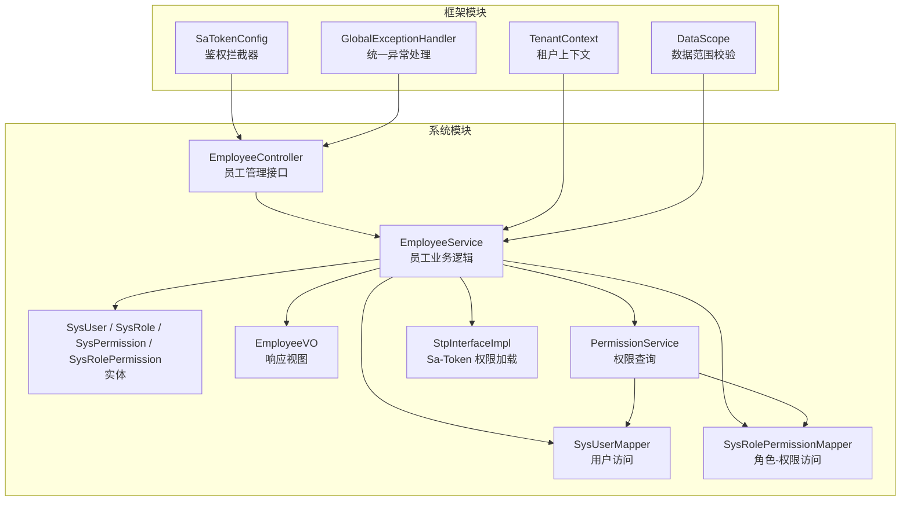
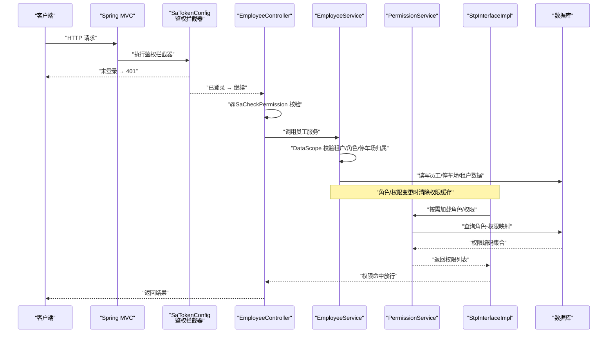
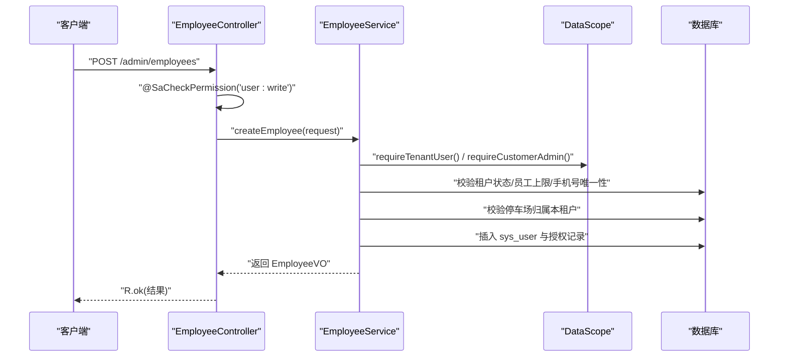
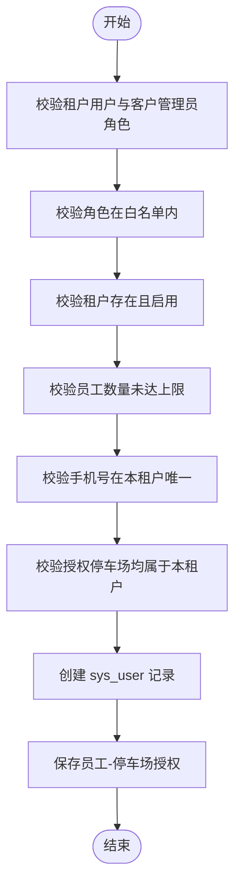
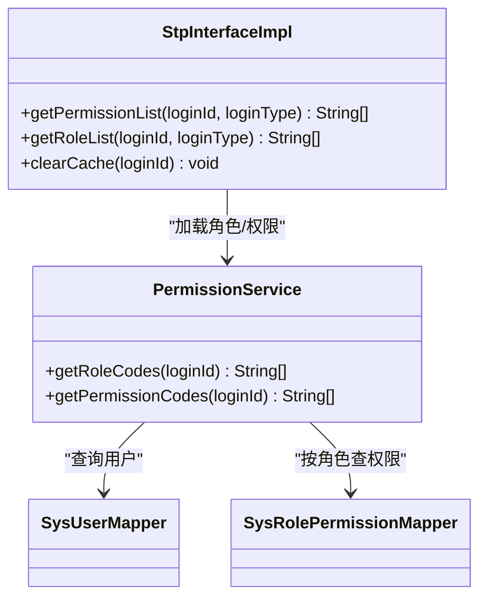
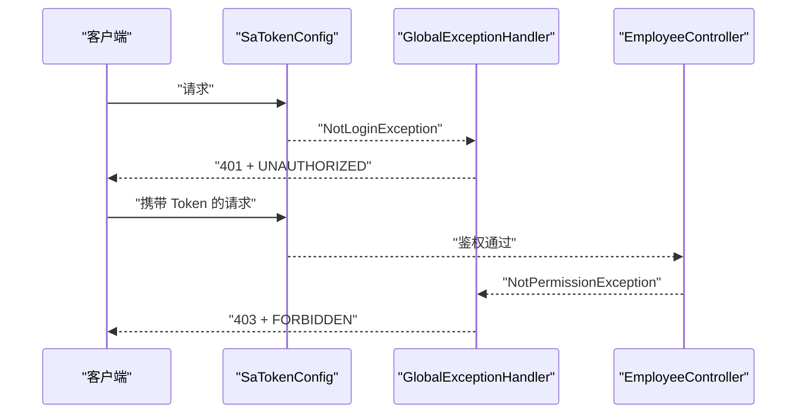
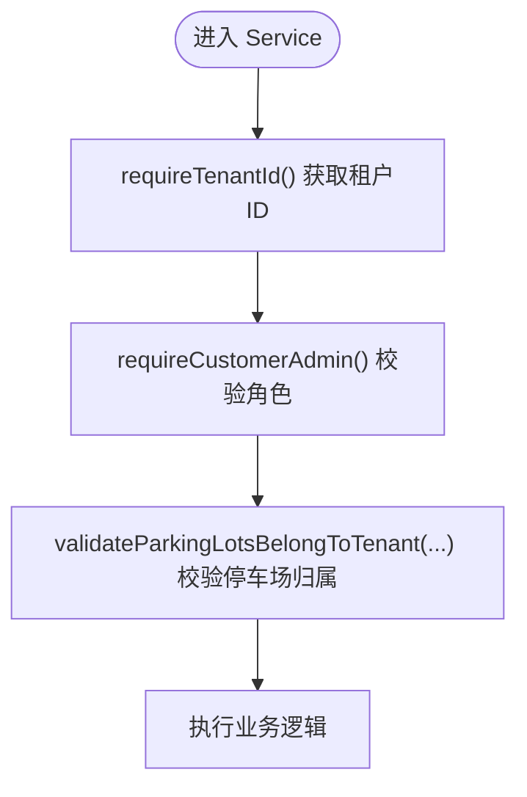
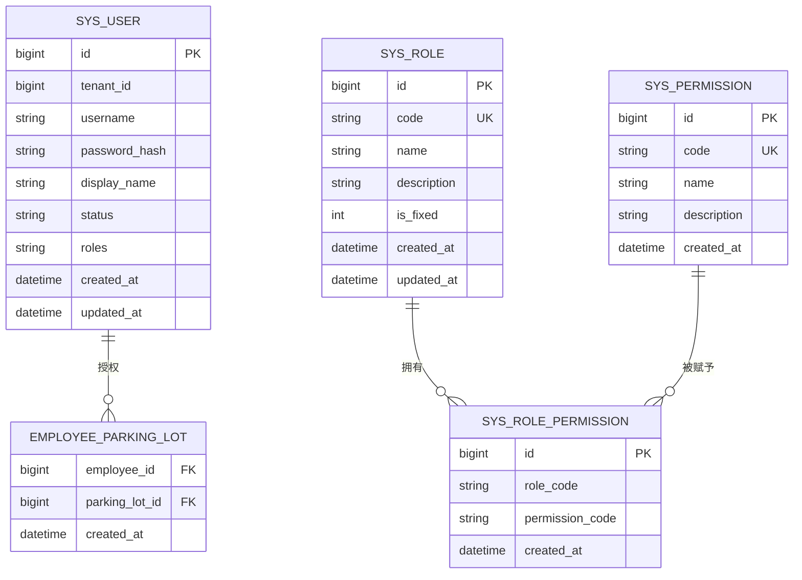
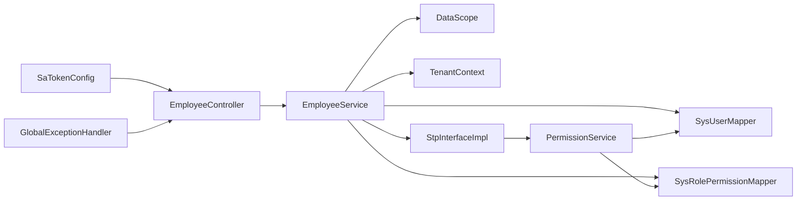

# 员工权限接口

<cite>
**本文引用的文件**   
- [EmployeeController.java](file://parking-system/src/main/java/com/jushan/system/controller/EmployeeController.java)
- [EmployeeService.java](file://parking-system/src/main/java/com/jushan/system/service/EmployeeService.java)
- [StpInterfaceImpl.java](file://parking-system/src/main/java/com/jushan/system/service/StpInterfaceImpl.java)
- [PermissionService.java](file://parking-system/src/main/java/com/jushan/system/service/PermissionService.java)
- [SaTokenConfig.java](file://parking-framework/src/main/java/com/jushan/framework/auth/SaTokenConfig.java)
- [DataScope.java](file://parking-framework/src/main/java/com/jushan/framework/auth/DataScope.java)
- [TenantContext.java](file://parking-framework/src/main/java/com/jushan/framework/auth/TenantContext.java)
- [SysUser.java](file://parking-system/src/main/java/com/jushan/system/entity/SysUser.java)
- [SysRole.java](file://parking-system/src/main/java/com/jushan/system/entity/SysRole.java)
- [SysPermission.java](file://parking-system/src/main/java/com/jushan/system/entity/SysPermission.java)
- [SysRolePermission.java](file://parking-system/src/main/java/com/jushan/system/entity/SysRolePermission.java)
- [SysUserMapper.java](file://parking-system/src/main/java/com/jushan/system/mapper/SysUserMapper.java)
- [SysRolePermissionMapper.java](file://parking-system/src/main/java/com/jushan/system/mapper/SysRolePermissionMapper.java)
- [GlobalExceptionHandler.java](file://parking-framework/src/main/java/com/jushan/framework/web/GlobalExceptionHandler.java)
- [EmployeeVO.java](file://parking-system/src/main/java/com/jushan/system/vo/EmployeeVO.java)
</cite>

## 目录
1. [简介](#简介)
2. [项目结构](#项目结构)
3. [核心组件](#核心组件)
4. [架构总览](#架构总览)
5. [详细组件分析](#详细组件分析)
6. [依赖关系分析](#依赖关系分析)
7. [性能考虑](#性能考虑)
8. [故障排查指南](#故障排查指南)
9. [结论](#结论)
10. [附录：API 规范](#附录api-规范)

## 简介
本文件面向“员工权限接口”的完整 API 文档，覆盖以下能力与机制：
- 员工信息管理（CRUD、状态管理、密码重置）
- 角色与权限控制（基于 Sa-Token 的 RBAC 模型）
- 数据范围管理与租户隔离（租户上下文、数据范围校验）
- 细粒度权限验证（方法级 @SaCheckPermission）
- 审计日志记录（登录日志、操作审计）
- 安全最佳实践与性能优化建议

## 项目结构
围绕员工权限相关的关键代码分布在 system 模块与 framework 模块中：
- 控制器层：员工管理 REST 接口
- 服务层：员工业务逻辑、权限加载、RBAC 查询
- 框架层：Sa-Token 配置、全局异常处理、租户上下文与数据范围工具
- 实体与映射：用户、角色、权限、关联表及 Mapper
- 视图对象：对外返回的员工信息 VO

图表来源
- [EmployeeController.java:1-122](file://parking-system/src/main/java/com/jushan/system/controller/EmployeeController.java#L1-L122)
- [EmployeeService.java:1-445](file://parking-system/src/main/java/com/jushan/system/service/EmployeeService.java#L1-L445)
- [PermissionService.java:1-105](file://parking-system/src/main/java/com/jushan/system/service/PermissionService.java#L1-L105)
- [StpInterfaceImpl.java:1-107](file://parking-system/src/main/java/com/jushan/system/service/StpInterfaceImpl.java#L1-L107)
- [SaTokenConfig.java:1-65](file://parking-framework/src/main/java/com/jushan/framework/auth/SaTokenConfig.java#L1-L65)
- [GlobalExceptionHandler.java:149-177](file://parking-framework/src/main/java/com/jushan/framework/web/GlobalExceptionHandler.java#L149-L177)
- [TenantContext.java:1-257](file://parking-framework/src/main/java/com/jushan/framework/auth/TenantContext.java#L1-L257)
- [DataScope.java:1-240](file://parking-framework/src/main/java/com/jushan/framework/auth/DataScope.java#L1-L240)

章节来源
- [EmployeeController.java:1-122](file://parking-system/src/main/java/com/jushan/system/controller/EmployeeController.java#L1-L122)
- [EmployeeService.java:1-445](file://parking-system/src/main/java/com/jushan/system/service/EmployeeService.java#L1-L445)
- [SaTokenConfig.java:1-65](file://parking-framework/src/main/java/com/jushan/framework/auth/SaTokenConfig.java#L1-L65)
- [GlobalExceptionHandler.java:149-177](file://parking-framework/src/main/java/com/jushan/framework/web/GlobalExceptionHandler.java#L149-L177)
- [TenantContext.java:1-257](file://parking-framework/src/main/java/com/jushan/framework/auth/TenantContext.java#L1-L257)
- [DataScope.java:1-240](file://parking-framework/src/main/java/com/jushan/framework/auth/DataScope.java#L1-L240)

## 核心组件
- 员工管理控制器：提供分页列表、详情、创建、更新、状态切换、密码重置等接口，并在方法上通过注解进行权限校验。
- 员工服务：实现员工创建、更新、状态变更、密码重置等业务逻辑；严格校验租户范围、角色合法性、停车场归属与数量上限；在关键变更后主动清理权限缓存或撤销会话。
- 权限加载实现：对接 Sa-Token，从 Session 缓存读取角色与权限，未命中则从数据库加载并回写缓存。
- 权限查询服务：根据用户角色解析角色编码，再按角色批量查询权限编码，供权限加载实现使用。
- 鉴权配置：注册 Sa-Token 全局拦截器，除公开路径外要求登录；异常由全局处理器统一返回 JSON。
- 租户上下文与数据范围：线程级上下文承载租户 ID、用户类型、角色等信息；提供断言式校验方法确保 fail-close。
- 实体与映射：用户、角色、权限、角色-权限关联实体及其 Mapper，支持忽略租户拦截器的查询用于登录与跨租户校验场景。
- 统一异常处理：将 Sa-Token 的未登录与无权限异常转换为标准错误码与 HTTP 状态码。

章节来源
- [EmployeeController.java:1-122](file://parking-system/src/main/java/com/jushan/system/controller/EmployeeController.java#L1-L122)
- [EmployeeService.java:1-445](file://parking-system/src/main/java/com/jushan/system/service/EmployeeService.java#L1-L445)
- [StpInterfaceImpl.java:1-107](file://parking-system/src/main/java/com/jushan/system/service/StpInterfaceImpl.java#L1-L107)
- [PermissionService.java:1-105](file://parking-system/src/main/java/com/jushan/system/service/PermissionService.java#L1-L105)
- [SaTokenConfig.java:1-65](file://parking-framework/src/main/java/com/jushan/framework/auth/SaTokenConfig.java#L1-L65)
- [GlobalExceptionHandler.java:149-177](file://parking-framework/src/main/java/com/jushan/framework/web/GlobalExceptionHandler.java#L149-L177)
- [TenantContext.java:1-257](file://parking-framework/src/main/java/com/jushan/framework/auth/TenantContext.java#L1-L257)
- [DataScope.java:1-240](file://parking-framework/src/main/java/com/jushan/framework/auth/DataScope.java#L1-L240)
- [SysUser.java:1-81](file://parking-system/src/main/java/com/jushan/system/entity/SysUser.java#L1-L81)
- [SysRole.java:1-65](file://parking-system/src/main/java/com/jushan/system/entity/SysRole.java#L1-L65)
- [SysPermission.java:1-54](file://parking-system/src/main/java/com/jushan/system/entity/SysPermission.java#L1-L54)
- [SysRolePermission.java:1-46](file://parking-system/src/main/java/com/jushan/system/entity/SysRolePermission.java#L1-L46)
- [SysUserMapper.java:1-47](file://parking-system/src/main/java/com/jushan/system/mapper/SysUserMapper.java#L1-L47)
- [SysRolePermissionMapper.java:1-35](file://parking-system/src/main/java/com/jushan/system/mapper/SysRolePermissionMapper.java#L1-L35)

## 架构总览
下图展示了请求进入后的认证、授权、数据范围校验与业务处理的整体流程。

图表来源
- [SaTokenConfig.java:1-65](file://parking-framework/src/main/java/com/jushan/framework/auth/SaTokenConfig.java#L1-L65)
- [EmployeeController.java:1-122](file://parking-system/src/main/java/com/jushan/system/controller/EmployeeController.java#L1-L122)
- [EmployeeService.java:1-445](file://parking-system/src/main/java/com/jushan/system/service/EmployeeService.java#L1-L445)
- [PermissionService.java:1-105](file://parking-system/src/main/java/com/jushan/system/service/PermissionService.java#L1-L105)
- [StpInterfaceImpl.java:1-107](file://parking-system/src/main/java/com/jushan/system/service/StpInterfaceImpl.java#L1-L107)

## 详细组件分析

### 员工管理接口（EmployeeController）
- 功能清单
  - 分页查询员工列表：需要 user:read 权限
  - 查询员工详情：需要 user:read 权限
  - 创建员工：需要 user:write 权限
  - 更新员工信息：需要 user:write 权限
  - 重置员工密码：需要 user:write 权限
  - 更新员工状态（启用/禁用）：需要 user:write 权限
- 安全要点
  - 所有接口均通过 @SaCheckPermission 进行方法级权限校验
  - 所有操作基于当前会话推导租户范围，不信任前端传入的 tenantId
- 典型交互序列

图表来源
- [EmployeeController.java:1-122](file://parking-system/src/main/java/com/jushan/system/controller/EmployeeController.java#L1-L122)
- [EmployeeService.java:1-445](file://parking-system/src/main/java/com/jushan/system/service/EmployeeService.java#L1-L445)
- [DataScope.java:1-240](file://parking-framework/src/main/java/com/jushan/framework/auth/DataScope.java#L1-L240)

章节来源
- [EmployeeController.java:1-122](file://parking-system/src/main/java/com/jushan/system/controller/EmployeeController.java#L1-L122)

### 员工服务（EmployeeService）
- 关键能力
  - 创建员工：校验角色白名单、租户状态与员工上限、手机号唯一性、停车场归属；写入用户与授权记录
  - 更新员工：仅允许修改姓名、角色与授权停车场；手机号不可改；更新后删除旧授权并重建新授权；变更角色后主动清除权限缓存
  - 列表与详情：列表排除客户管理员自身；详情强制租户归属校验
  - 密码重置：哈希存储新密码；重置后主动撤销该员工全部会话，防止旧 Token 继续使用
  - 状态切换：条件更新避免并发覆盖；禁用后主动撤销会话并清除权限缓存
- 数据范围与安全
  - 所有写操作前调用 DataScope 断言租户用户与客户管理员角色
  - 停车场授权必须属于当前租户，否则拒绝
- 流程图（创建员工）

图表来源
- [EmployeeService.java:1-445](file://parking-system/src/main/java/com/jushan/system/service/EmployeeService.java#L1-L445)
- [DataScope.java:1-240](file://parking-framework/src/main/java/com/jushan/framework/auth/DataScope.java#L1-L240)

章节来源
- [EmployeeService.java:1-445](file://parking-system/src/main/java/com/jushan/system/service/EmployeeService.java#L1-L445)

### 权限加载与 RBAC（StpInterfaceImpl + PermissionService）
- 设计要点
  - 首次加载角色/权限后写入 Sa-Token Session，后续鉴权直接读缓存，降低数据库压力
  - 角色变更后调用 clearCache 主动失效缓存，使新权限立即生效
  - 权限编码格式为 module:action，如 user:read、user:write
- 类关系图

图表来源
- [StpInterfaceImpl.java:1-107](file://parking-system/src/main/java/com/jushan/system/service/StpInterfaceImpl.java#L1-L107)
- [PermissionService.java:1-105](file://parking-system/src/main/java/com/jushan/system/service/PermissionService.java#L1-L105)
- [SysUserMapper.java:1-47](file://parking-system/src/main/java/com/jushan/system/mapper/SysUserMapper.java#L1-L47)
- [SysRolePermissionMapper.java:1-35](file://parking-system/src/main/java/com/jushan/system/mapper/SysRolePermissionMapper.java#L1-L35)

章节来源
- [StpInterfaceImpl.java:1-107](file://parking-system/src/main/java/com/jushan/system/service/StpInterfaceImpl.java#L1-L107)
- [PermissionService.java:1-105](file://parking-system/src/main/java/com/jushan/system/service/PermissionService.java#L1-L105)

### 鉴权与异常处理（SaTokenConfig + GlobalExceptionHandler）
- 鉴权拦截器
  - 全局拦截所有路径，除公开端点（登录、注册、健康检查、静态资源等）外均需登录
  - 使用 Spring MVC Interceptor，便于被统一异常处理器捕获
- 统一异常处理
  - 未登录异常：返回 401 与 UNAUTHORIZED 错误码
  - 无权限异常：返回 403 与 FORBIDDEN 错误码

图表来源
- [SaTokenConfig.java:1-65](file://parking-framework/src/main/java/com/jushan/framework/auth/SaTokenConfig.java#L1-L65)
- [GlobalExceptionHandler.java:149-177](file://parking-framework/src/main/java/com/jushan/framework/web/GlobalExceptionHandler.java#L149-L177)

章节来源
- [SaTokenConfig.java:1-65](file://parking-framework/src/main/java/com/jushan/framework/auth/SaTokenConfig.java#L1-L65)
- [GlobalExceptionHandler.java:149-177](file://parking-framework/src/main/java/com/jushan/framework/web/GlobalExceptionHandler.java#L149-L177)

### 租户上下文与数据范围（TenantContext + DataScope）
- 租户上下文
  - 线程级快照包含租户 ID、用户 ID、用户类型、角色、代理模式信息等
  - 提供 requireTenantId 等方法，未初始化或平台用户强拒绝
- 数据范围工具
  - 精确角色匹配（JSON 数组），避免子串匹配漏洞
  - 平台用户显式确认才允许跨租户访问
  - 停车场归属校验：任意一个不属于目标租户即失败
  - 租户启用状态校验

图表来源
- [TenantContext.java:1-257](file://parking-framework/src/main/java/com/jushan/framework/auth/TenantContext.java#L1-L257)
- [DataScope.java:1-240](file://parking-framework/src/main/java/com/jushan/framework/auth/DataScope.java#L1-L240)

章节来源
- [TenantContext.java:1-257](file://parking-framework/src/main/java/com/jushan/framework/auth/TenantContext.java#L1-L257)
- [DataScope.java:1-240](file://parking-framework/src/main/java/com/jushan/framework/auth/DataScope.java#L1-L240)

### 数据模型（RBAC 与员工授权）
- 用户、角色、权限、角色-权限关联实体定义
- 员工-停车场授权实体（用于限定员工可操作的停车场范围）
- 视图对象 EmployeeVO 封装对外字段（含脱敏手机号、角色名称、授权停车场列表等）

图表来源
- [SysUser.java:1-81](file://parking-system/src/main/java/com/jushan/system/entity/SysUser.java#L1-L81)
- [SysRole.java:1-65](file://parking-system/src/main/java/com/jushan/system/entity/SysRole.java#L1-L65)
- [SysPermission.java:1-54](file://parking-system/src/main/java/com/jushan/system/entity/SysPermission.java#L1-L54)
- [SysRolePermission.java:1-46](file://parking-system/src/main/java/com/jushan/system/entity/SysRolePermission.java#L1-L46)

章节来源
- [SysUser.java:1-81](file://parking-system/src/main/java/com/jushan/system/entity/SysUser.java#L1-L81)
- [SysRole.java:1-65](file://parking-system/src/main/java/com/jushan/system/entity/SysRole.java#L1-L65)
- [SysPermission.java:1-54](file://parking-system/src/main/java/com/jushan/system/entity/SysPermission.java#L1-L54)
- [SysRolePermission.java:1-46](file://parking-system/src/main/java/com/jushan/system/entity/SysRolePermission.java#L1-L46)
- [EmployeeVO.java:1-74](file://parking-system/src/main/java/com/jushan/system/vo/EmployeeVO.java#L1-L74)

## 依赖关系分析
- 控制器依赖服务层，服务层依赖多个 Mapper 与框架工具
- 权限加载实现依赖权限查询服务，后者依赖用户与角色-权限映射 Mapper
- 鉴权拦截器与全局异常处理贯穿所有请求
- 租户上下文与数据范围工具被服务层广泛使用，保证数据隔离与角色校验

图表来源
- [EmployeeController.java:1-122](file://parking-system/src/main/java/com/jushan/system/controller/EmployeeController.java#L1-L122)
- [EmployeeService.java:1-445](file://parking-system/src/main/java/com/jushan/system/service/EmployeeService.java#L1-L445)
- [PermissionService.java:1-105](file://parking-system/src/main/java/com/jushan/system/service/PermissionService.java#L1-L105)
- [StpInterfaceImpl.java:1-107](file://parking-system/src/main/java/com/jushan/system/service/StpInterfaceImpl.java#L1-L107)
- [SaTokenConfig.java:1-65](file://parking-framework/src/main/java/com/jushan/framework/auth/SaTokenConfig.java#L1-L65)
- [GlobalExceptionHandler.java:149-177](file://parking-framework/src/main/java/com/jushan/framework/web/GlobalExceptionHandler.java#L149-L177)
- [TenantContext.java:1-257](file://parking-framework/src/main/java/com/jushan/framework/auth/TenantContext.java#L1-L257)
- [DataScope.java:1-240](file://parking-framework/src/main/java/com/jushan/framework/auth/DataScope.java#L1-L240)

## 性能考虑
- 权限缓存：角色与权限首次加载后存入 Sa-Token Session，后续鉴权直接读取，显著降低数据库压力
- 变更即时生效：角色变更或密码重置后主动清除权限缓存或撤销会话，避免延迟导致的安全风险
- 批量查询：按角色批量查询权限编码，减少多次往返
- 条件更新：状态切换采用条件更新避免并发覆盖导致的额外重试
- 脱敏输出：对外返回手机号脱敏，减少敏感数据传输

[本节为通用指导，无需源码引用]

## 故障排查指南
- 401 未登录
  - 现象：请求未携带有效 Token 或 Token 过期
  - 定位：查看全局异常处理器对 NotLoginException 的处理
- 403 无权限
  - 现象：用户缺少所需权限或角色不匹配
  - 定位：查看全局异常处理器对 NotPermissionException 的处理；检查方法上的 @SaCheckPermission 与权限分配
- 租户越权
  - 现象：尝试访问其他租户数据被拒绝
  - 定位：检查 DataScope 与 TenantContext 的断言是否通过
- 角色变更后权限未生效
  - 现象：更新角色后仍沿用旧权限
  - 定位：确认是否调用了权限缓存清除；必要时重新登录以重建 Session

章节来源
- [GlobalExceptionHandler.java:149-177](file://parking-framework/src/main/java/com/jushan/framework/web/GlobalExceptionHandler.java#L149-L177)
- [EmployeeService.java:1-445](file://parking-system/src/main/java/com/jushan/system/service/EmployeeService.java#L1-L445)
- [DataScope.java:1-240](file://parking-framework/src/main/java/com/jushan/framework/auth/DataScope.java#L1-L240)
- [TenantContext.java:1-257](file://parking-framework/src/main/java/com/jushan/framework/auth/TenantContext.java#L1-L257)

## 结论
本方案通过 Sa-Token 的全局鉴权与方法级权限校验，结合 RBAC 模型与租户上下文，实现了员工管理的细粒度权限控制与严格的租户数据隔离。在服务层引入数据范围工具与强断言策略，确保 fail-close 的安全原则。配合权限缓存与变更即时失效机制，在保证安全性的同时兼顾了性能。

[本节为总结，无需源码引用]

## 附录：API 规范

- 基础信息
  - 基础路径：/admin/employees
  - 认证方式：Bearer Token（Authorization 头）
  - 内容类型：application/json
  - 统一响应体：R<T>（成功/失败封装）

- 接口清单
  - 分页查询员工列表
    - 方法：GET
    - 路径：/admin/employees
    - 参数：page（默认 1）、size（默认 20）、status（可选：ENABLED/DISABLED）
    - 权限：user:read
    - 返回：IPage<EmployeeVO>
  - 查询员工详情
    - 方法：GET
    - 路径：/admin/employees/{id}
    - 权限：user:read
    - 返回：EmployeeVO
  - 创建员工
    - 方法：POST
    - 路径：/admin/employees
    - 请求体：CreateEmployeeRequest（包含手机号、显示名、密码、角色编码、授权停车场 ID 列表）
    - 权限：user:write
    - 返回：EmployeeVO
  - 更新员工信息
    - 方法：PUT
    - 路径：/admin/employees/{id}
    - 请求体：UpdateEmployeeRequest（显示名、角色编码、授权停车场 ID 列表）
    - 权限：user:write
    - 返回：EmployeeVO
  - 重置员工密码
    - 方法：POST
    - 路径：/admin/employees/{id}/reset-password
    - 请求体：ResetPasswordRequest（新密码）
    - 权限：user:write
    - 返回：空
  - 更新员工状态
    - 方法：POST
    - 路径：/admin/employees/{id}/status
    - 参数：action（ENABLED/DISABLED）
    - 权限：user:write
    - 返回：空

- 错误码与状态码
  - 401 UNAUTHORIZED：未登录或会话过期
  - 403 FORBIDDEN：无权限或租户越权
  - 业务错误：PARAM_ERROR、BUSINESS_ERROR、NOT_FOUND 等

- 安全与合规
  - 所有写操作需具备 user:write 权限
  - 所有操作基于当前会话推导租户范围，禁止信任前端传入的 tenantId
  - 角色变更与密码重置后立即失效旧权限与会话

章节来源
- [EmployeeController.java:1-122](file://parking-system/src/main/java/com/jushan/system/controller/EmployeeController.java#L1-L122)
- [EmployeeService.java:1-445](file://parking-system/src/main/java/com/jushan/system/service/EmployeeService.java#L1-L445)
- [EmployeeVO.java:1-74](file://parking-system/src/main/java/com/jushan/system/vo/EmployeeVO.java#L1-L74)
- [GlobalExceptionHandler.java:149-177](file://parking-framework/src/main/java/com/jushan/framework/web/GlobalExceptionHandler.java#L149-L177)