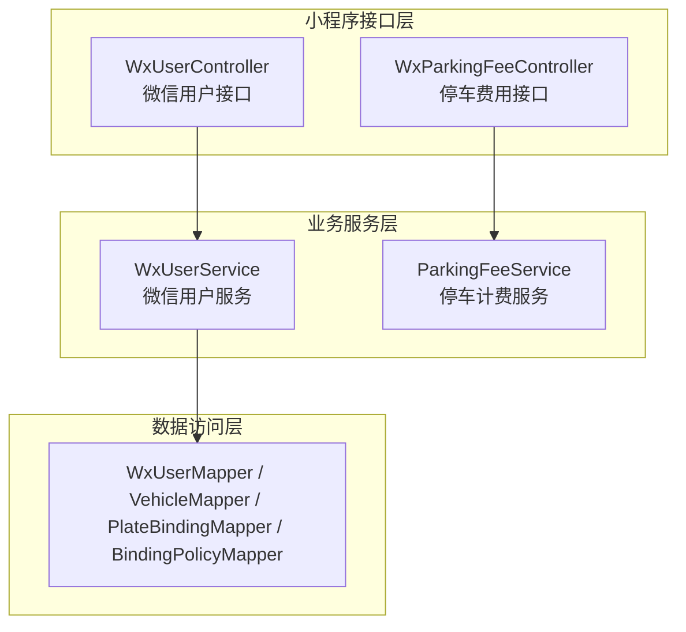
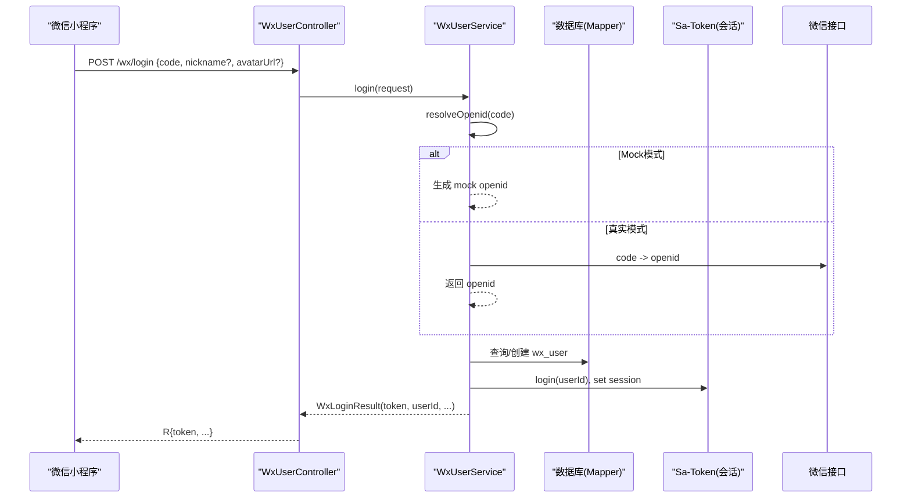
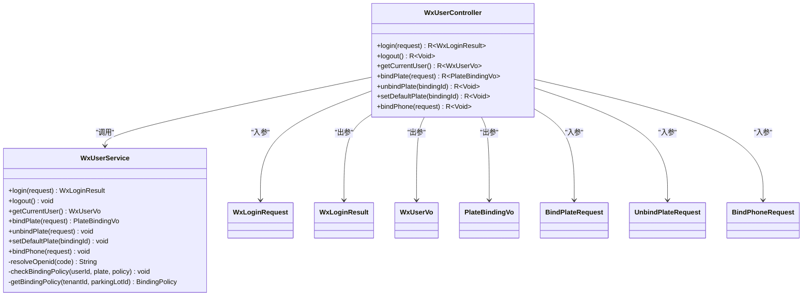
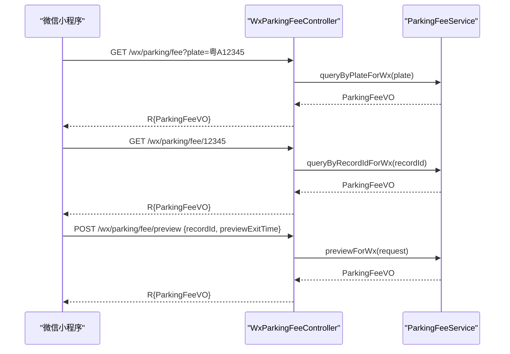
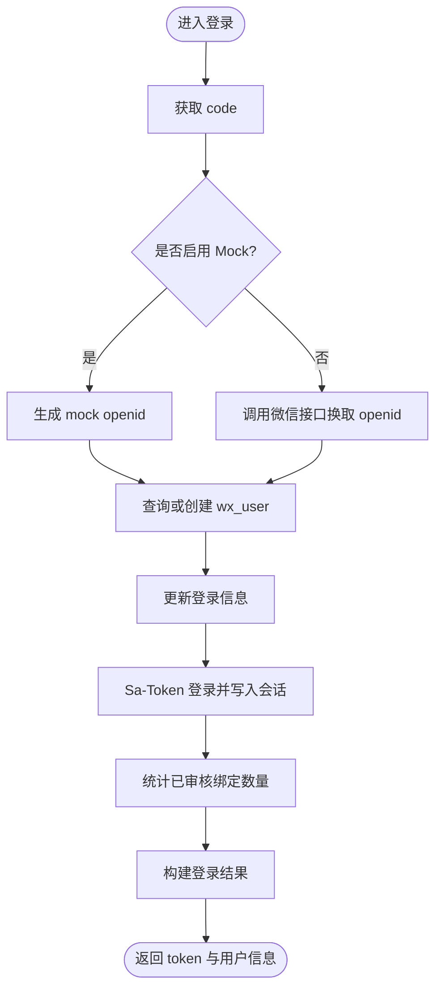
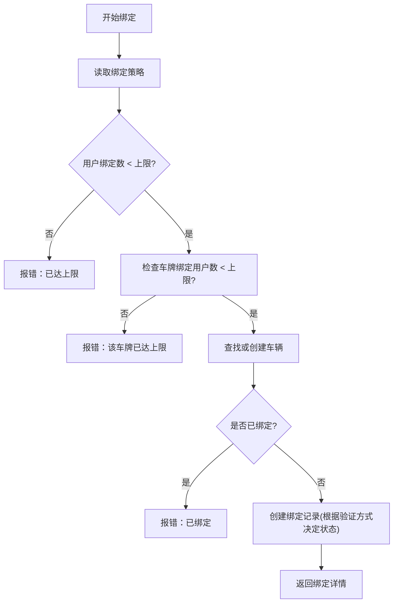
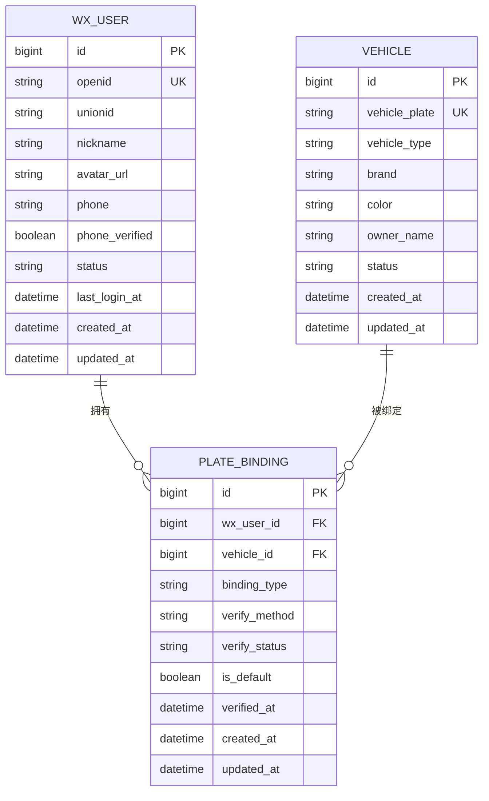
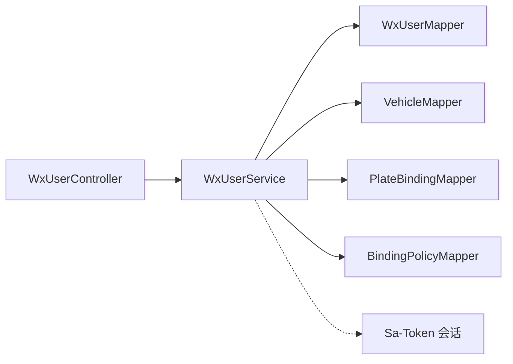

# 小程序接口

<cite>
**本文引用的文件**   
- [WxUserController.java](file://parking-system/src/main/java/com/jushan/system/controller/WxUserController.java)
- [WxParkingFeeController.java](file://parking-system/src/main/java/com/jushan/system/controller/WxParkingFeeController.java)
- [WxUserService.java](file://parking-system/src/main/java/com/jushan/system/service/WxUserService.java)
- [WxLoginRequest.java](file://parking-system/src/main/java/com/jushan/system/dto/WxLoginRequest.java)
- [WxLoginResult.java](file://parking-system/src/main/java/com/jushan/system/vo/WxLoginResult.java)
- [WxUserVo.java](file://parking-system/src/main/java/com/jushan/system/vo/WxUserVo.java)
- [PlateBindingVo.java](file://parking-system/src/main/java/com/jushan/system/vo/PlateBindingVo.java)
- [BindPlateRequest.java](file://parking-system/src/main/java/com/jushan/system/dto/BindPlateRequest.java)
- [UnbindPlateRequest.java](file://parking-system/src/main/java/com/jushan/system/dto/UnbindPlateRequest.java)
- [BindPhoneRequest.java](file://parking-system/src/main/java/com/jushan/system/dto/BindPhoneRequest.java)
- [WxUser.java](file://parking-system/src/main/java/com/jushan/system/entity/WxUser.java)
- [Vehicle.java](file://parking-system/src/main/java/com/jushan/system/entity/Vehicle.java)
</cite>

## 目录
1. [简介](#简介)
2. [项目结构](#项目结构)
3. [核心组件](#核心组件)
4. [架构总览](#架构总览)
5. [详细组件分析](#详细组件分析)
6. [依赖分析](#依赖分析)
7. [性能考虑](#性能考虑)
8. [故障排查指南](#故障排查指南)
9. [结论](#结论)
10. [附录：API 定义](#附录api-定义)

## 简介
本文件面向微信小程序车主端，提供微信用户登录、车辆绑定管理、在线缴费等核心功能的接口文档。内容涵盖：
- 微信授权登录流程与会话管理机制（基于 Sa-Token）
- 用户信息获取与脱敏展示
- 车牌绑定/解绑/设置默认车牌
- 停车费用查询与结算预览
- 安全、体验与性能优化建议

说明：当前实现包含 Mock 微信登录能力，用于本地/测试环境；真实微信登录需配置 AppId/Secret 并调用微信接口。

## 项目结构
小程序相关接口集中在 parking-system 模块的 system 包中，采用控制器-服务-数据访问的分层结构：
- 控制器层：暴露 REST API，负责参数校验与响应封装
- 服务层：业务逻辑、策略校验、事务控制
- 实体/DTO/VO：请求/响应模型与领域对象

图表来源
- [WxUserController.java:1-116](file://parking-system/src/main/java/com/jushan/system/controller/WxUserController.java#L1-L116)
- [WxParkingFeeController.java:1-80](file://parking-system/src/main/java/com/jushan/system/controller/WxParkingFeeController.java#L1-L80)
- [WxUserService.java:1-521](file://parking-system/src/main/java/com/jushan/system/service/WxUserService.java#L1-L521)

章节来源
- [WxUserController.java:1-116](file://parking-system/src/main/java/com/jushan/system/controller/WxUserController.java#L1-L116)
- [WxParkingFeeController.java:1-80](file://parking-system/src/main/java/com/jushan/system/controller/WxParkingFeeController.java#L1-L80)
- [WxUserService.java:1-521](file://parking-system/src/main/java/com/jushan/system/service/WxUserService.java#L1-L521)

## 核心组件
- WxUserController：提供微信登录、退出、用户信息、车牌绑定/解绑/默认设置、手机号绑定等接口
- WxParkingFeeController：提供按车牌/记录ID查询费用、结算预览接口
- WxUserService：实现微信登录（含 Mock）、用户信息聚合、绑定策略校验、默认车牌管理等
- DTO/VO/Entity：承载请求参数、返回视图与持久化实体

章节来源
- [WxUserController.java:1-116](file://parking-system/src/main/java/com/jushan/system/controller/WxUserController.java#L1-L116)
- [WxParkingFeeController.java:1-80](file://parking-system/src/main/java/com/jushan/system/controller/WxParkingFeeController.java#L1-L80)
- [WxUserService.java:1-521](file://parking-system/src/main/java/com/jushan/system/service/WxUserService.java#L1-L521)

## 架构总览
小程序通过 HTTP 调用后端 REST 接口，使用 Sa-Token 维护会话状态。登录成功后，后续受保护接口携带 Token 访问。

图表来源
- [WxUserController.java:43-47](file://parking-system/src/main/java/com/jushan/system/controller/WxUserController.java#L43-L47)
- [WxUserService.java:75-125](file://parking-system/src/main/java/com/jushan/system/service/WxUserService.java#L75-L125)
- [WxLoginRequest.java:1-36](file://parking-system/src/main/java/com/jushan/system/dto/WxLoginRequest.java#L1-L36)
- [WxLoginResult.java:1-62](file://parking-system/src/main/java/com/jushan/system/vo/WxLoginResult.java#L1-L62)

## 详细组件分析

### 微信用户接口（WxUserController）
- 登录：POST /wx/login
  - 功能：接收 code 与可选昵称/头像，完成 Mock/真实登录，建立 Sa-Token 会话，返回 token 与用户基本信息
  - 关键流程：解析 openid -> 查/建用户 -> 登录 -> 统计已审核绑定数量 -> 组装结果
- 退出登录：POST /wx/logout
  - 功能：销毁当前会话
- 获取当前用户：GET /wx/user
  - 功能：返回用户信息与已审核绑定车牌列表（含默认车牌）
- 绑定车牌：POST /wx/plates
  - 功能：校验绑定策略（用户上限、车牌用户上限），查找或创建车辆，创建绑定记录，支持仅车牌验证或待审核
- 解绑车牌：DELETE /wx/plates/{bindingId}
  - 功能：校验归属后删除绑定
- 设置默认车牌：PUT /wx/plates/{bindingId}/default
  - 功能：将指定绑定设为默认，同时清除其他默认
- 绑定手机号：POST /wx/phone
  - 功能：格式校验、唯一性校验、Mock 跳过验证码校验，更新用户手机号与验证状态

图表来源
- [WxUserController.java:1-116](file://parking-system/src/main/java/com/jushan/system/controller/WxUserController.java#L1-L116)
- [WxUserService.java:1-521](file://parking-system/src/main/java/com/jushan/system/service/WxUserService.java#L1-L521)
- [WxLoginRequest.java:1-36](file://parking-system/src/main/java/com/jushan/system/dto/WxLoginRequest.java#L1-L36)
- [WxLoginResult.java:1-62](file://parking-system/src/main/java/com/jushan/system/vo/WxLoginResult.java#L1-L62)
- [WxUserVo.java](file://parking-system/src/main/java/com/jushan/system/vo/WxUserVo.java)
- [PlateBindingVo.java](file://parking-system/src/main/java/com/jushan/system/vo/PlateBindingVo.java)
- [BindPlateRequest.java](file://parking-system/src/main/java/com/jushan/system/dto/BindPlateRequest.java)
- [UnbindPlateRequest.java](file://parking-system/src/main/java/com/jushan/system/dto/UnbindPlateRequest.java)
- [BindPhoneRequest.java](file://parking-system/src/main/java/com/jushan/system/dto/BindPhoneRequest.java)

章节来源
- [WxUserController.java:1-116](file://parking-system/src/main/java/com/jushan/system/controller/WxUserController.java#L1-L116)
- [WxUserService.java:1-521](file://parking-system/src/main/java/com/jushan/system/service/WxUserService.java#L1-L521)

### 停车费用接口（WxParkingFeeController）
- 按车牌查询费用：GET /wx/parking/fee?plate=...
  - 功能：根据车牌号查询当前停车费用信息
- 按记录ID查询费用：GET /wx/parking/fee/{recordId}
  - 功能：根据停车记录 ID 查询费用信息
- 结算预览/重新计费：POST /wx/parking/fee/preview
  - 功能：传入预览条件，返回预估费用与预览离场时间

图表来源
- [WxParkingFeeController.java:1-80](file://parking-system/src/main/java/com/jushan/system/controller/WxParkingFeeController.java#L1-L80)

章节来源
- [WxParkingFeeController.java:1-80](file://parking-system/src/main/java/com/jushan/system/controller/WxParkingFeeController.java#L1-L80)

### 微信登录流程详解
- 输入：code（必填）、nickname（可选）、avatarUrl（可选）
- 处理：
  - Mock 模式：直接使用 code 构造 mock openid
  - 真实模式：调用微信接口换取 openid（当前未配置会抛出异常提示）
  - 查/建用户，更新最后登录时间
  - 使用 Sa-Token 登录，写入会话标识（设备类型、登录类型、openid）
  - 统计已审核绑定数量，返回 token 与用户摘要
- 输出：token、userId、昵称、头像、是否新用户、绑定数量、消息、登录时间

图表来源
- [WxUserService.java:75-125](file://parking-system/src/main/java/com/jushan/system/service/WxUserService.java#L75-L125)
- [WxLoginRequest.java:1-36](file://parking-system/src/main/java/com/jushan/system/dto/WxLoginRequest.java#L1-L36)
- [WxLoginResult.java:1-62](file://parking-system/src/main/java/com/jushan/system/vo/WxLoginResult.java#L1-L62)

章节来源
- [WxUserService.java:75-125](file://parking-system/src/main/java/com/jushan/system/service/WxUserService.java#L75-L125)

### 车牌绑定策略与流程
- 策略优先级：停车场级 > 租户级 > 平台默认
- 校验项：
  - 单用户最大绑定数
  - 单车牌最大绑定用户数（仅统计已审核）
- 绑定方式：
  - 仅车牌验证：直接通过
  - 其他验证方式：标记为待审核
- 默认车牌：首次绑定自动设为默认；设置新默认时清除旧默认

图表来源
- [WxUserService.java:235-285](file://parking-system/src/main/java/com/jushan/system/service/WxUserService.java#L235-L285)
- [WxUserService.java:408-464](file://parking-system/src/main/java/com/jushan/system/service/WxUserService.java#L408-L464)

章节来源
- [WxUserService.java:235-285](file://parking-system/src/main/java/com/jushan/system/service/WxUserService.java#L235-L285)
- [WxUserService.java:408-464](file://parking-system/src/main/java/com/jushan/system/service/WxUserService.java#L408-L464)

### 数据模型概览
- 微信用户：存储 openid、unionid、昵称、头像、手机号、验证状态、状态、时间戳等
- 车辆：存储车牌号、车型、品牌、颜色、车主姓名、状态等
- 绑定关系：关联用户与车辆，记录绑定类型、验证方式、验证状态、是否默认、时间戳等

图表来源
- [WxUser.java:1-112](file://parking-system/src/main/java/com/jushan/system/entity/WxUser.java#L1-L112)
- [Vehicle.java](file://parking-system/src/main/java/com/jushan/system/entity/Vehicle.java)

章节来源
- [WxUser.java:1-112](file://parking-system/src/main/java/com/jushan/system/entity/WxUser.java#L1-L112)

## 依赖分析
- 控制器与服务耦合清晰：控制器仅做参数校验与响应封装，业务逻辑下沉至服务层
- 服务层依赖多个 Mapper：WxUserMapper、VehicleMapper、PlateBindingMapper、BindingPolicyMapper
- 会话管理依赖 Sa-Token：在登录时写入会话，后续接口可通过会话上下文获取当前用户

图表来源
- [WxUserController.java:1-116](file://parking-system/src/main/java/com/jushan/system/controller/WxUserController.java#L1-L116)
- [WxUserService.java:1-521](file://parking-system/src/main/java/com/jushan/system/service/WxUserService.java#L1-L521)

章节来源
- [WxUserController.java:1-116](file://parking-system/src/main/java/com/jushan/system/controller/WxUserController.java#L1-L116)
- [WxUserService.java:1-521](file://parking-system/src/main/java/com/jushan/system/service/WxUserService.java#L1-L521)

## 性能考虑
- 登录流程
  - 减少不必要的数据库往返：合并用户信息查询与更新
  - 合理设置会话过期时间与刷新策略，避免频繁重建会话
- 绑定操作
  - 对高频查询（如绑定计数）增加缓存层（如 Redis）以降低数据库压力
  - 批量操作与索引优化：确保按用户ID、车牌号、验证状态的查询高效
- 费用查询
  - 针对按车牌/记录ID查询进行热点缓存，注意失效策略（如离场事件触发）
- 日志与监控
  - 关键路径打点（登录成功/失败、绑定成功/失败、费用查询耗时）便于定位瓶颈

[本节为通用指导，不直接分析具体文件]

## 故障排查指南
- 登录失败
  - 现象：返回未配置真实微信登录错误
  - 排查：确认是否处于 Mock 模式；若生产环境需配置 AppId/Secret 并实现真实登录分支
- 绑定冲突
  - 现象：提示“该车牌已绑定”或“已达上限”
  - 排查：检查用户绑定数量与车牌绑定用户数量策略；查看是否存在重复绑定记录
- 权限问题
  - 现象：无权操作此绑定
  - 排查：确认当前会话用户与绑定记录归属一致
- 手机号绑定失败
  - 现象：手机号格式不正确或被其他账号占用
  - 排查：校验手机号正则；检查是否存在重复手机号绑定

章节来源
- [WxUserService.java:133-144](file://parking-system/src/main/java/com/jushan/system/service/WxUserService.java#L133-L144)
- [WxUserService.java:252-258](file://parking-system/src/main/java/com/jushan/system/service/WxUserService.java#L252-L258)
- [WxUserService.java:296-304](file://parking-system/src/main/java/com/jushan/system/service/WxUserService.java#L296-L304)
- [WxUserService.java:352-365](file://parking-system/src/main/java/com/jushan/system/service/WxUserService.java#L352-L365)

## 结论
本接口集围绕微信车主端的核心场景提供了完整的登录认证、用户信息管理、车辆绑定管理与费用查询能力。当前版本以 Mock 登录为主，便于快速开发与联调；生产上线前需完善真实微信登录与支付回调链路，并结合缓存与索引优化提升性能与稳定性。

[本节为总结性内容，不直接分析具体文件]

## 附录：API 定义

### 微信用户接口
- 登录
  - 方法：POST
  - 路径：/wx/login
  - 请求体：WxLoginRequest（code 必填，nickname、avatarUrl 可选）
  - 响应：R<WxLoginResult>（token、userId、nickname、avatarUrl、isNewUser、plateCount、message、loginTime）
- 退出登录
  - 方法：POST
  - 路径：/wx/logout
  - 响应：R<Void>
- 获取当前用户
  - 方法：GET
  - 路径：/wx/user
  - 响应：R<WxUserVo>（用户信息与绑定车牌列表）
- 绑定车牌
  - 方法：POST
  - 路径：/wx/plates
  - 请求体：BindPlateRequest（车牌、车型、品牌、颜色、车主名、验证方式等）
  - 响应：R<PlateBindingVo>
- 解绑车牌
  - 方法：DELETE
  - 路径：/wx/plates/{bindingId}
  - 响应：R<Void>
- 设置默认车牌
  - 方法：PUT
  - 路径：/wx/plates/{bindingId}/default
  - 响应：R<Void>
- 绑定手机号
  - 方法：POST
  - 路径：/wx/phone
  - 请求体：BindPhoneRequest（phone、verifyCode 可选）
  - 响应：R<Void>

章节来源
- [WxUserController.java:43-115](file://parking-system/src/main/java/com/jushan/system/controller/WxUserController.java#L43-L115)
- [WxLoginRequest.java:1-36](file://parking-system/src/main/java/com/jushan/system/dto/WxLoginRequest.java#L1-L36)
- [WxLoginResult.java:1-62](file://parking-system/src/main/java/com/jushan/system/vo/WxLoginResult.java#L1-L62)
- [WxUserVo.java](file://parking-system/src/main/java/com/jushan/system/vo/WxUserVo.java)
- [PlateBindingVo.java](file://parking-system/src/main/java/com/jushan/system/vo/PlateBindingVo.java)
- [BindPlateRequest.java](file://parking-system/src/main/java/com/jushan/system/dto/BindPlateRequest.java)
- [UnbindPlateRequest.java](file://parking-system/src/main/java/com/jushan/system/dto/UnbindPlateRequest.java)
- [BindPhoneRequest.java](file://parking-system/src/main/java/com/jushan/system/dto/BindPhoneRequest.java)

### 停车费用接口
- 按车牌查询费用
  - 方法：GET
  - 路径：/wx/parking/fee?plate=...
  - 响应：R<ParkingFeeVO>
- 按记录ID查询费用
  - 方法：GET
  - 路径：/wx/parking/fee/{recordId}
  - 响应：R<ParkingFeeVO>
- 结算预览/重新计费
  - 方法：POST
  - 路径：/wx/parking/fee/preview
  - 请求体：FeePreviewRequest（recordId、previewExitTime 等）
  - 响应：R<ParkingFeeVO>

章节来源
- [WxParkingFeeController.java:45-78](file://parking-system/src/main/java/com/jushan/system/controller/WxParkingFeeController.java#L45-L78)

### 安全与体验建议
- 安全
  - 所有敏感接口需校验 Sa-Token 与会话有效性
  - 生产环境禁用 Mock 登录，强制真实微信登录
  - 对手机号绑定引入短信验证码校验与频率限制
- 用户体验
  - 登录成功后返回 isNewUser 与 message，引导新用户完成绑定
  - 默认车牌优先展示，减少选择成本
- 性能
  - 对热点查询（费用、用户信息）增加缓存
  - 绑定策略与计数查询可考虑缓存与异步刷新

[本节为通用指导，不直接分析具体文件]