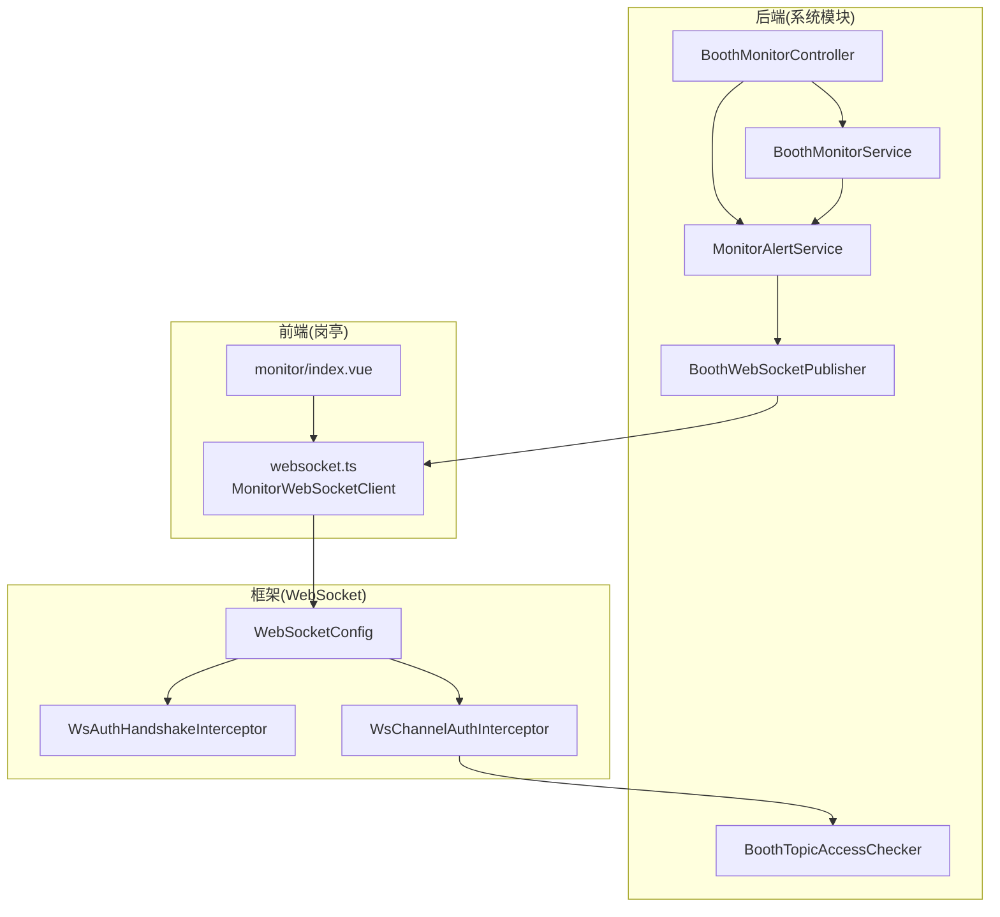
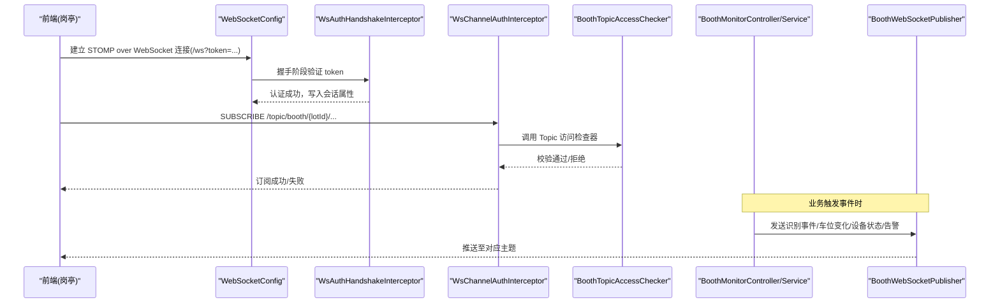
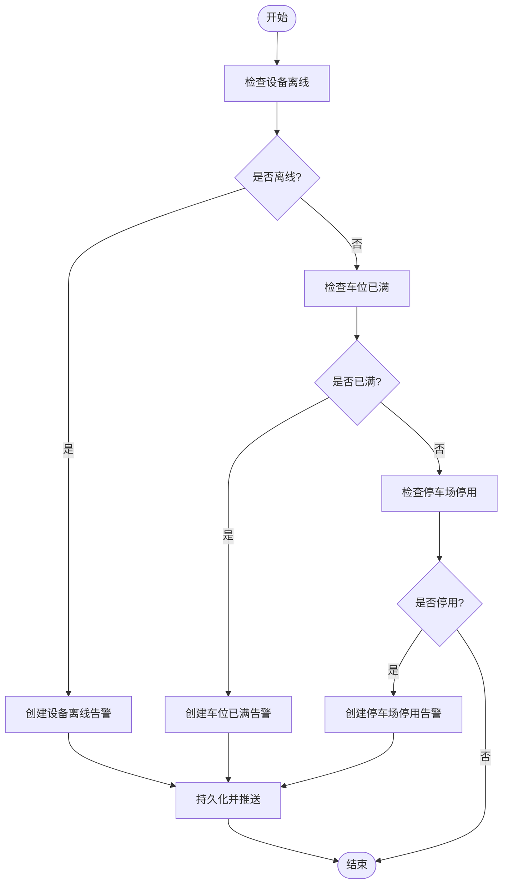
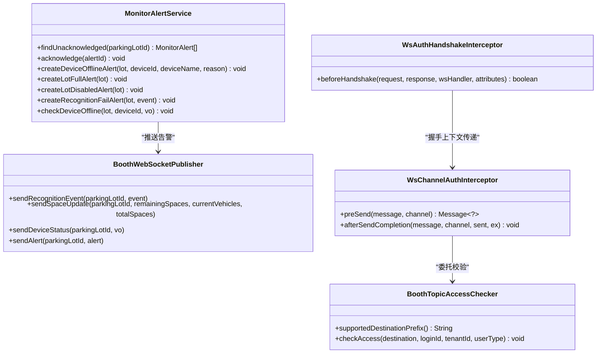
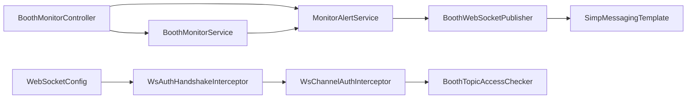

# 监控告警接口

<cite>
**本文引用的文件**
- [BoothMonitorController.java](file://parking-system/src/main/java/com/jushan/system/controller/BoothMonitorController.java)
- [BoothMonitorService.java](file://parking-system/src/main/java/com/jushan/system/service/BoothMonitorService.java)
- [MonitorAlertService.java](file://parking-system/src/main/java/com/jushan/system/service/MonitorAlertService.java)
- [BoothWebSocketPublisher.java](file://parking-system/src/main/java/com/jushan/system/ws/BoothWebSocketPublisher.java)
- [BoothTopicAccessChecker.java](file://parking-system/src/main/java/com/jushan/system/ws/BoothTopicAccessChecker.java)
- [WebSocketConfig.java](file://parking-framework/src/main/java/com/jushan/framework/ws/WebSocketConfig.java)
- [WsAuthHandshakeInterceptor.java](file://parking-framework/src/main/java/com/jushan/framework/ws/WsAuthHandshakeInterceptor.java)
- [WsChannelAuthInterceptor.java](file://parking-framework/src/main/java/com/jushan/framework/ws/WsChannelAuthInterceptor.java)
- [MonitorAlert.java](file://parking-system/src/main/java/com/jushan/system/entity/MonitorAlert.java)
- [MonitorAlertMapper.java](file://parking-system/src/main/java/com/jushan/system/mapper/MonitorAlertMapper.java)
- [BoothMonitorSnapshotVO.java](file://parking-system/src/main/java/com/jushan/system/vo/BoothMonitorSnapshotVO.java)
- [MonitorAlertVO.java](file://parking-system/src/main/java/com/jushan/system/vo/MonitorAlertVO.java)
- [websocket.ts](file://booth-web/src/utils/websocket.ts)
- [monitor/index.vue](file://booth-web/src/views/monitor/index.vue)
</cite>

## 目录
1. [简介](#简介)
2. [项目结构](#项目结构)
3. [核心组件](#核心组件)
4. [架构总览](#架构总览)
5. [详细组件分析](#详细组件分析)
6. [依赖关系分析](#依赖关系分析)
7. [性能与可扩展性](#性能与可扩展性)
8. [故障排查指南](#故障排查指南)
9. [结论](#结论)
10. [附录：API 定义](#附录api-定义)

## 简介
本文件为“监控告警接口”的权威 API 文档，覆盖以下能力：
- 实时监控面板初始化快照、设备状态刷新
- 异常提醒（告警）规则、持久化、确认与推送
- WebSocket 实时推送（识别事件、车位变化、设备状态、异常提醒）
- 连接管理、消息订阅发布机制与安全校验
- 岗亭端实时监控、设备状态跟踪与异常处理
- 告警历史查询建议与性能优化建议

## 项目结构
后端采用分层架构：控制器层暴露 HTTP 接口；服务层实现业务逻辑；WebSocket 推送器负责实时数据广播；框架层提供 STOMP over WebSocket 基础配置与安全拦截。前端岗亭端通过 STOMP 客户端建立连接并订阅主题。

图表来源
- [WebSocketConfig.java:1-92](file://parking-framework/src/main/java/com/jushan/framework/ws/WebSocketConfig.java#L1-L92)
- [WsAuthHandshakeInterceptor.java:1-140](file://parking-framework/src/main/java/com/jushan/framework/ws/WsAuthHandshakeInterceptor.java#L1-L140)
- [WsChannelAuthInterceptor.java:1-216](file://parking-framework/src/main/java/com/jushan/framework/ws/WsChannelAuthInterceptor.java#L1-L216)
- [BoothTopicAccessChecker.java:1-180](file://parking-system/src/main/java/com/jushan/system/ws/BoothTopicAccessChecker.java#L1-L180)
- [BoothMonitorController.java:1-76](file://parking-system/src/main/java/com/jushan/system/controller/BoothMonitorController.java#L1-L76)
- [BoothMonitorService.java:1-292](file://parking-system/src/main/java/com/jushan/system/service/BoothMonitorService.java#L1-L292)
- [MonitorAlertService.java:1-232](file://parking-system/src/main/java/com/jushan/system/service/MonitorAlertService.java#L1-L232)
- [BoothWebSocketPublisher.java:1-177](file://parking-system/src/main/java/com/jushan/system/ws/BoothWebSocketPublisher.java#L1-L177)
- [websocket.ts:1-182](file://booth-web/src/utils/websocket.ts#L1-L182)
- [monitor/index.vue:129-162](file://booth-web/src/views/monitor/index.vue#L129-L162)

章节来源
- [BoothMonitorController.java:1-76](file://parking-system/src/main/java/com/jushan/system/controller/BoothMonitorController.java#L1-L76)
- [WebSocketConfig.java:1-92](file://parking-framework/src/main/java/com/jushan/framework/ws/WebSocketConfig.java#L1-L92)

## 核心组件
- 控制器层
  - 岗亭监控控制器：提供监控快照、设备状态刷新、异常提醒确认等 REST 接口。
- 服务层
  - 监控快照服务：聚合停车场信息、车道、最近识别事件、设备状态与未确认告警。
  - 异常提醒服务：检测离线/满场/停用/识别失败等条件，生成告警并持久化与推送。
- 推送层
  - 岗亭 WebSocket 推送器：按停车场维度向 /topic/booth/{id}/... 主题推送事件。
- 安全与通道
  - WebSocket 配置：注册 STOMP 端点、Broker 前缀与用户队列。
  - 握手鉴权拦截器：从 URL 或请求头提取 token 并完成登录态校验。
  - 通道鉴权拦截器：对 SUBSCRIBE/SEND 进行权限与数据范围校验，委派至业务 Topic 访问检查器。
  - 岗亭 Topic 访问检查器：仅允许租户用户订阅 /topic/booth/{parkingLotId}/**，并进行授权范围校验。
- 前端
  - 岗亭监控页面：展示异常列表并提供“确认”操作。
  - WebSocket 客户端封装：自动重连、断线恢复订阅、心跳保活、统一错误回调。

章节来源
- [BoothMonitorController.java:1-76](file://parking-system/src/main/java/com/jushan/system/controller/BoothMonitorController.java#L1-L76)
- [BoothMonitorService.java:1-292](file://parking-system/src/main/java/com/jushan/system/service/BoothMonitorService.java#L1-L292)
- [MonitorAlertService.java:1-232](file://parking-system/src/main/java/com/jushan/system/service/MonitorAlertService.java#L1-L232)
- [BoothWebSocketPublisher.java:1-177](file://parking-system/src/main/java/com/jushan/system/ws/BoothWebSocketPublisher.java#L1-L177)
- [WebSocketConfig.java:1-92](file://parking-framework/src/main/java/com/jushan/framework/ws/WebSocketConfig.java#L1-L92)
- [WsAuthHandshakeInterceptor.java:1-140](file://parking-framework/src/main/java/com/jushan/framework/ws/WsAuthHandshakeInterceptor.java#L1-L140)
- [WsChannelAuthInterceptor.java:1-216](file://parking-framework/src/main/java/com/jushan/framework/ws/WsChannelAuthInterceptor.java#L1-L216)
- [BoothTopicAccessChecker.java:1-180](file://parking-system/src/main/java/com/jushan/system/ws/BoothTopicAccessChecker.java#L1-L180)
- [websocket.ts:1-182](file://booth-web/src/utils/websocket.ts#L1-L182)
- [monitor/index.vue:129-162](file://booth-web/src/views/monitor/index.vue#L129-L162)

## 架构总览
下图展示了从前端连接到实时推送的全链路流程，包括握手鉴权、订阅校验、服务端推送与前端消费。

图表来源
- [WebSocketConfig.java:1-92](file://parking-framework/src/main/java/com/jushan/framework/ws/WebSocketConfig.java#L1-L92)
- [WsAuthHandshakeInterceptor.java:1-140](file://parking-framework/src/main/java/com/jushan/framework/ws/WsAuthHandshakeInterceptor.java#L1-L140)
- [WsChannelAuthInterceptor.java:1-216](file://parking-framework/src/main/java/com/jushan/framework/ws/WsChannelAuthInterceptor.java#L1-L216)
- [BoothTopicAccessChecker.java:1-180](file://parking-system/src/main/java/com/jushan/system/ws/BoothTopicAccessChecker.java#L1-L180)
- [BoothMonitorController.java:1-76](file://parking-system/src/main/java/com/jushan/system/controller/BoothMonitorController.java#L1-L76)
- [BoothWebSocketPublisher.java:1-177](file://parking-system/src/main/java/com/jushan/system/ws/BoothWebSocketPublisher.java#L1-L177)

## 详细组件分析

### 实时监控面板（HTTP）
- 获取监控快照
  - 路径与方法：GET /booth/monitor/snapshot
  - 参数：parkingLotId（必填）
  - 权限：需要 booth:monitor 权限
  - 返回：包含停车场摘要、车道列表、最近识别事件、设备状态、未确认告警
- 刷新设备状态
  - 路径与方法：POST /booth/monitor/devices/refresh
  - 参数：parkingLotId（必填）
  - 权限：需要 booth:monitor 权限
  - 返回：最新设备状态列表（会触发远程设备状态查询）
- 确认异常提醒
  - 路径与方法：POST /booth/monitor/alerts/{alertId}/ack
  - 路径参数：alertId
  - 权限：需要 booth:monitor 权限
  - 返回：成功响应

章节来源
- [BoothMonitorController.java:1-76](file://parking-system/src/main/java/com/jushan/system/controller/BoothMonitorController.java#L1-L76)
- [BoothMonitorService.java:1-292](file://parking-system/src/main/java/com/jushan/system/service/BoothMonitorService.java#L1-L292)
- [BoothMonitorSnapshotVO.java:1-45](file://parking-system/src/main/java/com/jushan/system/vo/BoothMonitorSnapshotVO.java#L1-L45)

### 异常提醒（告警）规则与处理
- 触发条件
  - 设备离线：根据设备状态快照判定在线/查询成功/是否过期
  - 车位已满：剩余车位 <= 0
  - 停车场停用：停车场状态为停用
  - 识别失败：识别事件处理失败时生成
- 去重策略
  - 同一停车场 + 同类型 + 同来源（如设备ID）且未确认的告警不会重复创建
- 持久化与推送
  - 插入告警记录后，立即通过 WebSocket 推送至 /topic/booth/{parkingLotId}/alerts
- 确认流程
  - 将 acknowledged 置为已确认并记录确认时间，同时更新数据库

图表来源
- [MonitorAlertService.java:1-232](file://parking-system/src/main/java/com/jushan/system/service/MonitorAlertService.java#L1-L232)
- [MonitorAlert.java:1-101](file://parking-system/src/main/java/com/jushan/system/entity/MonitorAlert.java#L1-L101)
- [BoothWebSocketPublisher.java:1-177](file://parking-system/src/main/java/com/jushan/system/ws/BoothWebSocketPublisher.java#L1-L177)

章节来源
- [MonitorAlertService.java:1-232](file://parking-system/src/main/java/com/jushan/system/service/MonitorAlertService.java#L1-L232)
- [MonitorAlert.java:1-101](file://parking-system/src/main/java/com/jushan/system/entity/MonitorAlert.java#L1-L101)
- [MonitorAlertMapper.java:1-16](file://parking-system/src/main/java/com/jushan/system/mapper/MonitorAlertMapper.java#L1-L16)
- [MonitorAlertVO.java:1-40](file://parking-system/src/main/java/com/jushan/system/vo/MonitorAlertVO.java#L1-L40)

### WebSocket 推送与订阅
- 端点与协议
  - STOMP over WebSocket 端点：/ws
  - 支持 SockJS 降级
- 目标前缀约定
  - 客户端→服务端：/app/**
  - 服务端→客户端广播：/topic/**
  - 服务端→客户端私信：/user/**
- 认证与授权
  - 握手阶段：从 URL 参数或 Authorization 头提取 token，校验登录态
  - 通道级：SUBSCRIBE 到私有主题需认证，并通过 Topic 访问检查器校验数据范围
- 推送主题（按停车场隔离）
  - 识别事件：/topic/booth/{parkingLotId}/events
  - 车位变化：/topic/booth/{parkingLotId}/spaces
  - 设备状态：/topic/booth/{parkingLotId}/device-status
  - 异常提醒：/topic/booth/{parkingLotId}/alerts
- 前端订阅与重连
  - 自动重连（指数退避）、断线恢复订阅、心跳保活、统一错误回调

图表来源
- [BoothWebSocketPublisher.java:1-177](file://parking-system/src/main/java/com/jushan/system/ws/BoothWebSocketPublisher.java#L1-L177)
- [MonitorAlertService.java:1-232](file://parking-system/src/main/java/com/jushan/system/service/MonitorAlertService.java#L1-L232)
- [BoothTopicAccessChecker.java:1-180](file://parking-system/src/main/java/com/jushan/system/ws/BoothTopicAccessChecker.java#L1-L180)
- [WsChannelAuthInterceptor.java:1-216](file://parking-framework/src/main/java/com/jushan/framework/ws/WsChannelAuthInterceptor.java#L1-L216)
- [WsAuthHandshakeInterceptor.java:1-140](file://parking-framework/src/main/java/com/jushan/framework/ws/WsAuthHandshakeInterceptor.java#L1-L140)

章节来源
- [WebSocketConfig.java:1-92](file://parking-framework/src/main/java/com/jushan/framework/ws/WebSocketConfig.java#L1-L92)
- [websocket.ts:1-182](file://booth-web/src/utils/websocket.ts#L1-L182)
- [monitor/index.vue:129-162](file://booth-web/src/views/monitor/index.vue#L129-L162)

## 依赖关系分析
- 控制器依赖服务：BoothMonitorController → BoothMonitorService、MonitorAlertService
- 服务间协作：BoothMonitorService 在快照生成与设备刷新中调用 MonitorAlertService 生成告警
- 告警服务依赖推送：MonitorAlertService → BoothWebSocketPublisher
- 推送器使用 Spring Messaging：SimpMessagingTemplate
- 安全链：WebSocketConfig → WsAuthHandshakeInterceptor → WsChannelAuthInterceptor → BoothTopicAccessChecker
- 前端依赖：websocket.ts 封装 STOMP 客户端，monitor/index.vue 消费告警列表与确认动作

图表来源
- [BoothMonitorController.java:1-76](file://parking-system/src/main/java/com/jushan/system/controller/BoothMonitorController.java#L1-L76)
- [BoothMonitorService.java:1-292](file://parking-system/src/main/java/com/jushan/system/service/BoothMonitorService.java#L1-L292)
- [MonitorAlertService.java:1-232](file://parking-system/src/main/java/com/jushan/system/service/MonitorAlertService.java#L1-L232)
- [BoothWebSocketPublisher.java:1-177](file://parking-system/src/main/java/com/jushan/system/ws/BoothWebSocketPublisher.java#L1-L177)
- [WebSocketConfig.java:1-92](file://parking-framework/src/main/java/com/jushan/framework/ws/WebSocketConfig.java#L1-L92)
- [WsAuthHandshakeInterceptor.java:1-140](file://parking-framework/src/main/java/com/jushan/framework/ws/WsAuthHandshakeInterceptor.java#L1-L140)
- [WsChannelAuthInterceptor.java:1-216](file://parking-framework/src/main/java/com/jushan/framework/ws/WsChannelAuthInterceptor.java#L1-L216)
- [BoothTopicAccessChecker.java:1-180](file://parking-system/src/main/java/com/jushan/system/ws/BoothTopicAccessChecker.java#L1-L180)

## 性能与可扩展性
- 推送幂等与容错
  - 推送方法内部捕获异常，避免影响主业务事务
- 去重与限流
  - 告警按“停车场+类型+来源”去重，避免重复推送
  - 未确认告警查询限制上限，防止一次性返回过多数据
- 连接稳定性
  - 前端指数退避重连、心跳保活、断线恢复订阅
- 扩展建议
  - 生产环境可启用外部 STOMP broker（如 RabbitMQ STOMP plugin），由 Nginx 代理 WebSocket 连接
  - 热点设备状态刷新可考虑缓存与批量查询优化

[本节为通用指导，不直接分析具体文件]

## 故障排查指南
- 连接失败
  - 检查 token 是否有效、URL 是否正确、跨域是否放行
  - 查看握手拦截器日志，确认登录态与租户上下文是否正确写入
- 订阅被拒
  - 确认当前用户具备 booth:monitor 权限且属于租户用户
  - 检查 Topic 访问检查器日志，确认 parkingLotId 解析与授权范围
- 推送未达
  - 检查推送器日志，确认 destination 与 payload 格式
  - 确认前端订阅路径与主题一致
- 告警重复
  - 检查是否存在未确认的同源告警，确认去重逻辑生效
- 设备状态刷新慢
  - 注意该接口会触发远程设备状态查询，建议在 UI 上提示加载状态

章节来源
- [WsAuthHandshakeInterceptor.java:1-140](file://parking-framework/src/main/java/com/jushan/framework/ws/WsAuthHandshakeInterceptor.java#L1-L140)
- [WsChannelAuthInterceptor.java:1-216](file://parking-framework/src/main/java/com/jushan/framework/ws/WsChannelAuthInterceptor.java#L1-L216)
- [BoothTopicAccessChecker.java:1-180](file://parking-system/src/main/java/com/jushan/system/ws/BoothTopicAccessChecker.java#L1-L180)
- [BoothWebSocketPublisher.java:1-177](file://parking-system/src/main/java/com/jushan/system/ws/BoothWebSocketPublisher.java#L1-L177)
- [MonitorAlertService.java:1-232](file://parking-system/src/main/java/com/jushan/system/service/MonitorAlertService.java#L1-L232)

## 结论
本方案以 STOMP over WebSocket 为核心，结合严格的握手鉴权与通道级数据范围校验，实现了面向岗亭端的实时监控与告警推送。通过服务层去重与容错、前端重连与心跳，保障了高可用与低延迟体验。后续可在生产环境引入外部 STOMP broker 以提升横向扩展能力。

[本节为总结，不直接分析具体文件]

## 附录：API 定义

### 实时监控（REST）
- 获取监控快照
  - 方法：GET
  - 路径：/booth/monitor/snapshot
  - 参数：parkingLotId（必填）
  - 权限：booth:monitor
  - 返回：监控快照对象（含停车场、车道、最近事件、设备状态、未确认告警）
- 刷新设备状态
  - 方法：POST
  - 路径：/booth/monitor/devices/refresh
  - 参数：parkingLotId（必填）
  - 权限：booth:monitor
  - 返回：设备状态列表
- 确认异常提醒
  - 方法：POST
  - 路径：/booth/monitor/alerts/{alertId}/ack
  - 路径参数：alertId
  - 权限：booth:monitor
  - 返回：成功响应

章节来源
- [BoothMonitorController.java:1-76](file://parking-system/src/main/java/com/jushan/system/controller/BoothMonitorController.java#L1-L76)
- [BoothMonitorService.java:1-292](file://parking-system/src/main/java/com/jushan/system/service/BoothMonitorService.java#L1-L292)
- [BoothMonitorSnapshotVO.java:1-45](file://parking-system/src/main/java/com/jushan/system/vo/BoothMonitorSnapshotVO.java#L1-L45)

### WebSocket 主题与消息
- 端点：/ws（STOMP over WebSocket，支持 SockJS）
- 认证方式：URL 参数 token 或 Authorization 头
- 主题列表（按停车场隔离）
  - /topic/booth/{parkingLotId}/events — 识别事件
  - /topic/booth/{parkingLotId}/spaces — 车位变化
  - /topic/booth/{parkingLotId}/device-status — 设备状态
  - /topic/booth/{parkingLotId}/alerts — 异常提醒
- 前端行为
  - 连接成功后自动订阅上述主题
  - 断线自动重连并恢复订阅
  - 心跳保活与错误回调

章节来源
- [WebSocketConfig.java:1-92](file://parking-framework/src/main/java/com/jushan/framework/ws/WebSocketConfig.java#L1-L92)
- [websocket.ts:1-182](file://booth-web/src/utils/websocket.ts#L1-L182)
- [monitor/index.vue:129-162](file://booth-web/src/views/monitor/index.vue#L129-L162)

### 告警模型与字段
- 实体字段
  - id、tenantId、parkingLotId、alertType、severity、sourceId、message、acknowledged、createdAt、acknowledgedAt
- 常见类型与级别
  - 类型：DEVICE_OFFLINE、LOT_FULL、LOT_DISABLED、RECOGNITION_FAIL
  - 级别：WARNING、CRITICAL
- 视图对象
  - 对外返回 id、alertType、severity、sourceId、message、createdAt

章节来源
- [MonitorAlert.java:1-101](file://parking-system/src/main/java/com/jushan/system/entity/MonitorAlert.java#L1-L101)
- [MonitorAlertVO.java:1-40](file://parking-system/src/main/java/com/jushan/system/vo/MonitorAlertVO.java#L1-L40)