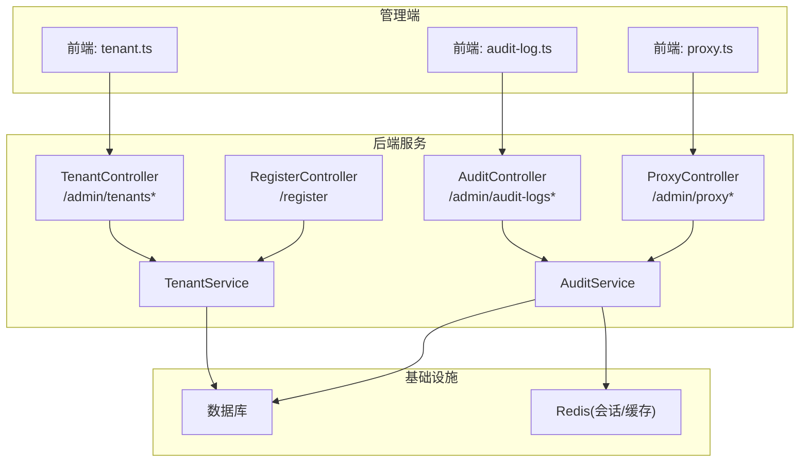
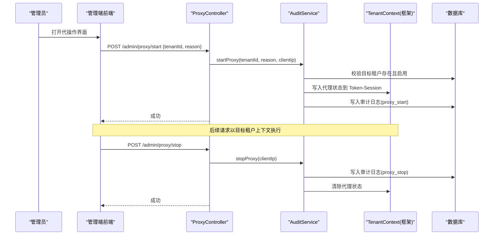
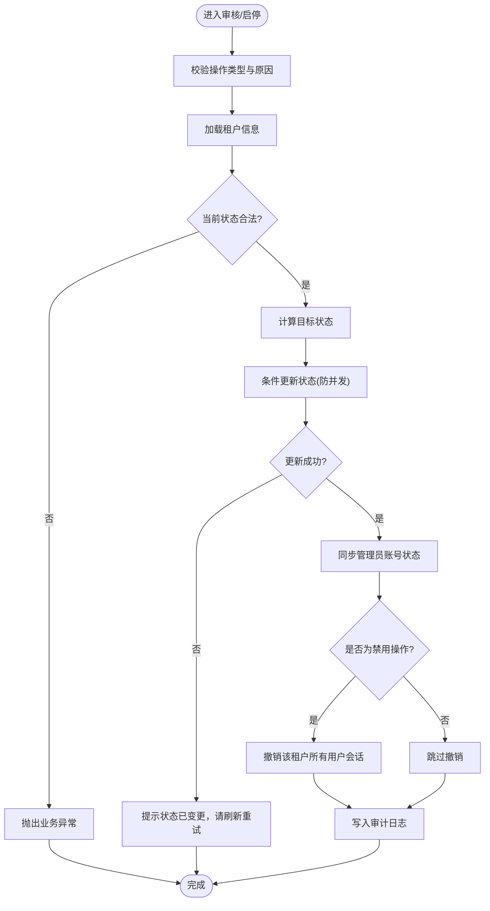
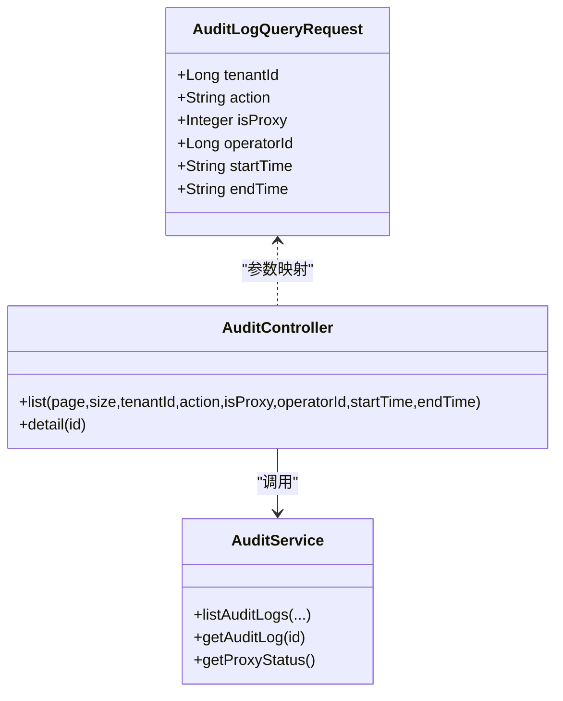
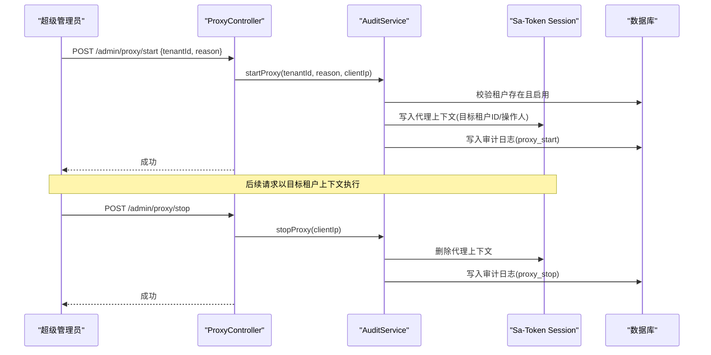
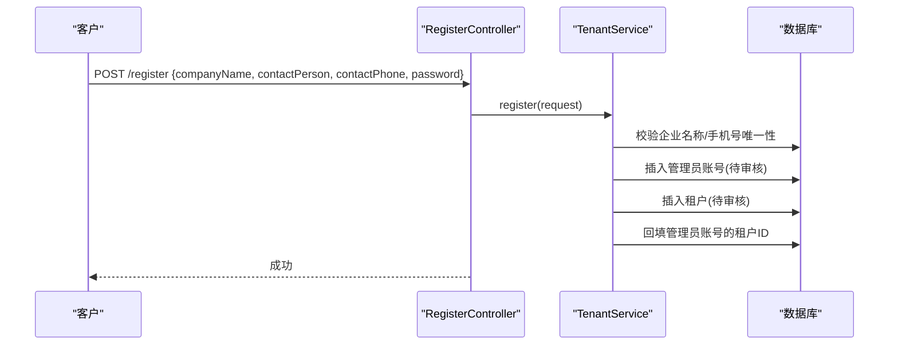
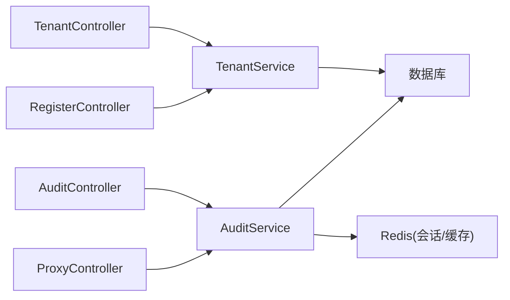

# 系统管理接口

<cite>
**本文引用的文件**
- [README.md](file://README.md)
- [TenantController.java](file://parking-system/src/main/java/com/jushan/system/controller/TenantController.java)
- [AuditController.java](file://parking-system/src/main/java/com/jushan/system/controller/AuditController.java)
- [ProxyController.java](file://parking-system/src/main/java/com/jushan/system/controller/ProxyController.java)
- [RegisterController.java](file://parking-system/src/main/java/com/jushan/system/controller/RegisterController.java)
- [TenantService.java](file://parking-system/src/main/java/com/jushan/system/service/TenantService.java)
- [AuditService.java](file://parking-system/src/main/java/com/jushan/system/service/AuditService.java)
- [AuditLogQueryRequest.java](file://parking-system/src/main/java/com/jushan/system/dto/AuditLogQueryRequest.java)
- [ReadinessHealthIndicator.java](file://parking-boot/src/main/java/com/jushan/boot/health/ReadinessHealthIndicator.java)
- [tenant.ts](file://admin-web/src/api/tenant.ts)
- [audit-log.ts](file://admin-web/src/api/audit-log.ts)
- [proxy.ts](file://admin-web/src/api/proxy.ts)
- [V20260711004__tenant_and_registration.sql](file://parking-boot/src/main/resources/db/migration/V20260711004__tenant_and_registration.sql)
</cite>

## 目录
1. [简介](#简介)
2. [项目结构](#项目结构)
3. [核心组件](#核心组件)
4. [架构总览](#架构总览)
5. [详细组件分析](#详细组件分析)
6. [依赖关系分析](#依赖关系分析)
7. [性能与监控](#性能与监控)
8. [故障排查指南](#故障排查指南)
9. [结论](#结论)
10. [附录：API 定义](#附录api-定义)

## 简介
本文件面向平台管理员与运维人员，系统化梳理系统管理相关接口，覆盖多租户注册审核、审计日志查询、代理（代操作）配置、健康检查与基础运维能力。文档同时说明多租户数据隔离机制与安全合规要点，并提供可操作的排障建议与最佳实践。

## 项目结构
系统管理功能主要分布在以下模块：
- parking-system：业务控制器与服务实现（租户管理、审计日志、代理模式）
- parking-boot：启动与健康检查（就绪探针）
- admin-web：管理端前端 API 调用封装（用于对接上述后端接口）

图表来源
- [TenantController.java:1-81](file://parking-system/src/main/java/com/jushan/system/controller/TenantController.java#L1-L81)
- [AuditController.java:1-78](file://parking-system/src/main/java/com/jushan/system/controller/AuditController.java#L1-L78)
- [ProxyController.java:1-89](file://parking-system/src/main/java/com/jushan/system/controller/ProxyController.java#L1-L89)
- [RegisterController.java:1-50](file://parking-system/src/main/java/com/jushan/system/controller/RegisterController.java#L1-L50)
- [TenantService.java:1-438](file://parking-system/src/main/java/com/jushan/system/service/TenantService.java#L1-L438)
- [AuditService.java:1-418](file://parking-system/src/main/java/com/jushan/system/service/AuditService.java#L1-L418)
- [tenant.ts:1-34](file://admin-web/src/api/tenant.ts#L1-L34)
- [audit-log.ts:1-42](file://admin-web/src/api/audit-log.ts#L1-L42)
- [proxy.ts:1-26](file://admin-web/src/api/proxy.ts#L1-L26)

章节来源
- [README.md:1-75](file://README.md#L1-L75)

## 核心组件
- 租户管理
  - 提供租户列表、详情、审核与启停能力；支持状态机流转与并发安全更新；禁用时自动撤销该租户用户会话。
- 审计日志
  - 提供分页查询与详情查看；平台用户可跨租户筛选，租户用户仅可见本租户数据；记录真实操作人、是否代操作、客户端 IP 等。
- 代理（代操作）
  - 超级管理员可启动/停止代操作模式；在目标租户上下文中执行后续请求，并强制审计；退出时清理代理状态。
- 客户自助注册
  - 公开注册入口，创建待审核租户与管理员账号，等待运营审核。
- 健康检查
  - 自定义就绪探针，检查数据库与 Redis 连通性，便于容器编排进行就绪探测。

章节来源
- [TenantController.java:1-81](file://parking-system/src/main/java/com/jushan/system/controller/TenantController.java#L1-L81)
- [AuditController.java:1-78](file://parking-system/src/main/java/com/jushan/system/controller/AuditController.java#L1-L78)
- [ProxyController.java:1-89](file://parking-system/src/main/java/com/jushan/system/controller/ProxyController.java#L1-L89)
- [RegisterController.java:1-50](file://parking-system/src/main/java/com/jushan/system/controller/RegisterController.java#L1-L50)
- [TenantService.java:1-438](file://parking-system/src/main/java/com/jushan/system/service/TenantService.java#L1-L438)
- [AuditService.java:1-418](file://parking-system/src/main/java/com/jushan/system/service/AuditService.java#L1-L418)
- [ReadinessHealthIndicator.java:1-113](file://parking-boot/src/main/java/com/jushan/boot/health/ReadinessHealthIndicator.java#L1-L113)

## 架构总览
系统管理采用“控制器 + 服务”分层设计，结合权限注解与数据范围控制，确保多租户数据隔离与操作可审计。代理模式通过 Token-Session 存储代理上下文，由框架层过滤器注入目标租户 ID，并在写操作中强制写入审计日志。

图表来源
- [ProxyController.java:1-89](file://parking-system/src/main/java/com/jushan/system/controller/ProxyController.java#L1-L89)
- [AuditService.java:1-418](file://parking-system/src/main/java/com/jushan/system/service/AuditService.java#L1-L418)

## 详细组件分析

### 租户管理接口
- 能力概览
  - 分页查询租户列表：支持按状态筛选
  - 查询租户详情
  - 审核/启停租户：支持 APPROVED、REJECTED、ENABLED、DISABLED 四种操作类型，含状态机校验与并发安全更新
- 权限要求
  - 列表/详情：需要 tenant:read
  - 审核/启停：需要 tenant:write
- 数据模型
  - 租户实体字段与约束见迁移脚本
- 关键流程
  - 审核通过：PENDING_REVIEW → ENABLED
  - 拒绝：PENDING_REVIEW → REJECTED
  - 启用/禁用：在 ENABLED 与 DISABLED 之间切换
  - 禁用后：撤销该租户所有用户会话，防止继续使用旧令牌

图表来源
- [TenantService.java:168-222](file://parking-system/src/main/java/com/jushan/system/service/TenantService.java#L168-L222)
- [TenantService.java:263-311](file://parking-system/src/main/java/com/jushan/system/service/TenantService.java#L263-L311)
- [TenantService.java:352-371](file://parking-system/src/main/java/com/jushan/system/service/TenantService.java#L352-L371)
- [V20260711004__tenant_and_registration.sql:9-29](file://parking-boot/src/main/resources/db/migration/V20260711004__tenant_and_registration.sql#L9-L29)

章节来源
- [TenantController.java:1-81](file://parking-system/src/main/java/com/jushan/system/controller/TenantController.java#L1-L81)
- [TenantService.java:1-438](file://parking-system/src/main/java/com/jushan/system/service/TenantService.java#L1-L438)
- [V20260711004__tenant_and_registration.sql:9-29](file://parking-boot/src/main/resources/db/migration/V20260711004__tenant_and_registration.sql#L9-L29)

### 审计日志接口
- 能力概览
  - 分页查询审计日志：支持按目标租户、操作类型、是否代操作、操作人、时间范围筛选
  - 查询单条审计日志详情
- 权限与数据范围
  - 权限：tenant:read
  - 平台用户可查看全平台日志并可按租户筛选；租户用户只能查看本租户日志
- 数据结构
  - 查询请求参数定义见 DTO
- 典型用途
  - 高风险操作追踪（如代理模式开启/关闭、租户审核等）
  - 安全合规性检查与问题回溯

图表来源
- [AuditController.java:1-78](file://parking-system/src/main/java/com/jushan/system/controller/AuditController.java#L1-L78)
- [AuditService.java:307-393](file://parking-system/src/main/java/com/jushan/system/service/AuditService.java#L307-L393)
- [AuditLogQueryRequest.java:1-46](file://parking-system/src/main/java/com/jushan/system/dto/AuditLogQueryRequest.java#L1-L46)

章节来源
- [AuditController.java:1-78](file://parking-system/src/main/java/com/jushan/system/controller/AuditController.java#L1-L78)
- [AuditService.java:307-393](file://parking-system/src/main/java/com/jushan/system/service/AuditService.java#L307-L393)
- [AuditLogQueryRequest.java:1-46](file://parking-system/src/main/java/com/jushan/system/dto/AuditLogQueryRequest.java#L1-L46)

### 代理（代操作）配置接口
- 能力概览
  - 启动代操作：仅超级管理员可执行，绑定目标租户至当前 Token-Session，后续请求以目标租户上下文执行
  - 停止代操作：清除代理状态，恢复为原平台用户身份
  - 获取代理状态：前端展示“平台代操作”标识
- 安全策略
  - 启动前校验：已在代理模式则拒绝；必须为超级管理员；目标租户必须存在且启用
  - 审计强制：代理开启/关闭均写入审计日志，失败时 fail-close（拒绝继续）
- 上下文注入
  - 代理状态保存在 Sa-Token User-Session，框架层过滤器据此替换 tenantId，使后续请求在目标租户上下文中执行

图表来源
- [ProxyController.java:1-89](file://parking-system/src/main/java/com/jushan/system/controller/ProxyController.java#L1-L89)
- [AuditService.java:85-199](file://parking-system/src/main/java/com/jushan/system/service/AuditService.java#L85-L199)

章节来源
- [ProxyController.java:1-89](file://parking-system/src/main/java/com/jushan/system/controller/ProxyController.java#L1-L89)
- [AuditService.java:1-418](file://parking-system/src/main/java/com/jushan/system/service/AuditService.java#L1-L418)

### 客户自助注册接口
- 能力概览
  - 公开注册入口，无需登录
  - 校验企业名称与手机号唯一性，避免重复注册
  - 创建待审核的管理员账号与租户，等待运营审核
- 事务与一致性
  - 注册过程在一个事务中完成，保证用户与租户数据一致性

图表来源
- [RegisterController.java:1-50](file://parking-system/src/main/java/com/jushan/system/controller/RegisterController.java#L1-L50)
- [TenantService.java:97-156](file://parking-system/src/main/java/com/jushan/system/service/TenantService.java#L97-L156)

章节来源
- [RegisterController.java:1-50](file://parking-system/src/main/java/com/jushan/system/controller/RegisterController.java#L1-L50)
- [TenantService.java:84-156](file://parking-system/src/main/java/com/jushan/system/service/TenantService.java#L84-L156)

### 健康检查接口
- 能力概览
  - 自定义就绪探针，检查 Spring 上下文、数据库连接、Redis 连通性
  - 适用于 K8s/Docker Compose 的 readiness probe
- 指标输出
  - 根据检查结果返回 Health 对象，包含各组件状态与详细信息

章节来源
- [ReadinessHealthIndicator.java:1-113](file://parking-boot/src/main/java/com/jushan/boot/health/ReadinessHealthIndicator.java#L1-L113)

## 依赖关系分析
- 控制器依赖服务层，服务层依赖 Mapper 访问数据库，部分服务使用 Sa-Token 会话与缓存
- 代理模式依赖框架层的租户上下文过滤器与数据范围控制，确保多租户数据隔离
- 审计日志贯穿关键操作，保障可追溯性与合规性

图表来源
- [TenantController.java:1-81](file://parking-system/src/main/java/com/jushan/system/controller/TenantController.java#L1-L81)
- [AuditController.java:1-78](file://parking-system/src/main/java/com/jushan/system/controller/AuditController.java#L1-L78)
- [ProxyController.java:1-89](file://parking-system/src/main/java/com/jushan/system/controller/ProxyController.java#L1-L89)
- [RegisterController.java:1-50](file://parking-system/src/main/java/com/jushan/system/controller/RegisterController.java#L1-L50)
- [TenantService.java:1-438](file://parking-system/src/main/java/com/jushan/system/service/TenantService.java#L1-L438)
- [AuditService.java:1-418](file://parking-system/src/main/java/com/jushan/system/service/AuditService.java#L1-L418)

## 性能与监控
- 审计日志写入
  - 非关键审计写入失败不影响主业务，但会记录错误日志；代理相关审计写入失败采用 fail-close，确保不可审计的操作被拒绝
- 代理模式
  - 通过 Token-Session 存储代理上下文，避免全局状态污染，不同 Token 互不影响
- 健康检查
  - 就绪探针快速检查数据库与 Redis 连通性，有助于容器编排快速发现不健康实例
- 前端调用
  - 管理端通过统一请求工具封装，减少重复代码并统一错误处理

章节来源
- [AuditService.java:249-305](file://parking-system/src/main/java/com/jushan/system/service/AuditService.java#L249-L305)
- [ReadinessHealthIndicator.java:1-113](file://parking-boot/src/main/java/com/jushan/boot/health/ReadinessHealthIndicator.java#L1-L113)
- [tenant.ts:1-34](file://admin-web/src/api/tenant.ts#L1-L34)
- [audit-log.ts:1-42](file://admin-web/src/api/audit-log.ts#L1-L42)
- [proxy.ts:1-26](file://admin-web/src/api/proxy.ts#L1-L26)

## 故障排查指南
- 代理模式无法启动
  - 检查当前是否已在代理模式；确认当前用户角色为超级管理员；确认目标租户存在且处于启用状态
- 代理模式下操作无效果或数据越界
  - 确认代理状态是否正确写入 Token-Session；检查框架层过滤器是否生效；退出代理后重新尝试
- 审计日志缺失
  - 关注代理相关审计写入是否失败（fail-close），若失败会导致操作被拒绝；普通审计写入失败不影响主业务但需记录错误日志
- 租户禁用后仍可使用
  - 确认禁用流程是否触发会话撤销；检查 Sa-Token 会话清理逻辑是否执行成功
- 健康检查失败
  - 检查数据库连接与 Redis 连通性；查看健康探针返回的详细错误信息

章节来源
- [AuditService.java:85-199](file://parking-system/src/main/java/com/jushan/system/service/AuditService.java#L85-L199)
- [TenantService.java:352-371](file://parking-system/src/main/java/com/jushan/system/service/TenantService.java#L352-L371)
- [ReadinessHealthIndicator.java:1-113](file://parking-boot/src/main/java/com/jushan/boot/health/ReadinessHealthIndicator.java#L1-L113)

## 结论
系统管理接口围绕多租户治理、审计追踪与代理运维三大主题构建，具备严格的状态机控制、数据范围隔离与强审计保障。配合健康检查与前端封装，形成完整的平台级管理能力。建议在上线前完善更多外部依赖的健康检查项，并持续优化审计日志的查询性能与索引策略。

## 附录：API 定义

### 租户管理
- 分页查询租户列表
  - 方法：GET
  - 路径：/admin/tenants
  - 权限：tenant:read
  - 参数：page、size、status（可选）
  - 响应：分页结果（租户视图）
- 查询租户详情
  - 方法：GET
  - 路径：/admin/tenants/{id}
  - 权限：tenant:read
  - 响应：租户视图
- 审核/启停租户
  - 方法：POST
  - 路径：/admin/tenants/{id}/audit
  - 权限：tenant:write
  - 请求体：{ action, reason? }
  - 动作类型：APPROVED、REJECTED、ENABLED、DISABLED
  - 响应：成功

章节来源
- [TenantController.java:1-81](file://parking-system/src/main/java/com/jushan/system/controller/TenantController.java#L1-L81)
- [tenant.ts:1-34](file://admin-web/src/api/tenant.ts#L1-L34)

### 审计日志
- 分页查询审计日志
  - 方法：GET
  - 路径：/admin/audit-logs
  - 权限：tenant:read
  - 参数：page、size、tenantId（可选）、action（可选）、isProxy（可选）、operatorId（可选）、startTime（可选）、endTime（可选）
  - 响应：分页结果（审计日志视图）
- 查询审计日志详情
  - 方法：GET
  - 路径：/admin/audit-logs/{id}
  - 权限：tenant:read
  - 响应：审计日志视图

章节来源
- [AuditController.java:1-78](file://parking-system/src/main/java/com/jushan/system/controller/AuditController.java#L1-L78)
- [audit-log.ts:1-42](file://admin-web/src/api/audit-log.ts#L1-L42)

### 代理（代操作）
- 启动代操作
  - 方法：POST
  - 路径：/admin/proxy/start
  - 权限：super_admin
  - 请求体：{ tenantId, reason }
  - 响应：成功
- 停止代操作
  - 方法：POST
  - 路径：/admin/proxy/stop
  - 权限：super_admin
  - 响应：成功
- 获取代理状态
  - 方法：GET
  - 路径：/admin/proxy/status
  - 权限：super_admin
  - 响应：代理状态（是否激活、目标租户信息等）

章节来源
- [ProxyController.java:1-89](file://parking-system/src/main/java/com/jushan/system/controller/ProxyController.java#L1-L89)
- [proxy.ts:1-26](file://admin-web/src/api/proxy.ts#L1-L26)

### 客户自助注册
- 提交注册申请
  - 方法：POST
  - 路径：/register
  - 权限：无需登录
  - 请求体：{ companyName, contactPerson, contactPhone, password }
  - 响应：成功

章节来源
- [RegisterController.java:1-50](file://parking-system/src/main/java/com/jushan/system/controller/RegisterController.java#L1-L50)