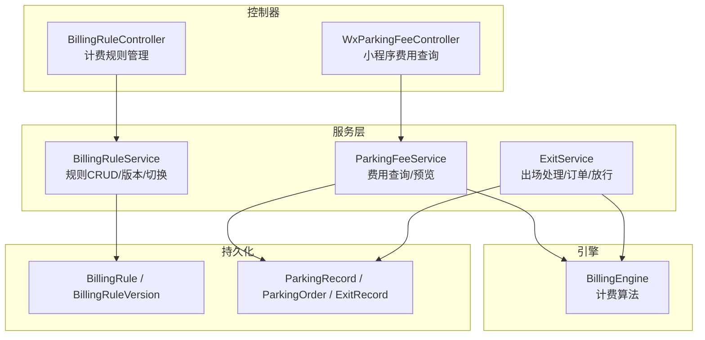
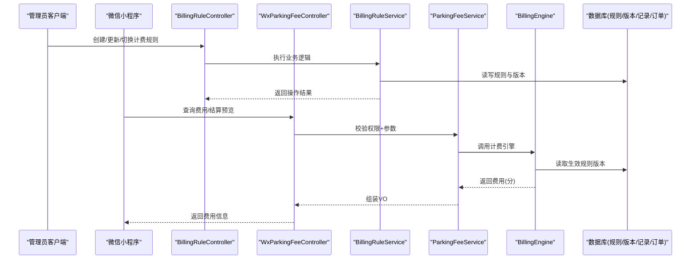
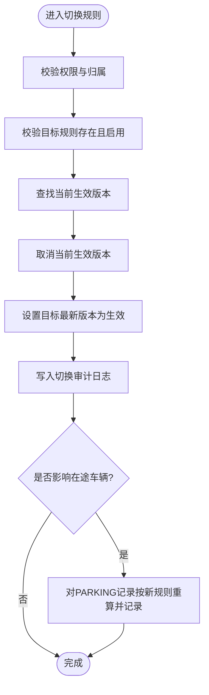
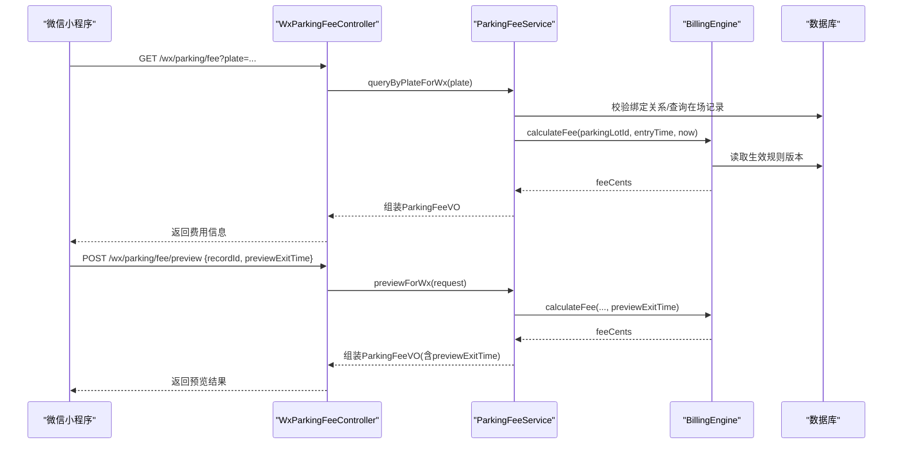
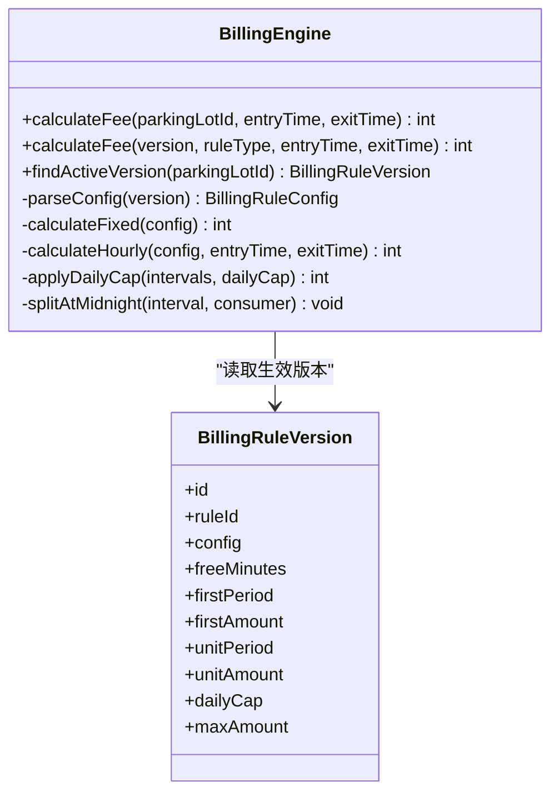
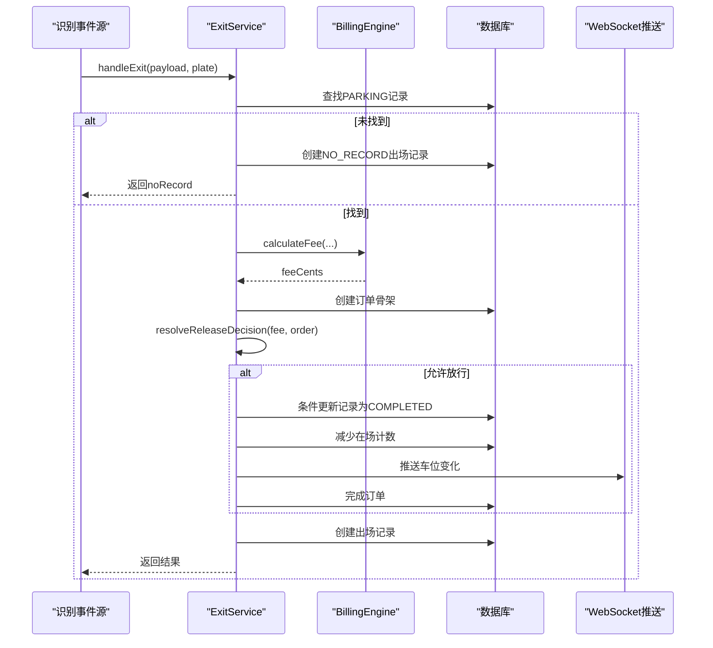
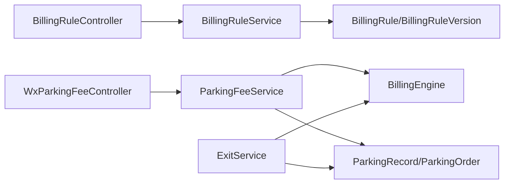
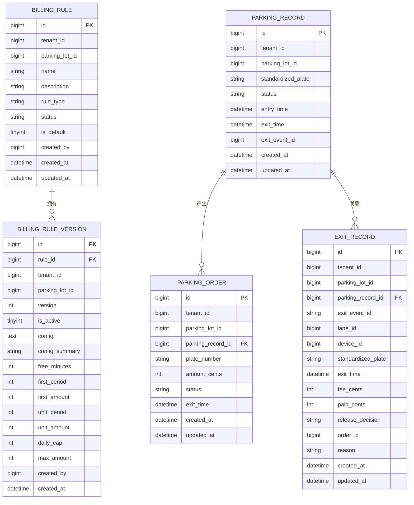

# 计费管理接口

<cite>
**本文引用的文件**   
- [BillingRuleController.java](file://parking-system/src/main/java/com/jushan/system/controller/BillingRuleController.java)
- [WxParkingFeeController.java](file://parking-system/src/main/java/com/jushan/system/controller/WxParkingFeeController.java)
- [BillingEngine.java](file://parking-system/src/main/java/com/jushan/system/service/BillingEngine.java)
- [BillingRuleService.java](file://parking-system/src/main/java/com/jushan/system/service/BillingRuleService.java)
- [ParkingFeeService.java](file://parking-system/src/main/java/com/jushan/system/service/ParkingFeeService.java)
- [ExitService.java](file://parking-system/src/main/java/com/jushan/system/service/ExitService.java)
- [BillingRule.java](file://parking-system/src/main/java/com/jushan/system/entity/BillingRule.java)
- [BillingRuleVersion.java](file://parking-system/src/main/java/com/jushan/system/entity/BillingRuleVersion.java)
- [ParkingRecord.java](file://parking-system/src/main/java/com/jushan/system/entity/ParkingRecord.java)
- [ParkingOrder.java](file://parking-system/src/main/java/com/jushan/system/entity/ParkingOrder.java)
- [ExitRecord.java](file://parking-system/src/main/java/com/jushan/system/entity/ExitRecord.java)
</cite>

## 目录
1. [简介](#简介)
2. [项目结构](#项目结构)
3. [核心组件](#核心组件)
4. [架构总览](#架构总览)
5. [详细组件分析](#详细组件分析)
6. [依赖分析](#依赖分析)
7. [性能考虑](#性能考虑)
8. [故障排查指南](#故障排查指南)
9. [结论](#结论)
10. [附录：API 定义与数据模型](#附录api-定义与数据模型)

## 简介
本文件面向“计费管理”相关接口的开发与集成，覆盖以下能力：
- 计费规则配置与版本管理（创建、更新、切换、历史）
- 费用计算引擎（支持免费、固定金额、按时长计费；含分时段、封顶策略）
- 订单管理与出场流程（匹配记录、生成订单、放行决策、状态更新）
- 小程序端费用查询与结算预览（按车牌/记录ID查询、预览重算）
- 计费准确性保证、并发处理与性能优化策略

说明：
- 所有金额以“分”为单位，禁止浮点数。
- 计费失败时采用“拒绝式”策略：无生效规则、规则禁用、配置解析失败或分时段冲突等场景直接报错，不猜测结果。

## 项目结构
计费相关代码位于 parking-system 模块中，主要包含控制器、服务层、引擎与实体：
- 控制器：admin 端计费规则管理、小程序端费用查询
- 服务层：计费规则服务、停车费用服务、出口处理服务
- 引擎：计费引擎（核心算法）
- 实体：计费规则、版本、停车记录、订单、出场记录

图示来源
- [BillingRuleController.java:1-160](file://parking-system/src/main/java/com/jushan/system/controller/BillingRuleController.java#L1-L160)
- [WxParkingFeeController.java:1-80](file://parking-system/src/main/java/com/jushan/system/controller/WxParkingFeeController.java#L1-L80)
- [BillingRuleService.java:1-681](file://parking-system/src/main/java/com/jushan/system/service/BillingRuleService.java#L1-L681)
- [ParkingFeeService.java:1-355](file://parking-system/src/main/java/com/jushan/system/service/ParkingFeeService.java#L1-L355)
- [ExitService.java:1-309](file://parking-system/src/main/java/com/jushan/system/service/ExitService.java#L1-L309)
- [BillingEngine.java:1-386](file://parking-system/src/main/java/com/jushan/system/service/BillingEngine.java#L1-L386)
- [BillingRule.java](file://parking-system/src/main/java/com/jushan/system/entity/BillingRule.java)
- [BillingRuleVersion.java](file://parking-system/src/main/java/com/jushan/system/entity/BillingRuleVersion.java)
- [ParkingRecord.java](file://parking-system/src/main/java/com/jushan/system/entity/ParkingRecord.java)
- [ParkingOrder.java](file://parking-system/src/main/java/com/jushan/system/entity/ParkingOrder.java)
- [ExitRecord.java](file://parking-system/src/main/java/com/jushan/system/entity/ExitRecord.java)

章节来源
- [BillingRuleController.java:1-160](file://parking-system/src/main/java/com/jushan/system/controller/BillingRuleController.java#L1-L160)
- [WxParkingFeeController.java:1-80](file://parking-system/src/main/java/com/jushan/system/controller/WxParkingFeeController.java#L1-L80)
- [BillingRuleService.java:1-681](file://parking-system/src/main/java/com/jushan/system/service/BillingRuleService.java#L1-L681)
- [ParkingFeeService.java:1-355](file://parking-system/src/main/java/com/jushan/system/service/ParkingFeeService.java#L1-L355)
- [ExitService.java:1-309](file://parking-system/src/main/java/com/jushan/system/service/ExitService.java#L1-L309)
- [BillingEngine.java:1-386](file://parking-system/src/main/java/com/jushan/system/service/BillingEngine.java#L1-L386)

## 核心组件
- 计费规则管理（Admin）
  - 列表/详情/创建/更新/版本历史/切换生效规则
  - 权限控制：billing:read、billing:write、billing:switch
- 小程序费用查询（WX）
  - 按车牌/记录ID查询当前费用
  - 结算预览（可指定预览出场时间进行重算）
- 计费引擎（核心）
  - 规则类型：NO_FEE、FIXED、HOURLY
  - HOURLY 支持：免费时长、首时段、单位时段、分时段、单日封顶、最大封顶
- 出场处理（Exit）
  - 匹配在场记录 → 计费 → 生成订单 → 放行决策 → 完成记录/减少计数 → 推送车位变化

章节来源
- [BillingRuleController.java:1-160](file://parking-system/src/main/java/com/jushan/system/controller/BillingRuleController.java#L1-L160)
- [WxParkingFeeController.java:1-80](file://parking-system/src/main/java/com/jushan/system/controller/WxParkingFeeController.java#L1-L80)
- [BillingEngine.java:1-386](file://parking-system/src/main/java/com/jushan/system/service/BillingEngine.java#L1-L386)
- [ExitService.java:1-309](file://parking-system/src/main/java/com/jushan/system/service/ExitService.java#L1-L309)

## 架构总览
计费链路从控制器到服务再到引擎，最终落库并返回结果。小程序侧仅读不写，保障安全与一致性。

图示来源
- [BillingRuleController.java:1-160](file://parking-system/src/main/java/com/jushan/system/controller/BillingRuleController.java#L1-L160)
- [WxParkingFeeController.java:1-80](file://parking-system/src/main/java/com/jushan/system/controller/WxParkingFeeController.java#L1-L80)
- [BillingRuleService.java:1-681](file://parking-system/src/main/java/com/jushan/system/service/BillingRuleService.java#L1-L681)
- [ParkingFeeService.java:1-355](file://parking-system/src/main/java/com/jushan/system/service/ParkingFeeService.java#L1-L355)
- [BillingEngine.java:1-386](file://parking-system/src/main/java/com/jushan/system/service/BillingEngine.java#L1-L386)

## 详细组件分析

### 计费规则管理（Admin）
- 功能范围
  - 分页查询规则列表（支持停车场、状态筛选）
  - 查询规则详情（含当前生效版本信息）
  - 创建规则（自动创建首个版本并设为生效）
  - 更新规则（若计费配置变更则创建新版本）
  - 查看版本历史
  - 切换生效规则（需原因，可选影响已在场车辆并重算）
- 权限要求
  - billing:read：查看
  - billing:write：创建/编辑
  - billing:switch：切换（岗亭人员无权）
- 关键约束
  - 租户隔离：所有操作基于当前会话推导租户范围
  - 名称唯一性：同一停车场下规则名不可重复
  - 版本不可变：已生效版本不直接修改，通过新建版本实现演进
  - 切换审计：记录切换前后规则ID、是否影响在途、原因

图示来源
- [BillingRuleController.java:130-160](file://parking-system/src/main/java/com/jushan/system/controller/BillingRuleController.java#L130-L160)
- [BillingRuleService.java:295-372](file://parking-system/src/main/java/com/jushan/system/service/BillingRuleService.java#L295-L372)

章节来源
- [BillingRuleController.java:1-160](file://parking-system/src/main/java/com/jushan/system/controller/BillingRuleController.java#L1-L160)
- [BillingRuleService.java:91-226](file://parking-system/src/main/java/com/jushan/system/service/BillingRuleService.java#L91-L226)
- [BillingRuleService.java:295-372](file://parking-system/src/main/java/com/jushan/system/service/BillingRuleService.java#L295-L372)
- [BillingRuleService.java:379-452](file://parking-system/src/main/java/com/jushan/system/service/BillingRuleService.java#L379-L452)
- [BillingRuleService.java:457-472](file://parking-system/src/main/java/com/jushan/system/service/BillingRuleService.java#L457-L472)
- [BillingRuleService.java:554-591](file://parking-system/src/main/java/com/jushan/system/service/BillingRuleService.java#L554-L591)

### 小程序费用查询与预览（WX）
- 能力
  - 按车牌查询当前费用（需绑定关系校验）
  - 按记录ID查询费用（需绑定关系校验）
  - 结算预览（支持自定义出场时间进行重算）
- 安全约束
  - 小程序端必须校验车牌属于当前微信用户
  - 不修改任何记录/订单状态，只读
- 返回内容要点
  - 记录ID、停车场ID、车牌、入场/出场时间、状态、是否应付
  - 费用（分）、时长（分钟）、免费时长、免费离场截止时间
  - 是否存在待支付订单及金额

图示来源
- [WxParkingFeeController.java:1-80](file://parking-system/src/main/java/com/jushan/system/controller/WxParkingFeeController.java#L1-L80)
- [ParkingFeeService.java:76-131](file://parking-system/src/main/java/com/jushan/system/service/ParkingFeeService.java#L76-L131)
- [BillingEngine.java:75-128](file://parking-system/src/main/java/com/jushan/system/service/BillingEngine.java#L75-L128)

章节来源
- [WxParkingFeeController.java:1-80](file://parking-system/src/main/java/com/jushan/system/controller/WxParkingFeeController.java#L1-L80)
- [ParkingFeeService.java:76-131](file://parking-system/src/main/java/com/jushan/system/service/ParkingFeeService.java#L76-L131)
- [ParkingFeeService.java:259-353](file://parking-system/src/main/java/com/jushan/system/service/ParkingFeeService.java#L259-L353)

### 计费引擎（核心算法）
- 支持的计费策略
  - NO_FEE：免费
  - FIXED：固定金额
  - HOURLY：按时长计费
    - 免费时长
    - 首时段 + 后续单位时段
    - 分时段计费（支持跨午夜）
    - 单日封顶（按自然日拆分按比例分摊）
    - 全局最大封顶
- 安全与健壮性
  - 金额使用整数分，负值抛异常
  - 无生效规则/规则禁用/配置解析失败/分时段冲突均抛异常
  - 时间校验：入场≤出场
- 复杂度
  - 分时段计费按时间块迭代，时间复杂度 O(N)，N 为计费块数量（通常较小）
  - 单日封顶按日期聚合，空间复杂度 O(D)，D 为涉及的自然日数

图示来源
- [BillingEngine.java:1-386](file://parking-system/src/main/java/com/jushan/system/service/BillingEngine.java#L1-L386)
- [BillingRuleVersion.java](file://parking-system/src/main/java/com/jushan/system/entity/BillingRuleVersion.java)

章节来源
- [BillingEngine.java:75-128](file://parking-system/src/main/java/com/jushan/system/service/BillingEngine.java#L75-L128)
- [BillingEngine.java:193-250](file://parking-system/src/main/java/com/jushan/system/service/BillingEngine.java#L193-L250)
- [BillingEngine.java:322-356](file://parking-system/src/main/java/com/jushan/system/service/BillingEngine.java#L322-L356)

### 出场处理与订单管理（Exit）
- 流程
  - 匹配同停车场未结记录
  - 计费引擎计算费用
  - 生成订单骨架（零元直接完成，否则待支付）
  - 决定放行策略（免费/已支付/待支付）
  - 条件更新停车记录状态（仅允许放行时）
  - 减少在场车辆计数并推送车位变化
  - 创建出场记录
- 并发与一致性
  - 使用条件更新避免并发覆盖
  - 仅在记录成功完成后才减少计数，确保一致性

图示来源
- [ExitService.java:83-134](file://parking-system/src/main/java/com/jushan/system/service/ExitService.java#L83-L134)
- [ExitService.java:185-196](file://parking-system/src/main/java/com/jushan/system/service/ExitService.java#L185-L196)
- [ExitService.java:199-228](file://parking-system/src/main/java/com/jushan/system/service/ExitService.java#L199-L228)
- [ExitService.java:255-307](file://parking-system/src/main/java/com/jushan/system/service/ExitService.java#L255-L307)
- [BillingEngine.java:75-128](file://parking-system/src/main/java/com/jushan/system/service/BillingEngine.java#L75-L128)

章节来源
- [ExitService.java:83-134](file://parking-system/src/main/java/com/jushan/system/service/ExitService.java#L83-L134)
- [ExitService.java:153-180](file://parking-system/src/main/java/com/jushan/system/service/ExitService.java#L153-L180)
- [ExitService.java:199-228](file://parking-system/src/main/java/com/jushan/system/service/ExitService.java#L199-L228)
- [ExitService.java:255-307](file://parking-system/src/main/java/com/jushan/system/service/ExitService.java#L255-L307)

## 依赖分析
- 控制器依赖服务层，服务层依赖引擎与Mapper
- 计费引擎依赖规则与版本实体映射
- 出场服务依赖计费引擎、订单与记录映射，以及WebSocket推送

图示来源
- [BillingRuleController.java:1-160](file://parking-system/src/main/java/com/jushan/system/controller/BillingRuleController.java#L1-L160)
- [WxParkingFeeController.java:1-80](file://parking-system/src/main/java/com/jushan/system/controller/WxParkingFeeController.java#L1-L80)
- [BillingRuleService.java:1-681](file://parking-system/src/main/java/com/jushan/system/service/BillingRuleService.java#L1-L681)
- [ParkingFeeService.java:1-355](file://parking-system/src/main/java/com/jushan/system/service/ParkingFeeService.java#L1-L355)
- [ExitService.java:1-309](file://parking-system/src/main/java/com/jushan/system/service/ExitService.java#L1-L309)
- [BillingEngine.java:1-386](file://parking-system/src/main/java/com/jushan/system/service/BillingEngine.java#L1-L386)

## 性能考虑
- 计费引擎
  - 分时段计费按时间块迭代，建议合理设置单位时段，避免过细导致块数过多
  - 单日封顶按日期聚合，尽量限制跨天跨度
- 查询与预览
  - 小程序费用查询为只读路径，注意索引：standardized_plate、status、entry_time
  - 预览接口应避免频繁调用，前端可做节流
- 出场处理
  - 条件更新避免并发覆盖，减少锁竞争
  - WebSocket推送失败不影响主流程，具备容错
- 缓存与幂等（建议）
  - 可对“生效规则版本”做短期缓存（如秒级），降低热点规则读取压力
  - 出场处理可结合消息幂等键，防止重复消费

[本节为通用指导，无需源码引用]

## 故障排查指南
- 常见错误
  - 未配置生效规则：检查该停车场是否存在激活的版本
  - 规则已禁用：确认规则状态为启用
  - 计费配置解析失败：检查版本配置JSON格式与字段完整性
  - 分时段冲突：检查时间段重叠情况
  - 小程序无权查询：确认车牌绑定关系与审核状态
- 定位方法
  - 查看计费日志输出（计费完成、失败原因）
  - 查看切换审计日志与重算日志
  - 核对停车记录状态与订单状态一致性

章节来源
- [BillingEngine.java:75-128](file://parking-system/src/main/java/com/jushan/system/service/BillingEngine.java#L75-L128)
- [BillingEngine.java:160-180](file://parking-system/src/main/java/com/jushan/system/service/BillingEngine.java#L160-L180)
- [BillingEngine.java:252-269](file://parking-system/src/main/java/com/jushan/system/service/BillingEngine.java#L252-L269)
- [BillingRuleService.java:554-591](file://parking-system/src/main/java/com/jushan/system/service/BillingRuleService.java#L554-L591)
- [ParkingFeeService.java:218-235](file://parking-system/src/main/java/com/jushan/system/service/ParkingFeeService.java#L218-L235)

## 结论
本计费体系以“规则即配置、版本可追溯、引擎纯函数式计算”为核心，配合严格的权限与安全约束，提供稳定可靠的计费能力。通过清晰的职责分层与完善的审计与日志，便于运维排障与持续演进。

[本节为总结，无需源码引用]

## 附录：API 定义与数据模型

### 管理端：计费规则管理（Admin）
- 基础路径：/admin/billing-rules
- 权限
  - billing:read：查询
  - billing:write：创建/更新
  - billing:switch：切换生效规则

| 方法 | 路径 | 说明 | 请求体/参数 | 响应 |
|---|---|---|---|---|
| GET | /admin/billing-rules | 分页查询规则列表 | page, size, parkingLotId?, status? | IPage<BillingRuleVO> |
| GET | /admin/billing-rules/{id} | 规则详情（含生效版本） | id | BillingRuleVO |
| POST | /admin/billing-rules | 创建规则（自动生成首个版本） | CreateBillingRuleRequest | BillingRuleVO |
| PUT | /admin/billing-rules/{id} | 更新规则（配置变更则新增版本） | UpdateBillingRuleRequest | BillingRuleVO |
| GET | /admin/billing-rules/{id}/versions | 版本历史 | id | List<BillingRuleVersionVO> |
| POST | /admin/billing-rules/parking-lots/{parkingLotId}/switch | 切换生效规则 | SwitchBillingRuleRequest | Void |

章节来源
- [BillingRuleController.java:61-160](file://parking-system/src/main/java/com/jushan/system/controller/BillingRuleController.java#L61-L160)
- [BillingRuleService.java:91-226](file://parking-system/src/main/java/com/jushan/system/service/BillingRuleService.java#L91-L226)
- [BillingRuleService.java:295-372](file://parking-system/src/main/java/com/jushan/system/service/BillingRuleService.java#L295-L372)

### 小程序端：费用查询与预览（WX）
- 基础路径：/wx/parking/fee

| 方法 | 路径 | 说明 | 请求体/参数 | 响应 |
|---|---|---|---|---|
| GET | /wx/parking/fee | 按车牌查询当前费用 | plate | ParkingFeeVO |
| GET | /wx/parking/fee/{recordId} | 按记录ID查询费用 | recordId | ParkingFeeVO |
| POST | /wx/parking/fee/preview | 结算预览/重算 | FeePreviewRequest | ParkingFeeVO |

章节来源
- [WxParkingFeeController.java:45-78](file://parking-system/src/main/java/com/jushan/system/controller/WxParkingFeeController.java#L45-L78)
- [ParkingFeeService.java:76-131](file://parking-system/src/main/java/com/jushan/system/service/ParkingFeeService.java#L76-L131)

### 计费引擎接口（内部）
- 入口
  - calculateFee(parkingLotId, entryTime, exitTime): int
  - calculateFee(version, ruleType, entryTime, exitTime): int
  - findActiveVersion(parkingLotId): BillingRuleVersion

章节来源
- [BillingEngine.java:75-128](file://parking-system/src/main/java/com/jushan/system/service/BillingEngine.java#L75-L128)
- [BillingEngine.java:136-141](file://parking-system/src/main/java/com/jushan/system/service/BillingEngine.java#L136-L141)

### 数据模型（ER）

图示来源
- [BillingRule.java](file://parking-system/src/main/java/com/jushan/system/entity/BillingRule.java)
- [BillingRuleVersion.java](file://parking-system/src/main/java/com/jushan/system/entity/BillingRuleVersion.java)
- [ParkingRecord.java](file://parking-system/src/main/java/com/jushan/system/entity/ParkingRecord.java)
- [ParkingOrder.java](file://parking-system/src/main/java/com/jushan/system/entity/ParkingOrder.java)
- [ExitRecord.java](file://parking-system/src/main/java/com/jushan/system/entity/ExitRecord.java)

### 计费准确性与并发处理要点
- 准确性
  - 金额统一以分为单位，禁止浮点
  - 免费时长、首时段、单位时段、封顶策略严格遵循配置
  - 分时段冲突检测与非法时间格式校验
- 并发
  - 出场流程使用条件更新，避免并发覆盖
  - 仅在记录完成后再减少在场计数，保证一致性
  - 切换生效规则时，可选择对在途记录重算并记录审计

章节来源
- [BillingEngine.java:151-158](file://parking-system/src/main/java/com/jushan/system/service/BillingEngine.java#L151-L158)
- [BillingEngine.java:252-269](file://parking-system/src/main/java/com/jushan/system/service/BillingEngine.java#L252-L269)
- [ExitService.java:199-228](file://parking-system/src/main/java/com/jushan/system/service/ExitService.java#L199-L228)
- [BillingRuleService.java:554-591](file://parking-system/src/main/java/com/jushan/system/service/BillingRuleService.java#L554-L591)