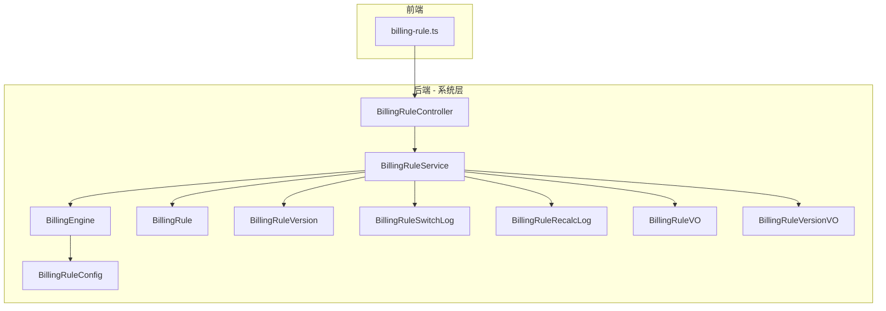
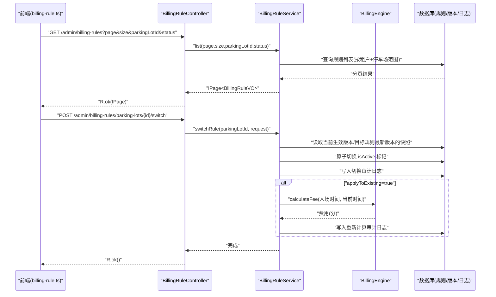
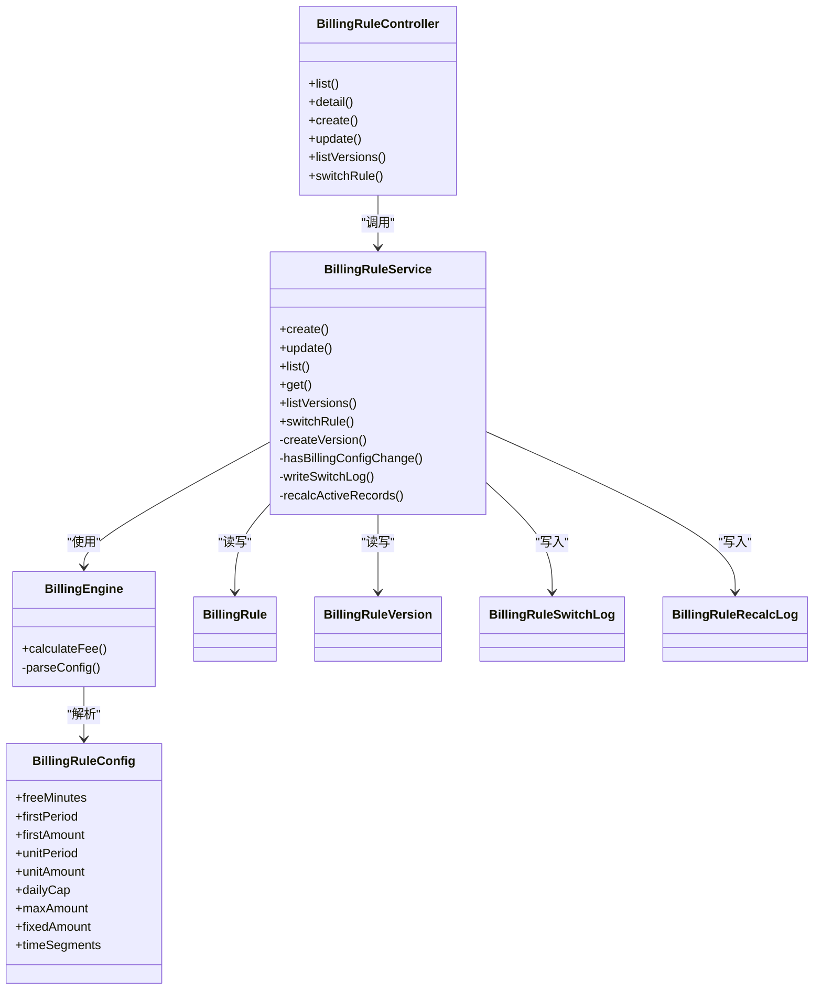
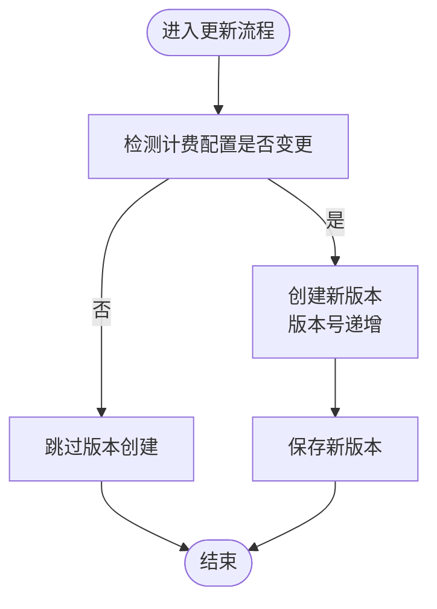
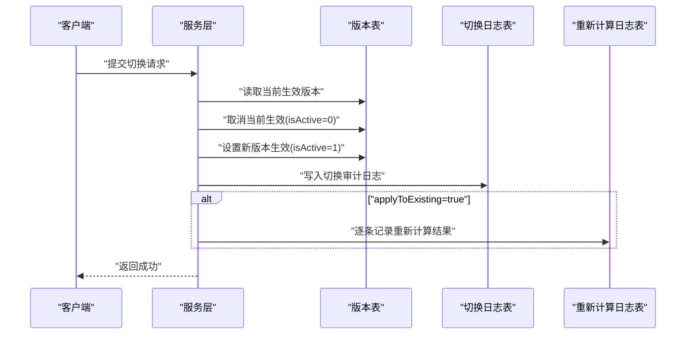

# 计费规则管理接口

<cite>
**本文引用的文件**   
- [BillingRuleController.java](file://parking-system/src/main/java/com/jushan/system/controller/BillingRuleController.java)
- [BillingRuleService.java](file://parking-system/src/main/java/com/jushan/system/service/BillingRuleService.java)
- [BillingEngine.java](file://parking-system/src/main/java/com/jushan/system/service/BillingEngine.java)
- [BillingRuleConfig.java](file://parking-system/src/main/java/com/jushan/system/service/BillingRuleConfig.java)
- [CreateBillingRuleRequest.java](file://parking-system/src/main/java/com/jushan/system/dto/CreateBillingRuleRequest.java)
- [UpdateBillingRuleRequest.java](file://parking-system/src/main/java/com/jushan/system/dto/UpdateBillingRuleRequest.java)
- [SwitchBillingRuleRequest.java](file://parking-system/src/main/java/com/jushan/system/dto/SwitchBillingRuleRequest.java)
- [BillingRule.java](file://parking-system/src/main/java/com/jushan/system/entity/BillingRule.java)
- [BillingRuleVersion.java](file://parking-system/src/main/java/com/jushan/system/entity/BillingRuleVersion.java)
- [BillingRuleSwitchLog.java](file://parking-system/src/main/java/com/jushan/system/entity/BillingRuleSwitchLog.java)
- [BillingRuleRecalcLog.java](file://parking-system/src/main/java/com/jushan/system/entity/BillingRuleRecalcLog.java)
- [BillingRuleVO.java](file://parking-system/src/main/java/com/jushan/system/vo/BillingRuleVO.java)
- [BillingRuleVersionVO.java](file://parking-system/src/main/java/com/jushan/system/vo/BillingRuleVersionVO.java)
- [billing-rule.ts](file://admin-web/src/api/billing-rule.ts)
</cite>

## 目录
1. [简介](#简介)
2. [项目结构](#项目结构)
3. [核心组件](#核心组件)
4. [架构总览](#架构总览)
5. [详细组件分析](#详细组件分析)
6. [依赖关系分析](#依赖关系分析)
7. [性能与并发](#性能与并发)
8. [权限控制](#权限控制)
9. [数据模型与配置选项](#数据模型与配置选项)
10. [API 规范](#api-规范)
11. [版本管理与切换流程](#版本管理与切换流程)
12. [计费准确性验证](#计费准确性验证)
13. [审计日志与可追溯性](#审计日志与可追溯性)
14. [故障排查指南](#故障排查指南)
15. [结论](#结论)

## 简介
本文件为“计费规则管理”接口的权威文档，覆盖计费规则的创建、更新、查询、删除（以查询为主）、版本管理与切换能力。重点说明：
- 数据结构与配置项（金额单位统一为分）
- 权限控制（billing:read、billing:write、billing:switch）
- 分页查询、条件筛选与排序
- 版本历史查询与切换的原子性保证
- 审计日志记录机制
- 计费准确性验证、并发控制与性能优化策略

## 项目结构
计费规则管理相关代码位于 parking-system 模块，采用控制器-服务-实体-视图对象的分层组织；前端通过 admin-web 的 API 封装调用后端接口。

图表来源
- [BillingRuleController.java:1-160](file://parking-system/src/main/java/com/jushan/system/controller/BillingRuleController.java#L1-L160)
- [BillingRuleService.java:1-681](file://parking-system/src/main/java/com/jushan/system/service/BillingRuleService.java#L1-L681)
- [BillingEngine.java:93-180](file://parking-system/src/main/java/com/jushan/system/service/BillingEngine.java#L93-L180)
- [BillingRuleConfig.java:1-52](file://parking-system/src/main/java/com/jushan/system/service/BillingRuleConfig.java#L1-L52)
- [BillingRule.java:1-105](file://parking-system/src/main/java/com/jushan/system/entity/BillingRule.java#L1-L105)
- [BillingRuleVersion.java:1-138](file://parking-system/src/main/java/com/jushan/system/entity/BillingRuleVersion.java#L1-L138)
- [BillingRuleSwitchLog.java:1-83](file://parking-system/src/main/java/com/jushan/system/entity/BillingRuleSwitchLog.java#L1-L83)
- [BillingRuleRecalcLog.java:1-83](file://parking-system/src/main/java/com/jushan/system/entity/BillingRuleRecalcLog.java#L1-L83)
- [BillingRuleVO.java:1-124](file://parking-system/src/main/java/com/jushan/system/vo/BillingRuleVO.java#L1-L124)
- [BillingRuleVersionVO.java:1-98](file://parking-system/src/main/java/com/jushan/system/vo/BillingRuleVersionVO.java#L1-L98)
- [billing-rule.ts:1-104](file://admin-web/src/api/billing-rule.ts#L1-L104)

章节来源
- [BillingRuleController.java:1-160](file://parking-system/src/main/java/com/jushan/system/controller/BillingRuleController.java#L1-L160)
- [BillingRuleService.java:1-681](file://parking-system/src/main/java/com/jushan/system/service/BillingRuleService.java#L1-L681)
- [billing-rule.ts:1-104](file://admin-web/src/api/billing-rule.ts#L1-L104)

## 核心组件
- 控制器层：提供 REST 接口，负责参数校验、权限注解与日志输出。
- 服务层：实现业务逻辑，包括规则 CRUD、版本管理、切换、重新计算与审计日志写入。
- 计费引擎：基于规则版本进行费用计算，支持按时长、固定金额、免费三种类型，并应用封顶策略。
- 配置对象：从版本 JSON 配置反序列化得到，用于计费引擎解析。
- 实体与视图：持久化模型与对外返回视图分离，便于扩展与展示。

章节来源
- [BillingRuleController.java:1-160](file://parking-system/src/main/java/com/jushan/system/controller/BillingRuleController.java#L1-L160)
- [BillingRuleService.java:1-681](file://parking-system/src/main/java/com/jushan/system/service/BillingRuleService.java#L1-L681)
- [BillingEngine.java:93-180](file://parking-system/src/main/java/com/jushan/system/service/BillingEngine.java#L93-L180)
- [BillingRuleConfig.java:1-52](file://parking-system/src/main/java/com/jushan/system/service/BillingRuleConfig.java#L1-L52)

## 架构总览
计费规则管理的请求处理路径如下：
- 前端通过 billing-rule.ts 发起 HTTP 请求
- 控制器接收请求并进行权限校验
- 服务层执行业务逻辑（含事务与审计）
- 必要时调用计费引擎进行费用计算
- 返回统一的响应包装

图表来源
- [BillingRuleController.java:51-160](file://parking-system/src/main/java/com/jushan/system/controller/BillingRuleController.java#L51-L160)
- [BillingRuleService.java:241-372](file://parking-system/src/main/java/com/jushan/system/service/BillingRuleService.java#L241-L372)
- [BillingEngine.java:93-180](file://parking-system/src/main/java/com/jushan/system/service/BillingEngine.java#L93-L180)

## 详细组件分析

### 控制器层（BillingRuleController）
- 路由前缀：/admin/billing-rules
- 主要端点：
  - GET / — 分页查询（需 billing:read）
  - GET /{id} — 详情（需 billing:read）
  - POST / — 创建（需 billing:write）
  - PUT /{id} — 更新（需 billing:write）
  - GET /{id}/versions — 版本历史（需 billing:read）
  - POST /parking-lots/{parkingLotId}/switch — 切换（需 billing:switch）

权限说明：
- billing:read：查看列表与详情、版本历史
- billing:write：创建与更新规则（包含计费配置变更时自动创建新版本）
- billing:switch：切换生效规则（仅客户管理员和停车场管理员，岗亭人员无权）

章节来源
- [BillingRuleController.java:1-160](file://parking-system/src/main/java/com/jushan/system/controller/BillingRuleController.java#L1-L160)

### 服务层（BillingRuleService）
职责：
- 规则 CRUD：创建时自动生成首个版本并设为生效；更新时若计费配置变化则创建新版本
- 版本管理：查询版本历史，维护版本号递增与生效标记
- 规则切换：在事务内原子切换生效版本，记录切换审计日志，可选对已在场车辆重新计算费用
- 权限与范围：结合租户上下文与停车场级数据范围进行访问控制

关键方法：
- create(request)：创建规则与初始版本，默认规则互斥
- update(id, request)：更新基本信息；计费配置变更触发新版本
- list(page, size, parkingLotId, status)：分页查询，支持按停车场与状态筛选，按创建时间倒序
- get(id)：详情（含当前生效版本信息）
- listVersions(id)：版本历史
- switchRule(parkingLotId, request)：切换生效版本，写入审计日志，可选重新计算

章节来源
- [BillingRuleService.java:91-372](file://parking-system/src/main/java/com/jushan/system/service/BillingRuleService.java#L91-L372)

### 计费引擎（BillingEngine）
- calculateFee(version, ruleType, entryTime, exitTime)：基于指定规则版本计算费用
- 支持规则类型：NO_FEE、FIXED、HOURLY
- 封顶策略：maxAmount 全局封顶；dailyCap 单日封顶（由上层或引擎内部策略决定）
- 配置解析：从 BillingRuleVersion.config JSON 反序列化为 BillingRuleConfig，兼容旧版列字段

章节来源
- [BillingEngine.java:93-180](file://parking-system/src/main/java/com/jushan/system/service/BillingEngine.java#L93-L180)
- [BillingRuleConfig.java:1-52](file://parking-system/src/main/java/com/jushan/system/service/BillingRuleConfig.java#L1-L52)

### 实体与视图
- BillingRule：规则主表（名称、描述、类型、状态、是否默认等）
- BillingRuleVersion：版本快照（JSON 配置 + 摘要 + 关键字段冗余 + 生效标记）
- BillingRuleSwitchLog：切换审计日志（操作人、原因、前后规则 ID、是否影响已在场）
- BillingRuleRecalcLog：重新计算审计日志（停车记录、车牌、新规则版本、费用、时间）
- BillingRuleVO / BillingRuleVersionVO：对外返回视图，聚合当前生效版本信息与描述文本

章节来源
- [BillingRule.java:1-105](file://parking-system/src/main/java/com/jushan/system/entity/BillingRule.java#L1-L105)
- [BillingRuleVersion.java:1-138](file://parking-system/src/main/java/com/jushan/system/entity/BillingRuleVersion.java#L1-L138)
- [BillingRuleSwitchLog.java:1-83](file://parking-system/src/main/java/com/jushan/system/entity/BillingRuleSwitchLog.java#L1-L83)
- [BillingRuleRecalcLog.java:1-83](file://parking-system/src/main/java/com/jushan/system/entity/BillingRuleRecalcLog.java#L1-L83)
- [BillingRuleVO.java:1-124](file://parking-system/src/main/java/com/jushan/system/vo/BillingRuleVO.java#L1-L124)
- [BillingRuleVersionVO.java:1-98](file://parking-system/src/main/java/com/jushan/system/vo/BillingRuleVersionVO.java#L1-L98)

## 依赖关系分析
- 控制器依赖服务层，服务层依赖多个 Mapper 与外部服务（ParkingLotMapper、ParkingRecordMapper、BillingEngine）
- 服务层通过 TenantContext/DataScope 获取租户与用户上下文，确保多租户隔离与数据范围控制
- 计费引擎依赖配置对象，从版本 JSON 中解析计费参数

图表来源
- [BillingRuleController.java:1-160](file://parking-system/src/main/java/com/jushan/system/controller/BillingRuleController.java#L1-L160)
- [BillingRuleService.java:1-681](file://parking-system/src/main/java/com/jushan/system/service/BillingRuleService.java#L1-L681)
- [BillingEngine.java:93-180](file://parking-system/src/main/java/com/jushan/system/service/BillingEngine.java#L93-L180)
- [BillingRuleConfig.java:1-52](file://parking-system/src/main/java/com/jushan/system/service/BillingRuleConfig.java#L1-L52)
- [BillingRule.java:1-105](file://parking-system/src/main/java/com/jushan/system/entity/BillingRule.java#L1-L105)
- [BillingRuleVersion.java:1-138](file://parking-system/src/main/java/com/jushan/system/entity/BillingRuleVersion.java#L1-L138)
- [BillingRuleSwitchLog.java:1-83](file://parking-system/src/main/java/com/jushan/system/entity/BillingRuleSwitchLog.java#L1-L83)
- [BillingRuleRecalcLog.java:1-83](file://parking-system/src/main/java/com/jushan/system/entity/BillingRuleRecalcLog.java#L1-L83)

## 性能与并发
- 分页查询：使用 MyBatis-Plus Page 插件，按创建时间倒序；支持按停车场与状态过滤
- 版本切换：在同一事务内执行“取消当前生效 + 激活新版本”，保证原子性
- 重新计算：仅在 applyToExisting=true 时触发，逐条计算并记录审计日志，避免阻塞切换主流程
- 建议优化：
  - 对常用查询增加索引（tenantId、parkingLotId、status、createdAt）
  - 对活跃记录重算场景考虑分批处理与异步化，降低事务时长
  - 对频繁读的路径引入缓存（如当前生效版本），注意失效策略

[本节为通用指导，不直接分析具体文件]

## 权限控制
- 接口级权限注解：
  - billing:read：列表、详情、版本历史
  - billing:write：创建、更新
  - billing:switch：切换生效规则（岗亭人员无此权限）
- 数据范围：
  - 所有操作基于当前登录会话推导租户范围，不信任前端传入的 tenantId
  - 停车场级授权校验：通过 ParkingLotScopeResolver 校验当前用户对停车场的访问权限

章节来源
- [BillingRuleController.java:27-36](file://parking-system/src/main/java/com/jushan/system/controller/BillingRuleController.java#L27-L36)
- [BillingRuleService.java:496-519](file://parking-system/src/main/java/com/jushan/system/service/BillingRuleService.java#L496-L519)

## 数据模型与配置选项

### 规则主表（BillingRule）
- 关键字段：id、tenantId、parkingLotId、name、description、ruleType、status、isDefault、createdBy、updatedBy、createdAt、updatedAt
- 常量：
  - 规则类型：HOURLY、FIXED、NO_FEE
  - 状态：ENABLED、DISABLED

章节来源
- [BillingRule.java:1-105](file://parking-system/src/main/java/com/jushan/system/entity/BillingRule.java#L1-L105)

### 规则版本（BillingRuleVersion）
- 关键字段：id、ruleId、tenantId、parkingLotId、version、isActive、config(JSON)、configSummary、freeMinutes、firstPeriod、firstAmount、unitPeriod、unitAmount、dailyCap、maxAmount、effectiveFrom、effectiveTo、createdBy、createdAt
- 行为：版本不可修改，每次变更创建新版本；首个版本自动生效

章节来源
- [BillingRuleVersion.java:1-138](file://parking-system/src/main/java/com/jushan/system/entity/BillingRuleVersion.java#L1-L138)

### 切换审计日志（BillingRuleSwitchLog）
- 关键字段：id、parkingLotId、tenantId、operatorId、operatorName、beforeRuleId、afterRuleId、applyToExisting、reason、createdAt

章节来源
- [BillingRuleSwitchLog.java:1-83](file://parking-system/src/main/java/com/jushan/system/entity/BillingRuleSwitchLog.java#L1-L83)

### 重新计算审计日志（BillingRuleRecalcLog）
- 关键字段：id、tenantId、parkingLotId、parkingRecordId、plateNumber、ruleVersionId、feeCents、recalcTime、operatorId、createdAt

章节来源
- [BillingRuleRecalcLog.java:1-83](file://parking-system/src/main/java/com/jushan/system/entity/BillingRuleRecalcLog.java#L1-L83)

### 对外视图对象
- BillingRuleVO：聚合规则信息与当前生效版本摘要
- BillingRuleVersionVO：版本快照视图

章节来源
- [BillingRuleVO.java:1-124](file://parking-system/src/main/java/com/jushan/system/vo/BillingRuleVO.java#L1-L124)
- [BillingRuleVersionVO.java:1-98](file://parking-system/src/main/java/com/jushan/system/vo/BillingRuleVersionVO.java#L1-L98)

### 计费配置（BillingRuleConfig）
- 字段：freeMinutes、firstPeriod、firstAmount、unitPeriod、unitAmount、dailyCap、maxAmount、fixedAmount、timeSegments
- 金额单位：统一为整数分，禁止浮点数
- 解析来源：从 BillingRuleVersion.config JSON 反序列化；兼容旧版列字段

章节来源
- [BillingRuleConfig.java:1-52](file://parking-system/src/main/java/com/jushan/system/service/BillingRuleConfig.java#L1-L52)
- [BillingEngine.java:160-180](file://parking-system/src/main/java/com/jushan/system/service/BillingEngine.java#L160-L180)

## API 规范

### 通用约定
- 基础路径：/admin/billing-rules
- 响应包装：统一 R<T> 结构
- 权限：各接口标注所需权限
- 分页：page 从 1 开始，size 默认 20
- 金额单位：分（整数）

### 接口清单

- 分页查询收费规则列表
  - 方法：GET
  - 路径：/admin/billing-rules
  - 参数：page(int, 默认1), size(int, 默认20), parkingLotId(Long, 可选), status(String, 可选：ENABLED/DISABLED)
  - 权限：billing:read
  - 返回：R<IPage<BillingRuleVO>>
  - 说明：按创建时间倒序；支持按停车场与状态筛选；受停车场级数据范围限制

- 查询收费规则详情
  - 方法：GET
  - 路径：/admin/billing-rules/{id}
  - 权限：billing:read
  - 返回：R<BillingRuleVO>
  - 说明：包含当前生效版本信息

- 创建收费规则
  - 方法：POST
  - 路径：/admin/billing-rules
  - 请求体：CreateBillingRuleRequest
  - 权限：billing:write
  - 返回：R<BillingRuleVO>
  - 说明：自动创建首个版本并设为生效；若 isDefault=true，将清除同停车场其他默认规则

- 更新收费规则
  - 方法：PUT
  - 路径：/admin/billing-rules/{id}
  - 请求体：UpdateBillingRuleRequest
  - 权限：billing:write
  - 返回：R<BillingRuleVO>
  - 说明：若计费配置字段有变更，将创建新版本而非修改已有版本

- 查询规则版本历史
  - 方法：GET
  - 路径：/admin/billing-rules/{id}/versions
  - 权限：billing:read
  - 返回：R<List<BillingRuleVersionVO>>
  - 说明：按版本号倒序

- 切换收费规则
  - 方法：POST
  - 路径：/admin/billing-rules/parking-lots/{parkingLotId}/switch
  - 请求体：SwitchBillingRuleRequest
  - 权限：billing:switch
  - 返回：R<Void>
  - 说明：原子切换生效版本；记录切换审计日志；可选对已在场车辆重新计算费用

章节来源
- [BillingRuleController.java:51-160](file://parking-system/src/main/java/com/jushan/system/controller/BillingRuleController.java#L51-L160)
- [billing-rule.ts:59-104](file://admin-web/src/api/billing-rule.ts#L59-L104)

### 请求与响应模型

- CreateBillingRuleRequest
  - 必填：parkingLotId、name、ruleType
  - 可选：description、isDefault、freeMinutes、firstPeriod、firstAmount、unitPeriod、unitAmount、dailyCap、maxAmount
  - 校验：非空、长度、非负数

- UpdateBillingRuleRequest
  - 可选：name、description、ruleType、status、freeMinutes、firstPeriod、firstAmount、unitPeriod、unitAmount、dailyCap、maxAmount
  - 校验：长度、非负数

- SwitchBillingRuleRequest
  - 必填：targetRuleId
  - 可选：applyToExisting(boolean, 默认false)、reason(string)

- BillingRuleVO
  - 包含：规则基本信息、当前生效版本信息（activeVersionId、activeVersion、configSummary 及计费字段）

- BillingRuleVersionVO
  - 包含：版本快照（config JSON、摘要、计费字段、生效时间窗口、创建信息等）

章节来源
- [CreateBillingRuleRequest.java:1-102](file://parking-system/src/main/java/com/jushan/system/dto/CreateBillingRuleRequest.java#L1-L102)
- [UpdateBillingRuleRequest.java:1-91](file://parking-system/src/main/java/com/jushan/system/dto/UpdateBillingRuleRequest.java#L1-L91)
- [SwitchBillingRuleRequest.java:1-33](file://parking-system/src/main/java/com/jushan/system/dto/SwitchBillingRuleRequest.java#L1-L33)
- [BillingRuleVO.java:1-124](file://parking-system/src/main/java/com/jushan/system/vo/BillingRuleVO.java#L1-L124)
- [BillingRuleVersionVO.java:1-98](file://parking-system/src/main/java/com/jushan/system/vo/BillingRuleVersionVO.java#L1-L98)

## 版本管理与切换流程

### 版本创建与变更
- 创建规则时自动生成首个版本并设为生效
- 更新规则时若计费配置发生变化，则创建新版本；原版本保留，形成完整历史

图表来源
- [BillingRuleService.java:158-226](file://parking-system/src/main/java/com/jushan/system/service/BillingRuleService.java#L158-L226)
- [BillingRuleService.java:457-472](file://parking-system/src/main/java/com/jushan/system/service/BillingRuleService.java#L457-L472)

### 切换生效规则（原子性）
- 在同一事务内：
  - 取消当前生效版本的 isActive
  - 设置目标规则最新版本的 isActive
  - 写入切换审计日志
  - 若 applyToExisting=true，对已在场车辆重新计算费用并记录审计日志

图表来源
- [BillingRuleService.java:307-372](file://parking-system/src/main/java/com/jushan/system/service/BillingRuleService.java#L307-L372)
- [BillingRuleService.java:524-549](file://parking-system/src/main/java/com/jushan/system/service/BillingRuleService.java#L524-L549)
- [BillingRuleService.java:554-591](file://parking-system/src/main/java/com/jushan/system/service/BillingRuleService.java#L554-L591)

## 计费准确性验证
- 计费引擎在计算过程中进行输入校验（入场/出场时间合法性）
- 根据规则类型选择不同算法：
  - NO_FEE：费用为 0
  - FIXED：固定金额
  - HOURLY：按时长计费，应用首时段与续费单位
- 封顶策略：
  - maxAmount：全局封顶
  - dailyCap：单日封顶（由上层或引擎内部策略决定）
- 配置解析失败会抛出业务异常，防止错误配置导致计费偏差

章节来源
- [BillingEngine.java:93-180](file://parking-system/src/main/java/com/jushan/system/service/BillingEngine.java#L93-L180)
- [BillingRuleConfig.java:1-52](file://parking-system/src/main/java/com/jushan/system/service/BillingRuleConfig.java#L1-L52)

## 审计日志与可追溯性
- 切换审计日志（BillingRuleSwitchLog）：记录操作人、前后规则 ID、是否影响已在场、原因
- 重新计算审计日志（BillingRuleRecalcLog）：记录停车记录、车牌、新规则版本、费用、计算时间、操作人
- 日志写入与切换操作在同一事务内，保证一致性

章节来源
- [BillingRuleService.java:524-591](file://parking-system/src/main/java/com/jushan/system/service/BillingRuleService.java#L524-L591)
- [BillingRuleSwitchLog.java:1-83](file://parking-system/src/main/java/com/jushan/system/entity/BillingRuleSwitchLog.java#L1-L83)
- [BillingRuleRecalcLog.java:1-83](file://parking-system/src/main/java/com/jushan/system/entity/BillingRuleRecalcLog.java#L1-L83)

## 故障排查指南
- 常见错误码与提示：
  - 未找到：规则/停车场不存在
  - 业务错误：目标规则不属于该停车场、目标规则未启用、不支持的规则类型、计费配置解析失败、费用为负值
  - 参数错误：无效的状态、无效的规则类型
- 排查步骤：
  - 检查权限是否正确（billing:read/write/switch）
  - 确认租户与停车场授权范围
  - 核对计费配置 JSON 与字段含义（金额单位为分）
  - 查看切换与重新计算的审计日志定位问题

章节来源
- [BillingRuleService.java:596-611](file://parking-system/src/main/java/com/jushan/system/service/BillingRuleService.java#L596-L611)
- [BillingEngine.java:112-123](file://parking-system/src/main/java/com/jushan/system/service/BillingEngine.java#L112-L123)

## 结论
计费规则管理接口提供了完整的规则生命周期管理能力，并通过版本快照与审计日志保障可追溯性与合规性。切换流程具备事务原子性，计费引擎支持多种计费模式与封顶策略，确保计费准确性。建议在大规模场景中进一步优化重算流程与查询性能，以满足高并发与低延迟要求。