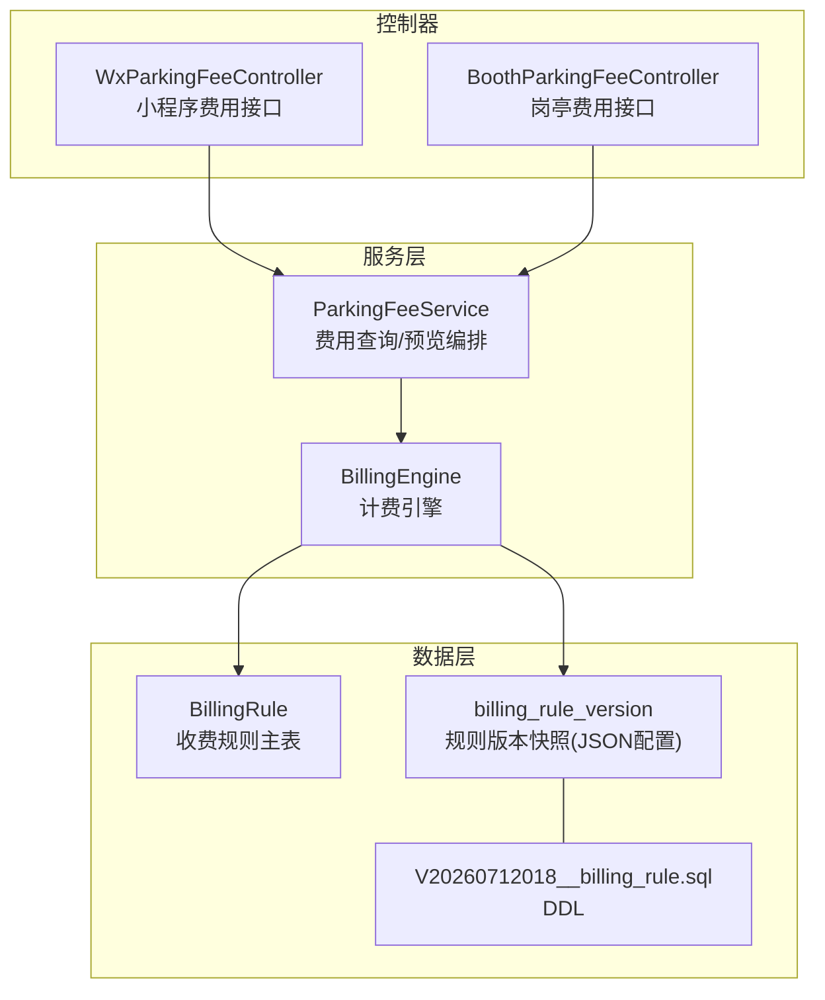
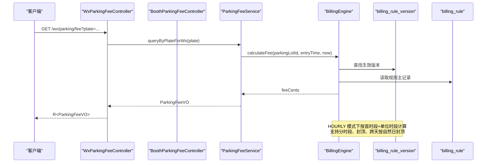
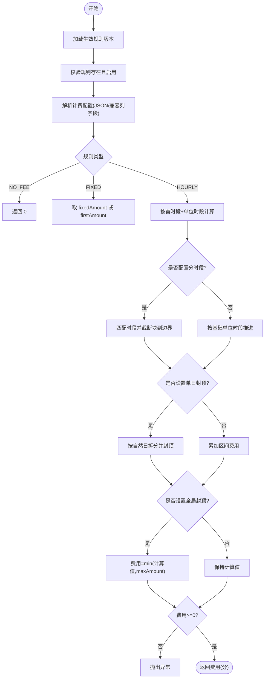
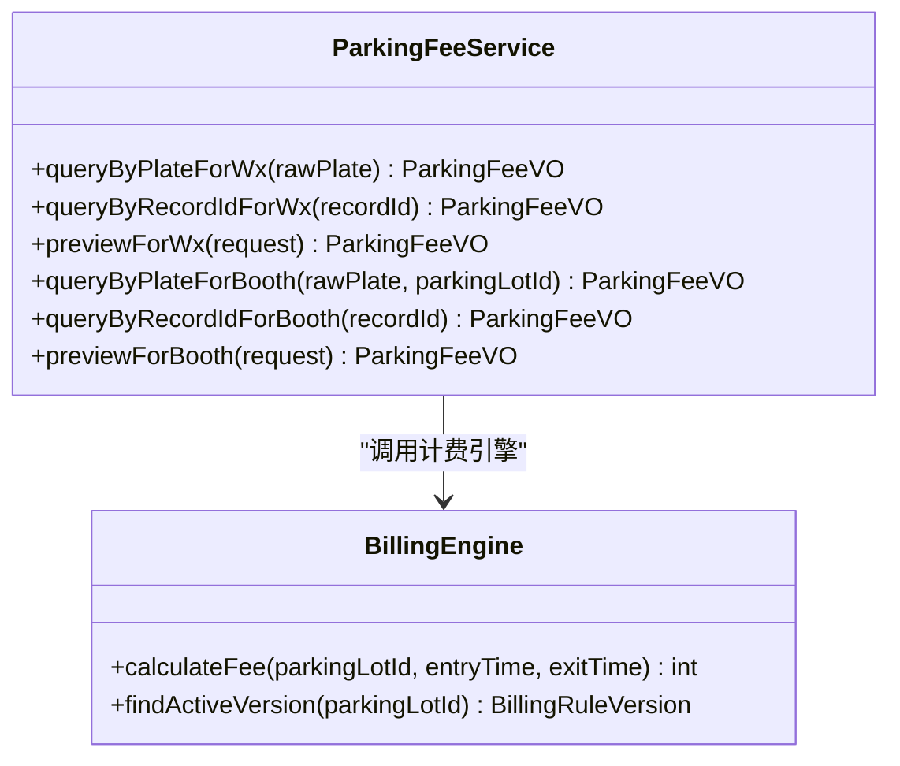
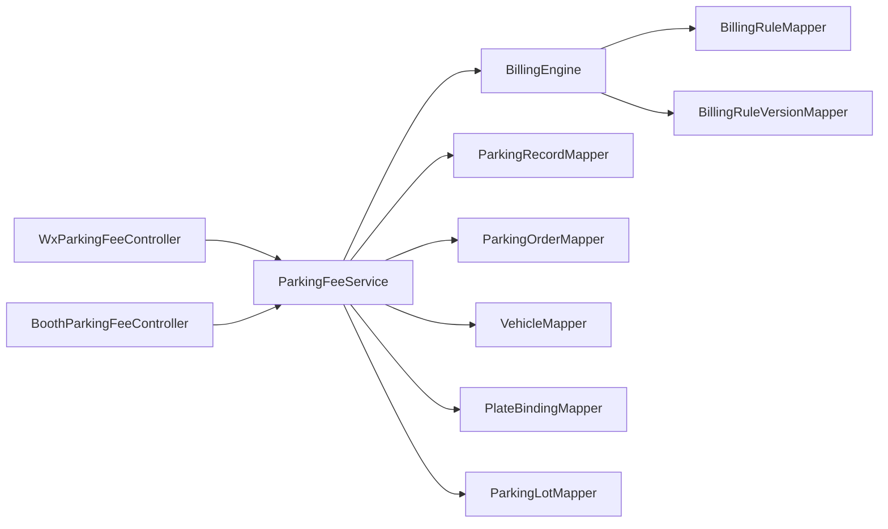

# 费用计算接口

<cite>
**本文引用的文件**   
- [BillingEngine.java](file://parking-system/src/main/java/com/jushan/system/service/BillingEngine.java)
- [ParkingFeeService.java](file://parking-system/src/main/java/com/jushan/system/service/ParkingFeeService.java)
- [WxParkingFeeController.java](file://parking-system/src/main/java/com/jushan/system/controller/WxParkingFeeController.java)
- [BoothParkingFeeController.java](file://parking-system/src/main/java/com/jushan/system/controller/BoothParkingFeeController.java)
- [BillingRuleConfig.java](file://parking-system/src/main/java/com/jushan/system/service/BillingRuleConfig.java)
- [TimeSegmentConfig.java](file://parking-system/src/main/java/com/jushan/system/service/TimeSegmentConfig.java)
- [BillingRule.java](file://parking-system/src/main/java/com/jushan/system/entity/BillingRule.java)
- [V20260712018__billing_rule.sql](file://parking-boot/src/main/resources/db/migration/V20260712018__billing_rule.sql)
- [FeePreviewRequest.java](file://parking-system/src/main/java/com/jushan/system/dto/FeePreviewRequest.java)
- [ParkingFeeVO.java](file://parking-system/src/main/java/com/jushan/system/vo/ParkingFeeVO.java)
</cite>

## 目录
1. [简介](#简介)
2. [项目结构](#项目结构)
3. [核心组件](#核心组件)
4. [架构总览](#架构总览)
5. [详细组件分析](#详细组件分析)
6. [依赖关系分析](#依赖关系分析)
7. [性能与并发](#性能与并发)
8. [计费准确性与事务](#计费准确性与事务)
9. [小程序支付集成](#小程序支付集成)
10. [故障排查指南](#故障排查指南)
11. [结论](#结论)

## 简介
本文件面向“费用计算接口”的开发者与运维人员，系统化说明计费引擎的核心算法、多种计费策略支持（免费停车、固定金额、按时计费、分时段计费）、实时费用计算与结算预览、计费重算能力，以及历史账单查询。同时给出微信小程序支付集成的相关接口说明（支付发起、回调处理、订单状态同步），并覆盖计费准确性保证、并发处理、事务管理与性能优化策略。

## 项目结构
围绕费用计算的关键代码位于 parking-system 模块：
- 控制器层：小程序与岗亭的费用查询与预览接口
- 服务层：费用查询编排与权限校验、计费引擎调用
- 计费引擎：基于生效规则版本进行费用计算，支持多种计费模式
- 数据模型：收费规则主表与版本快照、计费配置 JSON、时间分段配置等

图表来源
- [WxParkingFeeController.java:1-80](file://parking-system/src/main/java/com/jushan/system/controller/WxParkingFeeController.java#L1-L80)
- [BoothParkingFeeController.java:1-88](file://parking-system/src/main/java/com/jushan/system/controller/BoothParkingFeeController.java#L1-L88)
- [ParkingFeeService.java:1-355](file://parking-system/src/main/java/com/jushan/system/service/ParkingFeeService.java#L1-L355)
- [BillingEngine.java:1-386](file://parking-system/src/main/java/com/jushan/system/service/BillingEngine.java#L1-L386)
- [BillingRule.java:1-105](file://parking-system/src/main/java/com/jushan/system/entity/BillingRule.java#L1-L105)
- [V20260712018__billing_rule.sql:31-49](file://parking-boot/src/main/resources/db/migration/V20260712018__billing_rule.sql#L31-L49)

章节来源
- [WxParkingFeeController.java:1-80](file://parking-system/src/main/java/com/jushan/system/controller/WxParkingFeeController.java#L1-L80)
- [BoothParkingFeeController.java:1-88](file://parking-system/src/main/java/com/jushan/system/controller/BoothParkingFeeController.java#L1-L88)
- [ParkingFeeService.java:1-355](file://parking-system/src/main/java/com/jushan/system/service/ParkingFeeService.java#L1-L355)
- [BillingEngine.java:1-386](file://parking-system/src/main/java/com/jushan/system/service/BillingEngine.java#L1-L386)
- [BillingRule.java:1-105](file://parking-system/src/main/java/com/jushan/system/entity/BillingRule.java#L1-L105)
- [V20260712018__billing_rule.sql:31-49](file://parking-boot/src/main/resources/db/migration/V20260712018__billing_rule.sql#L31-L49)

## 核心组件
- 计费引擎（BillingEngine）
  - 根据停车场当前生效的规则版本计算费用，支持 NO_FEE、FIXED、HOURLY 三种类型；HOURLY 支持首时段+单位时段、单日封顶、最大封顶、跨天按自然日封顶、分时段计费。
  - 安全约束：金额使用整数分；无生效规则、规则禁用、配置解析失败、分时段冲突均失败关闭；结果非负。
- 费用查询服务（ParkingFeeService）
  - 为小程序与岗亭提供费用查询与结算预览能力；小程序端需校验车牌归属，岗亭端需校验停车场访问范围；不修改记录与订单状态。
- 控制器（WxParkingFeeController / BoothParkingFeeController）
  - 暴露 REST 接口：按车牌或记录 ID 查询费用、结算预览；小程序端无需额外鉴权注解，岗亭端需要权限控制。
- 计费配置（BillingRuleConfig / TimeSegmentConfig）
  - 从 billing_rule_version.config JSON 反序列化得到；所有字段可选，缺失时按 0 或默认值处理；非法/冲突配置由引擎失败关闭。
- 收费规则实体（BillingRule）
  - 定义规则类型与状态常量，供引擎校验与路由。

章节来源
- [BillingEngine.java:25-158](file://parking-system/src/main/java/com/jushan/system/service/BillingEngine.java#L25-L158)
- [ParkingFeeService.java:28-74](file://parking-system/src/main/java/com/jushan/system/service/ParkingFeeService.java#L28-L74)
- [WxParkingFeeController.java:20-79](file://parking-system/src/main/java/com/jushan/system/controller/WxParkingFeeController.java#L20-L79)
- [BoothParkingFeeController.java:22-87](file://parking-system/src/main/java/com/jushan/system/controller/BoothParkingFeeController.java#L22-L87)
- [BillingRuleConfig.java:1-118](file://parking-system/src/main/java/com/jushan/system/service/BillingRuleConfig.java#L1-L118)
- [BillingRule.java:57-66](file://parking-system/src/main/java/com/jushan/system/entity/BillingRule.java#L57-L66)

## 架构总览
费用计算链路：客户端请求 → 控制器 → 费用服务 → 计费引擎 → 规则版本/规则主表 → 返回费用 VO。

图表来源
- [WxParkingFeeController.java:45-51](file://parking-system/src/main/java/com/jushan/system/controller/WxParkingFeeController.java#L45-L51)
- [ParkingFeeService.java:84-104](file://parking-system/src/main/java/com/jushan/system/service/ParkingFeeService.java#L84-L104)
- [BillingEngine.java:75-91](file://parking-system/src/main/java/com/jushan/system/service/BillingEngine.java#L75-L91)
- [BillingRule.java:57-66](file://parking-system/src/main/java/com/jushan/system/entity/BillingRule.java#L57-L66)

## 详细组件分析

### 计费引擎（BillingEngine）
- 入口方法
  - calculateFee(parkingLotId, entryTime, exitTime)：校验生效规则版本与启用状态，再进入具体计费逻辑。
  - calculateFee(version, ruleType, entryTime, exitTime)：基于指定版本计算，供测试与重算使用。
- 计费策略
  - NO_FEE：直接返回 0。
  - FIXED：取 fixedAmount 或 firstAmount，校验非负。
  - HOURLY：
    - 免费时长 freeMinutes 内免收。
    - 首时段 firstPeriod + firstAmount。
    - 后续单位时段 unitPeriod（默认 60 分钟）+ unitAmount。
    - 分时段计费：在单位时段块内若处于某时间段，则应用该时段的 unitPeriod/unitAmount，并将块截断至时段边界。
    - 单日封顶 dailyCap：按自然日拆分区间成本并封顶求和。
    - 全局封顶 maxAmount：最终费用不超过 maxAmount。
- 关键校验
  - 入场/出场时间合法性。
  - 分时段冲突检测：同一时刻命中多个时段即失败关闭。
  - 金额非负校验。

图表来源
- [BillingEngine.java:75-128](file://parking-system/src/main/java/com/jushan/system/service/BillingEngine.java#L75-L128)
- [BillingEngine.java:193-250](file://parking-system/src/main/java/com/jushan/system/service/BillingEngine.java#L193-L250)
- [BillingEngine.java:252-309](file://parking-system/src/main/java/com/jushan/system/service/BillingEngine.java#L252-L309)
- [BillingEngine.java:322-356](file://parking-system/src/main/java/com/jushan/system/service/BillingEngine.java#L322-L356)

章节来源
- [BillingEngine.java:25-158](file://parking-system/src/main/java/com/jushan/system/service/BillingEngine.java#L25-L158)
- [BillingEngine.java:193-250](file://parking-system/src/main/java/com/jushan/system/service/BillingEngine.java#L193-L250)
- [BillingEngine.java:252-309](file://parking-system/src/main/java/com/jushan/system/service/BillingEngine.java#L252-L309)
- [BillingEngine.java:322-356](file://parking-system/src/main/java/com/jushan/system/service/BillingEngine.java#L322-L356)

### 费用查询与预览（ParkingFeeService）
- 小程序端
  - 按车牌查询：校验车牌归属当前微信用户，定位唯一在场记录，计算当前费用。
  - 按记录 ID 查询：校验归属后返回实际或当前费用。
  - 结算预览：允许传入 previewExitTime，重新计算费用但不落库。
- 岗亭端
  - 按停车场+车牌查询：校验访问范围后定位在场记录并计算费用。
  - 按记录 ID 查询：校验访问范围后返回费用。
  - 结算预览：同上，仅用于预览。
- 构建响应
  - 填充记录信息、时长、费用、免费时长与截止时间、生效规则版本、是否存在待支付订单等。

图表来源
- [ParkingFeeService.java:84-172](file://parking-system/src/main/java/com/jushan/system/service/ParkingFeeService.java#L84-L172)
- [BillingEngine.java:75-91](file://parking-system/src/main/java/com/jushan/system/service/BillingEngine.java#L75-L91)

章节来源
- [ParkingFeeService.java:76-172](file://parking-system/src/main/java/com/jushan/system/service/ParkingFeeService.java#L76-L172)
- [ParkingFeeService.java:259-353](file://parking-system/src/main/java/com/jushan/system/service/ParkingFeeService.java#L259-L353)

### 控制器接口（小程序与岗亭）
- 小程序
  - GET /wx/parking/fee?plate=...
  - GET /wx/parking/fee/{recordId}
  - POST /wx/parking/fee/preview
- 岗亭
  - GET /booth/parking/fee?plate=...&parkingLotId=...
  - GET /booth/parking/fee/{recordId}
  - POST /booth/parking/fee/preview

章节来源
- [WxParkingFeeController.java:45-78](file://parking-system/src/main/java/com/jushan/system/controller/WxParkingFeeController.java#L45-L78)
- [BoothParkingFeeController.java:48-86](file://parking-system/src/main/java/com/jushan/system/controller/BoothParkingFeeController.java#L48-L86)

### 计费配置与数据结构
- 计费配置对象（BillingRuleConfig）
  - 字段包括 freeMinutes、firstPeriod、firstAmount、unitPeriod、unitAmount、dailyCap、maxAmount、fixedAmount、timeSegments。
  - 金额统一使用整数分；缺失字段按 0 或默认值处理。
- 时间分段配置（TimeSegmentConfig）
  - 用于 HOURLY 的分时段计费，包含起止时间与单位时长/金额覆盖。
- 收费规则实体（BillingRule）
  - 规则类型常量：HOURLY、FIXED、NO_FEE；状态常量：ENABLED、DISABLED。
- 数据库 DDL（billing_rule_version）
  - 存储规则版本快照，config 为 JSON，含 freeMinutes、firstPeriod、firstAmount、unitPeriod、unitAmount、dailyCap、maxAmount 等摘要字段便于展示与统计。

章节来源
- [BillingRuleConfig.java:1-118](file://parking-system/src/main/java/com/jushan/system/service/BillingRuleConfig.java#L1-L118)
- [BillingRule.java:57-66](file://parking-system/src/main/java/com/jushan/system/entity/BillingRule.java#L57-L66)
- [V20260712018__billing_rule.sql:31-49](file://parking-boot/src/main/resources/db/migration/V20260712018__billing_rule.sql#L31-L49)

### 请求与响应模型
- 请求 DTO：FeePreviewRequest
  - recordId：必填
  - previewExitTime：可选，为空时使用当前时间
- 响应 VO：ParkingFeeVO
  - 包含记录信息、时长、费用（分）、免费时长与截止时间、生效规则版本、是否有待支付订单、是否可支付、友好提示等

章节来源
- [FeePreviewRequest.java:1-30](file://parking-system/src/main/java/com/jushan/system/dto/FeePreviewRequest.java#L1-L30)
- [ParkingFeeVO.java:1-132](file://parking-system/src/main/java/com/jushan/system/vo/ParkingFeeVO.java#L1-L132)

## 依赖关系分析
- 控制器依赖服务层，服务层依赖计费引擎与多张 Mapper（停车记录、订单、车辆、车牌绑定、停车场）。
- 计费引擎依赖规则主表与规则版本表，通过 JSON 配置驱动计费行为。
- 分时段计费依赖时间分段配置列表，并在计算过程中进行边界截断与冲突检测。

图表来源
- [WxParkingFeeController.java:1-80](file://parking-system/src/main/java/com/jushan/system/controller/WxParkingFeeController.java#L1-L80)
- [BoothParkingFeeController.java:1-88](file://parking-system/src/main/java/com/jushan/system/controller/BoothParkingFeeController.java#L1-L88)
- [ParkingFeeService.java:1-74](file://parking-system/src/main/java/com/jushan/system/service/ParkingFeeService.java#L1-L74)
- [BillingEngine.java:54-64](file://parking-system/src/main/java/com/jushan/system/service/BillingEngine.java#L54-L64)

章节来源
- [ParkingFeeService.java:1-74](file://parking-system/src/main/java/com/jushan/system/service/ParkingFeeService.java#L1-L74)
- [BillingEngine.java:54-64](file://parking-system/src/main/java/com/jushan/system/service/BillingEngine.java#L54-L64)

## 性能与并发
- 计算复杂度
  - HOURLY 计费按单位时段推进，时间复杂度 O(N)，N 为单位时段数；分时段边界截断可能增加少量迭代，但总体线性。
- 内存占用
  - 主要消耗在区间列表与日期聚合 Map，通常较小。
- 缓存建议
  - 对“生效规则版本”与“规则主记录”可引入短期缓存（如 Redis），降低热点停车场重复查询开销。
- 并发与幂等
  - 费用查询与预览为只读操作，天然幂等；如需扩展创建订单与支付流程，应结合分布式锁与幂等键避免重复扣款。

[本节为通用指导，不涉及具体文件分析]

## 计费准确性与事务
- 准确性保证
  - 金额一律使用整数分，禁止浮点数。
  - 免费时长、首时段、单位时段、封顶策略严格遵循配置；分时段冲突立即失败关闭，不猜测费用。
  - 跨天按自然日封顶，区间费用按比例拆分确保总和一致。
- 事务管理
  - 费用查询与预览不修改数据，无需事务。
  - 涉及订单创建与支付的写操作应在业务服务层开启事务，保证一致性。

章节来源
- [BillingEngine.java:35-40](file://parking-system/src/main/java/com/jushan/system/service/BillingEngine.java#L35-L40)
- [BillingEngine.java:322-356](file://parking-system/src/main/java/com/jushan/system/service/BillingEngine.java#L322-L356)
- [ParkingFeeService.java:33-39](file://parking-system/src/main/java/com/jushan/system/service/ParkingFeeService.java#L33-L39)

## 小程序支付集成
- 支付方式（一期）
  - 微信支付：小程序原生 JSAPI 调起支付。
  - 余额支付、优惠券抵扣、积分抵扣、组合支付：在支付前完成抵扣计算，剩余金额走微信支付。
- 支付流程（微信支付）
  - 车主小程序查询费用 → 选择优惠/积分 → 计算待支付金额 → 调用 wx.requestPayment() → 用户确认支付 → 后端回调更新订单状态为已支付 → 推送放行指令到岗亭 → 前端显示成功。
- 异常处理
  - 取消支付、超时、网络中断、支付失败、重复支付、回调失败等均有对应处理策略（幂等、轮询、定时任务补偿）。
- 预留扩展
  - 支付策略接口设计，便于后续接入支付宝、银联等第三方支付。

章节来源
- [docs/需求文档/停车SaaS系统完整需求文档_PRD_V1.0_最终定稿.md:5122-5191](file://docs/需求文档/停车SaaS系统完整需求文档_PRD_V1.0_最终定稿.md#L5122-L5191)

## 故障排查指南
- 常见错误
  - 未配置生效规则：检查 billing_rule_version 中 is_active=1 的记录是否存在。
  - 规则已禁用：检查 billing_rule.status 是否为 ENABLED。
  - 计费配置解析失败：检查 config JSON 格式与字段完整性。
  - 分时段冲突：检查 timeSegments 是否存在重叠。
  - 参数错误：入场/出场时间为空或出场早于入场。
- 日志定位
  - 计费引擎在关键路径输出日志（如计费完成、配置解析失败、分时段冲突等），可通过日志关键字快速定位问题。

章节来源
- [BillingEngine.java:75-91](file://parking-system/src/main/java/com/jushan/system/service/BillingEngine.java#L75-L91)
- [BillingEngine.java:160-180](file://parking-system/src/main/java/com/jushan/system/service/BillingEngine.java#L160-L180)
- [BillingEngine.java:252-269](file://parking-system/src/main/java/com/jushan/system/service/BillingEngine.java#L252-L269)
- [BillingEngine.java:151-158](file://parking-system/src/main/java/com/jushan/system/service/BillingEngine.java#L151-L158)

## 结论
本费用计算接口以“生效规则版本 + JSON 配置”为核心，实现了灵活可扩展的计费体系。计费引擎在保证准确性与安全性的前提下，支持免费、固定金额、按时长与分时段等多种策略，并提供实时费用计算与结算预览能力。配合小程序支付集成方案，形成完整的停车缴费闭环。建议在上线后结合缓存与监控指标持续优化性能与稳定性。