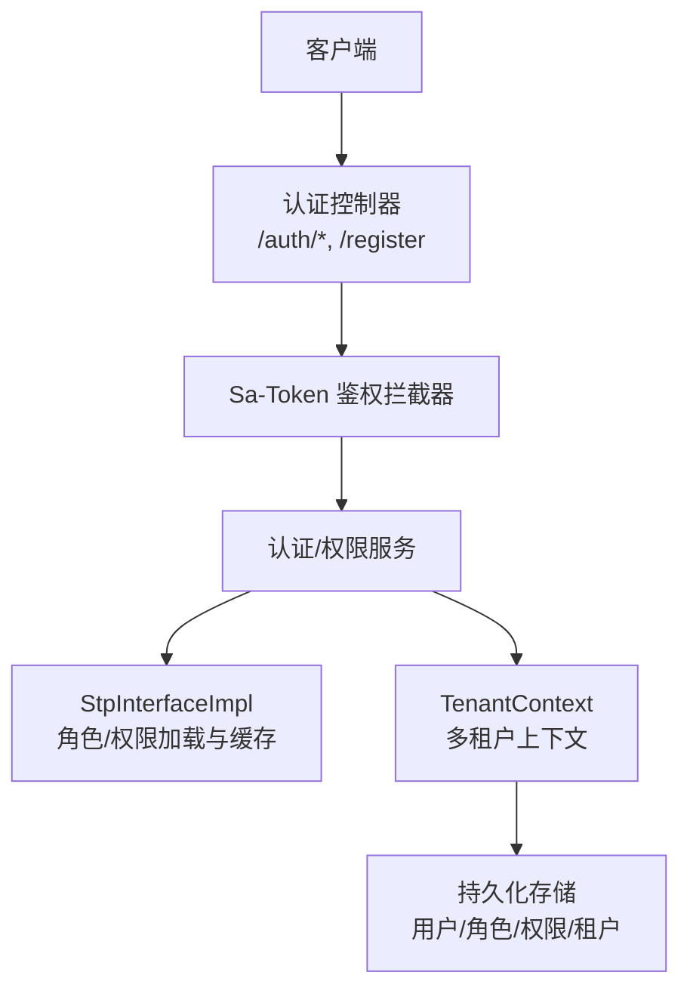
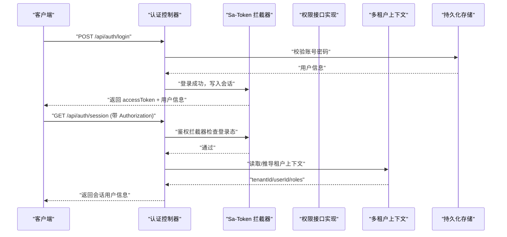
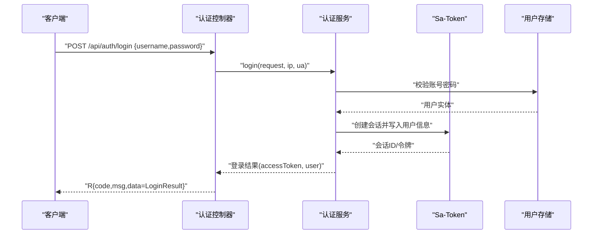
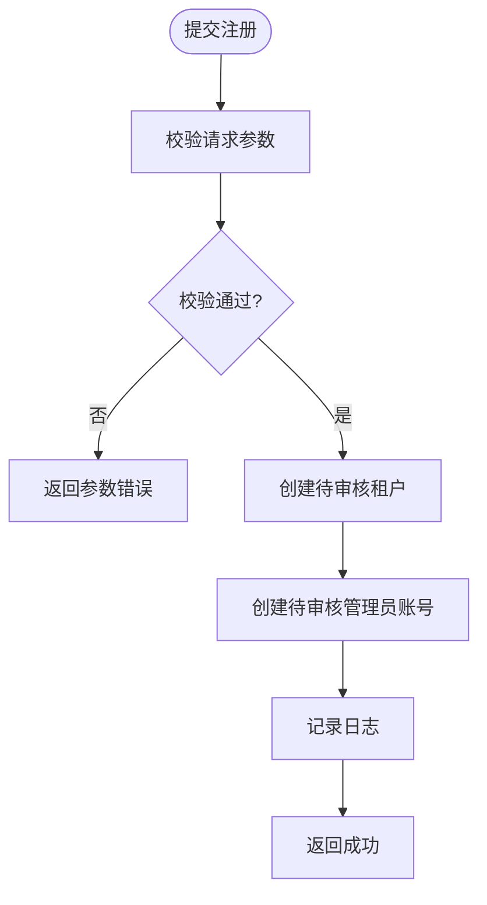
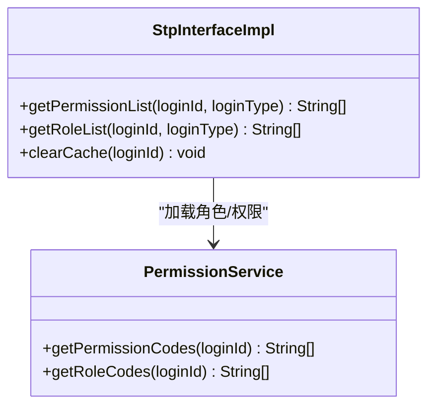
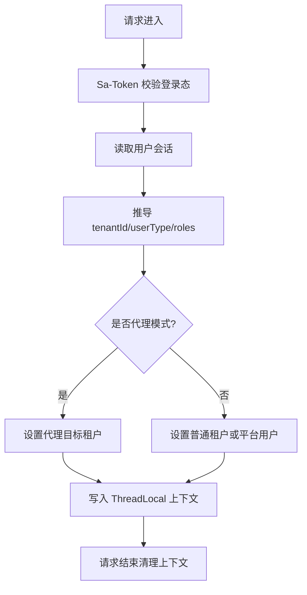
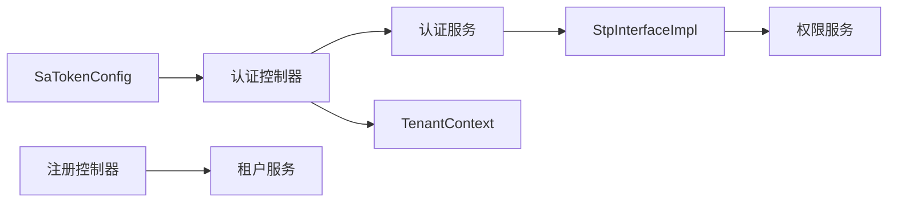

# 认证授权接口

<cite>
**本文引用的文件**
- [AuthController.java](file://parking-system/src/main/java/com/jushan/system/controller/AuthController.java)
- [RegisterController.java](file://parking-system/src/main/java/com/jushan/system/controller/RegisterController.java)
- [SaTokenConfig.java](file://parking-framework/src/main/java/com/jushan/framework/auth/SaTokenConfig.java)
- [StpInterfaceImpl.java](file://parking-system/src/main/java/com/jushan/system/service/StpInterfaceImpl.java)
- [TenantContext.java](file://parking-framework/src/main/java/com/jushan/framework/auth/TenantContext.java)
- [TenantContextFilter.java](file://parking-framework/src/main/java/com/jushan/framework/auth/TenantContextFilter.java)
- [LoginRequest.java](file://parking-system/src/main/java/com/jushan/system/dto/LoginRequest.java)
- [LoginResult.java](file://parking-system/src/main/java/com/jushan/system/dto/LoginResult.java)
- [LoginUserVo.java](file://parking-system/src/main/java/com/jushan/system/vo/LoginUserVo.java)
- [RegisterRequest.java](file://parking-system/src/main/java/com/jushan/system/dto/RegisterRequest.java)
</cite>

## 目录
1. [简介](#简介)
2. [项目结构](#项目结构)
3. [核心组件](#核心组件)
4. [架构总览](#架构总览)
5. [详细组件分析](#详细组件分析)
6. [依赖分析](#依赖分析)
7. [性能考虑](#性能考虑)
8. [故障排查指南](#故障排查指南)
9. [结论](#结论)
10. [附录](#附录)

## 简介
本文件为认证与授权相关接口的权威文档，覆盖用户登录、注册、登出与会话查询等核心端点；说明 Sa-Token 的集成方式、Token 管理机制、多租户上下文传递；给出权限验证流程、数据范围控制与角色权限模型；并提供请求/响应示例、错误处理策略、安全注意事项、会话管理与最佳实践。

## 项目结构
认证授权能力由以下模块协同实现：
- 控制器层：对外暴露认证与注册 API
- 框架层：Sa-Token 鉴权拦截器、多租户上下文装配
- 服务层：权限加载与缓存（角色/权限）
- DTO/VO：请求参数与返回视图对象

图表来源
- [AuthController.java:1-100](file://parking-system/src/main/java/com/jushan/system/controller/AuthController.java#L1-L100)
- [SaTokenConfig.java:1-65](file://parking-framework/src/main/java/com/jushan/framework/auth/SaTokenConfig.java#L1-L65)
- [StpInterfaceImpl.java:1-107](file://parking-system/src/main/java/com/jushan/system/service/StpInterfaceImpl.java#L1-L107)
- [TenantContext.java:1-257](file://parking-framework/src/main/java/com/jushan/framework/auth/TenantContext.java#L1-L257)

章节来源
- [AuthController.java:1-100](file://parking-system/src/main/java/com/jushan/system/controller/AuthController.java#L1-L100)
- [RegisterController.java:1-50](file://parking-system/src/main/java/com/jushan/system/controller/RegisterController.java#L1-L50)
- [SaTokenConfig.java:1-65](file://parking-framework/src/main/java/com/jushan/framework/auth/SaTokenConfig.java#L1-L65)
- [StpInterfaceImpl.java:1-107](file://parking-system/src/main/java/com/jushan/system/service/StpInterfaceImpl.java#L1-L107)
- [TenantContext.java:1-257](file://parking-framework/src/main/java/com/jushan/framework/auth/TenantContext.java#L1-L257)

## 核心组件
- 认证控制器：提供登录、登出、会话查询、修改密码等接口
- 注册控制器：提供公开的客户自助注册接口
- Sa-Token 配置：全局登录态校验、公开路径白名单、异常统一返回
- 权限接口实现：从数据库加载并缓存角色与权限到 Session
- 多租户上下文：在请求链路中注入可信租户信息，供业务使用

章节来源
- [AuthController.java:1-100](file://parking-system/src/main/java/com/jushan/system/controller/AuthController.java#L1-L100)
- [RegisterController.java:1-50](file://parking-system/src/main/java/com/jushan/system/controller/RegisterController.java#L1-L50)
- [SaTokenConfig.java:1-65](file://parking-framework/src/main/java/com/jushan/framework/auth/SaTokenConfig.java#L1-L65)
- [StpInterfaceImpl.java:1-107](file://parking-system/src/main/java/com/jushan/system/service/StpInterfaceImpl.java#L1-L107)
- [TenantContext.java:1-257](file://parking-framework/src/main/java/com/jushan/framework/auth/TenantContext.java#L1-L257)

## 架构总览
下图展示一次受保护请求的完整调用链：客户端携带 Token 访问受保护接口，Sa-Token 拦截器校验登录态，随后将多租户上下文注入到当前线程，业务方法通过上下文获取可信租户与用户信息。

图表来源
- [AuthController.java:1-100](file://parking-system/src/main/java/com/jushan/system/controller/AuthController.java#L1-L100)
- [SaTokenConfig.java:1-65](file://parking-framework/src/main/java/com/jushan/framework/auth/SaTokenConfig.java#L1-L65)
- [StpInterfaceImpl.java:1-107](file://parking-system/src/main/java/com/jushan/system/service/StpInterfaceImpl.java#L1-L107)
- [TenantContext.java:1-257](file://parking-framework/src/main/java/com/jushan/framework/auth/TenantContext.java#L1-L257)

## 详细组件分析

### 认证控制器（/auth）
- 登录 POST /api/auth/login
  - 请求体：用户名、密码
  - 响应：包含 accessToken、tokenType、expiresInSeconds、用户信息与凭据状态
  - 行为：记录 IP 与 User-Agent，成功后建立 Sa-Token 会话
- 登出 POST /api/auth/logout
  - 行为：销毁当前会话
- 会话 GET /api/auth/session
  - 行为：返回当前登录用户信息（含角色列表等）
- 修改密码 POST /api/auth/change-password
  - 行为：校验旧密码后更新新密码，并使旧 Token 失效

章节来源
- [AuthController.java:1-100](file://parking-system/src/main/java/com/jushan/system/controller/AuthController.java#L1-L100)
- [LoginRequest.java:1-28](file://parking-system/src/main/java/com/jushan/system/dto/LoginRequest.java#L1-L28)
- [LoginResult.java:1-52](file://parking-system/src/main/java/com/jushan/system/dto/LoginResult.java#L1-L52)
- [LoginUserVo.java:1-77](file://parking-system/src/main/java/com/jushan/system/vo/LoginUserVo.java#L1-L77)

#### 登录序列图

图表来源
- [AuthController.java:1-100](file://parking-system/src/main/java/com/jushan/system/controller/AuthController.java#L1-L100)
- [LoginRequest.java:1-28](file://parking-system/src/main/java/com/jushan/system/dto/LoginRequest.java#L1-L28)
- [LoginResult.java:1-52](file://parking-system/src/main/java/com/jushan/system/dto/LoginResult.java#L1-L52)

### 注册控制器（/register）
- 客户自助注册 POST /api/register
  - 公开接口，无需登录
  - 请求体：企业名称、联系人、联系电话（作为管理员账号）、密码
  - 行为：创建待审核租户与管理员账号

章节来源
- [RegisterController.java:1-50](file://parking-system/src/main/java/com/jushan/system/controller/RegisterController.java#L1-L50)
- [RegisterRequest.java:1-52](file://parking-system/src/main/java/com/jushan/system/dto/RegisterRequest.java#L1-L52)

#### 注册流程图

图表来源
- [RegisterController.java:1-50](file://parking-system/src/main/java/com/jushan/system/controller/RegisterController.java#L1-L50)
- [RegisterRequest.java:1-52](file://parking-system/src/main/java/com/jushan/system/dto/RegisterRequest.java#L1-L52)

### Sa-Token 集成与 Token 管理
- 全局鉴权拦截器：除白名单外，所有请求需登录
- 白名单路径：健康检查、登录、小程序登录、注册、Demo、Mock、静态资源与错误页
- Token 读取：从配置的请求头名称（默认 Authorization）中读取
- 会话存储：优先 Redis，不可用时回退内存
- 异常处理：鉴权异常由全局异常处理器统一返回 JSON

章节来源
- [SaTokenConfig.java:1-65](file://parking-framework/src/main/java/com/jushan/framework/auth/SaTokenConfig.java#L1-L65)

### 权限验证与角色权限模型
- 角色/权限加载：首次从数据库加载，后续缓存至 Sa-Token Session
- 支持注解式鉴权：@SaCheckRole/@SaCheckPermission 等
- 刷新机制：重新登录后重建 Session，权限自然刷新

图表来源
- [StpInterfaceImpl.java:1-107](file://parking-system/src/main/java/com/jushan/system/service/StpInterfaceImpl.java#L1-L107)

章节来源
- [StpInterfaceImpl.java:1-107](file://parking-system/src/main/java/com/jushan/system/service/StpInterfaceImpl.java#L1-L107)

### 多租户上下文传递
- 上下文来源：从已认证的 Sa-Token 会话中推导 tenantId、userId、userType、roles 等
- 平台用户 vs 租户用户：平台用户无租户绑定，租户用户限定在本租户范围
- 代理模式：操作人身份为平台管理员，但数据范围严格限定在目标租户
- 生命周期：请求进入时填充，请求结束清理；异步任务需手动捕获/恢复

图表来源
- [TenantContext.java:1-257](file://parking-framework/src/main/java/com/jushan/framework/auth/TenantContext.java#L1-L257)
- [TenantContextFilter.java:1-138](file://parking-framework/src/main/java/com/jushan/framework/auth/TenantContextFilter.java#L1-L138)

章节来源
- [TenantContext.java:1-257](file://parking-framework/src/main/java/com/jushan/framework/auth/TenantContext.java#L1-L257)
- [TenantContextFilter.java:1-138](file://parking-framework/src/main/java/com/jushan/framework/auth/TenantContextFilter.java#L1-L138)

## 依赖分析
- 控制器依赖服务层进行认证与权限判断
- 权限接口实现依赖权限服务加载角色/权限
- 多租户上下文依赖 Sa-Token 会话信息
- 鉴权拦截器对控制器入口进行前置校验

图表来源
- [AuthController.java:1-100](file://parking-system/src/main/java/com/jushan/system/controller/AuthController.java#L1-L100)
- [RegisterController.java:1-50](file://parking-system/src/main/java/com/jushan/system/controller/RegisterController.java#L1-L50)
- [StpInterfaceImpl.java:1-107](file://parking-system/src/main/java/com/jushan/system/service/StpInterfaceImpl.java#L1-L107)
- [TenantContext.java:1-257](file://parking-framework/src/main/java/com/jushan/framework/auth/TenantContext.java#L1-L257)
- [SaTokenConfig.java:1-65](file://parking-framework/src/main/java/com/jushan/framework/auth/SaTokenConfig.java#L1-L65)

## 性能考虑
- 角色/权限缓存：首次加载后存入 Sa-Token Session，避免每次鉴权都查库
- 会话存储：生产环境确保 Redis 可用，避免会话丢失与频繁重建
- 鉴权拦截器：在高优先级执行，减少无效请求进入业务层
- 上下文推导：仅从会话读取必要字段，避免额外 I/O

[本节为通用指导，不直接分析具体文件]

## 故障排查指南
- 未登录或会话过期：鉴权拦截器会拒绝访问受保护接口，返回统一错误
- 参数校验失败：登录/注册请求体不符合约束时，返回参数错误
- 权限不足：当使用注解式鉴权且用户缺少所需角色/权限时，返回禁止访问
- 租户上下文缺失：若业务强制要求租户范围而当前为用户类型为平台用户，抛出业务异常

章节来源
- [SaTokenConfig.java:1-65](file://parking-framework/src/main/java/com/jushan/framework/auth/SaTokenConfig.java#L1-L65)
- [TenantContext.java:1-257](file://parking-framework/src/main/java/com/jushan/framework/auth/TenantContext.java#L1-L257)

## 结论
本项目基于 Sa-Token 实现了统一的认证与授权能力，结合多租户上下文与角色/权限缓存，提供了可扩展、高性能的鉴权方案。建议在生产环境中启用 Redis 会话存储、完善白名单策略、遵循最小权限原则，并在异步场景中正确维护上下文快照。

[本节为总结性内容，不直接分析具体文件]

## 附录

### API 定义与示例

- 登录
  - 方法：POST
  - URL：/api/auth/login
  - 请求体字段：username、password
  - 响应体字段：accessToken、tokenType、expiresInSeconds、user、credentialStatus
  - 示例请求
    - Content-Type: application/json
    - Body: {"username":"admin","password":"******"}
  - 示例响应
    - {
      "code": 0,
      "msg": "success",
      "data": {
        "accessToken": "eyJhbGciOiJIUzI1NiJ9...",
        "tokenType": "Bearer",
        "expiresInSeconds": 7200,
        "user": {
          "userId": "1001",
          "username": "admin",
          "displayName": "管理员",
          "roles": ["super_admin"],
          "permissions": [],
          "tenantId": null
        },
        "credentialStatus": "ACTIVE"
      }
    }

- 登出
  - 方法：POST
  - URL：/api/auth/logout
  - 请求头：Authorization: Bearer <accessToken>
  - 响应：空数据成功响应

- 会话查询
  - 方法：GET
  - URL：/api/auth/session
  - 请求头：Authorization: Bearer <accessToken>
  - 响应：当前登录用户信息（含角色列表等）

- 修改密码
  - 方法：POST
  - URL：/api/auth/change-password
  - 请求体字段：oldPassword、newPassword
  - 行为：修改成功后使旧 Token 失效

- 客户注册
  - 方法：POST
  - URL：/api/register
  - 请求体字段：companyName、contactPerson、contactPhone、password
  - 响应：空数据成功响应

章节来源
- [AuthController.java:1-100](file://parking-system/src/main/java/com/jushan/system/controller/AuthController.java#L1-L100)
- [RegisterController.java:1-50](file://parking-system/src/main/java/com/jushan/system/controller/RegisterController.java#L1-L50)
- [LoginRequest.java:1-28](file://parking-system/src/main/java/com/jushan/system/dto/LoginRequest.java#L1-L28)
- [LoginResult.java:1-52](file://parking-system/src/main/java/com/jushan/system/dto/LoginResult.java#L1-L52)
- [LoginUserVo.java:1-77](file://parking-system/src/main/java/com/jushan/system/vo/LoginUserVo.java#L1-L77)
- [RegisterRequest.java:1-52](file://parking-system/src/main/java/com/jushan/system/dto/RegisterRequest.java#L1-L52)

### 安全与最佳实践
- 始终通过多租户上下文获取租户 ID，禁止信任前端传入的 tenantId
- 生产环境启用 HTTPS，避免明文传输 Token
- 合理设置 Token 过期时间，定期轮换密钥
- 对敏感接口增加二次确认或风控策略
- 在异步任务中显式捕获与恢复上下文快照
- 使用注解式鉴权限制最小权限范围

[本节为通用指导，不直接分析具体文件]