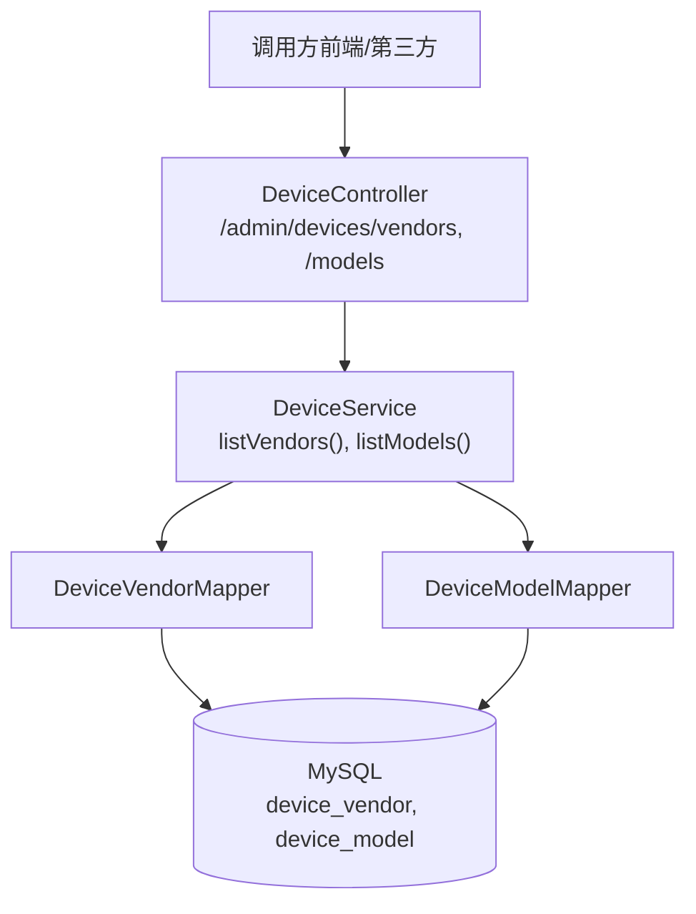
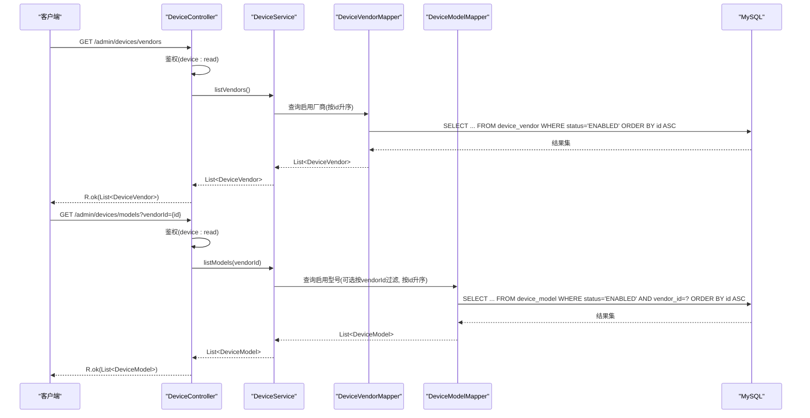
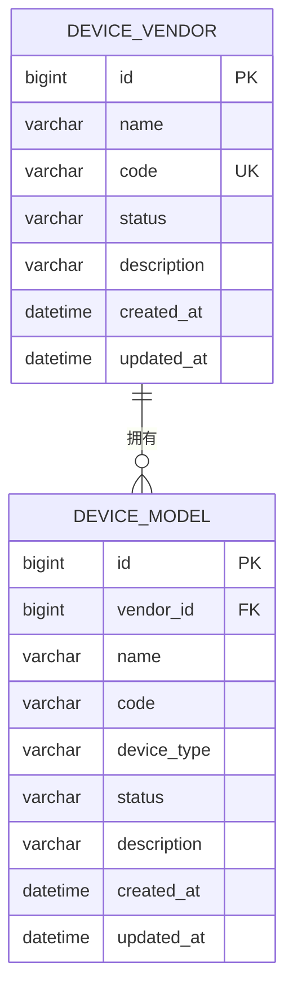
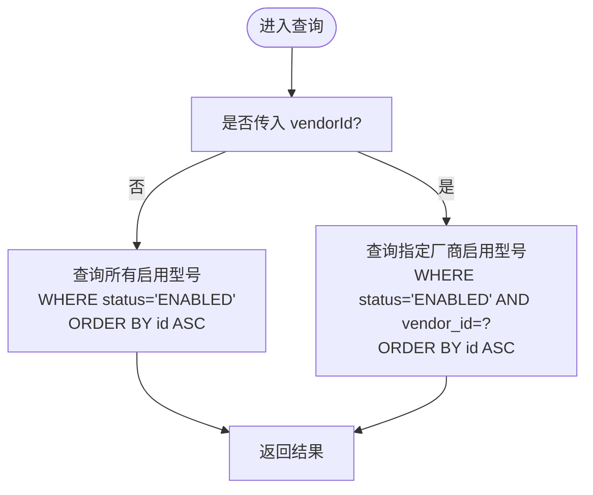
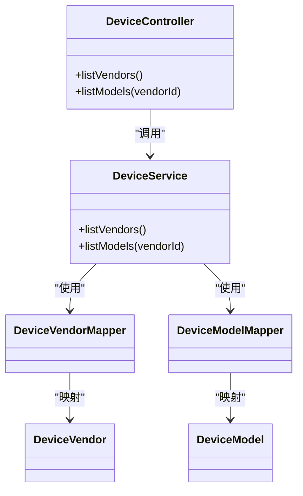

# 厂商型号管理接口

<cite>
**本文引用的文件列表**
- [DeviceController.java](file://parking-system/src/main/java/com/jushan/system/controller/DeviceController.java)
- [DeviceService.java](file://parking-system/src/main/java/com/jushan/system/service/DeviceService.java)
- [DeviceVendor.java](file://parking-system/src/main/java/com/jushan/system/entity/DeviceVendor.java)
- [DeviceModel.java](file://parking-system/src/main/java/com/jushan/system/entity/DeviceModel.java)
- [V20260711009__device_vendor_model.sql](file://parking-boot/src/main/resources/db/migration/V20260711009__device_vendor_model.sql)
</cite>

## 目录
1. [简介](#简介)
2. [项目结构](#项目结构)
3. [核心组件](#核心组件)
4. [架构总览](#架构总览)
5. [详细组件分析](#详细组件分析)
6. [依赖关系分析](#依赖关系分析)
7. [性能与扩展性](#性能与扩展性)
8. [故障排查指南](#故障排查指南)
9. [结论](#结论)
10. [附录：API 定义与示例](#附录api-定义与示例)

## 简介
本文件面向平台侧“设备台账（T20）”中的“厂商与型号”管理能力，提供完整的 API 文档。重点覆盖：
- 查询所有启用的设备厂商列表
- 按厂商筛选查询启用的设备型号列表
- 厂商与型号的层级关系、数据模型与约束
- 请求/响应格式、过滤与排序说明
- 数据的维护策略与业务用途

该能力主要用于：
- 前端在创建或编辑设备时，动态加载可用的厂商与型号选项
- 为后续设备接入、能力匹配、命令下发等提供基础字典数据支撑

## 项目结构
与厂商/型号相关的后端实现位于 parking-system 模块，控制器与服务层分别暴露接口并封装查询逻辑；实体与数据库迁移脚本位于 parking-system 与 parking-boot 模块中。

图表来源
- [DeviceController.java:185-211](file://parking-system/src/main/java/com/jushan/system/controller/DeviceController.java#L185-L211)
- [DeviceService.java:336-363](file://parking-system/src/main/java/com/jushan/system/service/DeviceService.java#L336-L363)
- [V20260711009__device_vendor_model.sql:13-46](file://parking-boot/src/main/resources/db/migration/V20260711009__device_vendor_model.sql#L13-L46)

章节来源
- [DeviceController.java:185-211](file://parking-system/src/main/java/com/jushan/system/controller/DeviceController.java#L185-L211)
- [DeviceService.java:336-363](file://parking-system/src/main/java/com/jushan/system/service/DeviceService.java#L336-L363)
- [V20260711009__device_vendor_model.sql:13-46](file://parking-boot/src/main/resources/db/migration/V20260711009__device_vendor_model.sql#L13-L46)

## 核心组件
- 控制器 DeviceController：对外暴露 REST 接口，负责权限校验与参数绑定
- 服务 DeviceService：封装业务规则与数据访问，返回启用状态的厂商/型号集合
- 实体 DeviceVendor、DeviceModel：映射数据库表结构与字段约束
- 数据库迁移脚本：定义表结构、索引与唯一约束

章节来源
- [DeviceController.java:185-211](file://parking-system/src/main/java/com/jushan/system/controller/DeviceController.java#L185-L211)
- [DeviceService.java:336-363](file://parking-system/src/main/java/com/jushan/system/service/DeviceService.java#L336-L363)
- [DeviceVendor.java:16-62](file://parking-system/src/main/java/com/jushan/system/entity/DeviceVendor.java#L16-L62)
- [DeviceModel.java:16-74](file://parking-system/src/main/java/com/jushan/system/entity/DeviceModel.java#L16-L74)
- [V20260711009__device_vendor_model.sql:13-46](file://parking-boot/src/main/resources/db/migration/V20260711009__device_vendor_model.sql#L13-L46)

## 架构总览
下图展示了从 HTTP 请求到数据库的完整链路，以及权限控制点。

图表来源
- [DeviceController.java:185-211](file://parking-system/src/main/java/com/jushan/system/controller/DeviceController.java#L185-L211)
- [DeviceService.java:336-363](file://parking-system/src/main/java/com/jushan/system/service/DeviceService.java#L336-L363)
- [V20260711009__device_vendor_model.sql:13-46](file://parking-boot/src/main/resources/db/migration/V20260711009__device_vendor_model.sql#L13-L46)

## 详细组件分析

### 接口一：查询所有启用厂商
- 路径与方法：GET /admin/devices/vendors
- 权限：device:read
- 功能：返回所有状态为“启用”的设备厂商，默认按主键升序排列
- 请求参数：无
- 响应体：统一包装对象 R<List<DeviceVendor>>，其中 DeviceVendor 包含 id、name、code、status、description、createdAt、updatedAt

章节来源
- [DeviceController.java:185-197](file://parking-system/src/main/java/com/jushan/system/controller/DeviceController.java#L185-L197)
- [DeviceService.java:336-348](file://parking-system/src/main/java/com/jushan/system/service/DeviceService.java#L336-L348)
- [DeviceVendor.java:16-62](file://parking-system/src/main/java/com/jushan/system/entity/DeviceVendor.java#L16-L62)

### 接口二：按厂商筛选查询启用型号
- 路径与方法：GET /admin/devices/models
- 权限：device:read
- 功能：返回状态为“启用”的设备型号；支持可选参数 vendorId 进行过滤
- 请求参数：
  - vendorId：Long，可选。不传则返回全部启用型号
- 响应体：统一包装对象 R<List<DeviceModel>>，其中 DeviceModel 包含 id、vendorId、name、code、deviceType、status、description、createdAt、updatedAt

章节来源
- [DeviceController.java:199-211](file://parking-system/src/main/java/com/jushan/system/controller/DeviceController.java#L199-L211)
- [DeviceService.java:350-363](file://parking-system/src/main/java/com/jushan/system/service/DeviceService.java#L350-L363)
- [DeviceModel.java:16-74](file://parking-system/src/main/java/com/jushan/system/entity/DeviceModel.java#L16-L74)

### 数据模型与层级关系
- 层级关系：厂商（DeviceVendor）→ 型号（DeviceModel），一对多关系
- 关键字段与约束：
  - device_vendor
    - id：主键自增
    - name：厂商名称
    - code：厂商编码（全局唯一）
    - status：启用/停用
    - description：备注
    - created_at/updated_at：时间戳
  - device_model
    - id：主键自增
    - vendor_id：所属厂商 ID（外键语义）
    - name：型号名称
    - code：型号编码（同厂商下唯一）
    - device_type：设备类型（如 CAMERA/GATE）
    - status：启用/停用
    - description：备注
    - created_at/updated_at：时间戳
- 索引与唯一约束：
  - device_vendor.code 唯一
  - device_model.vendor_id + code 唯一
  - 常用查询列建立索引（status、vendor_id、device_type）

图表来源
- [V20260711009__device_vendor_model.sql:13-46](file://parking-boot/src/main/resources/db/migration/V20260711009__device_vendor_model.sql#L13-L46)

章节来源
- [DeviceVendor.java:16-62](file://parking-system/src/main/java/com/jushan/system/entity/DeviceVendor.java#L16-L62)
- [DeviceModel.java:16-74](file://parking-system/src/main/java/com/jushan/system/entity/DeviceModel.java#L16-L74)
- [V20260711009__device_vendor_model.sql:13-46](file://parking-boot/src/main/resources/db/migration/V20260711009__device_vendor_model.sql#L13-L46)

### 处理流程与过滤/排序
- 过滤条件：
  - 仅返回 status = ENABLED 的记录
  - 型号可按 vendorId 过滤
- 排序方式：
  - 厂商与型号均按主键 id 升序返回
- 复杂度：
  - 单次查询 O(n)，n 为符合条件的记录数
  - 借助索引可显著降低全表扫描概率

图表来源
- [DeviceService.java:350-363](file://parking-system/src/main/java/com/jushan/system/service/DeviceService.java#L350-L363)

章节来源
- [DeviceService.java:336-363](file://parking-system/src/main/java/com/jushan/system/service/DeviceService.java#L336-L363)

## 依赖关系分析
- 控制器依赖服务层，服务层通过 MyBatis-Plus Mapper 访问数据库
- 权限由 Sa-Token 注解 @SaCheckPermission 控制，需具备 device:read 权限
- 数据一致性由数据库唯一约束与索引保障

图表来源
- [DeviceController.java:185-211](file://parking-system/src/main/java/com/jushan/system/controller/DeviceController.java#L185-L211)
- [DeviceService.java:336-363](file://parking-system/src/main/java/com/jushan/system/service/DeviceService.java#L336-L363)
- [DeviceVendor.java:16-62](file://parking-system/src/main/java/com/jushan/system/entity/DeviceVendor.java#L16-L62)
- [DeviceModel.java:16-74](file://parking-system/src/main/java/com/jushan/system/entity/DeviceModel.java#L16-L74)

章节来源
- [DeviceController.java:185-211](file://parking-system/src/main/java/com/jushan/system/controller/DeviceController.java#L185-L211)
- [DeviceService.java:336-363](file://parking-system/src/main/java/com/jushan/system/service/DeviceService.java#L336-L363)

## 性能与扩展性
- 当前实现基于单表查询与简单过滤，适合字典类数据的高频读取
- 建议：
  - 对高频读场景增加缓存（如 Redis），以减轻数据库压力
  - 若未来需要更复杂的筛选（如按名称模糊搜索、分页），可在服务层扩展 LambdaQueryWrapper 条件
  - 保持 status 与 vendor_id 的索引命中，避免全表扫描

## 故障排查指南
- 权限错误：确认调用方已具备 device:read 权限
- 空结果：检查数据库中是否存在 status=ENABLED 的记录；确认 vendorId 是否正确
- 性能问题：观察慢查询日志，确认是否命中索引；必要时引入缓存

章节来源
- [DeviceController.java:185-211](file://parking-system/src/main/java/com/jushan/system/controller/DeviceController.java#L185-L211)
- [DeviceService.java:336-363](file://parking-system/src/main/java/com/jushan/system/service/DeviceService.java#L336-L363)

## 结论
厂商与型号接口提供了简洁稳定的字典查询能力，满足设备台账的前端选择需求。通过统一的启用状态过滤与明确的排序策略，保证了数据展示的一致性与可预期性。建议在后续版本中按需引入缓存与更丰富的筛选能力，以提升整体性能与灵活性。

## 附录：API 定义与示例

### 通用响应包装
- 统一返回对象：R<T>
  - code：业务码
  - message：提示信息
  - data：具体数据

### 接口一：查询所有启用厂商
- 请求
  - 方法：GET
  - 路径：/admin/devices/vendors
  - 头部：需携带鉴权信息（具备 device:read 权限）
  - 查询参数：无
- 响应
  - data：List<DeviceVendor>
    - id：Long
    - name：String
    - code：String
    - status：String（ENABLED/DISABLED）
    - description：String
    - createdAt：DateTime
    - updatedAt：DateTime

章节来源
- [DeviceController.java:185-197](file://parking-system/src/main/java/com/jushan/system/controller/DeviceController.java#L185-L197)
- [DeviceVendor.java:16-62](file://parking-system/src/main/java/com/jushan/system/entity/DeviceVendor.java#L16-L62)

### 接口二：按厂商筛选查询启用型号
- 请求
  - 方法：GET
  - 路径：/admin/devices/models
  - 头部：需携带鉴权信息（具备 device:read 权限）
  - 查询参数：
    - vendorId：Long，可选
- 响应
  - data：List<DeviceModel>
    - id：Long
    - vendorId：Long
    - name：String
    - code：String
    - deviceType：String（如 CAMERA/GATE）
    - status：String（ENABLED/DISABLED）
    - description：String
    - createdAt：DateTime
    - updatedAt：DateTime

章节来源
- [DeviceController.java:199-211](file://parking-system/src/main/java/com/jushan/system/controller/DeviceController.java#L199-L211)
- [DeviceModel.java:16-74](file://parking-system/src/main/java/com/jushan/system/entity/DeviceModel.java#L16-L74)

### 数据维护策略与业务用途
- 维护策略
  - 厂商与型号属于平台级字典数据，通常由管理员在后台维护
  - 通过 status 字段控制启用/停用，确保前端仅展示可用项
  - 利用唯一约束保证编码规范与数据一致性
- 业务用途
  - 设备创建/编辑时，用于下拉选择厂商与型号
  - 作为设备能力与协议适配的基础依据
  - 为后续设备接入、命令下发、状态采集等提供上下文

章节来源
- [DeviceVendor.java:16-62](file://parking-system/src/main/java/com/jushan/system/entity/DeviceVendor.java#L16-L62)
- [DeviceModel.java:16-74](file://parking-system/src/main/java/com/jushan/system/entity/DeviceModel.java#L16-L74)
- [V20260711009__device_vendor_model.sql:13-46](file://parking-boot/src/main/resources/db/migration/V20260711009__device_vendor_model.sql#L13-L46)