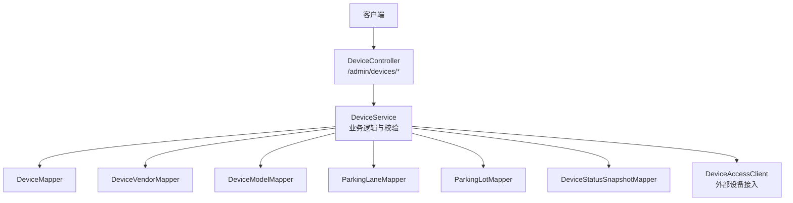
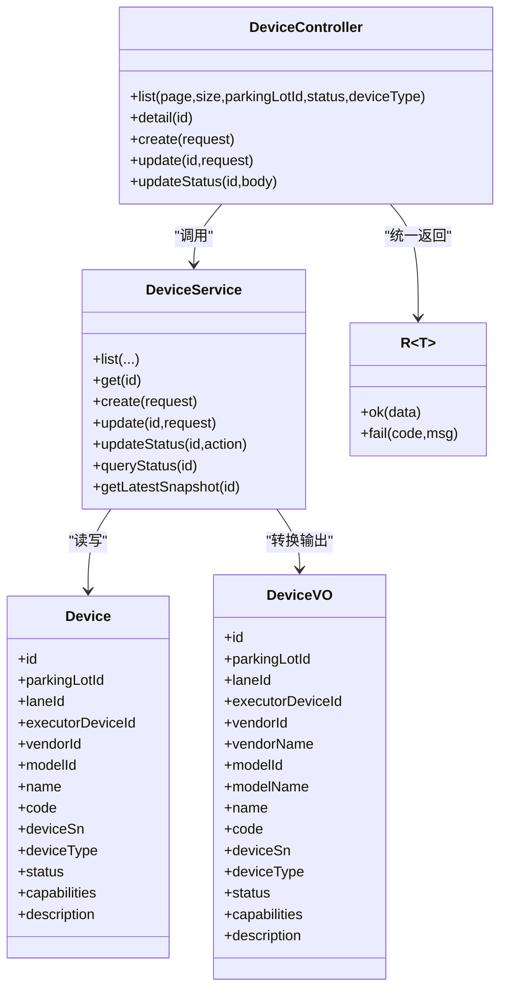
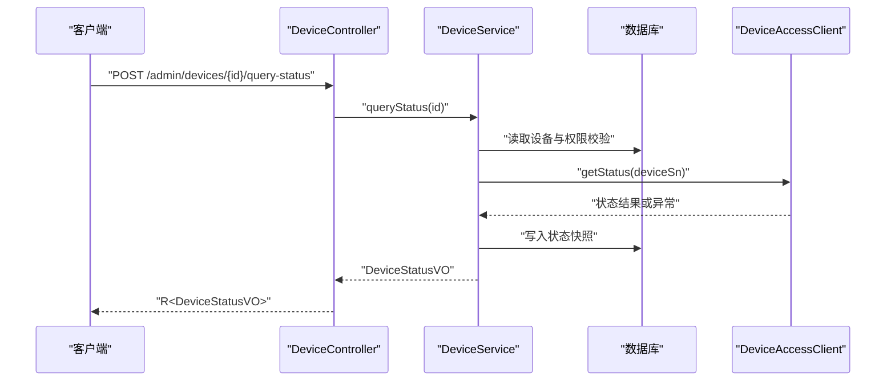

# 设备基础管理接口

<cite>
**本文引用的文件**   
- [DeviceController.java](file://parking-system/src/main/java/com/jushan/system/controller/DeviceController.java)
- [DeviceService.java](file://parking-system/src/main/java/com/jushan/system/service/DeviceService.java)
- [Device.java](file://parking-system/src/main/java/com/jushan/system/entity/Device.java)
- [CreateDeviceRequest.java](file://parking-system/src/main/java/com/jushan/system/dto/CreateDeviceRequest.java)
- [UpdateDeviceRequest.java](file://parking-system/src/main/java/com/jushan/system/dto/UpdateDeviceRequest.java)
- [DeviceVO.java](file://parking-system/src/main/java/com/jushan/system/vo/DeviceVO.java)
- [R.java](file://parking-common/src/main/java/com/jushan/common/R.java)
- [BusinessException.java](file://parking-common/src/main/java/com/jushan/common/BusinessException.java)
- [CommonErrorCode.java](file://parking-common/src/main/java/com/jushan/common/CommonErrorCode.java)
</cite>

## 目录
1. [简介](#简介)
2. [项目结构](#项目结构)
3. [核心组件](#核心组件)
4. [架构总览](#架构总览)
5. [详细接口说明](#详细接口说明)
6. [依赖分析](#依赖分析)
7. [性能与并发特性](#性能与并发特性)
8. [错误码与异常处理](#错误码与异常处理)
9. [故障排查指南](#故障排查指南)
10. [结论](#结论)

## 简介
本文件为“设备基础管理”后端接口的权威文档，覆盖设备的创建、查询（分页列表与详情）、更新基础信息、启用/停用等核心能力。同时给出权限要求、请求参数、响应格式、示例以及错误码说明。所有接口均基于租户与停车场数据隔离策略实现，前端仅可提交平台侧引用标识（如 parkingLotId/vendorId/modelId），禁止直接传入设备序列号 device_sn。

## 项目结构
设备基础管理相关代码位于 parking-system 模块：
- 控制器层：DeviceController
- 服务层：DeviceService
- 实体与视图：Device、DeviceVO
- 请求体：CreateDeviceRequest、UpdateDeviceRequest
- 通用返回与异常：R、BusinessException、CommonErrorCode

图示来源
- [DeviceController.java:38-48](file://parking-system/src/main/java/com/jushan/system/controller/DeviceController.java#L38-L48)
- [DeviceService.java:105-136](file://parking-system/src/main/java/com/jushan/system/service/DeviceService.java#L105-L136)

章节来源
- [DeviceController.java:38-48](file://parking-system/src/main/java/com/jushan/system/controller/DeviceController.java#L38-L48)
- [DeviceService.java:105-136](file://parking-system/src/main/java/com/jushan/system/service/DeviceService.java#L105-L136)

## 核心组件
- DeviceController：暴露 /admin/devices 系列 HTTP 接口，统一使用 R<T> 包装响应，并通过注解进行权限控制。
- DeviceService：实现设备 CRUD、状态变更、绑定关系、状态快照与校时等核心流程；负责租户/停车场数据隔离与业务校验。
- Device：设备主数据实体，包含类型、状态、关联车道与执行设备等字段。
- CreateDeviceRequest/UpdateDeviceRequest：创建与更新请求的入参约束。
- DeviceVO：对外返回的设备视图对象，附带厂商/型号名称等展示信息。
- R/BusinessException/CommonErrorCode：统一响应结构与错误码体系。

章节来源
- [DeviceController.java:38-48](file://parking-system/src/main/java/com/jushan/system/controller/DeviceController.java#L38-L48)
- [DeviceService.java:70-136](file://parking-system/src/main/java/com/jushan/system/service/DeviceService.java#L70-L136)
- [Device.java:27-83](file://parking-system/src/main/java/com/jushan/system/entity/Device.java#L27-L83)
- [CreateDeviceRequest.java:13-53](file://parking-system/src/main/java/com/jushan/system/dto/CreateDeviceRequest.java#L13-L53)
- [UpdateDeviceRequest.java:13-33](file://parking-system/src/main/java/com/jushan/system/dto/UpdateDeviceRequest.java#L13-L33)
- [DeviceVO.java:13-32](file://parking-system/src/main/java/com/jushan/system/vo/DeviceVO.java#L13-L32)
- [R.java](file://parking-common/src/main/java/com/jushan/common/R.java)
- [BusinessException.java](file://parking-common/src/main/java/com/jushan/common/BusinessException.java)
- [CommonErrorCode.java](file://parking-common/src/main/java/com/jushan/common/CommonErrorCode.java)

## 架构总览
设备基础管理采用典型的 Controller → Service → Mapper/Client 分层架构。权限由注解在 Controller 层拦截，业务规则与数据隔离在 Service 层完成。对外通过 R<T> 统一封装成功/失败响应。

图示来源
- [DeviceController.java:38-128](file://parking-system/src/main/java/com/jushan/system/controller/DeviceController.java#L38-L128)
- [DeviceService.java:138-404](file://parking-system/src/main/java/com/jushan/system/service/DeviceService.java#L138-L404)
- [Device.java:27-83](file://parking-system/src/main/java/com/jushan/system/entity/Device.java#L27-L83)
- [DeviceVO.java:13-32](file://parking-system/src/main/java/com/jushan/system/vo/DeviceVO.java#L13-L32)
- [R.java](file://parking-common/src/main/java/com/jushan/common/R.java)

## 详细接口说明

### 通用约定
- 基础路径：/admin/devices
- 认证与鉴权：需携带有效令牌；具体权限见各接口说明
- 统一响应：R<T>
  - 成功：{ code: 0, data: T, message: "操作成功" }
  - 失败：{ code: 错误码, message: "错误描述", data: null }
- 分页：page 从 1 开始，size 默认 20
- 时间字段：ISO 8601 字符串或时间戳（以实际返回为准）

章节来源
- [DeviceController.java:38-48](file://parking-system/src/main/java/com/jushan/system/controller/DeviceController.java#L38-L48)
- [R.java](file://parking-common/src/main/java/com/jushan/common/R.java)

---

### 1) 分页查询设备列表
- 方法：GET
- URL：/admin/devices
- 权限：device:read
- 查询参数
  - page：页码，默认 1
  - size：每页大小，默认 20
  - parkingLotId：停车场 ID（必填）
  - status：状态筛选，可选 ENABLED/DISABLED
  - deviceType：设备类型筛选，可选 CAMERA/GATE
- 响应体：IPage<DeviceVO>
  - 字段参考 DeviceVO
- 示例
  - 请求
    - GET /admin/devices?page=1&size=20&parkingLotId=1001&status=ENABLED&deviceType=CAMERA
  - 响应
    - {
        "code": 0,
        "data": {
          "records": [ /* DeviceVO 数组 */ ],
          "total": 120,
          "current": 1,
          "size": 20
        },
        "message": "操作成功"
      }

章节来源
- [DeviceController.java:63-72](file://parking-system/src/main/java/com/jushan/system/controller/DeviceController.java#L63-L72)
- [DeviceService.java:299-321](file://parking-system/src/main/java/com/jushan/system/service/DeviceService.java#L299-L321)
- [DeviceVO.java:13-32](file://parking-system/src/main/java/com/jushan/system/vo/DeviceVO.java#L13-L32)

---

### 2) 查询设备详情
- 方法：GET
- URL：/admin/devices/{id}
- 权限：device:read
- 路径参数
  - id：设备 ID
- 响应体：DeviceVO
- 示例
  - 请求
    - GET /admin/devices/10001
  - 响应
    - {
        "code": 0,
        "data": {
          "id": 10001,
          "parkingLotId": 1001,
          "laneId": 2001,
          "executorDeviceId": null,
          "vendorId": 1,
          "vendorName": "海康威视",
          "modelId": 10,
          "modelName": "DS-2CD2xxx",
          "name": "入口相机A",
          "code": "IN-A",
          "deviceSn": "HKSN123456",
          "deviceType": "CAMERA",
          "status": "ENABLED",
          "capabilities": "RECOGNIZE,CAPTURE",
          "description": "入口主相机",
          "createdAt": "2025-01-01T10:00:00",
          "updatedAt": "2025-01-02T12:00:00"
        },
        "message": "操作成功"
      }

章节来源
- [DeviceController.java:79-84](file://parking-system/src/main/java/com/jushan/system/controller/DeviceController.java#L79-L84)
- [DeviceService.java:329-334](file://parking-system/src/main/java/com/jushan/system/service/DeviceService.java#L329-L334)
- [DeviceVO.java:13-32](file://parking-system/src/main/java/com/jushan/system/vo/DeviceVO.java#L13-L32)

---

### 3) 创建设备
- 方法：POST
- URL：/admin/devices
- 权限：device:manage
- 请求体：CreateDeviceRequest
  - parkingLotId：所属停车场 ID（必填）
  - vendorId：设备厂商 ID（必填）
  - modelId：设备型号 ID（必填）
  - name：设备名称（必填，最长 128）
  - code：设备编码（必填，最长 64，停车场内唯一）
  - deviceSn：设备序列号（必填，最长 128，同厂商内唯一）
  - deviceType：设备类型（必填，CAMERA/GATE）
  - capabilities：设备能力（可选，最长 500）
  - description：备注（可选，最长 255）
- 响应体：DeviceVO
- 示例
  - 请求
    - POST /admin/devices
    - Body:
      {
        "parkingLotId": 1001,
        "vendorId": 1,
        "modelId": 10,
        "name": "入口相机A",
        "code": "IN-A",
        "deviceSn": "HKSN123456",
        "deviceType": "CAMERA",
        "capabilities": "RECOGNIZE,CAPTURE",
        "description": "入口主相机"
      }
  - 响应
    - {
        "code": 0,
        "data": { /* DeviceVO */ },
        "message": "操作成功"
      }

章节来源
- [DeviceController.java:91-98](file://parking-system/src/main/java/com/jushan/system/controller/DeviceController.java#L91-L98)
- [DeviceService.java:148-211](file://parking-system/src/main/java/com/jushan/system/service/DeviceService.java#L148-L211)
- [CreateDeviceRequest.java:13-53](file://parking-system/src/main/java/com/jushan/system/dto/CreateDeviceRequest.java#L13-L53)
- [DeviceVO.java:13-32](file://parking-system/src/main/java/com/jushan/system/vo/DeviceVO.java#L13-L32)

---

### 4) 更新设备基础信息（部分更新）
- 方法：PUT
- URL：/admin/devices/{id}
- 权限：device:manage
- 路径参数
  - id：设备 ID
- 请求体：UpdateDeviceRequest（仅非 null 字段生效）
  - name：设备名称（可选，最长 128）
  - code：设备编码（可选，最长 64，停车场内唯一）
  - deviceType：设备类型（可选，CAMERA/GATE）
  - capabilities：设备能力（可选，最长 500）
  - description：备注（可选，最长 255）
  - 注意：device_sn 不可通过此接口修改
- 响应体：DeviceVO
- 示例
  - 请求
    - PUT /admin/devices/10001
    - Body:
      {
        "name": "入口相机A-新名称",
        "description": "更新备注"
      }
  - 响应
    - {
        "code": 0,
        "data": { /* DeviceVO */ },
        "message": "操作成功"
      }

章节来源
- [DeviceController.java:105-111](file://parking-system/src/main/java/com/jushan/system/controller/DeviceController.java#L105-L111)
- [DeviceService.java:224-283](file://parking-system/src/main/java/com/jushan/system/service/DeviceService.java#L224-L283)
- [UpdateDeviceRequest.java:13-33](file://parking-system/src/main/java/com/jushan/system/dto/UpdateDeviceRequest.java#L13-L33)
- [DeviceVO.java:13-32](file://parking-system/src/main/java/com/jushan/system/vo/DeviceVO.java#L13-L32)

---

### 5) 启用或停用设备
- 方法：POST
- URL：/admin/devices/{id}/status
- 权限：device:manage
- 路径参数
  - id：设备 ID
- 请求体：Map<String,String>
  - action：ENABLED 或 DISABLED
- 响应体：空
- 示例
  - 请求
    - POST /admin/devices/10001/status
    - Body: { "action": "DISABLED" }
  - 响应
    - {
        "code": 0,
        "data": null,
        "message": "操作成功"
      }

章节来源
- [DeviceController.java:121-128](file://parking-system/src/main/java/com/jushan/system/controller/DeviceController.java#L121-L128)
- [DeviceService.java:375-404](file://parking-system/src/main/java/com/jushan/system/service/DeviceService.java#L375-L404)

---

### 6) 查询设备最新状态快照（只读）
- 方法：GET
- URL：/admin/devices/{id}/status
- 权限：device:read
- 路径参数
  - id：设备 ID
- 响应体：DeviceStatusVO（含 stale 字段指示是否过期）
- 示例
  - 请求
    - GET /admin/devices/10001/status
  - 响应
    - {
        "code": 0,
        "data": {
          "deviceId": 10001,
          "deviceName": "入口相机A",
          "deviceCode": "IN-A",
          "deviceType": "CAMERA",
          "deviceStatus": "ENABLED",
          "online": true,
          "lastOnlineTime": "2025-01-02 12:00:00",
          "gateStatus": null,
          "gateConnectStatus": null,
          "statusDescription": "在线",
          "collectedAt": "2025-01-02 12:00:00",
          "lastQuerySuccess": true,
          "lastErrorCode": null,
          "lastErrorMessage": null,
          "snapshotAgeSeconds": 10,
          "stale": false
        },
        "message": "操作成功"
      }

章节来源
- [DeviceController.java:290-295](file://parking-system/src/main/java/com/jushan/system/controller/DeviceController.java#L290-L295)
- [DeviceService.java:940-950](file://parking-system/src/main/java/com/jushan/system/service/DeviceService.java#L940-L950)

---

### 7) 刷新设备实时状态（触发查询并持久化快照）
- 方法：POST
- URL：/admin/devices/{id}/query-status
- 权限：device:manage
- 路径参数
  - id：设备 ID
- 响应体：DeviceStatusVO
- 示例
  - 请求
    - POST /admin/devices/10001/query-status
  - 响应
    - {
        "code": 0,
        "data": { /* DeviceStatusVO */ },
        "message": "操作成功"
      }

章节来源
- [DeviceController.java:249-256](file://parking-system/src/main/java/com/jushan/system/controller/DeviceController.java#L249-L256)
- [DeviceService.java:786-849](file://parking-system/src/main/java/com/jushan/system/service/DeviceService.java#L786-L849)

---

### 8) 批量刷新设备实时状态
- 方法：POST
- URL：/admin/devices/query-status-batch
- 权限：device:manage
- 请求体：Map<String,List<Long>>
  - deviceIds：设备 ID 列表（最多 50）
- 响应体：List<DeviceStatusVO>
- 示例
  - 请求
    - POST /admin/devices/query-status-batch
    - Body: { "deviceIds": [10001, 10002] }
  - 响应
    - {
        "code": 0,
        "data": [ /* DeviceStatusVO 列表 */ ],
        "message": "操作成功"
      }

章节来源
- [DeviceController.java:268-277](file://parking-system/src/main/java/com/jushan/system/controller/DeviceController.java#L268-L277)
- [DeviceService.java:867-929](file://parking-system/src/main/java/com/jushan/system/service/DeviceService.java#L867-L929)

---

### 9) 批量获取设备最新状态快照
- 方法：POST
- URL：/admin/devices/status-snapshots
- 权限：device:read
- 请求体：Map<String,List<Long>>
  - deviceIds：设备 ID 列表
- 响应体：List<DeviceStatusVO>
- 示例
  - 请求
    - POST /admin/devices/status-snapshots
    - Body: { "deviceIds": [10001, 10002] }
  - 响应
    - {
        "code": 0,
        "data": [ /* DeviceStatusVO 列表 */ ],
        "message": "操作成功"
      }

章节来源
- [DeviceController.java:304-313](file://parking-system/src/main/java/com/jushan/system/controller/DeviceController.java#L304-L313)
- [DeviceService.java:958-972](file://parking-system/src/main/java/com/jushan/system/service/DeviceService.java#L958-L972)

---

### 10) 设备校时
- 方法：POST
- URL：/admin/devices/{id}/sync-time
- 权限：device:manage
- 路径参数
  - id：设备 ID
- 请求体：Map<String,String>
  - reason：操作原因（可选）
- 响应体：TimeSyncResultDTO（包含 success、message 等）
- 示例
  - 请求
    - POST /admin/devices/10001/sync-time
    - Body: { "reason": "运维校准" }
  - 响应
    - {
        "code": 0,
        "data": {
          "success": true,
          "message": "同步成功",
          "deviceCode": "IN-A"
        },
        "message": "操作成功"
      }

章节来源
- [DeviceController.java:227-234](file://parking-system/src/main/java/com/jushan/system/controller/DeviceController.java#L227-L234)
- [DeviceService.java:575-615](file://parking-system/src/main/java/com/jushan/system/service/DeviceService.java#L575-L615)

## 依赖分析
- 控制器到服务：DeviceController 仅做路由与权限校验，核心逻辑委托 DeviceService。
- 服务到数据层：DeviceService 通过多个 Mapper 访问设备、厂商、型号、车道、停车场及状态快照表。
- 服务到外部系统：DeviceService 通过 DeviceAccessClient 与设备接入层交互（状态查询、校时等）。
- 安全与隔离：
  - 权限：@SaCheckPermission 在 Controller 层控制
  - 租户与停车场范围：Service 内部通过 DataScope 与 ParkingLotScopeResolver 校验

图示来源
- [DeviceController.java:249-256](file://parking-system/src/main/java/com/jushan/system/controller/DeviceController.java#L249-L256)
- [DeviceService.java:786-849](file://parking-system/src/main/java/com/jushan/system/service/DeviceService.java#L786-L849)

章节来源
- [DeviceController.java:38-48](file://parking-system/src/main/java/com/jushan/system/controller/DeviceController.java#L38-L48)
- [DeviceService.java:105-136](file://parking-system/src/main/java/com/jushan/system/service/DeviceService.java#L105-L136)

## 性能与并发特性
- 批量状态查询
  - 单次最大设备数：50
  - 并发度：受信号量限制（默认 5）
  - 单个设备失败不影响其他设备
- 状态快照新鲜度
  - 超过 60 秒标记为 stale，前端应据此提示“最后查询于 X 秒前”
- 列表轮询建议
  - 优先使用“获取最新快照”接口，避免频繁触发网络调用

章节来源
- [DeviceService.java:851-929](file://parking-system/src/main/java/com/jushan/system/service/DeviceService.java#L851-L929)
- [DeviceService.java:940-950](file://parking-system/src/main/java/com/jushan/system/service/DeviceService.java#L940-L950)

## 错误码与异常处理
- 统一响应结构：R<T>
- 常见错误码
  - 400：参数错误（例如缺少必填参数、非法枚举值）
  - 403：无权限（未具备所需权限）
  - 404：资源不存在（设备/停车场/车道/厂商/型号不存在）
  - 500：服务器内部错误
  - 业务错误码：BUSINESS_ERROR（业务规则不满足，如重复绑定、状态冲突）
  - 不支持操作：UNSUPPORTED_OPERATION（如 v0.2 未实现的开闸）
- 典型错误场景
  - 设备编码重复：在停车场内已存在
  - 设备序列号重复：在同厂商内已存在
  - 无效设备类型：仅支持 CAMERA/GATE
  - 设备已是目标状态：重复启用/停用
  - 已停用设备：不允许绑定/查询/校时等操作
  - 设备与车道不同属一个停车场：不允许绑定
  - 同一车道同类型设备唯一：不允许重复绑定
  - 批量查询超限：单次最多 50 台
  - 快照从未查询：状态字段为空，stale=false 或 null

章节来源
- [DeviceService.java:148-211](file://parking-system/src/main/java/com/jushan/system/service/DeviceService.java#L148-L211)
- [DeviceService.java:224-283](file://parking-system/src/main/java/com/jushan/system/service/DeviceService.java#L224-L283)
- [DeviceService.java:375-404](file://parking-system/src/main/java/com/jushan/system/service/DeviceService.java#L375-L404)
- [DeviceService.java:418-509](file://parking-system/src/main/java/com/jushan/system/service/DeviceService.java#L418-L509)
- [DeviceService.java:575-615](file://parking-system/src/main/java/com/jushan/system/service/DeviceService.java#L575-L615)
- [DeviceService.java:786-849](file://parking-system/src/main/java/com/jushan/system/service/DeviceService.java#L786-L849)
- [DeviceService.java:867-929](file://parking-system/src/main/java/com/jushan/system/service/DeviceService.java#L867-L929)
- [R.java](file://parking-common/src/main/java/com/jushan/common/R.java)
- [BusinessException.java](file://parking-common/src/main/java/com/jushan/common/BusinessException.java)
- [CommonErrorCode.java](file://parking-common/src/main/java/com/jushan/common/CommonErrorCode.java)

## 故障排查指南
- 无法创建设备
  - 检查 parkingLotId/vendorId/modelId 是否存在且启用
  - 检查 code 在停车场内是否重复
  - 检查 deviceSn 在同厂商内是否重复
- 无法更新设备
  - 检查 code 是否与其他设备冲突（排除自身）
  - 检查 deviceType 是否为 CAMERA/GATE
- 无法启用/停用
  - 检查当前状态是否与目标一致
  - 检查并发更新导致的状态覆盖（乐观锁保护）
- 无法绑定车道
  - 检查设备与车道是否属于同一停车场
  - 检查车道是否启用
  - 检查该车道是否已有同类型设备
- 状态查询失败
  - 查看 lastErrorCode/lastErrorMessage
  - 若为 UNCERTAIN/404/503/500，结合网络与设备接入层日志定位
- 快照过期
  - stale=true 表示超过 60 秒未刷新，建议调用“刷新实时状态”接口

章节来源
- [DeviceService.java:148-211](file://parking-system/src/main/java/com/jushan/system/service/DeviceService.java#L148-L211)
- [DeviceService.java:224-283](file://parking-system/src/main/java/com/jushan/system/service/DeviceService.java#L224-L283)
- [DeviceService.java:375-404](file://parking-system/src/main/java/com/jushan/system/service/DeviceService.java#L375-L404)
- [DeviceService.java:418-509](file://parking-system/src/main/java/com/jushan/system/service/DeviceService.java#L418-L509)
- [DeviceService.java:786-849](file://parking-system/src/main/java/com/jushan/system/service/DeviceService.java#L786-L849)

## 结论
设备基础管理接口围绕“可信主数据+严格校验+数据隔离”的原则设计，提供完整的设备生命周期管理能力。通过统一的权限控制与错误码体系，确保前后端协作稳定可靠。建议在高频场景中优先使用快照接口，并在需要真实状态时再触发实时查询，以获得更好的性能与用户体验。