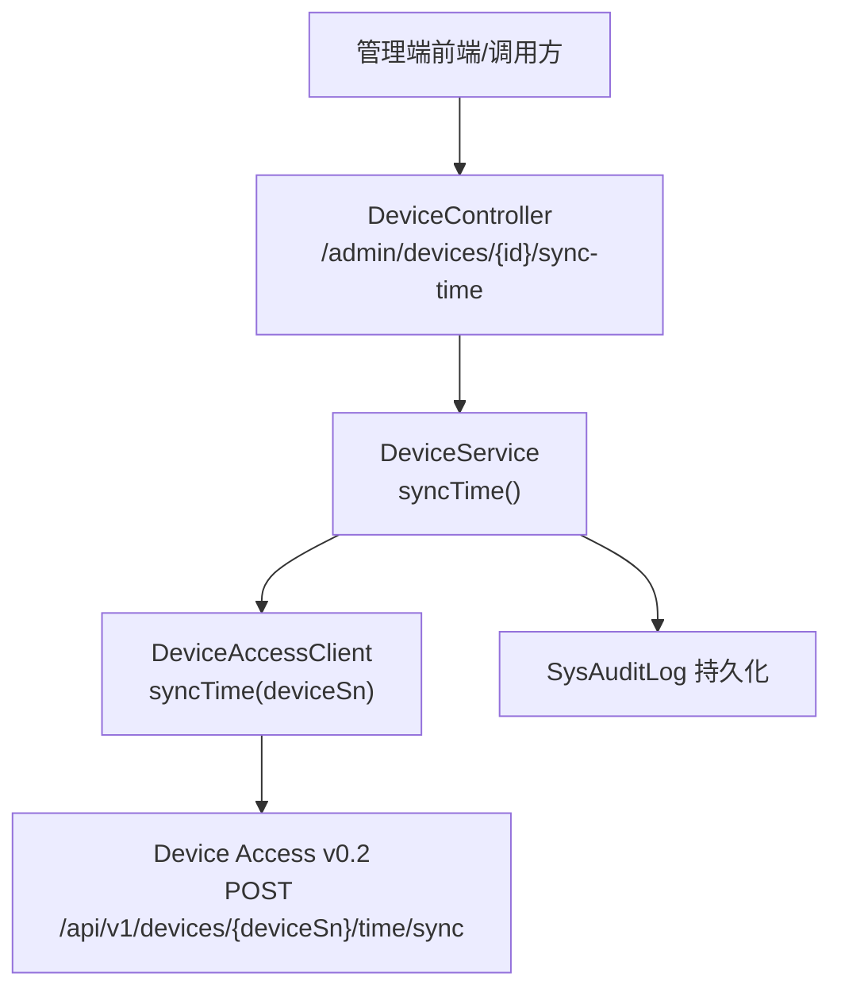
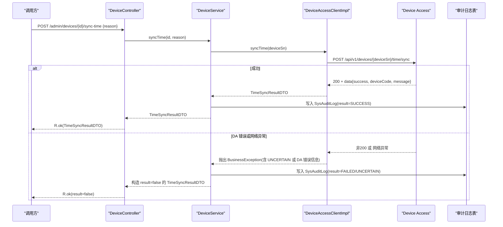
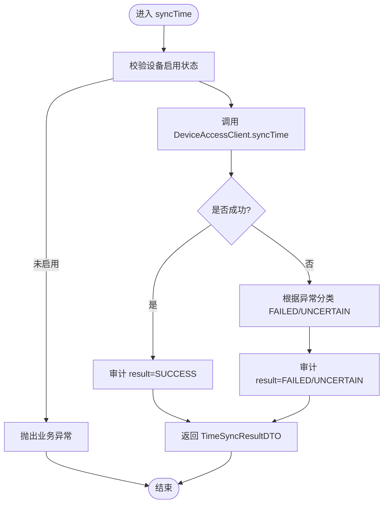
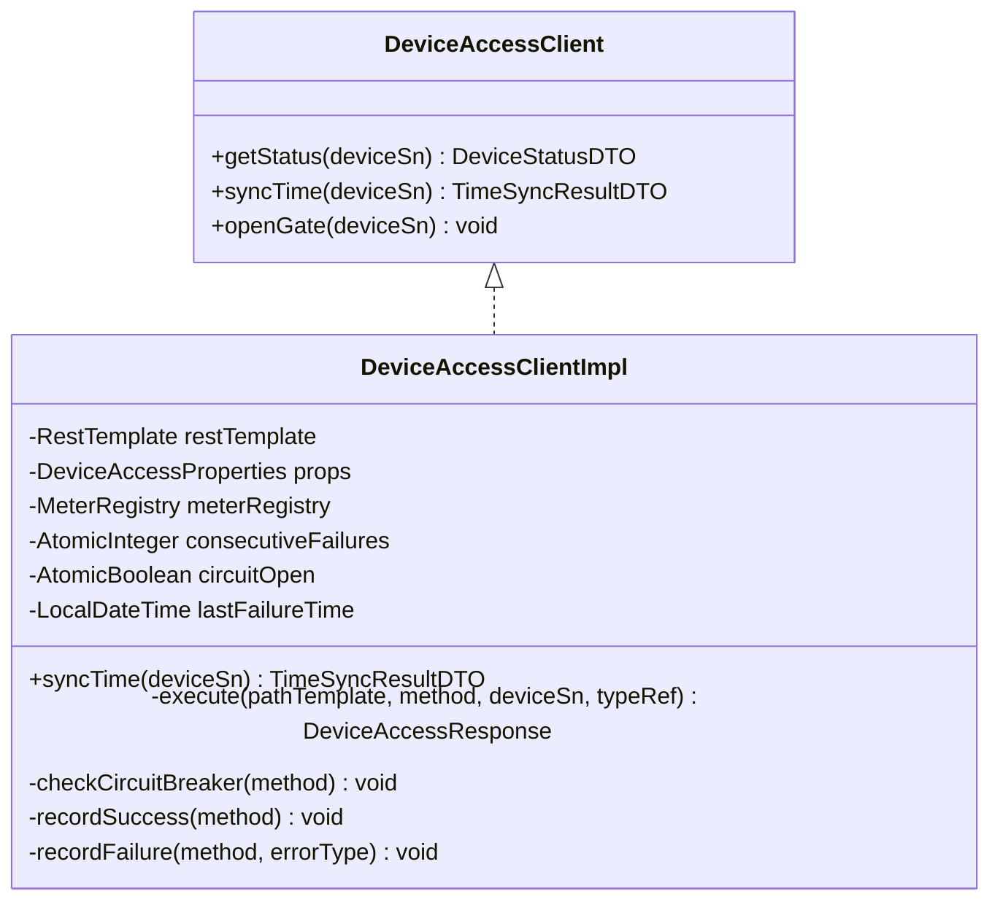
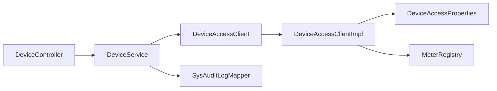

# 设备时间同步接口

<cite>
**本文引用的文件列表**
- [DeviceController.java](file://parking-system/src/main/java/com/jushan/system/controller/DeviceController.java)
- [DeviceService.java](file://parking-system/src/main/java/com/jushan/system/service/DeviceService.java)
- [DeviceAccessClient.java](file://parking-system/src/main/java/com/jushan/system/client/DeviceAccessClient.java)
- [DeviceAccessClientImpl.java](file://parking-system/src/main/java/com/jushan/system/client/DeviceAccessClientImpl.java)
- [TimeSyncResultDTO.java](file://parking-system/src/main/java/com/jushan/system/client/dto/TimeSyncResultDTO.java)
- [SysAuditLog.java](file://parking-system/src/main/java/com/jushan/system/entity/SysAuditLog.java)
- [DeviceTimeSyncIntegrationTest.java](file://parking-boot/src/test/java/com/jushan/boot/controller/DeviceTimeSyncIntegrationTest.java)
</cite>

## 目录
1. [简介](#简介)
2. [项目结构](#项目结构)
3. [核心组件](#核心组件)
4. [架构总览](#架构总览)
5. [详细组件分析](#详细组件分析)
6. [依赖关系分析](#依赖关系分析)
7. [性能与可靠性](#性能与可靠性)
8. [故障排查指南](#故障排查指南)
9. [结论](#结论)
10. [附录：API 规范与示例](#附录api-规范与示例)

## 简介
本文件为“设备时间同步接口”的完整 API 文档，覆盖以下要点：
- 调用流程：从平台管理端发起校时请求，经控制器、服务层、Device Access 客户端，最终向 Device Access 发送 POST /api/v1/devices/{deviceSn}/time/sync。
- 幂等性与重试策略：当前 v0.2 无 commandId 幂等；本实现不包含自动重试。
- 结果处理：成功、失败（FAILED）、不确定（UNCERTAIN）三类状态及审计记录持久化。
- 网络超时与降级恢复：统一标记 UNCERTAIN，并内置内存级熔断器快速失败与恢复窗口。
- 请求/响应格式与示例：包含成功、失败、不确定的典型场景。

## 项目结构
该功能涉及三层：
- 控制层：暴露管理端 REST 接口，负责鉴权与参数解析。
- 业务层：校验设备权限/状态、调用 Device Access、持久化审计日志。
- 客户端层：封装对 Device Access 的 HTTP 调用，含指标、熔断与异常分类。

图表来源
- [DeviceController.java:213-234](file://parking-system/src/main/java/com/jushan/system/controller/DeviceController.java#L213-L234)
- [DeviceService.java:562-653](file://parking-system/src/main/java/com/jushan/system/service/DeviceService.java#L562-L653)
- [DeviceAccessClient.java:39-49](file://parking-system/src/main/java/com/jushan/system/client/DeviceAccessClient.java#L39-L49)
- [DeviceAccessClientImpl.java:134-158](file://parking-system/src/main/java/com/jushan/system/client/DeviceAccessClientImpl.java#L134-L158)
- [SysAuditLog.java:19-69](file://parking-system/src/main/java/com/jushan/system/entity/SysAuditLog.java#L19-L69)

章节来源
- [DeviceController.java:213-234](file://parking-system/src/main/java/com/jushan/system/controller/DeviceController.java#L213-L234)
- [DeviceService.java:562-653](file://parking-system/src/main/java/com/jushan/system/service/DeviceService.java#L562-L653)
- [DeviceAccessClient.java:39-49](file://parking-system/src/main/java/com/jushan/system/client/DeviceAccessClient.java#L39-L49)
- [DeviceAccessClientImpl.java:134-158](file://parking-system/src/main/java/com/jushan/system/client/DeviceAccessClientImpl.java#L134-L158)
- [SysAuditLog.java:19-69](file://parking-system/src/main/java/com/jushan/system/entity/SysAuditLog.java#L19-L69)

## 核心组件
- 控制器：提供 /admin/devices/{id}/sync-time，要求 device:manage 权限，接收 reason 字段。
- 服务：校验设备启用状态，调用 DeviceAccessClient.syncTime，捕获异常并写入审计日志，返回 TimeSyncResultDTO。
- 客户端：使用 RestTemplate 调用 Device Access，统计指标、熔断保护，错误分类为 DA 错误、网络异常、解析异常等。
- DTO：TimeSyncResultDTO 对齐 DA CommandResultDTO，包含 success、deviceCode、message 与 isSuccessful 判定。
- 审计：SysAuditLog 记录操作人、目标、结果、原因、前后值等。

章节来源
- [DeviceController.java:213-234](file://parking-system/src/main/java/com/jushan/system/controller/DeviceController.java#L213-L234)
- [DeviceService.java:562-653](file://parking-system/src/main/java/com/jushan/system/service/DeviceService.java#L562-L653)
- [DeviceAccessClient.java:39-49](file://parking-system/src/main/java/com/jushan/system/client/DeviceAccessClient.java#L39-L49)
- [DeviceAccessClientImpl.java:134-158](file://parking-system/src/main/java/com/jushan/system/client/DeviceAccessClientImpl.java#L134-L158)
- [TimeSyncResultDTO.java:18-58](file://parking-system/src/main/java/com/jushan/system/client/dto/TimeSyncResultDTO.java#L18-L58)
- [SysAuditLog.java:19-69](file://parking-system/src/main/java/com/jushan/system/entity/SysAuditLog.java#L19-L69)

## 架构总览

图表来源
- [DeviceController.java:213-234](file://parking-system/src/main/java/com/jushan/system/controller/DeviceController.java#L213-L234)
- [DeviceService.java:562-653](file://parking-system/src/main/java/com/jushan/system/service/DeviceService.java#L562-L653)
- [DeviceAccessClientImpl.java:134-158](file://parking-system/src/main/java/com/jushan/system/client/DeviceAccessClientImpl.java#L134-L158)
- [SysAuditLog.java:19-69](file://parking-system/src/main/java/com/jushan/system/entity/SysAuditLog.java#L19-L69)

## 详细组件分析

### 控制器：DeviceController
- 路由：POST /admin/devices/{id}/sync-time
- 权限：device:manage
- 入参：body 中可选 reason 字符串
- 出参：R.ok(TimeSyncResultDTO)，无论成功与否均返回 200，具体结果在 data 中体现
- 行为：透传 reason 至服务层，记录日志

章节来源
- [DeviceController.java:213-234](file://parking-system/src/main/java/com/jushan/system/controller/DeviceController.java#L213-L234)

### 服务层：DeviceService.syncTime
- 前置校验：设备必须存在且处于启用状态
- 调用：DeviceAccessClient.syncTime(deviceSn)
- 异常处理：
  - 若异常消息包含“UNCERTAIN”，审计结果记为 UNCERTAIN
  - 否则记为 FAILED
  - 始终构造 TimeSyncResultDTO 返回（失败时 success=false）
- 审计：writeAuditLog 写入 SysAuditLog，包含租户、目标、操作人、afterValue、result、failReason、reason 等

图表来源
- [DeviceService.java:562-653](file://parking-system/src/main/java/com/jushan/system/service/DeviceService.java#L562-L653)

章节来源
- [DeviceService.java:562-653](file://parking-system/src/main/java/com/jushan/system/service/DeviceService.java#L562-L653)

### 客户端：DeviceAccessClientImpl
- 路径：/api/v1/devices/{deviceSn}/time/sync
- 指标：Micrometer 计数与延迟计时
- 熔断：连续失败达到阈值后打开降级，超过恢复窗口尝试恢复
- 异常分类：
  - DA 业务码非成功 → BusinessException（携带 DA 错误信息）
  - 网络异常（ResourceAccessException）→ 标记 UNCERTAIN
  - 其他客户端异常 → INTERNAL_ERROR
- 幂等性说明：v0.2 无 commandId，每次调用都会下发一次校时命令

图表来源
- [DeviceAccessClient.java:26-64](file://parking-system/src/main/java/com/jushan/system/client/DeviceAccessClient.java#L26-L64)
- [DeviceAccessClientImpl.java:52-158](file://parking-system/src/main/java/com/jushan/system/client/DeviceAccessClientImpl.java#L52-L158)

章节来源
- [DeviceAccessClient.java:26-64](file://parking-system/src/main/java/com/jushan/system/client/DeviceAccessClient.java#L26-L64)
- [DeviceAccessClientImpl.java:52-158](file://parking-system/src/main/java/com/jushan/system/client/DeviceAccessClientImpl.java#L52-L158)

### 数据模型：TimeSyncResultDTO
- 字段：success(Boolean)、deviceCode(Integer)、message(String)
- 判定：isSuccessful() 当 success=true 且 deviceCode 为空或等于 200 时为真
- 幂等说明：v0.2 无 commandId，重复调用会重复下发命令

章节来源
- [TimeSyncResultDTO.java:18-58](file://parking-system/src/main/java/com/jushan/system/client/dto/TimeSyncResultDTO.java#L18-L58)

### 审计记录：SysAuditLog
- 关键字段：tenantId、targetType、targetId、action、operatorId/operatorName、result、failReason、reason、afterValue、createdAt
- time_sync 动作：记录设备 SN、名称、停车场 ID 等 afterValue

章节来源
- [SysAuditLog.java:19-69](file://parking-system/src/main/java/com/jushan/system/entity/SysAuditLog.java#L19-L69)

## 依赖关系分析
- 控制器依赖服务层，服务层依赖客户端与审计持久化。
- 客户端依赖配置属性与 Micrometer 指标注册中心。
- 测试用例通过 WireMock 模拟 Device Access，验证成功、失败、超时、权限与安全隔离等场景。

图表来源
- [DeviceController.java:213-234](file://parking-system/src/main/java/com/jushan/system/controller/DeviceController.java#L213-L234)
- [DeviceService.java:562-653](file://parking-system/src/main/java/com/jushan/system/service/DeviceService.java#L562-L653)
- [DeviceAccessClientImpl.java:52-158](file://parking-system/src/main/java/com/jushan/system/client/DeviceAccessClientImpl.java#L52-L158)

章节来源
- [DeviceController.java:213-234](file://parking-system/src/main/java/com/jushan/system/controller/DeviceController.java#L213-L234)
- [DeviceService.java:562-653](file://parking-system/src/main/java/com/jushan/system/service/DeviceService.java#L562-L653)
- [DeviceAccessClientImpl.java:52-158](file://parking-system/src/main/java/com/jushan/system/client/DeviceAccessClientImpl.java#L52-L158)

## 性能与可靠性
- 幂等性：当前 v0.2 无 commandId，重复调用会重复下发命令，不具备幂等性。
- 重试策略：本实现不包含自动重试。
- 超时处理：网络异常统一标记 UNCERTAIN，审计记录保留证据。
- 降级恢复：内存级熔断器，连续失败达到阈值后快速失败，超过恢复窗口后尝试恢复。
- 可观测性：Micrometer 指标记录调用次数、错误率与延迟分布。

章节来源
- [DeviceAccessClientImpl.java:134-158](file://parking-system/src/main/java/com/jushan/system/client/DeviceAccessClientImpl.java#L134-L158)
- [DeviceAccessClientImpl.java:160-246](file://parking-system/src/main/java/com/jushan/system/client/DeviceAccessClientImpl.java#L160-L246)
- [DeviceService.java:562-653](file://parking-system/src/main/java/com/jushan/system/service/DeviceService.java#L562-L653)

## 故障排查指南
- 常见错误分类
  - DA 返回非 200：BusinessException 携带 DA code/message，审计记为 FAILED
  - 网络异常（连接/读取超时）：标记 UNCERTAIN，审计记为 UNCERTAIN
  - 解析异常：INTERNAL_ERROR，审计记为 FAILED
- 降级触发
  - 连续失败达到阈值后打开降级，后续调用直接快速失败，避免级联阻塞
  - 超过恢复窗口后自动尝试恢复
- 定位建议
  - 查看审计日志 result/failReason/reason 字段
  - 检查 Device Access 基础地址与连通性
  - 观察熔断状态与连续失败次数

章节来源
- [DeviceAccessClientImpl.java:248-316](file://parking-system/src/main/java/com/jushan/system/client/DeviceAccessClientImpl.java#L248-L316)
- [DeviceService.java:562-653](file://parking-system/src/main/java/com/jushan/system/service/DeviceService.java#L562-L653)

## 结论
设备时间同步接口以“最小化风险”为原则：不引入幂等与重试，明确区分 SUCCESS/FAILED/UNCERTAIN 三类结果，并通过审计日志与指标保障可追溯与可观测。在 v0.2 契约下，重复调用将重复下发命令，需由上层控制调用频率与人工确认 UNCERTAIN 结果。

## 附录：API 规范与示例

### 接口定义
- 方法：POST
- 路径：/admin/devices/{id}/sync-time
- 权限：device:manage
- 请求体：
  - reason: string（可选，用于审计备注）
- 响应体：R.ok(data=TimeSyncResultDTO)
  - data.success: boolean
  - data.deviceCode: integer（设备侧状态码，200 表示成功）
  - data.message: string（结果描述）
  - 判定：data.isSuccessful() 为 true 表示成功

章节来源
- [DeviceController.java:213-234](file://parking-system/src/main/java/com/jushan/system/controller/DeviceController.java#L213-L234)
- [TimeSyncResultDTO.java:18-58](file://parking-system/src/main/java/com/jushan/system/client/dto/TimeSyncResultDTO.java#L18-L58)

### 请求示例
- 成功
  - 请求：POST /admin/devices/123/sync-time
  - Body: {"reason":"例行校时"}
  - 响应：code=0, data.success=true, data.deviceCode=200
- 失败（DA 返回错误）
  - 请求同上
  - 响应：code=0, data.success=false, data.message 包含 DA 错误信息
- 不确定（网络超时）
  - 请求同上
  - 响应：code=0, data.success=false, data.message 包含 UNCERTAIN 提示

章节来源
- [DeviceTimeSyncIntegrationTest.java:134-170](file://parking-boot/src/test/java/com/jushan/boot/controller/DeviceTimeSyncIntegrationTest.java#L134-L170)
- [DeviceTimeSyncIntegrationTest.java:209-270](file://parking-boot/src/test/java/com/jushan/boot/controller/DeviceTimeSyncIntegrationTest.java#L209-L270)
- [DeviceTimeSyncIntegrationTest.java:304-339](file://parking-boot/src/test/java/com/jushan/boot/controller/DeviceTimeSyncIntegrationTest.java#L304-L339)

### 审计记录要点
- action=time_sync
- result ∈ {SUCCESS, FAILED, UNCERTAIN}
- failReason 记录失败详情（失败或不确定时）
- reason 记录操作人填写的原因
- afterValue 包含设备 SN、名称、停车场 ID 等上下文

章节来源
- [DeviceService.java:617-653](file://parking-system/src/main/java/com/jushan/system/service/DeviceService.java#L617-L653)
- [SysAuditLog.java:19-69](file://parking-system/src/main/java/com/jushan/system/entity/SysAuditLog.java#L19-L69)