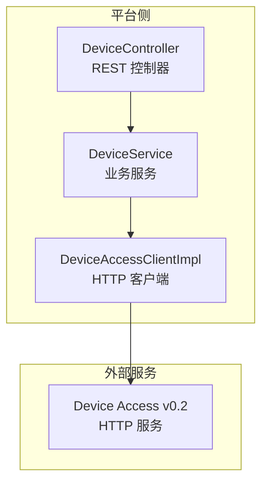
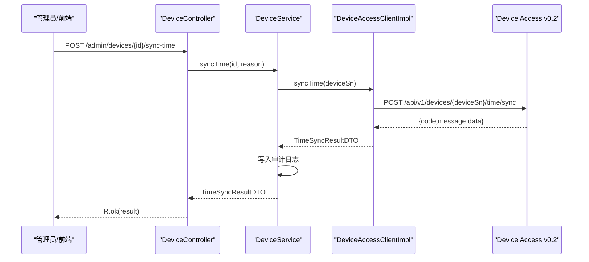
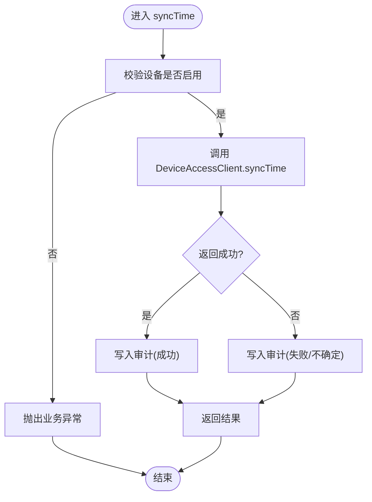
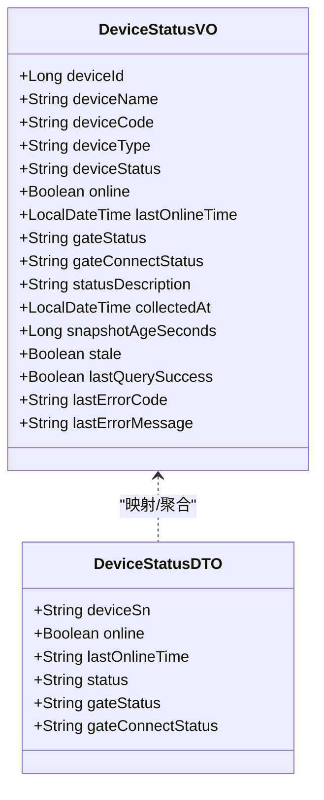
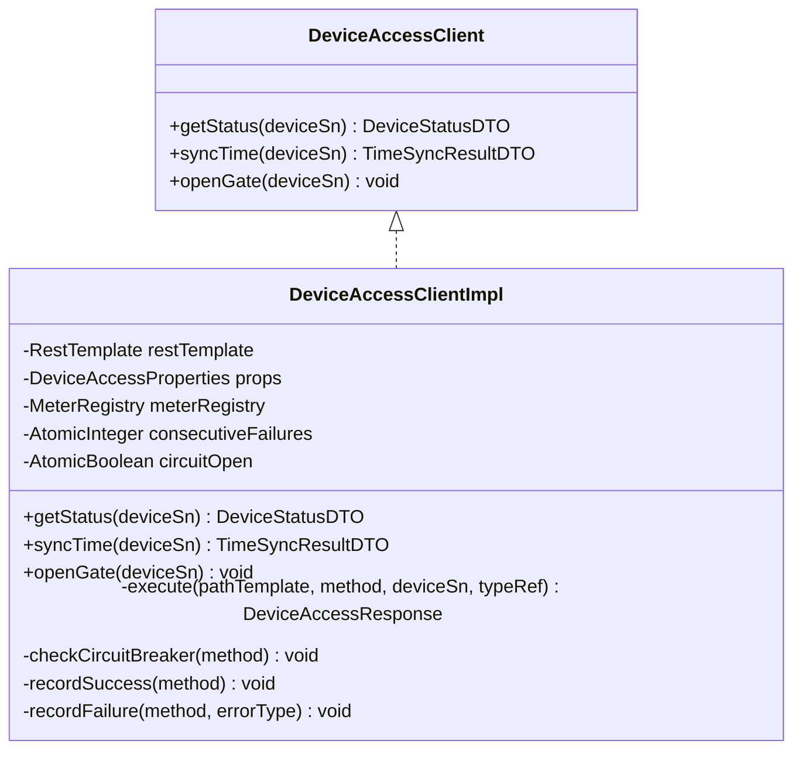
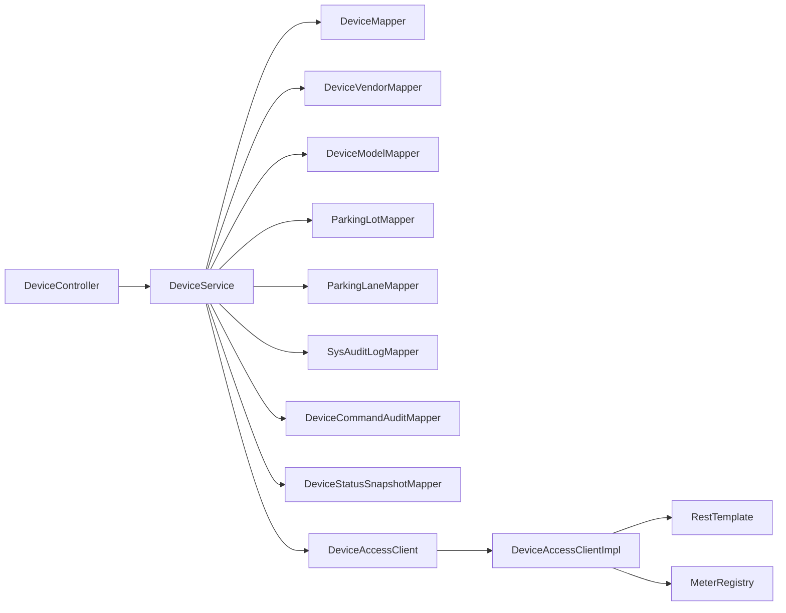

# 设备管理接口

<cite>
**本文引用的文件**   
- [README.md](file://README.md)
- [DeviceController.java](file://parking-system/src/main/java/com/jushan/system/controller/DeviceController.java)
- [DeviceService.java](file://parking-system/src/main/java/com/jushan/system/service/DeviceService.java)
- [DeviceAccessClient.java](file://parking-system/src/main/java/com/jushan/system/client/DeviceAccessClient.java)
- [DeviceAccessClientImpl.java](file://parking-system/src/main/java/com/jushan/system/client/DeviceAccessClientImpl.java)
- [CreateDeviceRequest.java](file://parking-system/src/main/java/com/jushan/system/dto/CreateDeviceRequest.java)
- [UpdateDeviceRequest.java](file://parking-system/src/main/java/com/jushan/system/dto/UpdateDeviceRequest.java)
- [DeviceVO.java](file://parking-system/src/main/java/com/jushan/system/vo/DeviceVO.java)
- [DeviceStatusVO.java](file://parking-system/src/main/java/com/jushan/system/vo/DeviceStatusVO.java)
- [TimeSyncResultDTO.java](file://parking-system/src/main/java/com/jushan/system/client/dto/TimeSyncResultDTO.java)
- [DeviceStatusDTO.java](file://parking-system/src/main/java/com/jushan/system/client/dto/DeviceStatusDTO.java)
- [Device.java](file://parking-system/src/main/java/com/jushan/system/entity/Device.java)
</cite>

## 目录
1. [简介](#简介)
2. [项目结构](#项目结构)
3. [核心组件](#核心组件)
4. [架构总览](#架构总览)
5. [详细组件分析](#详细组件分析)
6. [依赖关系分析](#依赖关系分析)
7. [性能与可用性](#性能与可用性)
8. [故障诊断与排错](#故障诊断与排错)
9. [结论](#结论)
10. [附录：API 规范](#附录api-规范)

## 简介
本文件为“设备管理接口”的权威 API 文档，覆盖设备台账 CRUD、状态监控、时间同步、厂商模型管理、设备生命周期管理、批量操作与异步处理机制等。同时说明与 Device Access 服务的集成方式、通信协议与数据格式，并提供错误处理、重试策略与性能优化建议。

当前阶段（M0→M1+）：基础框架已搭建，业务模块逐步实现；Device Access v0.2 提供 7 个 HTTP 端点，尚未实现开闸、车牌识别事件与 RabbitMQ。

**章节来源**
- [README.md:1-75](file://README.md#L1-L75)

## 项目结构
设备管理相关代码位于 parking-system 模块，采用 Controller → Service → Client 的分层设计：
- 控制器层：暴露 REST 接口，负责权限校验、参数校验与结果封装
- 服务层：承载业务规则、事务边界、审计记录与快照持久化
- 客户端层：封装对 Device Access 的 HTTP 调用，包含降级与指标采集

**图表来源**
- [DeviceController.java:1-315](file://parking-system/src/main/java/com/jushan/system/controller/DeviceController.java#L1-L315)
- [DeviceService.java:1-800](file://parking-system/src/main/java/com/jushan/system/service/DeviceService.java#L1-L800)
- [DeviceAccessClientImpl.java:1-346](file://parking-system/src/main/java/com/jushan/system/client/DeviceAccessClientImpl.java#L1-L346)

**章节来源**
- [DeviceController.java:1-315](file://parking-system/src/main/java/com/jushan/system/controller/DeviceController.java#L1-L315)
- [DeviceService.java:1-800](file://parking-system/src/main/java/com/jushan/system/service/DeviceService.java#L1-L800)
- [DeviceAccessClientImpl.java:1-346](file://parking-system/src/main/java/com/jushan/system/client/DeviceAccessClientImpl.java#L1-L346)

## 核心组件
- 控制器：统一权限注解、分页查询、CRUD、绑定/解绑车道、设置执行相机、校时、状态查询与快照
- 服务：租户隔离、数据一致性、乐观锁、审计日志、状态快照、批量查询限流
- 客户端：RestTemplate 调用、统一响应解析、异常分类、降级熔断、Micrometer 指标

**章节来源**
- [DeviceController.java:1-315](file://parking-system/src/main/java/com/jushan/system/controller/DeviceController.java#L1-L315)
- [DeviceService.java:1-800](file://parking-system/src/main/java/com/jushan/system/service/DeviceService.java#L1-L800)
- [DeviceAccessClient.java:1-65](file://parking-system/src/main/java/com/jushan/system/client/DeviceAccessClient.java#L1-L65)
- [DeviceAccessClientImpl.java:1-346](file://parking-system/src/main/java/com/jushan/system/client/DeviceAccessClientImpl.java#L1-L346)

## 架构总览
平台通过 DeviceController 暴露管理接口，DeviceService 执行业务逻辑并调用 DeviceAccessClient 访问 Device Access v0.2。所有对外设备标识（device_sn）由后端从可信实体读取，前端不得直接传入。

**图表来源**
- [DeviceController.java:213-234](file://parking-system/src/main/java/com/jushan/system/controller/DeviceController.java#L213-L234)
- [DeviceService.java:562-615](file://parking-system/src/main/java/com/jushan/system/service/DeviceService.java#L562-L615)
- [DeviceAccessClientImpl.java:134-158](file://parking-system/src/main/java/com/jushan/system/client/DeviceAccessClientImpl.java#L134-L158)

## 详细组件分析

### 设备台账管理（T20）
- 分页列表：支持按停车场、状态、类型筛选
- 详情：返回设备与厂商/型号信息
- 创建：校验停车场归属、厂商/型号启用、编码唯一性、SN 同厂商唯一
- 更新：部分更新，禁止修改 SN
- 启用/停用：条件更新（乐观锁），防止并发覆盖

请求/响应对象
- 创建请求：[CreateDeviceRequest.java:1-83](file://parking-system/src/main/java/com/jushan/system/dto/CreateDeviceRequest.java#L1-L83)
- 更新请求：[UpdateDeviceRequest.java:1-51](file://parking-system/src/main/java/com/jushan/system/dto/UpdateDeviceRequest.java#L1-L51)
- 设备视图：[DeviceVO.java:1-86](file://parking-system/src/main/java/com/jushan/system/vo/DeviceVO.java#L1-L86)
- 设备实体：[Device.java:1-134](file://parking-system/src/main/java/com/jushan/system/entity/Device.java#L1-L134)

权限
- device:read：查看设备列表、详情、厂商/型号
- device:manage：创建/编辑设备、启用/停用、绑定/解绑、设置执行相机、校时、状态查询

**章节来源**
- [DeviceController.java:50-128](file://parking-system/src/main/java/com/jushan/system/controller/DeviceController.java#L50-L128)
- [DeviceService.java:138-283](file://parking-system/src/main/java/com/jushan/system/service/DeviceService.java#L138-L283)
- [CreateDeviceRequest.java:1-83](file://parking-system/src/main/java/com/jushan/system/dto/CreateDeviceRequest.java#L1-L83)
- [UpdateDeviceRequest.java:1-51](file://parking-system/src/main/java/com/jushan/system/dto/UpdateDeviceRequest.java#L1-L51)
- [DeviceVO.java:1-86](file://parking-system/src/main/java/com/jushan/system/vo/DeviceVO.java#L1-L86)
- [Device.java:1-134](file://parking-system/src/main/java/com/jushan/system/entity/Device.java#L1-L134)

### 车道绑定与执行相机（T21）
- 绑定：设备需启用、车道存在且启用、同停车场、同车道同类型设备唯一
- 解绑：清空 laneId 与 executorDeviceId
- 设置执行相机：仅 GATE 可设置，执行相机必须为 CAMERA、同车道、同停车场、已启用

**章节来源**
- [DeviceController.java:130-183](file://parking-system/src/main/java/com/jushan/system/controller/DeviceController.java#L130-L183)
- [DeviceService.java:406-560](file://parking-system/src/main/java/com/jushan/system/service/DeviceService.java#L406-L560)

### 厂商/型号管理（T20）
- 查询启用厂商列表
- 查询型号列表（可按厂商筛选）

**章节来源**
- [DeviceController.java:185-211](file://parking-system/src/main/java/com/jushan/system/controller/DeviceController.java#L185-L211)
- [DeviceService.java:336-363](file://parking-system/src/main/java/com/jushan/system/service/DeviceService.java#L336-L363)

### 设备校时（T25）
- 调用 Device Access 发送校时命令
- 无自动重试；网络错误或超时标记为 UNCERTAIN
- 每次调用均持久化审计记录

**图表来源**
- [DeviceService.java:562-615](file://parking-system/src/main/java/com/jushan/system/service/DeviceService.java#L562-L615)
- [DeviceAccessClientImpl.java:134-158](file://parking-system/src/main/java/com/jushan/system/client/DeviceAccessClientImpl.java#L134-L158)

**章节来源**
- [DeviceController.java:213-234](file://parking-system/src/main/java/com/jushan/system/controller/DeviceController.java#L213-L234)
- [DeviceService.java:562-653](file://parking-system/src/main/java/com/jushan/system/service/DeviceService.java#L562-L653)
- [TimeSyncResultDTO.java:1-58](file://parking-system/src/main/java/com/jushan/system/client/dto/TimeSyncResultDTO.java#L1-L58)

### 设备状态查询与快照（T24）
- 实时查询：调用 Device Access，持久化快照，适合用户主动刷新
- 批量查询：最多同时查询 5 台设备（信号量限流），单个失败不影响其他
- 快照读取：不调用 DA，返回最近一次快照，含 stale 新鲜度字段

**图表来源**
- [DeviceStatusVO.java:1-113](file://parking-system/src/main/java/com/jushan/system/vo/DeviceStatusVO.java#L1-L113)
- [DeviceStatusDTO.java:1-68](file://parking-system/src/main/java/com/jushan/system/client/dto/DeviceStatusDTO.java#L1-L68)

**章节来源**
- [DeviceController.java:236-313](file://parking-system/src/main/java/com/jushan/system/controller/DeviceController.java#L236-L313)
- [DeviceService.java:774-800](file://parking-system/src/main/java/com/jushan/system/service/DeviceService.java#L774-L800)
- [DeviceStatusVO.java:1-113](file://parking-system/src/main/java/com/jushan/system/vo/DeviceStatusVO.java#L1-L113)
- [DeviceStatusDTO.java:1-68](file://parking-system/src/main/java/com/jushan/system/client/dto/DeviceStatusDTO.java#L1-L68)

### 与 Device Access 的集成（T23）
- 接口定义：状态查询、校时、开闸占位
- 实现细节：统一响应解析、异常分类、降级熔断、Micrometer 指标

**图表来源**
- [DeviceAccessClient.java:1-65](file://parking-system/src/main/java/com/jushan/system/client/DeviceAccessClient.java#L1-L65)
- [DeviceAccessClientImpl.java:1-346](file://parking-system/src/main/java/com/jushan/system/client/DeviceAccessClientImpl.java#L1-L346)

**章节来源**
- [DeviceAccessClient.java:1-65](file://parking-system/src/main/java/com/jushan/system/client/DeviceAccessClient.java#L1-L65)
- [DeviceAccessClientImpl.java:1-346](file://parking-system/src/main/java/com/jushan/system/client/DeviceAccessClientImpl.java#L1-L346)

## 依赖关系分析
- 控制器依赖服务层进行业务编排
- 服务层依赖多 Mapper 完成数据访问与审计
- 服务层通过 DeviceAccessClient 访问外部服务
- 客户端使用 RestTemplate 发起 HTTP 请求，并通过 Micrometer 上报指标

**图表来源**
- [DeviceController.java:1-315](file://parking-system/src/main/java/com/jushan/system/controller/DeviceController.java#L1-L315)
- [DeviceService.java:1-800](file://parking-system/src/main/java/com/jushan/system/service/DeviceService.java#L1-L800)
- [DeviceAccessClientImpl.java:1-346](file://parking-system/src/main/java/com/jushan/system/client/DeviceAccessClientImpl.java#L1-L346)

**章节来源**
- [DeviceController.java:1-315](file://parking-system/src/main/java/com/jushan/system/controller/DeviceController.java#L1-L315)
- [DeviceService.java:1-800](file://parking-system/src/main/java/com/jushan/system/service/DeviceService.java#L1-L800)
- [DeviceAccessClientImpl.java:1-346](file://parking-system/src/main/java/com/jushan/system/client/DeviceAccessClientImpl.java#L1-L346)

## 性能与可用性
- 批量状态查询限流：最多同时查询 5 台设备，避免级联阻塞
- 快照新鲜度：超过阈值（60 秒）标记 stale，前端应显著提示
- 降级熔断：连续失败达到阈值后快速失败，恢复窗口内不再调用外部服务
- 指标观测：调用次数、失败率、延迟分布、降级状态均可通过 Micrometer 采集

**章节来源**
- [DeviceController.java:268-277](file://parking-system/src/main/java/com/jushan/system/controller/DeviceController.java#L268-L277)
- [DeviceService.java:774-800](file://parking-system/src/main/java/com/jushan/system/service/DeviceService.java#L774-L800)
- [DeviceAccessClientImpl.java:60-107](file://parking-system/src/main/java/com/jushan/system/client/DeviceAccessClientImpl.java#L60-L107)
- [DeviceAccessClientImpl.java:160-246](file://parking-system/src/main/java/com/jushan/system/client/DeviceAccessClientImpl.java#L160-L246)

## 故障诊断与排错
- 错误分类
  - DA 返回非 200：包装为内部错误，携带 DA 错误码与消息
  - 网络超时/连接失败：标记 UNCERTAIN，便于审计与人工复核
  - 响应解析失败：内部错误
  - 降级触发：快速失败，提示服务不可用
- 常见排查步骤
  - 检查 Device Access 可达性与健康状态
  - 观察降级开关与连续失败计数
  - 核对审计日志中的 result 与 failReason
  - 确认设备状态是否为 ENABLED

**章节来源**
- [DeviceAccessClientImpl.java:248-316](file://parking-system/src/main/java/com/jushan/system/client/DeviceAccessClientImpl.java#L248-L316)
- [DeviceService.java:590-615](file://parking-system/src/main/java/com/jushan/system/service/DeviceService.java#L590-L615)

## 结论
本接口体系以安全与可观测为核心，严格遵循租户隔离与数据所有权原则，结合快照与审计保障可追溯性。在 Device Access v0.2 能力范围内，已覆盖设备台账、状态监控、时间同步与厂商模型管理等关键能力，并为后续开闸等控制类能力预留扩展点。

## 附录：API 规范

### 通用约定
- 统一响应体：R<T>
- 权限控制：Sa-Token 注解
- 数据范围：基于停车场推导租户范围，不信任前端传入 tenantId

### 设备台账
- 分页列表
  - 方法：GET
  - 路径：/admin/devices
  - 参数：page、size、parkingLotId、status、deviceType
  - 权限：device:read
  - 响应：R<IPage<DeviceVO>>
- 详情
  - 方法：GET
  - 路径：/admin/devices/{id}
  - 权限：device:read
  - 响应：R<DeviceVO>
- 创建
  - 方法：POST
  - 路径：/admin/devices
  - 请求体：CreateDeviceRequest
  - 权限：device:manage
  - 响应：R<DeviceVO>
- 更新
  - 方法：PUT
  - 路径：/admin/devices/{id}
  - 请求体：UpdateDeviceRequest
  - 权限：device:manage
  - 响应：R<DeviceVO>
- 启用/停用
  - 方法：POST
  - 路径：/admin/devices/{id}/status
  - 请求体：{action: "ENABLED"|"DISABLED"}
  - 权限：device:manage
  - 响应：R<Void>

**章节来源**
- [DeviceController.java:50-128](file://parking-system/src/main/java/com/jushan/system/controller/DeviceController.java#L50-L128)
- [CreateDeviceRequest.java:1-83](file://parking-system/src/main/java/com/jushan/system/dto/CreateDeviceRequest.java#L1-L83)
- [UpdateDeviceRequest.java:1-51](file://parking-system/src/main/java/com/jushan/system/dto/UpdateDeviceRequest.java#L1-L51)
- [DeviceVO.java:1-86](file://parking-system/src/main/java/com/jushan/system/vo/DeviceVO.java#L1-L86)

### 车道绑定与执行相机
- 绑定车道
  - 方法：POST
  - 路径：/admin/devices/{id}/bind-lane
  - 请求体：{laneId}
  - 权限：device:manage
  - 响应：R<DeviceVO>
- 解绑车道
  - 方法：DELETE
  - 路径：/admin/devices/{id}/bind-lane
  - 权限：device:manage
  - 响应：R<DeviceVO>
- 设置执行相机
  - 方法：POST
  - 路径：/admin/devices/{id}/executor
  - 请求体：{executorDeviceId}
  - 权限：device:manage
  - 响应：R<DeviceVO>

**章节来源**
- [DeviceController.java:130-183](file://parking-system/src/main/java/com/jushan/system/controller/DeviceController.java#L130-L183)

### 厂商/型号
- 查询厂商列表
  - 方法：GET
  - 路径：/admin/devices/vendors
  - 权限：device:read
  - 响应：R<List<DeviceVendor>>
- 查询型号列表
  - 方法：GET
  - 路径：/admin/devices/models
  - 参数：vendorId（可选）
  - 权限：device:read
  - 响应：R<List<DeviceModel>>

**章节来源**
- [DeviceController.java:185-211](file://parking-system/src/main/java/com/jushan/system/controller/DeviceController.java#L185-L211)

### 设备校时（T25）
- 方法：POST
- 路径：/admin/devices/{id}/sync-time
- 请求体：{reason}
- 权限：device:manage
- 响应：R<TimeSyncResultDTO>
- 行为：无自动重试；UNCERTAIN 表示不确定，需人工复核

**章节来源**
- [DeviceController.java:213-234](file://parking-system/src/main/java/com/jushan/system/controller/DeviceController.java#L213-L234)
- [TimeSyncResultDTO.java:1-58](file://parking-system/src/main/java/com/jushan/system/client/dto/TimeSyncResultDTO.java#L1-L58)

### 设备状态查询与快照（T24）
- 实时查询
  - 方法：POST
  - 路径：/admin/devices/{id}/query-status
  - 权限：device:manage
  - 响应：R<DeviceStatusVO>
- 批量实时查询
  - 方法：POST
  - 路径：/admin/devices/query-status-batch
  - 请求体：{deviceIds}
  - 权限：device:manage
  - 响应：R<List<DeviceStatusVO>>
- 最新快照
  - 方法：GET
  - 路径：/admin/devices/{id}/status
  - 权限：device:read
  - 响应：R<DeviceStatusVO>
- 批量快照
  - 方法：POST
  - 路径：/admin/devices/status-snapshots
  - 请求体：{deviceIds}
  - 权限：device:read
  - 响应：R<List<DeviceStatusVO>>

**章节来源**
- [DeviceController.java:236-313](file://parking-system/src/main/java/com/jushan/system/controller/DeviceController.java#L236-L313)
- [DeviceStatusVO.java:1-113](file://parking-system/src/main/java/com/jushan/system/vo/DeviceStatusVO.java#L1-L113)

### 与 Device Access 的集成（T23）
- 状态查询
  - 方法：GET
  - 路径：/api/v1/devices/{deviceSn}/status
  - 响应 data：DeviceStatusDTO
- 时间同步
  - 方法：POST
  - 路径：/api/v1/devices/{deviceSn}/time/sync
  - 响应 data：TimeSyncResultDTO
- 开闸（v0.2 未实现）
  - 方法：预留接口占位，当前抛出 UnsupportedOperationException

**章节来源**
- [DeviceAccessClient.java:1-65](file://parking-system/src/main/java/com/jushan/system/client/DeviceAccessClient.java#L1-L65)
- [DeviceAccessClientImpl.java:1-346](file://parking-system/src/main/java/com/jushan/system/client/DeviceAccessClientImpl.java#L1-L346)