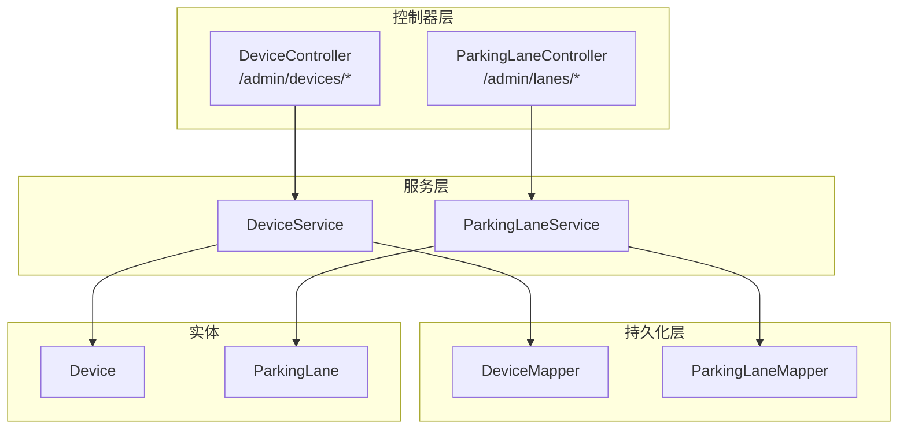
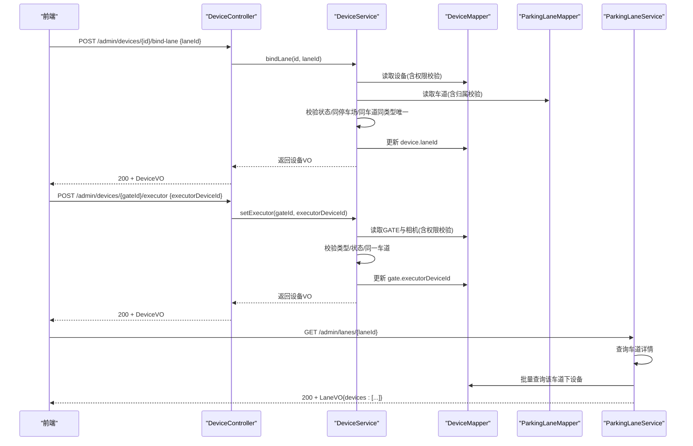
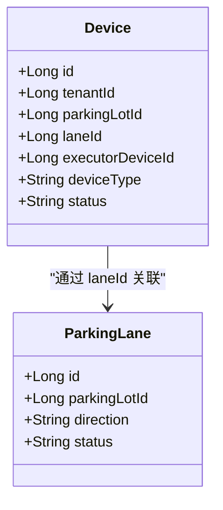
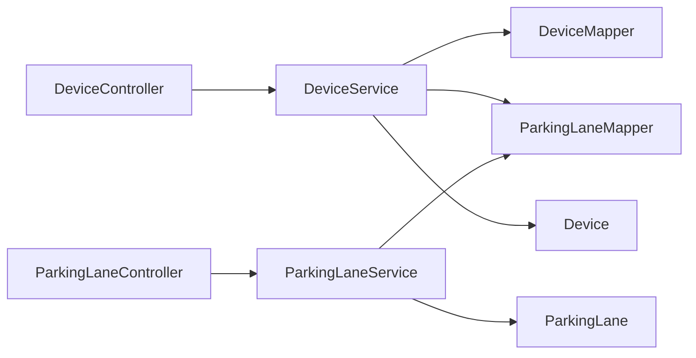

# 车道绑定管理接口

<cite>
**本文引用的文件**   
- [DeviceController.java](file://parking-system/src/main/java/com/jushan/system/controller/DeviceController.java)
- [DeviceService.java](file://parking-system/src/main/java/com/jushan/system/service/DeviceService.java)
- [ParkingLaneController.java](file://parking-system/src/main/java/com/jushan/system/controller/ParkingLaneController.java)
- [ParkingLaneService.java](file://parking-system/src/main/java/com/jushan/system/service/ParkingLaneService.java)
- [Device.java](file://parking-system/src/main/java/com/jushan/system/entity/Device.java)
- [ParkingLane.java](file://parking-system/src/main/java/com/jushan/system/entity/ParkingLane.java)
- [LaneDeviceBindingIntegrationTest.java](file://parking-boot/src/test/java/com/jushan/boot/controller/LaneDeviceBindingIntegrationTest.java)
</cite>

## 目录
1. [简介](#简介)
2. [项目结构](#项目结构)
3. [核心组件](#核心组件)
4. [架构总览](#架构总览)
5. [详细组件分析](#详细组件分析)
6. [依赖关系分析](#依赖关系分析)
7. [性能与一致性](#性能与一致性)
8. [故障排查指南](#故障排查指南)
9. [结论](#结论)
10. [附录：API 规范](#附录api-规范)

## 简介
本文件面向“设备与车道绑定”的运营管理能力，覆盖以下能力：
- 将设备（相机 CAMERA、道闸 GATE）绑定到指定车道
- 将设备从车道解绑
- 为逻辑道闸（GATE）设置执行相机（CAMERA）
- 绑定关系的业务规则与数据一致性保证
- 权限控制与错误处理机制
- 请求示例与响应格式约定

## 项目结构
与车道绑定相关的后端实现位于 parking-system 模块，控制器与服务层分离；前端在 admin-web 中提供调用封装。关键路径如下：
- 设备控制器：/admin/devices/*
- 车道控制器：/admin/lanes/*
- 服务层：DeviceService、ParkingLaneService
- 实体模型：Device、ParkingLane

图表来源
- [DeviceController.java:130-183](file://parking-system/src/main/java/com/jushan/system/controller/DeviceController.java#L130-L183)
- [ParkingLaneController.java:32-121](file://parking-system/src/main/java/com/jushan/system/controller/ParkingLaneController.java#L32-L121)
- [DeviceService.java:406-560](file://parking-system/src/main/java/com/jushan/system/service/DeviceService.java#L406-L560)
- [ParkingLaneService.java:233-289](file://parking-system/src/main/java/com/jushan/system/service/ParkingLaneService.java#L233-L289)
- [Device.java:27-133](file://parking-system/src/main/java/com/jushan/system/entity/Device.java#L27-L133)
- [ParkingLane.java:16-92](file://parking-system/src/main/java/com/jushan/system/entity/ParkingLane.java#L16-L92)

章节来源
- [DeviceController.java:130-183](file://parking-system/src/main/java/com/jushan/system/controller/DeviceController.java#L130-L183)
- [ParkingLaneController.java:32-121](file://parking-system/src/main/java/com/jushan/system/controller/ParkingLaneController.java#L32-L121)
- [DeviceService.java:406-560](file://parking-system/src/main/java/com/jushan/system/service/DeviceService.java#L406-L560)
- [ParkingLaneService.java:233-289](file://parking-system/src/main/java/com/jushan/system/service/ParkingLaneService.java#L233-L289)
- [Device.java:27-133](file://parking-system/src/main/java/com/jushan/system/entity/Device.java#L27-L133)
- [ParkingLane.java:16-92](file://parking-system/src/main/java/com/jushan/system/entity/ParkingLane.java#L16-L92)

## 核心组件
- DeviceController：暴露设备相关 HTTP 接口，包含绑定、解绑、设置执行相机等端点，并声明权限注解。
- DeviceService：实现绑定/解绑/设置执行相机的业务校验与事务更新，确保同停车场、同车道类型唯一、状态启用等约束。
- ParkingLaneController / ParkingLaneService：提供车道 CRUD 与详情查询（含绑定设备列表），用于绑定前选择目标车道与绑定后查看结果。
- Device / ParkingLane：设备与车道的数据模型，其中 Device.laneId 表示绑定关系，Device.executorDeviceId 表示 GATE 的执行相机。

章节来源
- [DeviceController.java:130-183](file://parking-system/src/main/java/com/jushan/system/controller/DeviceController.java#L130-L183)
- [DeviceService.java:406-560](file://parking-system/src/main/java/com/jushan/system/service/DeviceService.java#L406-L560)
- [ParkingLaneController.java:32-121](file://parking-system/src/main/java/com/jushan/system/controller/ParkingLaneController.java#L32-L121)
- [ParkingLaneService.java:233-289](file://parking-system/src/main/java/com/jushan/system/service/ParkingLaneService.java#L233-L289)
- [Device.java:27-133](file://parking-system/src/main/java/com/jushan/system/entity/Device.java#L27-L133)
- [ParkingLane.java:16-92](file://parking-system/src/main/java/com/jushan/system/entity/ParkingLane.java#L16-L92)

## 架构总览
下图展示一次“绑定设备到车道 + 设置执行相机”的典型调用链与数据流向。

图表来源
- [DeviceController.java:130-183](file://parking-system/src/main/java/com/jushan/system/controller/DeviceController.java#L130-L183)
- [DeviceService.java:406-560](file://parking-system/src/main/java/com/jushan/system/service/DeviceService.java#L406-L560)
- [ParkingLaneService.java:233-289](file://parking-system/src/main/java/com/jushan/system/service/ParkingLaneService.java#L233-L289)

## 详细组件分析

### 设备绑定到车道
- 接口
  - 方法：POST
  - 路径：/admin/devices/{id}/bind-lane
  - 权限：device:manage
  - 请求体：{"laneId": 数字}
  - 响应：R.ok(DeviceVO)
- 业务规则
  - 设备必须处于启用状态
  - 车道必须存在且启用
  - 设备与车道必须属于同一停车场
  - 同一车道内，同类型设备唯一（排除自身）
  - 若设备类型为 GATE，绑定后自动清空旧的 executorDeviceId（需重新指定）
- 错误处理
  - 参数缺失或非法：返回统一失败码与消息
  - 业务冲突（重复绑定、跨停车场、停用状态等）：抛出业务异常，由全局异常处理器转换为 R.fail(...)
- 参考实现位置
  - 控制器：[DeviceController.java:140-150](file://parking-system/src/main/java/com/jushan/system/controller/DeviceController.java#L140-L150)
  - 服务层：[DeviceService.java:418-478](file://parking-system/src/main/java/com/jushan/system/service/DeviceService.java#L418-L478)

章节来源
- [DeviceController.java:140-150](file://parking-system/src/main/java/com/jushan/system/controller/DeviceController.java#L140-L150)
- [DeviceService.java:418-478](file://parking-system/src/main/java/com/jushan/system/service/DeviceService.java#L418-L478)

### 设备从车道解绑
- 接口
  - 方法：DELETE
  - 路径：/admin/devices/{id}/bind-lane
  - 权限：device:manage
  - 请求体：无
  - 响应：R.ok(DeviceVO)
- 业务规则
  - 若设备未绑定车道，直接返回当前设备信息
  - 解绑时同时清空 laneId 与 executorDeviceId
- 参考实现位置
  - 控制器：[DeviceController.java:157-163](file://parking-system/src/main/java/com/jushan/system/controller/DeviceController.java#L157-L163)
  - 服务层：[DeviceService.java:486-509](file://parking-system/src/main/java/com/jushan/system/service/DeviceService.java#L486-L509)

章节来源
- [DeviceController.java:157-163](file://parking-system/src/main/java/com/jushan/system/controller/DeviceController.java#L157-L163)
- [DeviceService.java:486-509](file://parking-system/src/main/java/com/jushan/system/service/DeviceService.java#L486-L509)

### 为 GATE 设备设置执行相机
- 接口
  - 方法：POST
  - 路径：/admin/devices/{id}/executor
  - 权限：device:manage
  - 请求体：{"executorDeviceId": 数字}
  - 响应：R.ok(DeviceVO)
- 业务规则
  - 仅 GATE 类型设备可设置执行相机
  - 执行设备必须是 CAMERA 类型且处于启用状态
  - GATE 与执行相机必须已绑定到同一车道
- 参考实现位置
  - 控制器：[DeviceController.java:173-183](file://parking-system/src/main/java/com/jushan/system/controller/DeviceController.java#L173-L183)
  - 服务层：[DeviceService.java:521-560](file://parking-system/src/main/java/com/jushan/system/service/DeviceService.java#L521-L560)

章节来源
- [DeviceController.java:173-183](file://parking-system/src/main/java/com/jushan/system/controller/DeviceController.java#L173-L183)
- [DeviceService.java:521-560](file://parking-system/src/main/java/com/jushan/system/service/DeviceService.java#L521-L560)

### 车道详情（含绑定设备）
- 接口
  - 方法：GET
  - 路径：/admin/lanes/{id}
  - 权限：parking:read
  - 响应：R.ok(ParkingLaneVO)，其中 devices 字段为该车道下所有绑定设备的列表
- 参考实现位置
  - 控制器：[ParkingLaneController.java:71-76](file://parking-system/src/main/java/com/jushan/system/controller/ParkingLaneController.java#L71-L76)
  - 服务层：[ParkingLaneService.java:284-289](file://parking-system/src/main/java/com/jushan/system/service/ParkingLaneService.java#L284-L289)

章节来源
- [ParkingLaneController.java:71-76](file://parking-system/src/main/java/com/jushan/system/controller/ParkingLaneController.java#L71-L76)
- [ParkingLaneService.java:284-289](file://parking-system/src/main/java/com/jushan/system/service/ParkingLaneService.java#L284-L289)

### 数据模型与关系
- Device
  - laneId：设备绑定的车道 ID
  - executorDeviceId：GATE 的执行相机设备 ID（仅 GATE 使用）
- ParkingLane
  - 基础属性：名称、编码、方向、状态、是否关键车道、自动放行策略等

图表来源
- [Device.java:27-133](file://parking-system/src/main/java/com/jushan/system/entity/Device.java#L27-L133)
- [ParkingLane.java:16-92](file://parking-system/src/main/java/com/jushan/system/entity/ParkingLane.java#L16-L92)

## 依赖关系分析
- 控制器依赖服务层完成业务校验与持久化
- 服务层依赖 Mapper 访问数据库，并通过 ParkingLotScopeResolver 进行租户与停车场级授权校验
- 绑定/解绑/设置执行相机均使用 @Transactional 保证原子性

图表来源
- [DeviceController.java:130-183](file://parking-system/src/main/java/com/jushan/system/controller/DeviceController.java#L130-L183)
- [ParkingLaneController.java:32-121](file://parking-system/src/main/java/com/jushan/system/controller/ParkingLaneController.java#L32-L121)
- [DeviceService.java:406-560](file://parking-system/src/main/java/com/jushan/system/service/DeviceService.java#L406-L560)
- [ParkingLaneService.java:233-289](file://parking-system/src/main/java/com/jushan/system/service/ParkingLaneService.java#L233-L289)

## 性能与一致性
- 事务边界：绑定、解绑、设置执行相机均在事务中执行，避免部分成功导致的数据不一致
- 并发安全：
  - 同车道同类型设备唯一性通过查询计数校验，建议在数据库层增加唯一索引以强化约束
  - 状态变更采用条件更新防止覆盖（如启用/停用），绑定场景建议对 laneId 写入加乐观锁或唯一约束
- 查询优化：车道详情会批量加载绑定设备，减少 N+1 查询开销

章节来源
- [DeviceService.java:418-478](file://parking-system/src/main/java/com/jushan/system/service/DeviceService.java#L418-L478)
- [ParkingLaneService.java:233-289](file://parking-system/src/main/java/com/jushan/system/service/ParkingLaneService.java#L233-L289)

## 故障排查指南
- 常见错误
  - 设备或车道不存在：检查 ID 是否正确、是否属于当前租户/停车场
  - 设备/车道已停用：先启用后再操作
  - 重复绑定：同一车道同类型设备唯一，需更换车道或设备
  - 非 GATE 设置执行相机：仅 GATE 可设置执行相机
  - 执行相机与 GATE 不在同一车道：请先将两者绑定到同一车道
- 定位手段
  - 查看控制器日志输出（绑定/解绑/设置执行相机均有日志）
  - 查看服务层抛出的业务异常消息
  - 通过车道详情接口确认当前绑定情况

章节来源
- [DeviceController.java:140-183](file://parking-system/src/main/java/com/jushan/system/controller/DeviceController.java#L140-L183)
- [DeviceService.java:418-560](file://parking-system/src/main/java/com/jushan/system/service/DeviceService.java#L418-L560)

## 结论
车道绑定管理接口围绕“设备-车道”关系展开，结合严格的权限与业务校验，确保：
- 同停车场、同车道、同类型唯一
- GATE 与执行相机在同一车道
- 解绑时清理关联执行关系
- 通过事务保障数据一致性

## 附录：API 规范

### 通用约定
- 基础路径
  - 设备：/admin/devices
  - 车道：/admin/lanes
- 认证与鉴权
  - 请求头携带 Authorization: Bearer <token>
  - 设备相关写操作需要权限 device:manage
  - 车道读操作需要权限 parking:read
- 统一响应
  - 成功：HTTP 200，body.code=200，data 为具体对象
  - 失败：HTTP 200，body.code≠200，message 描述错误原因

### 绑定设备到车道
- 请求
  - 方法：POST
  - 路径：/admin/devices/{id}/bind-lane
  - 请求体：{"laneId": 数字}
- 成功响应
  - data: DeviceVO（包含 id、name、code、deviceType、status、laneId、executorDeviceId 等）
- 失败示例
  - code: 1000，message: "车道 ID 不能为空"
  - code: 业务错误码，message: "该车道已绑定了一台 CAMERA 设备，不允许重复绑定"

章节来源
- [DeviceController.java:140-150](file://parking-system/src/main/java/com/jushan/system/controller/DeviceController.java#L140-L150)
- [DeviceService.java:418-478](file://parking-system/src/main/java/com/jushan/system/service/DeviceService.java#L418-L478)
- [LaneDeviceBindingIntegrationTest.java:132-170](file://parking-boot/src/test/java/com/jushan/boot/controller/LaneDeviceBindingIntegrationTest.java#L132-L170)

### 解绑设备
- 请求
  - 方法：DELETE
  - 路径：/admin/devices/{id}/bind-lane
- 成功响应
  - data: DeviceVO（laneId 与 executorDeviceId 均为 null）
- 失败示例
  - 未绑定：直接返回当前设备信息（不报错）

章节来源
- [DeviceController.java:157-163](file://parking-system/src/main/java/com/jushan/system/controller/DeviceController.java#L157-L163)
- [DeviceService.java:486-509](file://parking-system/src/main/java/com/jushan/system/service/DeviceService.java#L486-L509)
- [LaneDeviceBindingIntegrationTest.java:174-209](file://parking-boot/src/test/java/com/jushan/boot/controller/LaneDeviceBindingIntegrationTest.java#L174-L209)

### 设置执行相机（仅 GATE）
- 请求
  - 方法：POST
  - 路径：/admin/devices/{id}/executor
  - 请求体：{"executorDeviceId": 数字}
- 成功响应
  - data: DeviceVO（executorDeviceId 指向相机）
- 失败示例
  - code: 1000，message: "执行设备 ID 不能为空"
  - code: 业务错误码，message: "仅逻辑道闸（GATE）设备需要设置执行相机"
  - code: 业务错误码，message: "执行设备必须是相机（CAMERA）类型"
  - code: 业务错误码，message: "GATE 设备与执行相机必须绑定到同一车道"

章节来源
- [DeviceController.java:173-183](file://parking-system/src/main/java/com/jushan/system/controller/DeviceController.java#L173-L183)
- [DeviceService.java:521-560](file://parking-system/src/main/java/com/jushan/system/service/DeviceService.java#L521-L560)
- [LaneDeviceBindingIntegrationTest.java:132-170](file://parking-boot/src/test/java/com/jushan/boot/controller/LaneDeviceBindingIntegrationTest.java#L132-L170)
- [LaneDeviceBindingIntegrationTest.java:321-335](file://parking-boot/src/test/java/com/jushan/boot/controller/LaneDeviceBindingIntegrationTest.java#L321-L335)

### 查询车道详情（含绑定设备）
- 请求
  - 方法：GET
  - 路径：/admin/lanes/{id}
- 成功响应
  - data: ParkingLaneVO，包含 devices 数组（该车道下的设备列表）

章节来源
- [ParkingLaneController.java:71-76](file://parking-system/src/main/java/com/jushan/system/controller/ParkingLaneController.java#L71-L76)
- [ParkingLaneService.java:284-289](file://parking-system/src/main/java/com/jushan/system/service/ParkingLaneService.java#L284-L289)
- [LaneDeviceBindingIntegrationTest.java:339-344](file://parking-boot/src/test/java/com/jushan/boot/controller/LaneDeviceBindingIntegrationTest.java#L339-L344)