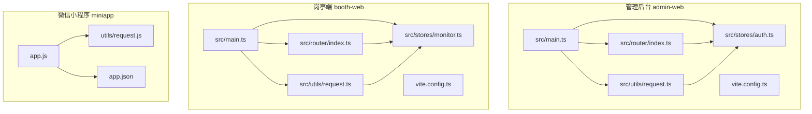
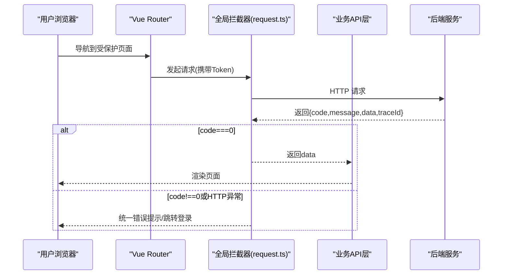
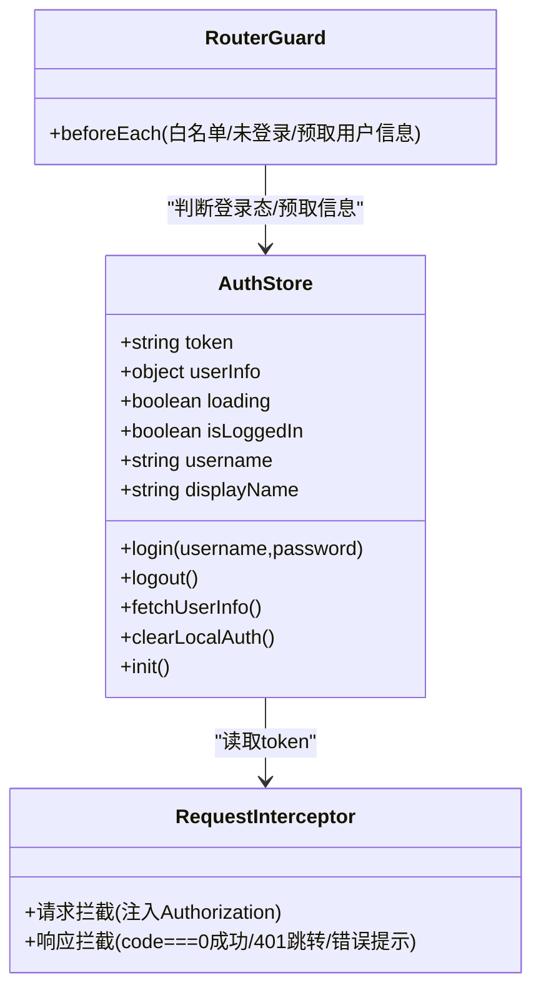
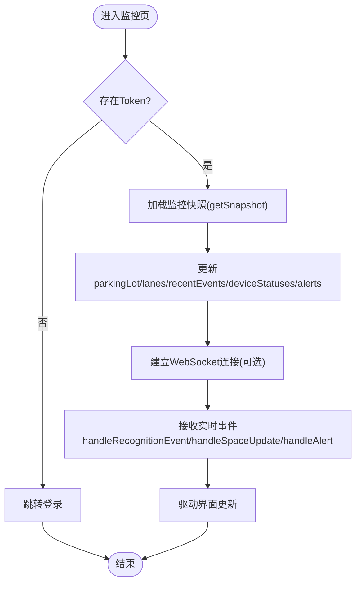
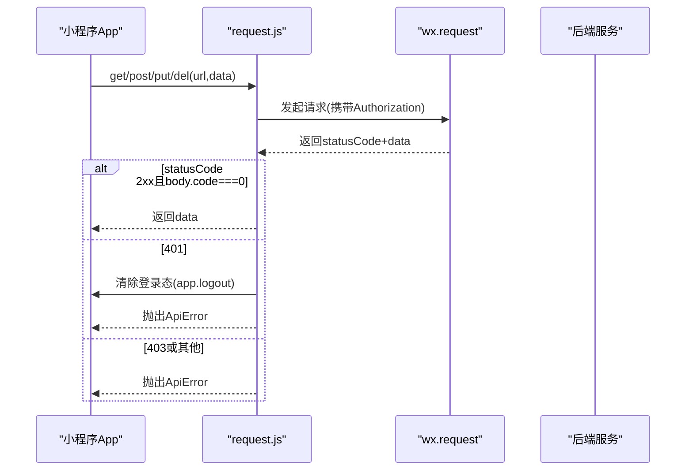
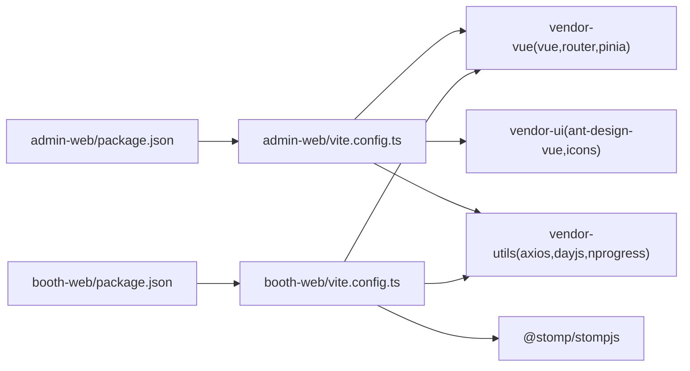

# 前端应用设计

<cite>
**本文引用的文件**   
- [README.md](file://README.md)
- [admin-web/package.json](file://admin-web/package.json)
- [admin-web/tsconfig.json](file://admin-web/tsconfig.json)
- [admin-web/vite.config.ts](file://admin-web/vite.config.ts)
- [admin-web/src/main.ts](file://admin-web/src/main.ts)
- [admin-web/src/router/index.ts](file://admin-web/src/router/index.ts)
- [admin-web/src/stores/auth.ts](file://admin-web/src/stores/auth.ts)
- [admin-web/src/utils/request.ts](file://admin-web/src/utils/request.ts)
- [booth-web/package.json](file://booth-web/package.json)
- [booth-web/tsconfig.json](file://booth-web/tsconfig.json)
- [booth-web/vite.config.ts](file://booth-web/vite.config.ts)
- [booth-web/src/main.ts](file://booth-web/src/main.ts)
- [booth-web/src/router/index.ts](file://booth-web/src/router/index.ts)
- [booth-web/src/stores/monitor.ts](file://booth-web/src/stores/monitor.ts)
- [booth-web/src/utils/request.ts](file://booth-web/src/utils/request.ts)
- [miniapp/app.js](file://miniapp/app.js)
- [miniapp/app.json](file://miniapp/app.json)
- [miniapp/utils/request.js](file://miniapp/utils/request.js)
- [T02-架构模块与前端工程方案冻结.md](file://docs/归档/平台侧/T02-架构模块与前端工程方案冻结.md)
</cite>

## 目录
1. [引言](#引言)
2. [项目结构](#项目结构)
3. [核心组件](#核心组件)
4. [架构总览](#架构总览)
5. [详细组件分析](#详细组件分析)
6. [依赖分析](#依赖分析)
7. [性能考虑](#性能考虑)
8. [故障排查指南](#故障排查指南)
9. [结论](#结论)
10. [附录](#附录)

## 引言
本设计文档聚焦于智慧停车 SaaS 平台的前端应用，覆盖管理后台（admin-web）、岗亭端（booth-web）和微信小程序（miniapp）。技术栈统一采用 Vue3 + TypeScript + Vite + Pinia + Vue Router，UI 使用 Ant Design Vue。文档从系统架构、组件关系、数据流、处理逻辑、集成点、错误处理、性能特性等维度进行系统化说明，并提供开发环境搭建、构建配置与部署流程建议，以及性能优化、缓存策略与用户体验改进实践。

## 项目结构
仓库包含三个独立前端工程：
- admin-web：管理后台，承载多租户、停车场、车道、设备、员工、审计日志、收费规则、代理管理等业务页面，具备路由守卫与全局状态管理。
- booth-web：岗亭端，提供实时监控、告警处置、设备状态查看等能力，支持 WebSocket 实时推送。
- miniapp：微信小程序车主端，提供登录态恢复、基础页面与 API 调用封装。

图表来源
- [admin-web/src/main.ts:1-20](file://admin-web/src/main.ts#L1-L20)
- [admin-web/src/router/index.ts:1-134](file://admin-web/src/router/index.ts#L1-L134)
- [admin-web/src/stores/auth.ts:1-103](file://admin-web/src/stores/auth.ts#L1-L103)
- [admin-web/src/utils/request.ts:1-175](file://admin-web/src/utils/request.ts#L1-L175)
- [booth-web/src/main.ts:1-16](file://booth-web/src/main.ts#L1-L16)
- [booth-web/src/router/index.ts:1-64](file://booth-web/src/router/index.ts#L1-L64)
- [booth-web/src/stores/monitor.ts:1-157](file://booth-web/src/stores/monitor.ts#L1-L157)
- [booth-web/src/utils/request.ts:1-152](file://booth-web/src/utils/request.ts#L1-L152)
- [miniapp/app.js:1-55](file://miniapp/app.js#L1-L55)
- [miniapp/app.json:1-37](file://miniapp/app.json#L1-L37)
- [miniapp/utils/request.js:1-178](file://miniapp/utils/request.js#L1-L178)

章节来源
- [README.md:1-77](file://README.md#L1-L77)
- [T02-架构模块与前端工程方案冻结.md:347-381](file://docs/归档/平台侧/T02-架构模块与前端工程方案冻结.md#L347-L381)

## 核心组件
- 应用初始化与插件装配
  - 管理后台与岗亭端均通过 createApp 创建实例，注册 Pinia、Router、Ant Design Vue，并挂载根组件。
  - 管理后台在启动时主动恢复认证状态，确保刷新后保持登录态。
- 路由与权限控制
  - 管理后台定义常量路由表，包含登录、布局及多个业务子路由；通过 beforeEach 实现白名单校验、未登录跳转与信息预取。
  - 岗亭端定义登录与监控页路由，基于本地 Token 的守卫实现访问控制。
- 状态管理（Pinia）
  - 管理后台 auth store 负责 token 持久化、用户信息获取、退出清理与初始化恢复。
  - 岗亭端 monitor store 维护监控快照、事件列表、设备状态与告警，并提供处理函数以响应实时更新。
- 网络请求封装
  - 管理后台与岗亭端分别封装 axios 实例，统一注入 Authorization、进度条、错误提示、401 处理与防重复跳转。
  - 小程序封装 wx.request，自动注入 Token、统一错误对象与 401/403 分支处理。

章节来源
- [admin-web/src/main.ts:1-20](file://admin-web/src/main.ts#L1-L20)
- [admin-web/src/router/index.ts:1-134](file://admin-web/src/router/index.ts#L1-L134)
- [admin-web/src/stores/auth.ts:1-103](file://admin-web/src/stores/auth.ts#L1-L103)
- [admin-web/src/utils/request.ts:1-175](file://admin-web/src/utils/request.ts#L1-L175)
- [booth-web/src/main.ts:1-16](file://booth-web/src/main.ts#L1-L16)
- [booth-web/src/router/index.ts:1-64](file://booth-web/src/router/index.ts#L1-L64)
- [booth-web/src/stores/monitor.ts:1-157](file://booth-web/src/stores/monitor.ts#L1-L157)
- [booth-web/src/utils/request.ts:1-152](file://booth-web/src/utils/request.ts#L1-L152)
- [miniapp/app.js:1-55](file://miniapp/app.js#L1-L55)
- [miniapp/utils/request.js:1-178](file://miniapp/utils/request.js#L1-L178)

## 架构总览
前后端通信模式
- Web 端（管理后台/岗亭端）：HTTP REST 为主，WebSocket 用于实时推送（岗亭端）。
- 小程序端：HTTP REST 为主，遵循统一的响应契约（code===0 成功、message、traceId 保留）。

图表来源
- [admin-web/src/router/index.ts:108-131](file://admin-web/src/router/index.ts#L108-L131)
- [admin-web/src/utils/request.ts:28-156](file://admin-web/src/utils/request.ts#L28-L156)
- [booth-web/src/utils/request.ts:46-152](file://booth-web/src/utils/request.ts#L46-L152)
- [miniapp/utils/request.js:44-124](file://miniapp/utils/request.js#L44-L124)

## 详细组件分析

### 管理后台（admin-web）
- 入口与插件
  - 创建应用实例，注册 Pinia、Router、Antd，并在启动时初始化认证状态。
- 路由与守卫
  - 常量路由表集中管理登录、布局与业务子路由；beforeEach 实现白名单、未登录跳转与用户信息预取。
- 认证状态（auth store）
  - 提供 login、logout、fetchUserInfo、init、clearLocalAuth 等方法；token 写入前做非空校验；401 场景仅清理本地状态避免递归。
- 请求封装（request.ts）
  - 统一 baseURL、超时、Content-Type；请求拦截注入 Authorization；响应拦截按 code===0 判定成功，401 触发清理与跳转，其他错误展示 message 并抛出 ApiError。

图表来源
- [admin-web/src/stores/auth.ts:1-103](file://admin-web/src/stores/auth.ts#L1-L103)
- [admin-web/src/utils/request.ts:1-175](file://admin-web/src/utils/request.ts#L1-L175)
- [admin-web/src/router/index.ts:1-134](file://admin-web/src/router/index.ts#L1-L134)

章节来源
- [admin-web/src/main.ts:1-20](file://admin-web/src/main.ts#L1-L20)
- [admin-web/src/router/index.ts:1-134](file://admin-web/src/router/index.ts#L1-L134)
- [admin-web/src/stores/auth.ts:1-103](file://admin-web/src/stores/auth.ts#L1-L103)
- [admin-web/src/utils/request.ts:1-175](file://admin-web/src/utils/request.ts#L1-L175)

### 岗亭端（booth-web）
- 入口与插件
  - 创建应用实例，注册 Pinia、Router、Antd，挂载根组件。
- 路由与守卫
  - 定义登录与监控页路由；beforeEach 基于本地 Token 进行访问控制。
- 监控状态（monitor store）
  - 维护当前停车场、车道、最近事件、设备状态、告警等；提供加载快照、处理空间更新、识别事件、设备状态、告警、确认告警、刷新设备等动作。
- 请求封装（request.ts）
  - 与后台一致：统一 baseURL、超时、Content-Type；请求拦截注入 Authorization；响应拦截按 code===0 判定成功，401 清理本地状态并跳转，错误提示与抛出 ApiError。

图表来源
- [booth-web/src/router/index.ts:37-61](file://booth-web/src/router/index.ts#L37-L61)
- [booth-web/src/stores/monitor.ts:41-104](file://booth-web/src/stores/monitor.ts#L41-L104)
- [booth-web/src/utils/request.ts:46-152](file://booth-web/src/utils/request.ts#L46-L152)

章节来源
- [booth-web/src/main.ts:1-16](file://booth-web/src/main.ts#L1-L16)
- [booth-web/src/router/index.ts:1-64](file://booth-web/src/router/index.ts#L1-L64)
- [booth-web/src/stores/monitor.ts:1-157](file://booth-web/src/stores/monitor.ts#L1-L157)
- [booth-web/src/utils/request.ts:1-152](file://booth-web/src/utils/request.ts#L1-L152)

### 微信小程序（miniapp）
- 应用生命周期
  - onLaunch 中获取系统信息、计算导航栏高度；从本地存储恢复 token 与 ownerInfo，兼容旧字段迁移。
- 全局配置
  - app.json 定义页面路由、窗口样式、tabBar 与 sitemap 位置。
- 请求封装（utils/request.js）
  - 基于 wx.request 的 Promise 包装；自动注入 Authorization；安全解析响应体；统一错误对象；对 401/403 与非 2xx 分支进行处理。

图表来源
- [miniapp/app.js:21-43](file://miniapp/app.js#L21-L43)
- [miniapp/app.json:1-37](file://miniapp/app.json#L1-L37)
- [miniapp/utils/request.js:44-124](file://miniapp/utils/request.js#L44-L124)

章节来源
- [miniapp/app.js:1-55](file://miniapp/app.js#L1-L55)
- [miniapp/app.json:1-37](file://miniapp/app.json#L1-L37)
- [miniapp/utils/request.js:1-178](file://miniapp/utils/request.js#L1-L178)

## 依赖分析
- 包管理与脚本
  - 管理后台与岗亭端均使用 Vite 作为构建工具，TypeScript 编译，Ant Design Vue 作为 UI 库，axios 作为 HTTP 客户端，dayjs 时间处理，nprogress 进度条。
  - 岗亭端额外引入 @stomp/stompjs 用于 WebSocket 通信。
- 构建与分包
  - 管理后台与岗亭端均在 vite.config.ts 中配置 alias、dev server proxy、scss 全局变量注入与手动分包（vendor-vue、vendor-ui/vendor-utils），以提升首屏与缓存命中率。

图表来源
- [admin-web/package.json:1-38](file://admin-web/package.json#L1-L38)
- [booth-web/package.json:1-35](file://booth-web/package.json#L1-L35)
- [admin-web/vite.config.ts:47-58](file://admin-web/vite.config.ts#L47-L58)
- [booth-web/vite.config.ts:35-46](file://booth-web/vite.config.ts#L35-L46)

章节来源
- [admin-web/package.json:1-38](file://admin-web/package.json#L1-L38)
- [booth-web/package.json:1-35](file://booth-web/package.json#L1-L35)
- [admin-web/vite.config.ts:1-59](file://admin-web/vite.config.ts#L1-L59)
- [booth-web/vite.config.ts:1-46](file://booth-web/vite.config.ts#L1-L46)

## 性能考虑
- 构建优化
  - 手动分包：将 vue/vue-router/pinia 与 UI 库、工具库拆分，提升缓存命中与并行加载效率。
  - SCSS 全局变量注入：减少重复导入，提升编译速度。
- 运行时优化
  - 懒加载路由：通过动态 import 按需加载页面组件，降低首屏体积。
  - 进度反馈：nprogress 提升交互感知。
  - 防重复 401 跳转：避免并发请求导致的多次跳转与状态抖动。
- 缓存策略
  - 本地存储 Token 与用户信息，应用启动时恢复登录态。
  - 小程序端兼容旧字段迁移，减少一次性全量刷新带来的体验问题。
- 可访问性与响应式
  - 使用 Ant Design Vue 提供的无障碍支持与响应式组件；建议在业务组件中补充语义化标签与键盘导航支持。

[本节为通用指导，不直接分析具体文件]

## 故障排查指南
- 401 未登录或过期
  - Web 端：请求拦截器会清理本地状态并跳转登录页；注意防止登录接口 401 误触发跳转。
  - 小程序端：401 会调用全局 logout 清理本地状态并抛出错误。
- 403 无权限
  - 统一提示“没有权限访问”，不清理 Token，由上层根据业务逻辑决定后续行为。
- 404 资源不存在
  - 统一提示“请求资源不存在”。
- 500 服务器内部错误
  - 若响应中包含 traceId，则提示附带 traceId，便于定位问题。
- 网络连接失败
  - 统一提示“网络连接失败，请检查网络”。

章节来源
- [admin-web/src/utils/request.ts:68-156](file://admin-web/src/utils/request.ts#L68-L156)
- [booth-web/src/utils/request.ts:64-152](file://booth-web/src/utils/request.ts#L64-L152)
- [miniapp/utils/request.js:82-134](file://miniapp/utils/request.js#L82-L134)

## 结论
本项目采用统一的前端技术栈与工程规范，管理后台与岗亭端共享相似的路由、状态管理与网络封装模式，小程序端遵循一致的响应契约。通过合理的分包、懒加载与错误处理策略，兼顾了性能与用户体验。后续可在组件复用、主题定制、国际化与可访问性方面持续完善。

[本节为总结性内容，不直接分析具体文件]

## 附录
- 开发环境搭建
  - 安装 pnpm 与 Node.js，进入各前端工程执行依赖安装与开发命令。
  - 管理后台默认端口 3000，岗亭端默认端口 3001，开发代理转发 /api 至后端 8080。
- 构建与预览
  - 使用 build 脚本进行类型检查与打包，preview 用于本地预览生产产物。
- 部署流程
  - 将构建产物部署至静态资源服务器或 Nginx；根据环境变量调整 API 基础地址与 WebSocket 代理。
- 设计规范与样式组织
  - 使用 SCSS 变量统一管理主题色与尺寸；在 vite.config.ts 中通过 additionalData 注入全局变量。
- 用户体验改进
  - 增加骨架屏与错误重试机制；对关键操作添加二次确认与操作日志记录。

[本节为通用指导，不直接分析具体文件]