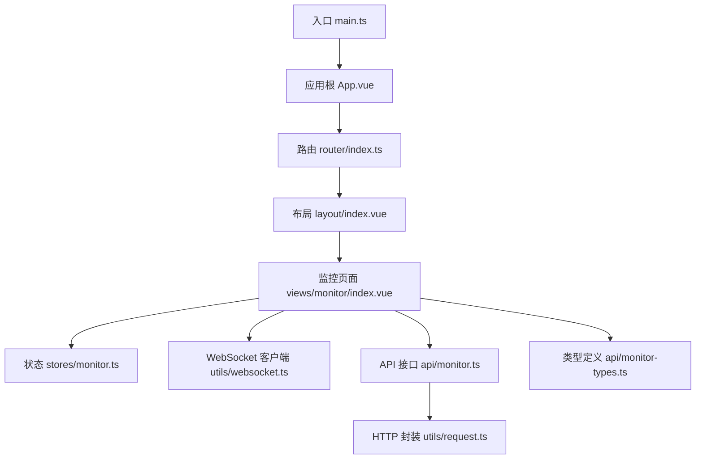
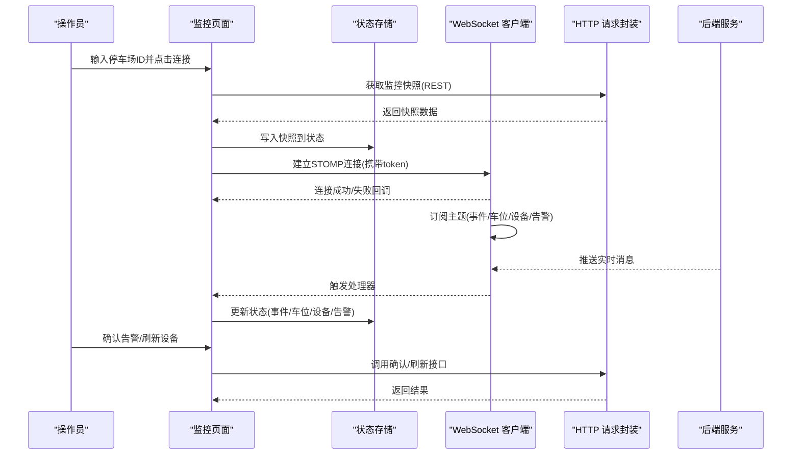
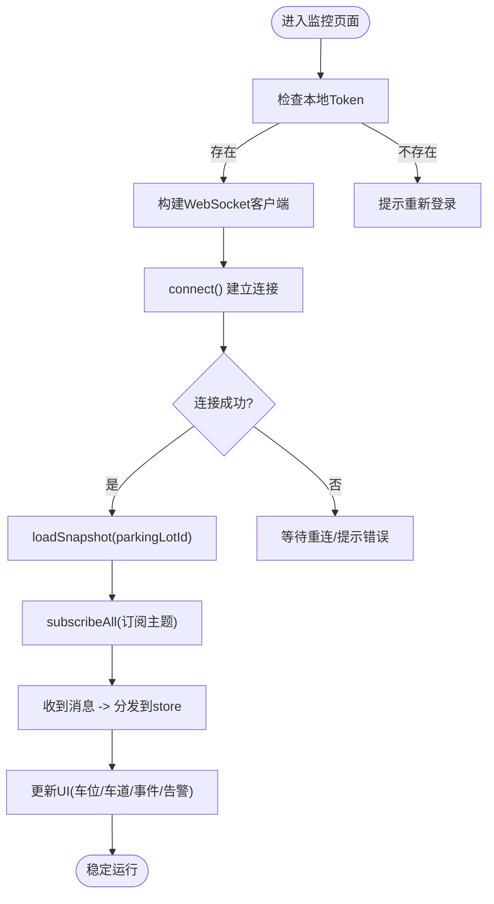
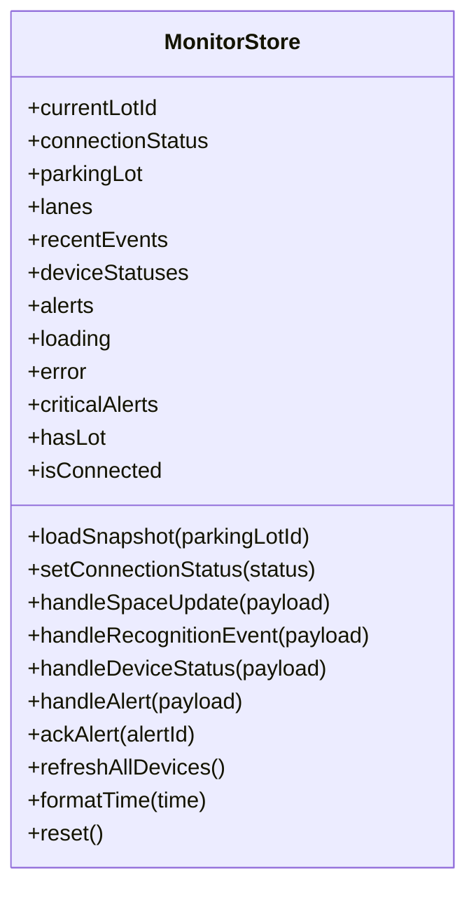
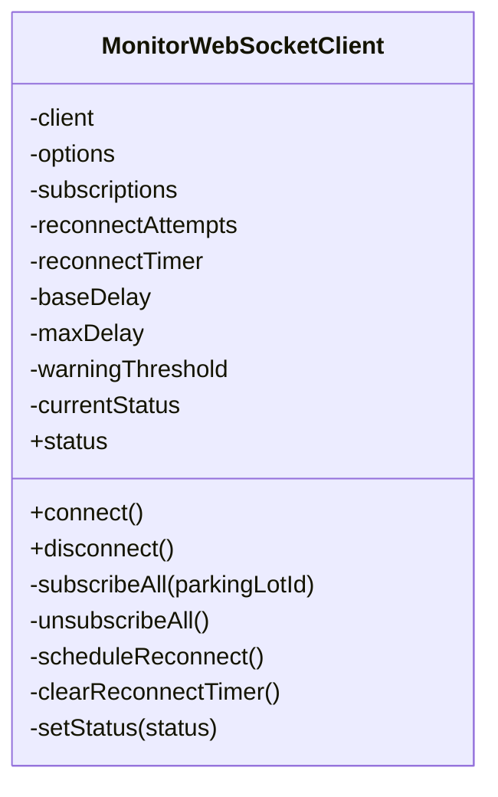
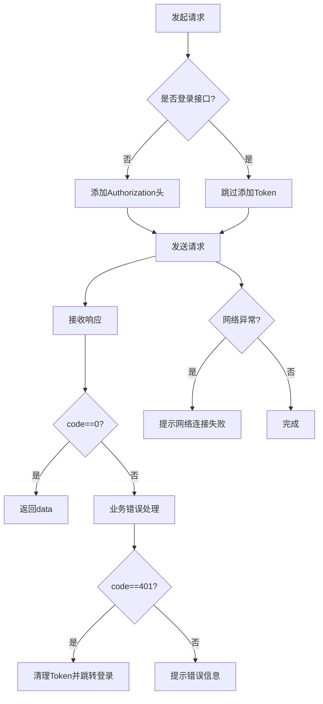
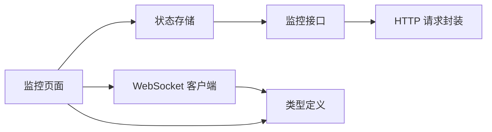

# 岗亭端前端

<cite>
**本文引用的文件**
- [booth-web/src/main.ts](file://booth-web/src/main.ts)
- [booth-web/src/App.vue](file://booth-web/src/App.vue)
- [booth-web/src/router/index.ts](file://booth-web/src/router/index.ts)
- [booth-web/src/layout/index.vue](file://booth-web/src/layout/index.vue)
- [booth-web/src/views/monitor/index.vue](file://booth-web/src/views/monitor/index.vue)
- [booth-web/src/stores/monitor.ts](file://booth-web/src/stores/monitor.ts)
- [booth-web/src/utils/websocket.ts](file://booth-web/src/utils/websocket.ts)
- [booth-web/src/api/monitor.ts](file://booth-web/src/api/monitor.ts)
- [booth-web/src/api/auth.ts](file://booth-web/src/api/auth.ts)
- [booth-web/src/api/monitor-types.ts](file://booth-web/src/api/monitor-types.ts)
- [booth-web/src/utils/request.ts](file://booth-web/src/utils/request.ts)
- [booth-web/package.json](file://booth-web/package.json)
</cite>

## 目录
1. [简介](#简介)
2. [项目结构](#项目结构)
3. [核心组件](#核心组件)
4. [架构总览](#架构总览)
5. [详细组件分析](#详细组件分析)
6. [依赖关系分析](#依赖关系分析)
7. [性能与大屏适配](#性能与大屏适配)
8. [操作手册](#操作手册)
9. [故障排查指南](#故障排查指南)
10. [结论](#结论)

## 简介
本文件面向停车场操作员使用的“岗亭端”前端，聚焦实时监控面板的专业界面设计与技术实现。内容涵盖：
- WebSocket 实时通信（STOMP over WebSocket）
- 设备状态监控、车道状态显示
- 与后端服务的实时数据同步机制、消息推送处理与连接管理
- 操作界面交互设计、异常处理流程
- 大屏适配、全屏模式与性能优化策略
- 操作手册、故障排查指南与最佳实践建议

## 项目结构
岗亭端采用 Vue 3 + TypeScript + Vite 工程化方案，UI 使用 Ant Design Vue，状态管理使用 Pinia，HTTP 请求封装基于 Axios，实时通信基于 STOMP over WebSocket。

图表来源
- [booth-web/src/main.ts:1-16](file://booth-web/src/main.ts#L1-L16)
- [booth-web/src/App.vue:1-30](file://booth-web/src/App.vue#L1-L30)
- [booth-web/src/router/index.ts:1-64](file://booth-web/src/router/index.ts#L1-L64)
- [booth-web/src/layout/index.vue:1-143](file://booth-web/src/layout/index.vue#L1-L143)
- [booth-web/src/views/monitor/index.vue:1-492](file://booth-web/src/views/monitor/index.vue#L1-L492)
- [booth-web/src/stores/monitor.ts:1-157](file://booth-web/src/stores/monitor.ts#L1-L157)
- [booth-web/src/utils/websocket.ts:1-182](file://booth-web/src/utils/websocket.ts#L1-L182)
- [booth-web/src/api/monitor.ts:1-18](file://booth-web/src/api/monitor.ts#L1-L18)
- [booth-web/src/api/monitor-types.ts:1-116](file://booth-web/src/api/monitor-types.ts#L1-L116)
- [booth-web/src/utils/request.ts:1-153](file://booth-web/src/utils/request.ts#L1-L153)

章节来源
- [booth-web/src/main.ts:1-16](file://booth-web/src/main.ts#L1-L16)
- [booth-web/src/App.vue:1-30](file://booth-web/src/App.vue#L1-L30)
- [booth-web/src/router/index.ts:1-64](file://booth-web/src/router/index.ts#L1-L64)
- [booth-web/src/layout/index.vue:1-143](file://booth-web/src/layout/index.vue#L1-L143)
- [booth-web/src/views/monitor/index.vue:1-492](file://booth-web/src/views/monitor/index.vue#L1-L492)
- [booth-web/src/stores/monitor.ts:1-157](file://booth-web/src/stores/monitor.ts#L1-L157)
- [booth-web/src/utils/websocket.ts:1-182](file://booth-web/src/utils/websocket.ts#L1-L182)
- [booth-web/src/api/monitor.ts:1-18](file://booth-web/src/api/monitor.ts#L1-L18)
- [booth-web/src/api/monitor-types.ts:1-116](file://booth-web/src/api/monitor-types.ts#L1-L116)
- [booth-web/src/utils/request.ts:1-153](file://booth-web/src/utils/request.ts#L1-L153)

## 核心组件
- 应用初始化与主题配置：入口挂载应用、注册插件、全局主题与国际化。
- 路由与鉴权守卫：登录白名单、Token 校验与跳转控制。
- 布局组件：顶部栏、在线状态指示、刷新与退出登录。
- 监控页面：车位大卡、车道网格、最近识别事件列表、异常提醒列表。
- 状态管理：快照加载、WebSocket 消息分发、告警确认、设备刷新。
- WebSocket 客户端：自动重连、指数退避、订阅恢复、心跳保活。
- HTTP 请求封装：统一拦截器、错误提示、401 处理、进度条。

章节来源
- [booth-web/src/main.ts:1-16](file://booth-web/src/main.ts#L1-L16)
- [booth-web/src/App.vue:1-30](file://booth-web/src/App.vue#L1-L30)
- [booth-web/src/router/index.ts:1-64](file://booth-web/src/router/index.ts#L1-L64)
- [booth-web/src/layout/index.vue:1-143](file://booth-web/src/layout/index.vue#L1-L143)
- [booth-web/src/views/monitor/index.vue:1-492](file://booth-web/src/views/monitor/index.vue#L1-L492)
- [booth-web/src/stores/monitor.ts:1-157](file://booth-web/src/stores/monitor.ts#L1-L157)
- [booth-web/src/utils/websocket.ts:1-182](file://booth-web/src/utils/websocket.ts#L1-L182)
- [booth-web/src/utils/request.ts:1-153](file://booth-web/src/utils/request.ts#L1-L153)

## 架构总览
整体采用“页面-状态-通信-接口”的分层架构：
- 页面层负责展示与用户交互
- 状态层集中管理业务数据与动作
- 通信层提供 WebSocket 客户端与 HTTP 请求封装
- 接口层定义 API 调用与类型契约

图表来源
- [booth-web/src/views/monitor/index.vue:157-313](file://booth-web/src/views/monitor/index.vue#L157-L313)
- [booth-web/src/stores/monitor.ts:41-157](file://booth-web/src/stores/monitor.ts#L41-L157)
- [booth-web/src/utils/websocket.ts:35-182](file://booth-web/src/utils/websocket.ts#L35-L182)
- [booth-web/src/api/monitor.ts:1-18](file://booth-web/src/api/monitor.ts#L1-L18)
- [booth-web/src/utils/request.ts:1-153](file://booth-web/src/utils/request.ts#L1-L153)

## 详细组件分析

### 实时监控页面（views/monitor/index.vue）
职责与功能
- 顶部栏：显示连接状态标签、选择停车场ID、连接/重连按钮、刷新设备按钮。
- 严重异常横幅：聚合 CRITICAL 级别告警，支持关闭。
- 左侧区域：车位大卡（剩余/在场/总数）、车道网格卡片（在线状态、方向、最新车牌与时间）。
- 右侧区域：最近识别事件列表、异常提醒列表（支持确认）。
- 交互逻辑：根据 Token 构建 WebSocket 客户端；连接成功后拉取快照并订阅主题；事件到达时更新状态并给出提示。

关键流程
- 连接或重连：先拉取快照，再建立 WebSocket 连接。
- 消息分发：将识别事件、车位更新、设备状态、告警分别分发至状态层处理。
- 告警确认：调用确认接口后从本地列表中移除。
- 设备刷新：调用刷新接口并提示结果。

图表来源
- [booth-web/src/views/monitor/index.vue:157-313](file://booth-web/src/views/monitor/index.vue#L157-L313)
- [booth-web/src/stores/monitor.ts:41-157](file://booth-web/src/stores/monitor.ts#L41-L157)
- [booth-web/src/utils/websocket.ts:35-182](file://booth-web/src/utils/websocket.ts#L35-L182)

章节来源
- [booth-web/src/views/monitor/index.vue:1-492](file://booth-web/src/views/monitor/index.vue#L1-L492)

### 状态管理（stores/monitor.ts）
职责与数据结构
- 状态字段：当前停车场ID、连接状态、停车场摘要、车道列表、最近识别事件、设备状态、告警列表、加载与错误信息。
- 计算属性：严重告警集合、是否已选择停车场、是否已连接。
- 动作方法：
  - loadSnapshot：拉取快照并填充状态
  - setConnectionStatus：设置连接状态
  - handleSpaceUpdate：更新车位计数
  - handleRecognitionEvent：插入新事件并限制长度
  - handleDeviceStatus：新增或覆盖设备状态
  - handleAlert：去重插入告警
  - ackAlert：确认告警并移除
  - refreshAllDevices：刷新设备状态
  - formatTime：格式化时间
  - reset：重置所有状态

复杂度与性能
- 事件列表上限为固定阈值，避免无限增长导致渲染压力。
- 设备状态按 deviceId 定位更新，O(1) 查找替换。
- 告警去重通过 id 判断，避免重复渲染。

图表来源
- [booth-web/src/stores/monitor.ts:1-157](file://booth-web/src/stores/monitor.ts#L1-L157)

章节来源
- [booth-web/src/stores/monitor.ts:1-157](file://booth-web/src/stores/monitor.ts#L1-L157)

### WebSocket 客户端（utils/websocket.ts）
职责与能力
- 基于 STOMP over WebSocket 的客户端封装
- 自动重连与指数退避
- 断线后恢复订阅
- 连接状态通知
- 心跳保活（入站/出站）
- 主题订阅：识别事件、车位更新、设备状态、告警

连接与订阅
- 连接 URL 动态拼接协议与 host，附带 token 参数
- 连接成功后按 parkingLotId 前缀订阅四个主题
- 断开或错误时触发重连调度

图表来源
- [booth-web/src/utils/websocket.ts:1-182](file://booth-web/src/utils/websocket.ts#L1-L182)

章节来源
- [booth-web/src/utils/websocket.ts:1-182](file://booth-web/src/utils/websocket.ts#L1-L182)

### HTTP 请求封装（utils/request.ts）
职责与特性
- 统一 baseURL、超时、Content-Type
- 请求拦截：非登录请求自动附加 Authorization Bearer Token
- 响应拦截：
  - 业务码 0 直接返回 data
  - 业务码 401：清理本地 Token 并跳转登录页（防并发重复跳转）
  - HTTP 401/403/500 等错误分支提示与抛出 ApiError
  - 网络异常提示
- 进度条集成：请求开始/结束控制 NProgress

图表来源
- [booth-web/src/utils/request.ts:1-153](file://booth-web/src/utils/request.ts#L1-L153)

章节来源
- [booth-web/src/utils/request.ts:1-153](file://booth-web/src/utils/request.ts#L1-L153)

### 布局组件（layout/index.vue）
职责与特性
- 顶部栏：品牌标识、WebSocket 连接状态点、当前时间秒级刷新
- 操作按钮：刷新页面、退出登录（远程 logout 失败也清理本地状态并跳转）

章节来源
- [booth-web/src/layout/index.vue:1-143](file://booth-web/src/layout/index.vue#L1-L143)

### 路由与鉴权（router/index.ts）
职责与特性
- 路由表：登录页、布局及监控子路由、404兜底
- beforeEach 守卫：
  - 设置文档标题
  - 白名单路径放行
  - 未登录跳转到 /login 并携带 redirect
  - 已登录访问 /login 则重定向到 /monitor

章节来源
- [booth-web/src/router/index.ts:1-64](file://booth-web/src/router/index.ts#L1-L64)

### 应用根与主题（App.vue, main.ts）
职责与特性
- 全局注入 Antd 组件库、Pinia、Router
- 全局主题色板、组件样式定制、中文语言包

章节来源
- [booth-web/src/main.ts:1-16](file://booth-web/src/main.ts#L1-L16)
- [booth-web/src/App.vue:1-30](file://booth-web/src/App.vue#L1-L30)

### 接口与类型（api/monitor.ts, api/monitor-types.ts）
职责与特性
- 接口：获取监控快照、刷新设备、确认告警
- 类型：快照、车道、停车场摘要、识别事件、设备状态、告警、WebSocket 载荷

章节来源
- [booth-web/src/api/monitor.ts:1-18](file://booth-web/src/api/monitor.ts#L1-L18)
- [booth-web/src/api/monitor-types.ts:1-116](file://booth-web/src/api/monitor-types.ts#L1-L116)

## 依赖关系分析
模块间依赖清晰，遵循单向数据流与职责分离原则：
- 页面依赖状态与通信层
- 状态层依赖接口层
- 通信层独立于 UI，仅通过回调暴露事件
- 接口层统一由请求封装处理

图表来源
- [booth-web/src/views/monitor/index.vue:157-313](file://booth-web/src/views/monitor/index.vue#L157-L313)
- [booth-web/src/stores/monitor.ts:1-157](file://booth-web/src/stores/monitor.ts#L1-L157)
- [booth-web/src/utils/websocket.ts:1-182](file://booth-web/src/utils/websocket.ts#L1-L182)
- [booth-web/src/api/monitor.ts:1-18](file://booth-web/src/api/monitor.ts#L1-L18)
- [booth-web/src/utils/request.ts:1-153](file://booth-web/src/utils/request.ts#L1-L153)
- [booth-web/src/api/monitor-types.ts:1-116](file://booth-web/src/api/monitor-types.ts#L1-L116)

章节来源
- [booth-web/src/views/monitor/index.vue:1-492](file://booth-web/src/views/monitor/index.vue#L1-L492)
- [booth-web/src/stores/monitor.ts:1-157](file://booth-web/src/stores/monitor.ts#L1-L157)
- [booth-web/src/utils/websocket.ts:1-182](file://booth-web/src/utils/websocket.ts#L1-L182)
- [booth-web/src/api/monitor.ts:1-18](file://booth-web/src/api/monitor.ts#L1-L18)
- [booth-web/src/utils/request.ts:1-153](file://booth-web/src/utils/request.ts#L1-L153)
- [booth-web/src/api/monitor-types.ts:1-116](file://booth-web/src/api/monitor-types.ts#L1-L116)

## 性能与大屏适配
- 大数据量控制：识别事件列表限制最大条目数，避免频繁重排与内存增长。
- 局部更新：设备状态按 ID 精准更新，减少不必要的 DOM 变更。
- 渲染优化：使用栅格与网格布局自适应不同屏幕尺寸；在移动端优先单列，在大屏多列。
- 全屏模式：可通过浏览器全屏 API 提升可视面积，便于大屏展示。
- 资源与打包：按需引入 Ant Design Vue 组件与图标，减小首屏体积；启用生产环境压缩与缓存。
- 网络与重试：WebSocket 指数退避重连，避免雪崩；心跳保活维持长连接稳定性。
- 进度反馈：HTTP 请求进度条提升感知性能。

[本节为通用指导，不直接分析具体文件]

## 操作手册
- 登录与进入
  - 首次访问将跳转登录页，输入账号密码登录后自动进入监控页面。
- 选择停车场并连接
  - 在顶部输入框填写停车场 ID，点击“连接”。系统会拉取快照并建立 WebSocket 连接。
  - 若已连接，按钮显示“重连”，用于切换目标停车场或恢复连接。
- 查看实时信息
  - 左侧车位大卡显示剩余/在场/总数；车道卡片显示在线状态、方向与最新车牌。
  - 右侧列表显示最近识别事件与异常提醒。
- 处理异常
  - 严重异常会在顶部横幅汇总显示，点击“确认”可消除对应告警。
- 刷新设备
  - 点击“刷新设备”主动拉取设备状态，成功后会有提示。
- 退出登录
  - 点击右上角“退出”，系统将清理本地 Token 并跳转登录页。

[本节为操作说明，不直接分析具体文件]

## 故障排查指南
常见问题与定位步骤
- 无法连接或频繁重连
  - 检查 Token 是否存在且有效；确认后端 WebSocket 地址可达。
  - 观察连接状态标签与控制台错误提示；必要时手动点击“重连”。
- 无实时消息
  - 确认已选择停车场并成功连接；检查主题订阅是否生效。
  - 查看后端推送是否正常；核对 parkingLotId 是否正确。
- 设备状态不更新
  - 点击“刷新设备”；检查后端设备上报链路。
  - 关注设备 stale 标志与最后在线时间。
- 告警无法确认
  - 确认告警 ID 正确；检查确认接口返回；查看网络错误提示。
- 登录过期或权限不足
  - 401 会自动清理 Token 并跳转登录；403 会提示无权限。
- 页面卡顿或内存占用高
  - 检查事件列表是否过长；确认未开启过多调试日志。

章节来源
- [booth-web/src/utils/request.ts:67-134](file://booth-web/src/utils/request.ts#L67-L134)
- [booth-web/src/utils/websocket.ts:66-93](file://booth-web/src/utils/websocket.ts#L66-L93)
- [booth-web/src/views/monitor/index.vue:273-300](file://booth-web/src/views/monitor/index.vue#L273-L300)

## 结论
岗亭端前端以清晰的层次结构与稳健的通信机制，为停车场操作员提供了专业、直观的实时监控体验。通过状态集中管理、WebSocket 自动重连与消息分发、统一的 HTTP 错误处理，系统在可用性、可维护性与可扩展性方面具备良好基础。后续可在以下方面持续优化：
- 增加快捷键支持（如快速刷新、确认告警）
- 完善全屏模式与大屏可视化增强
- 引入更细粒度的性能监控与埋点
- 扩展更多操作辅助工具与批量处理能力

[本节为总结，不直接分析具体文件]