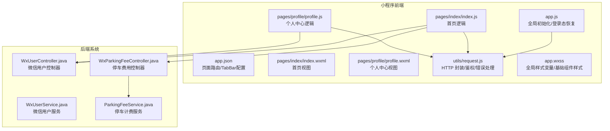
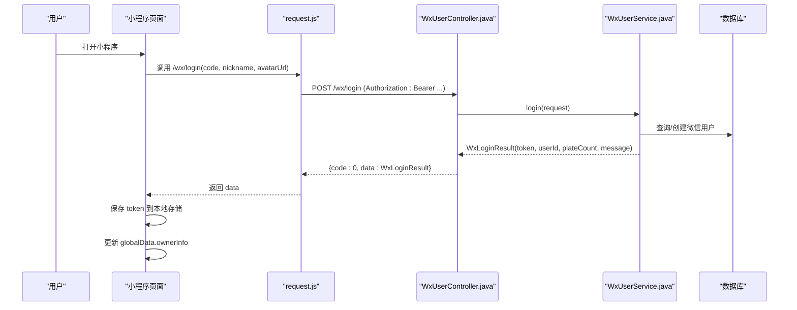
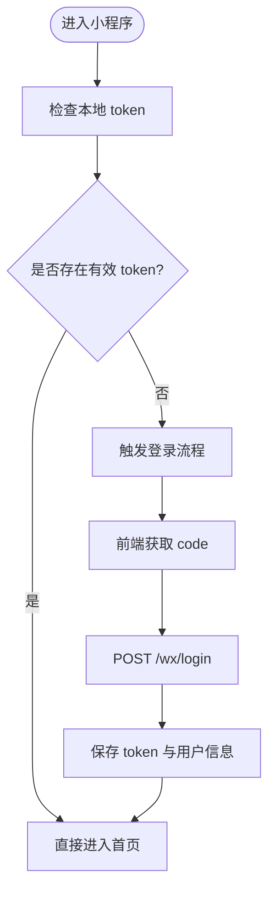
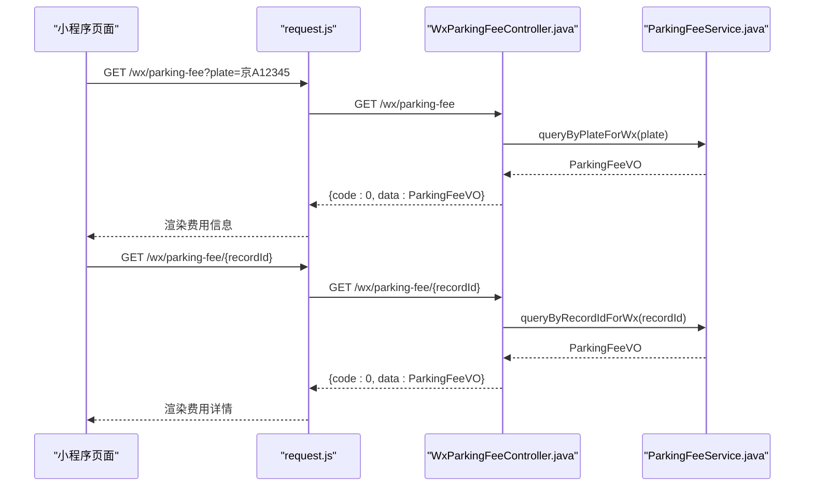
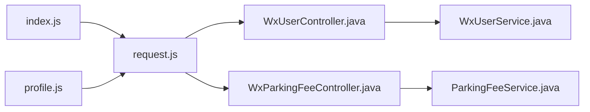

# 微信小程序

<cite>
**本文引用的文件列表**
- [app.js](file://miniapp/app.js)
- [app.json](file://miniapp/app.json)
- [index.js](file://miniapp/pages/index/index.js)
- [index.wxml](file://miniapp/pages/index/index.wxml)
- [profile.js](file://miniapp/pages/profile/profile.js)
- [profile.wxml](file://miniapp/pages/profile/profile.wxml)
- [request.js](file://miniapp/utils/request.js)
- [WxUserController.java](file://parking-system/src/main/java/com/jushan/system/controller/WxUserController.java)
- [WxUserService.java](file://parking-system/src/main/java/com/jushan/system/service/WxUserService.java)
- [WxLoginRequest.java](file://parking-system/src/main/java/com/jushan/system/dto/WxLoginRequest.java)
- [WxLoginResult.java](file://parking-system/src/main/java/com/jushan/system/vo/WxLoginResult.java)
- [PlateBinding.java](file://parking-system/src/main/java/com/jushan/system/entity/PlateBinding.java)
- [ParkingFeeService.java](file://parking-system/src/main/java/com/jushan/system/service/ParkingFeeService.java)
- [WxParkingFeeController.java](file://parking-system/src/main/java/com/jushan/system/controller/WxParkingFeeController.java)
</cite>

## 目录
1. [引言](#引言)
2. [项目结构](#项目结构)
3. [核心组件](#核心组件)
4. [架构总览](#架构总览)
5. [详细组件分析](#详细组件分析)
6. [依赖关系分析](#依赖关系分析)
7. [性能与体验优化](#性能与体验优化)
8. [故障排查指南](#故障排查指南)
9. [结论](#结论)
10. [附录：开发规范、调试与发布流程](#附录开发规范调试与发布流程)

## 引言
本设计文档面向“智慧停车”车主端微信小程序，覆盖整体架构、页面组织、用户认证、车辆绑定管理、停车记录查询、与后端 API 的通信机制、数据缓存策略、错误处理、页面导航与状态管理、本地存储使用、微信生态集成（登录、支付、分享等）实现细节，以及开发规范、调试技巧与发布流程。当前小程序处于早期阶段，部分功能为占位实现，但已具备完整的请求封装、统一鉴权头注入、401 自动登出、基础 UI 与 TabBar 结构，并与后端 Wx 用户与停车费用接口对齐。

## 项目结构
小程序采用轻量级结构，包含全局入口、两个主要页面（首页、我的）、统一的网络请求封装与全局样式。



图表来源
- [app.js:1-55](file://miniapp/app.js#L1-L55)
- [app.json:1-37](file://miniapp/app.json#L1-L37)
- [index.js:1-40](file://miniapp/pages/index/index.js#L1-L40)
- [index.wxml:1-31](file://miniapp/pages/index/index.wxml#L1-L31)
- [profile.js:1-58](file://miniapp/pages/profile/profile.js#L1-L58)
- [profile.wxml:1-47](file://miniapp/pages/profile/profile.wxml#L1-L47)
- [request.js:1-179](file://miniapp/utils/request.js#L1-L179)
- [WxUserController.java:1-116](file://parking-system/src/main/java/com/jushan/system/controller/WxUserController.java#L1-L116)
- [WxUserService.java:1-521](file://parking-system/src/main/java/com/jushan/system/service/WxUserService.java#L1-L521)
- [WxParkingFeeController.java:35-79](file://parking-system/src/main/java/com/jushan/system/controller/WxParkingFeeController.java#L35-L79)
- [ParkingFeeService.java:89-117](file://parking-system/src/main/java/com/jushan/system/service/ParkingFeeService.java#L89-L117)

章节来源
- [app.js:1-55](file://miniapp/app.js#L1-L55)
- [app.json:1-37](file://miniapp/app.json#L1-L37)
- [index.js:1-40](file://miniapp/pages/index/index.js#L1-L40)
- [index.wxml:1-31](file://miniapp/pages/index/index.wxml#L1-L31)
- [profile.js:1-58](file://miniapp/pages/profile/profile.js#L1-L58)
- [profile.wxml:1-47](file://miniapp/pages/profile/profile.wxml#L1-L47)
- [request.js:1-179](file://miniapp/utils/request.js#L1-L179)

## 核心组件
- 全局应用与状态
  - 应用启动时读取系统信息并计算导航栏高度；从本地存储恢复 token 与 ownerInfo；提供 logout 方法清理本地状态。
- 页面模块
  - 首页：展示欢迎卡片与空状态，预留车牌管理与停车记录跳转。
  - 个人中心：显示登录态、昵称与手机号占位，提供退出登录与功能菜单占位。
- 网络请求封装
  - 基于 wx.request 的 Promise 包装，自动注入 Authorization 头；统一解析响应体；对 401 自动清除登录态；对业务错误码进行规范化处理；支持 GET/POST/PUT/DELETE。
- 后端对接
  - 微信用户相关：登录、获取用户信息、绑定/解绑/设置默认车牌、绑定手机号。
  - 停车费用相关：按车牌或记录 ID 查询费用、预览结算。

章节来源
- [app.js:1-55](file://miniapp/app.js#L1-L55)
- [index.js:1-40](file://miniapp/pages/index/index.js#L1-L40)
- [profile.js:1-58](file://miniapp/pages/profile/profile.js#L1-L58)
- [request.js:1-179](file://miniapp/utils/request.js#L1-L179)
- [WxUserController.java:1-116](file://parking-system/src/main/java/com/jushan/system/controller/WxUserController.java#L1-L116)
- [WxUserService.java:1-521](file://parking-system/src/main/java/com/jushan/system/service/WxUserService.java#L1-L521)
- [WxParkingFeeController.java:35-79](file://parking-system/src/main/java/com/jushan/system/controller/WxParkingFeeController.java#L35-L79)
- [ParkingFeeService.java:89-117](file://parking-system/src/main/java/com/jushan/system/service/ParkingFeeService.java#L89-L117)

## 架构总览
小程序通过 request.js 发起 HTTP 请求，携带 Bearer Token；后端由 WxUserController 暴露微信用户能力，WxParkingFeeController 暴露停车费用能力；服务层在 WxUserService 与 ParkingFeeService 中实现业务逻辑，包括登录、车牌绑定、费用查询等。



图表来源
- [request.js:44-124](file://miniapp/utils/request.js#L44-L124)
- [WxUserController.java:43-47](file://parking-system/src/main/java/com/jushan/system/controller/WxUserController.java#L43-L47)
- [WxUserService.java:75-125](file://parking-system/src/main/java/com/jushan/system/service/WxUserService.java#L75-L125)
- [WxLoginRequest.java:1-36](file://parking-system/src/main/java/com/jushan/system/dto/WxLoginRequest.java#L1-L36)
- [WxLoginResult.java:1-55](file://parking-system/src/main/java/com/jushan/system/vo/WxLoginResult.java#L1-L55)

## 详细组件分析

### 用户认证流程
- 前端
  - 页面加载后检查 globalData.token；若无则引导登录。
  - 登录成功后将 token 写入本地存储，并更新 globalData.ownerInfo。
- 后端
  - 接收 code、nickname、avatarUrl；根据环境选择 Mock 或真实微信登录；创建或更新用户；生成 Sa-Token；返回 token 与用户基本信息。
- 鉴权
  - 后续受保护接口需携带 Authorization: Bearer <token>；401 时前端自动清除登录态。



图表来源
- [app.js:21-43](file://miniapp/app.js#L21-L43)
- [index.js:12-28](file://miniapp/pages/index/index.js#L12-L28)
- [request.js:44-124](file://miniapp/utils/request.js#L44-L124)
- [WxUserController.java:43-47](file://parking-system/src/main/java/com/jushan/system/controller/WxUserController.java#L43-L47)
- [WxUserService.java:75-125](file://parking-system/src/main/java/com/jushan/system/service/WxUserService.java#L75-L125)

章节来源
- [app.js:1-55](file://miniapp/app.js#L1-L55)
- [index.js:1-40](file://miniapp/pages/index/index.js#L1-L40)
- [request.js:1-179](file://miniapp/utils/request.js#L1-L179)
- [WxUserController.java:1-116](file://parking-system/src/main/java/com/jushan/system/controller/WxUserController.java#L1-L116)
- [WxUserService.java:1-521](file://parking-system/src/main/java/com/jushan/system/service/WxUserService.java#L1-L521)
- [WxLoginRequest.java:1-36](file://parking-system/src/main/java/com/jushan/system/dto/WxLoginRequest.java#L1-L36)
- [WxLoginResult.java:1-55](file://parking-system/src/main/java/com/jushan/system/vo/WxLoginResult.java#L1-L55)

### 车辆绑定管理
- 能力范围
  - 绑定车牌：校验绑定策略（用户上限、车牌绑定用户上限），查找或创建车辆，创建绑定记录，支持默认车牌设置。
  - 解绑车牌：校验归属后删除绑定记录。
  - 设置默认车牌：同一用户仅一个默认车牌。
  - 绑定手机号：格式校验与唯一性校验。
- 数据结构
  - PlateBinding 实体包含绑定类型、验证方式、验证状态、是否默认等字段。
- 交互流程
  - 前端调用 /wx/plates 系列接口；后端在 WxUserService 中完成策略校验与持久化。

```mermaid
classDiagram
class PlateBinding {
+Long id
+Long wxUserId
+Long vehicleId
+String bindingType
+String verifyMethod
+String verifyStatus
+Boolean isDefault
+LocalDateTime verifiedAt
+LocalDateTime createdAt
+LocalDateTime updatedAt
}
class WxUserService {
+bindPlate(request) PlateBindingVo
+unbindPlate(request) void
+setDefaultPlate(bindingId) void
+getCurrentUser() WxUserVo
+logout() void
}
class WxUserController {
+POST /wx/plates
+DELETE /wx/plates/{bindingId}
+PUT /wx/plates/{bindingId}/default
+GET /wx/user
+POST /wx/logout
}
WxUserController --> WxUserService : "调用"
WxUserService --> PlateBinding : "读写"
```

图表来源
- [PlateBinding.java:37-81](file://parking-system/src/main/java/com/jushan/system/entity/PlateBinding.java#L37-L81)
- [WxUserService.java:235-341](file://parking-system/src/main/java/com/jushan/system/service/WxUserService.java#L235-L341)
- [WxUserController.java:76-104](file://parking-system/src/main/java/com/jushan/system/controller/WxUserController.java#L76-L104)

章节来源
- [WxUserService.java:235-341](file://parking-system/src/main/java/com/jushan/system/service/WxUserService.java#L235-L341)
- [WxUserController.java:76-104](file://parking-system/src/main/java/com/jushan/system/controller/WxUserController.java#L76-L104)
- [PlateBinding.java:37-81](file://parking-system/src/main/java/com/jushan/system/entity/PlateBinding.java#L37-L81)

### 停车记录查询与费用
- 查询能力
  - 按车牌查询在场费用：若存在多条在场记录，要求使用记录 ID 查询。
  - 按记录 ID 查询费用：校验车牌归属当前用户。
  - 预览结算：支持重新计费与费用预览。
- 控制器与服务
  - WxParkingFeeController 暴露 GET /wx/parking-fee?plate=...、GET /wx/parking-fee/{recordId}、POST /wx/parking-fee/preview。
  - ParkingFeeService 实现查询与校验逻辑。



图表来源
- [WxParkingFeeController.java:35-79](file://parking-system/src/main/java/com/jushan/system/controller/WxParkingFeeController.java#L35-L79)
- [ParkingFeeService.java:89-117](file://parking-system/src/main/java/com/jushan/system/service/ParkingFeeService.java#L89-L117)
- [request.js:139-176](file://miniapp/utils/request.js#L139-L176)

章节来源
- [WxParkingFeeController.java:35-79](file://parking-system/src/main/java/com/jushan/system/controller/WxParkingFeeController.java#L35-L79)
- [ParkingFeeService.java:89-117](file://parking-system/src/main/java/com/jushan/system/service/ParkingFeeService.java#L89-L117)

### 页面间导航与状态管理
- 导航
  - 使用 app.json 配置 pages 与 tabBar；首页与个人中心作为主入口。
  - 页面内跳转目前以提示占位为主，后续可替换为 wx.navigateTo 等。
- 状态管理
  - 使用 App.globalData 维护 token 与 ownerInfo；页面 onLoad/onShow 中读取并渲染。
  - 退出登录通过 app.logout() 清理本地存储与内存状态。

章节来源
- [app.json:1-37](file://miniapp/app.json#L1-L37)
- [index.js:12-28](file://miniapp/pages/index/index.js#L12-L28)
- [profile.js:12-25](file://miniapp/pages/profile/profile.js#L12-L25)
- [app.js:48-53](file://miniapp/app.js#L48-L53)

### 本地存储与数据缓存策略
- 本地存储
  - 使用 wx.getStorageSync/setStorageSync 持久化 jushan_access_token 与 ownerInfo。
  - 应用启动时恢复登录态；无 token 时不主动发起登录。
- 缓存策略建议
  - 针对停车费用与用户信息，可在页面级增加短时缓存（如 30s 内复用），减少重复请求。
  - 对于高频列表数据，结合分页与下拉刷新策略，避免全量拉取。

章节来源
- [app.js:21-43](file://miniapp/app.js#L21-L43)
- [request.js:1-179](file://miniapp/utils/request.js#L1-L179)

### 错误处理方案
- 网络层
  - 统一构造错误对象，保留 message/code/status/traceId。
  - 401 自动清除登录态；403 不清除 token；其他非 2xx 尝试解析 body 并拒绝。
- 业务层
  - 后端抛出 BusinessException，前端通过 code 与 message 提示用户。
  - 停车费用查询中，多在场记录或跨用户访问会返回明确错误码。

章节来源
- [request.js:33-134](file://miniapp/utils/request.js#L33-L134)
- [ParkingFeeService.java:89-117](file://parking-system/src/main/java/com/jushan/system/service/ParkingFeeService.java#L89-L117)

### 微信生态集成（登录、支付、分享）
- 登录
  - 前端通过 wx.login() 获取 code，后端在 WxUserService 中解析 openid（Mock 模式可用）。
  - 返回 token 供后续请求携带。
- 支付
  - 需求文档定义微信支付流程与回调；当前小程序未实现支付页面，需在缴费流程中接入 wx.requestPayment。
- 分享
  - 可通过 onShareAppMessage 实现分享；当前代码未实现，建议在需要分享的页面添加。

章节来源
- [WxUserService.java:133-144](file://parking-system/src/main/java/com/jushan/system/service/WxUserService.java#L133-L144)
- [docs/需求文档/停车SaaS系统完整需求文档_PRD_V1.0_最终定稿.md:5122-5224](file://docs/需求文档/停车SaaS系统完整需求文档_PRD_V1.0_最终定稿.md#L5122-L5224)

## 依赖关系分析
- 前端依赖
  - 页面依赖 request.js 进行网络请求；全局依赖 app.js 提供的状态与工具。
- 后端依赖
  - 控制器依赖服务层；服务层依赖 Mapper 与实体；Sa-Token 用于会话与鉴权。



图表来源
- [index.js:1-40](file://miniapp/pages/index/index.js#L1-L40)
- [profile.js:1-58](file://miniapp/pages/profile/profile.js#L1-L58)
- [request.js:1-179](file://miniapp/utils/request.js#L1-L179)
- [WxUserController.java:1-116](file://parking-system/src/main/java/com/jushan/system/controller/WxUserController.java#L1-L116)
- [WxUserService.java:1-521](file://parking-system/src/main/java/com/jushan/system/service/WxUserService.java#L1-L521)
- [WxParkingFeeController.java:35-79](file://parking-system/src/main/java/com/jushan/system/controller/WxParkingFeeController.java#L35-L79)
- [ParkingFeeService.java:89-117](file://parking-system/src/main/java/com/jushan/system/service/ParkingFeeService.java#L89-L117)

## 性能与体验优化
- 首屏优化
  - 使用 lazyCodeLoading 按需加载组件；合理拆分页面逻辑，避免 onLoad 阻塞。
- 网络优化
  - 在 request.js 基础上增加请求去重与短时缓存；对热点数据（用户信息、费用）做本地缓存与失效策略。
- 渲染优化
  - 减少 setData 频率与数据体积；使用条件渲染与懒加载列表项。
- 兼容性
  - 使用 rpx 与 env(safe-area-inset-bottom) 适配不同机型；注意 iOS/Android 差异。

[本节为通用指导，无需具体文件引用]

## 故障排查指南
- 登录失败
  - 检查 code 是否为空；确认后端 mock-login 开关；查看返回的 message 与 traceId。
- 401 未登录
  - 确认 Authorization 头是否正确注入；检查本地 token 是否被清理；必要时重新登录。
- 403 无权限
  - 检查当前用户是否拥有操作该资源的权限；核对车牌归属校验。
- 停车费用查询异常
  - 多在场记录时需使用 recordId 查询；跨用户访问会被拒绝。

章节来源
- [request.js:82-134](file://miniapp/utils/request.js#L82-L134)
- [ParkingFeeService.java:89-117](file://parking-system/src/main/java/com/jushan/system/service/ParkingFeeService.java#L89-L117)

## 结论
当前小程序已完成基础架构搭建与核心能力对接，具备登录鉴权、用户信息与车牌绑定管理、停车费用查询等关键路径。后续应优先完善停车记录页面、支付流程与分享能力，同时加强缓存与错误处理，提升用户体验与稳定性。

[本节为总结，无需具体文件引用]

## 附录：开发规范、调试技巧与发布流程

### 开发规范
- 命名与结构
  - 页面文件遵循 pageName.js/wxml/wxss/json；公共逻辑放入 utils；全局样式放在 app.wxss。
- 网络请求
  - 所有 HTTP 请求必须通过 request.js；禁止直接调用 wx.request。
- 错误处理
  - 统一使用 createApiError 构造错误对象；页面层捕获并提示用户。
- 状态管理
  - 敏感信息（token）仅存于本地存储与 globalData；避免在 URL 中传递。

章节来源
- [request.js:1-179](file://miniapp/utils/request.js#L1-L179)
- [app.js:1-55](file://miniapp/app.js#L1-L55)

### 调试技巧
- 控制台日志
  - 在 request.js 的 success/fail 分支打印 statusCode、body、traceId，便于定位问题。
- 模拟登录
  - 后端启用 mock-login，使用任意 code 快速获得 token。
- 断点与抓包
  - 使用微信开发者工具的 Network 面板观察请求与响应；必要时抓包分析。

章节来源
- [request.js:60-124](file://miniapp/utils/request.js#L60-L124)
- [WxUserService.java:133-144](file://parking-system/src/main/java/com/jushan/system/service/WxUserService.java#L133-L144)

### 发布流程
- 版本管理
  - 在 project.config.json 中配置版本号与描述；提交前执行 Lint 与基本测试。
- 提审准备
  - 确保隐私协议与用户授权说明完备；支付与分享功能需提前申请权限。
- 灰度与回滚
  - 先小范围灰度，监控错误率与性能指标；出现问题及时回滚。

[本节为通用指导，无需具体文件引用]