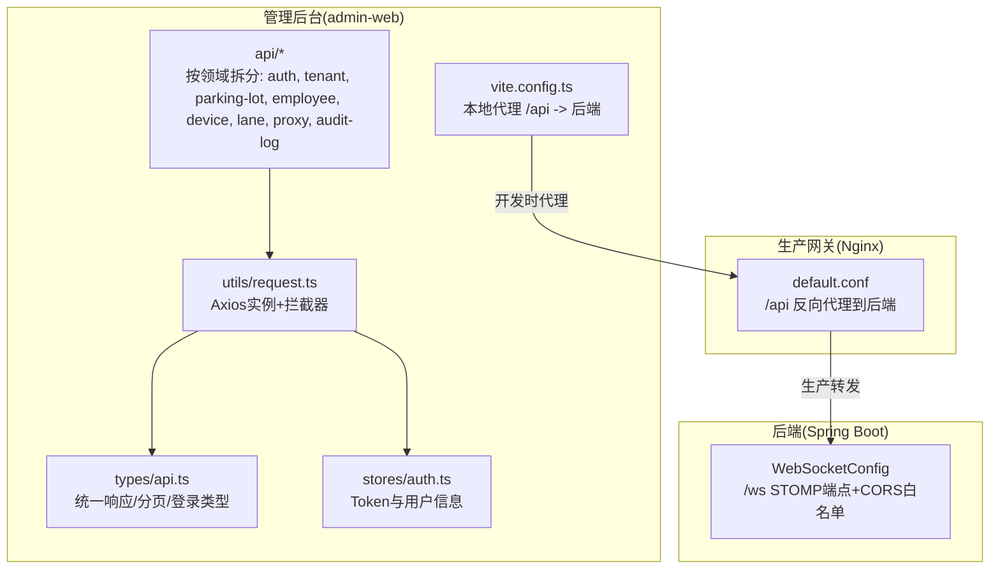
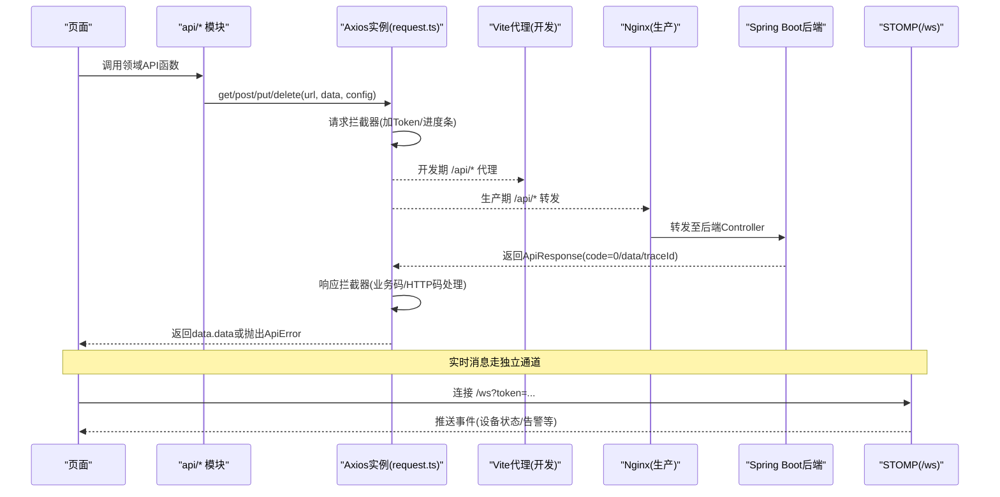
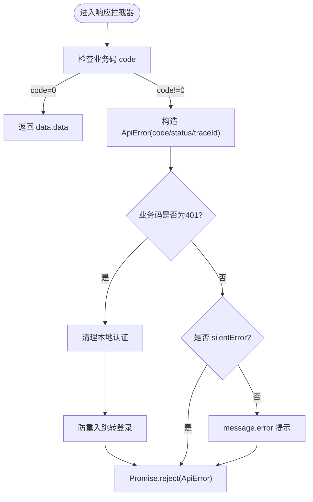
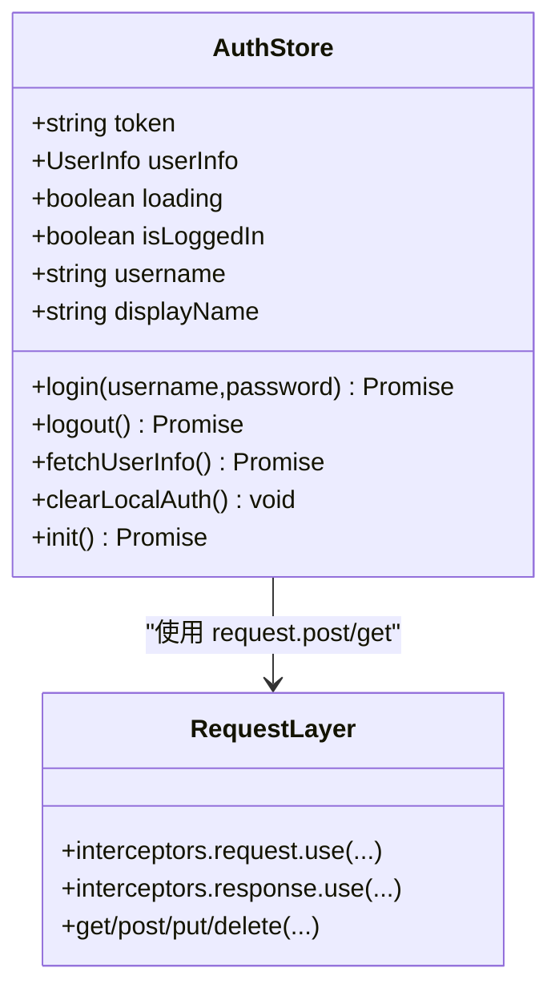
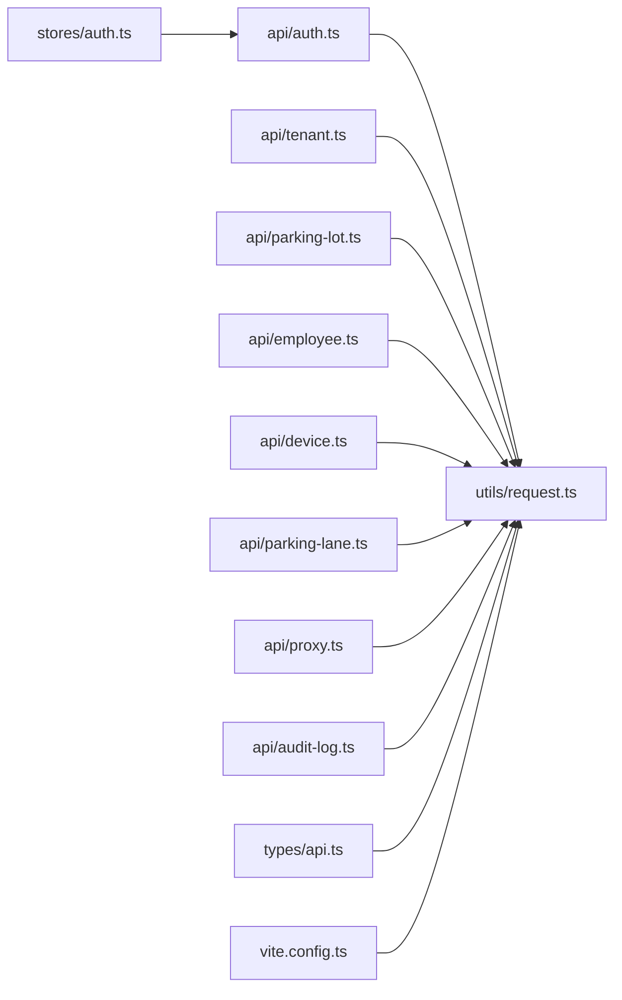

# API集成层

<cite>
**本文引用的文件**   
- [admin-web/src/utils/request.ts](file://admin-web/src/utils/request.ts)
- [booth-web/src/utils/request.ts](file://booth-web/src/utils/request.ts)
- [admin-web/src/types/api.ts](file://admin-web/src/types/api.ts)
- [admin-web/src/stores/auth.ts](file://admin-web/src/stores/auth.ts)
- [admin-web/src/api/index.ts](file://admin-web/src/api/index.ts)
- [admin-web/src/api/auth.ts](file://admin-web/src/api/auth.ts)
- [admin-web/src/api/tenant.ts](file://admin-web/src/api/tenant.ts)
- [admin-web/src/api/parking-lot.ts](file://admin-web/src/api/parking-lot.ts)
- [admin-web/src/api/employee.ts](file://admin-web/src/api/employee.ts)
- [admin-web/src/api/device.ts](file://admin-web/src/api/device.ts)
- [admin-web/src/api/parking-lane.ts](file://admin-web/src/api/parking-lane.ts)
- [admin-web/src/api/proxy.ts](file://admin-web/src/api/proxy.ts)
- [admin-web/src/api/audit-log.ts](file://admin-web/src/api/audit-log.ts)
- [admin-web/vite.config.ts](file://admin-web/vite.config.ts)
- [docker/nginx/conf.d/default.conf](file://docker/nginx/conf.d/default.conf)
- [parking-framework/src/main/java/com/jushan/framework/ws/WebSocketConfig.java](file://parking-framework/src/main/java/com/jushan/framework/ws/WebSocketConfig.java)
- [booth-web/src/utils/websocket.ts](file://booth-web/src/utils/websocket.ts)
</cite>

## 目录
1. [简介](#简介)
2. [项目结构](#项目结构)
3. [核心组件](#核心组件)
4. [架构总览](#架构总览)
5. [详细组件分析](#详细组件分析)
6. [依赖关系分析](#依赖关系分析)
7. [性能与并发控制](#性能与并发控制)
8. [故障排查指南](#故障排查指南)
9. [版本管理与迁移](#版本管理与迁移)
10. [安全与跨域](#安全与跨域)
11. [结论](#结论)

## 简介
本文件面向管理后台（admin-web）的API集成层，系统性说明基于Axios的HTTP请求封装、拦截器配置、错误处理与重试策略、模块化组织、类型定义与接口规范、Token管理、请求去重与并发控制、Mock数据支持、调试工具与性能监控、API版本管理、向后兼容与迁移指南，以及安全与CORS配置等。文档同时兼顾非技术读者，提供可视化图示与可操作建议。

## 项目结构
前端工程采用“按领域划分”的API模块组织方式：每个业务域一个文件，统一通过入口聚合导出；网络层集中在utils/request.ts中实现，类型定义集中于types/api.ts；认证状态由Pinia store集中管理；开发期通过Vite代理解决跨域问题，生产环境由Nginx反向代理统一转发。

图表来源
- [admin-web/src/utils/request.ts:1-176](file://admin-web/src/utils/request.ts#L1-L176)
- [admin-web/src/types/api.ts:1-55](file://admin-web/src/types/api.ts#L1-L55)
- [admin-web/src/stores/auth.ts:1-103](file://admin-web/src/stores/auth.ts#L1-L103)
- [admin-web/src/api/index.ts:1-9](file://admin-web/src/api/index.ts#L1-L9)
- [admin-web/vite.config.ts:29-38](file://admin-web/vite.config.ts#L29-L38)
- [docker/nginx/conf.d/default.conf:1-87](file://docker/nginx/conf.d/default.conf#L1-L87)
- [parking-framework/src/main/java/com/jushan/framework/ws/WebSocketConfig.java:44-73](file://parking-framework/src/main/java/com/jushan/framework/ws/WebSocketConfig.java#L44-L73)

章节来源
- [admin-web/src/utils/request.ts:1-176](file://admin-web/src/utils/request.ts#L1-L176)
- [admin-web/src/types/api.ts:1-55](file://admin-web/src/types/api.ts#L1-L55)
- [admin-web/src/stores/auth.ts:1-103](file://admin-web/src/stores/auth.ts#L1-L103)
- [admin-web/src/api/index.ts:1-9](file://admin-web/src/api/index.ts#L1-L9)
- [admin-web/vite.config.ts:29-38](file://admin-web/vite.config.ts#L29-L38)
- [docker/nginx/conf.d/default.conf:1-87](file://docker/nginx/conf.d/default.conf#L1-L87)
- [parking-framework/src/main/java/com/jushan/framework/ws/WebSocketConfig.java:44-73](file://parking-framework/src/main/java/com/jushan/framework/ws/WebSocketConfig.java#L44-L73)

## 核心组件
- Axios实例与基础配置
  - baseURL为/api，超时30秒，Content-Type为application/json。
  - 提供get/post/put/delete四方法封装，透传config以支持silentError等扩展。
- 请求拦截器
  - 启动进度条；除登录接口外自动注入Authorization头（Bearer Token）。
  - 登录接口识别规则兼容相对路径与/api前缀。
- 响应拦截器
  - 成功码为0时直接返回data.data；否则构造ApiError并拒绝。
  - 业务码401或HTTP 401场景清理本地认证并跳转登录页，且防止并发重复跳转。
  - 对403/404/500分别给出友好提示，并在500时附带traceId便于定位。
  - 支持silentError开关，允许调用方静默处理错误。
- 类型定义
  - ApiResponse<T>与后端R<T>对齐，包含code/message/data/traceId。
  - PageResult<T>用于分页；LoginParams/LoginResult/UserInfo用于认证流程。
- 认证状态管理
  - Pinia store维护token与用户信息，提供login/logout/fetchUserInfo/clearLocalAuth/init等方法。
  - 写入token前进行有效性校验，失败则抛错不写localStorage。
  - 退出登录无论远程是否成功均清理本地状态并跳转。

章节来源
- [admin-web/src/utils/request.ts:1-176](file://admin-web/src/utils/request.ts#L1-L176)
- [admin-web/src/types/api.ts:1-55](file://admin-web/src/types/api.ts#L1-L55)
- [admin-web/src/stores/auth.ts:1-103](file://admin-web/src/stores/auth.ts#L1-L103)

## 架构总览
下图展示从页面发起请求到后端响应的完整链路，包括开发期Vite代理与生产期Nginx转发，以及WebSocket实时通道。

图表来源
- [admin-web/src/utils/request.ts:1-176](file://admin-web/src/utils/request.ts#L1-L176)
- [admin-web/vite.config.ts:29-38](file://admin-web/vite.config.ts#L29-L38)
- [docker/nginx/conf.d/default.conf:1-87](file://docker/nginx/conf.d/default.conf#L1-L87)
- [parking-framework/src/main/java/com/jushan/framework/ws/WebSocketConfig.java:44-73](file://parking-framework/src/main/java/com/jushan/framework/ws/WebSocketConfig.java#L44-L73)

## 详细组件分析

### HTTP请求封装与拦截器
- 请求拦截器职责
  - 进度条控制：请求开始/结束。
  - Token注入：除登录接口外，自动在Authorization头附加Bearer token。
  - 登录接口识别：正则匹配/auth/login，兼容/api前缀与查询参数。
- 响应拦截器职责
  - 业务成功：code=0时返回data.data。
  - 业务错误：构造ApiError并拒绝，携带code/status/traceId。
  - 未授权处理：
    - 业务码401：清理本地认证并跳转一次，避免递归。
    - HTTP 401：区分登录接口与普通接口；普通接口清理本地并跳转一次。
  - 其他错误：403/404/500分别提示，500显示traceId。
  - 静默错误：支持silentError=true跳过全局提示。
- 封装方法
  - get/post/put/delete统一封装，透传params与config，便于扩展。

图表来源
- [admin-web/src/utils/request.ts:67-156](file://admin-web/src/utils/request.ts#L67-L156)

章节来源
- [admin-web/src/utils/request.ts:1-176](file://admin-web/src/utils/request.ts#L1-L176)

### 认证与Token管理
- 存储位置：localStorage键名固定，store初始化时读取。
- 写入校验：validateAndSetToken确保accessToken为非空字符串，否则抛错。
- 会话刷新：init在存在token时拉取用户信息；失败则清理本地。
- 退出逻辑：logout优先调用远程退出，但无论如何都清理本地并跳转。
- 并发401防护：request层isRedirectingLogin标志位保证只跳转一次。

图表来源
- [admin-web/src/stores/auth.ts:1-103](file://admin-web/src/stores/auth.ts#L1-L103)
- [admin-web/src/utils/request.ts:1-176](file://admin-web/src/utils/request.ts#L1-L176)

章节来源
- [admin-web/src/stores/auth.ts:1-103](file://admin-web/src/stores/auth.ts#L1-L103)
- [admin-web/src/utils/request.ts:1-176](file://admin-web/src/utils/request.ts#L1-L176)

### API模块化组织与类型规范
- 模块划分
  - 按领域拆分为auth、tenant、parking-lot、employee、device、parking-lane、proxy、audit-log等。
  - 统一入口index.ts聚合导出，便于按需引入。
- 类型规范
  - 统一响应格式ApiResponse<T>与后端一致。
  - 分页PageResult<T>字段齐全，便于表格渲染。
  - 各模块VO类型与后端视图对象保持一致，减少前后端联调成本。
- 典型接口示例（仅列路径与用途）
  - 认证：/auth/login、/auth/logout、/auth/session
  - 租户：/admin/tenants、/admin/tenants/:id、/admin/tenants/:id/audit
  - 停车场：/admin/parking-lots、/admin/parking-lots/:id、/admin/parking-lots/:id/status、/admin/parking-lots/:id/capacity
  - 员工：/admin/employees、/admin/employees/:id、/admin/employees/:id/reset-password、/admin/employees/:id/status
  - 设备：/admin/devices、/admin/devices/:id、/admin/devices/:id/status、/admin/devices/query-status-batch、/admin/devices/status-snapshots
  - 车道：/admin/lanes、/admin/lanes/:id、/admin/lanes/:id/status
  - 代理：/admin/proxy/start、/admin/proxy/stop、/admin/proxy/status
  - 审计日志：/admin/audit-logs、/admin/audit-logs/:id

章节来源
- [admin-web/src/api/index.ts:1-9](file://admin-web/src/api/index.ts#L1-L9)
- [admin-web/src/api/auth.ts:1-18](file://admin-web/src/api/auth.ts#L1-L18)
- [admin-web/src/api/tenant.ts:1-34](file://admin-web/src/api/tenant.ts#L1-L34)
- [admin-web/src/api/parking-lot.ts:1-54](file://admin-web/src/api/parking-lot.ts#L1-L54)
- [admin-web/src/api/employee.ts:1-57](file://admin-web/src/api/employee.ts#L1-L57)
- [admin-web/src/api/device.ts:1-158](file://admin-web/src/api/device.ts#L1-L158)
- [admin-web/src/api/parking-lane.ts:1-59](file://admin-web/src/api/parking-lane.ts#L1-L59)
- [admin-web/src/api/proxy.ts:1-26](file://admin-web/src/api/proxy.ts#L1-L26)
- [admin-web/src/api/audit-log.ts:1-42](file://admin-web/src/api/audit-log.ts#L1-L42)
- [admin-web/src/types/api.ts:1-55](file://admin-web/src/types/api.ts#L1-L55)

### 请求去重与并发控制策略
- 现状
  - 当前未实现请求级去重与并发限流。
- 建议方案
  - 请求去重：基于URL+序列化参数生成唯一键，使用Map缓存Promise，相同请求合并。
  - 并发控制：限制同一时间最大并发数，队列化等待执行，避免雪崩。
  - 幂等性：对写操作增加幂等键（如请求ID），服务端侧配合Redis去重。
  - 取消机制：利用AbortController在路由切换或组件卸载时取消悬空请求。
  - 注意：需与silentError、401跳转等逻辑协同，避免误判与死锁。

[本节为通用建议，不涉及具体代码文件]

### Mock数据支持与调试工具
- 开发期Mock
  - 使用Vite代理将/api转发到本地后端，便于联调。
  - 可在代理层或后端控制器中接入Mock数据（例如内部测试接口）。
- 调试建议
  - 浏览器Network面板查看请求/响应体与traceId。
  - 控制台捕获ApiError，打印code/status/traceId辅助定位。
  - 针对敏感接口开启silentError=false以便快速复现问题。

章节来源
- [admin-web/vite.config.ts:29-38](file://admin-web/vite.config.ts#L29-L38)
- [admin-web/src/utils/request.ts:100-156](file://admin-web/src/utils/request.ts#L100-L156)

### 性能监控
- 前端
  - 使用NProgress展示加载进度，提升感知体验。
  - 可通过自定义拦截器上报耗时、错误率等指标。
- 后端
  - 结合Actuator与健康检查探针观察服务状态。
  - 对关键接口埋点统计P95/P99延迟与错误率。

章节来源
- [admin-web/src/utils/request.ts:28-45](file://admin-web/src/utils/request.ts#L28-L45)
- [docker/nginx/conf.d/default.conf:77-87](file://docker/nginx/conf.d/default.conf#L77-L87)

## 依赖关系分析
- 模块耦合
  - api/* 强依赖 utils/request.ts 与 types/api.ts。
  - stores/auth.ts 依赖 api/auth.ts 与 router。
  - vite.config.ts 仅在开发期影响网络层行为。
- 外部依赖
  - axios、nprogress、ant-design-vue message。
  - WebSocket客户端使用@stomp/stompjs（岗亭端）。

图表来源
- [admin-web/src/api/index.ts:1-9](file://admin-web/src/api/index.ts#L1-L9)
- [admin-web/src/utils/request.ts:1-176](file://admin-web/src/utils/request.ts#L1-L176)
- [admin-web/src/types/api.ts:1-55](file://admin-web/src/types/api.ts#L1-L55)
- [admin-web/src/stores/auth.ts:1-103](file://admin-web/src/stores/auth.ts#L1-L103)
- [admin-web/vite.config.ts:29-38](file://admin-web/vite.config.ts#L29-L38)

章节来源
- [admin-web/src/api/index.ts:1-9](file://admin-web/src/api/index.ts#L1-L9)
- [admin-web/src/utils/request.ts:1-176](file://admin-web/src/utils/request.ts#L1-L176)
- [admin-web/src/types/api.ts:1-55](file://admin-web/src/types/api.ts#L1-L55)
- [admin-web/src/stores/auth.ts:1-103](file://admin-web/src/stores/auth.ts#L1-L103)
- [admin-web/vite.config.ts:29-38](file://admin-web/vite.config.ts#L29-L38)

## 性能与并发控制
- 超时与重试
  - 默认超时30秒，适合常规CRUD；对长耗时操作可按需调整。
  - 当前未启用自动重试，避免幂等问题与抖动放大。
- 资源优化
  - 构建期手动分包，分离vendor包，提升缓存命中率。
- 建议
  - 对热点列表接口增加前端缓存与增量更新。
  - 批量接口优先使用批量查询，减少往返次数。
  - 大表单提交采用分步保存与乐观更新。

章节来源
- [admin-web/src/utils/request.ts:10-16](file://admin-web/src/utils/request.ts#L10-L16)
- [admin-web/vite.config.ts:47-58](file://admin-web/vite.config.ts#L47-L58)

## 故障排查指南
- 常见问题
  - 401未授权：检查Token是否存在且有效；确认登录接口未被误判；关注并发401跳转保护。
  - 403无权限：确认角色/权限配置；必要时打开silentError=false获取详细错误。
  - 404资源不存在：核对路径与参数；检查后端路由变更。
  - 500服务器错误：记录traceId，联系后端定位。
  - 网络异常：检查代理/Nginx配置与网络连通性。
- 定位步骤
  - 浏览器Network查看请求头Authorization与响应体traceId。
  - 在调用处捕获ApiError，打印code/status/traceId。
  - 若为WebSocket问题，参考后续“WebSocket实时通道”部分。

章节来源
- [admin-web/src/utils/request.ts:100-156](file://admin-web/src/utils/request.ts#L100-L156)

## 版本管理与迁移
- 版本原则
  - 后端框架版本以根pom.xml为准；前端依赖版本以package.json为准。
  - 数据库迁移以Flyway脚本为准；共享契约版本以contracts目录为准。
- 接口版本化建议
  - URL前缀带版本：/api/v1/...，逐步演进，旧版本保留过渡期。
  - 新增字段保持向后兼容，删除字段先废弃再下线。
  - 重大变更发布前进行兼容性测试与灰度发布。
- 迁移清单
  - 更新baseURL或代理规则；同步类型定义；回归关键用例；更新文档与契约。

章节来源
- [docs/项目概述/技术架构.md:79-88](file://docs/项目概述/技术架构.md#L79-L88)

## 安全与跨域
- 安全要点
  - Token仅通过Authorization头传递，登录接口不携带Token。
  - 401场景清理本地状态并跳转，避免残留凭证。
  - 禁止在前端暴露后端敏感配置，Base URL由后端可信配置决定。
- CORS与跨域
  - 开发期：Vite代理将/api转发到后端，changeOrigin=true，rewrite去除/api前缀。
  - 生产期：Nginx反向代理/api与/ws到后端，设置必要头部与长连接超时。
  - WebSocket：后端STOMP端点配置允许的源地址，握手阶段鉴权。
- 建议
  - 生产环境启用HTTPS，强制HSTS。
  - 对敏感接口增加签名与防重放机制。
  - 严格最小权限原则，细化角色与数据范围。

章节来源
- [admin-web/vite.config.ts:29-38](file://admin-web/vite.config.ts#L29-L38)
- [docker/nginx/conf.d/default.conf:1-87](file://docker/nginx/conf.d/default.conf#L1-L87)
- [parking-framework/src/main/java/com/jushan/framework/ws/WebSocketConfig.java:44-73](file://parking-framework/src/main/java/com/jushan/framework/ws/WebSocketConfig.java#L44-L73)

## 结论
本API集成层以Axios为核心，围绕统一的响应格式与错误模型，实现了稳定的认证注入、错误提示与跳转控制，并通过模块化组织与类型约束提升了可维护性与可协作性。建议在现有基础上补充请求去重与并发控制、完善性能监控与Mock能力，并遵循版本化与向后兼容原则推进平滑演进。