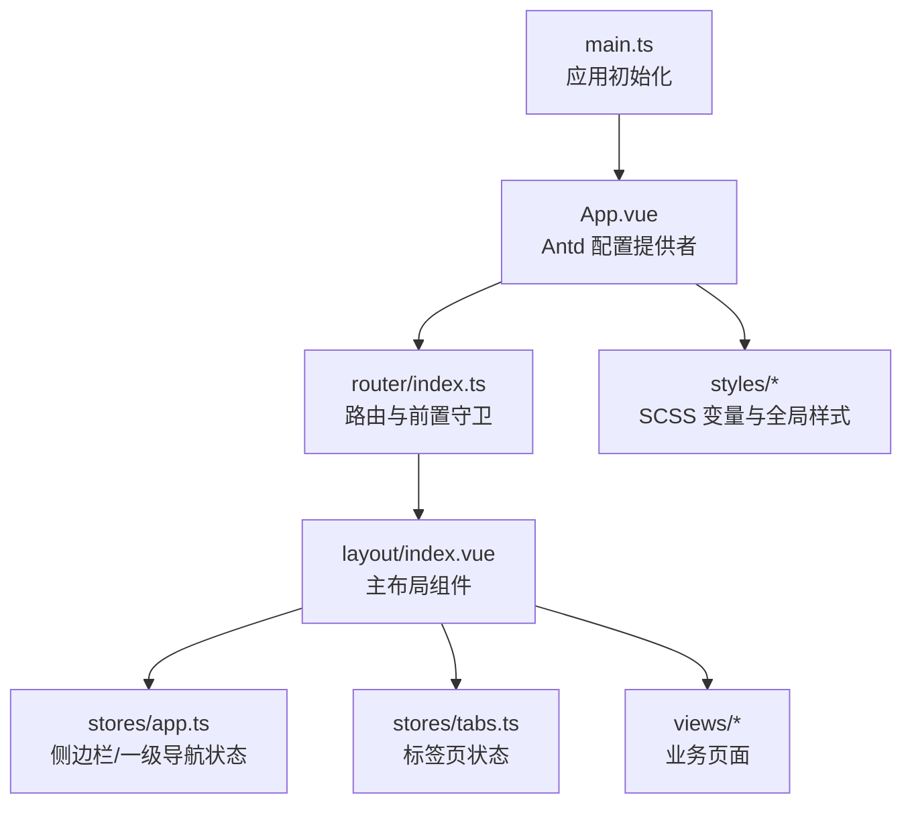
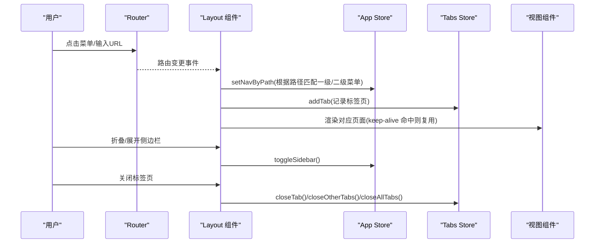
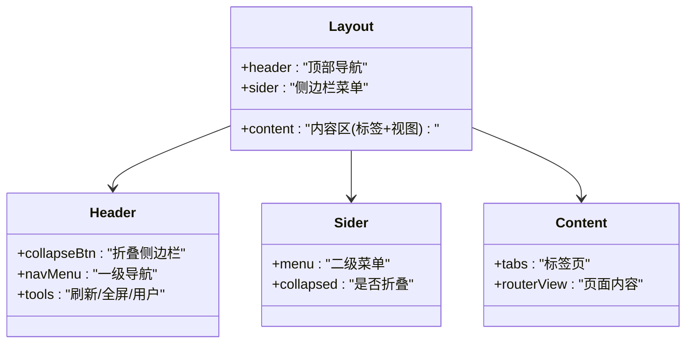
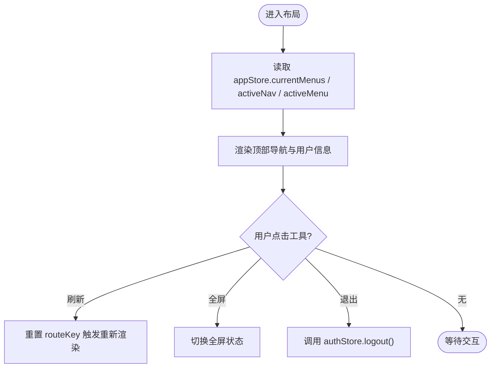
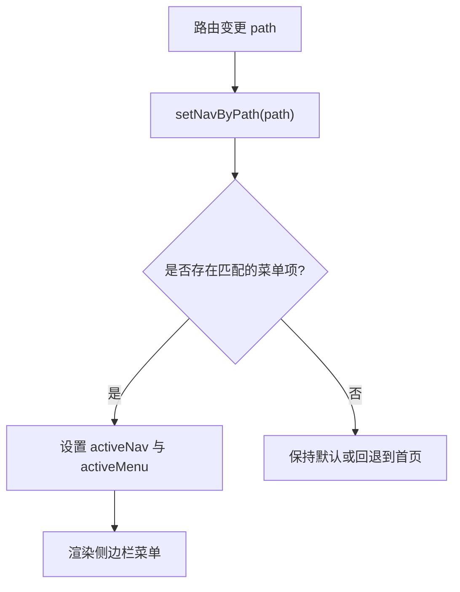
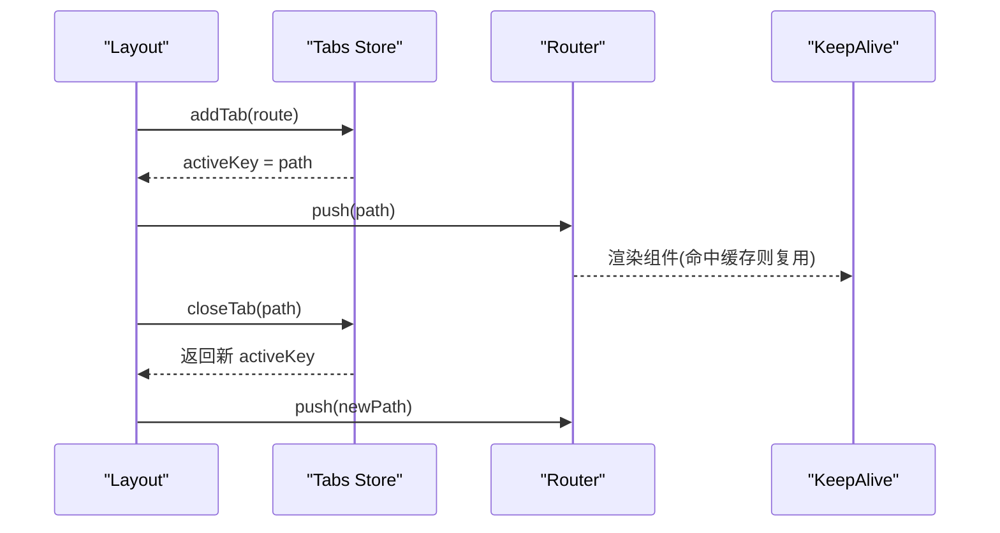
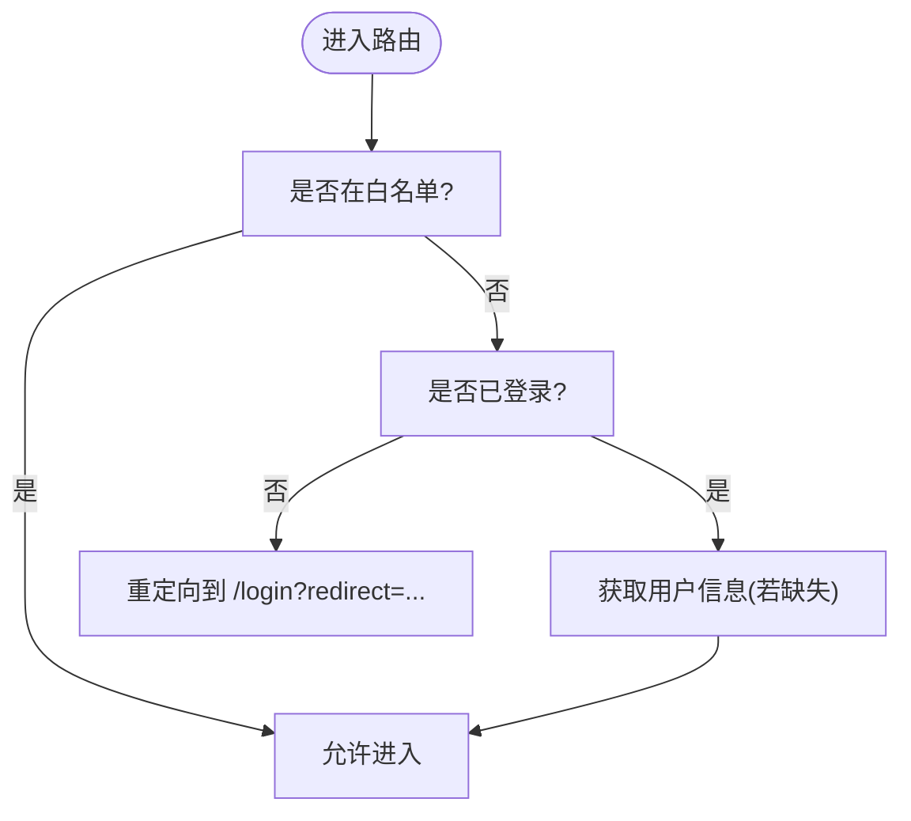
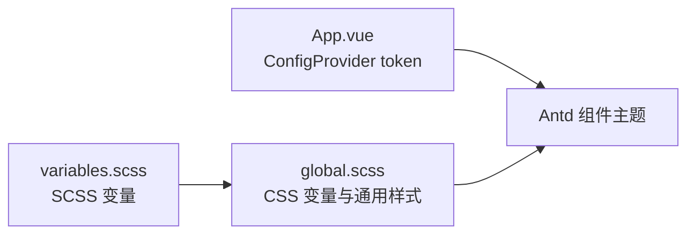
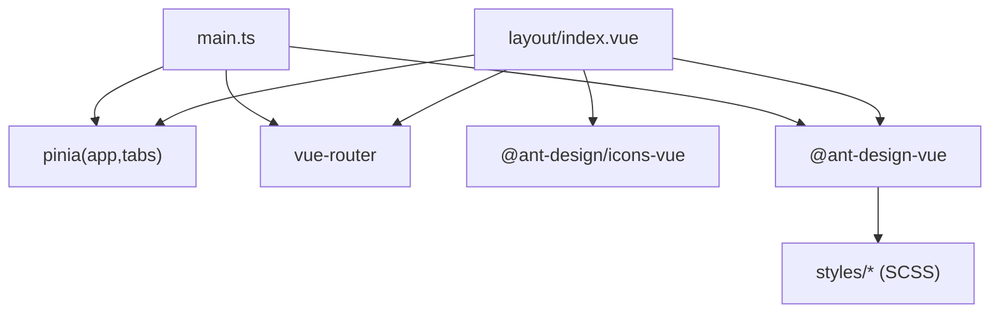

# 布局系统

<cite>
**本文引用的文件**
- [admin-web/src/layout/index.vue](file://admin-web/src/layout/index.vue)
- [admin-web/src/router/index.ts](file://admin-web/src/router/index.ts)
- [admin-web/src/stores/app.ts](file://admin-web/src/stores/app.ts)
- [admin-web/src/stores/auth.ts](file://admin-web/src/stores/auth.ts)
- [admin-web/src/stores/tabs.ts](file://admin-web/src/stores/tabs.ts)
- [admin-web/src/styles/variables.scss](file://admin-web/src/styles/variables.scss)
- [admin-web/src/styles/global.scss](file://admin-web/src/styles/global.scss)
- [admin-web/src/App.vue](file://admin-web/src/App.vue)
- [admin-web/src/main.ts](file://admin-web/src/main.ts)
- [admin-web/package.json](file://admin-web/package.json)
</cite>

## 目录
1. [简介](#简介)
2. [项目结构](#项目结构)
3. [核心组件](#核心组件)
4. [架构总览](#架构总览)
5. [详细组件分析](#详细组件分析)
6. [依赖关系分析](#依赖关系分析)
7. [性能与体验优化](#性能与体验优化)
8. [故障排查指南](#故障排查指南)
9. [结论](#结论)

## 简介
本文件面向管理后台的布局系统，围绕基于 Ant Design Vue 的布局组件使用与扩展进行系统化说明。内容覆盖侧边栏菜单、顶部导航、内容区域与标签页、底部信息（预留）、响应式与主题定制、样式变量管理、布局状态同步、菜单权限控制、面包屑导航实现方案、移动端适配、键盘导航与无障碍访问支持，以及性能优化与用户体验改进建议。

## 项目结构
管理后台前端工程采用模块化组织：布局入口、路由守卫、全局主题与样式、Pinia 状态管理、视图页面等分层清晰。布局由顶层 App 包裹 Antd ConfigProvider，应用启动时初始化认证状态并挂载路由与 UI 框架。

图表来源
- [admin-web/src/main.ts:1-20](file://admin-web/src/main.ts#L1-L20)
- [admin-web/src/App.vue:1-46](file://admin-web/src/App.vue#L1-L46)
- [admin-web/src/router/index.ts:1-134](file://admin-web/src/router/index.ts#L1-L134)
- [admin-web/src/layout/index.vue:1-468](file://admin-web/src/layout/index.vue#L1-L468)
- [admin-web/src/stores/app.ts:1-87](file://admin-web/src/stores/app.ts#L1-L87)
- [admin-web/src/stores/tabs.ts:1-69](file://admin-web/src/stores/tabs.ts#L1-L69)
- [admin-web/src/styles/variables.scss:1-49](file://admin-web/src/styles/variables.scss#L1-L49)
- [admin-web/src/styles/global.scss:1-238](file://admin-web/src/styles/global.scss#L1-L238)

章节来源
- [admin-web/src/main.ts:1-20](file://admin-web/src/main.ts#L1-L20)
- [admin-web/src/App.vue:1-46](file://admin-web/src/App.vue#L1-L46)
- [admin-web/src/router/index.ts:1-134](file://admin-web/src/router/index.ts#L1-L134)
- [admin-web/src/layout/index.vue:1-468](file://admin-web/src/layout/index.vue#L1-L468)
- [admin-web/src/stores/app.ts:1-87](file://admin-web/src/stores/app.ts#L1-L87)
- [admin-web/src/stores/tabs.ts:1-69](file://admin-web/src/stores/tabs.ts#L1-L69)
- [admin-web/src/styles/variables.scss:1-49](file://admin-web/src/styles/variables.scss#L1-L49)
- [admin-web/src/styles/global.scss:1-238](file://admin-web/src/styles/global.scss#L1-L238)

## 核心组件
- 布局容器：使用 Ant Design Vue 的 Layout 组合 Header、Sider、Content，承载顶部导航、左侧菜单与内容区。
- 顶部导航：包含折叠按钮、品牌标识、水平导航菜单、刷新、全屏切换、用户下拉菜单。
- 侧边栏菜单：根据当前一级导航动态渲染二级菜单，支持选中态与路径反查。
- 内容区域：标签页 + keep-alive 缓存 + 过渡动画，承载路由视图。
- 状态管理：app store 维护侧边栏折叠、活跃导航与菜单；tabs store 维护标签页集合与激活项；auth store 负责登录态与用户信息。
- 主题与样式：通过 App.vue 的 ConfigProvider token 与 SCSS 变量统一主题色、圆角、阴影、间距等。

章节来源
- [admin-web/src/layout/index.vue:1-468](file://admin-web/src/layout/index.vue#L1-L468)
- [admin-web/src/stores/app.ts:1-87](file://admin-web/src/stores/app.ts#L1-L87)
- [admin-web/src/stores/tabs.ts:1-69](file://admin-web/src/stores/tabs.ts#L1-L69)
- [admin-web/src/stores/auth.ts:1-103](file://admin-web/src/stores/auth.ts#L1-L103)
- [admin-web/src/App.vue:1-46](file://admin-web/src/App.vue#L1-L46)
- [admin-web/src/styles/variables.scss:1-49](file://admin-web/src/styles/variables.scss#L1-L49)
- [admin-web/src/styles/global.scss:1-238](file://admin-web/src/styles/global.scss#L1-L238)

## 架构总览
布局系统以“路由驱动 + 状态集中”的方式组织：路由变化触发布局状态更新，布局组件读取 Pinia 状态渲染界面，同时向 stores 写入交互结果。

图表来源
- [admin-web/src/layout/index.vue:1-468](file://admin-web/src/layout/index.vue#L1-L468)
- [admin-web/src/stores/app.ts:1-87](file://admin-web/src/stores/app.ts#L1-L87)
- [admin-web/src/stores/tabs.ts:1-69](file://admin-web/src/stores/tabs.ts#L1-L69)
- [admin-web/src/router/index.ts:1-134](file://admin-web/src/router/index.ts#L1-L134)

## 详细组件分析

### 布局容器与区域划分
- 外层 a-layout 占满视口，内部划分为 header、body（sider + content）。
- header 内嵌左侧操作区（折叠按钮、Logo、水平导航）与右侧工具区（刷新、全屏、用户下拉）。
- sider 宽度固定，支持折叠到最小宽度，保持菜单可读性。
- content 采用 flex 纵向布局，上方为可编辑卡片标签页，下方为页面内容容器，带滚动与过渡动画。

图表来源
- [admin-web/src/layout/index.vue:1-468](file://admin-web/src/layout/index.vue#L1-L468)

章节来源
- [admin-web/src/layout/index.vue:1-468](file://admin-web/src/layout/index.vue#L1-L468)

### 顶部导航与交互
- 一级导航数据来源于 app store 的 NAV_ITEMS，点击后设置 activeNav 并跳转首个子菜单。
- 工具区提供刷新（通过 key 强制重渲染）、全屏切换（监听全屏事件）、用户下拉退出登录。
- 用户信息显示来自 auth store 的 displayName。

图表来源
- [admin-web/src/layout/index.vue:1-468](file://admin-web/src/layout/index.vue#L1-L468)
- [admin-web/src/stores/auth.ts:1-103](file://admin-web/src/stores/auth.ts#L1-L103)

章节来源
- [admin-web/src/layout/index.vue:1-468](file://admin-web/src/layout/index.vue#L1-L468)
- [admin-web/src/stores/auth.ts:1-103](file://admin-web/src/stores/auth.ts#L1-L103)

### 侧边栏菜单与权限控制
- 二级菜单由 MENU_MAP 按 activeNav 计算得到，菜单项包含 key、label、icon、path。
- 选中态与路径反查：setNavByPath 遍历菜单映射，将 path 匹配到的 navKey 与 menuKey 设为活跃项。
- 权限控制策略：
  - 前端展示层：可在 MENU_MAP 中按角色过滤菜单项，或结合后端返回的权限列表在运行时生成菜单。
  - 路由层：可通过 beforeEach 校验用户权限后再放行。
  - 接口层：后端对敏感接口做鉴权，确保即使绕过前端也能保护资源。

图表来源
- [admin-web/src/stores/app.ts:1-87](file://admin-web/src/stores/app.ts#L1-L87)
- [admin-web/src/layout/index.vue:1-468](file://admin-web/src/layout/index.vue#L1-L468)

章节来源
- [admin-web/src/stores/app.ts:1-87](file://admin-web/src/stores/app.ts#L1-L87)
- [admin-web/src/layout/index.vue:1-468](file://admin-web/src/layout/index.vue#L1-L468)

### 内容区域与标签页
- 标签页由 tabs store 维护，新增/关闭/切换均会联动路由与 activeKey。
- 首页标签不可关闭，其他标签可关闭；关闭后自动选择相邻标签或返回首页。
- 页面内容通过 router-view 渲染，配合 keep-alive 缓存常用页面，提升切换性能。
- 过渡动画使用 fade 类名，增强视觉连贯性。

图表来源
- [admin-web/src/stores/tabs.ts:1-69](file://admin-web/src/stores/tabs.ts#L1-L69)
- [admin-web/src/layout/index.vue:1-468](file://admin-web/src/layout/index.vue#L1-L468)

章节来源
- [admin-web/src/stores/tabs.ts:1-69](file://admin-web/src/stores/tabs.ts#L1-L69)
- [admin-web/src/layout/index.vue:1-468](file://admin-web/src/layout/index.vue#L1-L468)

### 路由与前置守卫
- 常量路由定义布局与业务页面，根路由重定向至 dashboard。
- 前置守卫处理未登录跳转、白名单放行、首次加载用户信息。
- 文档标题随路由 meta.title 动态设置。

图表来源
- [admin-web/src/router/index.ts:1-134](file://admin-web/src/router/index.ts#L1-L134)

章节来源
- [admin-web/src/router/index.ts:1-134](file://admin-web/src/router/index.ts#L1-L134)

### 主题定制与样式变量管理
- Antd 主题：通过 App.vue 的 ConfigProvider token 设置主色、文本色、边框色、背景色、圆角、控件高度等，并对 Button、Table、Tag 组件进行局部覆盖。
- SCSS 变量：在 variables.scss 中统一定义颜色、尺寸、圆角、阴影、间距等，并在 global.scss 中注入 CSS 变量供 JS 或模板使用。
- 全局样式：统一字体、滚动条、卡片、表格、表单、按钮、标签等基础样式，保证一致体验。

图表来源
- [admin-web/src/styles/variables.scss:1-49](file://admin-web/src/styles/variables.scss#L1-L49)
- [admin-web/src/styles/global.scss:1-238](file://admin-web/src/styles/global.scss#L1-L238)
- [admin-web/src/App.vue:1-46](file://admin-web/src/App.vue#L1-L46)

章节来源
- [admin-web/src/styles/variables.scss:1-49](file://admin-web/src/styles/variables.scss#L1-L49)
- [admin-web/src/styles/global.scss:1-238](file://admin-web/src/styles/global.scss#L1-L238)
- [admin-web/src/App.vue:1-46](file://admin-web/src/App.vue#L1-L46)

### 面包屑导航实现方案
- 当前布局未内置面包屑组件。推荐方案：
  - 在路由 meta 中声明层级信息（如 breadcrumb: [{ title, path }, ...]），在 layout 中根据当前路由解析并渲染 Antd Breadcrumb。
  - 或使用第三方插件（如 vue-breadcrumb-plus）自动生成。
  - 对于动态菜单，可按 MENU_MAP 与当前路径反向推导层级，构建面包屑数据源。

[本节为概念性说明，不直接分析具体文件]

### 底部信息（Footer）
- 当前布局未包含 Footer 区域。如需添加，可在 content 底部插入 a-layout-footer，并在全局样式中统一高度与对齐方式。

[本节为概念性说明，不直接分析具体文件]

### 移动端适配
- 当前侧边栏宽度固定且未提供断点适配。建议：
  - 在小屏设备上隐藏侧边栏，改用抽屉式菜单或底部 Tab 导航。
  - 使用媒体查询调整 header 与 content 的 padding、字号与行高。
  - 将水平导航在窄屏下折叠为汉堡菜单。

[本节为概念性说明，不直接分析具体文件]

### 键盘导航与无障碍访问
- 为关键交互元素添加 aria-* 属性（如 aria-label、aria-expanded、aria-controls）。
- 为图标按钮补充 tooltip 与键盘焦点样式，确保 Tab 键顺序合理。
- 为全屏、折叠等操作提供键盘快捷键（如 Alt+F 全屏、Alt+S 折叠）。

[本节为概念性说明，不直接分析具体文件]

## 依赖关系分析
- 布局组件依赖：
  - Ant Design Vue 组件库（Layout、Menu、Tabs、Dropdown、Avatar、Button 等）。
  - @ant-design/icons-vue 图标集。
  - Pinia 状态管理（app、tabs、auth）。
  - Vue Router 路由与导航。
- 样式依赖：
  - SCSS 变量与全局样式。
  - Antd reset.css 作为基础样式重置。

图表来源
- [admin-web/src/layout/index.vue:1-468](file://admin-web/src/layout/index.vue#L1-L468)
- [admin-web/src/main.ts:1-20](file://admin-web/src/main.ts#L1-L20)
- [admin-web/package.json:1-38](file://admin-web/package.json#L1-L38)

章节来源
- [admin-web/src/layout/index.vue:1-468](file://admin-web/src/layout/index.vue#L1-L468)
- [admin-web/src/main.ts:1-20](file://admin-web/src/main.ts#L1-L20)
- [admin-web/package.json:1-38](file://admin-web/package.json#L1-L38)

## 性能与体验优化
- 路由懒加载：已在路由中使用动态 import，减少首屏体积。
- 视图缓存：keep-alive 缓存高频页面，避免重复渲染与请求。
- 按需引入：使用 unplugin-auto-import 与 unplugin-vue-components 减少样板代码与打包体积。
- 图片与图标：优先使用矢量图标，必要时启用图片懒加载与压缩。
- 防抖节流：搜索、批量操作等高频交互增加防抖/节流。
- 骨架屏与错误边界：列表与复杂页面使用骨架屏提升感知性能；为关键模块增加错误边界，防止单点失败影响整体。
- 主题切换：通过 ConfigProvider 动态替换 token，避免全量样式重建。

[本节为通用建议，不直接分析具体文件]

## 故障排查指南
- 登录后仍跳转到登录页：
  - 检查 localStorage 中的 token 是否正确写入与读取。
  - 确认路由前置守卫逻辑与白名单配置。
- 侧边栏菜单不显示或选中态异常：
  - 核对 MENU_MAP 与路由 path 的一致性。
  - 检查 setNavByPath 的路径匹配逻辑。
- 标签页无法关闭或切换异常：
  - 查看 tabs store 的 closeTab/closeOtherTabs/closeAllTabs 返回值与 activeKey 更新。
- 主题不一致：
  - 对比 App.vue 的 ConfigProvider token 与 SCSS 变量值。
  - 确认全局样式未被局部样式覆盖。

章节来源
- [admin-web/src/stores/auth.ts:1-103](file://admin-web/src/stores/auth.ts#L1-L103)
- [admin-web/src/router/index.ts:1-134](file://admin-web/src/router/index.ts#L1-L134)
- [admin-web/src/stores/app.ts:1-87](file://admin-web/src/stores/app.ts#L1-L87)
- [admin-web/src/stores/tabs.ts:1-69](file://admin-web/src/stores/tabs.ts#L1-L69)
- [admin-web/src/App.vue:1-46](file://admin-web/src/App.vue#L1-L46)

## 结论
该布局系统以 Ant Design Vue 为基础，结合 Pinia 与 Vue Router 实现了清晰的“路由驱动 + 状态集中”的架构。通过统一的 SCSS 变量与 Antd Token 完成主题定制，利用 keep-alive 与懒加载提升性能。后续可在现有基础上完善面包屑、移动端适配、无障碍支持与更细粒度的权限控制，进一步提升可用性与可维护性。