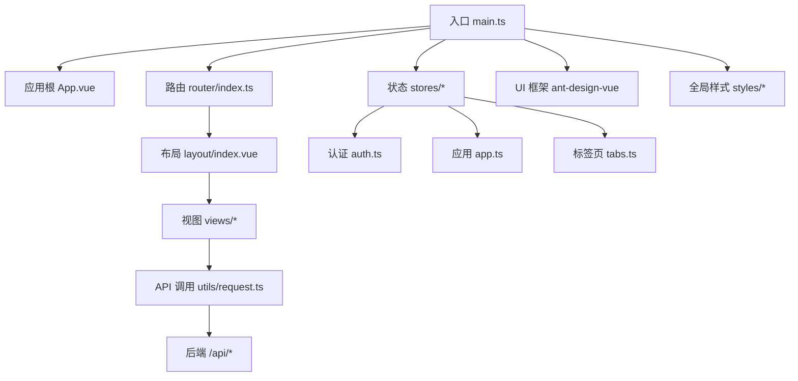
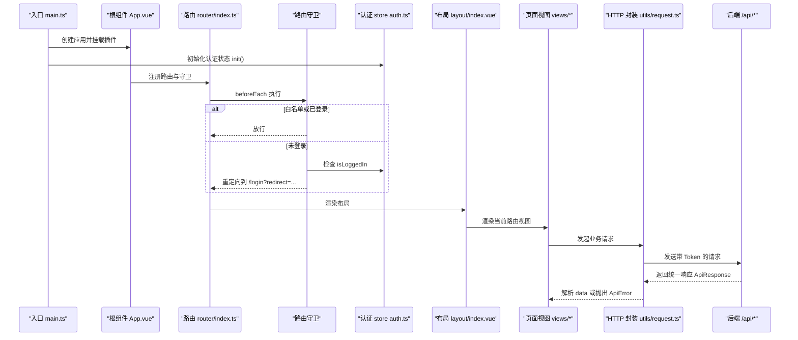
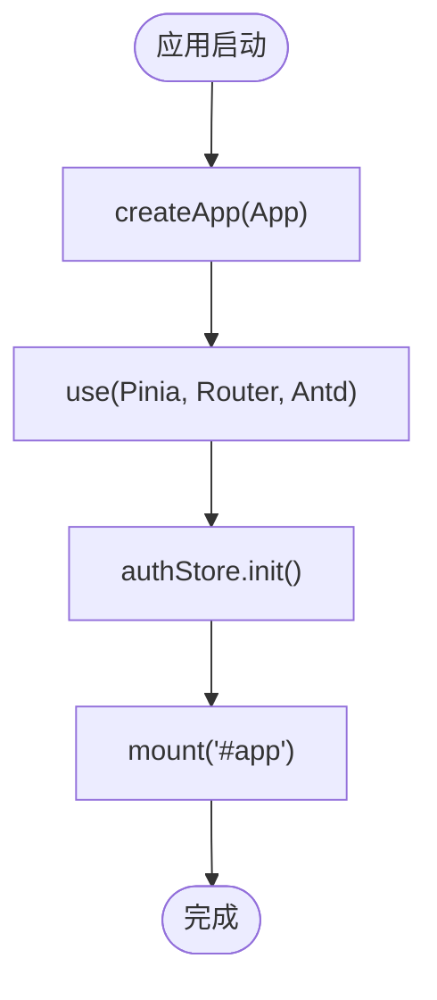
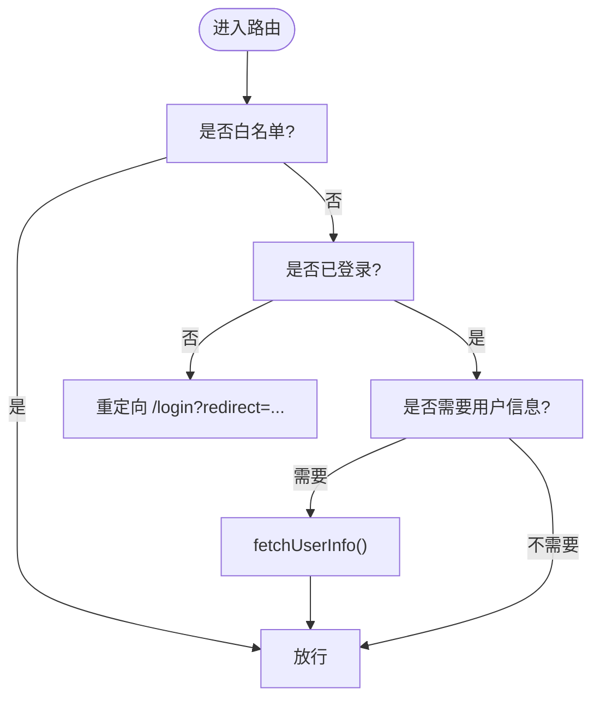
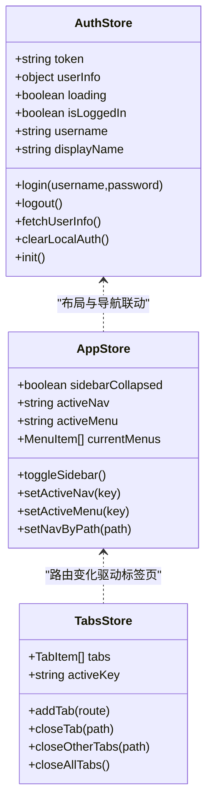
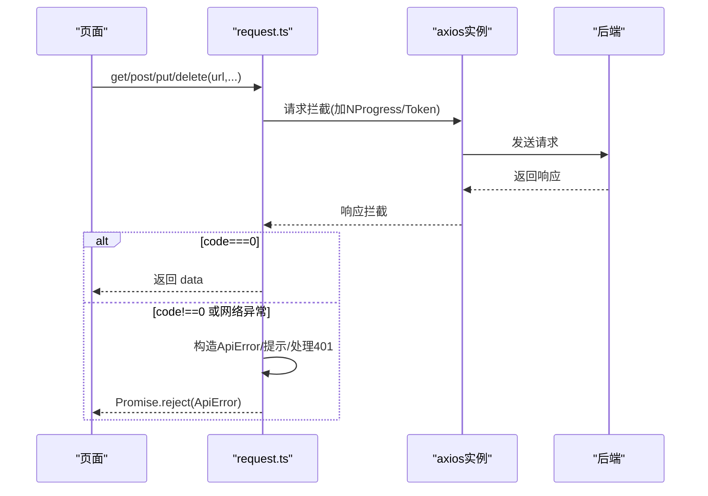
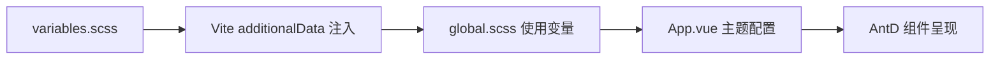
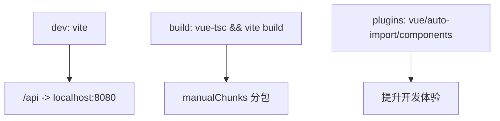
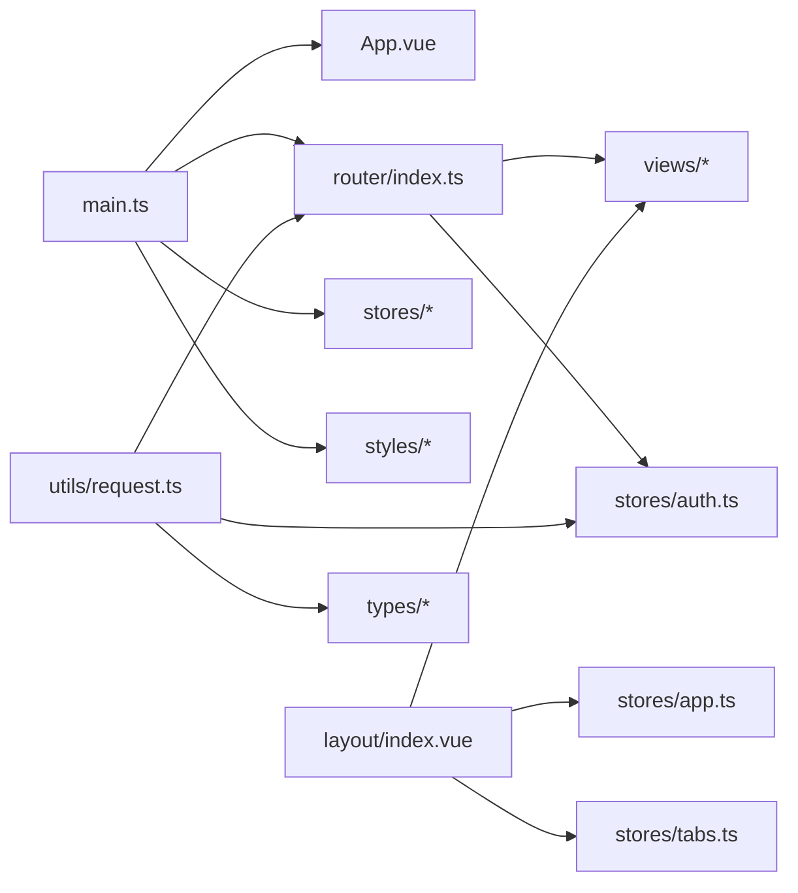

# 应用架构设计

<cite>
**本文引用的文件**   
- [package.json](file://admin-web/package.json)
- [vite.config.ts](file://admin-web/vite.config.ts)
- [main.ts](file://admin-web/src/main.ts)
- [App.vue](file://admin-web/src/App.vue)
- [router/index.ts](file://admin-web/src/router/index.ts)
- [stores/index.ts](file://admin-web/src/stores/index.ts)
- [stores/auth.ts](file://admin-web/src/stores/auth.ts)
- [stores/app.ts](file://admin-web/src/stores/app.ts)
- [stores/tabs.ts](file://admin-web/src/stores/tabs.ts)
- [utils/request.ts](file://admin-web/src/utils/request.ts)
- [styles/variables.scss](file://admin-web/src/styles/variables.scss)
- [styles/global.scss](file://admin-web/src/styles/global.scss)
- [styles/index.scss](file://admin-web/src/styles/index.scss)
- [types/api.ts](file://admin-web/src/types/api.ts)
- [types/router.ts](file://admin-web/src/types/router.ts)
</cite>

## 目录
1. [简介](#简介)
2. [项目结构](#项目结构)
3. [核心组件](#核心组件)
4. [架构总览](#架构总览)
5. [详细组件分析](#详细组件分析)
6. [依赖关系分析](#依赖关系分析)
7. [性能考虑](#性能考虑)
8. [故障排查指南](#故障排查指南)
9. [结论](#结论)
10. [附录](#附录)

## 简介
本文件面向管理后台前端工程，基于 Vue3 + TypeScript + Ant Design Vue 技术栈，结合 Vite 构建工具与 Pinia 状态管理，系统化阐述应用初始化流程、模块依赖关系、插件配置、Vite 构建与开发环境策略、目录组织与代码规范、第三方库集成、全局样式与主题定制、性能优化（含分包与懒加载）、错误监控与日志记录、调试工具配置等。文档以仓库实际源码为依据，提供可追溯的“章节来源”和“图示来源”。

## 项目结构
管理后台位于 admin-web 子工程，采用按功能域划分的目录组织方式：
- src/api：按业务域划分 API 接口定义
- src/layout：布局容器
- src/router：路由与守卫
- src/stores：Pinia 状态模块（认证、应用、标签页）
- src/styles：全局样式与变量
- src/types：类型定义（API、路由扩展）
- src/utils：通用工具（请求封装）
- src/views：页面视图（按模块分目录）
- 根级配置文件：package.json、vite.config.ts、tsconfig*.json

**图示来源**
- [main.ts:1-20](file://admin-web/src/main.ts#L1-L20)
- [App.vue:1-46](file://admin-web/src/App.vue#L1-L46)
- [router/index.ts:1-134](file://admin-web/src/router/index.ts#L1-L134)
- [layout/index.vue:1-468](file://admin-web/src/layout/index.vue#L1-L468)
- [stores/auth.ts:1-103](file://admin-web/src/stores/auth.ts#L1-L103)
- [stores/app.ts:1-87](file://admin-web/src/stores/app.ts#L1-L87)
- [stores/tabs.ts:1-69](file://admin-web/src/stores/tabs.ts#L1-L69)
- [utils/request.ts:1-176](file://admin-web/src/utils/request.ts#L1-L176)

**章节来源**
- [package.json:1-38](file://admin-web/package.json#L1-L38)
- [vite.config.ts:1-60](file://admin-web/vite.config.ts#L1-L60)
- [main.ts:1-20](file://admin-web/src/main.ts#L1-L20)

## 核心组件
- 应用初始化与插件装配
  - 创建 Vue 应用实例，挂载 Pinia、Router、Ant Design Vue，并注入全局样式与主题。
  - 在启动时恢复登录态，确保刷新后保持会话。
- 路由与导航
  - 使用 createWebHistory，集中声明常量路由，支持懒加载与元信息控制标题、图标、缓存等。
  - 前置守卫实现白名单校验、未登录跳转、用户信息预取。
- 状态管理（Pinia）
  - auth：Token 持久化、登录/登出、用户信息获取、401 清理本地态。
  - app：一级导航与二级菜单映射、选中态同步。
  - tabs：多标签页增删改查与激活态管理。
- HTTP 客户端
  - 基于 axios 封装统一请求方法，内置进度条、拦截器、错误提示、401/403/404/500 处理、traceId 透传。
- 全局样式与主题
  - SCSS 变量集中管理，通过 Vite additionalData 注入；全局覆盖 AntD 组件样式；CSS 变量暴露给 JS 使用。
- 类型系统
  - 统一响应体 ApiResponse、分页 PageResult、登录相关 LoginParams/LoginResult/UserInfo、路由元信息扩展。

**章节来源**
- [main.ts:1-20](file://admin-web/src/main.ts#L1-L20)
- [App.vue:1-46](file://admin-web/src/App.vue#L1-L46)
- [router/index.ts:1-134](file://admin-web/src/router/index.ts#L1-L134)
- [stores/auth.ts:1-103](file://admin-web/src/stores/auth.ts#L1-L103)
- [stores/app.ts:1-87](file://admin-web/src/stores/app.ts#L1-L87)
- [stores/tabs.ts:1-69](file://admin-web/src/stores/tabs.ts#L1-L69)
- [utils/request.ts:1-176](file://admin-web/src/utils/request.ts#L1-L176)
- [styles/variables.scss:1-49](file://admin-web/src/styles/variables.scss#L1-L49)
- [styles/global.scss:1-238](file://admin-web/src/styles/global.scss#L1-L238)
- [types/api.ts:1-55](file://admin-web/src/types/api.ts#L1-L55)
- [types/router.ts:1-17](file://admin-web/src/types/router.ts#L1-L17)

## 架构总览
下图展示从应用启动到页面渲染、鉴权与数据请求的关键路径，以及各模块之间的协作关系。

**图示来源**
- [main.ts:1-20](file://admin-web/src/main.ts#L1-L20)
- [App.vue:1-46](file://admin-web/src/App.vue#L1-L46)
- [router/index.ts:1-134](file://admin-web/src/router/index.ts#L1-L134)
- [stores/auth.ts:1-103](file://admin-web/src/stores/auth.ts#L1-L103)
- [layout/index.vue:1-468](file://admin-web/src/layout/index.vue#L1-L468)
- [utils/request.ts:1-176](file://admin-web/src/utils/request.ts#L1-L176)

## 详细组件分析

### 应用初始化与插件配置
- 插件装配顺序：Pinia -> Router -> Antd，最后挂载到 #app。
- 启动阶段调用 useAuthStore().init()，若存在本地 token 则拉取用户信息，保证刷新后状态一致。
- 根组件 App.vue 通过 a-config-provider 注入语言包 zh_CN 与主题 token/components 配置，统一 UI 风格。

**图示来源**
- [main.ts:1-20](file://admin-web/src/main.ts#L1-L20)
- [App.vue:1-46](file://admin-web/src/App.vue#L1-L46)

**章节来源**
- [main.ts:1-20](file://admin-web/src/main.ts#L1-L20)
- [App.vue:1-46](file://admin-web/src/App.vue#L1-L46)

### 路由与权限控制
- 路由模式：history 模式，基础路径由部署决定。
- 路由表：constantRoutes 集中声明，包含登录、布局及子路由、错误页与通配符。
- 懒加载：所有视图均使用动态 import，减少首屏体积。
- 元信息：title、icon、cache 等用于布局与 keep-alive 控制。
- 前置守卫：
  - 白名单：/login 允许直接访问，已登录访问 /login 自动跳转到 /dashboard。
  - 未登录：重定向至 /login 并携带 redirect 参数。
  - 用户信息：首次进入需拉取用户信息，避免后续重复请求。

**图示来源**
- [router/index.ts:1-134](file://admin-web/src/router/index.ts#L1-L134)
- [stores/auth.ts:1-103](file://admin-web/src/stores/auth.ts#L1-L103)

**章节来源**
- [router/index.ts:1-134](file://admin-web/src/router/index.ts#L1-L134)

### 状态管理（Pinia）
- auth 模块
  - 字段：token、userInfo、loading；计算属性：isLoggedIn、username、displayName。
  - 方法：login、logout、fetchUserInfo、clearLocalAuth、init。
  - 安全：写入 token 前进行非空校验；401 场景仅清理本地态，避免递归退出。
- app 模块
  - 维护一级导航与二级菜单映射，提供 setNavByPath 根据路由反推选中项。
- tabs 模块
  - 管理多标签页集合与激活键，支持关闭其他/全部、回退激活态。

**图示来源**
- [stores/auth.ts:1-103](file://admin-web/src/stores/auth.ts#L1-L103)
- [stores/app.ts:1-87](file://admin-web/src/stores/app.ts#L1-L87)
- [stores/tabs.ts:1-69](file://admin-web/src/stores/tabs.ts#L1-L69)

**章节来源**
- [stores/auth.ts:1-103](file://admin-web/src/stores/auth.ts#L1-L103)
- [stores/app.ts:1-87](file://admin-web/src/stores/app.ts#L1-L87)
- [stores/tabs.ts:1-69](file://admin-web/src/stores/tabs.ts#L1-L69)

### HTTP 客户端与错误处理
- 基础配置：baseURL=/api，超时 30s，默认 JSON 头。
- 请求拦截：
  - 启动 NProgress。
  - 除登录接口外，自动附加 Authorization: Bearer <token>。
- 响应拦截：
  - 成功：code===0 时返回 data。
  - 业务错误：构造 ApiError，保留 code/status/traceId；401 清理本地态并跳转登录（防并发）。
  - 网络错误：区分 401/403/404/500 等，显示友好提示；401 登录接口不触发跳转。
- 封装方法：get/post/put/delete，支持 silentError 静默错误开关。

**图示来源**
- [utils/request.ts:1-176](file://admin-web/src/utils/request.ts#L1-L176)
- [types/api.ts:1-55](file://admin-web/src/types/api.ts#L1-L55)

**章节来源**
- [utils/request.ts:1-176](file://admin-web/src/utils/request.ts#L1-L176)
- [types/api.ts:1-55](file://admin-web/src/types/api.ts#L1-L55)

### 全局样式与主题定制
- 变量体系：colors、text、bg、border、spacing、radius、shadow 等集中在 variables.scss。
- 全局样式：global.scss 统一重置、滚动条、卡片、表格、按钮、表单、标签、NProgress 等样式，并通过 CSS 变量暴露给 JS。
- 注入机制：Vite css.preprocessorOptions.scss.additionalData 将 variables.scss 作为 @use ... as * 注入，无需在各文件中重复引入。
- 主题定制：App.vue 中 a-config-provider 设置 token 与 components 级别样式，覆盖主色、圆角、表格背景等。

**图示来源**
- [styles/variables.scss:1-49](file://admin-web/src/styles/variables.scss#L1-L49)
- [styles/global.scss:1-238](file://admin-web/src/styles/global.scss#L1-L238)
- [styles/index.scss:1-3](file://admin-web/src/styles/index.scss#L1-L3)
- [App.vue:1-46](file://admin-web/src/App.vue#L1-L46)
- [vite.config.ts:39-46](file://admin-web/vite.config.ts#L39-L46)

**章节来源**
- [styles/variables.scss:1-49](file://admin-web/src/styles/variables.scss#L1-L49)
- [styles/global.scss:1-238](file://admin-web/src/styles/global.scss#L1-L238)
- [styles/index.scss:1-3](file://admin-web/src/styles/index.scss#L1-L3)
- [App.vue:1-46](file://admin-web/src/App.vue#L1-L46)
- [vite.config.ts:39-46](file://admin-web/vite.config.ts#L39-L46)

### 构建与开发环境配置（Vite）
- 插件：
  - @vitejs/plugin-vue：Vue SFC 支持。
  - unplugin-auto-import：自动导入 vue/vue-router/pinia API，生成 dts。
  - unplugin-vue-components：按需引入 Ant Design Vue 组件与样式（importStyle:false，样式由全局注入）。
- 别名：@ 指向 src。
- 开发服务器：端口 3000，代理 /api 到 http://localhost:8080，重写去除 /api 前缀。
- CSS 预处理：SCSS additionalData 注入 variables.scss。
- 生产构建：rollupOptions.output.manualChunks 对 vendor 进行手动分包，降低主包体积。

**图示来源**
- [vite.config.ts:1-60](file://admin-web/vite.config.ts#L1-L60)
- [package.json:6-12](file://admin-web/package.json#L6-L12)

**章节来源**
- [vite.config.ts:1-60](file://admin-web/vite.config.ts#L1-L60)
- [package.json:1-38](file://admin-web/package.json#L1-L38)

### 第三方库集成方案
- UI 与图标：ant-design-vue 与 @ant-design/icons-vue，通过组件解析器按需引入。
- 状态与路由：pinia、vue-router。
- HTTP 与进度：axios、nprogress。
- 时间处理：dayjs。
- 构建期：sass、unplugin-* 系列。

**章节来源**
- [package.json:13-33](file://admin-web/package.json#L13-L33)
- [vite.config.ts:9-23](file://admin-web/vite.config.ts#L9-L23)

### 代码规范与命名约定
- 模块划分：按功能域组织 api、views、stores、router、types、utils、styles。
- 命名约定：
  - 路由 meta.title 用于页面标题与标签页标题。
  - 组件与页面使用 PascalCase，模块文件使用小写+连字符。
  - 类型定义集中于 types 目录，统一 ApiResponse/PageResult 等。
- 样式规范：
  - 变量集中管理，禁止硬编码颜色与尺寸。
  - 通过 CSS 变量暴露给 JS，便于运行时主题切换。

**章节来源**
- [router/index.ts:1-134](file://admin-web/src/router/index.ts#L1-L134)
- [types/api.ts:1-55](file://admin-web/src/types/api.ts#L1-L55)
- [styles/variables.scss:1-49](file://admin-web/src/styles/variables.scss#L1-L49)
- [styles/global.scss:1-238](file://admin-web/src/styles/global.scss#L1-L238)

## 依赖关系分析
- 内部依赖
  - main.ts 依赖 App.vue、router、stores、styles。
  - router 依赖 stores/auth 与 views/*。
  - layout 依赖 stores/app、stores/tabs、stores/auth 与 views/*。
  - utils/request 依赖 stores/auth、router、types。
- 外部依赖
  - Vue 生态：vue、vue-router、pinia。
  - UI 生态：ant-design-vue、@ant-design/icons-vue。
  - 工具：axios、dayjs、nprogress。
  - 构建：vite、typescript、sass、unplugin-*。

**图示来源**
- [main.ts:1-20](file://admin-web/src/main.ts#L1-L20)
- [router/index.ts:1-134](file://admin-web/src/router/index.ts#L1-L134)
- [layout/index.vue:1-468](file://admin-web/src/layout/index.vue#L1-L468)
- [utils/request.ts:1-176](file://admin-web/src/utils/request.ts#L1-L176)
- [stores/auth.ts:1-103](file://admin-web/src/stores/auth.ts#L1-L103)
- [stores/app.ts:1-87](file://admin-web/src/stores/app.ts#L1-L87)
- [stores/tabs.ts:1-69](file://admin-web/src/stores/tabs.ts#L1-L69)
- [types/api.ts:1-55](file://admin-web/src/types/api.ts#L1-L55)

**章节来源**
- [package.json:13-33](file://admin-web/package.json#L13-L33)
- [vite.config.ts:1-60](file://admin-web/vite.config.ts#L1-L60)

## 性能考虑
- 代码分割与懒加载
  - 路由视图使用动态 import，按需加载页面。
  - manualChunks 将 vue/vue-router/pinia、ant-design-vue、axios/dayjs/nprogress 分别打包为独立 vendor 块，利于浏览器缓存与并行下载。
- 资源优化
  - 按需引入 AntD 组件与图标，减少无用代码。
  - SCSS 变量集中注入，避免重复编译。
- 运行时优化
  - keep-alive 缓存关键页面（如 Dashboard），减少重复渲染。
  - 列表与表格建议配合虚拟滚动与分页，避免一次性渲染大量 DOM。
- 构建优化
  - 生产构建开启 tree-shaking（由 Vite 默认启用）。
  - 图片与静态资源建议使用压缩与 CDN 分发。

[本节为通用指导，不直接分析具体文件]

## 故障排查指南
- 登录与鉴权
  - 现象：登录后仍被重定向到登录页。
  - 排查：检查 authStore.token 是否正确写入 localStorage；确认请求拦截器是否附带 Authorization；查看 401 分支是否误清理本地态。
- 网络与错误提示
  - 现象：请求失败无提示或提示不准确。
  - 排查：确认 response 拦截器是否捕获到后端 message 与 traceId；必要时在调用处传入 silentError 以抑制全局提示。
- 路由与标题
  - 现象：页面标题不正确或标签页不同步。
  - 排查：检查路由 meta.title；确认 layout 中 watch route.path 是否更新 tabs 与 appStore。
- 样式与主题
  - 现象：组件样式未按预期覆盖。
  - 排查：确认 additionalData 注入生效；检查 App.vue 主题 token/components 配置优先级；避免局部覆盖导致冲突。

**章节来源**
- [utils/request.ts:1-176](file://admin-web/src/utils/request.ts#L1-L176)
- [router/index.ts:1-134](file://admin-web/src/router/index.ts#L1-L134)
- [layout/index.vue:1-468](file://admin-web/src/layout/index.vue#L1-L468)
- [App.vue:1-46](file://admin-web/src/App.vue#L1-L46)

## 结论
本项目以清晰的模块化结构与统一的类型/样式/请求规范为基础，借助 Vite 与按需引入策略实现良好的开发体验与构建性能。通过路由守卫与 Pinia 的状态管理，实现了稳健的鉴权与会话恢复；通过全局样式与主题配置，保证了 UI 一致性。建议在后续迭代中持续完善错误上报与日志采集，并结合业务特性进一步优化首屏与交互性能。

[本节为总结性内容，不直接分析具体文件]

## 附录
- 脚本命令
  - dev：启动开发服务
  - build：类型检查与构建
  - preview：预览构建产物
  - lint/format：代码检查与格式化
- 环境变量与代理
  - 开发代理：/api -> http://localhost:8080，重写去除 /api 前缀
- 类型契约
  - 统一响应体 ApiResponse、分页 PageResult、登录相关 LoginParams/LoginResult/UserInfo

**章节来源**
- [package.json:6-12](file://admin-web/package.json#L6-L12)
- [vite.config.ts:29-38](file://admin-web/vite.config.ts#L29-L38)
- [types/api.ts:1-55](file://admin-web/src/types/api.ts#L1-L55)