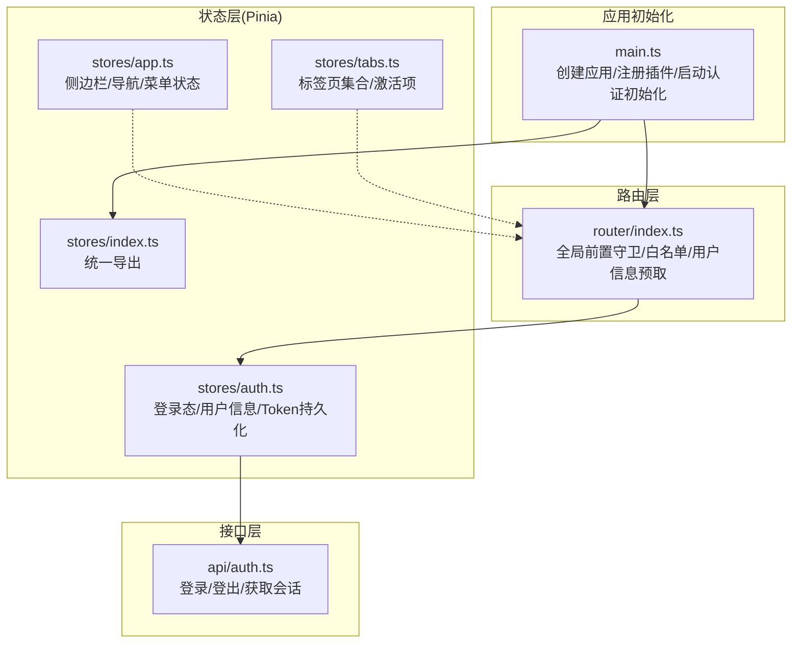
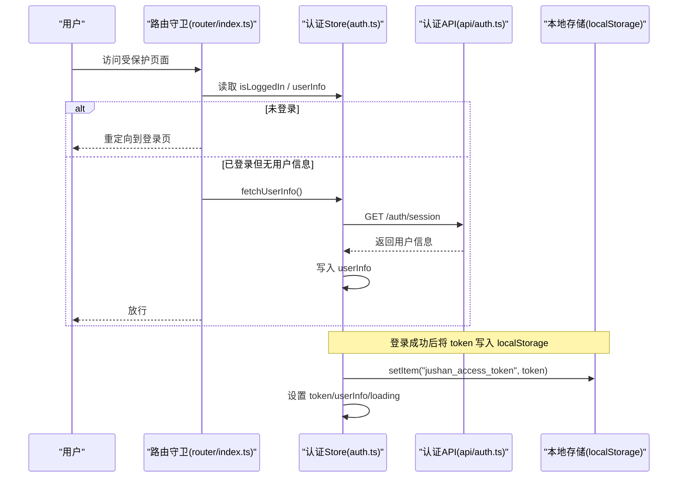
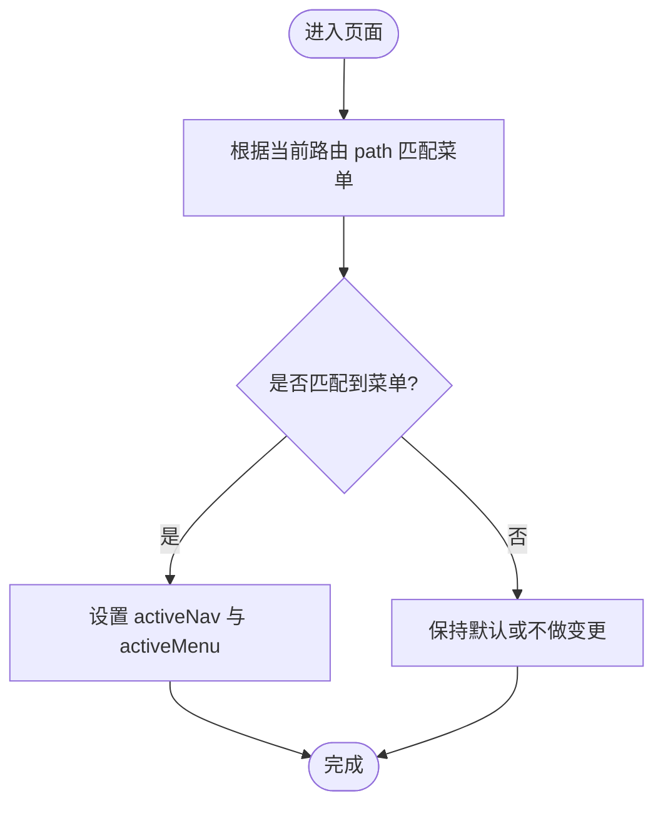
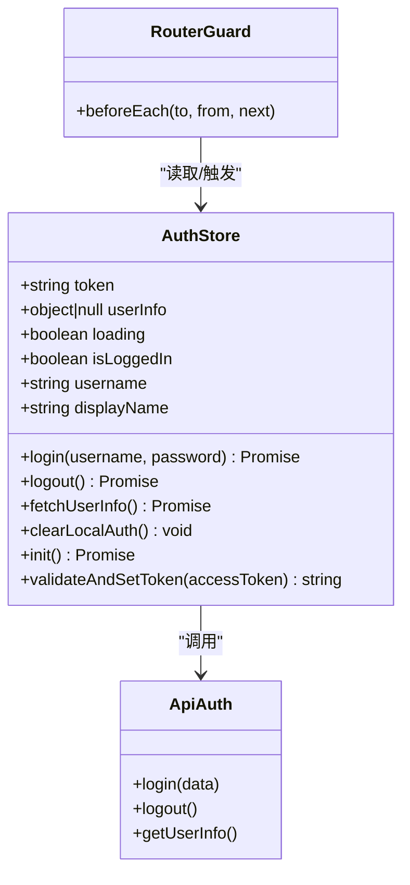
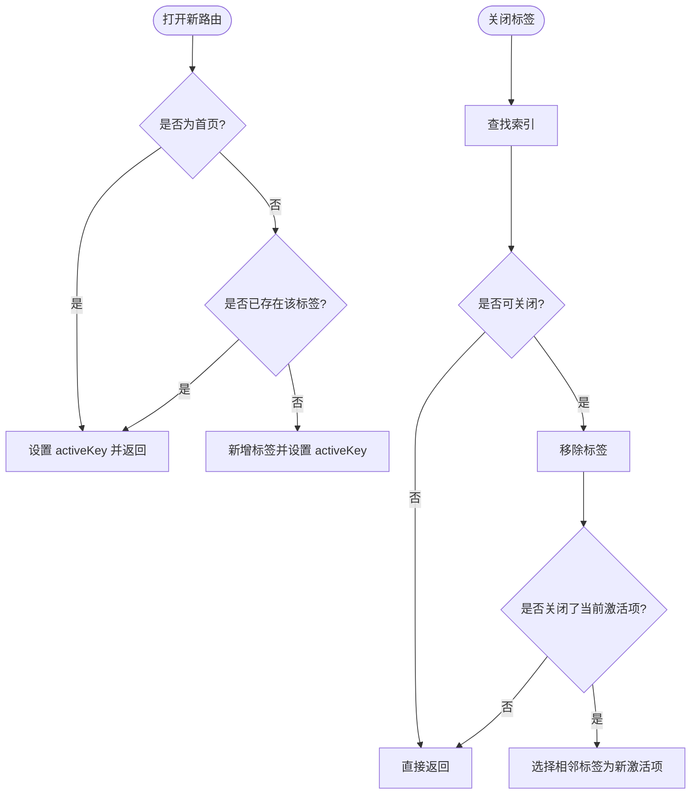
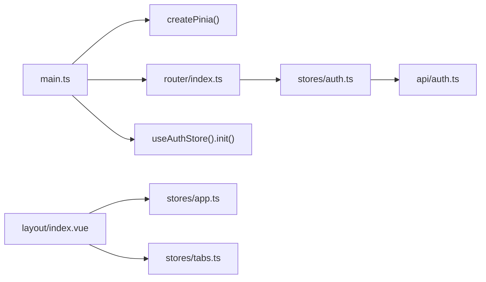

# 状态管理

<cite>
**本文引用的文件**
- [admin-web/src/stores/index.ts](file://admin-web/src/stores/index.ts)
- [admin-web/src/stores/app.ts](file://admin-web/src/stores/app.ts)
- [admin-web/src/stores/auth.ts](file://admin-web/src/stores/auth.ts)
- [admin-web/src/stores/tabs.ts](file://admin-web/src/stores/tabs.ts)
- [admin-web/src/main.ts](file://admin-web/src/main.ts)
- [admin-web/src/router/index.ts](file://admin-web/src/router/index.ts)
- [admin-web/src/api/auth.ts](file://admin-web/src/api/auth.ts)
- [admin-web/src/types/index.ts](file://admin-web/src/types/index.ts)
</cite>

## 目录
1. [简介](#简介)
2. [项目结构](#项目结构)
3. [核心组件](#核心组件)
4. [架构总览](#架构总览)
5. [详细组件分析](#详细组件分析)
6. [依赖关系分析](#依赖关系分析)
7. [性能与优化](#性能与优化)
8. [故障排查指南](#故障排查指南)
9. [结论](#结论)
10. [附录：最佳实践与常见模式](#附录最佳实践与常见模式)

## 简介
本文件聚焦于管理后台的前端状态管理，基于 Pinia 的 Composition API 风格 Store 组织方式，围绕应用状态（app）、认证状态（auth）和标签页状态（tabs）三大领域进行系统化说明。文档涵盖状态持久化、数据同步、响应式更新机制、跨组件共享、调试与测试方法、错误处理与迁移策略，并给出可落地的最佳实践与常见模式。

## 项目结构
前端采用按功能域划分的 Store 组织方式，每个 Store 对应一个业务领域，并通过统一的导出入口集中暴露。

图表来源
- [admin-web/src/main.ts:1-20](file://admin-web/src/main.ts#L1-L20)
- [admin-web/src/router/index.ts:1-134](file://admin-web/src/router/index.ts#L1-L134)
- [admin-web/src/stores/index.ts:1-4](file://admin-web/src/stores/index.ts#L1-L4)
- [admin-web/src/stores/app.ts:1-87](file://admin-web/src/stores/app.ts#L1-L87)
- [admin-web/src/stores/auth.ts:1-103](file://admin-web/src/stores/auth.ts#L1-L103)
- [admin-web/src/stores/tabs.ts:1-69](file://admin-web/src/stores/tabs.ts#L1-L69)
- [admin-web/src/api/auth.ts:1-18](file://admin-web/src/api/auth.ts#L1-L18)

章节来源
- [admin-web/src/main.ts:1-20](file://admin-web/src/main.ts#L1-L20)
- [admin-web/src/stores/index.ts:1-4](file://admin-web/src/stores/index.ts#L1-L4)

## 核心组件
- 应用状态（app）：维护侧边栏折叠、一级导航、二级菜单及当前选中项，提供根据路径反查导航的方法，用于布局联动。
- 认证状态（auth）：封装 Token 读写、登录/登出流程、用户信息拉取与本地恢复，提供登录态判断与显示名计算。
- 标签页状态（tabs）：维护标签页列表与激活项，支持新增、关闭、关闭其他、关闭全部等常用操作，并与首页不可关闭规则配合。

章节来源
- [admin-web/src/stores/app.ts:1-87](file://admin-web/src/stores/app.ts#L1-L87)
- [admin-web/src/stores/auth.ts:1-103](file://admin-web/src/stores/auth.ts#L1-L103)
- [admin-web/src/stores/tabs.ts:1-69](file://admin-web/src/stores/tabs.ts#L1-L69)

## 架构总览
Pinia Store 作为单一事实源，被路由守卫、布局组件与页面组件共同消费。认证流程在应用启动时通过 init 恢复登录态；路由守卫在每次跳转前校验登录态并在必要时预取用户信息；标签页随路由变化由上层组件驱动更新。

图表来源
- [admin-web/src/router/index.ts:106-131](file://admin-web/src/router/index.ts#L106-L131)
- [admin-web/src/stores/auth.ts:32-55](file://admin-web/src/stores/auth.ts#L32-L55)
- [admin-web/src/api/auth.ts:4-17](file://admin-web/src/api/auth.ts#L4-L17)

## 详细组件分析

### 应用状态（app）
- 职责边界
  - 维护侧边栏折叠状态、当前一级导航与二级菜单。
  - 提供“根据路径设置导航”的能力，便于在路由切换后保持菜单高亮一致。
- 关键设计点
  - 使用 computed 派生当前菜单，避免冗余状态。
  - setActiveNav 在切换一级导航时自动选择首个子菜单，保证默认行为。
  - setNavByPath 通过遍历菜单映射反向定位导航，提升与路由的一致性。
- 典型用法
  - 布局组件监听 activeMenu 渲染内容区。
  - 路由切换完成后调用 setNavByPath 以维持菜单高亮。

图表来源
- [admin-web/src/stores/app.ts:74-83](file://admin-web/src/stores/app.ts#L74-L83)

章节来源
- [admin-web/src/stores/app.ts:1-87](file://admin-web/src/stores/app.ts#L1-L87)

### 认证状态（auth）
- 职责边界
  - 管理登录态（token）、用户信息（userInfo）、加载状态（loading）。
  - 提供登录、退出、获取用户信息、清理本地状态、初始化等方法。
- 关键设计点
  - Token 持久化：登录成功时将 token 写入 localStorage，应用启动时从本地恢复。
  - 安全校验：validateAndSetToken 对 accessToken 做非空与类型校验，失败则抛错不写本地。
  - 健壮性：logout 无论后端是否成功都会清理本地状态并跳转登录页；clearLocalAuth 仅清理本地，避免 401 递归。
  - 派生状态：isLoggedIn、username、displayName 通过 computed 派生，减少重复逻辑。
- 与路由协作
  - 路由守卫在首次访问受保护页面时若缺少 userInfo，会主动调用 fetchUserInfo 预取。
  - 应用启动时调用 useAuthStore().init() 实现刷新后的登录态恢复。

图表来源
- [admin-web/src/stores/auth.ts:9-102](file://admin-web/src/stores/auth.ts#L9-L102)
- [admin-web/src/router/index.ts:108-131](file://admin-web/src/router/index.ts#L108-L131)
- [admin-web/src/api/auth.ts:4-17](file://admin-web/src/api/auth.ts#L4-L17)

章节来源
- [admin-web/src/stores/auth.ts:1-103](file://admin-web/src/stores/auth.ts#L1-L103)
- [admin-web/src/router/index.ts:106-131](file://admin-web/src/router/index.ts#L106-L131)
- [admin-web/src/main.ts:16-17](file://admin-web/src/main.ts#L16-L17)
- [admin-web/src/api/auth.ts:1-18](file://admin-web/src/api/auth.ts#L1-L18)

### 标签页状态（tabs）
- 职责边界
  - 维护标签页集合与激活项，控制首页标签不可关闭。
  - 提供 addTab、closeTab、closeOtherTabs、closeAllTabs 等操作。
- 关键设计点
  - 首页标签 HOME_TAB 标记为不可关闭，关闭其他/全部时会保留。
  - 关闭当前标签时，自动选择相邻标签作为新的激活项，避免空白。
  - 与路由 meta.title 联动生成标题，确保标签名称与路由元信息一致。
- 典型用法
  - 布局组件监听 tabs 与 activeKey，渲染标签栏并处理点击/关闭事件。
  - 路由切换时由外层组件调用 addTab 更新标签集合。

图表来源
- [admin-web/src/stores/tabs.ts:19-67](file://admin-web/src/stores/tabs.ts#L19-L67)

章节来源
- [admin-web/src/stores/tabs.ts:1-69](file://admin-web/src/stores/tabs.ts#L1-L69)

## 依赖关系分析
- 模块耦合
  - auth 依赖 api/auth 与 router（登出跳转），main 在应用启动时调用 auth.init。
  - app 与 tabs 主要被布局与视图组件消费，间接与 router 联动（通过路径/元信息）。
- 外部依赖
  - Pinia 提供响应式状态容器与组合式 API。
  - Vue Router 提供路由守卫与导航钩子。
  - localStorage 用于 Token 持久化。
- 潜在风险
  - 若路由 meta.title 缺失，标签标题可能显示为“未命名”，需在上层保证元信息完整。
  - 若 getUserInfo 失败且未正确清理本地状态，可能导致后续请求持续 401。

图表来源
- [admin-web/src/main.ts:1-20](file://admin-web/src/main.ts#L1-L20)
- [admin-web/src/router/index.ts:1-134](file://admin-web/src/router/index.ts#L1-L134)
- [admin-web/src/stores/auth.ts:1-103](file://admin-web/src/stores/auth.ts#L1-L103)
- [admin-web/src/stores/app.ts:1-87](file://admin-web/src/stores/app.ts#L1-L87)
- [admin-web/src/stores/tabs.ts:1-69](file://admin-web/src/stores/tabs.ts#L1-L69)
- [admin-web/src/api/auth.ts:1-18](file://admin-web/src/api/auth.ts#L1-L18)

章节来源
- [admin-web/src/stores/index.ts:1-4](file://admin-web/src/stores/index.ts#L1-L4)

## 性能与优化
- 响应式更新
  - 使用 ref/computed 最小化不必要的重渲染；computed 派生状态避免冗余计算。
- 网络请求
  - 仅在需要时发起用户信息请求（路由守卫与 init），避免重复拉取。
- 标签页
  - 关闭/新增标签时使用数组原地修改与 splice，注意在大数据量场景下考虑虚拟滚动或分页展示。
- 建议
  - 对于大型菜单树，可将 MENU_MAP 抽离为独立配置并按需懒加载。
  - 对频繁读写的状态（如 tabs）可考虑去抖/节流策略，降低高频操作带来的开销。

[本节为通用指导，无需源码引用]

## 故障排查指南
- 登录后仍被重定向到登录页
  - 检查 validateAndSetToken 是否正确执行，确认 accessToken 非空且类型为字符串。
  - 确认 localStorage 中是否存在 jushan_access_token。
- 刷新后无法恢复登录态
  - 确认 main.ts 中已调用 useAuthStore().init()。
  - 检查 fetchUserInfo 是否成功，失败时应清理本地状态。
- 401 循环跳转
  - 优先使用 clearLocalAuth 清理本地状态，避免再次触发远程 logout 导致死循环。
- 标签页标题异常
  - 检查路由 meta.title 是否定义；未定义时将回退为“未命名”。

章节来源
- [admin-web/src/stores/auth.ts:22-30](file://admin-web/src/stores/auth.ts#L22-L30)
- [admin-web/src/stores/auth.ts:45-55](file://admin-web/src/stores/auth.ts#L45-L55)
- [admin-web/src/stores/auth.ts:60-71](file://admin-web/src/stores/auth.ts#L60-L71)
- [admin-web/src/stores/auth.ts:77-81](file://admin-web/src/stores/auth.ts#L77-L81)
- [admin-web/src/stores/tabs.ts:23-26](file://admin-web/src/stores/tabs.ts#L23-L26)
- [admin-web/src/main.ts:16-17](file://admin-web/src/main.ts#L16-L17)

## 结论
本项目采用 Pinia 的组合式 Store 组织方式，围绕 app、auth、tabs 三个核心领域实现了清晰的状态分层与职责划分。通过路由守卫与初始化流程的配合，完成了登录态恢复、用户信息预取与标签页联动。整体方案具备较好的可维护性与扩展性，适合在管理后台场景中持续演进。

[本节为总结性内容，无需源码引用]

## 附录：最佳实践与常见模式
- 状态持久化
  - 将敏感令牌类状态持久化至 localStorage，并在应用启动时恢复；对写入前做严格校验。
- 数据同步
  - 在路由守卫中按需预取必要数据，避免页面内重复请求。
- 响应式更新
  - 尽量使用 computed 派生状态，减少手动同步逻辑。
- 跨组件共享
  - 通过 Pinia Store 暴露方法，组件只关心状态与方法，不关心数据来源。
- 状态调试
  - 使用浏览器 Pinia Devtools 查看状态快照与动作历史；在关键方法前后打印日志辅助定位问题。
- 状态测试
  - 使用 @pinia/testing 创建隔离的 Store 实例，断言状态与方法行为；模拟 API 返回与错误分支。
- 错误处理
  - 对外部依赖（网络、存储）的失败进行兜底处理，确保 UI 处于可用状态。
- 状态迁移
  - 对持久化字段增加版本标识，升级时执行迁移脚本，兼容旧数据结构。
- 常见模式
  - 登录态模式：token + userInfo + isLoggedIn 派生。
  - 标签页模式：集合 + 激活项 + 关闭策略。
  - 导航模式：一级导航 + 二级菜单 + 路径反查。

[本节为通用指导，无需源码引用]