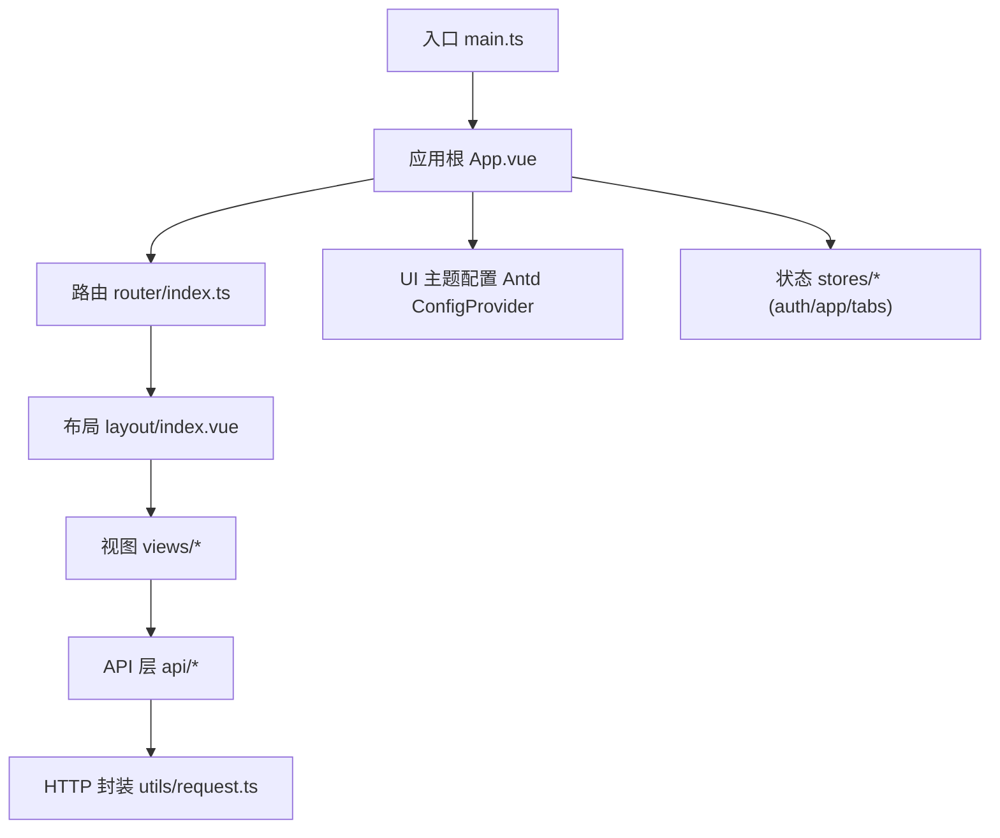
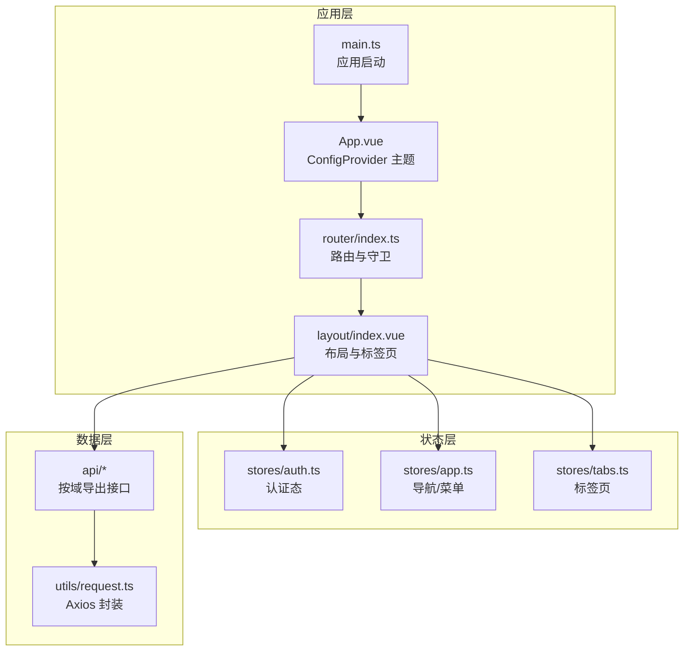
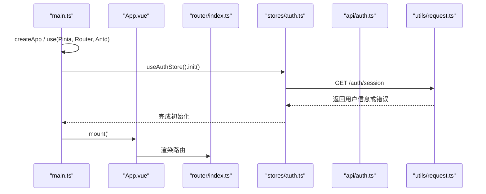
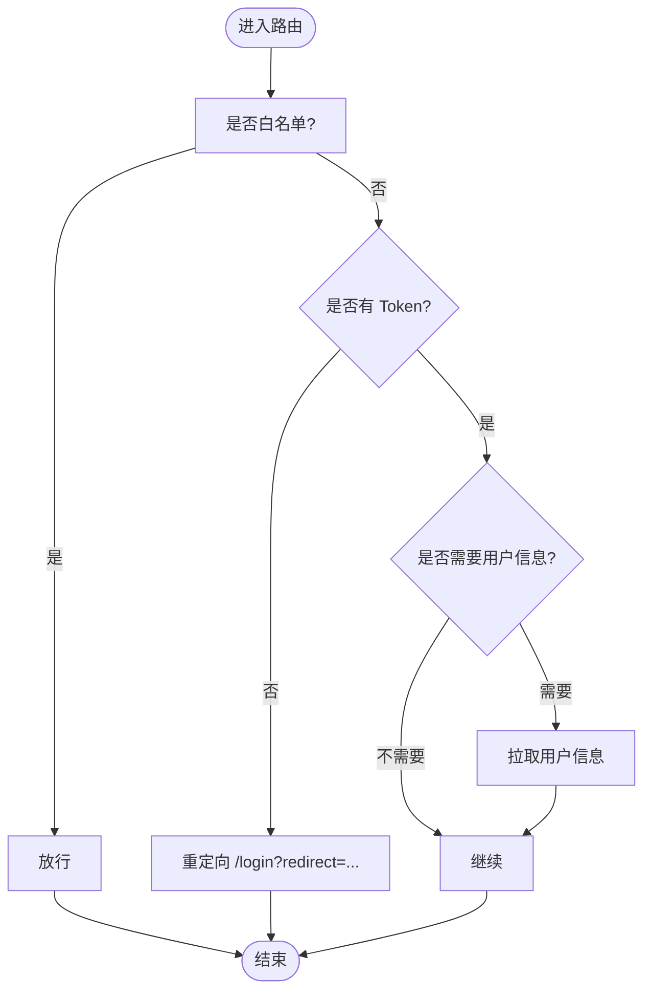
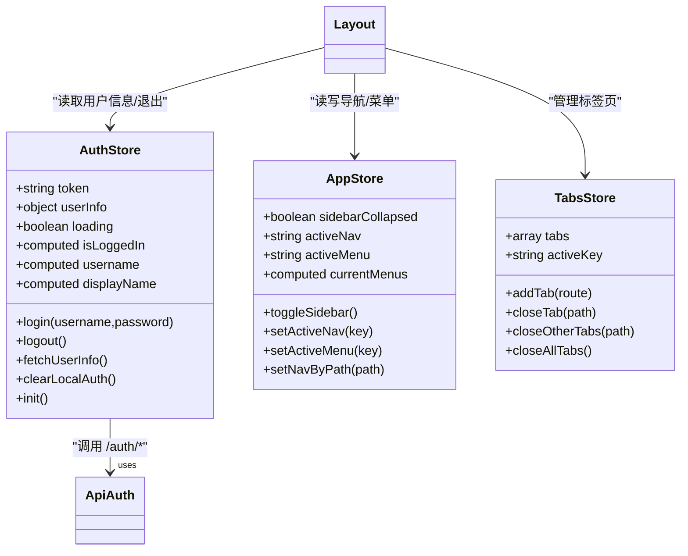
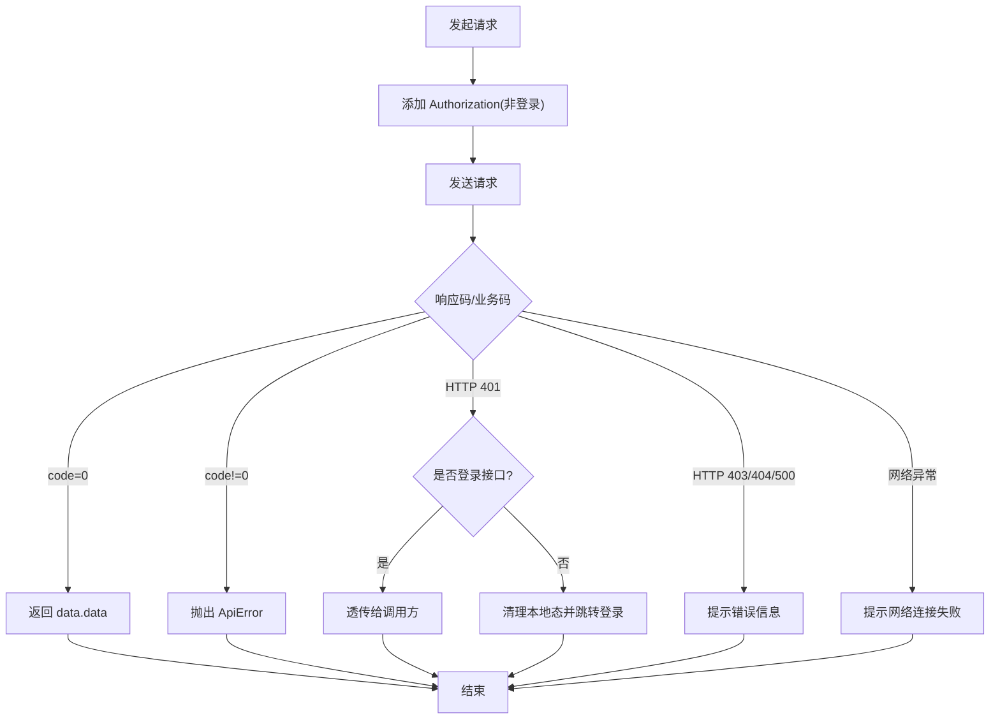
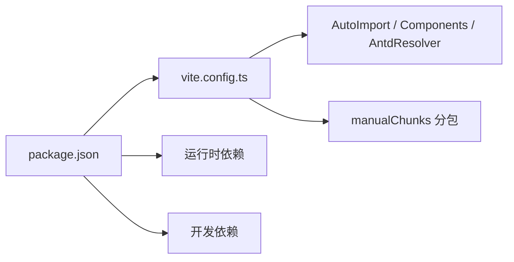

# 管理后台前端

<cite>
**本文引用的文件**   
- [package.json](file://admin-web/package.json)
- [vite.config.ts](file://admin-web/vite.config.ts)
- [main.ts](file://admin-web/src/main.ts)
- [App.vue](file://admin-web/src/App.vue)
- [router/index.ts](file://admin-web/src/router/index.ts)
- [layout/index.vue](file://admin-web/src/layout/index.vue)
- [stores/index.ts](file://admin-web/src/stores/index.ts)
- [stores/auth.ts](file://admin-web/src/stores/auth.ts)
- [stores/app.ts](file://admin-web/src/stores/app.ts)
- [stores/tabs.ts](file://admin-web/src/stores/tabs.ts)
- [utils/request.ts](file://admin-web/src/utils/request.ts)
- [api/auth.ts](file://admin-web/src/api/auth.ts)
- [views/dashboard/index.vue](file://admin-web/src/views/dashboard/index.vue)
- [views/tenant/index.vue](file://admin-web/src/views/tenant/index.vue)
- [views/parking-lot/index.vue](file://admin-web/src/views/parking-lot/index.vue)
- [views/device/index.vue](file://admin-web/src/views/device/index.vue)
- [views/employee/index.vue](file://admin-web/src/views/employee/index.vue)
</cite>

## 目录
1. [简介](#简介)
2. [项目结构](#项目结构)
3. [核心组件](#核心组件)
4. [架构总览](#架构总览)
5. [详细组件分析](#详细组件分析)
6. [依赖分析](#依赖分析)
7. [性能考虑](#性能考虑)
8. [故障排查指南](#故障排查指南)
9. [结论](#结论)
10. [附录](#附录)

## 简介
本设计文档面向“管理后台前端”工程，技术栈为 Vue3 + TypeScript + Ant Design Vue。文档围绕应用初始化、路由与权限、Pinia 状态管理、核心页面模块（仪表盘、租户管理、停车场管理、设备管理、员工管理等）、API 请求封装与错误处理、样式系统与主题定制、开发构建与部署、性能监控与可访问性等方面展开，帮助读者快速理解并高效扩展该工程。

## 项目结构
工程采用按功能域划分的目录组织方式：
- src/api：按业务域拆分 API 接口定义
- src/stores：基于 Pinia 的状态管理模块
- src/router：路由配置与全局守卫
- src/layout：主布局（顶部导航、侧边菜单、标签页、内容区）
- src/views：各业务页面
- src/styles：全局样式与变量
- src/types：类型定义
- src/utils：通用工具（如 HTTP 请求封装）
- vite.config.ts：Vite 构建与插件配置
- package.json：脚本与依赖声明

图表来源
- [main.ts:1-20](file://admin-web/src/main.ts#L1-L20)
- [App.vue:1-46](file://admin-web/src/App.vue#L1-L46)
- [router/index.ts:1-134](file://admin-web/src/router/index.ts#L1-L134)
- [layout/index.vue:1-468](file://admin-web/src/layout/index.vue#L1-L468)
- [utils/request.ts:1-176](file://admin-web/src/utils/request.ts#L1-L176)

章节来源
- [package.json:1-38](file://admin-web/package.json#L1-L38)
- [vite.config.ts:1-60](file://admin-web/vite.config.ts#L1-L60)
- [main.ts:1-20](file://admin-web/src/main.ts#L1-L20)

## 核心组件
- 应用初始化
  - 创建 Vue 应用实例，注册 Pinia、Router、Ant Design Vue 全局组件库
  - 在挂载前恢复认证态（从本地存储读取 token 并拉取用户信息）
- 主题与国际化
  - 通过 Antd ConfigProvider 注入中文语言包与主题 token
  - 统一品牌色、圆角、控件高度等视觉规范
- 路由与守卫
  - 常量路由表集中管理，支持懒加载
  - 全局前置守卫实现白名单、登录态校验、未登录跳转、首次拉取用户信息
- 状态管理（Pinia）
  - auth：登录态、用户信息、token 持久化、退出清理
  - app：一级导航、二级菜单、当前选中项联动
  - tabs：多标签页增删改查与激活切换
- HTTP 请求封装
  - Axios 实例统一 baseURL、超时、拦截器
  - 请求头自动注入 Authorization；响应统一业务码处理、401/403/404/500 分支处理、NProgress 进度条
- 布局与交互
  - 顶部导航（折叠菜单、刷新、全屏、用户下拉）
  - 左侧菜单（根据一级导航动态渲染）
  - 标签页（新增、关闭、关闭其他/全部、刷新当前）
  - 内容区使用 keep-alive 缓存与过渡动画

章节来源
- [main.ts:1-20](file://admin-web/src/main.ts#L1-L20)
- [App.vue:1-46](file://admin-web/src/App.vue#L1-L46)
- [router/index.ts:1-134](file://admin-web/src/router/index.ts#L1-L134)
- [stores/auth.ts:1-103](file://admin-web/src/stores/auth.ts#L1-L103)
- [stores/app.ts:1-87](file://admin-web/src/stores/app.ts#L1-L87)
- [stores/tabs.ts:1-69](file://admin-web/src/stores/tabs.ts#L1-L69)
- [utils/request.ts:1-176](file://admin-web/src/utils/request.ts#L1-L176)
- [layout/index.vue:1-468](file://admin-web/src/layout/index.vue#L1-L468)

## 架构总览
整体采用“单页应用 + 模块化路由 + 领域驱动 API 层 + Pinia 状态 + Antd 主题”的架构模式。

图表来源
- [main.ts:1-20](file://admin-web/src/main.ts#L1-L20)
- [App.vue:1-46](file://admin-web/src/App.vue#L1-L46)
- [router/index.ts:1-134](file://admin-web/src/router/index.ts#L1-L134)
- [layout/index.vue:1-468](file://admin-web/src/layout/index.vue#L1-L468)
- [stores/auth.ts:1-103](file://admin-web/src/stores/auth.ts#L1-L103)
- [stores/app.ts:1-87](file://admin-web/src/stores/app.ts#L1-L87)
- [stores/tabs.ts:1-69](file://admin-web/src/stores/tabs.ts#L1-L69)
- [utils/request.ts:1-176](file://admin-web/src/utils/request.ts#L1-L176)

## 详细组件分析

### 应用初始化流程
- 创建应用实例并安装插件（Pinia、Router、Antd）
- 调用认证 store 的 init 方法，若存在 token 则拉取用户信息
- 挂载到 DOM

图表来源
- [main.ts:1-20](file://admin-web/src/main.ts#L1-L20)
- [stores/auth.ts:83-87](file://admin-web/src/stores/auth.ts#L83-L87)
- [api/auth.ts:14-17](file://admin-web/src/api/auth.ts#L14-L17)
- [utils/request.ts:1-176](file://admin-web/src/utils/request.ts#L1-L176)

章节来源
- [main.ts:1-20](file://admin-web/src/main.ts#L1-L20)
- [stores/auth.ts:83-87](file://admin-web/src/stores/auth.ts#L83-L87)

### 路由配置策略与权限控制
- 常量路由表集中维护，包含登录、布局容器、业务页面、错误页与通配符
- 路由元信息 meta.title 用于动态设置浏览器标题
- 全局前置守卫：
  - 白名单放行（如登录页）
  - 未登录重定向至登录页并携带 redirect
  - 首次进入时若缺少用户信息则拉取
- 权限控制现状：
  - 基于登录态的路由级保护
  - 后续可扩展为基于角色/权限的动态路由与按钮级指令

图表来源
- [router/index.ts:106-131](file://admin-web/src/router/index.ts#L106-L131)

章节来源
- [router/index.ts:1-134](file://admin-web/src/router/index.ts#L1-L134)

### Pinia 状态管理模式
- auth store
  - 字段：token、userInfo、loading
  - 计算属性：isLoggedIn、username、displayName
  - 方法：login、logout、fetchUserInfo、clearLocalAuth、init
  - 行为：token 写入前校验非空；401 场景仅清理本地状态避免递归退出
- app store
  - 字段：sidebarCollapsed、activeNav、activeMenu
  - 计算属性：currentMenus
  - 方法：toggleSidebar、setActiveNav、setActiveMenu、setNavByPath
  - 作用：驱动顶部导航与侧边菜单联动
- tabs store
  - 字段：tabs、activeKey
  - 方法：addTab、closeTab、closeOtherTabs、closeAllTabs
  - 作用：管理标签页生命周期与激活态

图表来源
- [stores/auth.ts:1-103](file://admin-web/src/stores/auth.ts#L1-L103)
- [stores/app.ts:1-87](file://admin-web/src/stores/app.ts#L1-L87)
- [stores/tabs.ts:1-69](file://admin-web/src/stores/tabs.ts#L1-L69)
- [layout/index.vue:1-468](file://admin-web/src/layout/index.vue#L1-L468)
- [api/auth.ts:1-18](file://admin-web/src/api/auth.ts#L1-L18)

章节来源
- [stores/auth.ts:1-103](file://admin-web/src/stores/auth.ts#L1-L103)
- [stores/app.ts:1-87](file://admin-web/src/stores/app.ts#L1-L87)
- [stores/tabs.ts:1-69](file://admin-web/src/stores/tabs.ts#L1-L69)
- [stores/index.ts:1-4](file://admin-web/src/stores/index.ts#L1-L4)

### API 请求封装与错误处理机制
- Axios 实例
  - baseURL 指向 /api，超时 30s，默认 JSON 头
  - 请求拦截：非登录请求自动附加 Authorization: Bearer <token>
  - 响应拦截：
    - 业务成功（code=0）直接返回 data.data
    - 业务失败抛出 ApiError，保留 code/status/traceId
    - 401 分支：区分登录接口与普通接口，普通接口清理本地态并跳转登录；登录接口不触发跳转，交由上层处理
    - 403/404/500 分别给出友好提示
    - 网络异常提示网络连接失败
  - NProgress 进度条：请求开始/结束控制
- 便捷方法
  - get/post/put/delete 泛型封装，透传 config（支持 silentError 静默错误）

图表来源
- [utils/request.ts:1-176](file://admin-web/src/utils/request.ts#L1-L176)

章节来源
- [utils/request.ts:1-176](file://admin-web/src/utils/request.ts#L1-L176)

### 核心页面模块设计与组件结构

#### 仪表盘（Dashboard）
- 定位：平台驾驶舱占位页，预留指标卡片骨架屏
- 结构：页面容器 + 欢迎卡片 + 指标占位行
- 扩展点：后续接入经营看板、实时概览等

章节来源
- [views/dashboard/index.vue:1-71](file://admin-web/src/views/dashboard/index.vue#L1-L71)

#### 租户管理
- 能力：分页查询、状态筛选、审核/拒绝/启用/禁用操作
- 交互：表格 + 查询栏 + 审核弹窗（含原因必填校验）
- 数据流：getTenants -> 列表渲染；auditTenant -> 成功后刷新

章节来源
- [views/tenant/index.vue:1-208](file://admin-web/src/views/tenant/index.vue#L1-L208)

#### 停车场管理
- 能力：分页查询、新增/编辑、启用/停用（停用需原因）
- 交互：表格 + 查询栏 + 新增/编辑弹窗 + 停用确认弹窗
- 数据流：getParkingLots -> 列表；create/update -> 成功后刷新；updateStatus -> 状态变更

章节来源
- [views/parking-lot/index.vue:1-288](file://admin-web/src/views/parking-lot/index.vue#L1-L288)

#### 设备管理
- 能力：分页查询（按停车场/类型/状态）、批量刷新状态、新增/编辑、绑定/解绑车道、设置执行相机、校时、在线状态快照
- 交互：复杂表格 + 多个弹窗（表单、绑定、执行相机、校时结果）
- 数据流：getDevices -> 列表；loadSnapshots -> 异步加载状态快照；bind/unbind/setExecutor/sync/query -> 成功后刷新

章节来源
- [views/device/index.vue:1-446](file://admin-web/src/views/device/index.vue#L1-L446)

#### 员工管理
- 能力：分页查询、新增/编辑、重置密码、启用/禁用
- 交互：表格 + 查询栏 + 新增/编辑弹窗 + 重置密码弹窗
- 数据流：getEmployees -> 列表；create/update/resetPassword/updateStatus -> 成功后刷新

章节来源
- [views/employee/index.vue:1-237](file://admin-web/src/views/employee/index.vue#L1-L237)

### 布局与标签页
- 顶部导航：折叠菜单、刷新、全屏、用户下拉（退出登录）
- 侧边菜单：根据一级导航动态渲染二级菜单
- 标签页：新增、关闭、关闭其他/全部、刷新当前
- 内容区：keep-alive 缓存 + 过渡动画

章节来源
- [layout/index.vue:1-468](file://admin-web/src/layout/index.vue#L1-L468)
- [stores/tabs.ts:1-69](file://admin-web/src/stores/tabs.ts#L1-L69)
- [stores/app.ts:1-87](file://admin-web/src/stores/app.ts#L1-L87)

## 依赖分析
- 运行时依赖
  - vue、vue-router、pinia、axios、ant-design-vue、@ant-design/icons-vue、dayjs、nprogress
- 开发依赖
  - @vitejs/plugin-vue、vite、typescript、vue-tsc、sass、unplugin-auto-import、unplugin-vue-components
- 构建优化
  - 手动分包：vendor-vue、vendor-ui、vendor-utils
  - SCSS 全局变量注入
  - 自动导入与按需引入（Antd 组件）

图表来源
- [package.json:1-38](file://admin-web/package.json#L1-L38)
- [vite.config.ts:1-60](file://admin-web/vite.config.ts#L1-L60)

章节来源
- [package.json:1-38](file://admin-web/package.json#L1-L38)
- [vite.config.ts:1-60](file://admin-web/vite.config.ts#L1-L60)

## 性能考虑
- 路由懒加载：所有业务页面采用动态 import，减少首屏体积
- 手动分包：将框架、UI、工具库拆分为独立 chunk，提升缓存命中率
- 按需引入：通过 unplugin-vue-components 与 AntdResolver 实现组件按需加载
- 自动导入：减少样板代码，提高开发效率
- 图片与静态资源：建议结合 CDN 与压缩策略（可在生产环境进一步配置）
- 列表与大数据：对大型表格建议使用虚拟滚动（可选第三方库）
- 状态缓存：合理使用 keep-alive 与路由 cache 标记，避免重复渲染

[本节为通用指导，无需源码引用]

## 故障排查指南
- 登录相关
  - 401 自动清理本地态并跳转登录，避免递归退出
  - 登录接口 401 不触发跳转，交由登录页自行处理错误
- 业务错误
  - 统一抛出 ApiError，包含 code/status/traceId，便于上层定位
- 网络异常
  - 提示网络连接失败，检查代理与后端可达性
- 常见问题
  - 本地开发代理：确保 /api 转发到后端地址
  - 主题变量未生效：确认 SCSS additionalData 注入路径正确
  - 组件未注册：确认 AutoImport 与 Components 插件已启用

章节来源
- [utils/request.ts:1-176](file://admin-web/src/utils/request.ts#L1-L176)
- [vite.config.ts:29-46](file://admin-web/vite.config.ts#L29-L46)

## 结论
本项目以清晰的模块化结构与统一的请求/状态/路由治理为基础，具备良好可扩展性与可维护性。后续可在权限模型（RBAC/ABAC）、动态路由、埋点与性能监控、国际化与可访问性增强等方面持续演进。

[本节为总结性内容，无需源码引用]

## 附录

### 开发环境与构建
- 开发服务器
  - 端口：3000
  - 代理：/api -> http://localhost:8080，重写去除 /api 前缀
- 脚本命令
  - dev：启动开发服务
  - build：类型检查 + 构建
  - preview：预览构建产物
  - lint/format：代码检查与格式化
- 构建优化
  - 手动分包 vendor-vue/vendor-ui/vendor-utils
  - SCSS 全局变量注入
  - 自动导入与按需引入

章节来源
- [vite.config.ts:29-58](file://admin-web/vite.config.ts#L29-L58)
- [package.json:6-12](file://admin-web/package.json#L6-L12)

### 主题定制与样式系统
- 主题
  - 通过 Antd ConfigProvider 注入 token（主色、文本、边框、背景、圆角、控件高度等）
  - 组件级覆盖（Button、Table、Tag 等）
- 样式组织
  - 全局样式入口 index.scss
  - 变量 variables.scss 通过 SCSS additionalData 注入
  - 页面级 scoped 样式保持隔离

章节来源
- [App.vue:10-37](file://admin-web/src/App.vue#L10-L37)
- [vite.config.ts:39-46](file://admin-web/vite.config.ts#L39-L46)

### 响应式与可访问性
- 响应式
  - 使用 Antd Grid 栅格与 flex 布局适配不同屏幕
  - 侧边栏可折叠，标签页自适应宽度
- 可访问性
  - 为关键交互提供 aria 语义（建议在后续迭代中完善）
  - 颜色对比度遵循 WCAG 建议，保证可读性

[本节为通用指导，无需源码引用]

### 权限控制扩展建议
- 路由级：基于用户角色/权限生成动态路由表
- 组件级：自定义 v-permission 指令控制按钮/区域可见性
- 数据级：结合后端数据权限（如按租户/车场范围）进行过滤

[本节为通用指导，无需源码引用]