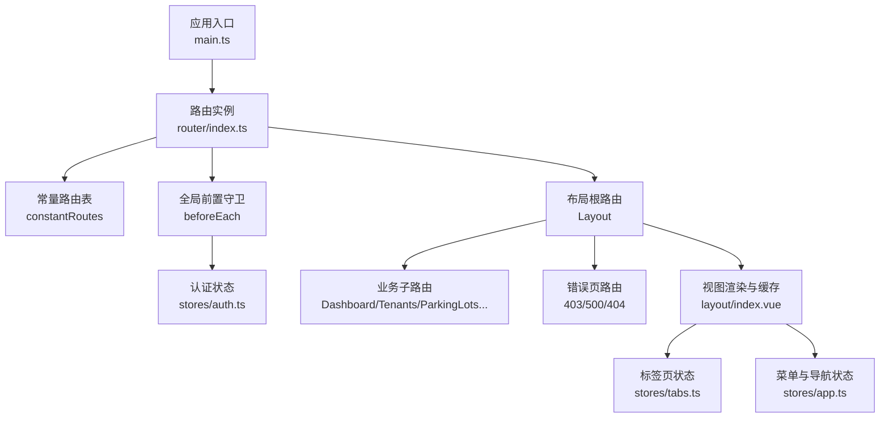
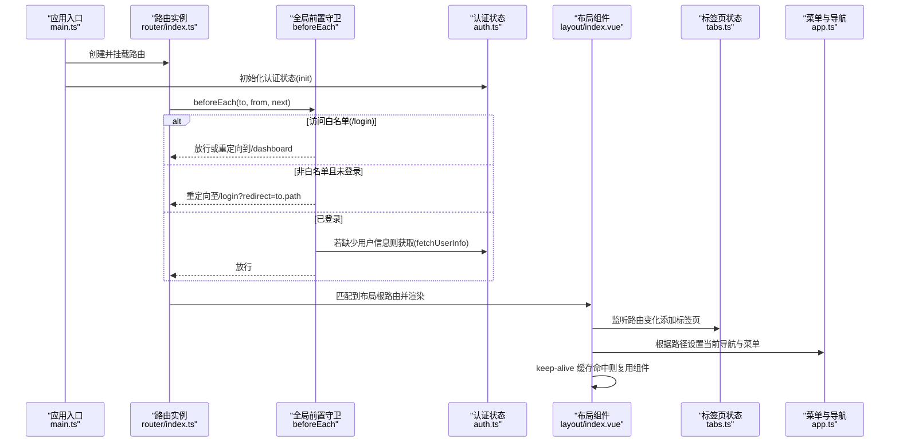
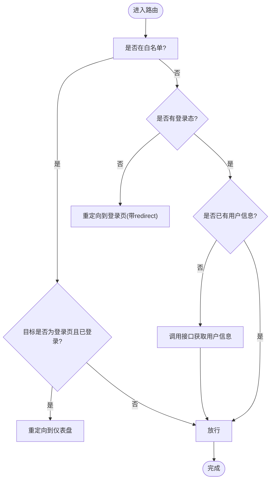
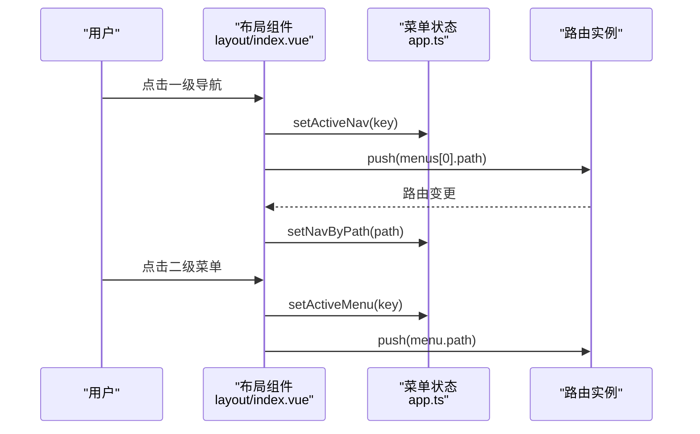
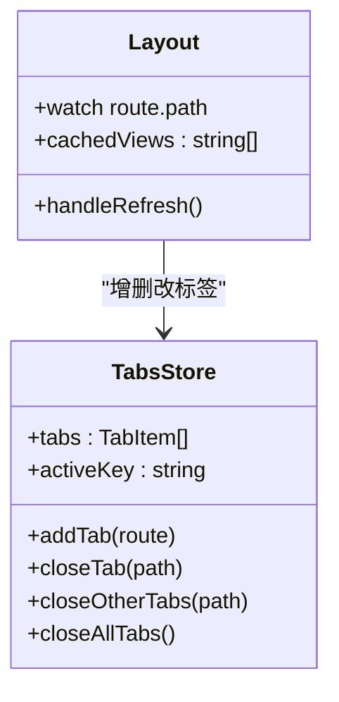
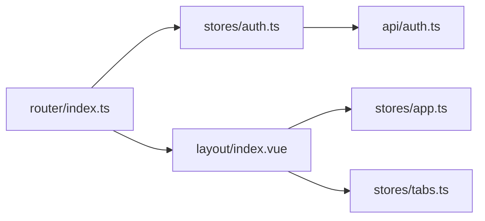

# 路由系统

<cite>
**本文引用的文件**
- [admin-web/src/router/index.ts](file://admin-web/src/router/index.ts)
- [admin-web/src/types/router.ts](file://admin-web/src/types/router.ts)
- [admin-web/src/stores/auth.ts](file://admin-web/src/stores/auth.ts)
- [admin-web/src/stores/app.ts](file://admin-web/src/stores/app.ts)
- [admin-web/src/stores/tabs.ts](file://admin-web/src/stores/tabs.ts)
- [admin-web/src/layout/index.vue](file://admin-web/src/layout/index.vue)
- [admin-web/src/views/error/403.vue](file://admin-web/src/views/error/403.vue)
- [admin-web/src/views/error/404.vue](file://admin-web/src/views/error/404.vue)
- [admin-web/src/views/error/500.vue](file://admin-web/src/views/error/500.vue)
- [admin-web/src/api/auth.ts](file://admin-web/src/api/auth.ts)
- [admin-web/src/main.ts](file://admin-web/src/main.ts)
</cite>

## 目录
1. [简介](#简介)
2. [项目结构](#项目结构)
3. [核心组件](#核心组件)
4. [架构总览](#架构总览)
5. [详细组件分析](#详细组件分析)
6. [依赖关系分析](#依赖关系分析)
7. [性能与优化](#性能与优化)
8. [故障排查指南](#故障排查指南)
9. [结论](#结论)
10. [附录](#附录)

## 简介
本文件聚焦管理后台（admin-web）的路由系统，围绕基于 Vue Router 的配置策略、权限控制、动态路由生成、路由守卫机制、菜单同步逻辑、参数传递、嵌套路由设计、面包屑导航、懒加载、缓存策略与性能优化进行系统化说明。同时给出路由元信息定义、权限验证流程、404/403/500 页面处理方案，以及调试工具与开发最佳实践建议。

## 项目结构
管理端前端工程采用“常量路由 + 全局守卫 + Pinia 状态 + 布局组件”的组合方式：
- 路由定义集中在 router/index.ts，包含登录、布局根路由、业务子路由、错误页与通配符 404。
- 全局前置守卫负责白名单放行、未登录重定向、用户信息预取等。
- 布局组件 layout/index.vue 承载侧边栏、顶部导航、标签页与 keep-alive 缓存。
- 状态管理通过 stores/auth.ts、stores/app.ts、stores/tabs.ts 分别负责认证、菜单与标签页。
- 类型定义在 types/router.ts，统一扩展 RouteMeta 并定义菜单项结构。

图表来源
- [admin-web/src/main.ts:1-20](file://admin-web/src/main.ts#L1-L20)
- [admin-web/src/router/index.ts:1-134](file://admin-web/src/router/index.ts#L1-L134)
- [admin-web/src/layout/index.vue:1-468](file://admin-web/src/layout/index.vue#L1-L468)
- [admin-web/src/stores/auth.ts:1-103](file://admin-web/src/stores/auth.ts#L1-L103)
- [admin-web/src/stores/app.ts:1-87](file://admin-web/src/stores/app.ts#L1-L87)
- [admin-web/src/stores/tabs.ts:1-69](file://admin-web/src/stores/tabs.ts#L1-L69)

章节来源
- [admin-web/src/main.ts:1-20](file://admin-web/src/main.ts#L1-L20)
- [admin-web/src/router/index.ts:1-134](file://admin-web/src/router/index.ts#L1-L134)

## 核心组件
- 路由配置与守卫
  - 常量路由表集中声明登录、布局根路由、业务子路由、错误页与通配符 404。
  - 全局前置守卫实现白名单放行、未登录跳转、登录后自动拉取用户信息。
- 布局与缓存
  - 布局组件提供侧边栏、顶部导航、标签页，并通过 keep-alive 对指定视图进行缓存。
- 状态管理
  - auth store：维护 token、用户信息、登录/登出、会话恢复。
  - app store：维护一级导航与二级菜单映射，支持按路径反查当前激活的导航与菜单。
  - tabs store：维护标签页集合、活跃标签、关闭/清空等操作。
- 类型定义
  - 扩展 RouteMeta 为 AppRouteMeta，补充 title、icon、cache、hidden 等字段；定义 MenuItem 用于菜单渲染。

章节来源
- [admin-web/src/router/index.ts:1-134](file://admin-web/src/router/index.ts#L1-L134)
- [admin-web/src/layout/index.vue:1-468](file://admin-web/src/layout/index.vue#L1-L468)
- [admin-web/src/stores/auth.ts:1-103](file://admin-web/src/stores/auth.ts#L1-L103)
- [admin-web/src/stores/app.ts:1-87](file://admin-web/src/stores/app.ts#L1-L87)
- [admin-web/src/stores/tabs.ts:1-69](file://admin-web/src/stores/tabs.ts#L1-L69)
- [admin-web/src/types/router.ts:1-17](file://admin-web/src/types/router.ts#L1-L17)

## 架构总览
下图展示从应用启动到页面渲染的关键流程，包括路由初始化、守卫拦截、认证状态恢复、布局渲染与缓存策略。

图表来源
- [admin-web/src/main.ts:1-20](file://admin-web/src/main.ts#L1-L20)
- [admin-web/src/router/index.ts:101-131](file://admin-web/src/router/index.ts#L101-L131)
- [admin-web/src/stores/auth.ts:83-87](file://admin-web/src/stores/auth.ts#L83-L87)
- [admin-web/src/layout/index.vue:266-282](file://admin-web/src/layout/index.vue#L266-L282)
- [admin-web/src/stores/tabs.ts:23-40](file://admin-web/src/stores/tabs.ts#L23-L40)
- [admin-web/src/stores/app.ts:74-83](file://admin-web/src/stores/app.ts#L74-L83)

## 详细组件分析

### 路由配置与元信息
- 常量路由表
  - 登录页、布局根路由及其 redirect、业务子路由、错误页与通配符 404 均在此集中定义。
  - 每个路由使用 meta 描述标题、图标、是否缓存、是否隐藏等。
- 元信息类型
  - 通过 AppRouteMeta 扩展 RouteMeta，新增 title、icon、cache、hidden 等字段，便于统一渲染与权限控制。
- 菜单数据结构
  - MenuItem 定义 key、label、icon、path、children，支撑侧边栏与顶部导航的渲染与联动。

章节来源
- [admin-web/src/router/index.ts:4-99](file://admin-web/src/router/index.ts#L4-L99)
- [admin-web/src/types/router.ts:1-17](file://admin-web/src/types/router.ts#L1-L17)
- [admin-web/src/stores/app.ts:9-14](file://admin-web/src/stores/app.ts#L9-L14)

### 路由守卫与权限控制
- 白名单策略
  - 仅 /login 在白名单内，其他路由均需鉴权。
- 未登录处理
  - 未登录时重定向至 /login，并携带 redirect 参数以便登录后返回原页面。
- 用户信息预取
  - 已登录但缺失 userInfo 时，先调用接口获取用户信息再放行，避免后续页面因无用户上下文而异常。
- 权限边界
  - 当前实现以登录态为基础校验；细粒度权限（角色/权限码）可在后续通过后端接口返回的权限列表与路由 meta 结合实现。

图表来源
- [admin-web/src/router/index.ts:106-131](file://admin-web/src/router/index.ts#L106-L131)
- [admin-web/src/stores/auth.ts:45-55](file://admin-web/src/stores/auth.ts#L45-L55)

章节来源
- [admin-web/src/router/index.ts:106-131](file://admin-web/src/router/index.ts#L106-L131)
- [admin-web/src/stores/auth.ts:45-55](file://admin-web/src/stores/auth.ts#L45-L55)

### 动态路由生成（设计与现状）
- 现状
  - 当前采用“常量路由表”，所有可访问路由在编译期静态声明，适合权限模型稳定、菜单相对固定的场景。
- 可扩展方案（建议）
  - 引入后端菜单/路由接口，在登录后根据用户权限动态生成路由树，并在路由实例上调用 addRoute 注册。
  - 将现有常量路由作为基础路由，动态路由作为追加路由，确保 404 兜底始终生效。
  - 动态路由需与菜单数据同源，保证 UI 与路由一致性。

[本节为概念性说明，不直接分析具体代码文件]

### 菜单与路由同步
- 一级导航与二级菜单
  - NAV_ITEMS 定义一级导航键值与文案，MENU_MAP 定义各导航下的二级菜单项。
- 联动逻辑
  - 点击一级导航时，切换到对应二级菜单并默认选中第一个菜单项对应的路径。
  - 点击二级菜单时，更新 activeMenu 并执行路由跳转。
  - 监听 route.path，通过 setNavByPath 反向定位当前激活的一级导航与二级菜单。
- 与路由的关系
  - 菜单 path 与路由 path 一一对应，保持 UI 与路由一致。

图表来源
- [admin-web/src/layout/index.vue:208-224](file://admin-web/src/layout/index.vue#L208-L224)
- [admin-web/src/stores/app.ts:62-83](file://admin-web/src/stores/app.ts#L62-L83)

章节来源
- [admin-web/src/stores/app.ts:17-49](file://admin-web/src/stores/app.ts#L17-L49)
- [admin-web/src/layout/index.vue:208-224](file://admin-web/src/layout/index.vue#L208-L224)
- [admin-web/src/layout/index.vue:275-282](file://admin-web/src/layout/index.vue#L275-L282)

### 标签页与缓存策略
- 标签页
  - 监听路由变化，自动添加标签页；支持关闭单个、关闭其他、关闭全部；首页标签不可关闭。
- 缓存策略
  - 使用 keep-alive 配合 include 列表缓存指定视图；当前示例中硬编码了 Dashboard 的缓存。
  - 刷新页面可通过修改 routeKey 触发组件重建，达到强制刷新效果。
- 与路由的耦合
  - 标签页 key 与路由 path 保持一致，切换标签即执行路由跳转。

图表来源
- [admin-web/src/stores/tabs.ts:19-68](file://admin-web/src/stores/tabs.ts#L19-L68)
- [admin-web/src/layout/index.vue:193-195](file://admin-web/src/layout/index.vue#L193-L195)
- [admin-web/src/layout/index.vue:239-250](file://admin-web/src/layout/index.vue#L239-L250)

章节来源
- [admin-web/src/stores/tabs.ts:1-69](file://admin-web/src/stores/tabs.ts#L1-L69)
- [admin-web/src/layout/index.vue:125-131](file://admin-web/src/layout/index.vue#L125-L131)
- [admin-web/src/layout/index.vue:239-250](file://admin-web/src/layout/index.vue#L239-L250)

### 路由参数传递与嵌套路由
- 嵌套路由
  - 布局根路由下包含多个业务子路由，形成两级嵌套结构。
- 参数传递
  - 当前路由多为扁平路径，未使用动态段；如需详情页，可采用 params 或 query 传递标识，并在目标组件中读取。
- 面包屑导航
  - 当前未实现独立面包屑组件；可基于 route.matched 与 meta.title 构建面包屑层级。

章节来源
- [admin-web/src/router/index.ts:12-79](file://admin-web/src/router/index.ts#L12-L79)

### 404/403/500 页面处理
- 404
  - 通配符路由捕获未匹配路径，渲染 404 页面并提供返回首页操作。
- 403
  - 提供 403 页面，用于无权限访问时的提示。
- 500
  - 提供 500 页面，用于服务端异常的统一展示。

章节来源
- [admin-web/src/router/index.ts:81-98](file://admin-web/src/router/index.ts#L81-L98)
- [admin-web/src/views/error/403.vue:1-33](file://admin-web/src/views/error/403.vue#L1-L33)
- [admin-web/src/views/error/404.vue:1-33](file://admin-web/src/views/error/404.vue#L1-L33)
- [admin-web/src/views/error/500.vue:1-33](file://admin-web/src/views/error/500.vue#L1-L33)

### 登录与会话恢复
- 登录流程
  - 调用登录接口成功后保存 token 与用户信息，并进入受保护路由。
- 会话恢复
  - 应用启动时检查本地 token，若有则尝试拉取用户信息，恢复登录态。
- 退出登录
  - 调用退出接口后清理本地状态并重定向到登录页。

章节来源
- [admin-web/src/api/auth.ts:1-18](file://admin-web/src/api/auth.ts#L1-L18)
- [admin-web/src/stores/auth.ts:32-43](file://admin-web/src/stores/auth.ts#L32-L43)
- [admin-web/src/stores/auth.ts:83-87](file://admin-web/src/stores/auth.ts#L83-L87)
- [admin-web/src/stores/auth.ts:60-71](file://admin-web/src/stores/auth.ts#L60-L71)

## 依赖关系分析
- 模块耦合
  - 路由模块依赖认证状态与布局组件；布局组件依赖菜单与标签页状态。
  - 认证状态依赖 API 层进行网络请求。
- 外部依赖
  - Vue Router 提供路由能力；Pinia 提供状态管理；Ant Design Vue 提供 UI 组件。

图表来源
- [admin-web/src/router/index.ts:1-134](file://admin-web/src/router/index.ts#L1-L134)
- [admin-web/src/layout/index.vue:1-468](file://admin-web/src/layout/index.vue#L1-L468)
- [admin-web/src/stores/auth.ts:1-103](file://admin-web/src/stores/auth.ts#L1-L103)
- [admin-web/src/stores/app.ts:1-87](file://admin-web/src/stores/app.ts#L1-L87)
- [admin-web/src/stores/tabs.ts:1-69](file://admin-web/src/stores/tabs.ts#L1-L69)
- [admin-web/src/api/auth.ts:1-18](file://admin-web/src/api/auth.ts#L1-L18)

章节来源
- [admin-web/src/router/index.ts:1-134](file://admin-web/src/router/index.ts#L1-L134)
- [admin-web/src/layout/index.vue:1-468](file://admin-web/src/layout/index.vue#L1-L468)
- [admin-web/src/stores/auth.ts:1-103](file://admin-web/src/stores/auth.ts#L1-L103)
- [admin-web/src/stores/app.ts:1-87](file://admin-web/src/stores/app.ts#L1-L87)
- [admin-web/src/stores/tabs.ts:1-69](file://admin-web/src/stores/tabs.ts#L1-L69)
- [admin-web/src/api/auth.ts:1-18](file://admin-web/src/api/auth.ts#L1-L18)

## 性能与优化
- 路由懒加载
  - 所有页面组件均采用动态 import，减少首屏包体积，提升加载速度。
- 视图缓存
  - 使用 keep-alive 缓存高频访问页面，减少重复渲染开销；建议根据业务需求精细化 include 列表。
- 路由切换体验
  - 通过 transition 实现淡入淡出过渡，提升视觉连贯性。
- 标签页与内存
  - 合理关闭标签页，避免过多标签导致内存占用过高；必要时限制最大标签数量。
- 首屏优化
  - 在路由守卫中按需拉取用户信息，避免不必要的请求；对敏感页面可增加二次鉴权。

[本节为通用指导，不直接分析具体代码文件]

## 故障排查指南
- 无法进入受保护页面
  - 检查浏览器本地是否存在有效 token；确认登录成功回调是否正确写入。
  - 查看全局守卫是否被意外拦截或重定向。
- 登录后仍跳转到登录页
  - 确认 getUserInfo 接口是否正常返回用户信息；如失败会清理本地状态。
- 标签页异常
  - 检查路由 path 是否与标签页 key 一致；确认关闭逻辑不会误删不可关闭的首页标签。
- 缓存未生效
  - 核对 keep-alive 的 include 列表是否包含目标组件 name；确保组件 name 与路由 name 一致。
- 404 页面频繁出现
  - 检查路由 path 拼写与大小写；确认通配符路由未被提前匹配。

章节来源
- [admin-web/src/router/index.ts:106-131](file://admin-web/src/router/index.ts#L106-L131)
- [admin-web/src/stores/auth.ts:45-55](file://admin-web/src/stores/auth.ts#L45-L55)
- [admin-web/src/stores/tabs.ts:42-65](file://admin-web/src/stores/tabs.ts#L42-L65)
- [admin-web/src/layout/index.vue:193-195](file://admin-web/src/layout/index.vue#L193-L195)

## 结论
当前管理端路由系统以“常量路由 + 全局守卫 + 布局缓存”为核心，具备完善的登录态校验、菜单联动与标签页管理能力。后续可在以下方向持续演进：
- 引入后端菜单/路由接口，实现动态路由与权限驱动的菜单渲染。
- 完善细粒度权限控制，结合路由 meta 与用户权限列表进行按钮级与页面级控制。
- 增强面包屑导航与搜索路由功能，提升导航效率。
- 优化缓存策略与标签页生命周期，平衡性能与内存占用。

[本节为总结性内容，不直接分析具体代码文件]

## 附录
- 路由元信息字段建议
  - title：页面标题，用于文档标题与面包屑。
  - icon：菜单图标名称，用于侧边栏与顶部导航。
  - cache：是否启用 keep-alive 缓存。
  - hidden：是否在菜单中隐藏（用于内部页面）。
- 开发最佳实践
  - 路由命名与组件 name 保持一致，便于缓存与调试。
  - 路由 path 与菜单 path 保持一一对应，避免不一致导致的 UI 错位。
  - 在路由守卫中只做必要判断，避免复杂逻辑阻塞导航。
  - 对敏感页面增加二次鉴权，防止越权访问。
  - 使用统一的错误页面与日志上报，提升问题定位效率。

[本节为通用指导，不直接分析具体代码文件]