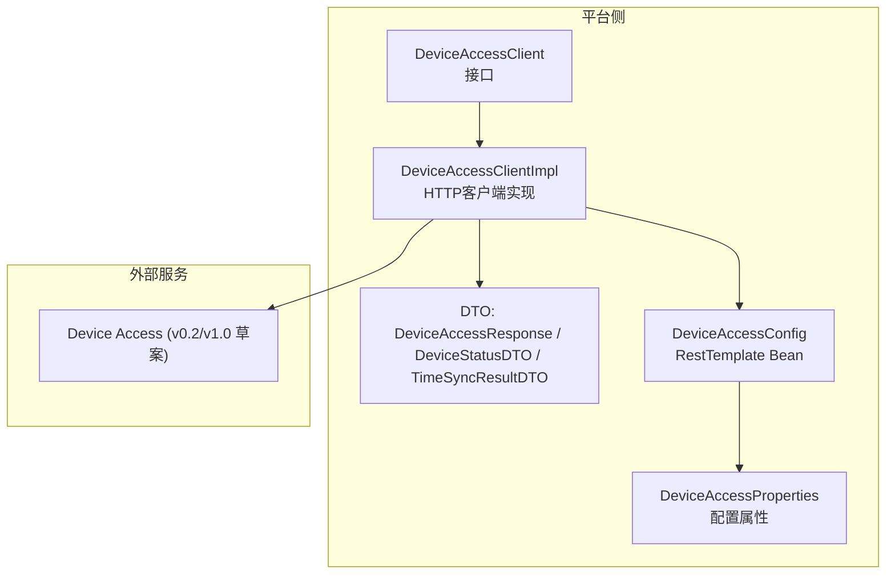
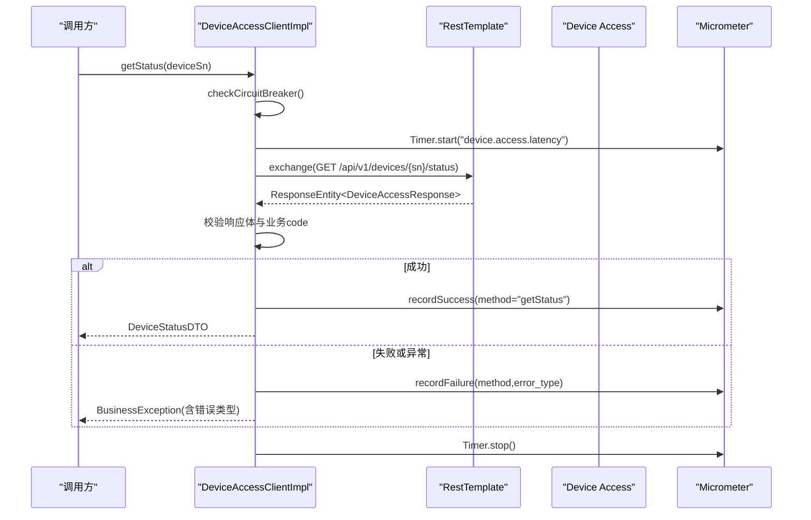
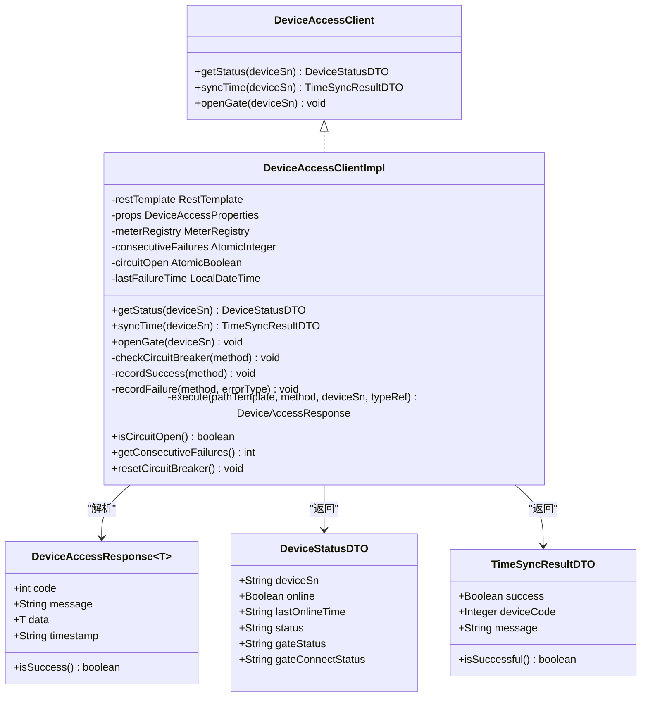
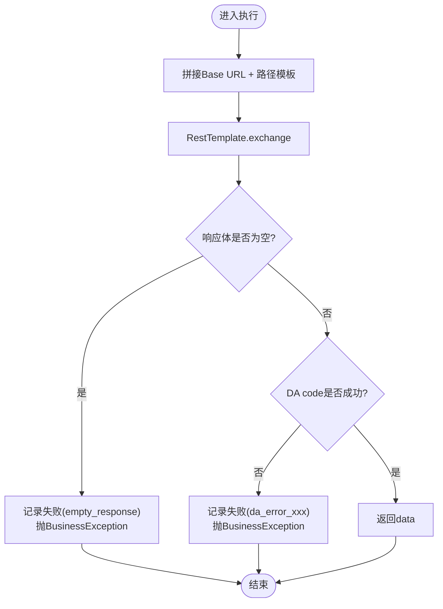
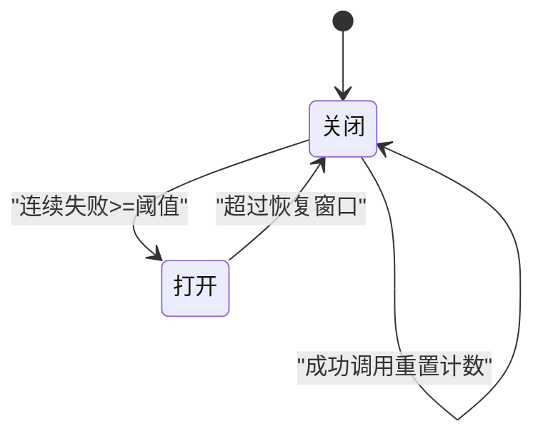
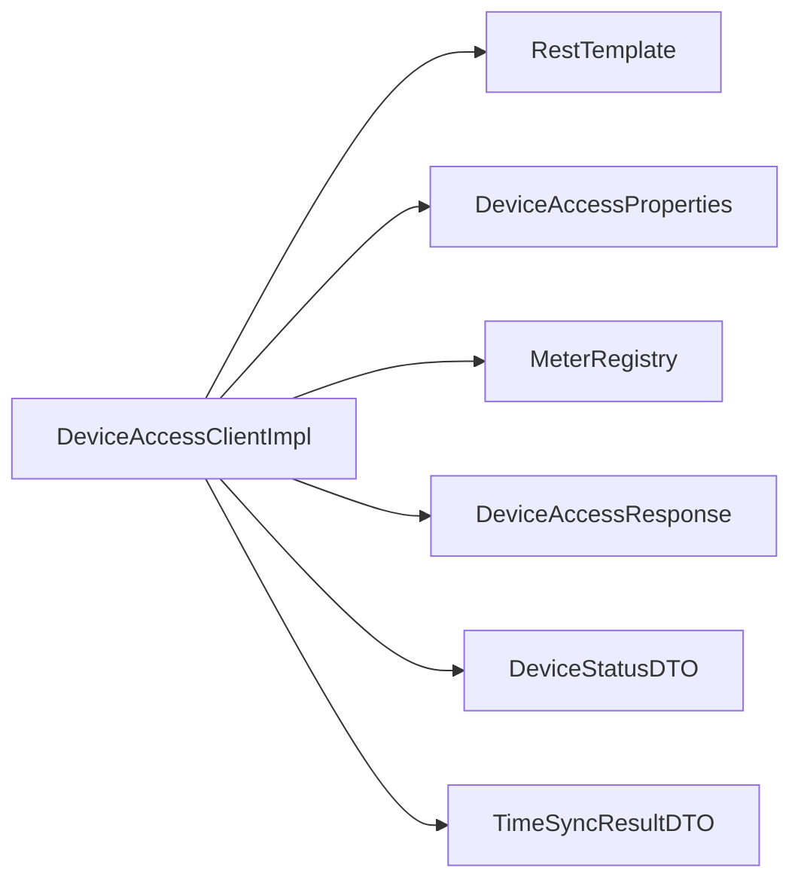

# Device Access服务集成

<cite>
**本文引用的文件**   
- [DeviceAccessClient.java](file://parking-system/src/main/java/com/jushan/system/client/DeviceAccessClient.java)
- [DeviceAccessClientImpl.java](file://parking-system/src/main/java/com/jushan/system/client/DeviceAccessClientImpl.java)
- [DeviceAccessConfig.java](file://parking-framework/src/main/java/com/jushan/framework/config/DeviceAccessConfig.java)
- [DeviceAccessProperties.java](file://parking-framework/src/main/java/com/jushan/framework/config/DeviceAccessProperties.java)
- [DeviceAccessResponse.java](file://parking-system/src/main/java/com/jushan/system/client/dto/DeviceAccessResponse.java)
- [DeviceStatusDTO.java](file://parking-system/src/main/java/com/jushan/system/client/dto/DeviceStatusDTO.java)
- [TimeSyncResultDTO.java](file://parking-system/src/main/java/com/jushan/system/client/dto/TimeSyncResultDTO.java)
- [device-access-v1-draft.yaml](file://docs/contracts/platform-device-access/openapi/device-access-v1-draft.yaml)
- [04-当前兼容契约-v0.2.md](file://docs/contracts/platform-device-access/04-当前兼容契约-v0.2.md)
- [error-response.schema.json](file://docs/contracts/platform-device-access/schemas/error-response.schema.json)
- [DeviceAccessClientTest.java](file://parking-boot/src/test/java/com/jushan/boot/client/DeviceAccessClientTest.java)
- [DeviceAccessClientRobustnessTest.java](file://parking-boot/src/test/java/com/jushan/boot/client/DeviceAccessClientRobustnessTest.java)
</cite>

## 目录
1. [引言](#引言)
2. [项目结构](#项目结构)
3. [核心组件](#核心组件)
4. [架构总览](#架构总览)
5. [详细组件分析](#详细组件分析)
6. [依赖关系分析](#依赖关系分析)
7. [性能与可观测性](#性能与可观测性)
8. [异常处理策略](#异常处理策略)
9. [配置参数说明](#配置参数说明)
10. [测试方法](#测试方法)
11. [故障排查指南](#故障排查指南)
12. [结论](#结论)

## 引言
本文件面向“平台侧”对 Device Access（设备接入）服务的 HTTP 集成，覆盖接口契约、客户端实现、降级与熔断、监控指标、异常处理、配置项与测试方法。目标是在 v0.2 过渡期稳定对接 DA 的“设备状态查询”和“时间同步”能力，并为 v1.0 统一命令入口预留扩展点。

## 项目结构
- 客户端接口与实现位于 parking-system 模块，负责对外暴露稳定的调用抽象并封装网络细节。
- 框架层提供专用 RestTemplate 与配置属性绑定，确保超时、错误处理策略一致。
- 共享契约文档位于 docs/contracts，包含 v1.0 草案 OpenAPI、v0.2 兼容说明与错误响应 Schema。
- 测试用例位于 parking-boot，使用 WireMock 模拟 DA 行为，覆盖成功、错误、超时、解析失败、降级与恢复等路径。

图表来源
- [DeviceAccessClient.java:1-65](file://parking-system/src/main/java/com/jushan/system/client/DeviceAccessClient.java#L1-L65)
- [DeviceAccessClientImpl.java:1-346](file://parking-system/src/main/java/com/jushan/system/client/DeviceAccessClientImpl.java#L1-L346)
- [DeviceAccessConfig.java:1-71](file://parking-framework/src/main/java/com/jushan/framework/config/DeviceAccessConfig.java#L1-L71)
- [DeviceAccessProperties.java:1-44](file://parking-framework/src/main/java/com/jushan/framework/config/DeviceAccessProperties.java#L1-L44)
- [DeviceAccessResponse.java:1-55](file://parking-system/src/main/java/com/jushan/system/client/dto/DeviceAccessResponse.java#L1-L55)
- [DeviceStatusDTO.java:1-68](file://parking-system/src/main/java/com/jushan/system/client/dto/DeviceStatusDTO.java#L1-L68)
- [TimeSyncResultDTO.java:1-58](file://parking-system/src/main/java/com/jushan/system/client/dto/TimeSyncResultDTO.java#L1-L58)

章节来源
- [DeviceAccessClient.java:1-65](file://parking-system/src/main/java/com/jushan/system/client/DeviceAccessClient.java#L1-L65)
- [DeviceAccessClientImpl.java:1-346](file://parking-system/src/main/java/com/jushan/system/client/DeviceAccessClientImpl.java#L1-L346)
- [DeviceAccessConfig.java:1-71](file://parking-framework/src/main/java/com/jushan/framework/config/DeviceAccessConfig.java#L1-L71)
- [DeviceAccessProperties.java:1-44](file://parking-framework/src/main/java/com/jushan/framework/config/DeviceAccessProperties.java#L1-L44)

## 核心组件
- 客户端接口：定义设备状态查询、时间同步、开闸（占位）三个方法，明确 v0.2 已实现与 v1.0 待实现范围。
- 客户端实现：基于 RestTemplate 发起 HTTP 请求，统一解析 DA 响应体，分类异常，记录 Micrometer 指标，内置内存级熔断器。
- 配置与属性：为 DA 调用创建独立 RestTemplate，设置连接/读取超时，禁用自动重试；通过配置前缀注入 Base URL 与超时。
- 数据模型：DA v0.2 统一响应结构与业务 data 对象，适配 code=200 的成功语义与 data 可能为空的情况。

章节来源
- [DeviceAccessClient.java:26-64](file://parking-system/src/main/java/com/jushan/system/client/DeviceAccessClient.java#L26-L64)
- [DeviceAccessClientImpl.java:52-90](file://parking-system/src/main/java/com/jushan/system/client/DeviceAccessClientImpl.java#L52-L90)
- [DeviceAccessConfig.java:27-71](file://parking-framework/src/main/java/com/jushan/framework/config/DeviceAccessConfig.java#L27-L71)
- [DeviceAccessProperties.java:21-44](file://parking-framework/src/main/java/com/jushan/framework/config/DeviceAccessProperties.java#L21-L44)
- [DeviceAccessResponse.java:18-55](file://parking-system/src/main/java/com/jushan/system/client/dto/DeviceAccessResponse.java#L18-L55)
- [DeviceStatusDTO.java:17-68](file://parking-system/src/main/java/com/jushan/system/client/dto/DeviceStatusDTO.java#L17-L68)
- [TimeSyncResultDTO.java:18-58](file://parking-system/src/main/java/com/jushan/system/client/dto/TimeSyncResultDTO.java#L18-L58)

## 架构总览
下图展示一次“设备状态查询”的端到端流程，包括降级检查、指标采集、HTTP 调用、响应校验与异常分类。

图表来源
- [DeviceAccessClientImpl.java:109-132](file://parking-system/src/main/java/com/jushan/system/client/DeviceAccessClientImpl.java#L109-L132)
- [DeviceAccessClientImpl.java:170-201](file://parking-system/src/main/java/com/jushan/system/client/DeviceAccessClientImpl.java#L170-L201)
- [DeviceAccessClientImpl.java:263-316](file://parking-system/src/main/java/com/jushan/system/client/DeviceAccessClientImpl.java#L263-L316)

## 详细组件分析

### 客户端接口与实现
- 接口职责
  - getStatus：GET /api/v1/devices/{deviceSn}/status，返回设备在线/离线、道闸状态等。
  - syncTime：POST /api/v1/devices/{deviceSn}/time/sync，触发设备校时（v0.2 无幂等）。
  - openGate：v0.2 未实现，默认抛出 UnsupportedOperationException，为 v1.0 预留。
- 实现要点
  - 不启用自动重试；写操作透明重试被显式禁止。
  - 网络超时/连接失败标记为 UNCERTAIN，由上层决策。
  - 统一解析 DA 响应体，按 code 与 data 非空判定成功。
  - 记录 Micrometer 指标：调用次数、失败率、延迟分布、降级状态。
  - 内存级熔断器：连续失败阈值触发快速失败，超过恢复窗口后尝试恢复。

图表来源
- [DeviceAccessClient.java:26-64](file://parking-system/src/main/java/com/jushan/system/client/DeviceAccessClient.java#L26-L64)
- [DeviceAccessClientImpl.java:52-90](file://parking-system/src/main/java/com/jushan/system/client/DeviceAccessClientImpl.java#L52-L90)
- [DeviceAccessResponse.java:18-55](file://parking-system/src/main/java/com/jushan/system/client/dto/DeviceAccessResponse.java#L18-L55)
- [DeviceStatusDTO.java:17-68](file://parking-system/src/main/java/com/jushan/system/client/dto/DeviceStatusDTO.java#L17-L68)
- [TimeSyncResultDTO.java:18-58](file://parking-system/src/main/java/com/jushan/system/client/dto/TimeSyncResultDTO.java#L18-L58)

章节来源
- [DeviceAccessClient.java:26-64](file://parking-system/src/main/java/com/jushan/system/client/DeviceAccessClient.java#L26-L64)
- [DeviceAccessClientImpl.java:109-158](file://parking-system/src/main/java/com/jushan/system/client/DeviceAccessClientImpl.java#L109-L158)
- [DeviceAccessClientImpl.java:263-316](file://parking-system/src/main/java/com/jushan/system/client/DeviceAccessClientImpl.java#L263-L316)

### 共享契约设计（v0.2 与 v1.0 草案）
- v0.2 兼容契约
  - 成功码为 200，data 在失败时可能省略；无 traceId/requestId/errors。
  - 错误码内联于全局异常处理器，常见如 404/409/503/400/500。
- v1.0 目标契约（草案）
  - 统一命令入口 POST /api/v1/commands，返回 202 表示受理，结果通过事件投递。
  - 设备状态 GET /api/v1/devices/{deviceSn}/status，返回 connectivityStatus/gateStatus 等。
  - 认证头 X-Client-Id/X-Timestamp/X-Nonce/X-Signature/X-Trace-Id。
  - 错误响应采用 6 位业务错误码，含 requestId/traceId/timestamp。

图表来源
- [DeviceAccessClientImpl.java:263-316](file://parking-system/src/main/java/com/jushan/system/client/DeviceAccessClientImpl.java#L263-L316)
- [04-当前兼容契约-v0.2.md:101-126](file://docs/contracts/platform-device-access/04-当前兼容契约-v0.2.md#L101-L126)
- [device-access-v1-draft.yaml:118-142](file://docs/contracts/platform-device-access/openapi/device-access-v1-draft.yaml#L118-L142)
- [device-access-v1-draft.yaml:39-89](file://docs/contracts/platform-device-access/openapi/device-access-v1-draft.yaml#L39-L89)
- [error-response.schema.json:1-21](file://docs/contracts/platform-device-access/schemas/error-response.schema.json#L1-L21)

章节来源
- [04-当前兼容契约-v0.2.md:101-126](file://docs/contracts/platform-device-access/04-当前兼容契约-v0.2.md#L101-L126)
- [device-access-v1-draft.yaml:118-142](file://docs/contracts/platform-device-access/openapi/device-access-v1-draft.yaml#L118-L142)
- [device-access-v1-draft.yaml:39-89](file://docs/contracts/platform-device-access/openapi/device-access-v1-draft.yaml#L39-L89)
- [error-response.schema.json:1-21](file://docs/contracts/platform-device-access/schemas/error-response.schema.json#L1-L21)

### 降级策略（熔断器模式）
- 触发条件：连续失败次数达到阈值（默认 5 次）即打开降级。
- 快速失败：降级期间直接抛出异常，避免级联阻塞。
- 自动恢复：超过恢复窗口（默认 30 秒）后关闭降级并重置计数器，允许试探性恢复。
- 手动恢复：提供 resetCircuitBreaker 用于运维干预。

图表来源
- [DeviceAccessClientImpl.java:170-201](file://parking-system/src/main/java/com/jushan/system/client/DeviceAccessClientImpl.java#L170-L201)
- [DeviceAccessClientImpl.java:222-246](file://parking-system/src/main/java/com/jushan/system/client/DeviceAccessClientImpl.java#L222-L246)
- [DeviceAccessClientImpl.java:339-344](file://parking-system/src/main/java/com/jushan/system/client/DeviceAccessClientImpl.java#L339-L344)

章节来源
- [DeviceAccessClientImpl.java:170-201](file://parking-system/src/main/java/com/jushan/system/client/DeviceAccessClientImpl.java#L170-L201)
- [DeviceAccessClientImpl.java:222-246](file://parking-system/src/main/java/com/jushan/system/client/DeviceAccessClientImpl.java#L222-L246)
- [DeviceAccessClientImpl.java:339-344](file://parking-system/src/main/java/com/jushan/system/client/DeviceAccessClientImpl.java#L339-L344)

### 监控指标收集（Micrometer）
- 指标前缀：device.access
- 指标列表
  - calls.total：总调用次数，标签 method/status
  - calls.errors：错误调用次数，标签 method/error_type
  - latency：调用延迟 Timer，标签 method
  - circuit_breaker.state：降级状态 Gauge（0=关闭，1=打开）
- 指标注册时机：构造时初始化 Gauge；每次调用开始/结束记录 Timer；成功/失败分别记录 Counter。

章节来源
- [DeviceAccessClientImpl.java:103-107](file://parking-system/src/main/java/com/jushan/system/client/DeviceAccessClientImpl.java#L103-L107)
- [DeviceAccessClientImpl.java:206-246](file://parking-system/src/main/java/com/jushan/system/client/DeviceAccessClientImpl.java#L206-L246)
- [DeviceAccessClientImpl.java:115-126](file://parking-system/src/main/java/com/jushan/system/client/DeviceAccessClientImpl.java#L115-L126)
- [DeviceAccessClientImpl.java:140-151](file://parking-system/src/main/java/com/jushan/system/client/DeviceAccessClientImpl.java#L140-L151)

### 异常处理策略
- 分类原则
  - DA 返回非 200 → BusinessException（携带 DA 错误码与消息）
  - 网络超时/连接失败 → BusinessException（INTERNAL_ERROR，标记 UNCERTAIN）
  - 响应解析失败 → BusinessException（INTERNAL_ERROR）
  - 降级触发 → BusinessException（DEVICE_ACCESS_UNAVAILABLE）
- 关键路径
  - execute 内部捕获 ResourceAccessException 与 RestClientException，分别归类 resource_access 与 rest_client。
  - 空响应体或 data 为 null 视为异常。

章节来源
- [DeviceAccessClientImpl.java:263-316](file://parking-system/src/main/java/com/jushan/system/client/DeviceAccessClientImpl.java#L263-L316)
- [DeviceAccessClientImpl.java:280-298](file://parking-system/src/main/java/com/jushan/system/client/DeviceAccessClientImpl.java#L280-L298)

## 依赖关系分析
- 耦合与内聚
  - DeviceAccessClientImpl 仅依赖 RestTemplate、配置属性与 Micrometer，职责单一且内聚度高。
  - 通过接口 DeviceAccessClient 解耦上层业务与具体实现。
- 外部依赖
  - Spring Web（RestTemplate）、Micrometer、SLF4J。
- 潜在循环依赖
  - 无循环依赖迹象。

图表来源
- [DeviceAccessClientImpl.java:69-90](file://parking-system/src/main/java/com/jushan/system/client/DeviceAccessClientImpl.java#L69-L90)
- [DeviceAccessConfig.java:42-69](file://parking-framework/src/main/java/com/jushan/framework/config/DeviceAccessConfig.java#L42-L69)

章节来源
- [DeviceAccessClientImpl.java:69-90](file://parking-system/src/main/java/com/jushan/system/client/DeviceAccessClientImpl.java#L69-L90)
- [DeviceAccessConfig.java:42-69](file://parking-framework/src/main/java/com/jushan/framework/config/DeviceAccessConfig.java#L42-L69)

## 性能与可观测性
- 性能特性
  - 无自动重试，避免写操作重复执行导致副作用。
  - 读超时需覆盖 DA 内部约 10 秒 MQTT 等待，建议不低于 12 秒。
- 可观测性
  - 通过 Micrometer 暴露调用次数、失败率、延迟分布与降级状态。
  - 日志包含 method、error_type、deviceSn 等上下文，便于定位问题。

[本节为通用指导，无需源码引用]

## 异常处理策略
- 网络层异常（ResourceAccessException）
  - 标记 UNCERTAIN，记录 resource_access 错误类型。
- 客户端异常（RestClientException）
  - 序列化/反序列化失败、未知 Content-Type 等，记录 rest_client。
- 业务异常（DA 返回错误）
  - 根据 DA code 分类，记录 da_error_xxx。
- 降级异常
  - 降级期间快速失败，记录 circuit_breaker。

章节来源
- [DeviceAccessClientImpl.java:300-315](file://parking-system/src/main/java/com/jushan/system/client/DeviceAccessClientImpl.java#L300-L315)
- [DeviceAccessClientImpl.java:280-298](file://parking-system/src/main/java/com/jushan/system/client/DeviceAccessClientImpl.java#L280-L298)
- [DeviceAccessClientImpl.java:190-201](file://parking-system/src/main/java/com/jushan/system/client/DeviceAccessClientImpl.java#L190-L201)

## 配置参数说明
- 配置前缀：jushan.device-access
- 参数清单
  - base-url：Device Access 服务 Base URL（后端可信配置，不允许前端传入）
  - connect-timeout：连接超时（毫秒），默认 3000
  - read-timeout：读取超时（毫秒），默认 12000（需覆盖 DA 内部约 10 秒 MQTT 等待）
- 注意事项
  - 不得配置任何形式的自动重试。
  - 专用 RestTemplate 使用 NoOp 错误处理器，HTTP 4xx/5xx 不抛异常，由客户端自行解析响应体中的错误码。

章节来源
- [DeviceAccessProperties.java:21-44](file://parking-framework/src/main/java/com/jushan/framework/config/DeviceAccessProperties.java#L21-L44)
- [DeviceAccessConfig.java:42-69](file://parking-framework/src/main/java/com/jushan/framework/config/DeviceAccessConfig.java#L42-L69)

## 测试方法
- 基础集成测试
  - 使用 WireMock 模拟 DA 响应，覆盖 200 成功、404/503/500 错误、超时、解析失败、openGate 占位等场景。
- 健壮性与指标测试
  - 验证降级触发与恢复、手动重置、重复调用无幂等、Micrometer 指标（Counter/Timer/Gauge）正确记录。
- 运行方式
  - 通过 SpringBootTest + AutoConfigureMockMvc 启动上下文，动态注入 WireMock 端口作为 base-url。
  - 可通过 @TestPropertySource 调整 read-timeout 以加速超时场景验证。

章节来源
- [DeviceAccessClientTest.java:85-137](file://parking-boot/src/test/java/com/jushan/boot/client/DeviceAccessClientTest.java#L85-L137)
- [DeviceAccessClientTest.java:141-221](file://parking-boot/src/test/java/com/jushan/boot/client/DeviceAccessClientTest.java#L141-L221)
- [DeviceAccessClientTest.java:225-281](file://parking-boot/src/test/java/com/jushan/boot/client/DeviceAccessClientTest.java#L225-L281)
- [DeviceAccessClientRobustnessTest.java:96-129](file://parking-boot/src/test/java/com/jushan/boot/client/DeviceAccessClientRobustnessTest.java#L96-L129)
- [DeviceAccessClientRobustnessTest.java:262-318](file://parking-boot/src/test/java/com/jushan/boot/client/DeviceAccessClientRobustnessTest.java#L262-L318)
- [DeviceAccessClientRobustnessTest.java:376-432](file://parking-boot/src/test/java/com/jushan/boot/client/DeviceAccessClientRobustnessTest.java#L376-L432)

## 故障排查指南
- 常见问题定位
  - 设备状态不可用：检查 DA 服务可达性、端口与网络连通性。
  - 超时频繁：确认 read-timeout 是否小于 DA 内部等待时间；观察 resource_access 错误指标。
  - 解析失败：保存响应摘要并告警，关注 rest_client 错误类型。
  - 降级触发：查看 circuit_breaker.state Gauge 与连续失败次数，必要时手动重置。
- 指标与日志
  - 通过 Micrometer 暴露的 device.access.* 指标进行趋势分析与告警。
  - 结合日志中的 method、error_type、deviceSn 快速定位问题链路。

章节来源
- [DeviceAccessClientImpl.java:103-107](file://parking-system/src/main/java/com/jushan/system/client/DeviceAccessClientImpl.java#L103-L107)
- [DeviceAccessClientImpl.java:222-246](file://parking-system/src/main/java/com/jushan/system/client/DeviceAccessClientImpl.java#L222-L246)
- [DeviceAccessClientRobustnessTest.java:396-432](file://parking-boot/src/test/java/com/jushan/boot/client/DeviceAccessClientRobustnessTest.java#L396-L432)

## 结论
本集成方案在 v0.2 过渡期提供了稳定的设备状态查询与时间同步能力，并通过内存级熔断器与 Micrometer 指标保障系统韧性与可观测性。同时，基于 v1.0 草案的统一命令入口与错误响应规范为后续演进奠定基础。建议在真实环境联调中持续校准超时与阈值参数，完善错误码映射与告警规则。