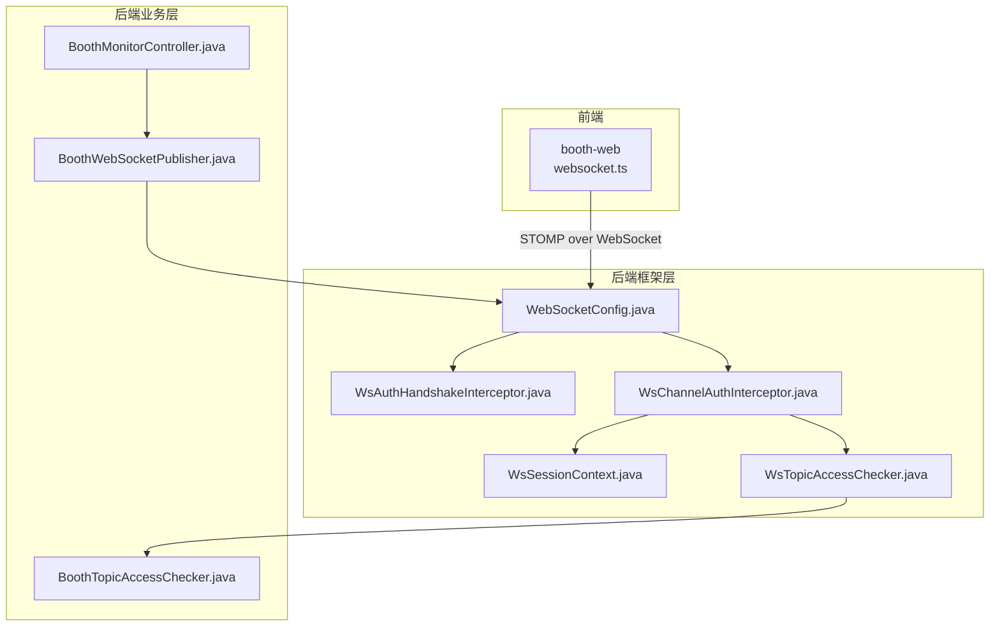
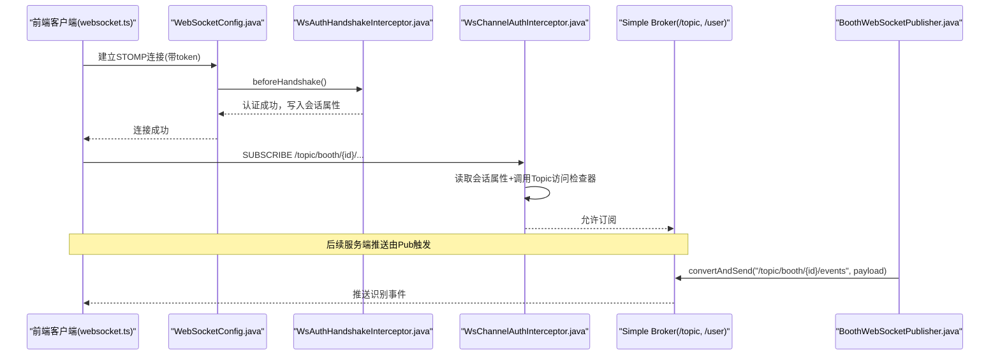
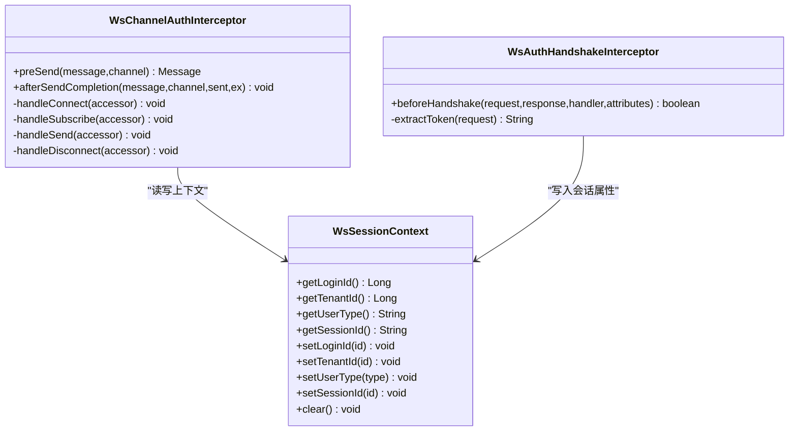
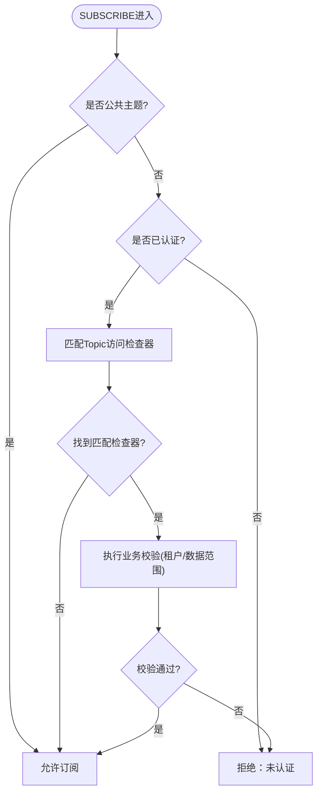
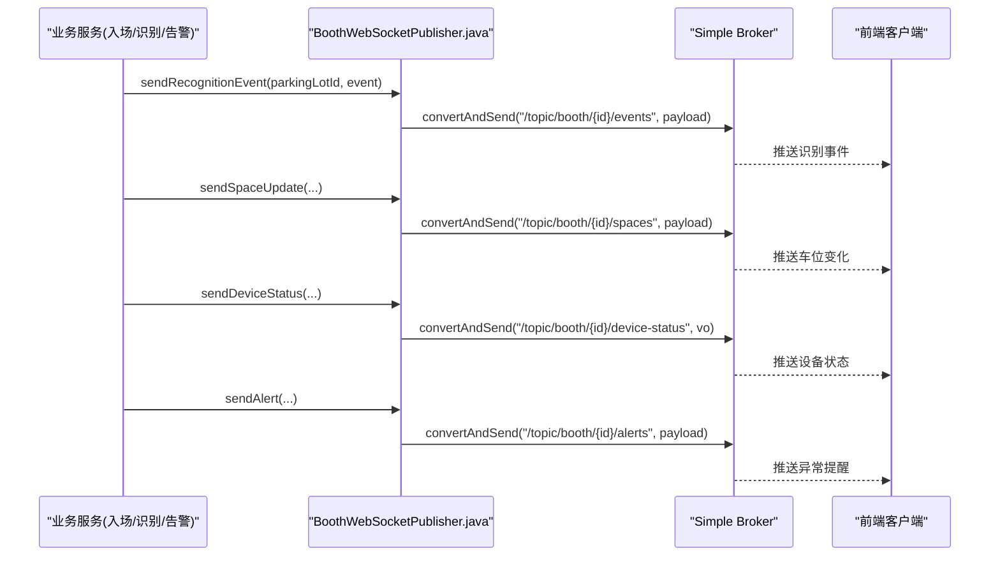
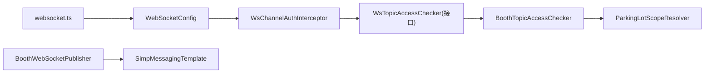

# WebSocket实时通信

<cite>
**本文引用的文件列表**
- [WebSocketConfig.java](file://parking-framework/src/main/java/com/jushan/framework/ws/WebSocketConfig.java)
- [WsAuthHandshakeInterceptor.java](file://parking-framework/src/main/java/com/jushan/framework/ws/WsAuthHandshakeInterceptor.java)
- [WsChannelAuthInterceptor.java](file://parking-framework/src/main/java/com/jushan/framework/ws/WsChannelAuthInterceptor.java)
- [WsSessionContext.java](file://parking-framework/src/main/java/com/jushan/framework/ws/WsSessionContext.java)
- [WsTopicAccessChecker.java](file://parking-framework/src/main/java/com/jushan/framework/ws/WsTopicAccessChecker.java)
- [BoothTopicAccessChecker.java](file://parking-system/src/main/java/com/jushan/system/ws/BoothTopicAccessChecker.java)
- [BoothWebSocketPublisher.java](file://parking-system/src/main/java/com/jushan/system/ws/BoothWebSocketPublisher.java)
- [BoothMonitorController.java](file://parking-system/src/main/java/com/jushan/system/controller/BoothMonitorController.java)
- [websocket.ts](file://booth-web/src/utils/websocket.ts)
</cite>

## 目录
1. [简介](#简介)
2. [项目结构](#项目结构)
3. [核心组件](#核心组件)
4. [架构总览](#架构总览)
5. [详细组件分析](#详细组件分析)
6. [依赖关系分析](#依赖关系分析)
7. [性能与可靠性考虑](#性能与可靠性考虑)
8. [监控与调试指南](#监控与调试指南)
9. [结论](#结论)

## 简介
本文件面向“停车SaaS平台”的WebSocket实时通信能力，聚焦以下目标：
- 服务器端配置：STOMP over WebSocket、握手鉴权、通道拦截、会话上下文管理。
- 认证授权机制：握手阶段鉴权与会话上下文回填；通道级订阅/发送权限校验。
- 主题订阅模式：按停车场维度划分主题，结合租户与数据范围进行访问控制。
- 实时消息推送：识别事件、车位变化、设备状态、异常提醒等推送实现。
- 监控与调试：连接状态、消息追踪、性能分析与问题定位方法。

## 项目结构
WebSocket相关代码分布在框架层与业务层：
- 框架层（parking-framework）：提供WebSocket基础配置、握手拦截器、通道拦截器、会话上下文以及topic访问检查接口。
- 业务层（parking-system）：实现具体topic访问策略（如岗亭监控）、消息发布服务。
- 前端（booth-web）：基于STOMP客户端封装，负责连接、重连、订阅与消息处理。

图表来源
- [WebSocketConfig.java:1-92](file://parking-framework/src/main/java/com/jushan/framework/ws/WebSocketConfig.java#L1-L92)
- [WsAuthHandshakeInterceptor.java:1-140](file://parking-framework/src/main/java/com/jushan/framework/ws/WsAuthHandshakeInterceptor.java#L1-L140)
- [WsChannelAuthInterceptor.java:1-216](file://parking-framework/src/main/java/com/jushan/framework/ws/WsChannelAuthInterceptor.java#L1-L216)
- [WsSessionContext.java:1-105](file://parking-framework/src/main/java/com/jushan/framework/ws/WsSessionContext.java#L1-L105)
- [WsTopicAccessChecker.java:1-36](file://parking-framework/src/main/java/com/jushan/framework/ws/WsTopicAccessChecker.java#L1-L36)
- [BoothTopicAccessChecker.java:1-180](file://parking-system/src/main/java/com/jushan/system/ws/BoothTopicAccessChecker.java#L1-L180)
- [BoothWebSocketPublisher.java:1-177](file://parking-system/src/main/java/com/jushan/system/ws/BoothWebSocketPublisher.java#L1-L177)
- [BoothMonitorController.java:1-76](file://parking-system/src/main/java/com/jushan/system/controller/BoothMonitorController.java#L1-L76)
- [websocket.ts:1-182](file://booth-web/src/utils/websocket.ts#L1-L182)

章节来源
- [WebSocketConfig.java:1-92](file://parking-framework/src/main/java/com/jushan/framework/ws/WebSocketConfig.java#L1-L92)
- [websocket.ts:1-182](file://booth-web/src/utils/websocket.ts#L1-L182)

## 核心组件
- STOMP端点与代理配置：定义端点路径、跨域、应用前缀、用户前缀与内置Simple Broker。
- 握手鉴权拦截器：在升级握手阶段提取并验证token，写入会话属性，回填租户上下文。
- 通道鉴权拦截器：在CONNECT/SUBSCRIBE/SEND/DISCONNECT生命周期中执行上下文回填与权限校验。
- 会话上下文：线程级存储当前连接的登录ID、租户ID、用户类型与Session ID。
- Topic访问检查接口与实现：按目标前缀委派到具体业务检查器，完成细粒度数据范围校验。
- 消息发布服务：将识别事件、车位变化、设备状态、异常提醒推送到对应主题。
- 前端客户端：封装STOMP连接、自动重连、订阅恢复与错误上报。

章节来源
- [WebSocketConfig.java:1-92](file://parking-framework/src/main/java/com/jushan/framework/ws/WebSocketConfig.java#L1-L92)
- [WsAuthHandshakeInterceptor.java:1-140](file://parking-framework/src/main/java/com/jushan/framework/ws/WsAuthHandshakeInterceptor.java#L1-L140)
- [WsChannelAuthInterceptor.java:1-216](file://parking-framework/src/main/java/com/jushan/framework/ws/WsChannelAuthInterceptor.java#L1-L216)
- [WsSessionContext.java:1-105](file://parking-framework/src/main/java/com/jushan/framework/ws/WsSessionContext.java#L1-L105)
- [WsTopicAccessChecker.java:1-36](file://parking-framework/src/main/java/com/jushan/framework/ws/WsTopicAccessChecker.java#L1-L36)
- [BoothTopicAccessChecker.java:1-180](file://parking-system/src/main/java/com/jushan/system/ws/BoothTopicAccessChecker.java#L1-L180)
- [BoothWebSocketPublisher.java:1-177](file://parking-system/src/main/java/com/jushan/system/ws/BoothWebSocketPublisher.java#L1-L177)
- [websocket.ts:1-182](file://booth-web/src/utils/websocket.ts#L1-L182)

## 架构总览
整体采用Spring WebSocket + STOMP，使用内置Simple Broker实现广播与单播。安全方面通过握手拦截器与通道拦截器双重保障，并结合租户上下文与数据范围解析器进行细粒度访问控制。

图表来源
- [WebSocketConfig.java:1-92](file://parking-framework/src/main/java/com/jushan/framework/ws/WebSocketConfig.java#L1-L92)
- [WsAuthHandshakeInterceptor.java:1-140](file://parking-framework/src/main/java/com/jushan/framework/ws/WsAuthHandshakeInterceptor.java#L1-L140)
- [WsChannelAuthInterceptor.java:1-216](file://parking-framework/src/main/java/com/jushan/framework/ws/WsChannelAuthInterceptor.java#L1-L216)
- [BoothWebSocketPublisher.java:1-177](file://parking-system/src/main/java/com/jushan/system/ws/BoothWebSocketPublisher.java#L1-L177)
- [websocket.ts:1-182](file://booth-web/src/utils/websocket.ts#L1-L182)

## 详细组件分析

### WebSocket服务器配置
- 端点注册：/ws，支持SockJS降级，配置允许的跨域来源。
- 消息代理：启用/topic与/queue，设置/user前缀用于单播，/app为客户端→服务端入口。
- 通道拦截：注册通道级鉴权拦截器，统一处理CONNECT/SUBSCRIBE/SEND/DISCONNECT。

章节来源
- [WebSocketConfig.java:1-92](file://parking-framework/src/main/java/com/jushan/framework/ws/WebSocketConfig.java#L1-L92)

### 握手鉴权与会话上下文
- 握手拦截器从URL参数或Authorization头提取token，验证后写入会话属性（登录ID、会话ID、租户ID、用户类型）。
- 通道拦截器在CONNECT时回填ThreadLocal上下文，确保后续处理可获取当前用户与租户信息。
- 会话上下文提供安全的读写API，并在afterSendCompletion与DISCONNECT时清理，防止线程池复用泄漏。

图表来源
- [WsAuthHandshakeInterceptor.java:1-140](file://parking-framework/src/main/java/com/jushan/framework/ws/WsAuthHandshakeInterceptor.java#L1-L140)
- [WsChannelAuthInterceptor.java:1-216](file://parking-framework/src/main/java/com/jushan/framework/ws/WsChannelAuthInterceptor.java#L1-L216)
- [WsSessionContext.java:1-105](file://parking-framework/src/main/java/com/jushan/framework/ws/WsSessionContext.java#L1-L105)

章节来源
- [WsAuthHandshakeInterceptor.java:1-140](file://parking-framework/src/main/java/com/jushan/framework/ws/WsAuthHandshakeInterceptor.java#L1-L140)
- [WsChannelAuthInterceptor.java:1-216](file://parking-framework/src/main/java/com/jushan/framework/ws/WsChannelAuthInterceptor.java#L1-L216)
- [WsSessionContext.java:1-105](file://parking-framework/src/main/java/com/jushan/framework/ws/WsSessionContext.java#L1-L105)

### 主题订阅与访问控制
- 公共主题白名单：无需认证即可订阅（例如健康检查）。
- 私有主题：必须认证且通过业务层Topic访问检查器校验。
- 岗亭监控主题：仅租户用户可订阅，平台用户拒绝；通过ParkingLotScopeResolver校验数据范围。

图表来源
- [WsChannelAuthInterceptor.java:1-216](file://parking-framework/src/main/java/com/jushan/framework/ws/WsChannelAuthInterceptor.java#L1-216)
- [BoothTopicAccessChecker.java:1-180](file://parking-system/src/main/java/com/jushan/system/ws/BoothTopicAccessChecker.java#L1-180)
- [WsTopicAccessChecker.java:1-36](file://parking-framework/src/main/java/com/jushan/framework/ws/WsTopicAccessChecker.java#L1-36)

章节来源
- [WsChannelAuthInterceptor.java:1-216](file://parking-framework/src/main/java/com/jushan/framework/ws/WsChannelAuthInterceptor.java#L1-216)
- [BoothTopicAccessChecker.java:1-180](file://parking-system/src/main/java/com/jushan/system/ws/BoothTopicAccessChecker.java#L1-180)

### 实时消息推送实现
- 推送主题约定：/topic/booth/{parkingLotId}/{events|spaces|device-status|alerts}。
- 推送服务：所有推送方法内部捕获异常，确保推送失败不阻断主业务事务。
- 典型调用方：识别事件发布、入场/出场流程、设备状态刷新、告警服务等。

图表来源
- [BoothWebSocketPublisher.java:1-177](file://parking-system/src/main/java/com/jushan/system/ws/BoothWebSocketPublisher.java#L1-L177)
- [websocket.ts:1-182](file://booth-web/src/utils/websocket.ts#L1-L182)

章节来源
- [BoothWebSocketPublisher.java:1-177](file://parking-system/src/main/java/com/jushan/system/ws/BoothWebSocketPublisher.java#L1-L177)

### 前端连接管理与重连策略
- 连接建立：携带token参数，心跳保活，onConnect后订阅各主题。
- 断线重连：指数退避，最大间隔限制，达到阈值提示操作员。
- 订阅恢复：重连成功后重新订阅全部主题，避免漏推。

章节来源
- [websocket.ts:1-182](file://booth-web/src/utils/websocket.ts#L1-L182)

## 依赖关系分析
- WebSocketConfig依赖WsChannelAuthInterceptor，注册到客户端入站通道。
- WsChannelAuthInterceptor依赖List<WsTopicAccessChecker>，动态发现并调用业务检查器。
- BoothTopicAccessChecker依赖ParkingLotScopeResolver进行数据范围校验。
- BoothWebSocketPublisher依赖SimpMessagingTemplate进行消息广播。
- 前端websocket.ts依赖STOMP客户端库，与服务端端点对接。

图表来源
- [WebSocketConfig.java:1-92](file://parking-framework/src/main/java/com/jushan/framework/ws/WebSocketConfig.java#L1-L92)
- [WsChannelAuthInterceptor.java:1-216](file://parking-framework/src/main/java/com/jushan/framework/ws/WsChannelAuthInterceptor.java#L1-L216)
- [BoothTopicAccessChecker.java:1-180](file://parking-system/src/main/java/com/jushan/system/ws/BoothTopicAccessChecker.java#L1-180)
- [BoothWebSocketPublisher.java:1-177](file://parking-system/src/main/java/com/jushan/system/ws/BoothWebSocketPublisher.java#L1-L177)
- [websocket.ts:1-182](file://booth-web/src/utils/websocket.ts#L1-L182)

章节来源
- [WebSocketConfig.java:1-92](file://parking-framework/src/main/java/com/jushan/framework/ws/WebSocketConfig.java#L1-L92)
- [WsChannelAuthInterceptor.java:1-216](file://parking-framework/src/main/java/com/jushan/framework/ws/WsChannelAuthInterceptor.java#L1-L216)
- [BoothTopicAccessChecker.java:1-180](file://parking-system/src/main/java/com/jushan/system/ws/BoothTopicAccessChecker.java#L1-180)
- [BoothWebSocketPublisher.java:1-177](file://parking-system/src/main/java/com/jushan/system/ws/BoothWebSocketPublisher.java#L1-L177)
- [websocket.ts:1-182](file://booth-web/src/utils/websocket.ts#L1-L182)

## 性能与可靠性考虑
- 推送失败隔离：推送服务对每个推送方法包裹异常捕获，避免影响主业务事务。
- 线程上下文清理：通道拦截器在afterSendCompletion与DISCONNECT时清理ThreadLocal，防止线程池复用导致的数据污染。
- 连接稳定性：前端实现指数退避重连与心跳保活，降低网络抖动带来的中断影响。
- 扩展性：通过WsTopicAccessChecker接口解耦不同主题的访问策略，便于新增业务场景。

[本节为通用指导，不涉及具体文件分析]

## 监控与调试指南
- 连接状态监控
  - 前端暴露连接状态回调（connecting/connected/disconnected/reconnecting），可在UI展示连接质量与重连次数。
  - 服务端日志记录握手成功、订阅与断开事件，便于排查连接生命周期问题。
- 消息追踪
  - 在推送服务中记录关键字段（parkingLotId、eventId、alertId等）与异常原因，便于定位推送失败。
  - 前端在消息解析失败时输出原始报文与错误堆栈，辅助协议与序列化问题排查。
- 性能分析
  - 关注心跳间隔与重连延迟配置，评估在高并发下的连接开销。
  - 观察Simple Broker的内存占用与消息堆积情况，必要时迁移至外部STOMP Broker以提升吞吐。
- 常见问题定位
  - 握手被拒：检查token是否有效、是否来自受信任来源。
  - 订阅被拒：确认用户类型与数据范围，核对ParkingLotScopeResolver返回结果。
  - 推送无响应：检查主题路径是否正确、客户端是否成功订阅、是否存在跨域或Nginx代理问题。

章节来源
- [websocket.ts:1-182](file://booth-web/src/utils/websocket.ts#L1-L182)
- [BoothWebSocketPublisher.java:1-177](file://parking-system/src/main/java/com/jushan/system/ws/BoothWebSocketPublisher.java#L1-L177)
- [WsChannelAuthInterceptor.java:1-216](file://parking-framework/src/main/java/com/jushan/framework/ws/WsChannelAuthInterceptor.java#L1-L216)

## 结论
本项目通过握手拦截器与通道拦截器构建了完整的WebSocket安全体系，结合租户上下文与数据范围解析器实现了细粒度的主题访问控制。推送服务以“失败不阻断主业务”为原则，保障了系统的高可用。前端具备完善的连接管理与重连策略，提升了用户体验。建议在生产环境引入外部STOMP Broker与更完善的监控指标，进一步提升可扩展性与可观测性。