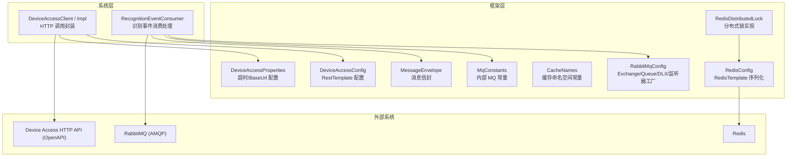
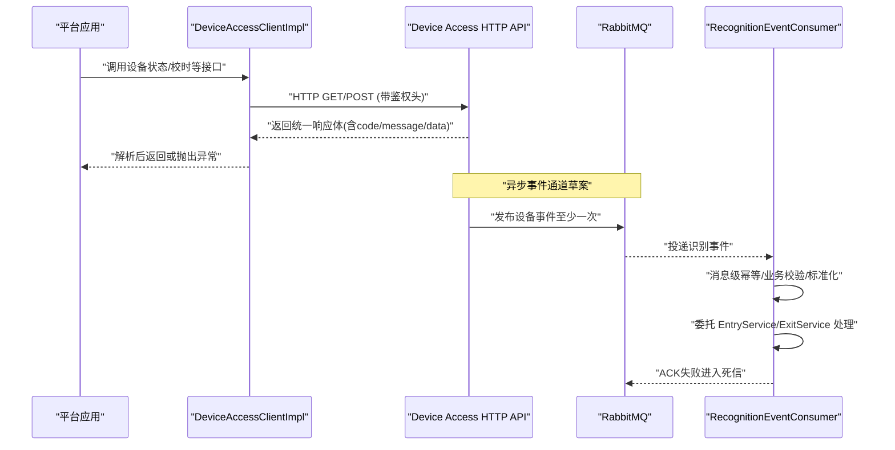
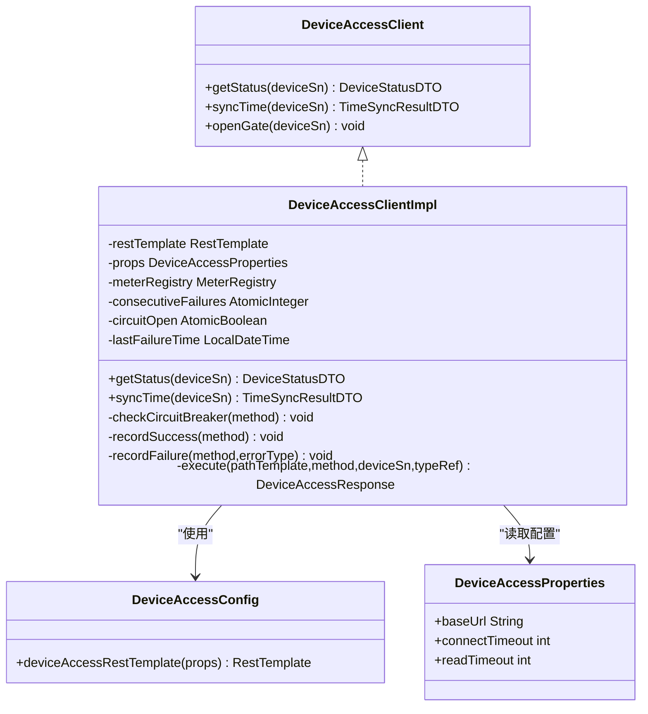
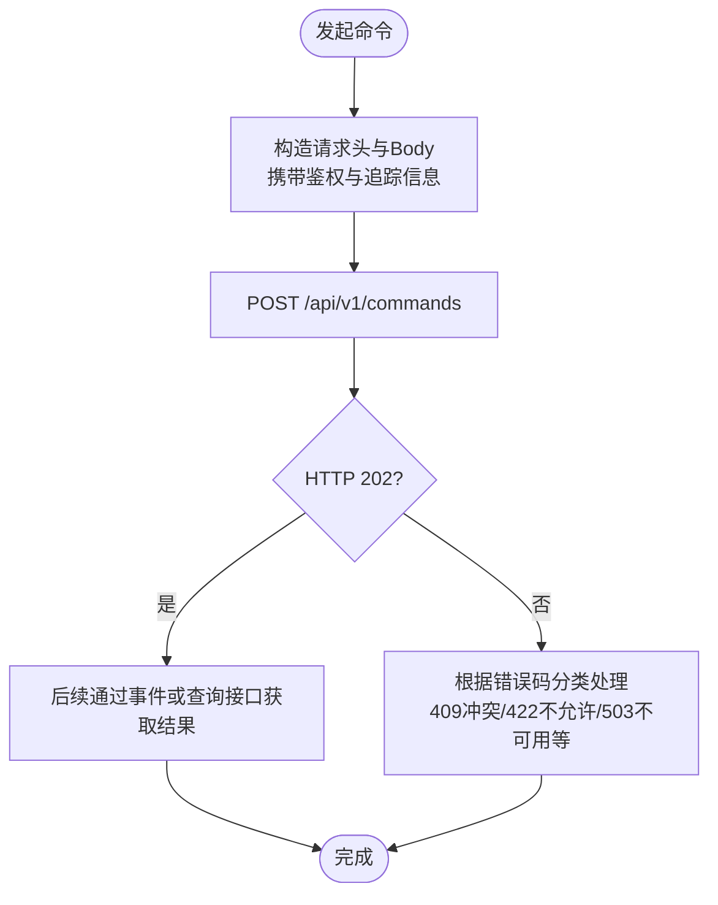
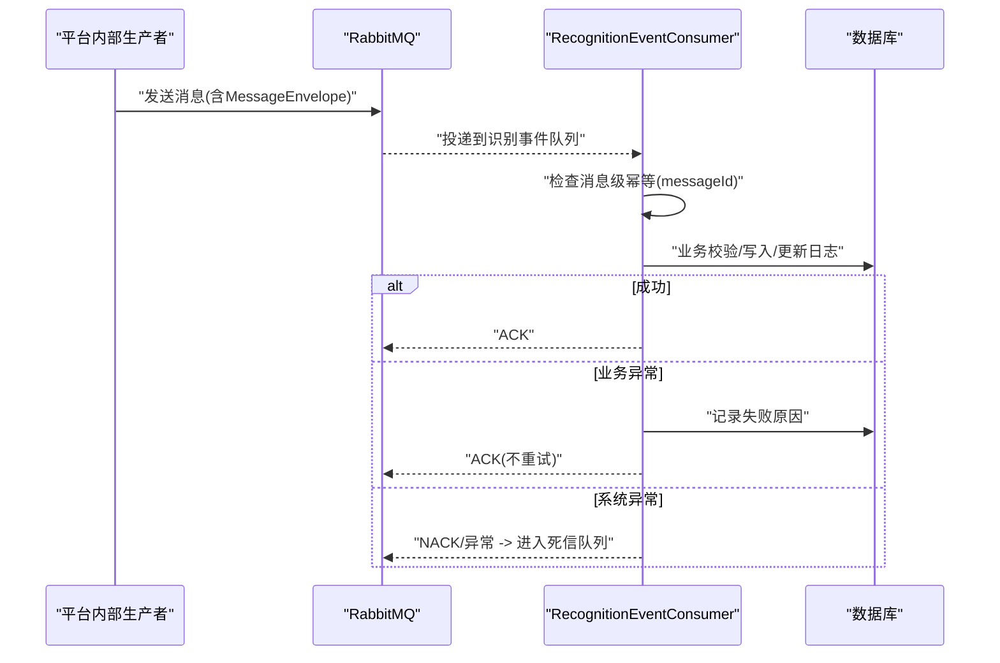
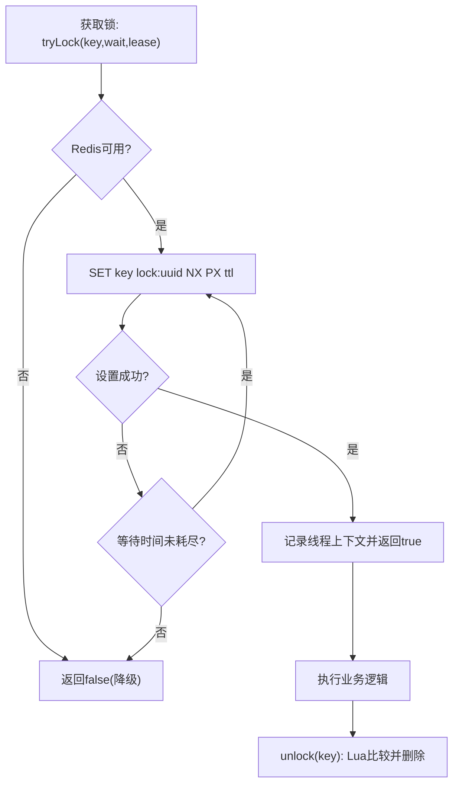
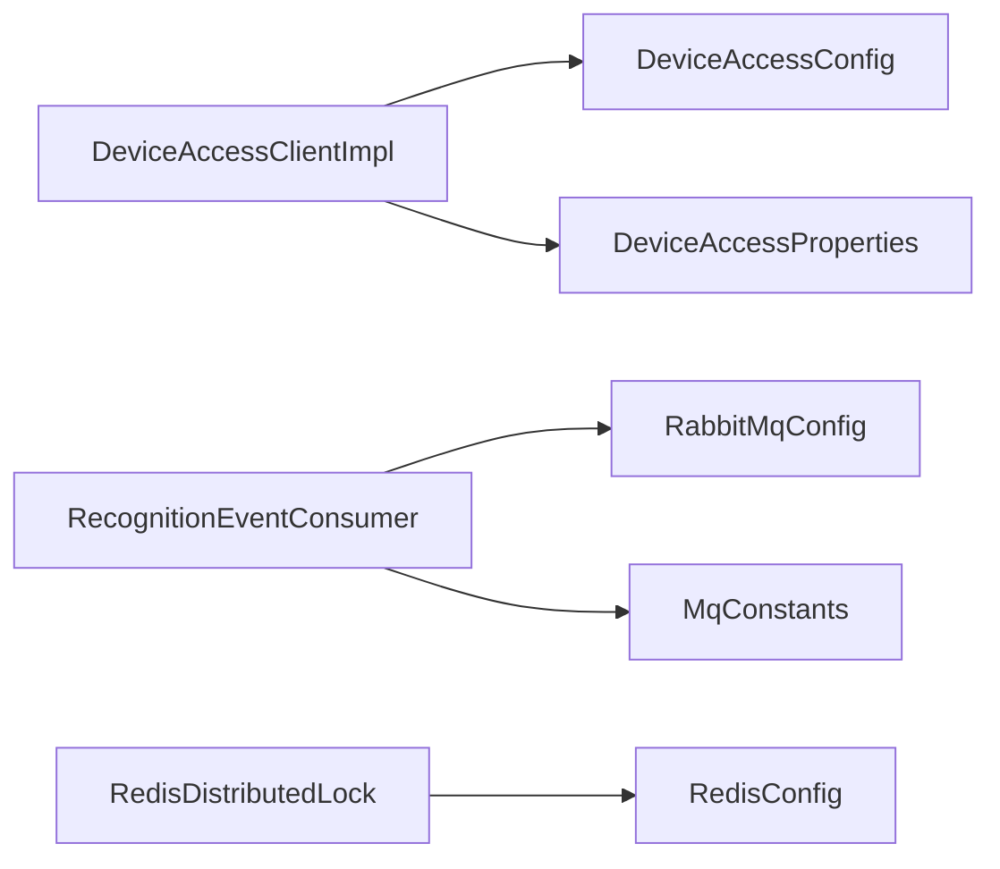

# 外部系统集成

<cite>
**本文引用的文件**
- [device-access-v1-draft.yaml](file://docs/contracts/platform-device-access/openapi/device-access-v1-draft.yaml)
- [device-events-v1-draft.yaml](file://docs/contracts/platform-device-access/asyncapi/device-events-v1-draft.yaml)
- [command-request.schema.json](file://docs/contracts/platform-device-access/schemas/command-request.schema.json)
- [event-envelope.schema.json](file://docs/contracts/platform-device-access/schemas/event-envelope.schema.json)
- [DeviceAccessConfig.java](file://parking-framework/src/main/java/com/jushan/framework/config/DeviceAccessConfig.java)
- [DeviceAccessProperties.java](file://parking-framework/src/main/java/com/jushan/framework/config/DeviceAccessProperties.java)
- [DeviceAccessClient.java](file://parking-system/src/main/java/com/jushan/system/client/DeviceAccessClient.java)
- [DeviceAccessClientImpl.java](file://parking-system/src/main/java/com/jushan/system/client/DeviceAccessClientImpl.java)
- [RabbitMqConfig.java](file://parking-framework/src/main/java/com/jushan/framework/mq/RabbitMqConfig.java)
- [MqConstants.java](file://parking-framework/src/main/java/com/jushan/framework/mq/MqConstants.java)
- [MessageEnvelope.java](file://parking-framework/src/main/java/com/jushan/framework/mq/MessageEnvelope.java)
- [RecognitionEventConsumer.java](file://parking-system/src/main/java/com/jushan/system/event/RecognitionEventConsumer.java)
- [RedisConfig.java](file://parking-framework/src/main/java/com/jushan/framework/redis/RedisConfig.java)
- [CacheNames.java](file://parking-framework/src/main/java/com/jushan/framework/redis/CacheNames.java)
- [DistributedLock.java](file://parking-framework/src/main/java/com/jushan/framework/lock/DistributedLock.java)
- [RedisDistributedLock.java](file://parking-framework/src/main/java/com/jushan/framework/lock/RedisDistributedLock.java)
</cite>

## 目录
1. [引言](#引言)
2. [项目结构](#项目结构)
3. [核心组件](#核心组件)
4. [架构总览](#架构总览)
5. [详细组件分析](#详细组件分析)
6. [依赖关系分析](#依赖关系分析)
7. [性能与可靠性](#性能与可靠性)
8. [集成测试与Mock策略](#集成测试与mock策略)
9. [故障排查指南](#故障排查指南)
10. [结论](#结论)

## 引言
本文件面向“平台 ↔ Device Access”的外部系统集成，覆盖以下方面：
- HTTP API 共享契约（OpenAPI）与请求/响应格式、错误码约定
- RabbitMQ 消息队列配置与使用（生产者/消费者/可靠性）
- Redis 缓存命名空间、过期策略与分布式锁实现
- 第三方服务调用的重试、熔断降级与监控告警
- 集成测试策略与 Mock 服务使用方法
- 故障排查与性能优化建议

## 项目结构
本项目将外部集成能力拆分为框架层与系统层：
- 框架层提供通用基础设施：HTTP 客户端配置、RabbitMQ 基础配置、Redis 模板与分布式锁
- 系统层实现具体业务集成：Device Access HTTP 客户端、识别事件消费者等

图表来源
- [DeviceAccessConfig.java:1-71](file://parking-framework/src/main/java/com/jushan/framework/config/DeviceAccessConfig.java#L1-L71)
- [DeviceAccessProperties.java:1-44](file://parking-framework/src/main/java/com/jushan/framework/config/DeviceAccessProperties.java#L1-L44)
- [RabbitMqConfig.java:1-176](file://parking-framework/src/main/java/com/jushan/framework/mq/RabbitMqConfig.java#L1-L176)
- [RedisConfig.java:1-70](file://parking-framework/src/main/java/com/jushan/framework/redis/RedisConfig.java#L1-L70)
- [RedisDistributedLock.java:1-130](file://parking-framework/src/main/java/com/jushan/framework/lock/RedisDistributedLock.java#L1-L130)
- [CacheNames.java:1-40](file://parking-framework/src/main/java/com/jushan/framework/redis/CacheNames.java#L1-L40)
- [MqConstants.java:1-75](file://parking-framework/src/main/java/com/jushan/framework/mq/MqConstants.java#L1-L75)
- [MessageEnvelope.java:1-138](file://parking-framework/src/main/java/com/jushan/framework/mq/MessageEnvelope.java#L1-L138)
- [DeviceAccessClient.java:1-65](file://parking-system/src/main/java/com/jushan/system/client/DeviceAccessClient.java#L1-L65)
- [DeviceAccessClientImpl.java:1-346](file://parking-system/src/main/java/com/jushan/system/client/DeviceAccessClientImpl.java#L1-L346)
- [RecognitionEventConsumer.java:1-344](file://parking-system/src/main/java/com/jushan/system/event/RecognitionEventConsumer.java#L1-L344)

章节来源
- [DeviceAccessConfig.java:1-71](file://parking-framework/src/main/java/com/jushan/framework/config/DeviceAccessConfig.java#L1-L71)
- [DeviceAccessProperties.java:1-44](file://parking-framework/src/main/java/com/jushan/framework/config/DeviceAccessProperties.java#L1-L44)
- [RabbitMqConfig.java:1-176](file://parking-framework/src/main/java/com/jushan/framework/mq/RabbitMqConfig.java#L1-L176)
- [RedisConfig.java:1-70](file://parking-framework/src/main/java/com/jushan/framework/redis/RedisConfig.java#L1-L70)
- [RedisDistributedLock.java:1-130](file://parking-framework/src/main/java/com/jushan/framework/lock/RedisDistributedLock.java#L1-L130)
- [CacheNames.java:1-40](file://parking-framework/src/main/java/com/jushan/framework/redis/CacheNames.java#L1-L40)
- [MqConstants.java:1-75](file://parking-framework/src/main/java/com/jushan/framework/mq/MqConstants.java#L1-L75)
- [MessageEnvelope.java:1-138](file://parking-framework/src/main/java/com/jushan/framework/mq/MessageEnvelope.java#L1-L138)
- [DeviceAccessClient.java:1-65](file://parking-system/src/main/java/com/jushan/system/client/DeviceAccessClient.java#L1-L65)
- [DeviceAccessClientImpl.java:1-346](file://parking-system/src/main/java/com/jushan/system/client/DeviceAccessClientImpl.java#L1-L346)
- [RecognitionEventConsumer.java:1-344](file://parking-system/src/main/java/com/jushan/system/event/RecognitionEventConsumer.java#L1-L344)

## 核心组件
- Device Access HTTP 客户端
  - 接口定义：[DeviceAccessClient.java:1-65](file://parking-system/src/main/java/com/jushan/system/client/DeviceAccessClient.java#L1-L65)
  - 实现细节（含熔断、指标、异常分类）：[DeviceAccessClientImpl.java:1-346](file://parking-system/src/main/java/com/jushan/system/client/DeviceAccessClientImpl.java#L1-L346)
  - RestTemplate 专用配置（无自动重试、NoOp 错误处理器）：[DeviceAccessConfig.java:1-71](file://parking-framework/src/main/java/com/jushan/framework/config/DeviceAccessConfig.java#L1-L71)
  - 属性配置（baseUrl、connectTimeout、readTimeout）：[DeviceAccessProperties.java:1-44](file://parking-framework/src/main/java/com/jushan/framework/config/DeviceAccessProperties.java#L1-L44)

- RabbitMQ 基础设施与消费者
  - 基础配置（Topic Exchange、DLX、监听器工厂、JSON 转换器）：[RabbitMqConfig.java:1-176](file://parking-framework/src/main/java/com/jushan/framework/mq/RabbitMqConfig.java#L1-L176)
  - 内部常量（Exchange/Queue/RoutingKey 命名规范）：[MqConstants.java:1-75](file://parking-framework/src/main/java/com/jushan/framework/mq/MqConstants.java#L1-L75)
  - 消息信封（messageId/type/tenant/parkingLot/timestamp）：[MessageEnvelope.java:1-138](file://parking-framework/src/main/java/com/jushan/framework/mq/MessageEnvelope.java#L1-L138)
  - 识别事件消费者（幂等、校验、入场/出场委托）：[RecognitionEventConsumer.java:1-344](file://parking-system/src/main/java/com/jushan/system/event/RecognitionEventConsumer.java#L1-L344)

- Redis 缓存与分布式锁
  - Redis 模板与序列化（Key=String, Value=Jackson JSON）：[RedisConfig.java:1-70](file://parking-framework/src/main/java/com/jushan/framework/redis/RedisConfig.java#L1-L70)
  - 缓存命名空间常量：[CacheNames.java:1-40](file://parking-framework/src/main/java/com/jushan/framework/redis/CacheNames.java#L1-L40)
  - 分布式锁接口与 Redis 实现（SET NX PX + Lua 释放）：[DistributedLock.java:1-53](file://parking-framework/src/main/java/com/jushan/framework/lock/DistributedLock.java#L1-L53), [RedisDistributedLock.java:1-130](file://parking-framework/src/main/java/com/jushan/framework/lock/RedisDistributedLock.java#L1-L130)

章节来源
- [DeviceAccessClient.java:1-65](file://parking-system/src/main/java/com/jushan/system/client/DeviceAccessClient.java#L1-L65)
- [DeviceAccessClientImpl.java:1-346](file://parking-system/src/main/java/com/jushan/system/client/DeviceAccessClientImpl.java#L1-L346)
- [DeviceAccessConfig.java:1-71](file://parking-framework/src/main/java/com/jushan/framework/config/DeviceAccessConfig.java#L1-L71)
- [DeviceAccessProperties.java:1-44](file://parking-framework/src/main/java/com/jushan/framework/config/DeviceAccessProperties.java#L1-L44)
- [RabbitMqConfig.java:1-176](file://parking-framework/src/main/java/com/jushan/framework/mq/RabbitMqConfig.java#L1-L176)
- [MqConstants.java:1-75](file://parking-framework/src/main/java/com/jushan/framework/mq/MqConstants.java#L1-L75)
- [MessageEnvelope.java:1-138](file://parking-framework/src/main/java/com/jushan/framework/mq/MessageEnvelope.java#L1-L138)
- [RecognitionEventConsumer.java:1-344](file://parking-system/src/main/java/com/jushan/system/event/RecognitionEventConsumer.java#L1-L344)
- [RedisConfig.java:1-70](file://parking-framework/src/main/java/com/jushan/framework/redis/RedisConfig.java#L1-L70)
- [CacheNames.java:1-40](file://parking-framework/src/main/java/com/jushan/framework/redis/CacheNames.java#L1-L40)
- [DistributedLock.java:1-53](file://parking-framework/src/main/java/com/jushan/framework/lock/DistributedLock.java#L1-L53)
- [RedisDistributedLock.java:1-130](file://parking-framework/src/main/java/com/jushan/framework/lock/RedisDistributedLock.java#L1-L130)

## 架构总览
下图展示平台侧对 Device Access 的 HTTP 调用与事件订阅的整体交互。

图表来源
- [DeviceAccessClientImpl.java:1-346](file://parking-system/src/main/java/com/jushan/system/client/DeviceAccessClientImpl.java#L1-L346)
- [device-access-v1-draft.yaml:1-522](file://docs/contracts/platform-device-access/openapi/device-access-v1-draft.yaml#L1-L522)
- [device-events-v1-draft.yaml:1-162](file://docs/contracts/platform-device-access/asyncapi/device-events-v1-draft.yaml#L1-L162)
- [RecognitionEventConsumer.java:1-344](file://parking-system/src/main/java/com/jushan/system/event/RecognitionEventConsumer.java#L1-L344)

## 详细组件分析

### Device Access HTTP 客户端
- 设计要点
  - 不启用任何自动重试；网络超时标记为 UNCERTAIN，由上层决策
  - NoOp 错误处理器：HTTP 4xx/5xx 不抛异常，由客户端自行解析响应体中的错误码
  - Micrometer 指标：调用次数、失败率、延迟分布、降级状态
  - 内存级熔断：连续失败阈值触发快速失败，超过恢复窗口尝试恢复
- 关键路径
  - getStatus：查询设备状态
  - syncTime：设备校时
  - execute：统一执行入口，异常分类并记录指标

图表来源
- [DeviceAccessClient.java:1-65](file://parking-system/src/main/java/com/jushan/system/client/DeviceAccessClient.java#L1-L65)
- [DeviceAccessClientImpl.java:1-346](file://parking-system/src/main/java/com/jushan/system/client/DeviceAccessClientImpl.java#L1-L346)
- [DeviceAccessConfig.java:1-71](file://parking-framework/src/main/java/com/jushan/framework/config/DeviceAccessConfig.java#L1-L71)
- [DeviceAccessProperties.java:1-44](file://parking-framework/src/main/java/com/jushan/framework/config/DeviceAccessProperties.java#L1-L44)

章节来源
- [DeviceAccessClient.java:1-65](file://parking-system/src/main/java/com/jushan/system/client/DeviceAccessClient.java#L1-L65)
- [DeviceAccessClientImpl.java:1-346](file://parking-system/src/main/java/com/jushan/system/client/DeviceAccessClientImpl.java#L1-L346)
- [DeviceAccessConfig.java:1-71](file://parking-framework/src/main/java/com/jushan/framework/config/DeviceAccessConfig.java#L1-L71)
- [DeviceAccessProperties.java:1-44](file://parking-framework/src/main/java/com/jushan/framework/config/DeviceAccessProperties.java#L1-L44)

### HTTP API 共享契约（OpenAPI）
- 统一命令入口
  - POST /api/v1/commands：创建命令，返回 202 表示已受理；最终结果通过 COMMAND_RESULT 事件投递
  - GET /api/v1/commands/{commandId}：查询命令状态
- 设备相关
  - GET /api/v1/devices/{deviceSn}/status：在线/离线、心跳时间、道闸状态、健康状态
  - GET /api/v1/devices/{deviceSn}/capabilities：设备能力清单
- 配置同步
  - POST /api/v1/config/refresh：通知刷新，随后 DA 拉取最新配置
- 认证与追踪
  - 推荐 HMAC-SHA256 签名头：X-Client-Id、X-Timestamp、X-Nonce、X-Signature、X-Trace-Id
- 错误响应
  - 统一 ErrorResponse 包含 code/message/traceId/timestamp/requestId
  - 常见状态码：400/401/403/404/409/422/429/500/503

图表来源
- [device-access-v1-draft.yaml:1-522](file://docs/contracts/platform-device-access/openapi/device-access-v1-draft.yaml#L1-L522)

章节来源
- [device-access-v1-draft.yaml:1-522](file://docs/contracts/platform-device-access/openapi/device-access-v1-draft.yaml#L1-L522)

### RabbitMQ 消息队列（平台内部）
- 基础设施
  - Topic Exchange：jushan.platform.internal
  - DLX：jushan.platform.dlx，绑定死信队列 jushan.platform.dlx.queue
  - 默认监听器工厂：AUTO ACK、prefetch=10、并发 1~5
  - JSON 转换器：信任所有包（平台内部可信）
- 识别事件通道
  - Queue：jushan.record.recognition.event
  - RoutingKey：jushan.record.recognition.event
  - 消息类型：record.recognition.event
- 可靠性保证
  - 死信机制：消费异常进入 DLX，保留原始 messageId 便于人工重放
  - 消息信封：messageId/type/tenant/parkingLot/timestamp，用于幂等与范围校验
- 安全红线
  - 不声明 Device Access 的任何 Exchange/Queue/RoutingKey
  - 不假设车牌识别事件的能力

图表来源
- [RabbitMqConfig.java:1-176](file://parking-framework/src/main/java/com/jushan/framework/mq/RabbitMqConfig.java#L1-L176)
- [MqConstants.java:1-75](file://parking-framework/src/main/java/com/jushan/framework/mq/MqConstants.java#L1-L75)
- [MessageEnvelope.java:1-138](file://parking-framework/src/main/java/com/jushan/framework/mq/MessageEnvelope.java#L1-L138)
- [RecognitionEventConsumer.java:1-344](file://parking-system/src/main/java/com/jushan/system/event/RecognitionEventConsumer.java#L1-L344)

章节来源
- [RabbitMqConfig.java:1-176](file://parking-framework/src/main/java/com/jushan/framework/mq/RabbitMqConfig.java#L1-L176)
- [MqConstants.java:1-75](file://parking-framework/src/main/java/com/jushan/framework/mq/MqConstants.java#L1-L75)
- [MessageEnvelope.java:1-138](file://parking-framework/src/main/java/com/jushan/framework/mq/MessageEnvelope.java#L1-L138)
- [RecognitionEventConsumer.java:1-344](file://parking-system/src/main/java/com/jushan/system/event/RecognitionEventConsumer.java#L1-L344)

### Redis 缓存与分布式锁
- 缓存命名空间
  - 按业务域划分：parking_lot、device_status、charge_rule、user_session、sys_dict、captcha
- 序列化策略
  - Key：String；Value：Jackson JSON
- 分布式锁
  - tryLock(key, waitTime, leaseTime, unit)：基于 SET key value NX PX ttl
  - unlock(key)：Lua 脚本原子比较并删除，防止误删
  - 线程上下文：ThreadLocal 记录当前线程持有的锁值
  - 优雅降级：当 Redis 不可用时，tryLock 返回 false

图表来源
- [RedisConfig.java:1-70](file://parking-framework/src/main/java/com/jushan/framework/redis/RedisConfig.java#L1-L70)
- [CacheNames.java:1-40](file://parking-framework/src/main/java/com/jushan/framework/redis/CacheNames.java#L1-L40)
- [DistributedLock.java:1-53](file://parking-framework/src/main/java/com/jushan/framework/lock/DistributedLock.java#L1-L53)
- [RedisDistributedLock.java:1-130](file://parking-framework/src/main/java/com/jushan/framework/lock/RedisDistributedLock.java#L1-L130)

章节来源
- [RedisConfig.java:1-70](file://parking-framework/src/main/java/com/jushan/framework/redis/RedisConfig.java#L1-L70)
- [CacheNames.java:1-40](file://parking-framework/src/main/java/com/jushan/framework/redis/CacheNames.java#L1-L40)
- [DistributedLock.java:1-53](file://parking-framework/src/main/java/com/jushan/framework/lock/DistributedLock.java#L1-L53)
- [RedisDistributedLock.java:1-130](file://parking-framework/src/main/java/com/jushan/framework/lock/RedisDistributedLock.java#L1-L130)

### 第三方服务调用：重试、熔断与监控
- 重试策略
  - 明确禁止自动重试：写请求不得透明重试；网络超时标记为 UNCERTAIN，由上层决策
- 熔断降级
  - 内存级熔断：连续失败达到阈值打开降级，超过恢复窗口尝试恢复
  - 降级期间快速失败，避免级联阻塞
- 监控告警
  - Micrometer 指标：calls.total、calls.errors、latency、circuit_breaker.state
  - 建议对接 Prometheus/Grafana 进行可视化与告警

章节来源
- [DeviceAccessConfig.java:1-71](file://parking-framework/src/main/java/com/jushan/framework/config/DeviceAccessConfig.java#L1-L71)
- [DeviceAccessClientImpl.java:1-346](file://parking-system/src/main/java/com/jushan/system/client/DeviceAccessClientImpl.java#L1-L346)

## 依赖关系分析
- 组件耦合
  - DeviceAccessClientImpl 依赖 DeviceAccessConfig 提供的 RestTemplate 与 DeviceAccessProperties
  - RecognitionEventConsumer 依赖 RabbitMqConfig 的基础设施与 MqConstants 的命名
  - RedisDistributedLock 依赖 RedisConfig 提供的 StringRedisTemplate
- 外部依赖
  - Device Access HTTP API（OpenAPI 契约）
  - RabbitMQ（AMQP，平台内部）
  - Redis（缓存与锁）

图表来源
- [DeviceAccessClientImpl.java:1-346](file://parking-system/src/main/java/com/jushan/system/client/DeviceAccessClientImpl.java#L1-L346)
- [DeviceAccessConfig.java:1-71](file://parking-framework/src/main/java/com/jushan/framework/config/DeviceAccessConfig.java#L1-L71)
- [DeviceAccessProperties.java:1-44](file://parking-framework/src/main/java/com/jushan/framework/config/DeviceAccessProperties.java#L1-L44)
- [RecognitionEventConsumer.java:1-344](file://parking-system/src/main/java/com/jushan/system/event/RecognitionEventConsumer.java#L1-L344)
- [RabbitMqConfig.java:1-176](file://parking-framework/src/main/java/com/jushan/framework/mq/RabbitMqConfig.java#L1-L176)
- [MqConstants.java:1-75](file://parking-framework/src/main/java/com/jushan/framework/mq/MqConstants.java#L1-L75)
- [RedisDistributedLock.java:1-130](file://parking-framework/src/main/java/com/jushan/framework/lock/RedisDistributedLock.java#L1-L130)
- [RedisConfig.java:1-70](file://parking-framework/src/main/java/com/jushan/framework/redis/RedisConfig.java#L1-L70)

章节来源
- [DeviceAccessClientImpl.java:1-346](file://parking-system/src/main/java/com/jushan/system/client/DeviceAccessClientImpl.java#L1-L346)
- [DeviceAccessConfig.java:1-71](file://parking-framework/src/main/java/com/jushan/framework/config/DeviceAccessConfig.java#L1-L71)
- [DeviceAccessProperties.java:1-44](file://parking-framework/src/main/java/com/jushan/framework/config/DeviceAccessProperties.java#L1-L44)
- [RecognitionEventConsumer.java:1-344](file://parking-system/src/main/java/com/jushan/system/event/RecognitionEventConsumer.java#L1-L344)
- [RabbitMqConfig.java:1-176](file://parking-framework/src/main/java/com/jushan/framework/mq/RabbitMqConfig.java#L1-L176)
- [MqConstants.java:1-75](file://parking-framework/src/main/java/com/jushan/framework/mq/MqConstants.java#L1-L75)
- [RedisDistributedLock.java:1-130](file://parking-framework/src/main/java/com/jushan/framework/lock/RedisDistributedLock.java#L1-L130)
- [RedisConfig.java:1-70](file://parking-framework/src/main/java/com/jushan/framework/redis/RedisConfig.java#L1-L70)

## 性能与可靠性
- HTTP 客户端
  - 合理设置 connectTimeout/readTimeout，避免长尾阻塞
  - 禁用自动重试，减少抖动放大；结合熔断降低雪崩风险
  - 利用 Micrometer 指标观察 P95/P99 延迟与错误率
- RabbitMQ
  - 调整 prefetchCount 与并发消费者数量以匹配吞吐
  - 使用 DLX 保障异常可观测与人工干预
  - 消息信封中 messageId 做幂等，避免重复处理
- Redis
  - 合理设置 TTL，区分短期/长期缓存
  - 分布式锁的 leaseTime 需大于临界区最大耗时，避免提前释放
- 数据一致性
  - 事件处理采用“消息级幂等 + 业务级幂等（数据库唯一约束）”双重保障

[本节为通用指导，无需特定文件引用]

## 集成测试与Mock策略
- HTTP 客户端
  - 使用 Testcontainers 启动本地 Device Access 模拟服务，验证正常/异常路径
  - 针对熔断与指标断言：注入 MeterRegistry 验证计数器与 Gauge
- RabbitMQ
  - 使用 Testcontainers 启动 RabbitMQ，验证消息收发、死信路由与消费者处理流程
  - 在测试中注入 MessageIdempotency 实现，控制幂等行为
- Redis
  - 使用 Testcontainers 启动 Redis，验证缓存读写与分布式锁的加锁/解锁语义
- Mock 服务
  - 对 Device Access 提供轻量 Mock，返回不同状态码与错误码，覆盖 409/422/503 等场景
  - 对 RabbitMQ 提供空操作实现（ConnectionFactory 不存在时），确保非 MQ 场景可启动

[本节为通用指导，无需特定文件引用]

## 故障排查指南
- HTTP 调用失败
  - 检查连接/读取超时是否过短；确认 BaseUrl 与鉴权头是否正确
  - 查看 Micrometer 指标：calls.errors 与 circuit_breaker.state
  - 关注网络异常（UNCERTAIN）与业务错误码映射
- 事件处理异常
  - 检查死信队列是否有积压；定位 messageId 与 failureReason
  - 核对租户/停车场一致性校验与车道方向匹配
  - 确认幂等键（messageId/eventId）是否命中
- Redis 问题
  - 分布式锁获取失败：确认 Redis 可用性、TTL 设置与临界区耗时
  - 缓存命中率低：检查命名空间与 Key 前缀是否一致

章节来源
- [DeviceAccessClientImpl.java:1-346](file://parking-system/src/main/java/com/jushan/system/client/DeviceAccessClientImpl.java#L1-L346)
- [RecognitionEventConsumer.java:1-344](file://parking-system/src/main/java/com/jushan/system/event/RecognitionEventConsumer.java#L1-L344)
- [RedisDistributedLock.java:1-130](file://parking-framework/src/main/java/com/jushan/framework/lock/RedisDistributedLock.java#L1-L130)

## 结论
本集成方案通过明确的 OpenAPI 契约、稳健的 MQ 基础设施与 Redis 能力，构建了高可用的外部系统集成。HTTP 客户端采用“无自动重试 + 熔断降级 + 指标可观测”的策略，MQ 消费者具备消息级与业务级双重幂等保障，Redis 提供缓存与分布式锁支撑。配合完善的测试与排障手段，可有效提升系统的稳定性与可维护性。