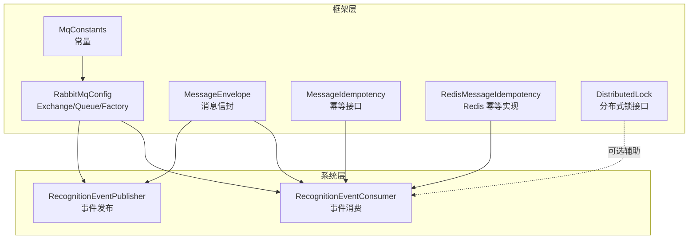
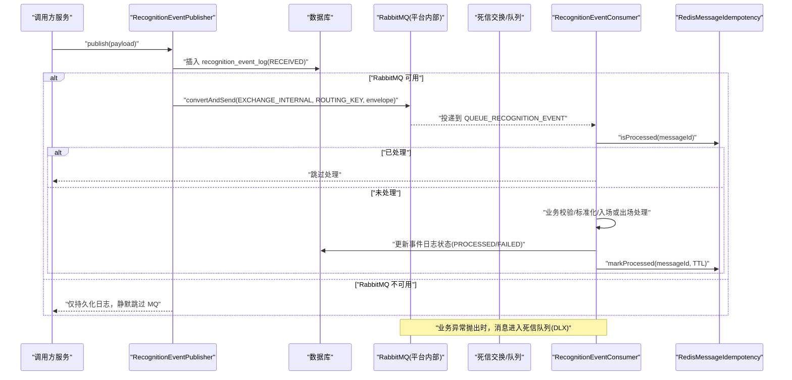
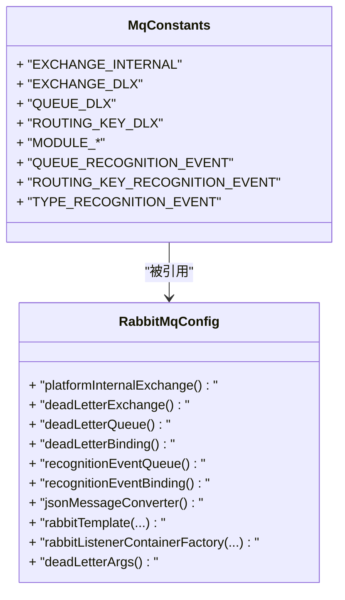
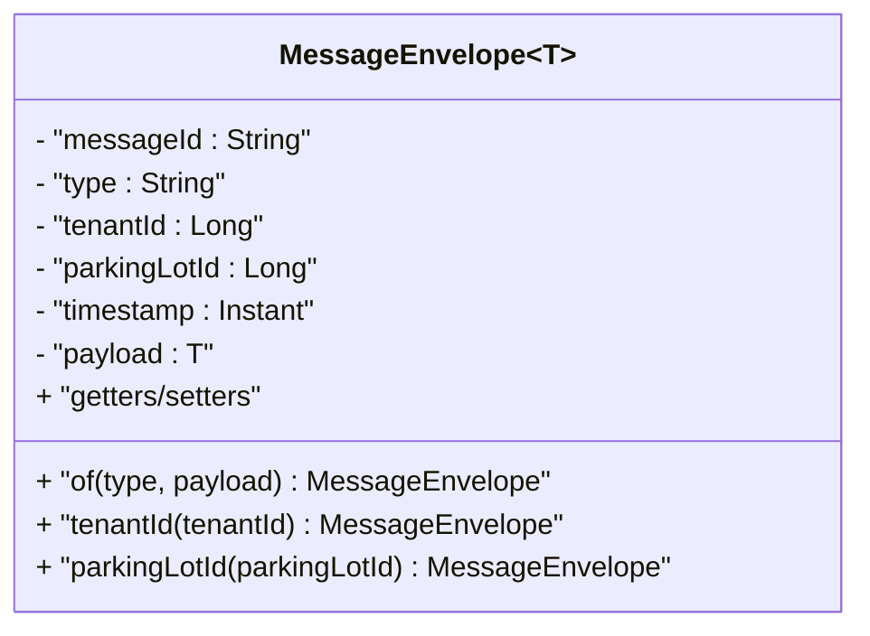
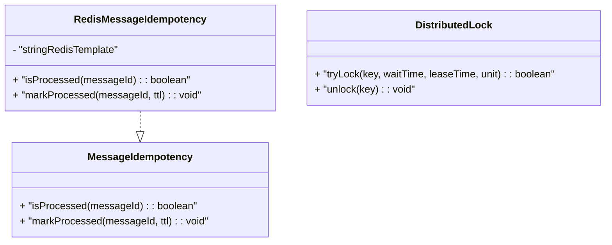
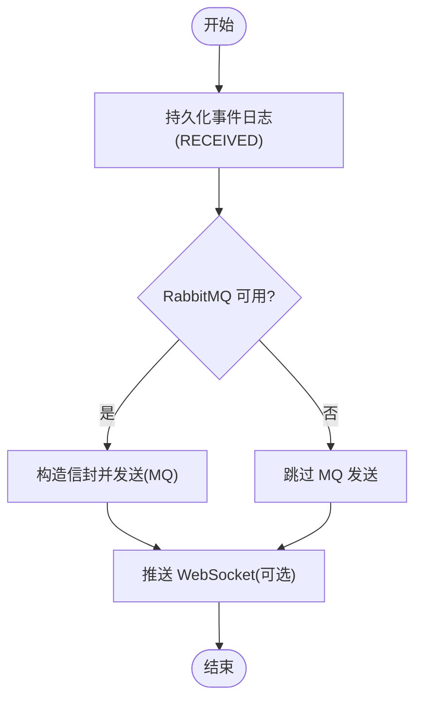
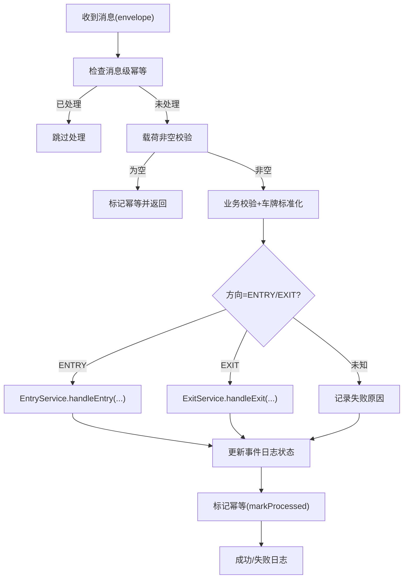
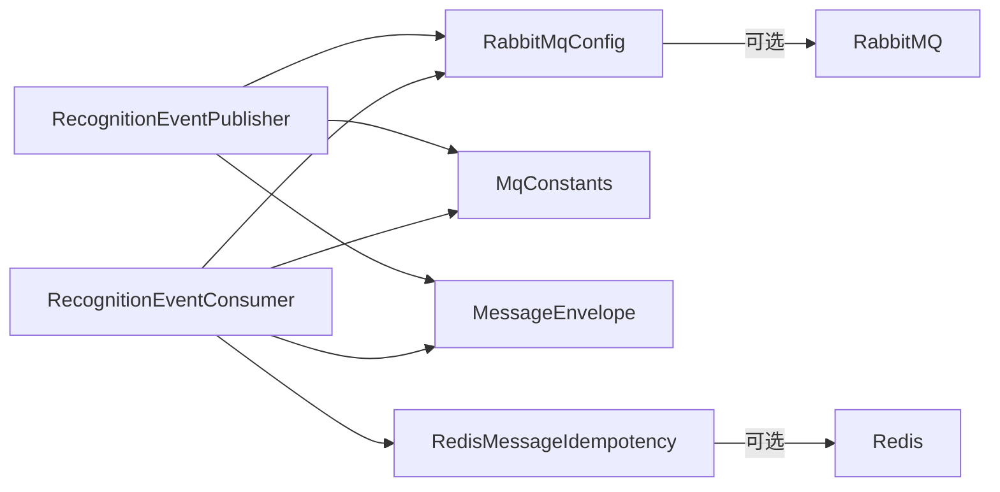

# 消息队列集成

<cite>
**本文引用的文件**
- [RabbitMqConfig.java](file://parking-framework/src/main/java/com/jushan/framework/mq/RabbitMqConfig.java)
- [MqConstants.java](file://parking-framework/src/main/java/com/jushan/framework/mq/MqConstants.java)
- [MessageEnvelope.java](file://parking-framework/src/main/java/com/jushan/framework/mq/MessageEnvelope.java)
- [MessageIdempotency.java](file://parking-framework/src/main/java/com/jushan/framework/mq/MessageIdempotency.java)
- [RedisMessageIdempotency.java](file://parking-framework/src/main/java/com/jushan/framework/mq/RedisMessageIdempotency.java)
- [DistributedLock.java](file://parking-framework/src/main/java/com/jushan/framework/lock/DistributedLock.java)
- [RecognitionEventPublisher.java](file://parking-system/src/main/java/com/jushan/system/event/RecognitionEventPublisher.java)
- [RecognitionEventConsumer.java](file://parking-system/src/main/java/com/jushan/system/event/RecognitionEventConsumer.java)
- [RabbitMqInfrastructureTest.java](file://parking-boot/src/test/java/com/jushan/boot/mq/RabbitMqInfrastructureTest.java)
</cite>

## 目录
1. [简介](#简介)
2. [项目结构](#项目结构)
3. [核心组件](#核心组件)
4. [架构总览](#架构总览)
5. [详细组件分析](#详细组件分析)
6. [依赖关系分析](#依赖关系分析)
7. [性能与可靠性](#性能与可靠性)
8. [监控与排障](#监控与排障)
9. [结论](#结论)
10. [附录](#附录)

## 简介
本文件面向平台内部 RabbitMQ 消息队列的集成与使用，覆盖以下主题：
- 交换机、队列、路由键的定义与管理策略
- 消息信封格式设计（消息头、负载结构与序列化）
- 幂等性保证机制（基于 Redis 的去重与分布式锁配合）
- 生产者与消费者模式（异步发送、可靠投递、错误重试与死信）
- 监控与调试方法（消息追踪、死信处理与性能优化建议）

## 项目结构
本项目将 MQ 基础设施能力沉淀在框架层，业务事件发布与消费位于系统模块。关键位置如下：
- 框架层（parking-framework）
  - 常量定义：MqConstants
  - 配置与容器：RabbitMqConfig
  - 通用模型：MessageEnvelope
  - 幂等接口与实现：MessageIdempotency、RedisMessageIdempotency
  - 分布式锁接口：DistributedLock
- 系统层（parking-system）
  - 识别事件发布器：RecognitionEventPublisher
  - 识别事件消费者：RecognitionEventConsumer
- 测试层（parking-boot）
  - 基础设施验证：RabbitMqInfrastructureTest

图表来源
- [RabbitMqConfig.java:63-101](file://parking-framework/src/main/java/com/jushan/framework/mq/RabbitMqConfig.java#L63-L101)
- [MqConstants.java:30-74](file://parking-framework/src/main/java/com/jushan/framework/mq/MqConstants.java#L30-L74)
- [MessageEnvelope.java:27-67](file://parking-framework/src/main/java/com/jushan/framework/mq/MessageEnvelope.java#L27-L67)
- [MessageIdempotency.java:21-38](file://parking-framework/src/main/java/com/jushan/framework/mq/MessageIdempotency.java#L21-L38)
- [RedisMessageIdempotency.java:35-90](file://parking-framework/src/main/java/com/jushan/framework/mq/RedisMessageIdempotency.java#L35-L90)
- [DistributedLock.java:33-52](file://parking-framework/src/main/java/com/jushan/framework/lock/DistributedLock.java#L33-L52)
- [RecognitionEventPublisher.java:38-102](file://parking-system/src/main/java/com/jushan/system/event/RecognitionEventPublisher.java#L38-L102)
- [RecognitionEventConsumer.java:57-176](file://parking-system/src/main/java/com/jushan/system/event/RecognitionEventConsumer.java#L57-L176)

章节来源
- [RabbitMqConfig.java:53-175](file://parking-framework/src/main/java/com/jushan/framework/mq/RabbitMqConfig.java#L53-L175)
- [MqConstants.java:24-74](file://parking-framework/src/main/java/com/jushan/framework/mq/MqConstants.java#L24-L74)
- [MessageEnvelope.java:27-137](file://parking-framework/src/main/java/com/jushan/framework/mq/MessageEnvelope.java#L27-L137)
- [MessageIdempotency.java:21-38](file://parking-framework/src/main/java/com/jushan/framework/mq/MessageIdempotency.java#L21-L38)
- [RedisMessageIdempotency.java:35-90](file://parking-framework/src/main/java/com/jushan/framework/mq/RedisMessageIdempotency.java#L35-L90)
- [DistributedLock.java:33-52](file://parking-framework/src/main/java/com/jushan/framework/lock/DistributedLock.java#L33-L52)
- [RecognitionEventPublisher.java:38-102](file://parking-system/src/main/java/com/jushan/system/event/RecognitionEventPublisher.java#L38-L102)
- [RecognitionEventConsumer.java:57-176](file://parking-system/src/main/java/com/jushan/system/event/RecognitionEventConsumer.java#L57-L176)

## 核心组件
- 常量与命名规范
  - 统一维护 Exchange、DLX、Queue、RoutingKey 及模块前缀，遵循“jushan.platform.*”和“jushan.{module}.*”命名约定。
- 基础配置与降级
  - 通过条件装配启用 MQ；当 ConnectionFactory 不可用时，RabbitTemplate 与监听工厂降级为无操作，不影响应用启动。
  - 提供 JSON 转换器与默认监听器工厂（自动 ACK、预取与并发参数）。
- 消息信封
  - 统一封装 messageId、type、tenantId、parkingLotId、timestamp、payload，作为所有平台内部消息的标准包装。
- 幂等与锁
  - 提供 MessageIdempotency 接口与 Redis 实现，支持 isProcessed/markProcessed，TTL 控制去重记录生命周期。
  - 提供分布式锁接口用于跨实例互斥场景（如资源更新保护、防重执行）。

章节来源
- [MqConstants.java:24-74](file://parking-framework/src/main/java/com/jushan/framework/mq/MqConstants.java#L24-L74)
- [RabbitMqConfig.java:53-175](file://parking-framework/src/main/java/com/jushan/framework/mq/RabbitMqConfig.java#L53-L175)
- [MessageEnvelope.java:27-137](file://parking-framework/src/main/java/com/jushan/framework/mq/MessageEnvelope.java#L27-L137)
- [MessageIdempotency.java:21-38](file://parking-framework/src/main/java/com/jushan/framework/mq/MessageIdempotency.java#L21-L38)
- [RedisMessageIdempotency.java:35-90](file://parking-framework/src/main/java/com/jushan/framework/mq/RedisMessageIdempotency.java#L35-L90)
- [DistributedLock.java:33-52](file://parking-framework/src/main/java/com/jushan/framework/lock/DistributedLock.java#L33-L52)

## 架构总览
下图展示识别事件的端到端流程：发布器持久化日志并发送到平台内部 Topic Exchange，消费者按路由键入队，完成幂等校验、业务处理与结果落库，异常路径进入死信队列。

图表来源
- [RecognitionEventPublisher.java:64-102](file://parking-system/src/main/java/com/jushan/system/event/RecognitionEventPublisher.java#L64-L102)
- [RabbitMqConfig.java:63-101](file://parking-framework/src/main/java/com/jushan/framework/mq/RabbitMqConfig.java#L63-L101)
- [RecognitionEventConsumer.java:97-176](file://parking-system/src/main/java/com/jushan/system/event/RecognitionEventConsumer.java#L97-L176)
- [RedisMessageIdempotency.java:53-90](file://parking-framework/src/main/java/com/jushan/framework/mq/RedisMessageIdempotency.java#L53-L90)

## 详细组件分析

### 组件一：消息基础设施与配置（RabbitMqConfig + MqConstants）
- 交换机与队列
  - 平台内部 Topic Exchange：用于多订阅者解耦
  - 死信 Exchange 与队列：捕获消费失败的消息，保留 messageId 便于人工重放
  - 识别事件队列：绑定至平台内部 Exchange，附带死信参数
- 序列化与模板
  - Jackson2JsonMessageConverter 信任所有包（平台内部可信环境）
  - RabbitTemplate 注入 ObjectProvider，ConnectionFactory 缺失时降级
  - 监听工厂默认 AUTO ACK、预取与并发参数
- 命名规范
  - EXCHANGE_INTERNAL、EXCHANGE_DLX、QUEUE_DLX、ROUTING_KEY_DLX 等集中管理
  - 模块前缀与识别事件相关常量集中维护

图表来源
- [MqConstants.java:30-74](file://parking-framework/src/main/java/com/jushan/framework/mq/MqConstants.java#L30-L74)
- [RabbitMqConfig.java:63-175](file://parking-framework/src/main/java/com/jushan/framework/mq/RabbitMqConfig.java#L63-L175)

章节来源
- [RabbitMqConfig.java:53-175](file://parking-framework/src/main/java/com/jushan/framework/mq/RabbitMqConfig.java#L53-L175)
- [MqConstants.java:24-74](file://parking-framework/src/main/java/com/jushan/framework/mq/MqConstants.java#L24-L74)

### 组件二：消息信封（MessageEnvelope）
- 字段说明
  - messageId：UUID v4，用于幂等与追踪
  - type：消息类型标识
  - tenantId/parkingLotId：租户与停车场上下文（由后端可信上下文填充）
  - timestamp：UTC 时间戳
  - payload：业务载荷
- 工厂方法与 Fluent API
  - of(type, payload) 自动生成 messageId 与 timestamp
  - tenantId()/parkingLotId() 便捷设置上下文
- 序列化
  - 非空字段输出，配合 Jackson2JsonMessageConverter 进行 JSON 编解码

图表来源
- [MessageEnvelope.java:27-137](file://parking-framework/src/main/java/com/jushan/framework/mq/MessageEnvelope.java#L27-L137)

章节来源
- [MessageEnvelope.java:27-137](file://parking-framework/src/main/java/com/jushan/framework/mq/MessageEnvelope.java#L27-L137)

### 组件三：幂等性与分布式锁（MessageIdempotency + RedisMessageIdempotency + DistributedLock）
- 幂等接口
  - isProcessed(messageId)：判定是否已处理
  - markProcessed(messageId, ttl)：标记已处理并设置过期时间
- Redis 实现
  - Key 前缀：mq:consumed:{messageId}
  - SETNX 原子写入，TTL 默认 72 小时
  - Redis 不可用时降级：不过滤、记录警告，业务层 eventId 唯一约束兜底
- 分布式锁
  - tryLock/unlock 接口，适用于跨实例互斥（可结合幂等增强一致性）

图表来源
- [MessageIdempotency.java:21-38](file://parking-framework/src/main/java/com/jushan/framework/mq/MessageIdempotency.java#L21-L38)
- [RedisMessageIdempotency.java:35-90](file://parking-framework/src/main/java/com/jushan/framework/mq/RedisMessageIdempotency.java#L35-L90)
- [DistributedLock.java:33-52](file://parking-framework/src/main/java/com/jushan/framework/lock/DistributedLock.java#L33-L52)

章节来源
- [MessageIdempotency.java:21-38](file://parking-framework/src/main/java/com/jushan/framework/mq/MessageIdempotency.java#L21-L38)
- [RedisMessageIdempotency.java:35-90](file://parking-framework/src/main/java/com/jushan/framework/mq/RedisMessageIdempotency.java#L35-L90)
- [DistributedLock.java:33-52](file://parking-framework/src/main/java/com/jushan/framework/lock/DistributedLock.java#L33-L52)

### 组件四：识别事件发布器（RecognitionEventPublisher）
- 职责
  - 先持久化 recognition_event_log（RECEIVED），再异步发送到 MQ
  - 若 MQ 不可用或发送失败，不抛异常，仅记录日志（事件已在数据库留存）
  - 推送 WebSocket 实时事件（失败不影响主流程）
- 安全约束
  - tenantId/parkingLotId 必须由调用方从可信记录推导，禁止信任外部传入值

图表来源
- [RecognitionEventPublisher.java:64-102](file://parking-system/src/main/java/com/jushan/system/event/RecognitionEventPublisher.java#L64-L102)

章节来源
- [RecognitionEventPublisher.java:38-102](file://parking-system/src/main/java/com/jushan/system/event/RecognitionEventPublisher.java#L38-L102)

### 组件五：识别事件消费者（RecognitionEventConsumer）
- 处理流程
  - 消息级幂等：isProcessed(messageId) 快速跳过重复消息
  - 基础校验：载荷非空、设备存在且启用、类型为相机、绑定停车场存在
  - 车牌标准化：统一格式，便于后续匹配
  - 业务处理：ENTRY 委托 EntryService，EXIT 委托 ExitService
  - 结果落库：更新 recognition_event_log 状态（PROCESSED/FAILED）
  - 幂等标记：markProcessed(messageId, TTL)
- 异常与重试
  - 业务异常（BusinessException）：记录失败原因，正常 ACK，不重试
  - 系统异常（如 DB 不可用）：抛出异常，触发死信队列
  - 重复 eventId（业务幂等）：直接跳过

图表来源
- [RecognitionEventConsumer.java:97-176](file://parking-system/src/main/java/com/jushan/system/event/RecognitionEventConsumer.java#L97-L176)

章节来源
- [RecognitionEventConsumer.java:57-176](file://parking-system/src/main/java/com/jushan/system/event/RecognitionEventConsumer.java#L57-L176)

## 依赖关系分析
- 耦合与内聚
  - 框架层提供 MQ 基础设施与通用能力，业务层仅依赖接口与常量，降低耦合
  - 消费者依赖 Mapper 与服务层，保持单一职责
- 外部依赖
  - RabbitMQ（可选，条件装配）
  - Redis（幂等存储，可选）
  - 数据库（事件日志与业务数据）
- 潜在循环依赖
  - 当前未发现循环依赖；发布器与消费者通过 MQ 解耦

图表来源
- [RecognitionEventPublisher.java:38-102](file://parking-system/src/main/java/com/jushan/system/event/RecognitionEventPublisher.java#L38-L102)
- [RecognitionEventConsumer.java:57-176](file://parking-system/src/main/java/com/jushan/system/event/RecognitionEventConsumer.java#L57-L176)
- [RabbitMqConfig.java:53-175](file://parking-framework/src/main/java/com/jushan/framework/mq/RabbitMqConfig.java#L53-L175)
- [MqConstants.java:24-74](file://parking-framework/src/main/java/com/jushan/framework/mq/MqConstants.java#L24-L74)
- [MessageEnvelope.java:27-137](file://parking-framework/src/main/java/com/jushan/framework/mq/MessageEnvelope.java#L27-L137)
- [RedisMessageIdempotency.java:35-90](file://parking-framework/src/main/java/com/jushan/framework/mq/RedisMessageIdempotency.java#L35-L90)

章节来源
- [RecognitionEventPublisher.java:38-102](file://parking-system/src/main/java/com/jushan/system/event/RecognitionEventPublisher.java#L38-L102)
- [RecognitionEventConsumer.java:57-176](file://parking-system/src/main/java/com/jushan/system/event/RecognitionEventConsumer.java#L57-L176)
- [RabbitMqConfig.java:53-175](file://parking-framework/src/main/java/com/jushan/framework/mq/RabbitMqConfig.java#L53-L175)
- [MqConstants.java:24-74](file://parking-framework/src/main/java/com/jushan/framework/mq/MqConstants.java#L24-L74)
- [MessageEnvelope.java:27-137](file://parking-framework/src/main/java/com/jushan/framework/mq/MessageEnvelope.java#L27-L137)
- [RedisMessageIdempotency.java:35-90](file://parking-framework/src/main/java/com/jushan/framework/mq/RedisMessageIdempotency.java#L35-L90)

## 性能与可靠性
- 发送侧
  - 确认回调与返回回调：记录未确认与无法路由的告警日志，便于定位问题
  - 降级策略：ConnectionFactory 不可用时不阻塞启动，发送静默跳过
- 消费侧
  - 预取与并发：默认 prefetchCount=10，并发 1~5，可按吞吐需求调整
  - 幂等与去重：Redis SETNX 原子写入，避免重复处理
  - 死信队列：系统异常导致消息进入 DLX，保留 messageId 便于人工重放
- 可靠性建议
  - 对关键业务可引入事务消息或本地消息表方案（需额外设计与改造）
  - 合理设置 TTL 与 max-length，防止队列堆积
  - 结合分布式锁保护热点资源更新，避免竞争

章节来源
- [RabbitMqConfig.java:117-162](file://parking-framework/src/main/java/com/jushan/framework/mq/RabbitMqConfig.java#L117-L162)
- [RedisMessageIdempotency.java:53-90](file://parking-framework/src/main/java/com/jushan/framework/mq/RedisMessageIdempotency.java#L53-L90)
- [RecognitionEventConsumer.java:97-176](file://parking-system/src/main/java/com/jushan/system/event/RecognitionEventConsumer.java#L97-L176)

## 监控与排障
- 消息追踪
  - 使用 messageId 贯穿生产与消费链路，结合日志与事件日志表（recognition_event_log）进行全链路追踪
- 死信队列处理
  - 关注死信队列中的 messageId，必要时人工重放或修复后重新投递
- 常见问题
  - 无法路由：检查 RoutingKey 与 Binding 是否正确
  - 重复处理：确认幂等逻辑是否生效（Redis 是否可用、TTL 是否合理）
  - 性能瓶颈：调整并发与预取数量，评估下游服务处理能力
- 测试验证
  - 基础设施测试覆盖序列化往返、幂等判定、重复投递与 DLX 声明

章节来源
- [RabbitMqInfrastructureTest.java:73-154](file://parking-boot/src/test/java/com/jushan/boot/mq/RabbitMqInfrastructureTest.java#L73-L154)
- [RabbitMqConfig.java:128-137](file://parking-framework/src/main/java/com/jushan/framework/mq/RabbitMqConfig.java#L128-L137)
- [RecognitionEventConsumer.java:162-176](file://parking-system/src/main/java/com/jushan/system/event/RecognitionEventConsumer.java#L162-L176)

## 结论
本项目通过框架层抽象与业务层解耦，构建了稳定可靠的平台内部消息通道。以统一的信封格式、严格的幂等与死信策略、以及完善的降级与监控手段，保障了识别事件在高并发与不稳定环境下的正确性与可观测性。建议在后续演进中持续完善性能调优与可观测性指标，并根据业务重要性逐步引入更高级的可靠性保障机制。

## 附录
- 命名规范速查
  - Exchange：jushan.platform.internal（Topic）、jushan.platform.dlx（Direct）
  - Queue：jushan.platform.dlx.queue、jushan.record.recognition.event
  - RoutingKey：jushan.platform.dlx、jushan.record.recognition.event
- 关键 Bean 清单
  - platformInternalExchange、deadLetterExchange、deadLetterQueue、deadLetterBinding
  - recognitionEventQueue、recognitionEventBinding
  - jsonMessageConverter、rabbitTemplate、rabbitListenerContainerFactory

章节来源
- [MqConstants.java:30-74](file://parking-framework/src/main/java/com/jushan/framework/mq/MqConstants.java#L30-L74)
- [RabbitMqConfig.java:63-101](file://parking-framework/src/main/java/com/jushan/framework/mq/RabbitMqConfig.java#L63-L101)