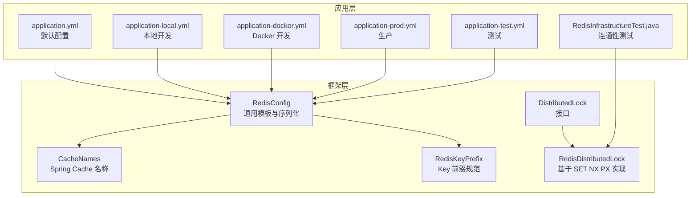
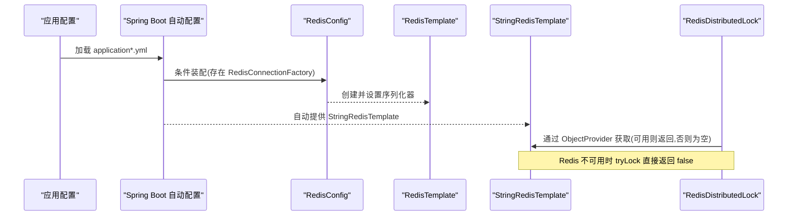
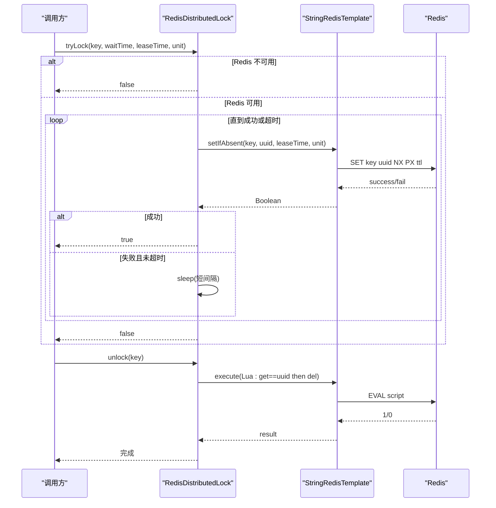
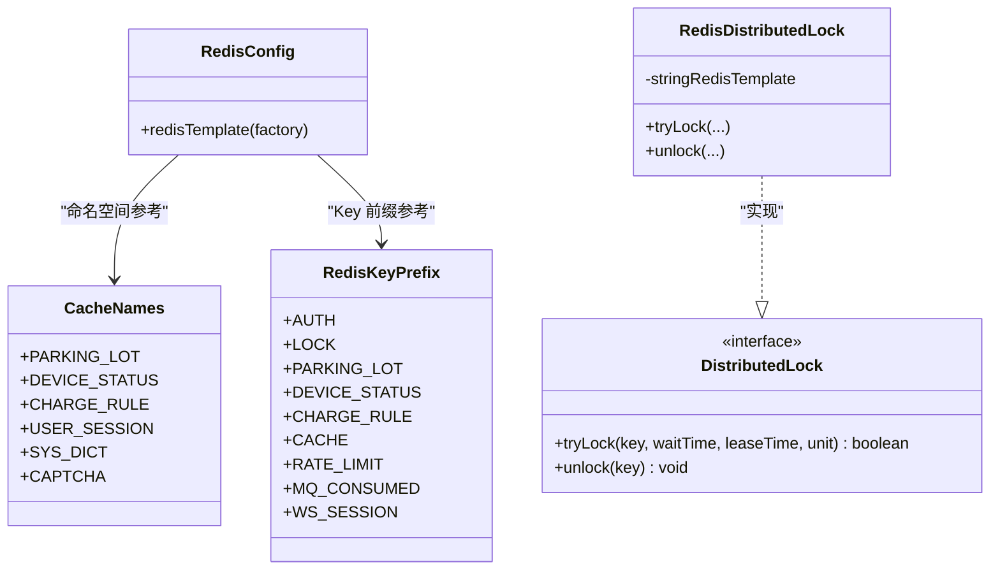

# 缓存系统集成

<cite>
**本文引用的文件**   
- [RedisConfig.java](file://parking-framework/src/main/java/com/jushan/framework/redis/RedisConfig.java)
- [CacheNames.java](file://parking-framework/src/main/java/com/jushan/framework/redis/CacheNames.java)
- [RedisKeyPrefix.java](file://parking-framework/src/main/java/com/jushan/framework/redis/RedisKeyPrefix.java)
- [DistributedLock.java](file://parking-framework/src/main/java/com/jushan/framework/lock/DistributedLock.java)
- [RedisDistributedLock.java](file://parking-framework/src/main/java/com/jushan/framework/lock/RedisDistributedLock.java)
- [application.yml](file://parking-boot/src/main/resources/application.yml)
- [application-local.yml](file://parking-boot/src/main/resources/application-local.yml)
- [application-docker.yml](file://parking-boot/src/main/resources/application-docker.yml)
- [application-prod.yml](file://parking-boot/src/main/resources/application-prod.yml)
- [application-test.yml](file://parking-boot/src/main/resources/application-test.yml)
- [RedisInfrastructureTest.java](file://parking-boot/src/test/java/com/jushan/boot/redis/RedisInfrastructureTest.java)
</cite>

## 目录
1. [简介](#简介)
2. [项目结构](#项目结构)
3. [核心组件](#核心组件)
4. [架构总览](#架构总览)
5. [详细组件分析](#详细组件分析)
6. [依赖关系分析](#依赖关系分析)
7. [性能与调优](#性能与调优)
8. [监控与清理策略](#监控与清理策略)
9. [故障排查指南](#故障排查指南)
10. [结论](#结论)

## 简介
本文件面向“智慧停车 SaaS 平台”的 Redis 缓存集成，系统性说明以下内容：
- Redis 配置与连接池管理（多环境、参数调优）
- 缓存命名空间设计（CacheNames 常量与 RedisKeyPrefix 前缀规范）
- 分布式锁实现（加锁/解锁逻辑与续期建议）
- 缓存策略（热点数据、穿透防护、雪崩避免）
- 监控与清理（命中率统计、内存使用、过期键清理）

## 项目结构
本项目将 Redis 相关能力集中在 framework 层，业务通过统一模板与常量进行访问；应用层通过多 profile 配置文件提供不同环境的连接参数。

图表来源
- [RedisConfig.java:1-70](file://parking-framework/src/main/java/com/jushan/framework/redis/RedisConfig.java#L1-L70)
- [CacheNames.java:1-40](file://parking-framework/src/main/java/com/jushan/framework/redis/CacheNames.java#L1-L40)
- [RedisKeyPrefix.java:1-67](file://parking-framework/src/main/java/com/jushan/framework/redis/RedisKeyPrefix.java#L1-L67)
- [DistributedLock.java:1-53](file://parking-framework/src/main/java/com/jushan/framework/lock/DistributedLock.java#L1-L53)
- [RedisDistributedLock.java:1-130](file://parking-framework/src/main/java/com/jushan/framework/lock/RedisDistributedLock.java#L1-L130)
- [application.yml:39-52](file://parking-boot/src/main/resources/application.yml#L39-L52)
- [application-local.yml:30-44](file://parking-boot/src/main/resources/application-local.yml#L30-L44)
- [application-docker.yml:33-46](file://parking-boot/src/main/resources/application-docker.yml#L33-L46)
- [application-prod.yml:34-47](file://parking-boot/src/main/resources/application-prod.yml#L34-L47)
- [application-test.yml:23-34](file://parking-boot/src/main/resources/application-test.yml#L23-L34)
- [RedisInfrastructureTest.java:36-66](file://parking-boot/src/test/java/com/jushan/boot/redis/RedisInfrastructureTest.java#L36-L66)

章节来源
- [RedisConfig.java:1-70](file://parking-framework/src/main/java/com/jushan/framework/redis/RedisConfig.java#L1-L70)
- [CacheNames.java:1-40](file://parking-framework/src/main/java/com/jushan/framework/redis/CacheNames.java#L1-L40)
- [RedisKeyPrefix.java:1-67](file://parking-framework/src/main/java/com/jushan/framework/redis/RedisKeyPrefix.java#L1-L67)
- [DistributedLock.java:1-53](file://parking-framework/src/main/java/com/jushan/framework/lock/DistributedLock.java#L1-L53)
- [RedisDistributedLock.java:1-130](file://parking-framework/src/main/java/com/jushan/framework/lock/RedisDistributedLock.java#L1-L130)
- [application.yml:39-52](file://parking-boot/src/main/resources/application.yml#L39-L52)
- [application-local.yml:30-44](file://parking-boot/src/main/resources/application-local.yml#L30-L44)
- [application-docker.yml:33-46](file://parking-boot/src/main/resources/application-docker.yml#L33-L46)
- [application-prod.yml:34-47](file://parking-boot/src/main/resources/application-prod.yml#L34-L47)
- [application-test.yml:23-34](file://parking-boot/src/main/resources/application-test.yml#L23-L34)
- [RedisInfrastructureTest.java:36-66](file://parking-boot/src/test/java/com/jushan/boot/redis/RedisInfrastructureTest.java#L36-L66)

## 核心组件
- Redis 通用配置与序列化
  - 自定义 RedisTemplate，Key 使用 String 序列化，Value 使用 Jackson JSON 序列化，便于跨语言与可读性。
  - 当无 RedisConnectionFactory Bean 时自动跳过，保证非 Redis 场景可正常启动。
- 缓存命名空间
  - CacheNames：定义 Spring Cache 的 cacheNames，按领域划分独立缓存区域。
  - RedisKeyPrefix：定义 Redis Key 层级前缀，统一为 jushan:模块:子模块:标识 风格。
- 分布式锁
  - 基于 SET key value NX PX ttl 原子命令实现，值带 UUID 防误删。
  - 通过 ObjectProvider 注入 StringRedisTemplate，在 Redis 不可用时优雅降级。

章节来源
- [RedisConfig.java:27-63](file://parking-framework/src/main/java/com/jushan/framework/redis/RedisConfig.java#L27-L63)
- [CacheNames.java:18-39](file://parking-framework/src/main/java/com/jushan/framework/redis/CacheNames.java#L18-L39)
- [RedisKeyPrefix.java:20-66](file://parking-framework/src/main/java/com/jushan/framework/redis/RedisKeyPrefix.java#L20-L66)
- [RedisDistributedLock.java:30-42](file://parking-framework/src/main/java/com/jushan/framework/lock/RedisDistributedLock.java#L30-L42)

## 架构总览
下图展示从应用配置到框架层的整体交互：多环境配置驱动连接参数，框架层提供统一的模板、命名与前缀，以及分布式锁能力。

图表来源
- [application.yml:39-52](file://parking-boot/src/main/resources/application.yml#L39-L52)
- [application-local.yml:30-44](file://parking-boot/src/main/resources/application-local.yml#L30-L44)
- [application-docker.yml:33-46](file://parking-boot/src/main/resources/application-docker.yml#L33-L46)
- [application-prod.yml:34-47](file://parking-boot/src/main/resources/application-prod.yml#L34-L47)
- [application-test.yml:23-34](file://parking-boot/src/main/resources/application-test.yml#L23-L34)
- [RedisConfig.java:27-63](file://parking-framework/src/main/java/com/jushan/framework/redis/RedisConfig.java#L27-L63)
- [RedisDistributedLock.java:40-42](file://parking-framework/src/main/java/com/jushan/framework/lock/RedisDistributedLock.java#L40-L42)

## 详细组件分析

### Redis 配置与连接池管理
- 连接参数与环境
  - 默认与本地：application.yml 与 application-local.yml 提供 localhost 连接与基础池参数。
  - Docker 开发：application-docker.yml 通过环境变量覆盖 host/port/password/database。
  - 生产：application-prod.yml 强制通过环境变量注入敏感信息，并提供合理的默认池大小。
  - 测试：application-test.yml 配合 Testcontainers 动态注入真实 Redis 实例。
- 连接池（Lettuce）
  - max-active/max-idle/min-idle/max-wait 等参数在各环境文件中显式配置，可按压测结果调整。
- 安全降级
  - RedisConfig 使用 @ConditionalOnClass/@ConditionalOnBean 确保在无 Redis 时不装配。
  - RedisDistributedLock 通过 ObjectProvider 注入，若不可用则 tryLock 返回 false，unlock 直接返回。

章节来源
- [application.yml:39-52](file://parking-boot/src/main/resources/application.yml#L39-L52)
- [application-local.yml:30-44](file://parking-boot/src/main/resources/application-local.yml#L30-L44)
- [application-docker.yml:33-46](file://parking-boot/src/main/resources/application-docker.yml#L33-L46)
- [application-prod.yml:34-47](file://parking-boot/src/main/resources/application-prod.yml#L34-L47)
- [application-test.yml:23-34](file://parking-boot/src/main/resources/application-test.yml#L23-L34)
- [RedisConfig.java:27-63](file://parking-framework/src/main/java/com/jushan/framework/redis/RedisConfig.java#L27-L63)
- [RedisDistributedLock.java:40-49](file://parking-framework/src/main/java/com/jushan/framework/lock/RedisDistributedLock.java#L40-L49)

### 缓存命名空间设计
- CacheNames（Spring Cache 名称）
  - 按业务域划分：停车场、设备状态、收费规则、用户会话、字典、验证码等。
  - 用于 @Cacheable/@CacheEvict 等注解的 cacheNames 字段，隔离不同业务缓存空间。
- RedisKeyPrefix（Redis Key 前缀）
  - 统一层级命名：jushan:模块:子模块:具体标识。
  - 分类包括：认证与会话、分布式锁、业务缓存、通用缓存、限流计数、消息幂等、WebSocket 会话等。
- 全局前缀
  - RedisConfig 中定义了全局前缀常量，所有通过该模板写入的 Key 均遵循此约定。

章节来源
- [CacheNames.java:18-39](file://parking-framework/src/main/java/com/jushan/framework/redis/CacheNames.java#L18-L39)
- [RedisKeyPrefix.java:20-66](file://parking-framework/src/main/java/com/jushan/framework/redis/RedisKeyPrefix.java#L20-L66)
- [RedisConfig.java:31-35](file://parking-framework/src/main/java/com/jushan/framework/redis/RedisConfig.java#L31-L35)

### 分布式锁实现
- 加锁流程
  - 使用 SET key value NX PX ttl 原子操作，value 包含唯一标识防止误删。
  - 支持等待时间 waitTime 与持有时间 leaseTime，失败会短暂休眠重试直至超时。
- 解锁流程
  - 通过 Lua 脚本比较当前值后删除，保证仅持有者可释放。
  - 线程级上下文记录 key→value 映射，避免跨线程误释放。
- 续期机制
  - 当前实现未内置看门狗自动续期；长任务需合理设置 leaseTime 或自行扩展续期逻辑。
- 降级策略
  - Redis 不可用时 tryLock 直接返回 false，不影响主流程可用性。

图表来源
- [RedisDistributedLock.java:44-74](file://parking-framework/src/main/java/com/jushan/framework/lock/RedisDistributedLock.java#L44-L74)
- [RedisDistributedLock.java:76-108](file://parking-framework/src/main/java/com/jushan/framework/lock/RedisDistributedLock.java#L76-L108)

章节来源
- [DistributedLock.java:33-52](file://parking-framework/src/main/java/com/jushan/framework/lock/DistributedLock.java#L33-L52)
- [RedisDistributedLock.java:30-128](file://parking-framework/src/main/java/com/jushan/framework/lock/RedisDistributedLock.java#L30-L128)

### 缓存策略设计
- 热点数据缓存
  - 使用 CacheNames 对应业务域，结合 @Cacheable 注解对高频读路径进行缓存。
  - 建议为热点 Key 设置合理 TTL，并结合布隆过滤器或空值缓存降低穿透风险。
- 缓存穿透防护
  - 对不存在的数据采用短 TTL 的空值占位，避免反复查询后端。
  - 可在网关或入口层增加请求校验与限流，减少恶意扫描。
- 缓存雪崩避免
  - 为热点 Key 的过期时间添加随机抖动，避免集中失效。
  - 关键数据可采用互斥重建（分布式锁），避免大量并发回源。
- 一致性策略
  - 写后更新/删除缓存，优先保证最终一致；必要时引入延迟双删或订阅变更事件。

[本节为概念性说明，不直接分析具体文件]

## 依赖关系分析
- 组件耦合
  - RedisConfig 依赖 Spring Data Redis 提供的连接工厂与序列化器。
  - RedisDistributedLock 依赖 StringRedisTemplate，并通过 ObjectProvider 实现可选注入。
  - CacheNames 与 RedisKeyPrefix 为纯常量类，被业务代码引用以统一命名。
- 外部依赖
  - Lettuce 连接池由 Spring Boot 自动配置，各环境通过 application*.yml 覆盖参数。
  - 测试环境通过 Testcontainers 拉起真实 Redis 容器，验证连通性与基本读写。

图表来源
- [RedisConfig.java:27-63](file://parking-framework/src/main/java/com/jushan/framework/redis/RedisConfig.java#L27-L63)
- [DistributedLock.java:33-52](file://parking-framework/src/main/java/com/jushan/framework/lock/DistributedLock.java#L33-L52)
- [RedisDistributedLock.java:30-128](file://parking-framework/src/main/java/com/jushan/framework/lock/RedisDistributedLock.java#L30-L128)
- [CacheNames.java:18-39](file://parking-framework/src/main/java/com/jushan/framework/redis/CacheNames.java#L18-L39)
- [RedisKeyPrefix.java:20-66](file://parking-framework/src/main/java/com/jushan/framework/redis/RedisKeyPrefix.java#L20-L66)

章节来源
- [RedisConfig.java:27-63](file://parking-framework/src/main/java/com/jushan/framework/redis/RedisConfig.java#L27-L63)
- [RedisDistributedLock.java:30-128](file://parking-framework/src/main/java/com/jushan/framework/lock/RedisDistributedLock.java#L30-L128)
- [CacheNames.java:18-39](file://parking-framework/src/main/java/com/jushan/framework/redis/CacheNames.java#L18-L39)
- [RedisKeyPrefix.java:20-66](file://parking-framework/src/main/java/com/jushan/framework/redis/RedisKeyPrefix.java#L20-L66)

## 性能与调优
- 连接池参数
  - 根据 QPS 与平均响应时间调整 max-active/max-idle/min-idle/max-wait，避免连接耗尽与排队。
  - 生产环境建议开启连接健康检查与空闲回收，降低僵尸连接影响。
- 序列化开销
  - Value 使用 Jackson JSON，注意对象版本兼容与大对象体积控制。
- 锁粒度与超时
  - 尽量缩小锁粒度，缩短临界区；leaseTime 应大于最坏执行时间并留有余量。
- 热点 Key 优化
  - 局部热点可考虑本地缓存（如 Caffeine）+ 分布式缓存组合，降低 Redis 压力。

[本节为通用指导，不直接分析具体文件]

## 监控与清理策略
- 命中率统计
  - 建议在业务侧埋点统计缓存命中/未命中比例，结合链路追踪定位热点与异常。
- 内存使用监控
  - 关注 Redis 内存峰值与碎片率，定期评估 Key 分布与 TTL 合理性。
- 过期键清理
  - 利用 Redis 过期策略与惰性删除，结合定时任务巡检大 Key 与长尾热点。
- 健康检查
  - Actuator health 暴露基础健康信息；测试用例已覆盖 PING 与基本读写。

章节来源
- [application.yml:75-90](file://parking-boot/src/main/resources/application.yml#L75-L90)
- [RedisInfrastructureTest.java:50-64](file://parking-boot/src/test/java/com/jushan/boot/redis/RedisInfrastructureTest.java#L50-L64)

## 故障排查指南
- Redis 不可用
  - 现象：分布式锁 tryLock 返回 false，日志提示 Redis 不可用。
  - 排查：确认 application*.yml 的连接参数、网络可达性与鉴权密码。
- 连接池耗尽
  - 现象：出现连接等待超时或拒绝。
  - 排查：提升 max-active，检查慢查询与热点 Key，评估是否需要分片或扩容。
- Key 冲突或污染
  - 现象：不同环境或租户数据串扰。
  - 排查：确认全局前缀与业务前缀是否区分，数据库索引是否隔离。
- 锁未释放或误删
  - 现象：死锁或他人释放了别人的锁。
  - 排查：确认 value 唯一性、Lua 脚本比较逻辑与线程上下文是否正确清理。

章节来源
- [RedisDistributedLock.java:44-74](file://parking-framework/src/main/java/com/jushan/framework/lock/RedisDistributedLock.java#L44-L74)
- [RedisDistributedLock.java:76-108](file://parking-framework/src/main/java/com/jushan/framework/lock/RedisDistributedLock.java#L76-L108)

## 结论
本方案通过统一的 Redis 配置、清晰的命名空间与健壮的分布式锁实现，为平台提供了可扩展、可观测、可降级的缓存基础设施。在多环境配置下，连接池与参数可调优；在策略层面，结合热点缓存、穿透防护与雪崩规避，可有效提升系统稳定性与性能。后续可根据业务复杂度引入更高级的锁特性与缓存治理工具。