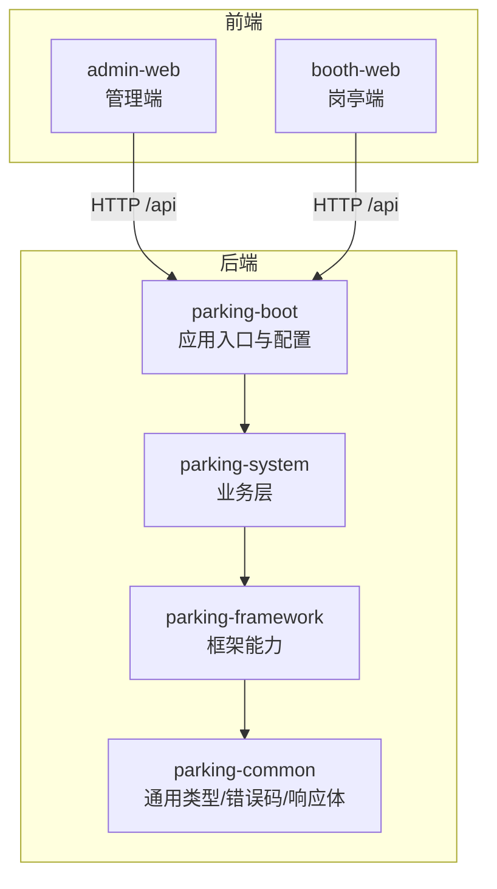
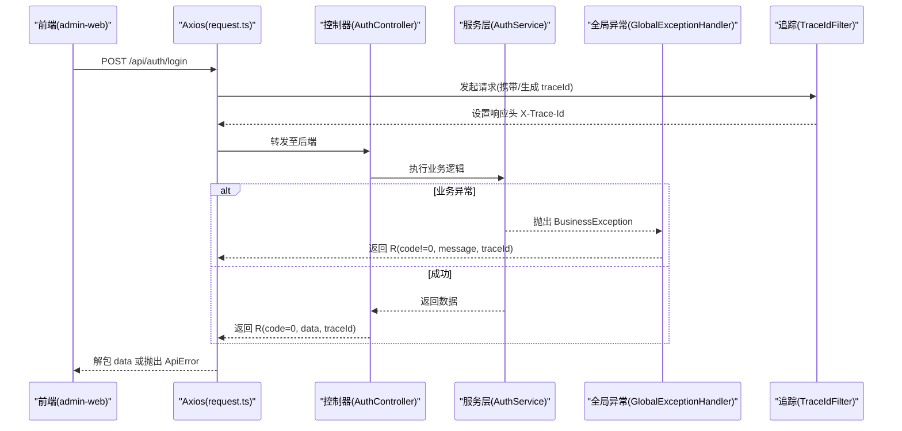
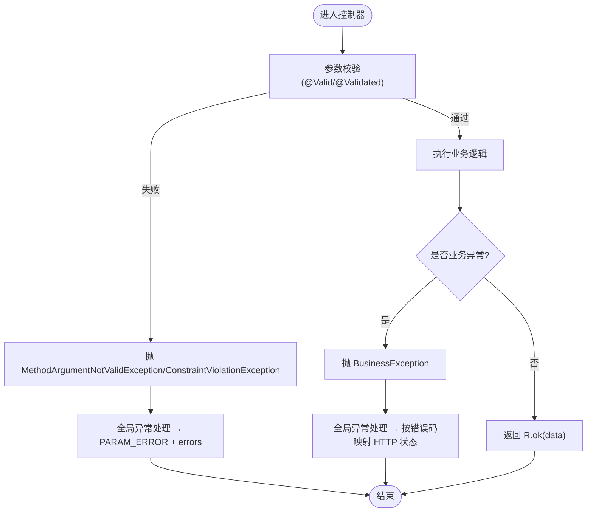
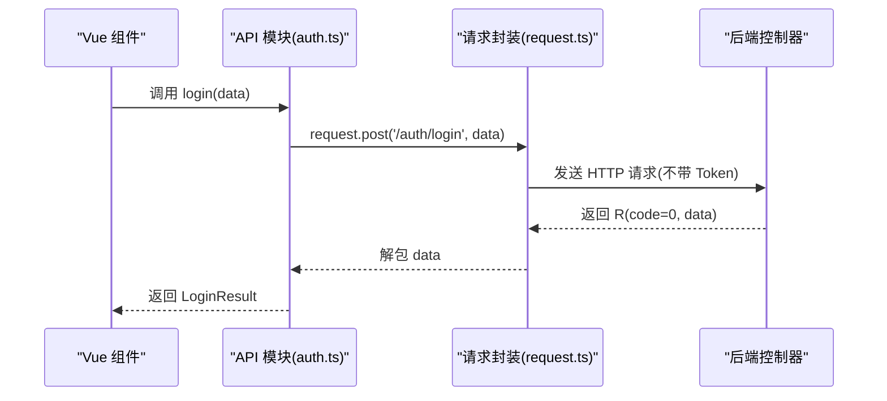
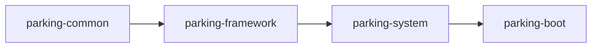

# 代码规范

<cite>
**本文引用的文件**   
- [README.md](file://README.md)
- [R.java](file://parking-common/src/main/java/com/jushan/common/R.java)
- [BusinessException.java](file://parking-common/src/main/java/com/jushan/common/BusinessException.java)
- [CommonErrorCode.java](file://parking-common/src/main/java/com/jushan/common/CommonErrorCode.java)
- [GlobalExceptionHandler.java](file://parking-framework/src/main/java/com/jushan/framework/web/GlobalExceptionHandler.java)
- [TraceIdFilter.java](file://parking-framework/src/main/java/com/jushan/framework/web/TraceIdFilter.java)
- [application.yml](file://parking-boot/src/main/resources/application.yml)
- [AuthController.java](file://parking-system/src/main/java/com/jushan/system/controller/AuthController.java)
- [request.ts](file://admin-web/src/utils/request.ts)
- [auth.ts](file://admin-web/src/api/auth.ts)
- [vite.config.ts（booth）](file://booth-web/vite.config.ts)
</cite>

## 目录
1. [引言](#引言)
2. [项目结构](#项目结构)
3. [核心组件](#核心组件)
4. [架构总览](#架构总览)
5. [详细组件分析](#详细组件分析)
6. [依赖分析](#依赖分析)
7. [性能考虑](#性能考虑)
8. [故障排查指南](#故障排查指南)
9. [结论](#结论)
10. [附录](#附录)

## 引言
本规范面向 Java 后端与前端 Vue3 + TypeScript 工程，统一编码约定、异常处理、响应格式、日志与追踪、SQL 编写、IDE 配置、Git 工作流等实践。目标是在多模块 Maven 工程与前后端分离架构下，确保一致性、可维护性与可观测性。

## 项目结构
仓库采用多模块 Maven 组织：
- parking-common：通用类型、错误码、业务异常、统一响应体
- parking-framework：框架能力（全局异常、追踪、鉴权、缓存、消息、WebSocket 等）
- parking-system：业务领域（控制器、服务、实体、映射、DTO/VO 等）
- parking-boot：应用启动与配置
- admin-web / booth-web：管理端与岗亭端前端工程
- miniapp：微信小程序
- docs：需求、设计、契约与部署文档

图表来源
- [application.yml:1-108](file://parking-boot/src/main/resources/application.yml#L1-L108)
- [AuthController.java:1-100](file://parking-system/src/main/java/com/jushan/system/controller/AuthController.java#L1-L100)
- [request.ts:1-176](file://admin-web/src/utils/request.ts#L1-L176)

章节来源
- [README.md:1-76](file://README.md#L1-L76)

## 核心组件
本节聚焦统一响应体 R、业务异常 BusinessException、全局异常处理器 GlobalExceptionHandler、追踪过滤器 TraceIdFilter 以及前端请求封装 request.ts。

- 统一响应体 R<T>
  - 字段：code、message、data、traceId、errors（可选）
  - 工厂方法：ok()/fail() 系列；fluent 方法 traceId()/errors()
  - 成功码为 0，失败通过 ErrorCode 或自定义 code/message
  - 使用位置：所有 Controller 返回 R<T>，保证前端解析一致

- 业务异常 BusinessException
  - 携带 ErrorCode 与可选格式化参数
  - 由全局异常处理器捕获并转换为 R 响应

- 全局异常处理器 GlobalExceptionHandler
  - 统一处理：参数校验失败、业务异常、认证/授权异常、Spring 内置异常、未知异常
  - 协议级错误码到 HTTP 状态映射：400/401/403/404/409/429
  - 禁止将堆栈泄露给前端

- 全链路追踪 TraceIdFilter
  - 入站优先复用上游 X-Trace-Id，否则生成新 ID
  - 写入 SLF4J MDC 与响应头 X-Trace-Id
  - 请求结束清理 MDC，避免线程池泄漏

- 前端请求封装 request.ts
  - 统一 baseURL=/api，超时 30s
  - 请求拦截：自动注入 Authorization Bearer Token（登录接口除外）
  - 响应拦截：code=0 视为成功；401 清理本地态并跳转登录；其他错误提示并抛出 ApiError
  - 暴露 get/post/put/delete 便捷方法

章节来源
- [R.java:1-162](file://parking-common/src/main/java/com/jushan/common/R.java#L1-L162)
- [BusinessException.java:1-84](file://parking-common/src/main/java/com/jushan/common/BusinessException.java#L1-L84)
- [CommonErrorCode.java:1-62](file://parking-common/src/main/java/com/jushan/common/CommonErrorCode.java#L1-L62)
- [GlobalExceptionHandler.java:1-240](file://parking-framework/src/main/java/com/jushan/framework/web/GlobalExceptionHandler.java#L1-L240)
- [TraceIdFilter.java:1-76](file://parking-framework/src/main/java/com/jushan/framework/web/TraceIdFilter.java#L1-L76)
- [request.ts:1-176](file://admin-web/src/utils/request.ts#L1-L176)

## 架构总览
下图展示一次登录请求从前端到后端的完整调用链路与异常/追踪贯穿点。

图表来源
- [AuthController.java:1-100](file://parking-system/src/main/java/com/jushan/system/controller/AuthController.java#L1-L100)
- [request.ts:1-176](file://admin-web/src/utils/request.ts#L1-L176)
- [GlobalExceptionHandler.java:1-240](file://parking-framework/src/main/java/com/jushan/framework/web/GlobalExceptionHandler.java#L1-L240)
- [TraceIdFilter.java:1-76](file://parking-framework/src/main/java/com/jushan/framework/web/TraceIdFilter.java#L1-L76)

## 详细组件分析

### Java 编码约定
- 包结构
  - 公共基础：com.jushan.common
  - 框架能力：com.jushan.framework.*
  - 业务域：com.jushan.system.*
  - 应用启动：com.jushan.boot.*
- 类命名
  - 控制器：XxxController
  - 服务：XxxService
  - 数据传输对象：XxxRequest/XxxResponse/XxxDTO
  - 视图对象：XxxVO
  - 实体：XxxEntity 或直接以业务名词 Xxx
  - 枚举：XxxEnum
  - 配置：XxxConfig/XxxProperties
- 方法命名
  - 动词+名词：login/logout/session/changePassword
  - 查询：get/list/query/find
  - 变更：create/update/delete/save
  - 校验：validate/check
- 注释规范
  - 类与方法提供 Javadoc，说明职责、参数、返回值与异常
  - 关键流程与边界条件需补充行内注释
- 日志记录标准
  - 使用 SLF4J，按级别输出：info/warn/error
  - 必须包含 traceId（来自 MDC），便于跨系统定位
  - 敏感信息脱敏（如密码、手机号）
- SQL 编写规范
  - 使用 Flyway 迁移脚本，按版本递增命名
  - 表/字段命名小写下划线，主键 id，时间戳 created_at/updated_at
  - 索引策略：外键列、高频查询列建索引；避免过度索引
  - 事务边界清晰，长事务拆分为短事务或异步任务

章节来源
- [AuthController.java:1-100](file://parking-system/src/main/java/com/jushan/system/controller/AuthController.java#L1-L100)
- [application.yml:1-108](file://parking-boot/src/main/resources/application.yml#L1-L108)

### 异常处理与统一响应
- 统一响应体 R<T>
  - 成功：code=0，data 可为 null
  - 失败：code!=0，message 描述原因，errors 可选用于字段校验详情
  - traceId 始终序列化，便于前端上报问题
- 业务异常 BusinessException
  - 推荐优先使用预定义 ErrorCode
  - 支持覆盖默认 message 或传入格式化参数
- 全局异常处理器
  - 参数校验失败：提取 field→message 列表放入 errors
  - 业务异常：按协议级错误码映射 HTTP 状态，其余保持 200
  - 认证/授权：未登录 401，无权限 403
  - Spring 内置：404/405 分别处理
  - 兜底：未知异常返回 INTERNAL_ERROR，不泄露堆栈
- 错误码体系
  - CommonErrorCode 定义通用错误码
  - 业务模块应扩展自有 ErrorCode 枚举，避免污染通用码

图表来源
- [GlobalExceptionHandler.java:1-240](file://parking-framework/src/main/java/com/jushan/framework/web/GlobalExceptionHandler.java#L1-L240)
- [R.java:1-162](file://parking-common/src/main/java/com/jushan/common/R.java#L1-L162)
- [BusinessException.java:1-84](file://parking-common/src/main/java/com/jushan/common/BusinessException.java#L1-L84)
- [CommonErrorCode.java:1-62](file://parking-common/src/main/java/com/jushan/common/CommonErrorCode.java#L1-L62)

章节来源
- [GlobalExceptionHandler.java:1-240](file://parking-framework/src/main/java/com/jushan/framework/web/GlobalExceptionHandler.java#L1-L240)
- [R.java:1-162](file://parking-common/src/main/java/com/jushan/common/R.java#L1-L162)
- [BusinessException.java:1-84](file://parking-common/src/main/java/com/jushan/common/BusinessException.java#L1-L84)
- [CommonErrorCode.java:1-62](file://parking-common/src/main/java/com/jushan/common/CommonErrorCode.java#L1-L62)

### 前端 Vue3 + TypeScript 规范
- 组件命名
  - 组件文件与组件名使用 PascalCase，如 DeviceList.vue
  - 路由页面文件使用 index.vue 或语义化文件名
- API 调用封装
  - 统一通过 @/utils/request 的 get/post/put/delete
  - 每个功能域在 src/api 下独立文件，如 auth.ts/device.ts
  - 登录接口不携带 Token，其他接口自动注入 Authorization
- 状态管理模式
  - 使用 Pinia 管理全局状态（如用户态、标签页、应用配置）
  - 状态持久化建议结合 localStorage/sessionStorage
- 错误处理
  - 统一捕获 ApiError，根据 code/status 提示用户
  - 401 时清理本地态并跳转登录；403 仅提示无权限
- 样式与主题
  - SCSS 变量集中管理，使用 @use 引入，避免弃用语法
- 构建与代理
  - Vite 开发服务器对 /api 进行重写转发到后端
  - 生产环境通过 Nginx 反向代理统一前缀

图表来源
- [auth.ts:1-18](file://admin-web/src/api/auth.ts#L1-L18)
- [request.ts:1-176](file://admin-web/src/utils/request.ts#L1-L176)
- [AuthController.java:1-100](file://parking-system/src/main/java/com/jushan/system/controller/AuthController.java#L1-L100)

章节来源
- [auth.ts:1-18](file://admin-web/src/api/auth.ts#L1-L18)
- [request.ts:1-176](file://admin-web/src/utils/request.ts#L1-L176)
- [vite.config.ts（booth）:1-46](file://booth-web/vite.config.ts#L1-L46)

### 日志与追踪
- 日志模式
  - 控制台输出包含 thread 与 traceId，便于聚合检索
- 追踪贯穿
  - TraceIdFilter 负责生成/复用 traceId，写入 MDC 与响应头
  - 全局异常处理器在异常日志中附带 traceId
- 安全要求
  - 禁止将内部堆栈或敏感信息输出到前端响应
  - 生产环境关闭调试日志与打印开关

章节来源
- [TraceIdFilter.java:1-76](file://parking-framework/src/main/java/com/jushan/framework/web/TraceIdFilter.java#L1-L76)
- [GlobalExceptionHandler.java:1-240](file://parking-framework/src/main/java/com/jushan/framework/web/GlobalExceptionHandler.java#L1-L240)
- [application.yml:101-108](file://parking-boot/src/main/resources/application.yml#L101-L108)

### Git 提交信息与分支管理
- 提交信息
  - 使用 Conventional Commits：feat/fix/docs/style/refactor/perf/test/build/ci/chore/revert
  - 示例：feat(auth): 新增修改密码接口
- 分支命名
  - feature/xxx、fix/xxx、hotfix/xxx、release/x.y.z
- 合并策略
  - 主干保护，PR 审查通过后合并
  - 重要变更需附测试用例与影响面说明

[本节为通用实践说明，不直接分析具体文件]

### IDE 与工具配置建议
- Java
  - Lombok + MapStruct 注解处理器已在父 POM 配置，IDE 需启用注解处理
  - 建议开启编译期检查与警告提升
- 前端
  - ESLint + Prettier 统一风格
  - Vite 插件与别名 @ 指向 src
  - SCSS 使用 @use 替代 @import

章节来源
- [pom.xml:159-185](file://pom.xml#L159-L185)
- [vite.config.ts（booth）:1-46](file://booth-web/vite.config.ts#L1-L46)

## 依赖分析
- 模块依赖关系
  - parking-boot 依赖 parking-system
  - parking-system 依赖 parking-framework
  - parking-framework 依赖 parking-common
- 外部依赖
  - Spring Boot、Sa-Token、MyBatis-Plus、Flyway、Redis、MySQL
  - 前端 Axios、Vue3、Pinia、Vite

图表来源
- [application.yml:1-108](file://parking-boot/src/main/resources/application.yml#L1-L108)

章节来源
- [application.yml:1-108](file://parking-boot/src/main/resources/application.yml#L1-L108)

## 性能考虑
- 数据库
  - 合理索引与分页查询，避免大事务
  - 连接池大小与超时按负载调优
- 缓存
  - 热点数据使用 Redis，注意过期策略与穿透防护
- 网络
  - 前端请求超时与重试策略
  - 后端对外部服务调用设置合理的 connect/read timeout
- 前端
  - 按需加载与分包，减少首屏体积
  - 图片与静态资源 CDN 加速

[本节为通用指导，不直接分析具体文件]

## 故障排查指南
- 快速定位
  - 通过前端错误提示中的 traceId 在后端日志中检索
  - 关注全局异常处理器输出的 warn/error 日志
- 常见问题
  - 401：Token 缺失或过期，前端会清理本地态并跳转登录
  - 403：权限不足，检查角色/权限配置
  - 404/405：路径或方法不匹配，核对路由与注解
  - 参数校验失败：查看 errors 数组定位字段
- 日志规范
  - 业务异常使用 warn 级别，系统异常使用 error 级别
  - 不要在前端响应中输出堆栈

章节来源
- [GlobalExceptionHandler.java:1-240](file://parking-framework/src/main/java/com/jushan/framework/web/GlobalExceptionHandler.java#L1-L240)
- [request.ts:1-176](file://admin-web/src/utils/request.ts#L1-L176)

## 结论
本规范围绕统一响应体、统一异常、全链路追踪与前后端协作展开，明确了 Java 与前端的核心约定与实践。遵循本规范有助于提升代码一致性、可维护性与问题定位效率。

## 附录
- 参考文档
  - README 与共享契约入口见仓库根目录与 docs 目录
- 相关实现
  - 认证接口示例：AuthController
  - 前端 API 封装：auth.ts 与 request.ts

章节来源
- [README.md:1-76](file://README.md#L1-L76)
- [AuthController.java:1-100](file://parking-system/src/main/java/com/jushan/system/controller/AuthController.java#L1-L100)
- [auth.ts:1-18](file://admin-web/src/api/auth.ts#L1-L18)
- [request.ts:1-176](file://admin-web/src/utils/request.ts#L1-L176)