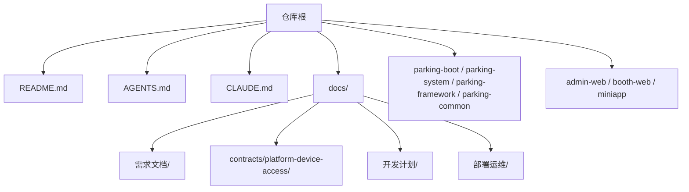
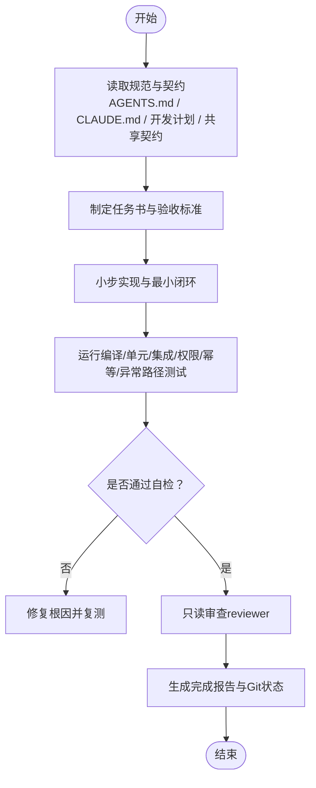
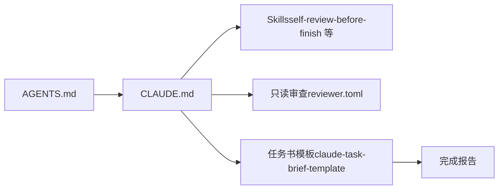

# 团队协作规范

<cite>
**本文引用的文件**   
- [README.md](file://README.md)
- [AGENTS.md](file://AGENTS.md)
- [CLAUDE.md](file://CLAUDE.md)
- [T01-仓库与文档基线审查.md](file://docs/归档/平台侧/T01-仓库与文档基线审查.md)
- [停车业务平台与DeviceAccess接口规范-v0.1-历史版.md](file://docs/归档/平台侧/停车业务平台与DeviceAccess接口规范-v0.1-历史版.md)
- [self-review-before-finish/SKILL.md](file://.claude/skills/self-review-before-finish/SKILL.md)
- [reviewer.toml](file://.codex/agents/reviewer.toml)
- [claude-task-brief-template.md](file://.codex/references/claude-task-brief-template.md)
</cite>

## 目录
1. [引言](#引言)
2. [项目结构](#项目结构)
3. [核心组件](#核心组件)
4. [架构总览](#架构总览)
5. [详细组件分析](#详细组件分析)
6. [依赖关系分析](#依赖关系分析)
7. [性能考量](#性能考量)
8. [故障排查指南](#故障排查指南)
9. [结论](#结论)
10. [附录](#附录)

## 引言
本规范面向智慧停车 SaaS 平台的协作与开发流程，覆盖 Git 工作流、分支管理、提交信息规范、代码审查流程；任务管理机制（需求分析、任务拆分、进度跟踪、验收标准）；AI 协作规范（Claude Code 使用约定、技能调用流程、风险审查机制）；文档编写与维护规范；测试协作规范；发布管理与回滚策略；以及沟通协作规范。所有规则均以仓库内既有规范为依据，确保可执行、可审计、可追溯。

## 项目结构
仓库采用“多端 + 模块化单体”的形态：后端为 Maven 多模块聚合，前端包含管理后台与岗亭端工程，另有小程序端与共享契约文档。仓库根目录提供 README 与协作规范入口，docs 下集中存放需求、契约、开发计划、部署运维等文档。

图表来源
- [README.md:1-75](file://README.md#L1-L75)
- [AGENTS.md:1-50](file://AGENTS.md#L1-L50)
- [CLAUDE.md:1-36](file://CLAUDE.md#L1-L36)

章节来源
- [README.md:1-75](file://README.md#L1-L75)
- [AGENTS.md:1-50](file://AGENTS.md#L1-L50)

## 核心组件
- 协作规范与事实等级：以 AGENTS.md 为仓库级协作规范，明确输入优先级、系统边界、P0 红线、Sprint 执行规则与全局约束。
- Claude Code 执行手册：CLAUDE.md 定义指令优先级、安全原则、小步实施、测试矩阵、完成报告格式与停止条件。
- 自审技能：self-review-before-finish 用于每次交付前的范围、回归、测试与安全扫描，并输出标准化完成报告。
- 只读审查者：Codex reviewer 仅做只读审查，聚焦正确性、边界、兼容性与测试缺口。
- 任务书模板：claude-task-brief-template 统一任务目标、验收标准、停止升级条件与完成报告格式。

章节来源
- [AGENTS.md:1-50](file://AGENTS.md#L1-L50)
- [CLAUDE.md:1-62](file://CLAUDE.md#L1-L62)
- [self-review-before-finish/SKILL.md:1-54](file://.claude/skills/self-review-before-finish/SKILL.md#L1-L54)
- [reviewer.toml:1-9](file://.codex/agents/reviewer.toml#L1-L9)
- [claude-task-brief-template.md:82-118](file://.codex/references/claude-task-brief-template.md#L82-L118)

## 架构总览
协作与开发流程围绕“规范驱动 + 小步验证 + 严格自检”展开：以 AGENTS.md 和 CLAUDE.md 为最高准则，结合开发计划与共享契约进行任务拆解与实施；通过 Skills 与只读审查者在关键节点进行质量门禁；最终按统一模板输出完成报告与 Git 状态。

图表来源
- [CLAUDE.md:96-123](file://CLAUDE.md#L96-L123)
- [CLAUDE.md:348-392](file://CLAUDE.md#L348-L392)
- [self-review-before-finish/SKILL.md:80-134](file://.claude/skills/self-review-before-finish/SKILL.md#L80-L134)
- [reviewer.toml:1-9](file://.codex/agents/reviewer.toml#L1-L9)

## 详细组件分析

### Git 工作流与分支管理
- 当前基线与分支现状：基线审查显示 develop 为当前开发分支，origin/master 与 origin/device 存在但差异仅为文档或初始内容。
- 分支建议：
  - main：受保护的生产分支，仅允许通过合并请求上线。
  - develop：集成与联调分支，承载 Sprint 迭代产物。
  - feature/*：功能分支，从 develop 切出，完成后合入 develop。
  - hotfix/*：紧急修复分支，从 main 切出，修复后合入 main 与 develop。
  - release/*：预发与灰度分支，从 develop 切出，经完整验证后合入 main。
- 提交前检查：必须运行 git status、git branch --show-current，确认未混入无关改动。

章节来源
- [T01-仓库与文档基线审查.md:19-58](file://docs/归档/平台侧/T01-仓库与文档基线审查.md#L19-L58)
- [CLAUDE.md:127-143](file://CLAUDE.md#L127-L143)

### 提交信息规范
- 类型建议：feat、fix、docs、refactor、test、chore、build、ci、revert。
- 格式建议：<type>(scope): <subject>
- 正文要求：说明动机、影响范围、破坏性变更、关联任务号。
- 禁止行为：不得修改 Git 历史、不得 force push、不得覆盖用户未提交改动。

章节来源
- [CLAUDE.md:394-408](file://CLAUDE.md#L394-L408)

### 代码审查流程
- 日常审查：Claude Code 通过 review-risk-gate 与 self-review-before-finish 完成自检。
- 只读审查：Codex reviewer 仅做只读审查，输出有证据的 Findings，不修改文件与执行写操作。
- 审查重点：正确性、边界条件、兼容性、回归风险、缺失测试。

章节来源
- [CLAUDE.md:447-457](file://CLAUDE.md#L447-L457)
- [reviewer.toml:1-9](file://.codex/agents/reviewer.toml#L1-L9)

### 任务管理机制
- 输入与优先级：用户指令 > 任务书 > AGENTS.md > CLAUDE.md > 需求与接口文档 > 既有惯例。
- 任务书要素：目标、允许/禁止范围、前置任务、API/DDL/算法要点、测试要点、验收标准、停止与升级条件、回滚方式、待确认事项。
- 进度跟踪：Sprint 周期化推进，每个 Sprint 结束前必须联调与测试闭环。
- 验收标准：功能、安全与隔离、兼容性、测试证据、修改范围。

章节来源
- [CLAUDE.md:5-23](file://CLAUDE.md#L5-L23)
- [CLAUDE.md:145-158](file://CLAUDE.md#L145-L158)
- [AGENTS.md:212-230](file://AGENTS.md#L212-L230)
- [claude-task-brief-template.md:82-118](file://.codex/references/claude-task-brief-template.md#L82-L118)

### AI 协作规范（Claude Code）
- 定位与职责：主力工程 Agent，负责按任务持续实现、构建测试、自检与交付报告。
- 安全红线：fail-open 权限、忽略租户上下文、绕过鉴权、明文敏感信息、跳过校验等均严格禁止。
- 小步实施：先建立基线与失败现象，再最小改动，立即验证，逐步推进。
- 技能调用：复杂任务启动前读取相关 SKILL；后端参考 springboot-api-dev，前端参考 vue3-admin-dev；Bug 修复参考 debug-minimal-fix；完成前调用 build-verify-handoff；日常风险审查调用 review-risk-gate；完成前自检调用 self-review-before-finish。
- 停止条件：涉及架构变更、冻结接口冲突、跨租户越权、支付安全、不可逆迁移、连续两轮修复失败等必须停止扩大修改并上报。

章节来源
- [CLAUDE.md:39-62](file://CLAUDE.md#L39-L62)
- [CLAUDE.md:64-73](file://CLAUDE.md#L64-L73)
- [CLAUDE.md:175-188](file://CLAUDE.md#L175-L188)
- [CLAUDE.md:447-457](file://CLAUDE.md#L447-L457)
- [CLAUDE.md:410-426](file://CLAUDE.md#L410-L426)

### 文档编写与维护规范
- 文档体系：需求文档（PRD）、共享契约（OpenAPI/AsyncAPI/JSON Schema）、开发计划（section_01~06）、部署运维、技术架构。
- 机器可读契约：基于 Markdown 评审通过后同步生成 OpenAPI、AsyncAPI、Schema 与错误码文件；冻结后需同时更新并通过双方评审。
- 维护流程：版本化命名、变更记录、冲突时以冻结文档为准；缺失契约的实现必须暂停并上报。

章节来源
- [README.md:18-33](file://README.md#L18-L33)
- [停车业务平台与DeviceAccess接口规范-v0.1-历史版.md:2985-3000](file://docs/归档/平台侧/停车业务平台与DeviceAccess接口规范-v0.1-历史版.md#L2985-L3000)
- [AGENTS.md:1-15](file://AGENTS.md#L1-L15)

### 测试协作规范
- 测试范围：编译、单元测试、模块测试、数据库迁移检查、接口测试、权限与数据隔离、幂等、异常路径。
- 基础设施：优先 Testcontainers；Device Access 集成使用 WireMock/MockWebServer 等 HTTP Mock。
- Device Access 最低测试矩阵：成功、设备不存在、MQTT 不可用、设备错误、命令超时、客户端超时、解析失败、跨停车场、重复开闸、UNCERTAIN、审计记录。
- 失败处理：保留失败命令与日志，定位根因，仅修复任务范围内问题，无法修复则停止扩大修改并报告风险。

章节来源
- [CLAUDE.md:348-392](file://CLAUDE.md#L348-L392)

### 发布管理与回滚策略
- 发布分支：release/* 用于预发与灰度，经过完整联调与测试后合入 main。
- 健康探针：服务暴露 liveness/readiness 探针，便于编排与健康检查。
- 配置外置：环境变量注入，禁止硬编码；日志统一 JSON 输出到 stdout。
- 回滚策略：Flyway 迁移独立版本且可前向执行，具备回滚方案；生产迁移先备份，不可逆迁移需决策。

章节来源
- [CLAUDE.md:516-522](file://CLAUDE.md#L516-L522)
- [AGENTS.md:177-186](file://AGENTS.md#L177-L186)

### 沟通协作规范
- 问题上报：发现 P0 或停止条件触发时，立即停止扩大修改，保留证据并上报用户或阶段性 Codex 审查决策。
- 知识分享：将经验沉淀至 docs/ 与共享契约，保持文档与代码一致性。
- 经验总结：每个 Sprint 结束后复盘阻塞项、风险点与改进措施，纳入后续任务书与规范。

章节来源
- [CLAUDE.md:410-426](file://CLAUDE.md#L410-L426)
- [AGENTS.md:212-230](file://AGENTS.md#L212-L230)

## 依赖关系分析
协作规范之间的依赖关系如下：AGENTS.md 作为仓库级协作规范，CLAUDE.md 作为项目级执行手册，二者共同指导任务书、测试与发布；Skills 与只读审查者为质量门禁；任务书模板统一产出物格式。

图表来源
- [AGENTS.md:1-50](file://AGENTS.md#L1-L50)
- [CLAUDE.md:1-36](file://CLAUDE.md#L1-L36)
- [self-review-before-finish/SKILL.md:1-54](file://.claude/skills/self-review-before-finish/SKILL.md#L1-L54)
- [reviewer.toml:1-9](file://.codex/agents/reviewer.toml#L1-L9)
- [claude-task-brief-template.md:82-118](file://.codex/references/claude-task-brief-template.md#L82-L118)

章节来源
- [AGENTS.md:1-50](file://AGENTS.md#L1-L50)
- [CLAUDE.md:1-36](file://CLAUDE.md#L1-L36)

## 性能考量
- 缓存策略：L1 本地缓存（Caffeine）+ L2 Redis（Cache-Aside + 更新失效），Key 统一前缀并按 tenantId:resourceId 组织。
- 并发控制：Redisson 分布式锁 + 数据库乐观锁（version 字段），适用于余额/库存/积分扣减等场景。
- 消息队列：RabbitMQ 用于设备事件异步处理、支付回调、订单通知、审计日志等，消费必须幂等。
- 数据归档：定时任务按月归档超期数据，校验 checksum 后写入冷存储，线上表标记只读。

章节来源
- [CLAUDE.md:491-515](file://CLAUDE.md#L491-L515)
- [AGENTS.md:258-282](file://AGENTS.md#L258-L282)

## 故障排查指南
- 测试失败处理：保留失败命令与日志，判断回归/既有失败/环境阻塞，仅修复任务范围内根因，无法修复则停止扩大修改并报告风险。
- 安全与隔离问题：任何越权或隔离缺失均为 P0，必须停止交付并上报。
- 支付链路问题：金额精度、验签、幂等、补偿与人工兜底必须完备，缺少资料不得伪造生产参数。

章节来源
- [CLAUDE.md:379-392](file://CLAUDE.md#L379-L392)
- [AGENTS.md:131-140](file://AGENTS.md#L131-L140)
- [CLAUDE.md:317-339](file://CLAUDE.md#L317-L339)

## 结论
本规范以 AGENTS.md 与 CLAUDE.md 为核心，结合 Skills 与只读审查形成“规范驱动 + 小步验证 + 严格自检”的协作闭环。通过统一的文档体系、测试矩阵与完成报告格式，保障任务可追踪、质量可度量、风险可管控。建议在后续迭代中持续完善 CI/CD 流水线与自动化门禁，进一步提升交付效率与稳定性。

## 附录
- 共享契约入口与优先级：详见 README 与 contracts 目录。
- 开发计划与 Sprint 执行：详见 section_01_dev_plan.md 与相关 section_* 文档。
- 部署与配置：详见 docs/部署运维/ 目录。

章节来源
- [README.md:18-33](file://README.md#L18-L33)
- [AGENTS.md:212-230](file://AGENTS.md#L212-L230)