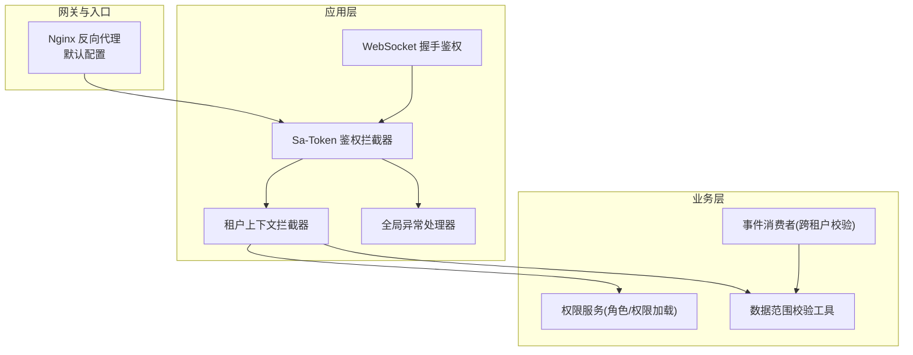
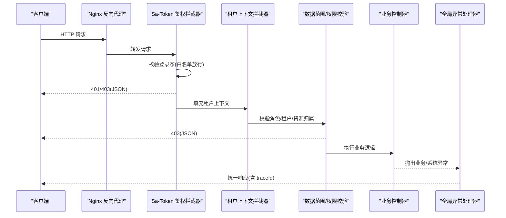
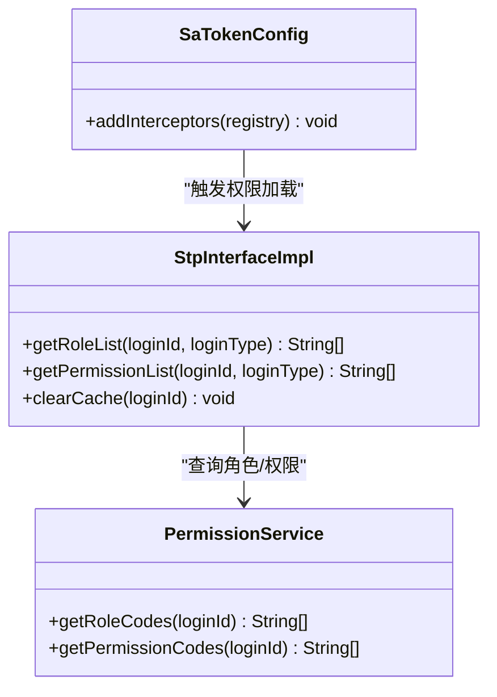
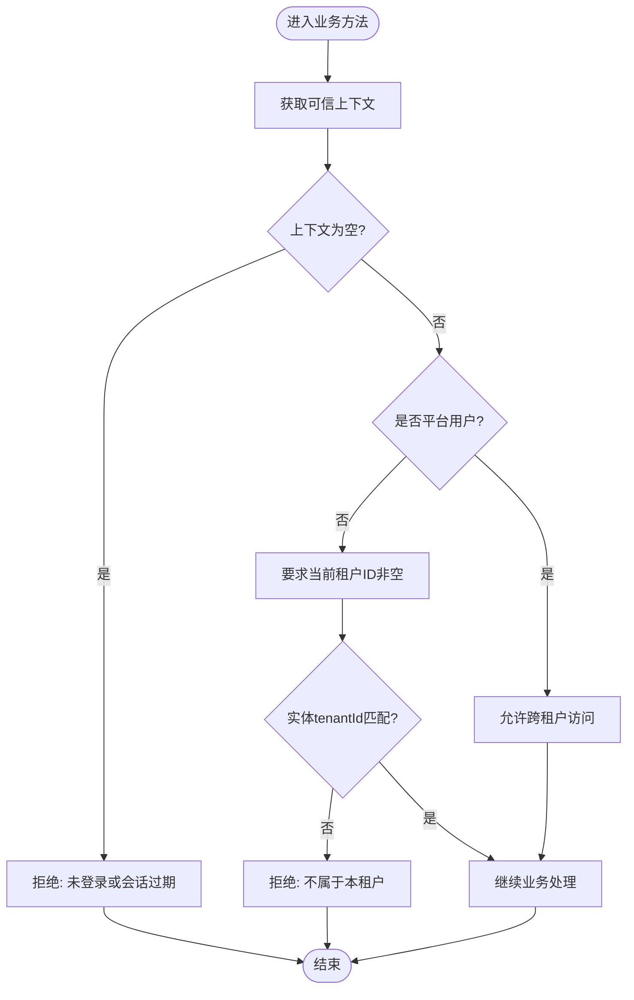
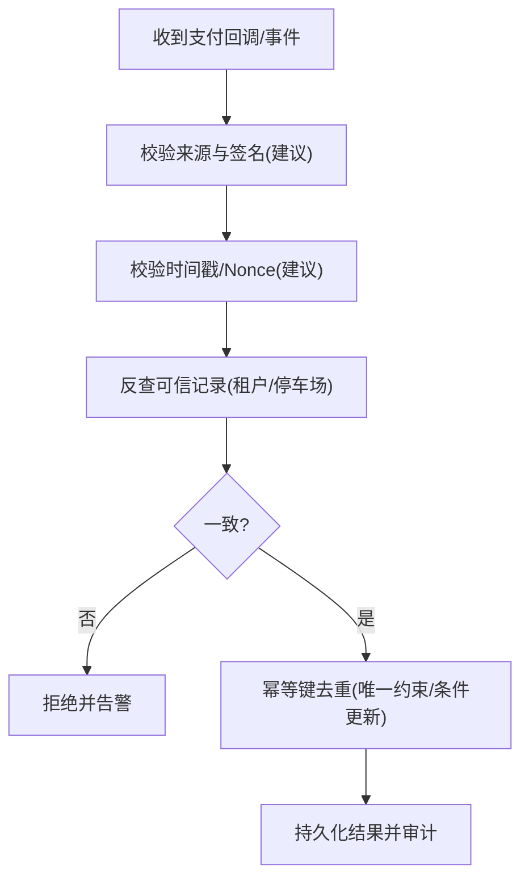
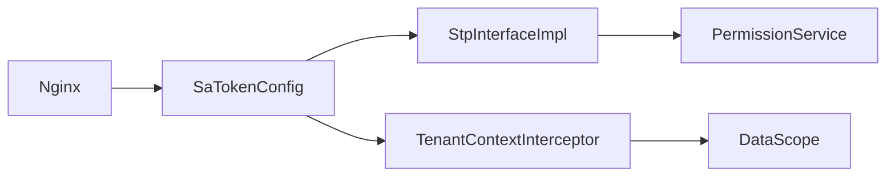

# 安全规范

<cite>
**本文引用的文件**
- [SaTokenConfig.java](file://parking-framework/src/main/java/com/jushan/framework/auth/SaTokenConfig.java)
- [TenantContext.java](file://parking-framework/src/main/java/com/jushan/framework/auth/TenantContext.java)
- [TenantContextInterceptor.java](file://parking-framework/src/main/java/com/jushan/framework/auth/TenantContextInterceptor.java)
- [DataScope.java](file://parking-framework/src/main/java/com/jushan/framework/auth/DataScope.java)
- [PermissionService.java](file://parking-system/src/main/java/com/jushan/system/service/PermissionService.java)
- [StpInterfaceImpl.java](file://parking-system/src/main/java/com/jushan/system/service/StpInterfaceImpl.java)
- [GlobalExceptionHandler.java](file://parking-framework/src/main/java/com/jushan/framework/web/GlobalExceptionHandler.java)
- [TraceIdFilter.java](file://parking-framework/src/main/java/com/jushan/framework/web/TraceIdFilter.java)
- [default.conf](file://docker/nginx/conf.d/default.conf)
- [ParkingFeeVO.java](file://parking-system/src/main/java/com/jushan/system/vo/ParkingFeeVO.java)
- [RecognitionEventConsumer.java](file://parking-system/src/main/java/com/jushan/system/event/RecognitionEventConsumer.java)
- [WsAuthHandshakeInterceptor.java](file://parking-framework/src/main/java/com/jushan/framework/ws/WsAuthHandshakeInterceptor.java)
- [README.md](file://README.md)
</cite>

## 目录
1. [引言](#引言)
2. [项目结构](#项目结构)
3. [核心组件](#核心组件)
4. [架构总览](#架构总览)
5. [详细组件分析](#详细组件分析)
6. [依赖分析](#依赖分析)
7. [性能考虑](#性能考虑)
8. [故障排查指南](#故障排查指南)
9. [结论](#结论)
10. [附录](#附录)

## 引言
本规范面向停车 SaaS 平台的安全编码与部署实践，覆盖认证授权、多租户数据安全、支付安全、设备接入安全、网络安全、日志审计与漏洞防护等关键领域。文档以代码实现为依据，给出可落地的策略、流程与检查清单，确保在现有工程骨架基础上持续演进安全能力。

## 项目结构
本项目采用多模块 Maven 工程，后端基于 Spring Boot 3 + MyBatis-Plus + Sa-Token，前端包含管理后台、岗亭端与小程序。安全相关能力集中在 parking-framework（框架层）与 parking-system（系统业务层），并通过 Nginx 反向代理暴露服务。

图表来源
- [SaTokenConfig.java:38-63](file://parking-framework/src/main/java/com/jushan/framework/auth/SaTokenConfig.java#L38-L63)
- [TenantContextInterceptor.java:64-199](file://parking-framework/src/main/java/com/jushan/framework/auth/TenantContextInterceptor.java#L64-L199)
- [GlobalExceptionHandler.java:44-240](file://parking-framework/src/main/java/com/jushan/framework/web/GlobalExceptionHandler.java#L44-L240)
- [PermissionService.java:24-105](file://parking-system/src/main/java/com/jushan/system/service/PermissionService.java#L24-L105)
- [DataScope.java:25-240](file://parking-framework/src/main/java/com/jushan/framework/auth/DataScope.java#L25-L240)
- [RecognitionEventConsumer.java:234-247](file://parking-system/src/main/java/com/jushan/system/event/RecognitionEventConsumer.java#L234-L247)
- [default.conf:59-87](file://docker/nginx/conf.d/default.conf#L59-L87)

章节来源
- [README.md:1-75](file://README.md#L1-L75)

## 核心组件
- 认证与授权
  - Sa-Token 全局鉴权拦截器：除白名单路径外，所有请求需登录；异常统一返回 JSON。
  - 权限加载接口：首次从数据库加载角色/权限并缓存至 Session，后续鉴权走缓存。
- 多租户与数据范围
  - 可信租户上下文：从已验证会话推导 tenantId/userId/userType/roles，线程级存储，严格 fail-close。
  - 数据范围工具：强制租户匹配、角色精确匹配、停车场归属校验。
- 异常与错误码
  - 全局异常处理器：参数校验、业务异常、未登录/无权限、未知异常统一收敛，不泄露堆栈。
- 网络与传输
  - Nginx 反向代理：透传真实 IP、协议头，WebSocket 长连接超时设置。
- 支付与安全边界
  - 金额字段使用“分”单位，避免浮点精度问题。
  - 事件消费中对消息中的租户/停车场进行二次可信校验。
- 设备接入安全
  - 当前阶段 Device Access 未实现 HMAC/防重放等能力，需在网关/防火墙侧限制访问源，禁止浏览器直连。

章节来源
- [SaTokenConfig.java:12-65](file://parking-framework/src/main/java/com/jushan/framework/auth/SaTokenConfig.java#L12-L65)
- [StpInterfaceImpl.java:29-107](file://parking-system/src/main/java/com/jushan/system/service/StpInterfaceImpl.java#L29-L107)
- [PermissionService.java:24-105](file://parking-system/src/main/java/com/jushan/system/service/PermissionService.java#L24-L105)
- [TenantContext.java:1-257](file://parking-framework/src/main/java/com/jushan/framework/auth/TenantContext.java#L1-L257)
- [DataScope.java:25-240](file://parking-framework/src/main/java/com/jushan/framework/auth/DataScope.java#L25-L240)
- [GlobalExceptionHandler.java:44-240](file://parking-framework/src/main/java/com/jushan/framework/web/GlobalExceptionHandler.java#L44-L240)
- [default.conf:59-87](file://docker/nginx/conf.d/default.conf#L59-L87)
- [ParkingFeeVO.java:114-131](file://parking-system/src/main/java/com/jushan/system/vo/ParkingFeeVO.java#L114-L131)
- [RecognitionEventConsumer.java:234-247](file://parking-system/src/main/java/com/jushan/system/event/RecognitionEventConsumer.java#L234-L247)

## 架构总览
下图展示一次受保护 API 的调用链路与安全控制点：Nginx → Sa-Token 鉴权 → 租户上下文装配 → 权限/数据范围校验 → 业务处理 → 统一异常处理。

图表来源
- [SaTokenConfig.java:38-63](file://parking-framework/src/main/java/com/jushan/framework/auth/SaTokenConfig.java#L38-L63)
- [TenantContextInterceptor.java:64-199](file://parking-framework/src/main/java/com/jushan/framework/auth/TenantContextInterceptor.java#L64-L199)
- [DataScope.java:45-177](file://parking-framework/src/main/java/com/jushan/framework/auth/DataScope.java#L45-L177)
- [GlobalExceptionHandler.java:138-231](file://parking-framework/src/main/java/com/jushan/framework/web/GlobalExceptionHandler.java#L138-L231)

## 详细组件分析

### 认证与授权（Sa-Token）
- 全局鉴权拦截器
  - 通过 Spring MVC Interceptor 注册，除健康检查、登录、注册、Demo/Mock 与静态资源外，全部要求登录。
  - 鉴权异常由全局异常处理器统一转换为 JSON，避免页面跳转。
- 权限加载与缓存
  - 首次加载用户角色/权限后写入 Sa-Token Session，后续鉴权直接读取，降低 DB 压力。
  - 提供清除缓存方法，便于动态角色变更场景。

图表来源
- [SaTokenConfig.java:38-63](file://parking-framework/src/main/java/com/jushan/framework/auth/SaTokenConfig.java#L38-L63)
- [StpInterfaceImpl.java:43-106](file://parking-system/src/main/java/com/jushan/system/service/StpInterfaceImpl.java#L43-L106)
- [PermissionService.java:44-103](file://parking-system/src/main/java/com/jushan/system/service/PermissionService.java#L44-L103)

章节来源
- [SaTokenConfig.java:12-65](file://parking-framework/src/main/java/com/jushan/framework/auth/SaTokenConfig.java#L12-L65)
- [StpInterfaceImpl.java:29-107](file://parking-system/src/main/java/com/jushan/system/service/StpInterfaceImpl.java#L29-L107)
- [PermissionService.java:24-105](file://parking-system/src/main/java/com/jushan/system/service/PermissionService.java#L24-L105)

### 多租户数据安全
- 可信上下文
  - 仅从已验证会话推导 tenantId/userId/userType/roles，严禁信任前端传入的 tenantId。
  - 支持代理模式：平台管理员以目标租户身份操作，但数据范围严格限定于目标租户。
- 数据范围校验
  - 强制租户匹配、平台用户显式确认、角色精确匹配（JSON 数组解析，防止子串误配）。
  - 停车场归属批量校验，任一不匹配即失败。

图表来源
- [TenantContext.java:27-257](file://parking-framework/src/main/java/com/jushan/framework/auth/TenantContext.java#L27-L257)
- [DataScope.java:45-177](file://parking-framework/src/main/java/com/jushan/framework/auth/DataScope.java#L45-L177)

章节来源
- [TenantContext.java:1-257](file://parking-framework/src/main/java/com/jushan/framework/auth/TenantContext.java#L1-L257)
- [DataScope.java:25-240](file://parking-framework/src/main/java/com/jushan/framework/auth/DataScope.java#L25-L240)

### 支付安全规范
- 金额计算精度
  - 使用“分”为最小单位（整型字段），避免浮点误差。
- 回调验签与敏感信息保护
  - 当前阶段未实现外部支付回调验签能力，建议在网关/服务端增加签名校验与时间戳/Nonce 防重放机制，并对日志中敏感信息进行脱敏。
- 事件幂等与一致性
  - 事件消费中对消息中的租户/停车场进行二次可信校验，防止越权与重复处理。

图表来源
- [ParkingFeeVO.java:114-131](file://parking-system/src/main/java/com/jushan/system/vo/ParkingFeeVO.java#L114-L131)
- [RecognitionEventConsumer.java:234-247](file://parking-system/src/main/java/com/jushan/system/event/RecognitionEventConsumer.java#L234-L247)

章节来源
- [ParkingFeeVO.java:114-131](file://parking-system/src/main/java/com/jushan/system/vo/ParkingFeeVO.java#L114-L131)
- [RecognitionEventConsumer.java:234-247](file://parking-system/src/main/java/com/jushan/system/event/RecognitionEventConsumer.java#L234-L247)

### 设备接入安全（Device Access）
- 当前状态
  - 契约 v0.2 未实现 HMAC、Token、mTLS、IP 白名单、Nonce、时间戳与防重放。
- 最低安全要求
  - 端口仅内网可达；通过安全组/防火墙限制调用源；禁止浏览器直连；所有调用由平台后端发起；对开闸接口设置权限与频率限制；保存人工开闸审计；环境隔离；生产前补充 HTTPS 或可信通道。
- 后续目标
  - 引入 HTTPS、HMAC-SHA256、X-Client-Id/X-Timestamp/X-Nonce/X-Signature、防重放、双密钥轮换、MQTT TLS 与最小权限。

章节来源
- [README.md:41-75](file://README.md#L41-L75)

### 网络安全措施
- HTTPS 与证书
  - 生产环境应在网关或负载均衡处启用 HTTPS，并在后续阶段对 Device Access 也启用加密通道。
- CORS 与请求头
  - 通过 Nginx 设置必要的代理头（Host、X-Real-IP、X-Forwarded-For、X-Forwarded-Proto），WebSocket 需 Upgrade 头与长连接超时。
- 请求头安全
  - TraceId 入站校验与复用，非法值将被拒绝并重新生成，避免注入风险。

章节来源
- [default.conf:59-87](file://docker/nginx/conf.d/default.conf#L59-L87)
- [TraceIdFilter.java](file://parking-framework/src/main/java/com/jushan/framework/web/TraceIdFilter.java)

### 日志安全规范
- 敏感信息脱敏
  - 全局异常处理器仅记录必要信息，禁止将堆栈或内部错误详情返回前端。
- 审计日志记录
  - 关键操作（如开闸、代操作）应记录审计信息，包含 traceId、操作人、目标租户/资源、耗时与结果分类。
- 安全事件追踪
  - 通过 MDC 注入 traceId，贯穿请求链路，便于定位与审计。

章节来源
- [GlobalExceptionHandler.java:138-231](file://parking-framework/src/main/java/com/jushan/framework/web/GlobalExceptionHandler.java#L138-L231)
- [TraceIdFilter.java](file://parking-framework/src/main/java/com/jushan/framework/web/TraceIdFilter.java)

### WebSocket 鉴权
- 握手阶段从 URL 查询参数或 Authorization 头提取 token，结合 Sa-Token 完成鉴权。
- 建议在生产环境中禁用 URL 参数传递 token，优先使用请求头。

章节来源
- [WsAuthHandshakeInterceptor.java:116-139](file://parking-framework/src/main/java/com/jushan/framework/ws/WsAuthHandshakeInterceptor.java#L116-L139)

## 依赖分析
- 组件耦合
  - Sa-Token 鉴权拦截器与租户上下文拦截器顺序执行，前者先于后者。
  - 权限加载接口依赖权限服务，权限服务依赖用户与角色映射表。
  - 数据范围工具强依赖可信上下文，任何越权尝试均 fail-close。
- 外部依赖
  - Redis 用于会话存储（Sa-Token 自动装配），不可用时回退内存存储。
  - Nginx 作为反向代理，透传必要头部并处理 WebSocket。

图表来源
- [SaTokenConfig.java:38-63](file://parking-framework/src/main/java/com/jushan/framework/auth/SaTokenConfig.java#L38-L63)
- [StpInterfaceImpl.java:43-106](file://parking-system/src/main/java/com/jushan/system/service/StpInterfaceImpl.java#L43-L106)
- [PermissionService.java:44-103](file://parking-system/src/main/java/com/jushan/system/service/PermissionService.java#L44-L103)
- [TenantContextInterceptor.java:64-199](file://parking-framework/src/main/java/com/jushan/framework/auth/TenantContextInterceptor.java#L64-L199)
- [DataScope.java:45-177](file://parking-framework/src/main/java/com/jushan/framework/auth/DataScope.java#L45-L177)
- [default.conf:59-87](file://docker/nginx/conf.d/default.conf#L59-L87)

章节来源
- [SaTokenConfig.java:12-65](file://parking-framework/src/main/java/com/jushan/framework/auth/SaTokenConfig.java#L12-L65)
- [StpInterfaceImpl.java:29-107](file://parking-system/src/main/java/com/jushan/system/service/StpInterfaceImpl.java#L29-L107)
- [PermissionService.java:24-105](file://parking-system/src/main/java/com/jushan/system/service/PermissionService.java#L24-L105)
- [TenantContextInterceptor.java:1-239](file://parking-framework/src/main/java/com/jushan/framework/auth/TenantContextInterceptor.java#L1-L239)
- [DataScope.java:25-240](file://parking-framework/src/main/java/com/jushan/framework/auth/DataScope.java#L25-L240)
- [default.conf:59-87](file://docker/nginx/conf.d/default.conf#L59-L87)

## 性能考虑
- 权限缓存：首次加载后存入 Sa-Token Session，减少频繁 DB 查询。
- 会话存储：生产环境确保 Redis 可用，避免会话丢失与回退内存带来的不稳定。
- 异常处理：统一异常处理器避免堆栈输出，减少序列化开销与安全风险。

[本节为通用指导，无需源码引用]

## 故障排查指南
- 未登录/无权限
  - 检查 Sa-Token 拦截器白名单与 Token 头配置；查看全局异常处理器返回的 code 与 message。
- 租户上下文异常
  - 确认会话中 userType/tenantId/roles 存在且合法；代理模式下目标租户必须有效。
- 权限不足
  - 检查角色/权限是否正确加载到 Session；必要时调用清除缓存方法后重新登录。
- 支付/事件不一致
  - 核对事件消费中的租户/停车场二次校验逻辑与幂等键设计。
- 网络与代理
  - 检查 Nginx 代理头与 WebSocket 超时配置；确认 HTTPS 与证书生效。

章节来源
- [GlobalExceptionHandler.java:138-231](file://parking-framework/src/main/java/com/jushan/framework/web/GlobalExceptionHandler.java#L138-L231)
- [TenantContextInterceptor.java:64-199](file://parking-framework/src/main/java/com/jushan/framework/auth/TenantContextInterceptor.java#L64-L199)
- [StpInterfaceImpl.java:93-106](file://parking-system/src/main/java/com/jushan/system/service/StpInterfaceImpl.java#L93-L106)
- [RecognitionEventConsumer.java:234-247](file://parking-system/src/main/java/com/jushan/system/event/RecognitionEventConsumer.java#L234-L247)
- [default.conf:59-87](file://docker/nginx/conf.d/default.conf#L59-L87)

## 结论
本规范围绕认证授权、多租户数据隔离、支付安全、设备接入、网络安全与日志审计等方面，给出了基于现有代码实现的落地策略与检查要点。建议按优先级逐步补齐 HMAC/防重放、HTTPS、签名校验与更完善的审计追踪，持续提升整体安全水位。

[本节为总结性内容，无需源码引用]

## 附录
- 术语
  - 平台用户：无租户绑定，可跨租户访问。
  - 租户用户：有租户绑定，仅限本租户数据。
  - 代理模式：平台管理员以目标租户身份操作，数据范围严格受限。
- 最佳实践
  - 始终从可信上下文获取租户与用户信息。
  - 使用 DataScope 进行数据范围与角色校验。
  - 金额一律使用“分”单位，避免浮点误差。
  - 对外部回调与设备接口实施签名、时间戳与防重放校验。
  - 生产环境启用 HTTPS，限制公网暴露面。

[本节为概念性内容，无需源码引用]