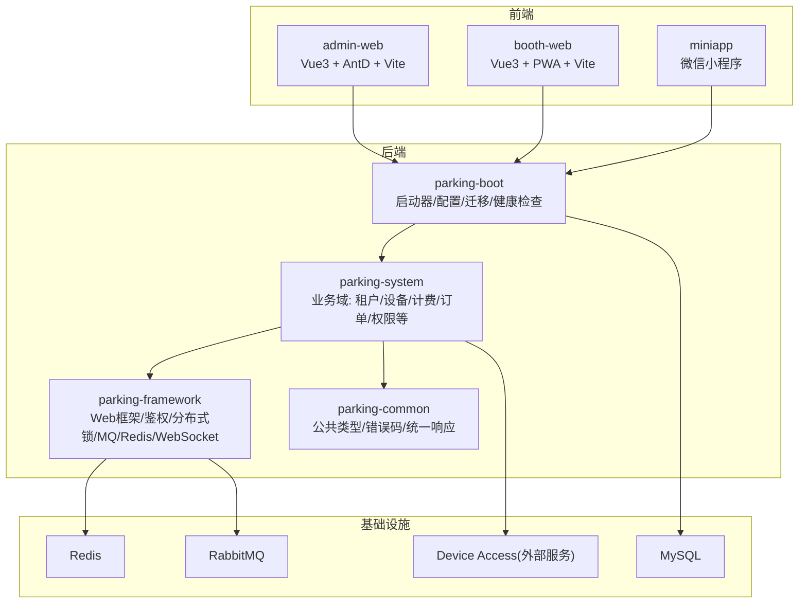
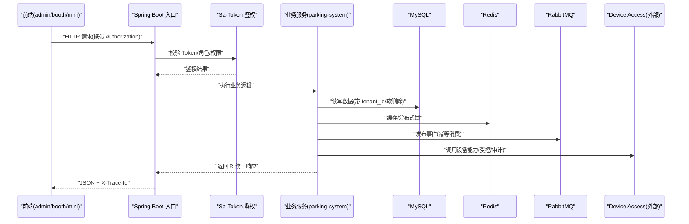
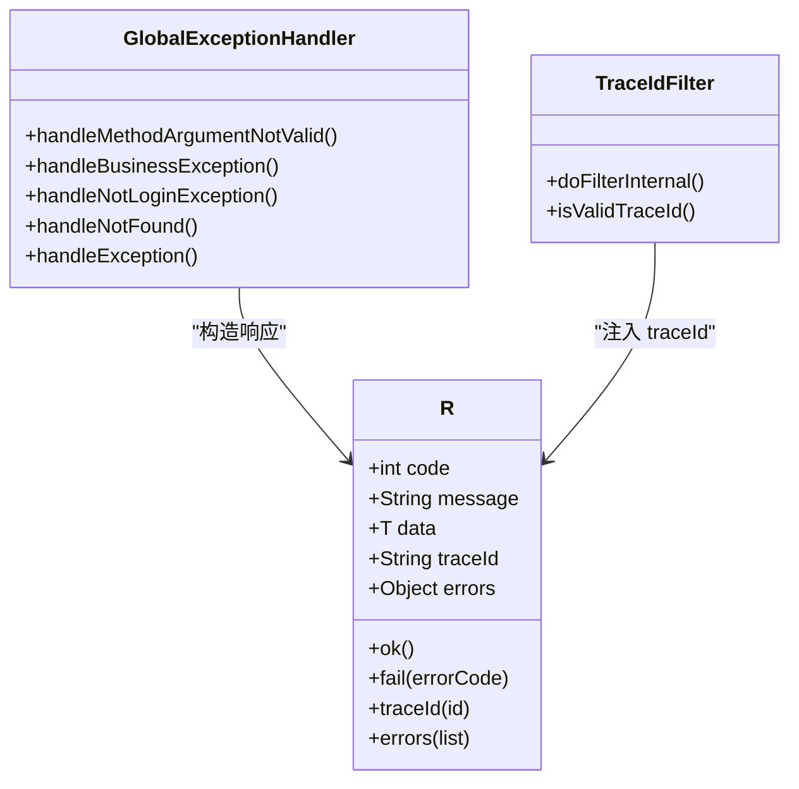
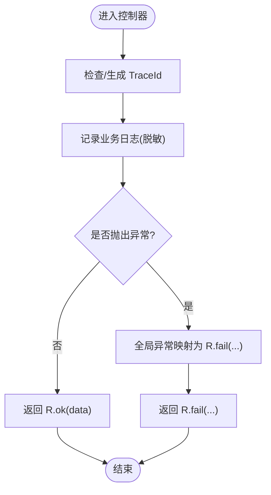
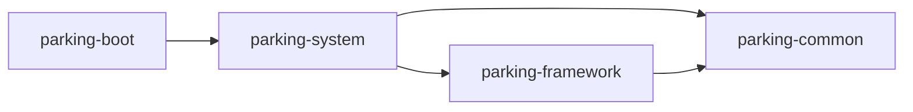

# 开发规范

<cite>
**本文引用的文件**
- [README.md](file://README.md)
- [AGENTS.md](file://AGENTS.md)
- [CLAUDE.md](file://CLAUDE.md)
- [pom.xml](file://pom.xml)
- [parking-common/pom.xml](file://parking-common/pom.xml)
- [R.java](file://parking-common/src/main/java/com/jushan/common/R.java)
- [GlobalExceptionHandler.java](file://parking-framework/src/main/java/com/jushan/framework/web/GlobalExceptionHandler.java)
- [TraceIdFilter.java](file://parking-framework/src/main/java/com/jushan/framework/web/TraceIdFilter.java)
- [LogDesensitize.java](file://parking-framework/src/main/java/com/jushan/framework/web/LogDesensitize.java)
- [admin-web/vite.config.ts](file://admin-web/vite.config.ts)
- [booth-web/vite.config.ts](file://booth-web/vite.config.ts)
- [section_03_ddl.md](file://docs/开发计划/section_03_ddl.md)
- [05-目标契约-v1.0-草案.md](file://docs/contracts/platform-device-access/05-目标契约-v1.0-草案.md)
- [self-review-before-finish/SKILL.md](file://.claude/skills/self-review-before-finish/SKILL.md)
</cite>

## 目录
1. [引言](#引言)
2. [项目结构](#项目结构)
3. [核心组件](#核心组件)
4. [架构总览](#架构总览)
5. [详细组件分析](#详细组件分析)
6. [依赖分析](#依赖分析)
7. [性能考虑](#性能考虑)
8. [故障排查指南](#故障排查指南)
9. [结论](#结论)
10. [附录](#附录)

## 引言
本规范面向智慧停车 SaaS 平台（jushan-platform）的全体研发与协作人员，覆盖 Java 编码规范、前端代码规范、Git 提交与分支管理、异常处理与日志标准、统一响应格式、安全编码、性能优化、团队协作与文档编写等。规范以仓库内既有实现与约定为依据，确保团队在模块化单体架构下保持一致的工程实践与交付质量。

## 项目结构
仓库采用 Maven 多模块聚合工程，后端包含 parking-common、parking-framework、parking-system、parking-boot；前端包含 admin-web、booth-web 两个独立 Vite 工程；另有 miniapp 微信小程序端与 docker 部署配置。

图表来源
- [pom.xml:46-52](file://pom.xml#L46-L52)
- [README.md:1-20](file://README.md#L1-L20)

章节来源
- [pom.xml:46-52](file://pom.xml#L46-L52)
- [README.md:1-20](file://README.md#L1-L20)

## 核心组件
- 统一响应体 R：所有接口返回统一结构，包含 code、message、data、traceId、errors，便于前后端一致解析与问题定位。
- 全局异常处理器：将参数校验、业务异常、认证授权异常、Spring 内置异常统一映射为 R，并控制 HTTP 状态码。
- TraceId 过滤器：为每个请求生成或复用 traceId，写入 MDC 与响应头 X-Trace-Id，贯穿日志链路。
- 日志脱敏工具：提供手机号、身份证、Token、密码等敏感信息掩码方法，避免明文泄露。
- 数据库 DDL 规范：强制多租户字段、软删除、金额精度、时间字段、索引与约束等基线要求。
- 共享契约：Platform 与 Device Access 的目标契约与当前事实，明确能力边界与演进方向。

章节来源
- [R.java:1-162](file://parking-common/src/main/java/com/jushan/common/R.java#L1-L162)
- [GlobalExceptionHandler.java:1-240](file://parking-framework/src/main/java/com/jushan/framework/web/GlobalExceptionHandler.java#L1-L240)
- [TraceIdFilter.java:1-76](file://parking-framework/src/main/java/com/jushan/framework/web/TraceIdFilter.java#L1-L76)
- [LogDesensitize.java:1-106](file://parking-framework/src/main/java/com/jushan/framework/web/LogDesensitize.java#L1-L106)
- [section_03_ddl.md:1-16](file://docs/开发计划/section_03_ddl.md#L1-L16)
- [05-目标契约-v1.0-草案.md:21-41](file://docs/contracts/platform-device-access/05-目标契约-v1.0-草案.md#L21-L41)

## 架构总览
系统采用“模块化单体 + 三端一体”的架构：后端 Spring Boot 3 + MyBatis-Plus + Sa-Token + Redis + RabbitMQ；PC 运营平台 Vue3 + Element/AntD；岗亭端 Vue3 + PWA；车主小程序原生。通过共享契约与 Device Access 解耦，平台侧仅维护设备台账、可信 SN 映射、调用审计与业务编排。

图表来源
- [GlobalExceptionHandler.java:1-240](file://parking-framework/src/main/java/com/jushan/framework/web/GlobalExceptionHandler.java#L1-L240)
- [TraceIdFilter.java:1-76](file://parking-framework/src/main/java/com/jushan/framework/web/TraceIdFilter.java#L1-L76)
- [AGENTS.md:33-51](file://AGENTS.md#L33-L51)

## 详细组件分析

### 统一响应与异常处理
- 统一响应 R：code=0 表示成功，message 描述，data 承载数据，traceId 用于追踪，errors 仅在参数校验失败时返回。
- 全局异常处理：
  - 参数校验失败：返回 BAD_REQUEST + PARAM_ERROR + errors 列表。
  - 业务异常：按协议级错误码映射 HTTP 状态（400/401/403/404/409/429），其余保持 200。
  - 认证授权异常：未登录→401，无权限/角色→403。
  - 资源与方法异常：404/405 对应 NOT_FOUND/METHOD_NOT_ALLOWED。
  - 未知异常：INTERNAL_ERROR，内部记录堆栈，不泄露给前端。
- TraceId 注入：入站优先使用上游 X-Trace-Id（合法则复用），否则生成新 ID；写入 MDC 与响应头，请求结束清理。

图表来源
- [R.java:1-162](file://parking-common/src/main/java/com/jushan/common/R.java#L1-L162)
- [GlobalExceptionHandler.java:1-240](file://parking-framework/src/main/java/com/jushan/framework/web/GlobalExceptionHandler.java#L1-L240)
- [TraceIdFilter.java:1-76](file://parking-framework/src/main/java/com/jushan/framework/web/TraceIdFilter.java#L1-L76)

章节来源
- [R.java:1-162](file://parking-common/src/main/java/com/jushan/common/R.java#L1-L162)
- [GlobalExceptionHandler.java:1-240](file://parking-framework/src/main/java/com/jushan/framework/web/GlobalExceptionHandler.java#L1-L240)
- [TraceIdFilter.java:1-76](file://parking-framework/src/main/java/com/jushan/framework/web/TraceIdFilter.java#L1-L76)

### 日志与脱敏规范
- 全链路追踪：X-Trace-Id 贯穿请求与日志，便于跨服务/组件关联。
- 脱敏策略：手机号保留前 3 后 4；身份证保留前 3 后 4；Token 保留首尾各 3；密码/密钥直接替换为固定占位。
- 禁止行为：日志不得输出 Token、密钥、密码、身份证号、手机号明文；异常堆栈不得暴露给前端。

图表来源
- [TraceIdFilter.java:1-76](file://parking-framework/src/main/java/com/jushan/framework/web/TraceIdFilter.java#L1-L76)
- [LogDesensitize.java:1-106](file://parking-framework/src/main/java/com/jushan/framework/web/LogDesensitize.java#L1-L106)
- [GlobalExceptionHandler.java:1-240](file://parking-framework/src/main/java/com/jushan/framework/web/GlobalExceptionHandler.java#L1-L240)

章节来源
- [LogDesensitize.java:1-106](file://parking-framework/src/main/java/com/jushan/framework/web/LogDesensitize.java#L1-L106)
- [GlobalExceptionHandler.java:1-240](file://parking-framework/src/main/java/com/jushan/framework/web/GlobalExceptionHandler.java#L1-L240)

### 数据库与迁移规范
- 多租户：所有业务表必须包含 tenant_id BIGINT NOT NULL，查询必须带过滤。
- 软删除：deleted_at DATETIME(3)，禁止物理删除。
- 金额：DECIMAL(18,2)/DECIMAL(18,4)，禁止浮点。
- 车牌：统一大写存储与匹配。
- 时间：DATETIME(3)，创建/更新时间默认值与自动更新。
- 并发：关键资源扣减使用 Redis 分布式锁 + 数据库乐观锁 version。
- 主键：雪花算法或号段，禁止自增 ID。
- Flyway：每次变更独立版本脚本，已发布迁移禁止修改，需具备回滚方案。

章节来源
- [section_03_ddl.md:1-16](file://docs/开发计划/section_03_ddl.md#L1-L16)
- [AGENTS.md:177-186](file://AGENTS.md#L177-L186)

### 共享契约与设备接入边界
- 目标契约：Base URL、版本路径、Content-Type、时间格式、分页、兼容性、废弃策略、服务间认证推荐 HMAC-SHA256。
- 平台边界：平台侧只维护设备台账、可信 SN 映射、调用审计与业务决策；禁止直连厂商设备或解析厂商协议。
- 当前事实：v0.2 仅提供 7 个 HTTP 端点，开闸等能力尚未冻结，平台侧不得假设未实现能力。

章节来源
- [05-目标契约-v1.0-草案.md:21-41](file://docs/contracts/platform-device-access/05-目标契约-v1.0-草案.md#L21-L41)
- [AGENTS.md:17-51](file://AGENTS.md#L17-L51)

### 前端工程规范（admin-web / booth-web）
- 构建与插件：Vite + Vue3，按需引入与自动导入，Ant Design Vue 组件解析。
- 代理与端口：本地开发通过 Vite server.proxy 转发 /api 到后端 8080，WS 单独代理。
- CSS 预处理：Sass @use 替代弃用的 @import，统一变量注入。
- 打包优化：manualChunks 拆分 vendor 包，减少主包体积。
- 别名：@ 指向 src，提升可读性与可维护性。

章节来源
- [admin-web/vite.config.ts:1-59](file://admin-web/vite.config.ts#L1-L59)
- [booth-web/vite.config.ts:1-46](file://booth-web/vite.config.ts#L1-L46)

### Git 提交与分支管理
- 分支模型：develop 为主干，feature/* 功能分支，hotfix/* 紧急修复，release/* 预发发布。
- 提交规范：建议遵循 Conventional Commits（feat/fix/docs/chore/test/build/ci/refactor/perf/security），保证可追溯与自动化生成变更日志。
- 合并策略：feature → develop 通过 PR/MR 评审；hotfix → develop 快速合并；release → master 打标签。
- 保护规则：主干分支开启保护，至少 1 人审查通过方可合并；CI 必须通过。
- 标签与版本：语义化版本（MAJOR.MINOR.PATCH），tag 命名 v{version}。

章节来源
- [CLAUDE.md:394-408](file://CLAUDE.md#L394-L408)

### 版本发布规范
- 发布流程：release/* 分支准备 → 联调与回归测试 → 打 tag → 构建制品 → 灰度/蓝绿发布 → 监控与回滚预案。
- 制品管理：Maven 构建产物与前端静态资源分别归档，镜像仓库与对象存储分离。
- 回滚策略：数据库迁移不可逆需评估与备份；应用层支持快速回滚至上一稳定版本。
- 发布清单：变更说明、影响范围、验证报告、风险与待办项。

章节来源
- [AGENTS.md:187-196](file://AGENTS.md#L187-L196)

### 安全编码指南
- 鉴权与隔离：禁止 fail-open；严格基于 Sa-Token 的角色/权限与租户上下文；禁止信任前端传入的 tenantId/parkingLotId/device_sn。
- 输入校验：Controller 层使用 Bean Validation，全局异常处理兜底；非法输入拒绝并记录。
- 敏感信息：日志脱敏；禁止明文保存 Token、密钥、密码、证书私钥、支付密钥与个人信息。
- 设备接入：仅允许 parking-device 模块调用 Device Access；禁止浏览器/小程序直连；命令重试与 UNCERTAIN 处置需审计与人工兜底。
- 支付安全：回调验签与幂等；金额使用 BigDecimal；零元订单有明确流转；支付成功与开闸解耦。

章节来源
- [CLAUDE.md:75-94](file://CLAUDE.md#L75-L94)
- [AGENTS.md:131-176](file://AGENTS.md#L131-L176)

### 性能优化建议
- 缓存分层：L1 Caffeine（热点配置/字典，短过期）、L2 Redis（业务对象/会话/锁/计数，中短期过期）、L3 MySQL（持久化）。
- 连接池：Lettuce + Commons Pool2 合理配置最大连接与空闲回收。
- 消息队列：RabbitMQ 异步处理设备事件、支付回调、审计日志等，消费者幂等。
- 索引与查询：按 tenant_id、业务唯一键建立必要索引；避免 N+1 查询与全表扫描。
- 前端分包与懒加载：manualChunks、路由级懒加载、图片与静态资源 CDN。

章节来源
- [AGENTS.md:258-268](file://AGENTS.md#L258-L268)
- [pom.xml:133-139](file://pom.xml#L133-L139)

### 最佳实践总结
- 小步实施：先补测试，再改代码，再验证；每步可解释、可验证、可回退。
- 接口稳定：不破坏已有契约；新增字段兼容，破坏性变更新建版本。
- 幂等设计：写接口携带幂等键；重复请求返回首次结果。
- 审计留痕：关键操作记录操作人、IP、时间、变更前后 JSON、结果与耗时。
- 文档同步：架构、契约、API、DDL 变化同步更新相关文档。

章节来源
- [CLAUDE.md:64-74](file://CLAUDE.md#L64-L74)
- [AGENTS.md:231-247](file://AGENTS.md#L231-L247)

### IDE 配置与工具链
- Java：JDK 21，启用 Lombok + MapStruct 注解处理器；编译选项 UTF-8。
- Maven：集中版本管理，统一依赖与插件配置；Surefire 传递 Testcontainers 环境变量。
- 前端：pnpm 工作区，Vite 开发服务器与代理，ESLint/Prettier 统一风格。
- 数据库：Flyway 管理迁移；IDE 集成 SQL 格式化与执行。
- 容器：Testcontainers 驱动 MySQL/Redis/RabbitMQ 集成测试。

章节来源
- [pom.xml:24-44](file://pom.xml#L24-L44)
- [pom.xml:159-214](file://pom.xml#L159-L214)
- [parking-common/pom.xml:1-25](file://parking-common/pom.xml#L1-L25)

### 团队协作规范与知识分享
- 任务书与验收：复杂任务启动前输出目标、范围、步骤、验证方式与风险；完成后输出完成报告模板。
- 技能自检：日常风险审查与完成前自检通过 SKILL 执行，不修改代码，仅产出报告。
- 文档优先级：当前实现 > 冻结规范 > 目标契约 > 历史文档；冲突时暂停并上报。
- 知识库：需求规格、技术架构、API 设计、开发计划、部署运维集中存放 docs 目录，定期归档与基线化。

章节来源
- [self-review-before-finish/SKILL.md:80-134](file://.claude/skills/self-review-before-finish/SKILL.md#L80-L134)
- [CLAUDE.md:25-37](file://CLAUDE.md#L25-L37)
- [AGENTS.md:197-211](file://AGENTS.md#L197-L211)

## 依赖分析
后端模块依赖关系清晰：boot 依赖 system，system 依赖 framework 与 common；framework 提供 Web、鉴权、锁、MQ、Redis、WebSocket 等横切能力；common 提供基础类型与统一响应。

图表来源
- [pom.xml:46-52](file://pom.xml#L46-L52)

章节来源
- [pom.xml:46-52](file://pom.xml#L46-L52)

## 性能考虑
- 服务端：合理设置线程池与连接池大小；热点数据 L1/L2 缓存；批量操作与分页查询；异步消息削峰填谷。
- 数据库：索引设计与慢查询治理；事务边界最小化；读写分离与分库分表预留。
- 前端：资源压缩与懒加载；CDN 加速；离线缓存与弱网降级。
- 监控：指标采集（Micrometer）、日志采集（JSON stdout）、链路追踪（X-Trace-Id）。

[本节为通用指导，无需源码引用]

## 故障排查指南
- 统一响应与错误码：根据 R.code 与 HTTP 状态码快速定位问题类别。
- 链路追踪：通过 X-Trace-Id 在日志中检索完整请求轨迹。
- 参数校验：errors 数组提供字段级错误详情，便于前端提示与修复。
- 认证授权：未登录/无权限/无角色异常分别映射 401/403，结合 Sa-Token 会话与权限数据核查。
- 设备接入：UNCERTAIN 状态需结合审计记录与设备状态查询进行人工处置，禁止自动重试。

章节来源
- [GlobalExceptionHandler.java:1-240](file://parking-framework/src/main/java/com/jushan/framework/web/GlobalExceptionHandler.java#L1-L240)
- [TraceIdFilter.java:1-76](file://parking-framework/src/main/java/com/jushan/framework/web/TraceIdFilter.java#L1-L76)
- [AGENTS.md:164-176](file://AGENTS.md#L164-L176)

## 结论
本规范以仓库现有实现与约定为基础，明确了后端与前端工程实践、异常与日志标准、数据库与迁移规范、安全与性能要点、团队协作与文档机制。建议在后续迭代中持续完善与对齐，确保平台高质量交付与可维护性。

[本节为总结，无需源码引用]

## 附录
- 术语表：Tenant、Parking Lot、Lane、Device、Order、Payment、Audit、TraceId、Idempotency Key。
- 参考链接：共享契约目录、开发计划文档、部署与配置说明。

[本节为补充，无需源码引用]