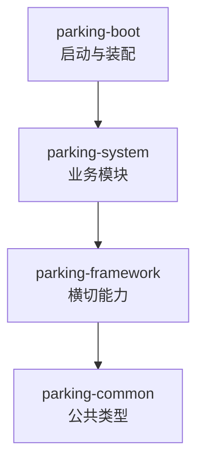
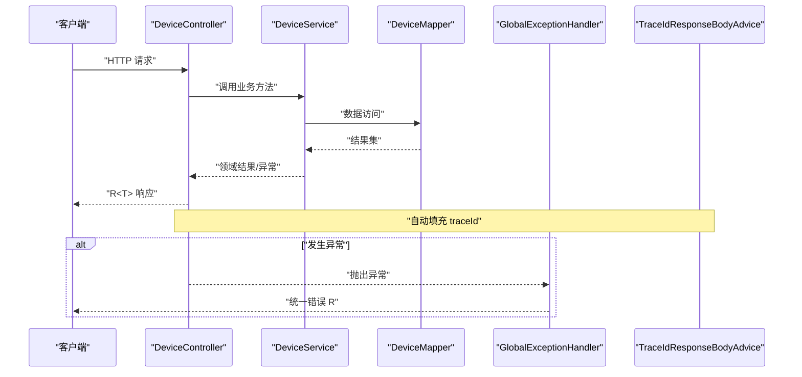
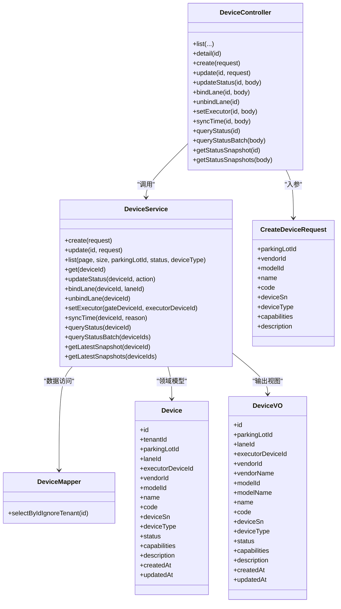

# 分层架构规范

<cite>
**本文引用的文件**   
- [README.md](file://README.md)
- [技术架构.md](file://docs/项目概述/技术架构.md)
- [T02-架构模块与前端工程方案冻结.md](file://docs/归档/平台侧/T02-架构模块与前端工程方案冻结.md)
- [DeviceController.java](file://parking-system/src/main/java/com/jushan/system/controller/DeviceController.java)
- [DeviceService.java](file://parking-system/src/main/java/com/jushan/system/service/DeviceService.java)
- [DeviceMapper.java](file://parking-system/src/main/java/com/jushan/system/mapper/DeviceMapper.java)
- [Device.java](file://parking-system/src/main/java/com/jushan/system/entity/Device.java)
- [CreateDeviceRequest.java](file://parking-system/src/main/java/com/jushan/system/dto/CreateDeviceRequest.java)
- [DeviceVO.java](file://parking-system/src/main/java/com/jushan/system/vo/DeviceVO.java)
- [R.java](file://parking-common/src/main/java/com/jushan/common/R.java)
- [GlobalExceptionHandler.java](file://parking-framework/src/main/java/com/jushan/framework/web/GlobalExceptionHandler.java)
- [TraceIdResponseBodyAdvice.java](file://parking-framework/src/main/java/com/jushan/framework/web/TraceIdResponseBodyAdvice.java)
- [TenantContextAdvice.java](file://parking-framework/src/main/java/com/jushan/framework/auth/TenantContextAdvice.java)
- [DataScope.java](file://parking-framework/src/main/java/com/jushan/framework/auth/DataScope.java)
- [AuditService.java](file://parking-system/src/main/java/com/jushan/system/service/AuditService.java)
- [TenantIgnoreAspect.java](file://parking-system/src/main/java/com/jushan/system/mybatis/TenantIgnoreAspect.java)
- [DistributedLock.java](file://parking-framework/src/main/java/com/jushan/framework/lock/DistributedLock.java)
- [RedisDistributedLock.java](file://parking-framework/src/main/java/com/jushan/framework/lock/RedisDistributedLock.java)
</cite>

## 目录
1. [引言](#引言)
2. [项目结构](#项目结构)
3. [核心组件](#核心组件)
4. [架构总览](#架构总览)
5. [详细组件分析](#详细组件分析)
6. [依赖关系分析](#依赖关系分析)
7. [性能考虑](#性能考虑)
8. [故障排查指南](#故障排查指南)
9. [结论](#结论)
10. [附录](#附录)

## 引言
本规范面向停车 SaaS 平台的后端分层架构，明确 Controller-Service-Mapper-Entity 各层职责、交互边界与实现约定；覆盖请求处理流程、参数校验、异常处理、事务管理、DTO/VO 转换、AOP 切面应用、日志记录与性能监控落点；并提供分层解耦最佳实践，避免循环依赖，保持清晰的调用边界。

## 项目结构
仓库采用多模块 Maven 工程，按“启动装配 → 业务模块 → 横切能力 → 公共类型”的依赖方向组织：
- parking-boot：应用启动与装配入口
- parking-system：业务领域（控制器、服务、实体、映射器、客户端等）
- parking-framework：横切能力（租户上下文、权限、全局异常、分布式锁、Web 增强等）
- parking-common：统一响应体、错误码、通用工具

图表来源
- [技术架构.md:54-78](file://docs/项目概述/技术架构.md#L54-L78)

章节来源
- [README.md:1-75](file://README.md#L1-L75)
- [技术架构.md:54-78](file://docs/项目概述/技术架构.md#L54-L78)

## 核心组件
- 控制器层（Controller）
  - 职责：接收 HTTP 请求、参数绑定与基础校验、权限注解、调用 Service、封装统一响应 R。
  - 示例：设备台账管理接口集中在 DeviceController。
- 服务层（Service）
  - 职责：编排业务流程、数据一致性（@Transactional）、跨系统调用（如 DeviceAccessClient）、审计与快照持久化、领域规则校验。
  - 示例：DeviceService 负责设备全生命周期、车道绑定、状态查询与快照、校时命令审计等。
- 映射层（Mapper）
  - 职责：数据访问抽象，基于 MyBatis-Plus BaseMapper 扩展自定义 SQL。
  - 示例：DeviceMapper 提供忽略租户拦截器的按 ID 查询方法。
- 实体层（Entity）
  - 职责：数据库表映射对象，承载字段与约束说明。
  - 示例：Device 为平台设备主数据源，包含安全约束注释。
- DTO/VO
  - DTO：入参对象，承载校验注解（如 CreateDeviceRequest）。
  - VO：出参视图对象，聚合展示信息（如 DeviceVO）。
- 统一响应体（R）
  - 所有接口返回 R<T>，包含 code/message/data/traceId/errors。

章节来源
- [DeviceController.java:1-315](file://parking-system/src/main/java/com/jushan/system/controller/DeviceController.java#L1-L315)
- [DeviceService.java:1-800](file://parking-system/src/main/java/com/jushan/system/service/DeviceService.java#L1-L800)
- [DeviceMapper.java:1-28](file://parking-system/src/main/java/com/jushan/system/mapper/DeviceMapper.java#L1-L28)
- [Device.java:1-134](file://parking-system/src/main/java/com/jushan/system/entity/Device.java#L1-L134)
- [CreateDeviceRequest.java:1-83](file://parking-system/src/main/java/com/jushan/system/dto/CreateDeviceRequest.java#L1-L83)
- [DeviceVO.java:1-86](file://parking-system/src/main/java/com/jushan/system/vo/DeviceVO.java#L1-L86)
- [R.java:1-162](file://parking-common/src/main/java/com/jushan/common/R.java#L1-L162)

## 架构总览
分层调用链路与横切关注点如下：
- 请求进入 Controller，进行权限校验与参数绑定后委托给 Service。
- Service 执行领域逻辑，必要时调用 Mapper 读写数据，或调用外部 Client（如 DeviceAccessClient），并写入审计/快照。
- 全局异常处理器将各类异常转换为统一 R 响应；ResponseBodyAdvice 自动注入 traceId。
- 租户上下文在 Interceptor/Advice 中装配，DataScope 做数据范围校验。

图表来源
- [DeviceController.java:1-315](file://parking-system/src/main/java/com/jushan/system/controller/DeviceController.java#L1-L315)
- [DeviceService.java:1-800](file://parking-system/src/main/java/com/jushan/system/service/DeviceService.java#L1-L800)
- [DeviceMapper.java:1-28](file://parking-system/src/main/java/com/jushan/system/mapper/DeviceMapper.java#L1-L28)
- [GlobalExceptionHandler.java:24-239](file://parking-framework/src/main/java/com/jushan/framework/web/GlobalExceptionHandler.java#L24-L239)
- [TraceIdResponseBodyAdvice.java:32-50](file://parking-framework/src/main/java/com/jushan/framework/web/TraceIdResponseBodyAdvice.java#L32-L50)

## 详细组件分析

### 控制器层（Controller）
- 职责边界
  - 仅做参数绑定、基础校验、权限控制、调用 Service、包装 R 响应。
  - 不直接操作 Mapper/Entity，不编写复杂业务逻辑。
- 典型模式
  - 使用 @SaCheckPermission 进行权限校验。
  - 使用 @Valid/@Validated 触发 Bean Validation。
  - 通过 R.ok()/R.fail() 构造响应。
- 参考路径
  - 设备管理接口定义与权限标注：[DeviceController.java:1-315](file://parking-system/src/main/java/com/jushan/system/controller/DeviceController.java#L1-L315)
  - 统一响应体：[R.java:1-162](file://parking-common/src/main/java/com/jushan/common/R.java#L1-L162)

章节来源
- [DeviceController.java:1-315](file://parking-system/src/main/java/com/jushan/system/controller/DeviceController.java#L1-L315)
- [R.java:1-162](file://parking-common/src/main/java/com/jushan/common/R.java#L1-L162)

### 服务层（Service）
- 职责边界
  - 编排业务流程、事务边界、跨系统调用、审计与快照持久化、领域规则校验。
  - 禁止直接暴露 Mapper/Entity 给上层；对外以 VO/DTO 作为契约。
- 关键实现要点
  - 事务：写操作使用 @Transactional 保证一致性。
  - 数据隔离：通过停车场归属推导租户范围，结合 DataScope 校验。
  - 外部调用：通过 DeviceAccessClient 调用 Device Access 服务。
  - 审计与快照：对关键操作写入审计日志与状态快照。
- 参考路径
  - 设备创建/更新/启用停用/绑定车道/设置执行相机/校时/状态查询等：[DeviceService.java:1-800](file://parking-system/src/main/java/com/jushan/system/service/DeviceService.java#L1-L800)
  - 审计服务（代理模式、通用审计写入）：[AuditService.java:24-395](file://parking-system/src/main/java/com/jushan/system/service/AuditService.java#L24-L395)

章节来源
- [DeviceService.java:1-800](file://parking-system/src/main/java/com/jushan/system/service/DeviceService.java#L1-L800)
- [AuditService.java:24-395](file://parking-system/src/main/java/com/jushan/system/service/AuditService.java#L24-L395)

### 映射层（Mapper）
- 职责边界
  - 数据访问抽象，基于 MyBatis-Plus BaseMapper 扩展必要 SQL。
  - 谨慎使用 @InterceptorIgnore 绕过租户拦截器，仅在需要前置实体读取后再做归属校验时使用。
- 参考路径
  - 忽略租户拦截器的按 ID 查询：[DeviceMapper.java:1-28](file://parking-system/src/main/java/com/jushan/system/mapper/DeviceMapper.java#L1-L28)

章节来源
- [DeviceMapper.java:1-28](file://parking-system/src/main/java/com/jushan/system/mapper/DeviceMapper.java#L1-L28)

### 实体层（Entity）
- 职责边界
  - 数据库表映射对象，承载字段语义与安全约束说明。
  - 不包含业务逻辑，不做跨域组装。
- 参考路径
  - 设备实体及安全约束注释：[Device.java:1-134](file://parking-system/src/main/java/com/jushan/system/entity/Device.java#L1-L134)

章节来源
- [Device.java:1-134](file://parking-system/src/main/java/com/jushan/system/entity/Device.java#L1-L134)

### DTO/VO 设计与转换规范
- DTO（入参）
  - 用于接收前端输入，携带 Bean Validation 注解，屏蔽内部主键与敏感字段。
  - 示例：创建设备请求对象。
  - 参考路径：[CreateDeviceRequest.java:1-83](file://parking-system/src/main/java/com/jushan/system/dto/CreateDeviceRequest.java#L1-L83)
- VO（出参）
  - 用于向外部展示聚合信息，隐藏内部关联主键，提升可读性与稳定性。
  - 示例：设备视图对象。
  - 参考路径：[DeviceVO.java:1-86](file://parking-system/src/main/java/com/jushan/system/vo/DeviceVO.java#L1-L86)
- 转换位置
  - 建议在 Service 层集中完成 Entity→VO/DTO 转换，避免在 Controller 或 Mapper 层散落。
  - 参考路径：设备 VO 转换方法（Service 内私有方法）。
    - [DeviceService.java:1105-1133](file://parking-system/src/main/java/com/jushan/system/service/DeviceService.java#L1105-L1133)
    - [ParkingLotService.java:546-572](file://parking-system/src/main/java/com/jushan/system/service/ParkingLotService.java#L546-L572)
    - [ParkingLaneService.java:416-442](file://parking-system/src/main/java/com/jushan/system/service/ParkingLaneService.java#L416-L442)

章节来源
- [CreateDeviceRequest.java:1-83](file://parking-system/src/main/java/com/jushan/system/dto/CreateDeviceRequest.java#L1-L83)
- [DeviceVO.java:1-86](file://parking-system/src/main/java/com/jushan/system/vo/DeviceVO.java#L1-L86)
- [DeviceService.java:1105-1133](file://parking-system/src/main/java/com/jushan/system/service/DeviceService.java#L1105-L1133)
- [ParkingLotService.java:546-572](file://parking-system/src/main/java/com/jushan/system/service/ParkingLotService.java#L546-L572)
- [ParkingLaneService.java:416-442](file://parking-system/src/main/java/com/jushan/system/service/ParkingLaneService.java#L416-L442)

### 请求处理流程与参数校验
- 流程
  - 请求进入 Controller → 权限校验（@SaCheckPermission）→ 参数校验（@Valid/@Validated）→ 调用 Service → 返回 R。
- 校验策略
  - 使用 Bean Validation 注解声明式校验（非空、长度、格式等）。
  - 业务级校验在 Service 层完成（如唯一性、状态机、数据范围）。
- 参考路径
  - 控制器参数校验与权限：[DeviceController.java:1-315](file://parking-system/src/main/java/com/jushan/system/controller/DeviceController.java#L1-L315)
  - 入参 DTO 校验注解：[CreateDeviceRequest.java:1-83](file://parking-system/src/main/java/com/jushan/system/dto/CreateDeviceRequest.java#L1-L83)

章节来源
- [DeviceController.java:1-315](file://parking-system/src/main/java/com/jushan/system/controller/DeviceController.java#L1-L315)
- [CreateDeviceRequest.java:1-83](file://parking-system/src/main/java/com/jushan/system/dto/CreateDeviceRequest.java#L1-L83)

### 异常处理
- 统一异常处理
  - GlobalExceptionHandler 将参数校验失败、业务异常、未知异常、Spring 内置异常统一转为 R 响应，且禁止泄露堆栈。
- 参考路径
  - 全局异常处理器：[GlobalExceptionHandler.java:24-239](file://parking-framework/src/main/java/com/jushan/framework/web/GlobalExceptionHandler.java#L24-L239)

章节来源
- [GlobalExceptionHandler.java:24-239](file://parking-framework/src/main/java/com/jushan/framework/web/GlobalExceptionHandler.java#L24-L239)

### 事务管理
- 原则
  - 写操作在 Service 层使用 @Transactional 包裹，确保原子性与回滚。
  - 读操作尽量不加事务，避免长事务与锁竞争。
- 参考路径
  - 设备创建/更新/启用停用/绑定车道/设置执行相机等方法的事务标注：[DeviceService.java:1-800](file://parking-system/src/main/java/com/jushan/system/service/DeviceService.java#L1-L800)

章节来源
- [DeviceService.java:1-800](file://parking-system/src/main/java/com/jushan/system/service/DeviceService.java#L1-L800)

### AOP 切面与横切关注点
- 租户上下文装配
  - TenantContextAdvice 作为防御性检查，确保上下文可用；实际装配由 Interceptor 完成。
  - 参考路径：[TenantContextAdvice.java:12-43](file://parking-framework/src/main/java/com/jushan/framework/auth/TenantContextAdvice.java#L12-L43)
- 跨租户查询审计
  - TenantIgnoreAspect 对跨租户查询进行审计记录。
  - 参考路径：[TenantIgnoreAspect.java:62-102](file://parking-system/src/main/java/com/jushan/system/mybatis/TenantIgnoreAspect.java#L62-L102)
- 数据范围校验
  - DataScope.validateTenantMatch 强制租户匹配，未初始化上下文时 fail-close。
  - 参考路径：[DataScope.java:31-56](file://parking-framework/src/main/java/com/jushan/framework/auth/DataScope.java#L31-L56)

章节来源
- [TenantContextAdvice.java:12-43](file://parking-framework/src/main/java/com/jushan/framework/auth/TenantContextAdvice.java#L12-L43)
- [TenantIgnoreAspect.java:62-102](file://parking-system/src/main/java/com/jushan/system/mybatis/TenantIgnoreAspect.java#L62-L102)
- [DataScope.java:31-56](file://parking-framework/src/main/java/com/jushan/framework/auth/DataScope.java#L31-L56)

### 日志记录与追踪
- TraceId 注入
  - TraceIdResponseBodyAdvice 在响应前自动注入 traceId（若未被显式设置）。
  - 参考路径：[TraceIdResponseBodyAdvice.java:32-50](file://parking-framework/src/main/java/com/jushan/framework/web/TraceIdResponseBodyAdvice.java#L32-L50)
- 审计日志
  - AuditService 提供通用审计写入与代理模式支持；设备校时/开闸占位等关键操作均记录审计。
  - 参考路径：[AuditService.java:24-395](file://parking-system/src/main/java/com/jushan/system/service/AuditService.java#L24-L395)

章节来源
- [TraceIdResponseBodyAdvice.java:32-50](file://parking-framework/src/main/java/com/jushan/framework/web/TraceIdResponseBodyAdvice.java#L32-L50)
- [AuditService.java:24-395](file://parking-system/src/main/java/com/jushan/system/service/AuditService.java#L24-L395)

### 性能监控与限流
- 分布式锁
  - DistributedLock 接口与 RedisDistributedLock 实现，用于并发互斥、幂等保障与防重执行。
  - 参考路径：
    - 接口定义：[DistributedLock.java:1-52](file://parking-framework/src/main/java/com/jushan/framework/lock/DistributedLock.java#L1-L52)
    - Redis 实现：[RedisDistributedLock.java:1-74](file://parking-framework/src/main/java/com/jushan/framework/lock/RedisDistributedLock.java#L1-L74)
- 批量查询限流
  - 批量状态查询采用信号量限流（最多同时 5 台设备），单个失败不影响其他设备。
  - 参考路径：[DeviceController.java:268-277](file://parking-system/src/main/java/com/jushan/system/controller/DeviceController.java#L268-L277)

章节来源
- [DistributedLock.java:1-52](file://parking-framework/src/main/java/com/jushan/framework/lock/DistributedLock.java#L1-L52)
- [RedisDistributedLock.java:1-74](file://parking-framework/src/main/java/com/jushan/framework/lock/RedisDistributedLock.java#L1-L74)
- [DeviceController.java:268-277](file://parking-system/src/main/java/com/jushan/system/controller/DeviceController.java#L268-L277)

### 类图（代码级）

图表来源
- [DeviceController.java:1-315](file://parking-system/src/main/java/com/jushan/system/controller/DeviceController.java#L1-L315)
- [DeviceService.java:1-800](file://parking-system/src/main/java/com/jushan/system/service/DeviceService.java#L1-L800)
- [DeviceMapper.java:1-28](file://parking-system/src/main/java/com/jushan/system/mapper/DeviceMapper.java#L1-L28)
- [Device.java:1-134](file://parking-system/src/main/java/com/jushan/system/entity/Device.java#L1-L134)
- [CreateDeviceRequest.java:1-83](file://parking-system/src/main/java/com/jushan/system/dto/CreateDeviceRequest.java#L1-L83)
- [DeviceVO.java:1-86](file://parking-system/src/main/java/com/jushan/system/vo/DeviceVO.java#L1-L86)

## 依赖关系分析
- 模块依赖方向
  - parking-boot → parking-system → parking-framework → parking-common
  - 禁止跨模块直接操作 Mapper/实体，禁止循环依赖。
- 跨模块调用约定
  - 通过公开 Service 接口暴露能力，调用方不得 import 被调用模块的 Mapper 或 Entity。

图表来源
- [技术架构.md:54-78](file://docs/项目概述/技术架构.md#L54-L78)
- [T02-架构模块与前端工程方案冻结.md:290-313](file://docs/归档/平台侧/T02-架构模块与前端工程方案冻结.md#L290-L313)

章节来源
- [技术架构.md:54-78](file://docs/项目概述/技术架构.md#L54-L78)
- [T02-架构模块与前端工程方案冻结.md:290-313](file://docs/归档/平台侧/T02-架构模块与前端工程方案冻结.md#L290-L313)

## 性能考虑
- 减少网络开销
  - 实时状态查询会调用外部设备服务，应仅在用户主动刷新时调用；列表轮询优先使用快照接口。
- 批量与限流
  - 批量查询采用信号量限流，单设备失败不影响整体。
- 缓存与快照
  - 设备状态快照持久化，前端可据此显示“最后查询于 X 秒前”，降低重复远程调用。
- 分布式锁
  - 在高并发场景（定时任务、资源更新、幂等）使用分布式锁保护临界区。

[本节为通用指导，无需源码引用]

## 故障排查指南
- 参数校验失败
  - 现象：返回 PARAM_ERROR 及 errors 数组。
  - 定位：检查 DTO 校验注解与 Controller 参数绑定。
  - 参考路径：[GlobalExceptionHandler.java:24-239](file://parking-framework/src/main/java/com/jushan/framework/web/GlobalExceptionHandler.java#L24-L239)
- 无角色/未登录
  - 现象：返回 FORBIDDEN/UNAUTHORIZED。
  - 定位：检查 Sa-Token 权限配置与会话上下文。
  - 参考路径：[GlobalExceptionHandler.java:179-191](file://parking-framework/src/main/java/com/jushan/framework/web/GlobalExceptionHandler.java#L179-L191)
- 未知异常
  - 现象：返回 INTERNAL_ERROR，内部记录完整堆栈但不泄露。
  - 定位：查看服务端日志，定位具体异常类型与消息。
  - 参考路径：[GlobalExceptionHandler.java:224-231](file://parking-framework/src/main/java/com/jushan/framework/web/GlobalExceptionHandler.java#L224-L231)
- 租户上下文问题
  - 现象：数据范围校验失败或上下文为空。
  - 定位：确认 Interceptor/Advice 是否装配上下文，DataScope 校验是否通过。
  - 参考路径：[TenantContextAdvice.java:12-43](file://parking-framework/src/main/java/com/jushan/framework/auth/TenantContextAdvice.java#L12-L43)、[DataScope.java:31-56](file://parking-framework/src/main/java/com/jushan/framework/auth/DataScope.java#L31-L56)
- 分布式锁不可用
  - 现象：tryLock 返回 false（Redis 不可用或竞争失败）。
  - 定位：检查 Redis 连接与 Key 命名规范。
  - 参考路径：[RedisDistributedLock.java:1-74](file://parking-framework/src/main/java/com/jushan/framework/lock/RedisDistributedLock.java#L1-L74)

章节来源
- [GlobalExceptionHandler.java:24-239](file://parking-framework/src/main/java/com/jushan/framework/web/GlobalExceptionHandler.java#L24-L239)
- [TenantContextAdvice.java:12-43](file://parking-framework/src/main/java/com/jushan/framework/auth/TenantContextAdvice.java#L12-L43)
- [DataScope.java:31-56](file://parking-framework/src/main/java/com/jushan/framework/auth/DataScope.java#L31-L56)
- [RedisDistributedLock.java:1-74](file://parking-framework/src/main/java/com/jushan/framework/lock/RedisDistributedLock.java#L1-L74)

## 结论
本规范明确了 Controller-Service-Mapper-Entity 的分层职责与交互边界，定义了参数校验、异常处理、事务管理、DTO/VO 转换、AOP 切面、日志与追踪、性能监控的实现位置与最佳实践。遵循“通过公开 Service 暴露能力、禁止跨模块直连 Mapper/Entity、严格数据范围校验”的原则，可有效避免循环依赖、保持清晰调用边界，提升系统的可维护性与可扩展性。

[本节为总结，无需源码引用]

## 附录
- 跨模块公开 Facade/Service 边界（冻结）
  - 每个业务模块通过公开 Service 接口对外暴露能力，调用方通过 Spring DI 注入，不得直接 import 被调用模块的 Mapper 或 Entity。
  - 参考路径：[T02-架构模块与前端工程方案冻结.md:290-313](file://docs/归档/平台侧/T02-架构模块与前端工程方案冻结.md#L290-L313)

章节来源
- [T02-架构模块与前端工程方案冻结.md:290-313](file://docs/归档/平台侧/T02-架构模块与前端工程方案冻结.md#L290-L313)