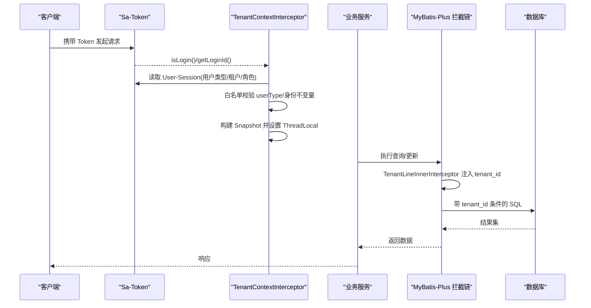
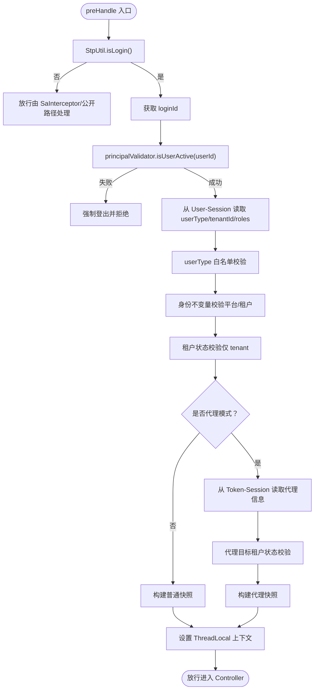
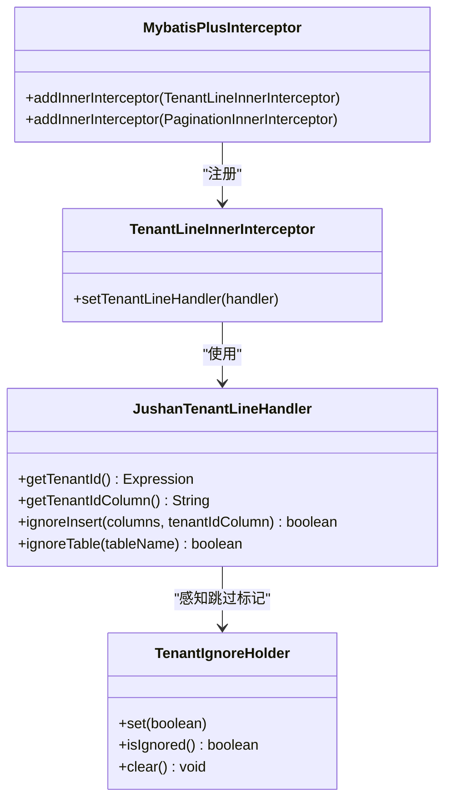
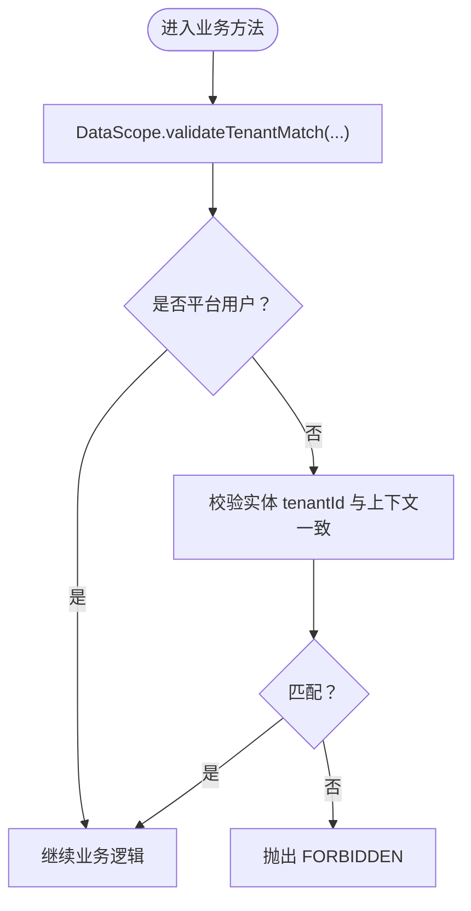
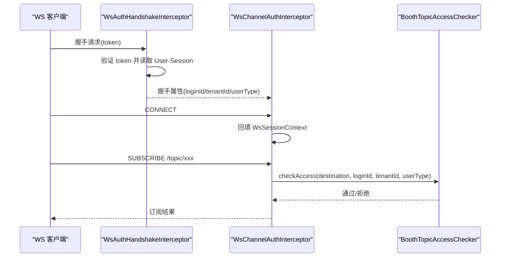
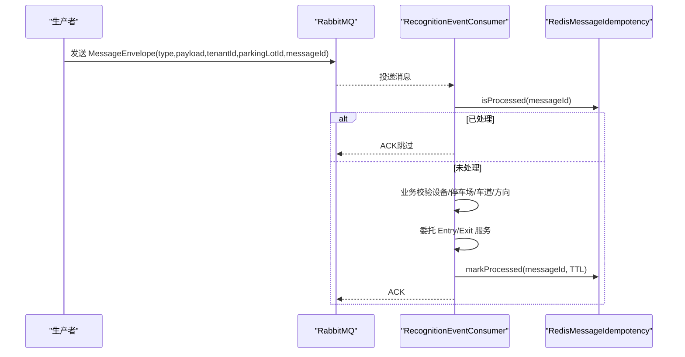
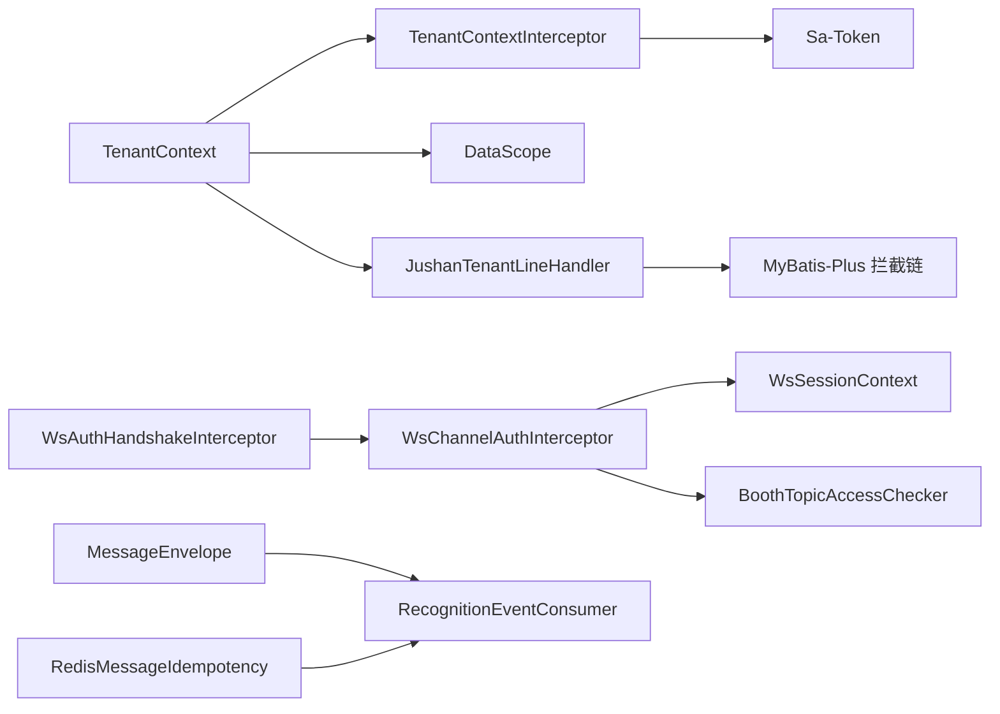

# 多租户架构设计

<cite>
**本文引用的文件**   
- [TenantContext.java](file://parking-framework/src/main/java/com/jushan/framework/auth/TenantContext.java)
- [TenantContextInterceptor.java](file://parking-framework/src/main/java/com/jushan/framework/auth/TenantContextInterceptor.java)
- [TenantContextFilter.java](file://parking-framework/src/main/java/com/jushan/framework/auth/TenantContextFilter.java)
- [DataScope.java](file://parking-framework/src/main/java/com/jushan/framework/auth/DataScope.java)
- [MyBatisConfig.java](file://parking-boot/src/main/java/com/jushan/boot/config/MyBatisConfig.java)
- [JushanTenantLineHandler.java](file://parking-system/src/main/java/com/jushan/system/mybatis/JushanTenantLineHandler.java)
- [TenantIgnoreHolder.java](file://parking-system/src/main/java/com/jushan/system/mybatis/TenantIgnoreHolder.java)
- [WsAuthHandshakeInterceptor.java](file://parking-framework/src/main/java/com/jushan/framework/ws/WsAuthHandshakeInterceptor.java)
- [WsChannelAuthInterceptor.java](file://parking-framework/src/main/java/com/jushan/framework/ws/WsChannelAuthInterceptor.java)
- [WsSessionContext.java](file://parking-framework/src/main/java/com/jushan/framework/ws/WsSessionContext.java)
- [BoothTopicAccessChecker.java](file://parking-system/src/main/java/com/jushan/system/ws/BoothTopicAccessChecker.java)
- [MessageEnvelope.java](file://parking-framework/src/main/java/com/jushan/framework/mq/MessageEnvelope.java)
- [RedisMessageIdempotency.java](file://parking-framework/src/main/java/com/jushan/framework/mq/RedisMessageIdempotency.java)
- [RecognitionEventConsumer.java](file://parking-system/src/main/java/com/jushan/system/event/RecognitionEventConsumer.java)
</cite>

## 目录
1. [引言](#引言)
2. [项目结构](#项目结构)
3. [核心组件](#核心组件)
4. [架构总览](#架构总览)
5. [详细组件分析](#详细组件分析)
6. [依赖关系分析](#依赖关系分析)
7. [性能与可扩展性](#性能与可扩展性)
8. [故障排查指南](#故障排查指南)
9. [结论](#结论)
10. [附录：最佳实践与规范](#附录最佳实践与规范)

## 引言
本文件面向平台侧后端，系统性阐述多租户架构设计与实现要点，重点覆盖：
- 可信租户上下文（TenantContext）的获取、传递与验证流程
- 数据隔离方案（基于 MyBatis-Plus TenantLineInnerInterceptor 的行级隔离）
- 权限控制策略（基于租户的数据范围控制）
- WebSocket 连接中的租户上下文处理
- 消息队列消费中的租户隔离与幂等保障
- 租户切换、超级管理员代操作、跨租户访问控制的实现规范与最佳实践

## 项目结构
多租户能力横跨框架层（parking-framework）、系统业务层（parking-system）与启动配置（parking-boot），关键位置如下：
- 认证与上下文装配：HTTP 请求入口通过拦截器填充线程级上下文；WebSocket 握手与通道拦截器维护会话级上下文。
- 数据隔离：MyBatis-Plus 插件链中注册租户行拦截器，结合自定义处理器注入 tenant_id 条件与忽略表白名单。
- 异步与事件：RabbitMQ 信封携带可信租户元数据，消费者在业务前进行校验与幂等处理。

```mermaid
graph TB
subgraph "HTTP 请求链路"
A["客户端"] --> B["Sa-Token 认证"]
B --> C["TenantContextInterceptor<br/>填充线程上下文"]
C --> D["Controller/Service"]
D --> E["MyBatis-Plus 拦截链<br/>TenantLineInnerInterceptor + JushanTenantLineHandler"]
E --> F["数据库tenant_id 过滤"]
end
subgraph "WebSocket 链路"
G["客户端 WS"] --> H["WsAuthHandshakeInterceptor<br/>握手鉴权+写入握手属性"]
H --> I["WsChannelAuthInterceptor<br/>CONNECT/SUBSCRIBE/SEND 拦截"]
I --> J["业务主题访问检查器<br/>BoothTopicAccessChecker"]
end
subgraph "消息队列链路"
K["生产者带信封"] --> L["RabbitMQ"]
L --> M["RecognitionEventConsumer<br/>幂等+校验+业务处理"]
end
```

**图表来源** 
- [TenantContextInterceptor.java:64-198](file://parking-framework/src/main/java/com/jushan/framework/auth/TenantContextInterceptor.java#L64-L198)
- [MyBatisConfig.java:57-75](file://parking-boot/src/main/java/com/jushan/boot/config/MyBatisConfig.java#L57-L75)
- [JushanTenantLineHandler.java:72-114](file://parking-system/src/main/java/com/jushan/system/mybatis/JushanTenantLineHandler.java#L72-L114)
- [WsAuthHandshakeInterceptor.java:51-108](file://parking-framework/src/main/java/com/jushan/framework/ws/WsAuthHandshakeInterceptor.java#L51-L108)
- [WsChannelAuthInterceptor.java:61-164](file://parking-framework/src/main/java/com/jushan/framework/ws/WsChannelAuthInterceptor.java#L61-L164)
- [BoothTopicAccessChecker.java:106-128](file://parking-system/src/main/java/com/jushan/system/ws/BoothTopicAccessChecker.java#L106-L128)
- [RecognitionEventConsumer.java:97-176](file://parking-system/src/main/java/com/jushan/system/event/RecognitionEventConsumer.java#L97-L176)

**章节来源**
- [TenantContextInterceptor.java:64-198](file://parking-framework/src/main/java/com/jushan/framework/auth/TenantContextInterceptor.java#L64-L198)
- [MyBatisConfig.java:57-75](file://parking-boot/src/main/java/com/jushan/boot/config/MyBatisConfig.java#L57-L75)
- [JushanTenantLineHandler.java:72-114](file://parking-system/src/main/java/com/jushan/system/mybatis/JushanTenantLineHandler.java#L72-L114)
- [WsAuthHandshakeInterceptor.java:51-108](file://parking-framework/src/main/java/com/jushan/framework/ws/WsAuthHandshakeInterceptor.java#L51-L108)
- [WsChannelAuthInterceptor.java:61-164](file://parking-framework/src/main/java/com/jushan/framework/ws/WsChannelAuthInterceptor.java#L61-L164)
- [BoothTopicAccessChecker.java:106-128](file://parking-system/src/main/java/com/jushan/system/ws/BoothTopicAccessChecker.java#L106-L128)
- [RecognitionEventConsumer.java:97-176](file://parking-system/src/main/java/com/jushan/system/event/RecognitionEventConsumer.java#L97-L176)

## 核心组件
- 可信租户上下文（TenantContext）
  - 提供线程级快照（Snapshot），包含 tenantId、userId、userType、roles、代理模式信息。
  - 提供 requireTenantId()/requireUserId() 等强校验方法，确保 fail-close。
- HTTP 上下文装配（TenantContextInterceptor）
  - 唯一权威装配点：从 Sa-Token 会话读取用户身份与租户绑定，严格白名单校验 userType，支持代理模式。
- 数据范围工具（DataScope）
  - 统一断言：租户匹配、平台用户要求、角色校验、停车场范围校验等。
- SQL 级租户隔离（MyBatis-Plus + JushanTenantLineHandler）
  - 自动注入 tenant_id 条件；平台用户默认无法访问业务表；支持全局表白名单与 @TenantIgnore 跳过。
- WebSocket 上下文（WsAuthHandshakeInterceptor / WsChannelAuthInterceptor / WsSessionContext）
  - 握手阶段鉴权并回填租户上下文到握手属性；通道拦截器在 CONNECT/SUBSCRIBE/SEND 时维护线程上下文。
- 消息信封与幂等（MessageEnvelope / RedisMessageIdempotency）
  - 信封携带 messageId、type、tenantId、parkingLotId、timestamp；幂等基于 Redis SETNX。
- 事件消费者（RecognitionEventConsumer）
  - 先做消息级幂等，再执行业务校验与处理，保证不信任消息体中的租户字段，以可信记录为准。

**章节来源**
- [TenantContext.java:27-256](file://parking-framework/src/main/java/com/jushan/framework/auth/TenantContext.java#L27-L256)
- [TenantContextInterceptor.java:64-198](file://parking-framework/src/main/java/com/jushan/framework/auth/TenantContextInterceptor.java#L64-L198)
- [DataScope.java:25-240](file://parking-framework/src/main/java/com/jushan/framework/auth/DataScope.java#L25-L240)
- [MyBatisConfig.java:57-75](file://parking-boot/src/main/java/com/jushan/boot/config/MyBatisConfig.java#L57-L75)
- [JushanTenantLineHandler.java:72-114](file://parking-system/src/main/java/com/jushan/system/mybatis/JushanTenantLineHandler.java#L72-L114)
- [WsAuthHandshakeInterceptor.java:51-108](file://parking-framework/src/main/java/com/jushan/framework/ws/WsAuthHandshakeInterceptor.java#L51-L108)
- [WsChannelAuthInterceptor.java:61-164](file://parking-framework/src/main/java/com/jushan/framework/ws/WsChannelAuthInterceptor.java#L61-L164)
- [WsSessionContext.java:24-49](file://parking-framework/src/main/java/com/jushan/framework/ws/WsSessionContext.java#L24-L49)
- [MessageEnvelope.java:27-138](file://parking-framework/src/main/java/com/jushan/framework/mq/MessageEnvelope.java#L27-L138)
- [RedisMessageIdempotency.java:35-78](file://parking-framework/src/main/java/com/jushan/framework/mq/RedisMessageIdempotency.java#L35-L78)
- [RecognitionEventConsumer.java:97-176](file://parking-system/src/main/java/com/jushan/system/event/RecognitionEventConsumer.java#L97-L176)

## 架构总览
下图展示 HTTP、WebSocket、消息队列三条链路在多租户上下文与数据隔离上的协作方式。

**图表来源** 
- [TenantContextInterceptor.java:64-198](file://parking-framework/src/main/java/com/jushan/framework/auth/TenantContextInterceptor.java#L64-L198)
- [MyBatisConfig.java:57-75](file://parking-boot/src/main/java/com/jushan/boot/config/MyBatisConfig.java#L57-L75)
- [JushanTenantLineHandler.java:72-114](file://parking-system/src/main/java/com/jushan/system/mybatis/JushanTenantLineHandler.java#L72-L114)

## 详细组件分析

### 1) 租户上下文管理（TenantContext 与装配）
- 上下文快照（Snapshot）
  - 字段：tenantId、userId、userType、roles、isProxy、proxyOperatorId、proxyOperatorName、proxyTargetTenantId。
  - 判定：isPlatformUser() 需同时满足“非代理 + 无租户绑定 + userType=platform”；isTenantUser() 需“非代理 + 有租户绑定”。
- 装配流程（HTTP）
  - 使用 StpUtil.isLogin() 判定认证状态，避免手动解析 Header/Cookie。
  - 从 User-Session 读取 userType/tenantId/roles；从 Token-Session 读取代理信息。
  - 严格白名单校验 userType；校验平台/租户身份不变量；必要时校验租户状态。
  - 构建 Snapshot 并设置到 ThreadLocal；afterCompletion 清理。
- 生命周期
  - 请求到达 → preHandle 填充；请求结束 → afterCompletion 清理。
  - 异步任务/定时任务需在调用前 capture()/restore()。

**图表来源** 
- [TenantContextInterceptor.java:64-198](file://parking-framework/src/main/java/com/jushan/framework/auth/TenantContextInterceptor.java#L64-L198)

**章节来源**
- [TenantContext.java:27-256](file://parking-framework/src/main/java/com/jushan/framework/auth/TenantContext.java#L27-L256)
- [TenantContextInterceptor.java:64-198](file://parking-framework/src/main/java/com/jushan/framework/auth/TenantContextInterceptor.java#L64-L198)

### 2) 数据隔离（SQL 级租户隔离）
- 插件链顺序
  - TenantLineInnerInterceptor（多租户）→ PaginationInnerInterceptor（分页）。
- 租户 ID 注入策略
  - getTenantId() 从 TenantContext 读取；平台用户（tenantId=null）将注入 tenant_id = null，导致业务表默认不可见（fail-closed）。
  - ignoreInsert()：当无明确租户上下文或显式标记跳过时，不自动注入 tenant_id，防止重复列或不一致。
  - ignoreTable()：全局表白名单（如 sys_role、sys_permission、device_vendor 等）跳过注入。
- 跳过机制
  - TenantIgnoreHolder 用于在特定方法/切面执行期间标记跳过租户拦截，必须在 finally 清理。

**图表来源** 
- [MyBatisConfig.java:57-75](file://parking-boot/src/main/java/com/jushan/boot/config/MyBatisConfig.java#L57-L75)
- [JushanTenantLineHandler.java:72-114](file://parking-system/src/main/java/com/jushan/system/mybatis/JushanTenantLineHandler.java#L72-L114)
- [TenantIgnoreHolder.java:14-40](file://parking-system/src/main/java/com/jushan/system/mybatis/TenantIgnoreHolder.java#L14-L40)

**章节来源**
- [MyBatisConfig.java:57-75](file://parking-boot/src/main/java/com/jushan/boot/config/MyBatisConfig.java#L57-L75)
- [JushanTenantLineHandler.java:72-114](file://parking-system/src/main/java/com/jushan/system/mybatis/JushanTenantLineHandler.java#L72-L114)
- [TenantIgnoreHolder.java:14-40](file://parking-system/src/main/java/com/jushan/system/mybatis/TenantIgnoreHolder.java#L14-L40)

### 3) 权限控制策略（数据范围）
- 租户范围
  - validateTenantMatch(entityTenantId, label)：平台用户允许跨租户；租户用户必须完全匹配。
  - validateTenantAccess(entityTenantId, label)：要求当前上下文存在且为租户用户。
- 平台用户
  - requirePlatformUser()：正向确认 isPlatformUser() == true，拒绝代理与损坏身份。
- 角色校验
  - requireRole(roleCode)/hasRole(roleCode)：对 roles JSON 数组精确匹配，避免子串误判。
- 停车场范围
  - validateParkingLotsBelongToTenant(...)：批量校验停车场归属租户。

**图表来源** 
- [DataScope.java:45-80](file://parking-framework/src/main/java/com/jushan/framework/auth/DataScope.java#L45-L80)
- [DataScope.java:171-177](file://parking-framework/src/main/java/com/jushan/framework/auth/DataScope.java#L171-L177)

**章节来源**
- [DataScope.java:25-240](file://parking-framework/src/main/java/com/jushan/framework/auth/DataScope.java#L25-L240)

### 4) WebSocket 连接中的租户上下文处理
- 握手阶段（WsAuthHandshakeInterceptor）
  - 提取 token（URL 参数或 Authorization 头），验证登录态。
  - 从 User-Session 读取 tenantId/userType 写入握手属性，供后续通道拦截器使用。
- 通道拦截（WsChannelAuthInterceptor）
  - CONNECT：从握手属性回填 WsSessionContext（loginId、tenantId、userType、sessionId）。
  - SUBSCRIBE：公共目标放行；私有目标必须认证，并调用业务 TopicAccessChecker 进行数据范围校验。
  - SEND：禁止客户端向服务端业务主题发送消息（当前阶段）。
  - DISCONNECT：清理上下文。
- 主题访问检查（BoothTopicAccessChecker）
  - 根据 STOMP 目的地与上下文构建 TenantContext.Snapshot，优先从 Sa-Token Session 读取完整上下文。

**图表来源** 
- [WsAuthHandshakeInterceptor.java:51-108](file://parking-framework/src/main/java/com/jushan/framework/ws/WsAuthHandshakeInterceptor.java#L51-L108)
- [WsChannelAuthInterceptor.java:93-164](file://parking-framework/src/main/java/com/jushan/framework/ws/WsChannelAuthInterceptor.java#L93-L164)
- [BoothTopicAccessChecker.java:106-128](file://parking-system/src/main/java/com/jushan/system/ws/BoothTopicAccessChecker.java#L106-L128)

**章节来源**
- [WsAuthHandshakeInterceptor.java:51-108](file://parking-framework/src/main/java/com/jushan/framework/ws/WsAuthHandshakeInterceptor.java#L51-L108)
- [WsChannelAuthInterceptor.java:61-164](file://parking-framework/src/main/java/com/jushan/framework/ws/WsChannelAuthInterceptor.java#L61-L164)
- [WsSessionContext.java:24-49](file://parking-framework/src/main/java/com/jushan/framework/ws/WsSessionContext.java#L24-L49)
- [BoothTopicAccessChecker.java:106-128](file://parking-system/src/main/java/com/jushan/system/ws/BoothTopicAccessChecker.java#L106-L128)

### 5) 消息队列消费中的租户隔离
- 信封（MessageEnvelope）
  - 携带 messageId、type、tenantId、parkingLotId、timestamp；强调由后端从可信上下文填入，禁止信任前端传入值。
- 幂等（RedisMessageIdempotency）
  - 基于 Redis SETNX 原子操作，key 格式 jushan:mq:consumed:{messageId}，TTL 默认 72 小时；Redis 不可用时降级为“尽量处理”，业务层 eventId 唯一约束兜底。
- 消费者（RecognitionEventConsumer）
  - 先检查 messageId 幂等；基础校验后委托 EntryService/ExitService 处理；不信任消息体中的 tenantId/parkingLotId，以设备/停车场可信记录为准进行一致性校验。

**图表来源** 
- [MessageEnvelope.java:27-138](file://parking-framework/src/main/java/com/jushan/framework/mq/MessageEnvelope.java#L27-L138)
- [RedisMessageIdempotency.java:35-78](file://parking-framework/src/main/java/com/jushan/framework/mq/RedisMessageIdempotency.java#L35-L78)
- [RecognitionEventConsumer.java:97-176](file://parking-system/src/main/java/com/jushan/system/event/RecognitionEventConsumer.java#L97-L176)

**章节来源**
- [MessageEnvelope.java:27-138](file://parking-framework/src/main/java/com/jushan/framework/mq/MessageEnvelope.java#L27-L138)
- [RedisMessageIdempotency.java:35-78](file://parking-framework/src/main/java/com/jushan/framework/mq/RedisMessageIdempotency.java#L35-L78)
- [RecognitionEventConsumer.java:97-176](file://parking-system/src/main/java/com/jushan/system/event/RecognitionEventConsumer.java#L97-L176)

## 依赖关系分析
- 耦合与内聚
  - TenantContext 作为核心上下文，被拦截器、数据范围工具、SQL 处理器、WebSocket 组件广泛引用，内聚度高。
  - DataScope 集中封装安全断言，降低业务代码分散校验的风险。
  - MyBatis-Plus 插件链解耦了租户注入与分页功能，便于独立开关与扩展。
- 外部依赖
  - Sa-Token：认证与会话读写。
  - RabbitMQ：内部消息路由与死信策略。
  - Redis：幂等标记存储。
- 潜在循环依赖
  - 当前未见直接循环导入；注意业务模块不应反向依赖框架层的上下文装配细节，应通过接口与工具类交互。

**图表来源** 
- [TenantContext.java:27-256](file://parking-framework/src/main/java/com/jushan/framework/auth/TenantContext.java#L27-L256)
- [TenantContextInterceptor.java:64-198](file://parking-framework/src/main/java/com/jushan/framework/auth/TenantContextInterceptor.java#L64-L198)
- [DataScope.java:25-240](file://parking-framework/src/main/java/com/jushan/framework/auth/DataScope.java#L25-L240)
- [JushanTenantLineHandler.java:72-114](file://parking-system/src/main/java/com/jushan/system/mybatis/JushanTenantLineHandler.java#L72-L114)
- [WsAuthHandshakeInterceptor.java:51-108](file://parking-framework/src/main/java/com/jushan/framework/ws/WsAuthHandshakeInterceptor.java#L51-L108)
- [WsChannelAuthInterceptor.java:61-164](file://parking-framework/src/main/java/com/jushan/framework/ws/WsChannelAuthInterceptor.java#L61-L164)
- [WsSessionContext.java:24-49](file://parking-framework/src/main/java/com/jushan/framework/ws/WsSessionContext.java#L24-L49)
- [BoothTopicAccessChecker.java:106-128](file://parking-system/src/main/java/com/jushan/system/ws/BoothTopicAccessChecker.java#L106-L128)
- [MessageEnvelope.java:27-138](file://parking-framework/src/main/java/com/jushan/framework/mq/MessageEnvelope.java#L27-L138)
- [RedisMessageIdempotency.java:35-78](file://parking-framework/src/main/java/com/jushan/framework/mq/RedisMessageIdempotency.java#L35-L78)
- [RecognitionEventConsumer.java:97-176](file://parking-system/src/main/java/com/jushan/system/event/RecognitionEventConsumer.java#L97-L176)

**章节来源**
- [TenantContext.java:27-256](file://parking-framework/src/main/java/com/jushan/framework/auth/TenantContext.java#L27-L256)
- [TenantContextInterceptor.java:64-198](file://parking-framework/src/main/java/com/jushan/framework/auth/TenantContextInterceptor.java#L64-L198)
- [DataScope.java:25-240](file://parking-framework/src/main/java/com/jushan/framework/auth/DataScope.java#L25-L240)
- [JushanTenantLineHandler.java:72-114](file://parking-system/src/main/java/com/jushan/system/mybatis/JushanTenantLineHandler.java#L72-L114)
- [WsAuthHandshakeInterceptor.java:51-108](file://parking-framework/src/main/java/com/jushan/framework/ws/WsAuthHandshakeInterceptor.java#L51-L108)
- [WsChannelAuthInterceptor.java:61-164](file://parking-framework/src/main/java/com/jushan/framework/ws/WsChannelAuthInterceptor.java#L61-L164)
- [WsSessionContext.java:24-49](file://parking-framework/src/main/java/com/jushan/framework/ws/WsSessionContext.java#L24-L49)
- [BoothTopicAccessChecker.java:106-128](file://parking-system/src/main/java/com/jushan/system/ws/BoothTopicAccessChecker.java#L106-L128)
- [MessageEnvelope.java:27-138](file://parking-framework/src/main/java/com/jushan/framework/mq/MessageEnvelope.java#L27-L138)
- [RedisMessageIdempotency.java:35-78](file://parking-framework/src/main/java/com/jushan/framework/mq/RedisMessageIdempotency.java#L35-L78)
- [RecognitionEventConsumer.java:97-176](file://parking-system/src/main/java/com/jushan/system/event/RecognitionEventConsumer.java#L97-L176)

## 性能与可扩展性
- SQL 级隔离
  - 通过 TenantLineInnerInterceptor 在 SQL 生成阶段注入条件，零侵入业务代码；建议合理维护 ignoreTables 白名单，避免不必要的注入开销。
- 分页保护
  - 分页插件限制最大页大小，防止深度分页拖垮数据库。
- 幂等与重试
  - Redis 幂等键 TTL 控制，避免堆积；业务层 eventId 唯一约束提供最终一致性保障。
- 可扩展点
  - 新增全局表白名单可通过配置项追加；新增 Topic 访问规则通过实现 WsTopicAccessChecker 并注册 Bean。

[本节为通用指导，无需具体文件分析]

## 故障排查指南
- 上下文为空但用户已认证
  - 现象：日志告警提示“用户已认证但上下文为空”。
  - 原因：上下文应由拦截器填充，若 Filter 与 Interceptor 并存可能产生竞争。
  - 处置：确保使用唯一权威装配点（Interceptor），清理历史 Filter 注册。
- 非法 userType 或身份不变量异常
  - 现象：会话缺少用户类型或平台用户携带 tenantId。
  - 原因：会话数据不一致或伪造。
  - 处置：强制登出并拒绝；检查登录流程写入会话的字段。
- SQL 注入 tenant_id 失败
  - 现象：查询结果为空或报错。
  - 原因：平台用户默认 tenantId=null；或表不在白名单。
  - 处置：确认业务表具备 tenant_id；将全局表加入 ignoreTables；跨租户场景使用显式跳过机制。
- WebSocket 订阅私有主题被拒
  - 现象：未认证或无权限订阅。
  - 原因：握手未携带 token 或未通过 TopicAccessChecker。
  - 处置：确保握手携带有效 token；实现正确的主题访问检查。
- 消息重复处理
  - 现象：同一 messageId 多次消费。
  - 原因：Redis 不可用或幂等未生效。
  - 处置：检查 Redis 连通性与 key 前缀；确认消费者在业务成功后立即标记处理。

**章节来源**
- [TenantContextFilter.java:18-31](file://parking-framework/src/main/java/com/jushan/framework/auth/TenantContextFilter.java#L18-L31)
- [TenantContextInterceptor.java:115-140](file://parking-framework/src/main/java/com/jushan/framework/auth/TenantContextInterceptor.java#L115-L140)
- [JushanTenantLineHandler.java:72-114](file://parking-system/src/main/java/com/jushan/system/mybatis/JushanTenantLineHandler.java#L72-L114)
- [WsChannelAuthInterceptor.java:123-164](file://parking-framework/src/main/java/com/jushan/framework/ws/WsChannelAuthInterceptor.java#L123-L164)
- [RedisMessageIdempotency.java:54-78](file://parking-framework/src/main/java/com/jushan/framework/mq/RedisMessageIdempotency.java#L54-L78)

## 结论
本项目在多租户设计上采用“可信上下文 + 行级隔离 + 数据范围断言”的分层防护体系：
- 通过唯一权威的 HTTP 拦截器与 WebSocket 握手/通道拦截器，确保上下文在各类链路中可靠传递。
- 借助 MyBatis-Plus 租户拦截器与自定义处理器，实现 SQL 级强隔离与可配置的豁免策略。
- 在异步与事件场景中，通过信封与幂等机制保障租户边界与最终一致性。
- 平台用户、租户用户与代理模式的清晰语义与不变量校验，有效避免了越权与跨租户泄露风险。

[本节为总结，无需具体文件分析]

## 附录：最佳实践与规范
- 上下文使用
  - 所有业务代码必须通过 TenantContext 获取租户与用户信息，严禁信任前端传入的 tenantId。
  - 异步任务/定时任务在执行前 capture()/restore() 上下文，并在 finally 中 clear()。
- 数据范围校验
  - 在 Service 层入口处调用 DataScope 断言；平台用户需显式 requirePlatformUser()。
  - 批量资源操作使用 validateParkingLotsBelongToTenant(...) 进行范围校验。
- SQL 隔离
  - 保持 ignoreTables 白名单最小化；需要跨租户访问时使用显式跳过机制并确保审计与风控。
- WebSocket
  - 所有私有主题必须认证；实现 WsTopicAccessChecker 进行细粒度数据范围校验。
- 消息队列
  - 生产者从可信上下文填充 envelope.tenantId/parkingLotId；消费者先幂等再业务处理，并以可信记录为准进行一致性校验。
- 代理模式
  - 仅平台用户可开启代理；代理模式下数据范围限定在目标租户，不得视为平台全局范围。

[本节为通用规范，无需具体文件分析]