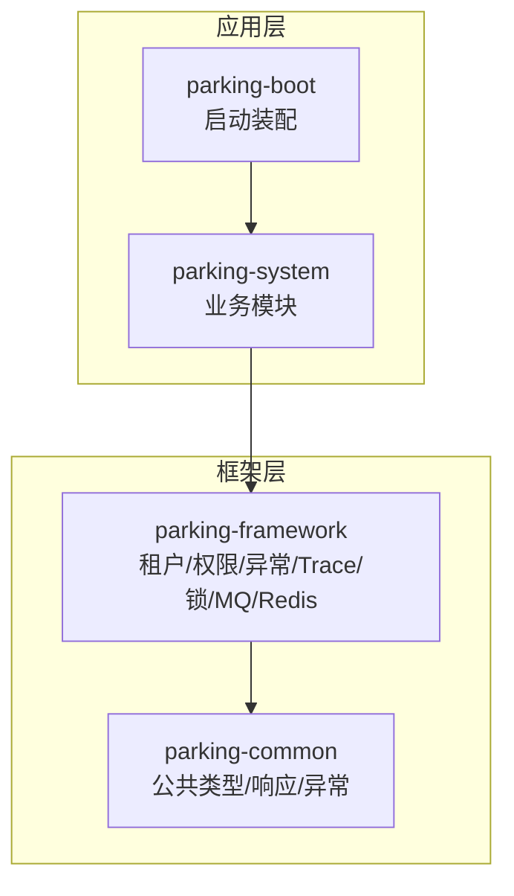
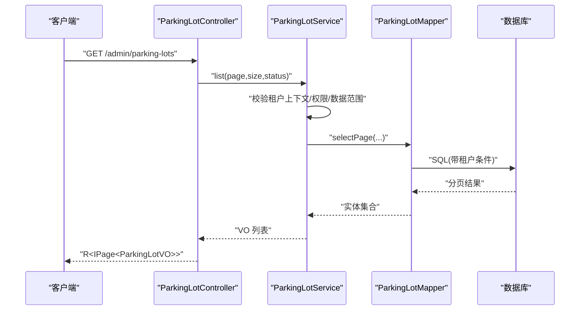
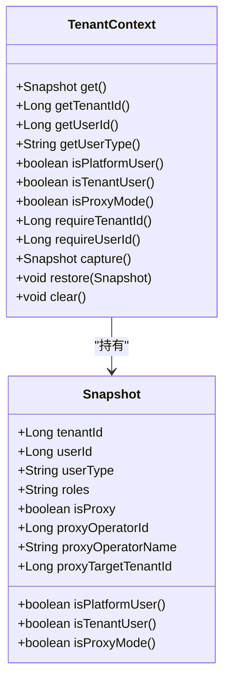
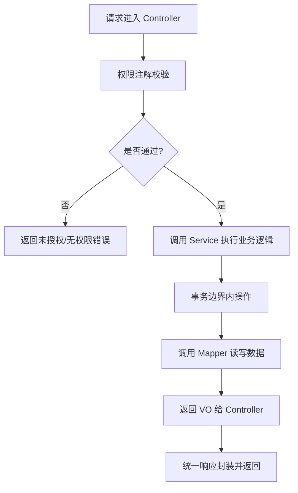
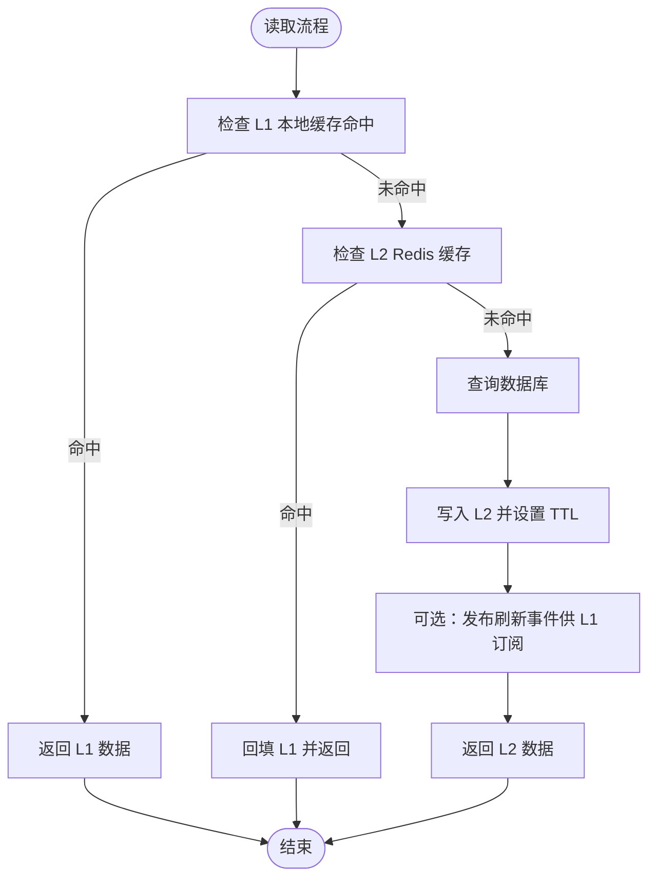
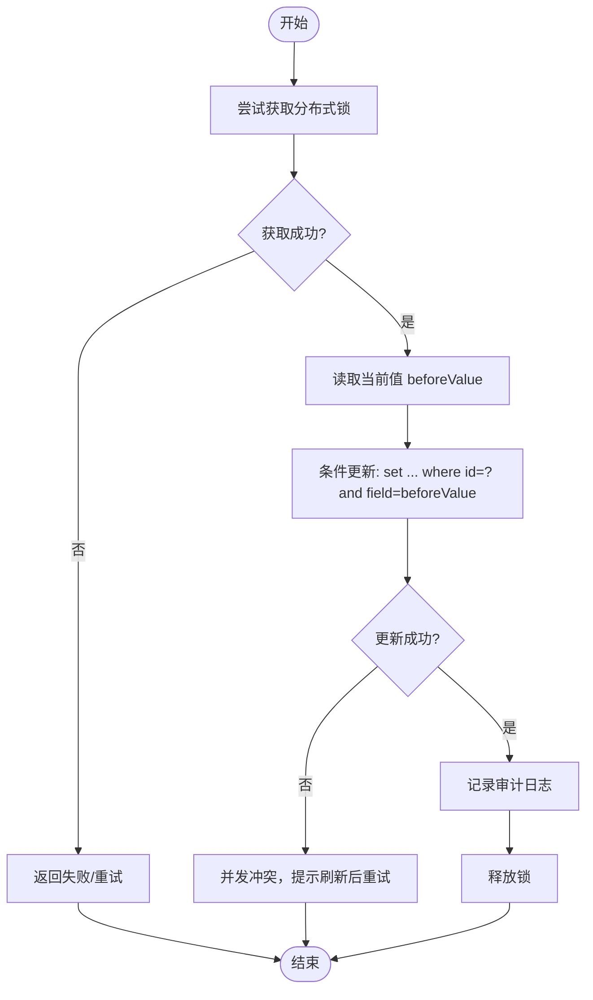
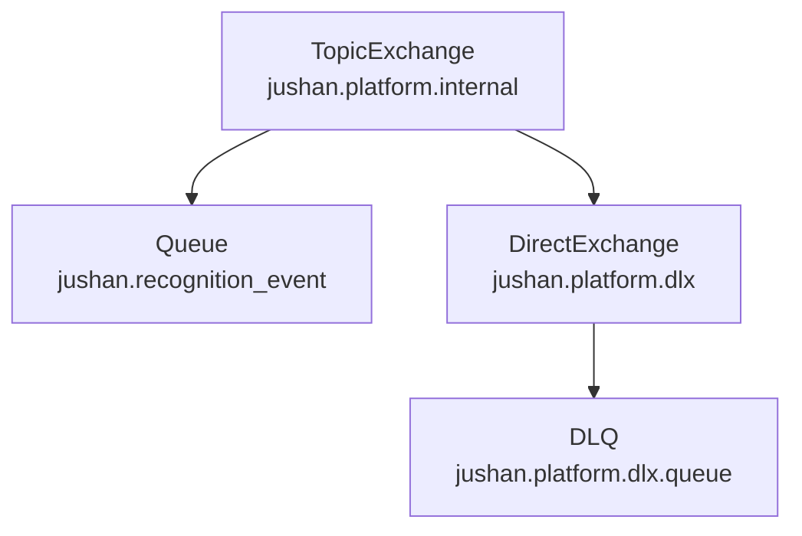
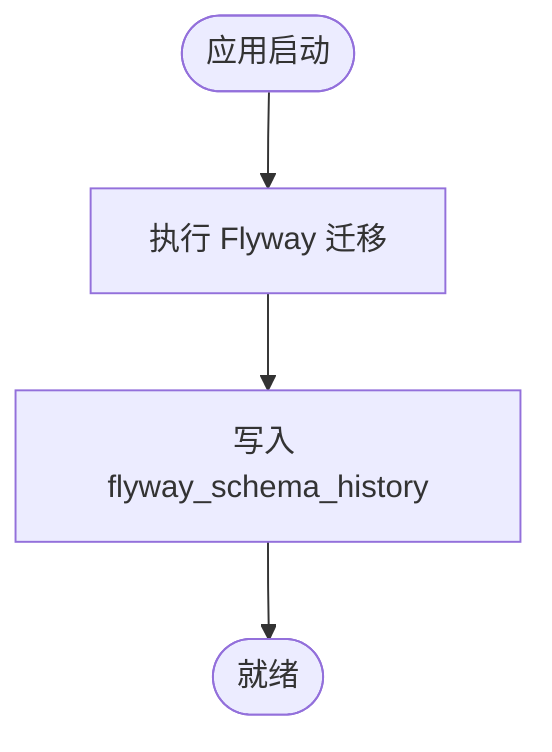
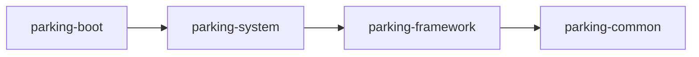

# 架构规范

<cite>
**本文引用的文件**   
- [README.md](file://README.md)
- [pom.xml](file://pom.xml)
- [ParkingApplication.java](file://parking-boot/src/main/java/com/jushan/boot/ParkingApplication.java)
- [技术架构.md](file://docs/项目概述/技术架构.md)
- [T02-架构模块与前端工程方案冻结.md](file://docs/归档/平台侧/T02-架构模块与前端工程方案冻结.md)
- [TenantContext.java](file://parking-framework/src/main/java/com/jushan/framework/auth/TenantContext.java)
- [CacheNames.java](file://parking-framework/src/main/java/com/jushan/framework/redis/CacheNames.java)
- [RabbitMqConfig.java](file://parking-framework/src/main/java/com/jushan/framework/mq/RabbitMqConfig.java)
- [MqConstants.java](file://parking-framework/src/main/java/com/jushan/framework/mq/MqConstants.java)
- [DistributedLock.java](file://parking-framework/src/main/java/com/jushan/framework/lock/DistributedLock.java)
- [RedisDistributedLock.java](file://parking-framework/src/main/java/com/jushan/framework/lock/RedisDistributedLock.java)
- [ParkingLotController.java](file://parking-system/src/main/java/com/jushan/system/controller/ParkingLotController.java)
- [ParkingLotService.java](file://parking-system/src/main/java/com/jushan/system/service/ParkingLotService.java)
- [ParkingLotMapper.java](file://parking-system/src/main/java/com/jushan/system/mapper/ParkingLotMapper.java)
- [ParkingLot.java](file://parking-system/src/main/java/com/jushan/system/entity/ParkingLot.java)
- [V20260710001__baseline.sql](file://parking-boot/src/main/resources/db/migration/V20260710001__baseline.sql)
- [FlywayMigrationTest.java](file://parking-boot/src/test/java/com/jushan/boot/migration/FlywayMigrationTest.java)
- [CLAUDE.md](file://CLAUDE.md)
</cite>

## 目录
1. [引言](#引言)
2. [项目结构](#项目结构)
3. [核心组件](#核心组件)
4. [架构总览](#架构总览)
5. [详细组件分析](#详细组件分析)
6. [依赖关系分析](#依赖关系分析)
7. [性能考量](#性能考量)
8. [故障排查指南](#故障排查指南)
9. [结论](#结论)
10. [附录](#附录)

## 引言
本规范面向智慧停车 SaaS 平台的模块化单体架构，聚焦以下设计要点：
- 模块化单体分层与职责边界（Controller-Service-Mapper-Entity）
- 多租户上下文、数据隔离与权限控制策略
- 缓存架构（L1 本地缓存 + L2 Redis）分级策略
- 并发控制（分布式锁 + 乐观锁）使用场景与实现
- 消息队列（RabbitMQ）Exchange/Queue/RoutingKey 设计原则
- 数据库设计规范（表结构、索引、Flyway 迁移管理）

## 项目结构
仓库采用 Maven 多模块组织，启动入口位于 parking-boot，业务在 parking-system，横切能力在 parking-framework，通用类型在 parking-common。模块依赖方向自下而上：boot → system → framework → common。

**图表来源** 
- [技术架构.md:54-78](file://docs/项目概述/技术架构.md#L54-L78)
- [pom.xml:46-52](file://pom.xml#L46-L52)

**章节来源**
- [README.md:1-75](file://README.md#L1-L75)
- [pom.xml:1-217](file://pom.xml#L1-L217)
- [ParkingApplication.java:1-30](file://parking-boot/src/main/java/com/jushan/boot/ParkingApplication.java#L1-L30)
- [技术架构.md:54-78](file://docs/项目概述/技术架构.md#L54-L78)

## 核心组件
- 多租户上下文 TenantContext：线程级可信上下文，统一承载 tenantId、userId、userType、roles 及代理模式信息；提供 requireTenantId/requireUserId 等强校验方法，确保“前端传入的 tenantId 不可信”。
- 缓存命名 CacheNames：按领域划分缓存空间，避免不同业务混用同一缓存区域。
- 分布式锁 DistributedLock 接口与 RedisDistributedLock 实现：基于 Redis SET NX PX 原子命令，支持等待、过期释放与 Lua 脚本安全释放。
- RabbitMQ 基础设施：平台内部 Exchange/Queue/DLX 声明、JSON 序列化、降级策略与消费者容器工厂配置。
- 分层控制器与服务：ParkingLotController 负责路由与鉴权，ParkingLotService 承载业务编排、事务与审计，ParkingLotMapper 访问持久层，ParkingLot 为实体模型。

**章节来源**
- [TenantContext.java:1-257](file://parking-framework/src/main/java/com/jushan/framework/auth/TenantContext.java#L1-L257)
- [CacheNames.java:1-40](file://parking-framework/src/main/java/com/jushan/framework/redis/CacheNames.java#L1-L40)
- [DistributedLock.java:1-53](file://parking-framework/src/main/java/com/jushan/framework/lock/DistributedLock.java#L1-L53)
- [RedisDistributedLock.java:1-130](file://parking-framework/src/main/java/com/jushan/framework/lock/RedisDistributedLock.java#L1-L130)
- [RabbitMqConfig.java:1-176](file://parking-framework/src/main/java/com/jushan/framework/mq/RabbitMqConfig.java#L1-L176)
- [MqConstants.java:1-44](file://parking-framework/src/main/java/com/jushan/framework/mq/MqConstants.java#L1-L44)
- [ParkingLotController.java:1-166](file://parking-system/src/main/java/com/jushan/system/controller/ParkingLotController.java#L1-L166)
- [ParkingLotService.java:1-589](file://parking-system/src/main/java/com/jushan/system/service/ParkingLotService.java#L1-L589)
- [ParkingLotMapper.java:1-28](file://parking-system/src/main/java/com/jushan/system/mapper/ParkingLotMapper.java#L1-L28)
- [ParkingLot.java:1-172](file://parking-system/src/main/java/com/jushan/system/entity/ParkingLot.java#L1-L172)

## 架构总览
整体采用“模块化单体 + 分层架构”：
- 表现层：REST 控制器，承担参数校验、权限注解、调用服务层。
- 业务层：Service 编排事务、权限与范围校验、并发控制、审计日志。
- 数据访问层：MyBatis-Plus Mapper，结合拦截器实现租户隔离与数据范围控制。
- 横切能力：框架层提供租户上下文、权限、异常、Trace、锁、MQ、Redis 等。

**图表来源** 
- [ParkingLotController.java:59-66](file://parking-system/src/main/java/com/jushan/system/controller/ParkingLotController.java#L59-L66)
- [ParkingLotService.java:264-286](file://parking-system/src/main/java/com/jushan/system/service/ParkingLotService.java#L264-L286)
- [ParkingLotMapper.java:17-27](file://parking-system/src/main/java/com/jushan/system/mapper/ParkingLotMapper.java#L17-L27)

## 详细组件分析

### 多租户与权限控制
- 上下文来源：请求进入时由框架从已验证会话推导 tenantId/userId/userType/roles，写入 ThreadLocal；异步/消息消费需手动 capture/restore。
- 强制约束：所有需要租户范围的接口必须通过 requireTenantId/requireUserId 获取，失败即拒绝。
- 代理模式：代理模式下不视为平台用户，数据范围严格限定在目标租户。
- 权限注解：控制器层使用权限注解进行细粒度授权，如 parking:read/write/disable。
- 数据范围：除租户级隔离外，停车场级授权通过 scopeResolver 限制受限角色仅能访问授权停车场。

**图表来源** 
- [TenantContext.java:27-90](file://parking-framework/src/main/java/com/jushan/framework/auth/TenantContext.java#L27-L90)
- [TenantContext.java:94-185](file://parking-framework/src/main/java/com/jushan/framework/auth/TenantContext.java#L94-L185)

**章节来源**
- [TenantContext.java:1-257](file://parking-framework/src/main/java/com/jushan/framework/auth/TenantContext.java#L1-L257)
- [ParkingLotController.java:35-48](file://parking-system/src/main/java/com/jushan/system/controller/ParkingLotController.java#L35-L48)
- [ParkingLotService.java:264-286](file://parking-system/src/main/java/com/jushan/system/service/ParkingLotService.java#L264-L286)

### 分层架构规范（Controller-Service-Mapper-Entity）
- Controller：只负责入参校验、权限注解、调用 Service、返回统一响应体 R。
- Service：承载事务、业务规则、权限与范围校验、并发控制、审计与事件发布；禁止直接操作外部系统细节。
- Mapper：仅做数据访问，配合 MyBatis-Plus 与拦截器完成 SQL 生成与租户条件注入。
- Entity：映射数据库表结构，保持字段与业务语义一致。

**图表来源** 
- [ParkingLotController.java:59-166](file://parking-system/src/main/java/com/jushan/system/controller/ParkingLotController.java#L59-L166)
- [ParkingLotService.java:118-165](file://parking-system/src/main/java/com/jushan/system/service/ParkingLotService.java#L118-L165)
- [ParkingLotMapper.java:17-27](file://parking-system/src/main/java/com/jushan/system/mapper/ParkingLotMapper.java#L17-L27)

**章节来源**
- [ParkingLotController.java:1-166](file://parking-system/src/main/java/com/jushan/system/controller/ParkingLotController.java#L1-L166)
- [ParkingLotService.java:1-589](file://parking-system/src/main/java/com/jushan/system/service/ParkingLotService.java#L1-L589)
- [ParkingLotMapper.java:1-28](file://parking-system/src/main/java/com/jushan/system/mapper/ParkingLotMapper.java#L1-L28)
- [ParkingLot.java:1-172](file://parking-system/src/main/java/com/jushan/system/entity/ParkingLot.java#L1-L172)

### 缓存架构（L1 本地缓存 + L2 Redis）
- L1 本地缓存（Caffeine）：用于热点配置与字典，短 TTL，监听 Redis Pub/Sub 刷新。
- L2 Redis：业务对象、会话、锁、实时计数等，采用 Cache-Aside 更新失效策略。
- Key 前缀：统一以 parking: 开头，按 tenantId:resourceId 组织，避免跨租户冲突。
- 缓存命名：通过 CacheNames 常量集中管理，按领域划分独立缓存空间。

[此图为概念流程图，无需图表来源]

**章节来源**
- [CacheNames.java:1-40](file://parking-framework/src/main/java/com/jushan/framework/redis/CacheNames.java#L1-L40)
- [CLAUDE.md:487-504](file://CLAUDE.md#L487-L504)

### 并发控制（分布式锁 + 乐观锁）
- 分布式锁：基于 Redis 的 tryLock/unlock，支持等待与过期释放；Lua 脚本保证仅释放自己持有的锁。
- 乐观锁：对关键数值字段（如容量）使用 beforeValue 条件更新，防止并发覆盖。
- 双层锁策略：分布式锁串行化同一资源并发请求；数据库乐观锁兜底防止锁失效或边界外的写冲突。

**图表来源** 
- [RedisDistributedLock.java:44-108](file://parking-framework/src/main/java/com/jushan/framework/lock/RedisDistributedLock.java#L44-L108)
- [ParkingLotService.java:424-477](file://parking-system/src/main/java/com/jushan/system/service/ParkingLotService.java#L424-L477)

**章节来源**
- [DistributedLock.java:1-53](file://parking-framework/src/main/java/com/jushan/framework/lock/DistributedLock.java#L1-L53)
- [RedisDistributedLock.java:1-130](file://parking-framework/src/main/java/com/jushan/framework/lock/RedisDistributedLock.java#L1-L130)
- [ParkingLotService.java:424-477](file://parking-system/src/main/java/com/jushan/system/service/ParkingLotService.java#L424-L477)
- [CLAUDE.md:497-504](file://CLAUDE.md#L497-L504)

### 消息队列（RabbitMQ）
- 平台内部 Exchange：TopicExchange jushan.platform.internal，DirectExchange jushan.platform.dlx。
- 死信策略：消费失败的消息转入 DLX，保留 messageId 便于人工重放。
- 命名规范：Queue 与 RoutingKey 遵循 jushan.{module}.{purpose/event} 风格。
- 降级策略：当 ConnectionFactory 不可用时，RabbitTemplate 与 ListenerContainerFactory 降级为空操作，不影响非 MQ 场景启动。
- 识别事件队列：预留 recognitionEventQueue 与对应 Binding，后续扩展。

**图表来源** 
- [RabbitMqConfig.java:63-101](file://parking-framework/src/main/java/com/jushan/framework/mq/RabbitMqConfig.java#L63-L101)
- [MqConstants.java:28-44](file://parking-framework/src/main/java/com/jushan/framework/mq/MqConstants.java#L28-L44)

**章节来源**
- [RabbitMqConfig.java:1-176](file://parking-framework/src/main/java/com/jushan/framework/mq/RabbitMqConfig.java#L1-L176)
- [MqConstants.java:1-44](file://parking-framework/src/main/java/com/jushan/framework/mq/MqConstants.java#L1-L44)

### 数据库设计与 Flyway 迁移
- 基线迁移：首个版本包含系统基础设施表（如 sys_config），后续业务表逐版本创建。
- 迁移历史：flyway_schema_history 记录版本、描述、类型与执行状态。
- 开发约定：新增表结构与变更通过 V{yyyyMMddnnn}__description.sql 形式提交，测试中校验历史表与表结构。

**图表来源** 
- [V20260710001__baseline.sql:1-22](file://parking-boot/src/main/resources/db/migration/V20260710001__baseline.sql#L1-L22)
- [FlywayMigrationTest.java:36-69](file://parking-boot/src/test/java/com/jushan/boot/migration/FlywayMigrationTest.java#L36-L69)

**章节来源**
- [V20260710001__baseline.sql:1-22](file://parking-boot/src/main/resources/db/migration/V20260710001__baseline.sql#L1-L22)
- [FlywayMigrationTest.java:36-69](file://parking-boot/src/test/java/com/jushan/boot/migration/FlywayMigrationTest.java#L36-L69)

## 依赖关系分析
- 模块依赖：boot 依赖 system，system 依赖 framework，framework 依赖 common；禁止循环依赖与跨层直连（如 controller 直接调 mapper）。
- 外部依赖：Spring Boot 3、MyBatis-Plus、Sa-Token、Flyway、Hutool、MapStruct、Testcontainers、Lettuce/Redis 等。
- 横切能力：框架层提供租户上下文、权限、异常、Trace、锁、MQ、Redis 等，被业务模块按需引入。

**图表来源** 
- [pom.xml:46-52](file://pom.xml#L46-L52)
- [技术架构.md:54-78](file://docs/项目概述/技术架构.md#L54-L78)

**章节来源**
- [pom.xml:1-217](file://pom.xml#L1-L217)
- [T02-架构模块与前端工程方案冻结.md:290-313](file://docs/归档/平台侧/T02-架构模块与前端工程方案冻结.md#L290-L313)

## 性能考量
- 缓存分层：热点数据优先走 L1，其次 L2，最后回源 DB；合理设置 TTL 与失效策略，避免雪崩。
- 并发控制：分布式锁粒度尽量小，leaseTime 足够覆盖临界区；乐观锁作为兜底，减少长持锁时间。
- 消息处理：消费者 prefetch 与并发数按吞吐需求调整；DLQ 保障失败可观测与重放。
- 数据库：分页查询、必要索引、批量操作与事务边界最小化。

[本节为通用指导，无需章节来源]

## 故障排查指南
- 租户上下文缺失：确认请求链路是否经过框架过滤器/拦截器填充；异步/消息消费需在调用前 capture/restore。
- 权限不足：检查控制器权限注解与角色/权限数据；平台用户与租户用户路径差异。
- 分布式锁问题：观察 Redis 可用性、锁 key 命名与 leaseTime；确认 Lua 脚本释放逻辑。
- 消息投递失败：查看 DLQ 与返回回调日志；确认 Exchange/Queue/Binding 是否正确声明。
- 迁移失败：核对 flyway_schema_history 记录与 SQL 版本命名；定位具体迁移脚本。

**章节来源**
- [TenantContext.java:180-206](file://parking-framework/src/main/java/com/jushan/framework/auth/TenantContext.java#L180-L206)
- [RedisDistributedLock.java:76-108](file://parking-framework/src/main/java/com/jushan/framework/lock/RedisDistributedLock.java#L76-L108)
- [RabbitMqConfig.java:117-139](file://parking-framework/src/main/java/com/jushan/framework/mq/RabbitMqConfig.java#L117-L139)
- [FlywayMigrationTest.java:36-69](file://parking-boot/src/test/java/com/jushan/boot/migration/FlywayMigrationTest.java#L36-L69)

## 结论
本规范明确了模块化单体的分层与职责边界，落地了多租户上下文与数据隔离、缓存分级、并发控制、消息队列与数据库迁移等关键架构决策。建议在后续迭代中持续遵循上述规范，并通过自动化测试与契约评审保障演进质量。

[本节为总结性内容，无需章节来源]

## 附录
- 模块公开 Facade/Service 边界：跨模块调用应通过公开 Service 接口，禁止直接 import 被调用模块的 Mapper/Entity。
- 技术栈与版本：参见根 POM 的 dependencyManagement 与属性定义。

**章节来源**
- [T02-架构模块与前端工程方案冻结.md:290-313](file://docs/归档/平台侧/T02-架构模块与前端工程方案冻结.md#L290-L313)
- [pom.xml:24-44](file://pom.xml#L24-L44)