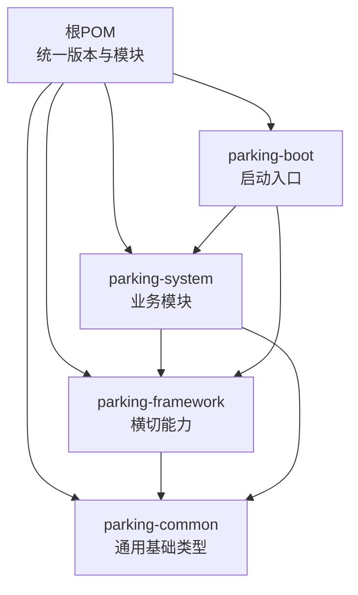
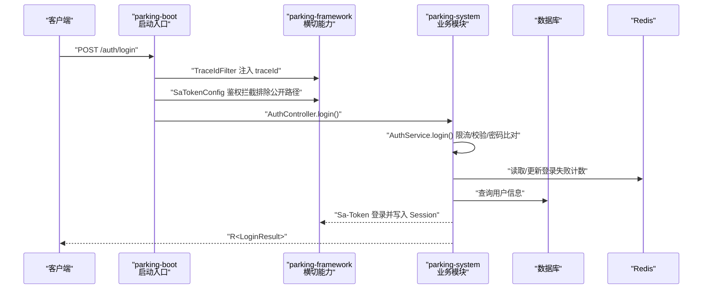
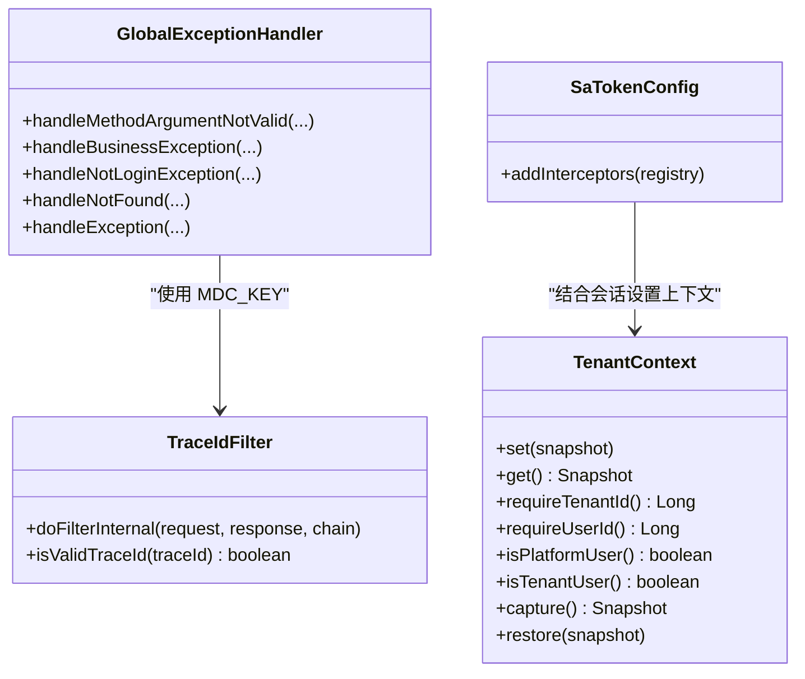
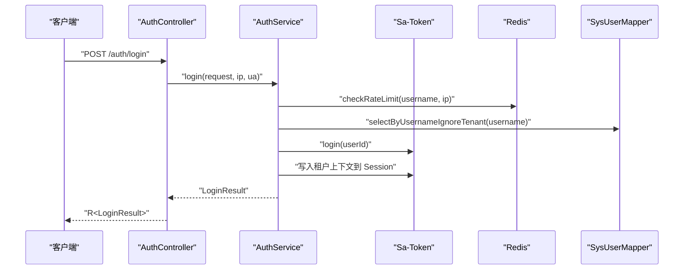
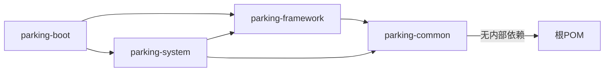

# 模块化架构设计

<cite>
**本文引用的文件**   
- [pom.xml](file://pom.xml)
- [parking-boot/pom.xml](file://parking-boot/pom.xml)
- [parking-system/pom.xml](file://parking-system/pom.xml)
- [parking-framework/pom.xml](file://parking-framework/pom.xml)
- [parking-common/pom.xml](file://parking-common/pom.xml)
- [ParkingApplication.java](file://parking-boot/src/main/java/com/jushan/boot/ParkingApplication.java)
- [package-info.java（framework）](file://parking-framework/src/main/java/com/jushan/framework/package-info.java)
- [package-info.java（common）](file://parking-common/src/main/java/com/jushan/common/package-info.java)
- [SaTokenConfig.java](file://parking-framework/src/main/java/com/jushan/framework/auth/SaTokenConfig.java)
- [GlobalExceptionHandler.java](file://parking-framework/src/main/java/com/jushan/framework/web/GlobalExceptionHandler.java)
- [TraceIdFilter.java](file://parking-framework/src/main/java/com/jushan/framework/web/TraceIdFilter.java)
- [TenantContext.java](file://parking-framework/src/main/java/com/jushan/framework/auth/TenantContext.java)
- [AuthController.java](file://parking-system/src/main/java/com/jushan/system/controller/AuthController.java)
- [AuthService.java](file://parking-system/src/main/java/com/jushan/system/service/AuthService.java)
- [R.java](file://parking-common/src/main/java/com/jushan/common/R.java)
- [CommonErrorCode.java](file://parking-common/src/main/java/com/jushan/common/CommonErrorCode.java)
</cite>

## 目录
1. [引言](#引言)
2. [项目结构](#项目结构)
3. [核心组件](#核心组件)
4. [架构总览](#架构总览)
5. [详细组件分析](#详细组件分析)
6. [依赖关系分析](#依赖关系分析)
7. [性能与构建优化](#性能与构建优化)
8. [故障排查指南](#故障排查指南)
9. [结论](#结论)
10. [附录：规范与最佳实践](#附录规范与最佳实践)

## 引言
本规范面向多模块 Maven 单体应用，定义 parking-common、parking-framework、parking-system、parking-boot 四个模块的职责边界、依赖方向、通信方式与开发约定。目标是在保证可演进性的前提下，形成清晰的横切能力与业务解耦，统一接口契约与错误模型，并提供版本管理、依赖冲突治理与构建优化策略。

## 项目结构
- 根 POM 集中声明 Spring Boot 父工程、Java 21、内部模块列表与第三方依赖版本；通过 dependencyManagement 统一管理内部模块与外部库版本。
- 模块划分与职责
  - parking-common：通用基础类型与错误码，不依赖 Spring 容器，供所有模块共享。
  - parking-framework：平台横切能力（Web 全局异常、TraceId、租户上下文、Sa-Token 集成、Redis、AMQP、WebSocket 等）。
  - parking-system：系统管理与核心业务（认证、权限、设备、计费、租户等），依赖 framework 与 common。
  - parking-boot：应用启动入口、自动装配、健康检查、跨模块组件扫描与运行期依赖聚合。
- 组件扫描范围由启动类统一配置为 com.jushan，确保框架与业务包均被扫描。

图表来源
- [pom.xml:46-52](file://pom.xml#L46-L52)
- [parking-boot/pom.xml:18-27](file://parking-boot/pom.xml#L18-L27)
- [parking-system/pom.xml:17-22](file://parking-system/pom.xml#L17-L22)
- [parking-framework/pom.xml:17-22](file://parking-framework/pom.xml#L17-L22)
- [parking-common/pom.xml:17-23](file://parking-common/pom.xml#L17-L23)

章节来源
- [pom.xml:1-217](file://pom.xml#L1-L217)
- [parking-boot/pom.xml:1-127](file://parking-boot/pom.xml#L1-L127)
- [parking-system/pom.xml:1-63](file://parking-system/pom.xml#L1-L63)
- [parking-framework/pom.xml:1-86](file://parking-framework/pom.xml#L1-L86)
- [parking-common/pom.xml:1-26](file://parking-common/pom.xml#L1-L26)
- [ParkingApplication.java:23-29](file://parking-boot/src/main/java/com/jushan/boot/ParkingApplication.java#L23-L29)

## 核心组件
- 统一响应体 R<T>：所有 Controller 返回统一结构，包含 code、message、data、traceId、errors 等字段，便于前端一致解析与链路追踪。
- 通用错误码 CommonErrorCode：覆盖参数错误、未认证、无权限、资源不存在、方法不支持、内部错误等通用场景。
- 全局异常处理 GlobalExceptionHandler：将校验失败、业务异常、认证授权异常、Spring 内置异常统一转换为 R 响应，并注入 traceId。
- TraceIdFilter：为每个请求生成或复用上游传入的合法 traceId，写入 MDC 与响应头 X-Trace-Id。
- SaTokenConfig：注册 Sa-Token 鉴权拦截器，排除公开路径，会话落 Redis。
- TenantContext：线程级可信租户上下文，提供 requireTenantId/requireUserId 等强约束 API，避免前端传入 tenantId 的可信性问题。

章节来源
- [R.java:31-162](file://parking-common/src/main/java/com/jushan/common/R.java#L31-L162)
- [CommonErrorCode.java:12-62](file://parking-common/src/main/java/com/jushan/common/CommonErrorCode.java#L12-L62)
- [GlobalExceptionHandler.java:44-240](file://parking-framework/src/main/java/com/jushan/framework/web/GlobalExceptionHandler.java#L44-L240)
- [TraceIdFilter.java:27-76](file://parking-framework/src/main/java/com/jushan/framework/web/TraceIdFilter.java#L27-L76)
- [SaTokenConfig.java:33-65](file://parking-framework/src/main/java/com/jushan/framework/auth/SaTokenConfig.java#L33-L65)
- [TenantContext.java:27-257](file://parking-framework/src/main/java/com/jushan/framework/auth/TenantContext.java#L27-L257)

## 架构总览
下图展示一次登录请求在模块间的调用链路与横切能力介入点。

图表来源
- [ParkingApplication.java:23-29](file://parking-boot/src/main/java/com/jushan/boot/ParkingApplication.java#L23-L29)
- [SaTokenConfig.java:39-63](file://parking-framework/src/main/java/com/jushan/framework/auth/SaTokenConfig.java#L39-L63)
- [TraceIdFilter.java:57-74](file://parking-framework/src/main/java/com/jushan/framework/web/TraceIdFilter.java#L57-L74)
- [AuthController.java:40-46](file://parking-system/src/main/java/com/jushan/system/controller/AuthController.java#L40-L46)
- [AuthService.java:91-176](file://parking-system/src/main/java/com/jushan/system/service/AuthService.java#L91-L176)

## 详细组件分析

### 启动与组件扫描（parking-boot）
- 启动类使用 @SpringBootApplication(scanBasePackages = "com.jushan")，统一扫描 framework、common 及后续业务模块。
- 作为运行期聚合层，仅引入必要运行依赖（Actuator、Prometheus、JDBC、Flyway、MySQL 驱动等），并通过 MyBatis-Plus 支持 MapperScan（条件化配置于 MyBatisConfig）。

章节来源
- [ParkingApplication.java:23-29](file://parking-boot/src/main/java/com/jushan/boot/ParkingApplication.java#L23-L29)
- [parking-boot/pom.xml:18-75](file://parking-boot/pom.xml#L18-L75)

### 横切能力（parking-framework）
- Web 层
  - TraceIdFilter：入站校验与生成 traceId，MDC 注入，响应头回写。
  - GlobalExceptionHandler：统一异常到 R，按协议语义映射 HTTP 状态码，禁止泄露堆栈。
- 安全与会话
  - SaTokenConfig：注册 Sa-Token 拦截器，排除公开路径，会话持久化至 Redis。
  - TenantContext：线程级可信上下文，提供 requireTenantId/requireUserId 等强约束 API，区分平台用户与租户用户，支持代理模式快照。
- 其他能力
  - Redis、AMQP、WebSocket 等基础设施集成，供业务按需启用。

图表来源
- [TraceIdFilter.java:27-76](file://parking-framework/src/main/java/com/jushan/framework/web/TraceIdFilter.java#L27-L76)
- [GlobalExceptionHandler.java:44-240](file://parking-framework/src/main/java/com/jushan/framework/web/GlobalExceptionHandler.java#L44-L240)
- [SaTokenConfig.java:33-65](file://parking-framework/src/main/java/com/jushan/framework/auth/SaTokenConfig.java#L33-L65)
- [TenantContext.java:27-257](file://parking-framework/src/main/java/com/jushan/framework/auth/TenantContext.java#L27-L257)

章节来源
- [package-info.java（framework）:1-19](file://parking-framework/src/main/java/com/jushan/framework/package-info.java#L1-L19)
- [parking-framework/pom.xml:17-83](file://parking-framework/pom.xml#L17-L83)

### 业务模块（parking-system）
- 控制器层
  - AuthController：暴露登录、退出、会话、修改密码等接口，统一返回 R。
- 服务层
  - AuthService：实现登录流程（限流、账号状态、密码校验、Sa-Token 登录、租户上下文写入、审计日志记录），并提供会话信息与密码修改。
- 数据访问
  - 基于 MyBatis-Plus 的 Mapper 层（如 SysUserMapper、SysLoginLogMapper）完成数据读写。

图表来源
- [AuthController.java:40-46](file://parking-system/src/main/java/com/jushan/system/controller/AuthController.java#L40-L46)
- [AuthService.java:91-176](file://parking-system/src/main/java/com/jushan/system/service/AuthService.java#L91-L176)

章节来源
- [AuthController.java:1-100](file://parking-system/src/main/java/com/jushan/system/controller/AuthController.java#L1-L100)
- [AuthService.java:1-361](file://parking-system/src/main/java/com/jushan/system/service/AuthService.java#L1-L361)
- [parking-system/pom.xml:17-60](file://parking-system/pom.xml#L17-L60)

### 通用基础（parking-common）
- 统一响应体 R<T>：封装 code、message、data、traceId、errors，提供 ok/fail 工厂方法与 fluent 设置。
- 通用错误码 CommonErrorCode：定义跨模块通用错误码，业务模块应扩展自有 ErrorCode。
- 模块不依赖 Spring 容器，仅依赖 Jackson 注解，保证最小耦合与高复用性。

章节来源
- [R.java:31-162](file://parking-common/src/main/java/com/jushan/common/R.java#L31-L162)
- [CommonErrorCode.java:12-62](file://parking-common/src/main/java/com/jushan/common/CommonErrorCode.java#L12-L62)
- [package-info.java（common）:1-19](file://parking-common/src/main/java/com/jushan/common/package-info.java#L1-L19)
- [parking-common/pom.xml:17-23](file://parking-common/pom.xml#L17-L23)

## 依赖关系分析
- 依赖方向
  - parking-common：无内部依赖，仅依赖 jackson-annotations。
  - parking-framework：依赖 parking-common，提供 Web、AOP、Redis、Sa-Token、AMQP、WebSocket 等横切能力。
  - parking-system：依赖 parking-framework 与 parking-common，承载业务逻辑与数据访问。
  - parking-boot：依赖 parking-framework 与 parking-system，聚合运行期依赖与启动配置。
- 版本管理
  - 根 POM 通过 <dependencyManagement> 集中声明内部模块与第三方依赖版本，子模块引用时不指定版本号，避免冲突。
  - 测试相关依赖（Testcontainers、WireMock）仅在 boot 模块 test scope 中声明，减少生产包体积。

图表来源
- [pom.xml:54-140](file://pom.xml#L54-L140)
- [parking-common/pom.xml:17-23](file://parking-common/pom.xml#L17-L23)
- [parking-framework/pom.xml:17-22](file://parking-framework/pom.xml#L17-L22)
- [parking-system/pom.xml:17-22](file://parking-system/pom.xml#L17-L22)
- [parking-boot/pom.xml:18-27](file://parking-boot/pom.xml#L18-L27)

章节来源
- [pom.xml:24-44](file://pom.xml#L24-L44)
- [pom.xml:54-140](file://pom.xml#L54-L140)
- [parking-boot/pom.xml:77-115](file://parking-boot/pom.xml#L77-L115)

## 性能与构建优化
- 依赖收敛
  - 仅启动模块引入运行时驱动与 Actuator/Prometheus，业务模块仅声明必要能力，避免传递依赖膨胀。
- 编译期优化
  - MapStruct + Lombok 注解处理器在根 POM 统一配置，保证各模块编译一致性。
- 测试环境隔离
  - Testcontainers 与 WireMock 仅在 boot 模块 test scope 中声明，配合 maven-surefire 环境变量注入 Docker 连接，提升集成测试稳定性。
- 构建产物瘦身
  - spring-boot-maven-plugin 排除 lombok，避免打包冗余。

章节来源
- [pom.xml:160-214](file://pom.xml#L160-L214)
- [parking-boot/pom.xml:77-115](file://parking-boot/pom.xml#L77-L115)

## 故障排查指南
- 统一异常与错误码
  - 全局异常处理器将参数校验失败、业务异常、认证授权异常、404/405 等统一转换为 R 响应，并附带 traceId，便于定位问题。
  - 协议级错误码映射到对应 HTTP 状态码，普通业务错误保持 200 + code 非 0。
- 链路追踪
  - TraceIdFilter 负责生成/复用 traceId，写入 MDC 与响应头 X-Trace-Id，日志与前端均可获取。
- 认证与权限
  - Sa-Token 拦截器对非公开路径进行登录态校验；未登录/无权限/角色缺失分别返回 401/403。
- 租户上下文
  - 业务侧必须通过 TenantContext.requireTenantId/requireUserId 获取上下文，避免直接使用前端传入的 tenantId。

章节来源
- [GlobalExceptionHandler.java:44-240](file://parking-framework/src/main/java/com/jushan/framework/web/GlobalExceptionHandler.java#L44-L240)
- [TraceIdFilter.java:27-76](file://parking-framework/src/main/java/com/jushan/framework/web/TraceIdFilter.java#L27-L76)
- [SaTokenConfig.java:39-63](file://parking-framework/src/main/java/com/jushan/framework/auth/SaTokenConfig.java#L39-L63)
- [TenantContext.java:138-178](file://parking-framework/src/main/java/com/jushan/framework/auth/TenantContext.java#L138-L178)

## 结论
本项目采用“通用—框架—业务—启动”四层分层，明确职责边界与依赖方向，通过统一响应体、错误码、全局异常与链路追踪，保障跨模块协作的一致性与可观测性。以根 POM 为中心的版本管理与依赖收敛策略，有效降低冲突风险与构建成本。建议后续新增模块遵循相同分层与约定，逐步增强领域内聚与横向能力复用。

## 附录：规范与最佳实践
- 模块拆分原则
  - 单一职责：common 仅放纯 Java 类型与工具；framework 放横切能力；system 放业务；boot 仅做聚合与启动。
  - 依赖单向：上层依赖下层，禁止反向依赖与循环依赖。
- 包结构与命名
  - 包前缀统一为 com.jushan.{module}，controller/service/mapper/entity/dto/vo 分层清晰。
- 接口定义规范
  - 统一返回 R<T>，错误码优先使用 CommonErrorCode，业务特定错误码在各自模块扩展。
  - 公开接口路径在 SaTokenConfig 中显式排除，避免误拦截。
- 组件扫描与 Bean 注入
  - 启动类统一 scanBasePackages="com.jushan"；构造器注入为主，可选依赖使用 required=false。
- 跨模块调用最佳实践
  - 通过 Service 层暴露能力，避免 Controller 直接跨模块调用；必要时通过 client 层封装远程调用。
- 模块版本与依赖冲突
  - 所有内部模块与第三方依赖版本在根 POM 的 dependencyManagement 中声明，子模块不指定版本。
  - 使用 mvn dependency:tree 定期排查冲突，必要时在引入方显式声明版本或使用 exclusions。
- 构建优化
  - 仅启动模块引入运行时驱动与监控；MapStruct/Lombok 处理器统一配置；test scope 依赖隔离。
- 重构指导
  - 若某模块职责膨胀，优先拆分为新的业务域模块，并将公共能力下沉至 framework 或独立新模块。
  - 将跨模块共享的 DTO/VO 上移至 common 或新建共享契约模块，保持业务模块轻量。