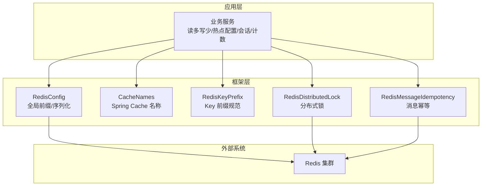
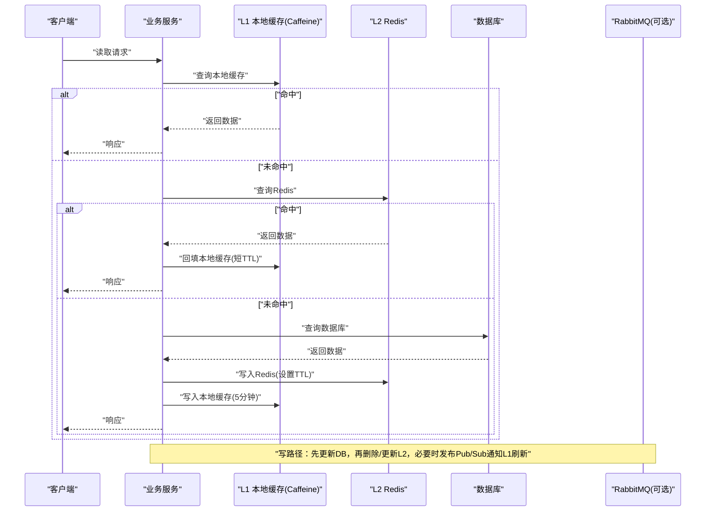
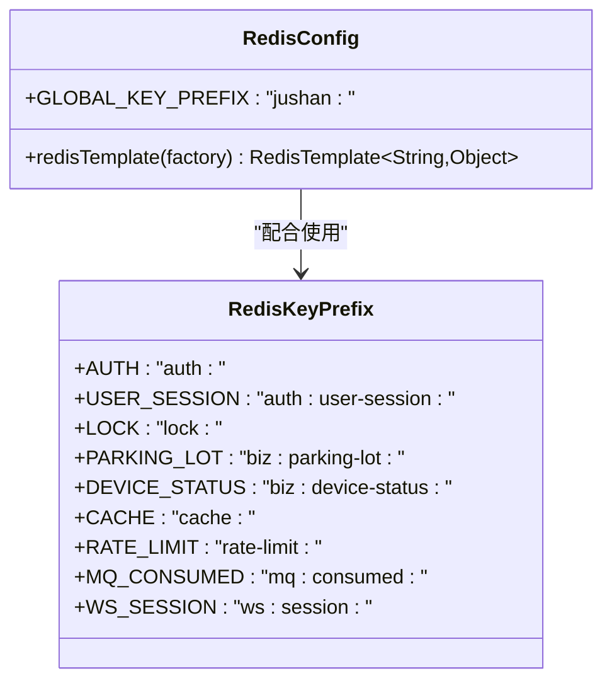
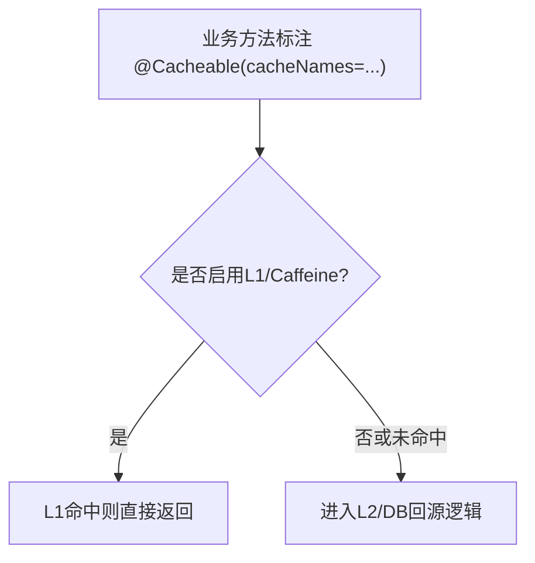
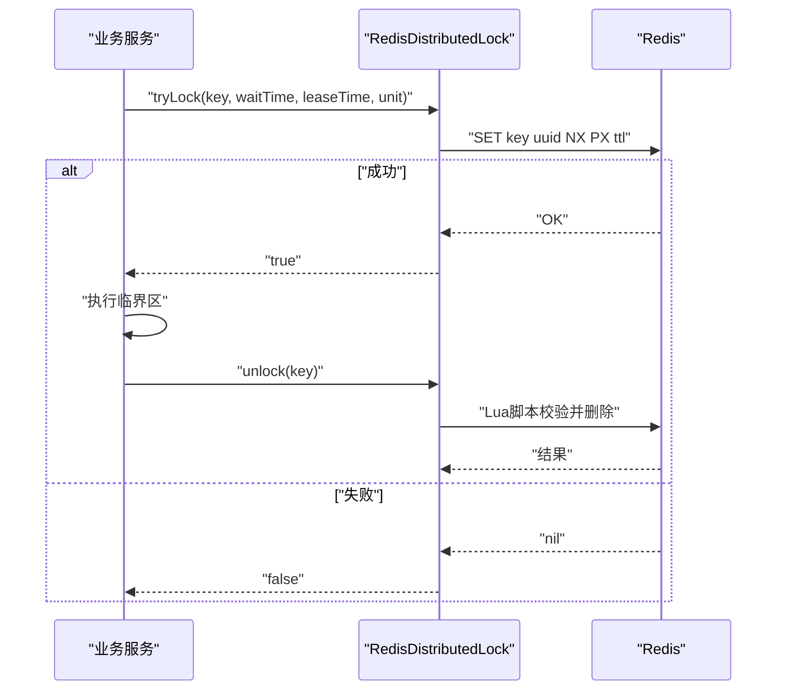
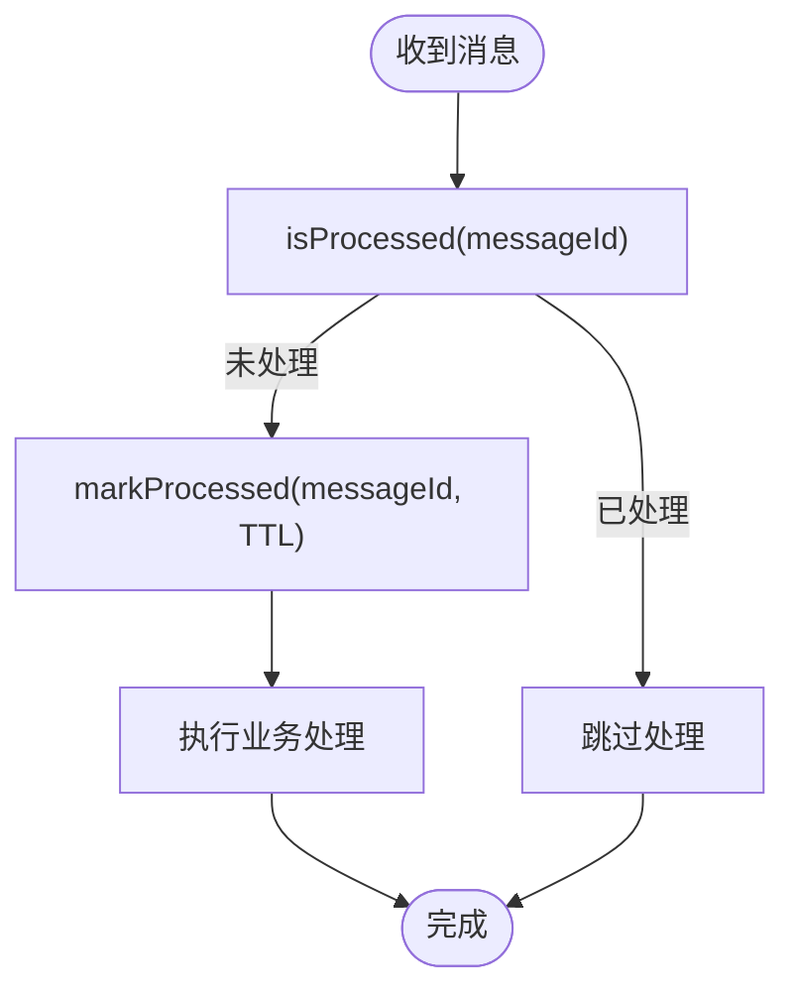
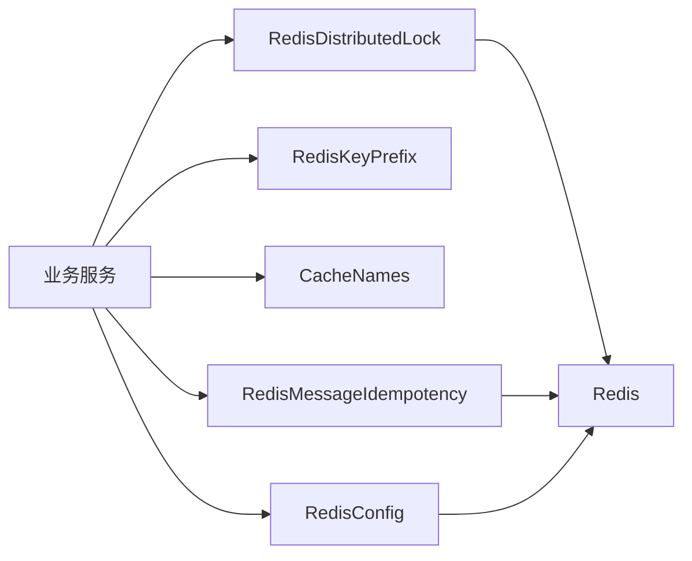

# 缓存架构策略

<cite>
**本文引用的文件**   
- [CLAUDE.md](file://CLAUDE.md)
- [RedisConfig.java](file://parking-framework/src/main/java/com/jushan/framework/redis/RedisConfig.java)
- [CacheNames.java](file://parking-framework/src/main/java/com/jushan/framework/redis/CacheNames.java)
- [RedisKeyPrefix.java](file://parking-framework/src/main/java/com/jushan/framework/redis/RedisKeyPrefix.java)
- [RedisDistributedLock.java](file://parking-framework/src/main/java/com/jushan/framework/lock/RedisDistributedLock.java)
- [DistributedLock.java](file://parking-framework/src/main/java/com/jushan/framework/lock/DistributedLock.java)
- [RedisMessageIdempotency.java](file://parking-framework/src/main/java/com/jushan/framework/mq/RedisMessageIdempotency.java)
- [MqConstants.java](file://parking-framework/src/main/java/com/jushan/framework/mq/MqConstants.java)
- [ReadinessHealthIndicator.java](file://parking-boot/src/main/java/com/jushan/boot/health/ReadinessHealthIndicator.java)
</cite>

## 目录
1. [引言](#引言)
2. [项目结构](#项目结构)
3. [核心组件](#核心组件)
4. [架构总览](#架构总览)
5. [详细组件分析](#详细组件分析)
6. [依赖关系分析](#依赖关系分析)
7. [性能考量](#性能考量)
8. [故障排查指南](#故障排查指南)
9. [结论](#结论)
10. [附录](#附录)

## 引言
本文件面向停车SaaS平台的缓存架构，系统性阐述L1本地缓存（Caffeine）与L2 Redis的分级缓存策略，覆盖热点配置与字典数据、业务对象与会话、分布式锁与实时计数等场景；明确过期策略、刷新机制、Key命名规范以及一致性模式。同时给出缓存穿透、击穿、雪崩的防护方案与性能优化建议，确保在真实生产环境中具备高可用与可观测性。

## 项目结构
本项目采用模块化单体架构，缓存相关基础设施集中在 parking-framework 模块中，包含：
- Redis 通用配置与序列化策略
- Spring Cache 名称常量
- Redis Key 前缀规范
- 基于 Redis 的分布式锁实现
- 消息幂等（基于 Redis）
- 健康检查中对 Redis 连通性的探测

图表来源
- [RedisConfig.java:1-70](file://parking-framework/src/main/java/com/jushan/framework/redis/RedisConfig.java#L1-L70)
- [CacheNames.java:1-40](file://parking-framework/src/main/java/com/jushan/framework/redis/CacheNames.java#L1-L40)
- [RedisKeyPrefix.java:1-67](file://parking-framework/src/main/java/com/jushan/framework/redis/RedisKeyPrefix.java#L1-L67)
- [RedisDistributedLock.java:1-129](file://parking-framework/src/main/java/com/jushan/framework/lock/RedisDistributedLock.java#L1-L129)
- [RedisMessageIdempotency.java:1-90](file://parking-framework/src/main/java/com/jushan/framework/mq/RedisMessageIdempotency.java#L1-L90)

章节来源
- [CLAUDE.md:487-539](file://CLAUDE.md#L487-L539)

## 核心组件
- L1 本地缓存（Caffeine）
  - 适用：热点配置与字典数据
  - 过期：5 分钟
  - 刷新：监听 Redis Pub/Sub 触发刷新
- L2 Redis 缓存
  - 适用：业务对象、会话、锁、实时计数
  - 过期：10-60 分钟（按数据类型与访问热度设定）
  - 一致性：Cache-Aside + 更新失效
- Key 命名规范
  - 统一前缀：`parking:`
  - 组织方式：`tenantId:resourceId`
  - 全局前缀由 RedisTemplate 自动附加（代码中为 `jushan:`），实际业务 Key 需遵循平台约定

章节来源
- [CLAUDE.md:487-539](file://CLAUDE.md#L487-L539)
- [RedisConfig.java:1-70](file://parking-framework/src/main/java/com/jushan/framework/redis/RedisConfig.java#L1-L70)
- [RedisKeyPrefix.java:1-67](file://parking-framework/src/main/java/com/jushan/framework/redis/RedisKeyPrefix.java#L1-L67)
- [CacheNames.java:1-40](file://parking-framework/src/main/java/com/jushan/framework/redis/CacheNames.java#L1-L40)

## 架构总览
下图展示两级缓存与数据库、消息通道之间的交互关系，体现“读路径优先命中 L1/L2，写路径走 Cache-Aside 并失效”的整体流程。

图表来源
- [CLAUDE.md:487-539](file://CLAUDE.md#L487-L539)
- [RedisConfig.java:1-70](file://parking-framework/src/main/java/com/jushan/framework/redis/RedisConfig.java#L1-L70)
- [RedisKeyPrefix.java:1-67](file://parking-framework/src/main/java/com/jushan/framework/redis/RedisKeyPrefix.java#L1-L67)

## 详细组件分析

### 组件一：Redis 基础能力与 Key 前缀
- 全局前缀与序列化
  - 自定义 RedisTemplate，Key 使用 String 序列化，Value 使用 Jackson JSON 序列化
  - 提供全局 Key 前缀常量，便于环境隔离与统一管理
- Key 前缀规范
  - 定义 auth、biz、lock、cache、rate-limit、mq、ws 等域的前缀常量
  - 要求所有 Key 以层级冒号分隔，全小写，按领域聚合

图表来源
- [RedisConfig.java:1-70](file://parking-framework/src/main/java/com/jushan/framework/redis/RedisConfig.java#L1-L70)
- [RedisKeyPrefix.java:1-67](file://parking-framework/src/main/java/com/jushan/framework/redis/RedisKeyPrefix.java#L1-L67)

章节来源
- [RedisConfig.java:1-70](file://parking-framework/src/main/java/com/jushan/framework/redis/RedisConfig.java#L1-L70)
- [RedisKeyPrefix.java:1-67](file://parking-framework/src/main/java/com/jushan/framework/redis/RedisKeyPrefix.java#L1-L67)

### 组件二：Spring Cache 名称与分层定位
- 通过 CacheNames 集中管理缓存区域名，避免不同业务混用同一缓存空间
- 典型用途：停车场信息、设备状态快照、收费规则、用户会话、字典/配置、验证码/限流等

图表来源
- [CacheNames.java:1-40](file://parking-framework/src/main/java/com/jushan/framework/redis/CacheNames.java#L1-L40)

章节来源
- [CacheNames.java:1-40](file://parking-framework/src/main/java/com/jushan/framework/redis/CacheNames.java#L1-L40)

### 组件三：分布式锁（Redis）
- 基于 SET key value NX PX ttl 原子命令实现
- 锁值使用 UUID 保证释放时仅能释放自己持有的锁
- 当 Redis 不可用时优雅降级（tryLock 返回 false）
- 适用于并发敏感场景：车位余量扣减、库存扣减、余额扣减等

图表来源
- [RedisDistributedLock.java:1-129](file://parking-framework/src/main/java/com/jushan/framework/lock/RedisDistributedLock.java#L1-L129)
- [DistributedLock.java:1-52](file://parking-framework/src/main/java/com/jushan/framework/lock/DistributedLock.java#L1-L52)

章节来源
- [RedisDistributedLock.java:1-129](file://parking-framework/src/main/java/com/jushan/framework/lock/RedisDistributedLock.java#L1-L129)
- [DistributedLock.java:1-52](file://parking-framework/src/main/java/com/jushan/framework/lock/DistributedLock.java#L1-L52)

### 组件四：消息消费幂等（Redis）
- 使用 SETNX 原子操作记录已处理消息，Key 格式包含全局前缀与模块标识
- Redis 不可用时降级为“尽量处理”，由数据库唯一键提供最终幂等保障

图表来源
- [RedisMessageIdempotency.java:1-90](file://parking-framework/src/main/java/com/jushan/framework/mq/RedisMessageIdempotency.java#L1-L90)
- [MqConstants.java:1-44](file://parking-framework/src/main/java/com/jushan/framework/mq/MqConstants.java#L1-L44)

章节来源
- [RedisMessageIdempotency.java:1-90](file://parking-framework/src/main/java/com/jushan/framework/mq/RedisMessageIdempotency.java#L1-L90)
- [MqConstants.java:1-44](file://parking-framework/src/main/java/com/jushan/framework/mq/MqConstants.java#L1-L44)

### 组件五：健康检查与 Redis 可用性
- Readiness 探针中包含 Redis 连通性检查，用于服务启动就绪判断
- 结合 ObjectProvider 注入，缺失 Redis 连接工厂时不阻断启动

章节来源
- [ReadinessHealthIndicator.java:39-70](file://parking-boot/src/main/java/com/jushan/boot/health/ReadinessHealthIndicator.java#L39-L70)

## 依赖关系分析
- 组件耦合
  - 业务服务依赖 RedisConfig、RedisKeyPrefix、CacheNames 进行统一的缓存读写与命名
  - 分布式锁与消息幂等均依赖 Redis 基础设施
- 外部依赖
  - Redis 作为 L2 缓存与分布式协调中心
  - RabbitMQ 用于异步任务与事件路由（与缓存刷新联动）

图表来源
- [RedisConfig.java:1-70](file://parking-framework/src/main/java/com/jushan/framework/redis/RedisConfig.java#L1-L70)
- [RedisKeyPrefix.java:1-67](file://parking-framework/src/main/java/com/jushan/framework/redis/RedisKeyPrefix.java#L1-L67)
- [CacheNames.java:1-40](file://parking-framework/src/main/java/com/jushan/framework/redis/CacheNames.java#L1-L40)
- [RedisDistributedLock.java:1-129](file://parking-framework/src/main/java/com/jushan/framework/lock/RedisDistributedLock.java#L1-L129)
- [RedisMessageIdempotency.java:1-90](file://parking-framework/src/main/java/com/jushan/framework/mq/RedisMessageIdempotency.java#L1-L90)

章节来源
- [RedisConfig.java:1-70](file://parking-framework/src/main/java/com/jushan/framework/redis/RedisConfig.java#L1-L70)
- [RedisKeyPrefix.java:1-67](file://parking-framework/src/main/java/com/jushan/framework/redis/RedisKeyPrefix.java#L1-L67)
- [CacheNames.java:1-40](file://parking-framework/src/main/java/com/jushan/framework/redis/CacheNames.java#L1-L40)
- [RedisDistributedLock.java:1-129](file://parking-framework/src/main/java/com/jushan/framework/lock/RedisDistributedLock.java#L1-L129)
- [RedisMessageIdempotency.java:1-90](file://parking-framework/src/main/java/com/jushan/framework/mq/RedisMessageIdempotency.java#L1-L90)

## 性能考量
- 命中率优化
  - L1 本地缓存针对热点配置与字典数据，5 分钟过期，降低跨进程/跨实例网络开销
  - L2 Redis 对业务对象与会话设置 10-60 分钟不等 TTL，依据访问热度与一致性要求动态调整
- 一致性模式
  - 读路径：L1 → L2 → DB
  - 写路径：DB 更新后删除/更新 L2，并通过 Pub/Sub 通知各节点刷新 L1
- 容量与内存
  - 合理设置 L1 最大条目数与淘汰策略，避免 OOM
  - L2 使用 Hash/String/List/Set 等合适数据结构，减少序列化体积
- 预热与冷启动
  - 关键字典与配置在服务启动时主动预热至 L1/L2，缩短冷启动抖动
- 监控与告警
  - 统计 L1/L2 命中率、延迟、错误率；异常阈值触发告警与自动扩容

[本节为通用指导，无需源码引用]

## 故障排查指南
- Redis 不可用时的行为
  - 分布式锁 tryLock 返回 false，业务侧应做快速失败或降级
  - 消息幂等标记写入失败时记录日志但不阻断主流程，依赖数据库唯一键兜底
- 健康检查
  - Readiness 探针会检测 Redis 连通性，若失败将影响服务上线判定
- 常见问题定位
  - Key 前缀不一致导致缓存未命中或脏读
  - 过期时间过短导致频繁回源，过长导致一致性风险
  - 未使用分布式锁导致的并发写冲突

章节来源
- [RedisDistributedLock.java:1-129](file://parking-framework/src/main/java/com/jushan/framework/lock/RedisDistributedLock.java#L1-L129)
- [RedisMessageIdempotency.java:1-90](file://parking-framework/src/main/java/com/jushan/framework/mq/RedisMessageIdempotency.java#L1-L90)
- [ReadinessHealthIndicator.java:39-70](file://parking-boot/src/main/java/com/jushan/boot/health/ReadinessHealthIndicator.java#L39-L70)

## 结论
本缓存架构通过 L1 本地缓存与 L2 Redis 的协同，兼顾了低延迟与可扩展性。结合统一的 Key 命名规范、明确的过期策略与 Cache-Aside + 更新失效的一致性模式，能够在停车SaaS的高并发场景中稳定运行。配套的健康检查、幂等与分布式锁能力进一步提升了系统的韧性与可维护性。

[本节为总结性内容，无需源码引用]

## 附录

### 缓存策略速查表
- L1 本地缓存（Caffeine）
  - 适用：热点配置、字典数据
  - 过期：5 分钟
  - 刷新：Redis Pub/Sub 驱动
- L2 Redis
  - 适用：业务对象、会话、锁、实时计数
  - 过期：10-60 分钟（按类型与热度）
  - 一致性：Cache-Aside + 更新失效
- Key 命名规范
  - 统一前缀：`parking:`
  - 组织方式：`tenantId:resourceId`
  - 全局前缀由 RedisTemplate 自动附加（代码中为 `jushan:`）

章节来源
- [CLAUDE.md:487-539](file://CLAUDE.md#L487-L539)
- [RedisConfig.java:1-70](file://parking-framework/src/main/java/com/jushan/framework/redis/RedisConfig.java#L1-L70)
- [RedisKeyPrefix.java:1-67](file://parking-framework/src/main/java/com/jushan/framework/redis/RedisKeyPrefix.java#L1-L67)

### 缓存穿透、击穿、雪崩防护方案
- 穿透防护
  - 空值缓存：对不存在的数据写入短 TTL 的空值，防止恶意请求直达 DB
  - 布隆过滤器：在 L1/L2 前置过滤非法 Key
- 击穿防护
  - 互斥重建：对热点 Key 加分布式锁，保证只有一个线程回源重建
  - 逻辑过期：为热点数据设置逻辑过期时间，后台异步刷新
- 雪崩防护
  - 随机化 TTL：在基础 TTL 上叠加随机抖动，避免批量过期
  - 多级缓存：L1 与 L2 共同承担流量峰值
  - 限流熔断：对热点接口实施限流与熔断，保护后端资源

[本节为通用指导，无需源码引用]