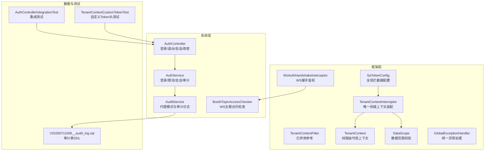
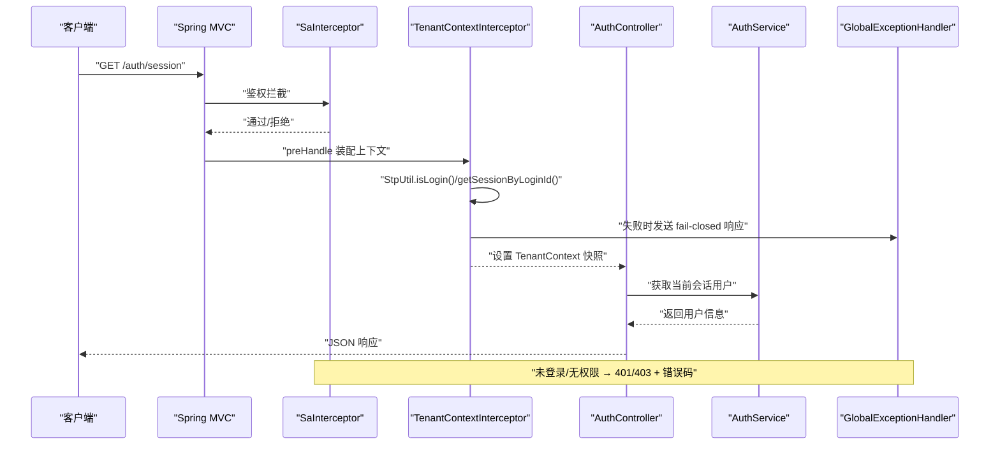
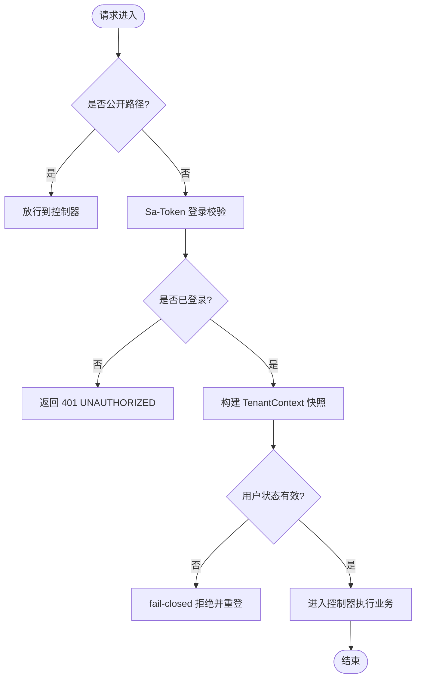
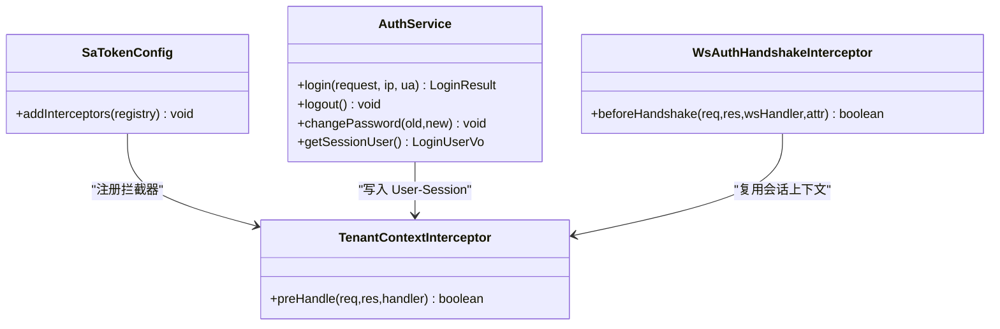
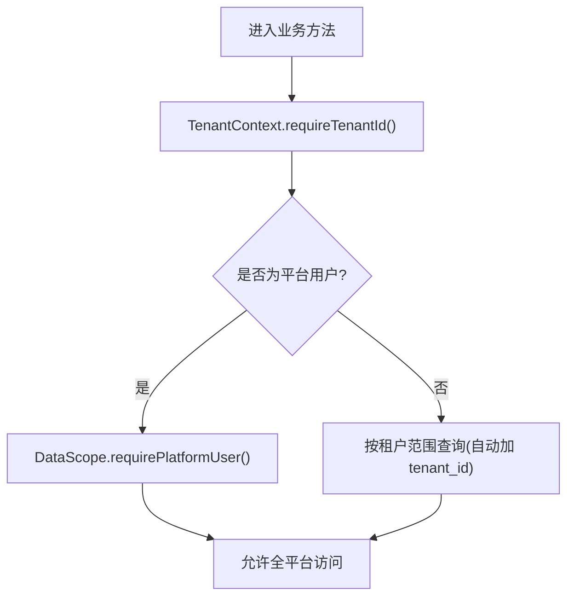
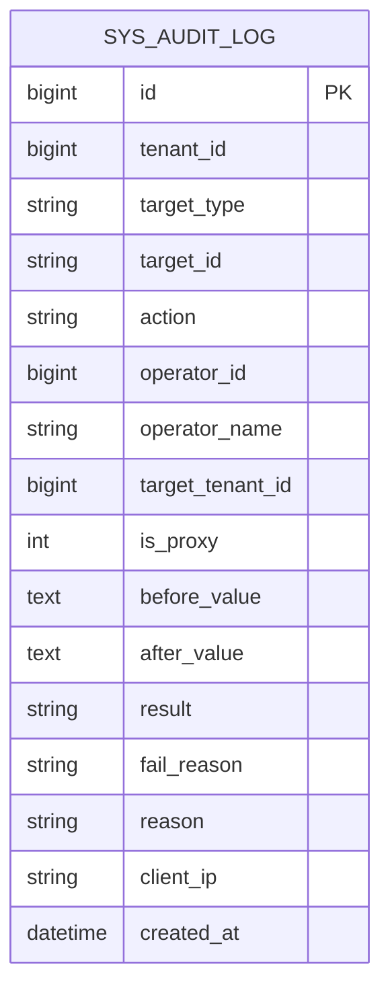
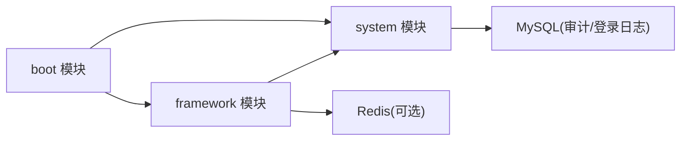

# 安全事件排查

<cite>
**本文引用的文件**   
- [SaTokenConfig.java](file://parking-framework/src/main/java/com/jushan/framework/auth/SaTokenConfig.java)
- [TenantContextInterceptor.java](file://parking-framework/src/main/java/com/jushan/framework/auth/TenantContextInterceptor.java)
- [TenantContextFilter.java](file://parking-framework/src/main/java/com/jushan/framework/auth/TenantContextFilter.java)
- [TenantContext.java](file://parking-framework/src/main/java/com/jushan/framework/auth/TenantContext.java)
- [DataScope.java](file://parking-framework/src/main/java/com/jushan/framework/auth/DataScope.java)
- [GlobalExceptionHandler.java](file://parking-framework/src/main/java/com/jushan/framework/web/GlobalExceptionHandler.java)
- [AuthController.java](file://parking-system/src/main/java/com/jushan/system/controller/AuthController.java)
- [AuthService.java](file://parking-system/src/main/java/com/jushan/system/service/AuthService.java)
- [AuditService.java](file://parking-system/src/main/java/com/jushan/system/service/AuditService.java)
- [V20260711006__audit_log.sql](file://parking-boot/src/main/resources/db/migration/V20260711006__audit_log.sql)
- [WsAuthHandshakeInterceptor.java](file://parking-framework/src/main/java/com/jushan/framework/ws/WsAuthHandshakeInterceptor.java)
- [BoothTopicAccessChecker.java](file://parking-system/src/main/java/com/jushan/system/ws/BoothTopicAccessChecker.java)
- [AuthControllerIntegrationTest.java](file://parking-boot/src/test/java/com/jushan/boot/controller/AuthControllerIntegrationTest.java)
- [TenantContextCustomTokenTest.java](file://parking-boot/src/test/java/com/jushan/boot/controller/TenantContextCustomTokenTest.java)
</cite>

## 目录
1. [引言](#引言)
2. [项目结构](#项目结构)
3. [核心组件](#核心组件)
4. [架构总览](#架构总览)
5. [详细组件分析](#详细组件分析)
6. [依赖关系分析](#依赖关系分析)
7. [性能与可用性考量](#性能与可用性考量)
8. [故障排查指南](#故障排查指南)
9. [应急响应流程](#应急响应流程)
10. [结论](#结论)

## 引言
本指南聚焦于认证授权异常、租户隔离与安全审计日志的排查方法，覆盖 Token 失效、权限不足、租户隔离异常、分布式会话管理（含 WebSocket）以及安全漏洞扫描与修复建议。文档以代码实现为依据，提供可操作的定位步骤、关键断点与验证用例路径，帮助快速定位并恢复服务。

## 项目结构
本项目采用多模块 Maven 工程，认证鉴权与上下文装配位于框架层，业务认证逻辑位于系统层，数据库迁移与测试用例位于启动模块。

图表来源
- [SaTokenConfig.java:38-63](file://parking-framework/src/main/java/com/jushan/framework/auth/SaTokenConfig.java#L38-L63)
- [TenantContextInterceptor.java:64-126](file://parking-framework/src/main/java/com/jushan/framework/auth/TenantContextInterceptor.java#L64-L126)
- [TenantContextFilter.java:37-121](file://parking-framework/src/main/java/com/jushan/framework/auth/TenantContextFilter.java#L37-L121)
- [TenantContext.java:27-90](file://parking-framework/src/main/java/com/jushan/framework/auth/TenantContext.java#L27-L90)
- [DataScope.java:158-179](file://parking-framework/src/main/java/com/jushan/framework/auth/DataScope.java#L158-L179)
- [GlobalExceptionHandler.java:149-191](file://parking-framework/src/main/java/com/jushan/framework/web/GlobalExceptionHandler.java#L149-L191)
- [AuthController.java:40-80](file://parking-system/src/main/java/com/jushan/system/controller/AuthController.java#L40-L80)
- [AuthService.java:91-176](file://parking-system/src/main/java/com/jushan/system/service/AuthService.java#L91-L176)
- [AuditService.java:85-141](file://parking-system/src/main/java/com/jushan/system/service/AuditService.java#L85-L141)
- [V20260711006__audit_log.sql:24-36](file://parking-boot/src/main/resources/db/migration/V20260711006__audit_log.sql#L24-L36)
- [WsAuthHandshakeInterceptor.java:85-114](file://parking-framework/src/main/java/com/jushan/framework/ws/WsAuthHandshakeInterceptor.java#L85-L114)
- [BoothTopicAccessChecker.java:106-128](file://parking-system/src/main/java/com/jushan/system/ws/BoothTopicAccessChecker.java#L106-L128)
- [AuthControllerIntegrationTest.java:271-294](file://parking-boot/src/test/java/com/jushan/boot/controller/AuthControllerIntegrationTest.java#L271-L294)
- [TenantContextCustomTokenTest.java:138-152](file://parking-boot/src/test/java/com/jushan/boot/controller/TenantContextCustomTokenTest.java#L138-L152)

章节来源
- [SaTokenConfig.java:38-63](file://parking-framework/src/main/java/com/jushan/framework/auth/SaTokenConfig.java#L38-L63)
- [TenantContextInterceptor.java:64-126](file://parking-framework/src/main/java/com/jushan/framework/auth/TenantContextInterceptor.java#L64-L126)
- [TenantContextFilter.java:37-121](file://parking-framework/src/main/java/com/jushan/framework/auth/TenantContextFilter.java#L37-L121)
- [TenantContext.java:27-90](file://parking-framework/src/main/java/com/jushan/framework/auth/TenantContext.java#L27-L90)
- [DataScope.java:158-179](file://parking-framework/src/main/java/com/jushan/framework/auth/DataScope.java#L158-L179)
- [GlobalExceptionHandler.java:149-191](file://parking-framework/src/main/java/com/jushan/framework/web/GlobalExceptionHandler.java#L149-L191)
- [AuthController.java:40-80](file://parking-system/src/main/java/com/jushan/system/controller/AuthController.java#L40-L80)
- [AuthService.java:91-176](file://parking-system/src/main/java/com/jushan/system/service/AuthService.java#L91-L176)
- [AuditService.java:85-141](file://parking-system/src/main/java/com/jushan/system/service/AuditService.java#L85-L141)
- [V20260711006__audit_log.sql:24-36](file://parking-boot/src/main/resources/db/migration/V20260711006__audit_log.sql#L24-L36)
- [WsAuthHandshakeInterceptor.java:85-114](file://parking-framework/src/main/java/com/jushan/framework/ws/WsAuthHandshakeInterceptor.java#L85-L114)
- [BoothTopicAccessChecker.java:106-128](file://parking-system/src/main/java/com/jushan/system/ws/BoothTopicAccessChecker.java#L106-L128)
- [AuthControllerIntegrationTest.java:271-294](file://parking-boot/src/test/java/com/jushan/boot/controller/AuthControllerIntegrationTest.java#L271-L294)
- [TenantContextCustomTokenTest.java:138-152](file://parking-boot/src/test/java/com/jushan/boot/controller/TenantContextCustomTokenTest.java#L138-L152)

## 核心组件
- 认证入口与鉴权拦截：Sa-Token 全局拦截器负责登录态校验；登录接口在白名单中返回 401 而非重定向。
- 上下文装配：TenantContextInterceptor 是唯一权威的上下文装配点，从 Sa-Token 会话读取用户类型、租户 ID、角色，并在进入 Controller 前进行状态校验。
- 可信上下文：TenantContext 提供线程级快照与强制推导 API，确保所有业务操作基于可信上下文。
- 数据范围与越权防护：DataScope 提供平台用户、租户用户、代理模式的严格判定与校验。
- 统一异常处理：将未登录、无权限等异常映射为明确的 HTTP 状态码与错误码。
- 认证服务：登录、限流、会话写入、密码修改与会话失效策略。
- 审计服务：代理模式开启/关闭与高风险操作审计，支持 fail-close 保障审计完整性。
- WebSocket 鉴权：握手阶段从 Sa-Token 会话提取租户上下文，供后续消息通道使用。

章节来源
- [SaTokenConfig.java:38-63](file://parking-framework/src/main/java/com/jushan/framework/auth/SaTokenConfig.java#L38-L63)
- [TenantContextInterceptor.java:64-126](file://parking-framework/src/main/java/com/jushan/framework/auth/TenantContextInterceptor.java#L64-L126)
- [TenantContext.java:27-90](file://parking-framework/src/main/java/com/jushan/framework/auth/TenantContext.java#L27-L90)
- [DataScope.java:158-179](file://parking-framework/src/main/java/com/jushan/framework/auth/DataScope.java#L158-L179)
- [GlobalExceptionHandler.java:149-191](file://parking-framework/src/main/java/com/jushan/framework/web/GlobalExceptionHandler.java#L149-L191)
- [AuthController.java:40-80](file://parking-system/src/main/java/com/jushan/system/controller/AuthController.java#L40-L80)
- [AuthService.java:91-176](file://parking-system/src/main/java/com/jushan/system/service/AuthService.java#L91-L176)
- [AuditService.java:85-141](file://parking-system/src/main/java/com/jushan/system/service/AuditService.java#L85-L141)
- [WsAuthHandshakeInterceptor.java:85-114](file://parking-framework/src/main/java/com/jushan/framework/ws/WsAuthHandshakeInterceptor.java#L85-L114)

## 架构总览
下图展示一次受保护请求的完整调用链与上下文装配过程，包括鉴权、上下文填充、数据范围校验与异常处理。

图表来源
- [SaTokenConfig.java:38-63](file://parking-framework/src/main/java/com/jushan/framework/auth/SaTokenConfig.java#L38-L63)
- [TenantContextInterceptor.java:64-126](file://parking-framework/src/main/java/com/jushan/framework/auth/TenantContextInterceptor.java#L64-L126)
- [AuthController.java:64-68](file://parking-system/src/main/java/com/jushan/system/controller/AuthController.java#L64-L68)
- [AuthService.java:235-260](file://parking-system/src/main/java/com/jushan/system/service/AuthService.java#L235-L260)
- [GlobalExceptionHandler.java:149-191](file://parking-framework/src/main/java/com/jushan/framework/web/GlobalExceptionHandler.java#L149-L191)

## 详细组件分析

### 认证与授权链路
- 登录接口白名单：登录、注册、小程序登录等公开路径不触发鉴权拦截，但业务层在未登录时返回 401。
- 鉴权拦截：Sa-Token 全局拦截器对所有非公开路径执行 checkLogin()。
- 上下文装配：TenantContextInterceptor 在 preHandle 中从 Sa-Token 会话读取 tenantId、userType、roles，并进行用户状态校验与 userType 白名单校验。
- 异常映射：未登录映射为 401，无权限映射为 403，其他业务异常按协议码映射。

图表来源
- [SaTokenConfig.java:38-63](file://parking-framework/src/main/java/com/jushan/framework/auth/SaTokenConfig.java#L38-L63)
- [TenantContextInterceptor.java:64-126](file://parking-framework/src/main/java/com/jushan/framework/auth/TenantContextInterceptor.java#L64-L126)
- [GlobalExceptionHandler.java:149-191](file://parking-framework/src/main/java/com/jushan/framework/web/GlobalExceptionHandler.java#L149-L191)

章节来源
- [SaTokenConfig.java:38-63](file://parking-framework/src/main/java/com/jushan/framework/auth/SaTokenConfig.java#L38-L63)
- [TenantContextInterceptor.java:64-126](file://parking-framework/src/main/java/com/jushan/framework/auth/TenantContextInterceptor.java#L64-L126)
- [GlobalExceptionHandler.java:149-191](file://parking-framework/src/main/java/com/jushan/framework/web/GlobalExceptionHandler.java#L149-L191)
- [AuthControllerIntegrationTest.java:271-294](file://parking-boot/src/test/java/com/jushan/boot/controller/AuthControllerIntegrationTest.java#L271-L294)

### 会话管理与分布式会话
- 会话存储：Sa-Token 默认持久化至 Redis，生产环境需保证 Redis 可用以避免会话丢失。
- 会话生命周期：登录成功写入 User-Session（tenantId、userType、roles），退出或改密后注销会话使旧 Token 失效。
- 自定义 Token 头：测试覆盖了自定义 Token 头的伪造场景，应确保 token-name 配置一致且仅信任合法来源。
- WebSocket 握手：握手阶段从 Sa-Token 会话提取租户上下文，供后续消息通道进行数据范围校验。

图表来源
- [AuthService.java:91-176](file://parking-system/src/main/java/com/jushan/system/service/AuthService.java#L91-L176)
- [SaTokenConfig.java:38-63](file://parking-framework/src/main/java/com/jushan/framework/auth/SaTokenConfig.java#L38-L63)
- [TenantContextInterceptor.java:64-126](file://parking-framework/src/main/java/com/jushan/framework/auth/TenantContextInterceptor.java#L64-L126)
- [WsAuthHandshakeInterceptor.java:85-114](file://parking-framework/src/main/java/com/jushan/framework/ws/WsAuthHandshakeInterceptor.java#L85-L114)

章节来源
- [AuthService.java:91-176](file://parking-system/src/main/java/com/jushan/system/service/AuthService.java#L91-L176)
- [TenantContextInterceptor.java:64-126](file://parking-framework/src/main/java/com/jushan/framework/auth/TenantContextInterceptor.java#L64-L126)
- [WsAuthHandshakeInterceptor.java:85-114](file://parking-framework/src/main/java/com/jushan/framework/ws/WsAuthHandshakeInterceptor.java#L85-L114)
- [TenantContextCustomTokenTest.java:138-152](file://parking-boot/src/test/java/com/jushan/boot/controller/TenantContextCustomTokenTest.java#L138-L152)

### 租户隔离与数据范围
- 可信上下文：所有业务必须通过 TenantContext 获取租户 ID，禁止信任前端传入的 tenantId。
- 平台用户判定：isPlatformUser 要求非代理、无租户绑定且 userTyoe 明确为平台身份。
- 代理模式：代理模式下数据范围严格限定在目标租户，不允许跨租户访问。
- 数据范围校验：DataScope.requirePlatformUser 等工具方法用于强约束。

图表来源
- [TenantContext.java:138-151](file://parking-framework/src/main/java/com/jushan/framework/auth/TenantContext.java#L138-L151)
- [DataScope.java:158-179](file://parking-framework/src/main/java/com/jushan/framework/auth/DataScope.java#L158-L179)

章节来源
- [TenantContext.java:27-90](file://parking-framework/src/main/java/com/jushan/framework/auth/TenantContext.java#L27-L90)
- [DataScope.java:158-179](file://parking-framework/src/main/java/com/jushan/framework/auth/DataScope.java#L158-L179)

### 安全审计日志
- 审计表结构：包含操作人、目标租户、操作类型、结果、失败原因、客户端 IP 等字段，并提供常用索引。
- 代理模式审计：proxy_start/proxy_stop 采用 fail-close，审计写入失败则拒绝操作。
- 通用审计：writeAuditLog 自动填充操作人与代理状态，失败不影响主业务但记录 ERROR。
- 查询能力：支持分页与多维度筛选，平台用户可查看全平台日志，租户用户仅限本租户。

图表来源
- [V20260711006__audit_log.sql:24-36](file://parking-boot/src/main/resources/db/migration/V20260711006__audit_log.sql#L24-L36)
- [AuditService.java:219-305](file://parking-system/src/main/java/com/jushan/system/service/AuditService.java#L219-L305)

章节来源
- [AuditService.java:85-141](file://parking-system/src/main/java/com/jushan/system/service/AuditService.java#L85-L141)
- [AuditService.java:219-305](file://parking-system/src/main/java/com/jushan/system/service/AuditService.java#L219-L305)
- [V20260711006__audit_log.sql:24-36](file://parking-boot/src/main/resources/db/migration/V20260711006__audit_log.sql#L24-L36)

## 依赖关系分析
- 模块耦合：框架层提供认证、上下文、异常处理与 WS 握手；系统层实现认证与审计；启动模块提供迁移与测试。
- 外部依赖：Redis 用于会话与限流，不可用时降级但不阻断主流程。
- 潜在风险：Filter 与 Interceptor 并存的历史残留（Filter 已弃用），需确保仅使用 Interceptor 作为权威装配点。

图表来源
- [SaTokenConfig.java:38-63](file://parking-framework/src/main/java/com/jushan/framework/auth/SaTokenConfig.java#L38-L63)
- [TenantContextFilter.java:37-121](file://parking-framework/src/main/java/com/jushan/framework/auth/TenantContextFilter.java#L37-L121)
- [AuthService.java:269-313](file://parking-system/src/main/java/com/jushan/system/service/AuthService.java#L269-L313)
- [V20260711006__audit_log.sql:24-36](file://parking-boot/src/main/resources/db/migration/V20260711006__audit_log.sql#L24-L36)

章节来源
- [SaTokenConfig.java:38-63](file://parking-framework/src/main/java/com/jushan/framework/auth/SaTokenConfig.java#L38-L63)
- [TenantContextFilter.java:37-121](file://parking-framework/src/main/java/com/jushan/framework/auth/TenantContextFilter.java#L37-L121)
- [AuthService.java:269-313](file://parking-system/src/main/java/com/jushan/system/service/AuthService.java#L269-L313)
- [V20260711006__audit_log.sql:24-36](file://parking-boot/src/main/resources/db/migration/V20260711006__audit_log.sql#L24-L36)

## 性能与可用性考量
- Redis 可用性：生产环境需确保 Redis 稳定，避免会话丢失与限流失效。
- 审计写入：代理操作审计采用 fail-close，其他审计写入失败不阻塞主业务，但需监控 ERROR 日志。
- 登录限流：Redis 不可用时自动降级，不影响登录主流程，但会失去限流保护。

[本节为通用指导，无需源码引用]

## 故障排查指南

### 认证授权异常排查
- Token 失效
  - 现象：访问受保护接口返回 401。
  - 定位要点：
    - 检查 Sa-Token 全局拦截器是否命中，登录接口是否在白名单。
    - 确认 Redis 可用，否则可能回退内存导致会话不一致。
    - 查看全局异常处理器对 NotLoginException 的处理。
  - 验证用例：
    - 伪造 Token 返回 401 的集成测试。
    - 自定义 Token 头伪造返回 401 的测试。
  - 相关路径
    - [SaTokenConfig.java:38-63](file://parking-framework/src/main/java/com/jushan/framework/auth/SaTokenConfig.java#L38-L63)
    - [GlobalExceptionHandler.java:156-163](file://parking-framework/src/main/java/com/jushan/framework/web/GlobalExceptionHandler.java#L156-L163)
    - [AuthControllerIntegrationTest.java:271-294](file://parking-boot/src/test/java/com/jushan/boot/controller/AuthControllerIntegrationTest.java#L271-L294)
    - [TenantContextCustomTokenTest.java:138-152](file://parking-boot/src/test/java/com/jushan/boot/controller/TenantContextCustomTokenTest.java#L138-L152)

- 权限不足
  - 现象：返回 403。
  - 定位要点：
    - 检查 NotPermissionException/NotRoleException 的统一处理。
    - 确认 DataScope 的平台用户判定与角色匹配是否正确。
  - 相关路径
    - [GlobalExceptionHandler.java:170-191](file://parking-framework/src/main/java/com/jushan/framework/web/GlobalExceptionHandler.java#L170-L191)
    - [DataScope.java:158-179](file://parking-framework/src/main/java/com/jushan/framework/auth/DataScope.java#L158-L179)

- 租户隔离异常
  - 现象：跨租户访问或上下文缺失。
  - 定位要点：
    - 确认 TenantContextInterceptor 已成功装配上下文。
    - 检查 requireTenantId 与 isPlatformUser 的使用位置。
    - 注意 Filter 已弃用，避免误用。
  - 相关路径
    - [TenantContextInterceptor.java:64-126](file://parking-framework/src/main/java/com/jushan/framework/auth/TenantContextInterceptor.java#L64-L126)
    - [TenantContext.java:138-151](file://parking-framework/src/main/java/com/jushan/framework/auth/TenantContext.java#L138-L151)
    - [TenantContextFilter.java:37-121](file://parking-framework/src/main/java/com/jushan/framework/auth/TenantContextFilter.java#L37-L121)

### 安全审计日志分析方法
- 登录异常检测
  - 关注 SysLoginLog 的 FAIL_* 结果与失败原因，结合 IP、UA 进行聚合分析。
  - 关联登录限流计数 Key 与 Redis 状态。
  - 相关路径
    - [AuthService.java:317-333](file://parking-system/src/main/java/com/jushan/system/service/AuthService.java#L317-L333)

- 敏感操作追踪
  - 通过 AuditService.writeAuditLog 记录的 action、operatorName、targetTenantId、result 进行追踪。
  - 代理操作需关注 proxy_start/proxy_stop 的审计与 fail-close 行为。
  - 相关路径
    - [AuditService.java:219-305](file://parking-system/src/main/java/com/jushan/system/service/AuditService.java#L219-L305)
    - [V20260711006__audit_log.sql:24-36](file://parking-boot/src/main/resources/db/migration/V20260711006__audit_log.sql#L24-L36)

- 越权访问识别
  - 对比 DataScope 判定与业务实际访问的数据范围，核查是否出现跨租户访问。
  - 关注平台用户判定与代理模式下的数据范围限制。
  - 相关路径
    - [DataScope.java:158-179](file://parking-framework/src/main/java/com/jushan/framework/auth/DataScope.java#L158-L179)
    - [TenantContext.java:67-89](file://parking-framework/src/main/java/com/jushan/framework/auth/TenantContext.java#L67-L89)

### 分布式会话管理安全问题排查
- 会话劫持防护
  - 检查 Token 来源与 token-name 配置一致性，避免自定义头被误用。
  - 确认会话在 Redis 中的持久化与过期策略。
  - 相关路径
    - [SaTokenConfig.java:38-63](file://parking-framework/src/main/java/com/jushan/framework/auth/SaTokenConfig.java#L38-L63)
    - [TenantContextCustomTokenTest.java:138-152](file://parking-boot/src/test/java/com/jushan/boot/controller/TenantContextCustomTokenTest.java#L138-L152)

- CSRF 攻击防范
  - 当前为前后端分离架构，主要依赖 Token 校验；如需增强，可在网关层增加同源策略与 SameSite Cookie 策略。
  - 此部分为通用建议，不涉及具体源码。

- XSS 漏洞检测
  - 前端输出需对用户输入进行转义；后端返回数据应避免注入脚本片段。
  - 此部分为通用建议，不涉及具体源码。

- WebSocket 会话上下文
  - 握手阶段从 Sa-Token 会话提取租户上下文，若会话无效或上下文缺失，连接将被拒绝或后续通道校验失败。
  - 相关路径
    - [WsAuthHandshakeInterceptor.java:85-114](file://parking-framework/src/main/java/com/jushan/framework/ws/WsAuthHandshakeInterceptor.java#L85-L114)
    - [BoothTopicAccessChecker.java:106-128](file://parking-system/src/main/java/com/jushan/system/ws/BoothTopicAccessChecker.java#L106-L128)

### 安全漏洞扫描工具使用与修复建议
- 静态扫描（SAST）
  - 推荐工具：SonarQube、Checkmarx、Fortify。
  - 关注点：SQL 注入、硬编码凭据、不安全反射、敏感信息泄露。
  - 修复建议：参数化查询、最小权限原则、脱敏输出。

- 动态扫描（DAST）
  - 推荐工具：OWASP ZAP、Burp Suite。
  - 关注点：认证绕过、越权访问、XSS、CSRF。
  - 修复建议：完善鉴权拦截、输入校验、输出编码。

- 依赖漏洞扫描
  - 推荐工具：Dependabot、Snyk、Trivy。
  - 关注点：第三方库已知漏洞。
  - 修复建议：及时升级依赖版本，锁定版本基线。

[本节为通用指导，无需源码引用]

## 应急响应流程
- 发现与评估
  - 通过审计日志与登录日志识别异常峰值与可疑账号/IP。
  - 评估影响范围（单租户/全平台）、风险等级与业务影响。

- 遏制与隔离
  - 临时封禁可疑 IP 或禁用账号。
  - 针对代理模式，立即停止代操作并清理 Token-Session 中的代理状态。
  - 如 Redis 异常，优先恢复会话存储，避免大规模会话丢失。

- 根因分析与取证
  - 结合 GlobalExceptionHandler 日志与审计日志，还原攻击路径。
  - 核对 Sa-Token 配置与拦截器白名单，确认是否存在配置漂移。

- 修复与加固
  - 修复鉴权与数据范围问题，补充单元测试与集成测试。
  - 强化审计 fail-close 策略，确保关键操作可审计。

- 恢复与复盘
  - 逐步放开限制，观察指标与日志。
  - 输出复盘报告，更新安全规范与最佳实践。

[本节为通用流程，无需源码引用]

## 结论
本指南围绕认证授权、租户隔离与审计日志三大安全域，提供了从架构到代码级的排查方法与应急流程。通过严格遵循可信上下文、统一异常处理与审计 fail-close 策略，可有效降低越权与审计缺失风险。建议在持续集成中引入安全扫描与回归测试，形成闭环的安全治理体系。