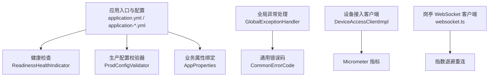
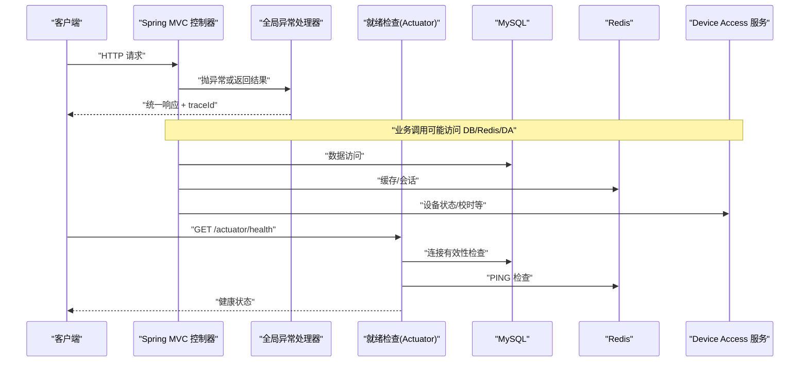
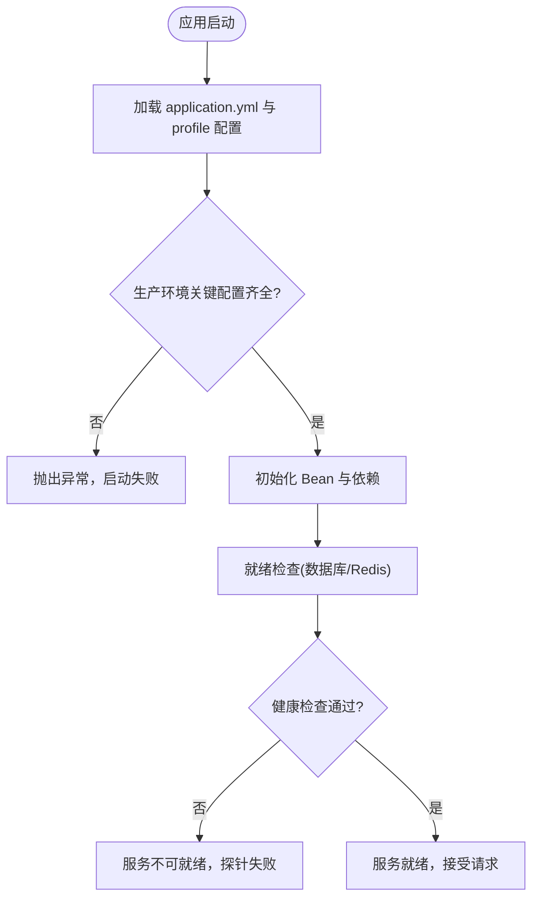
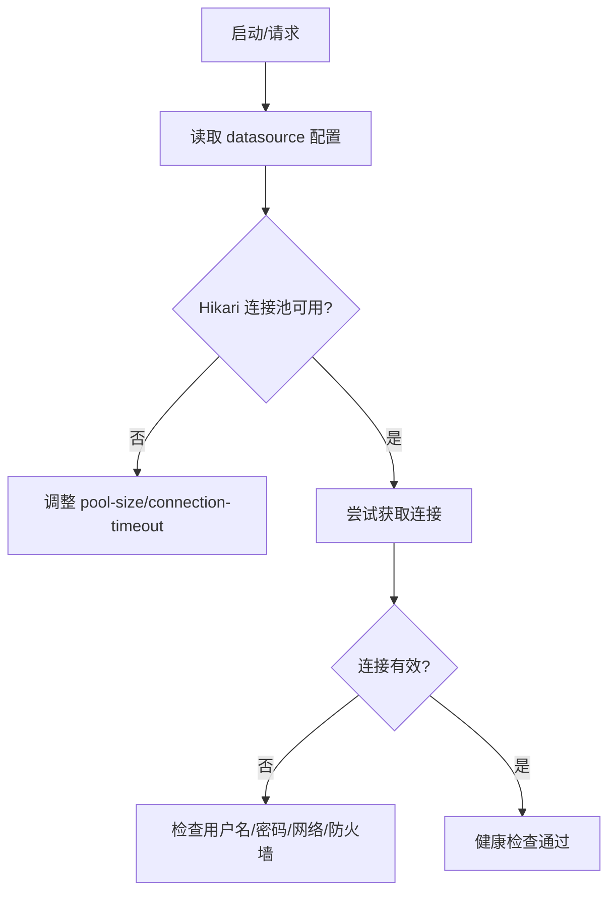
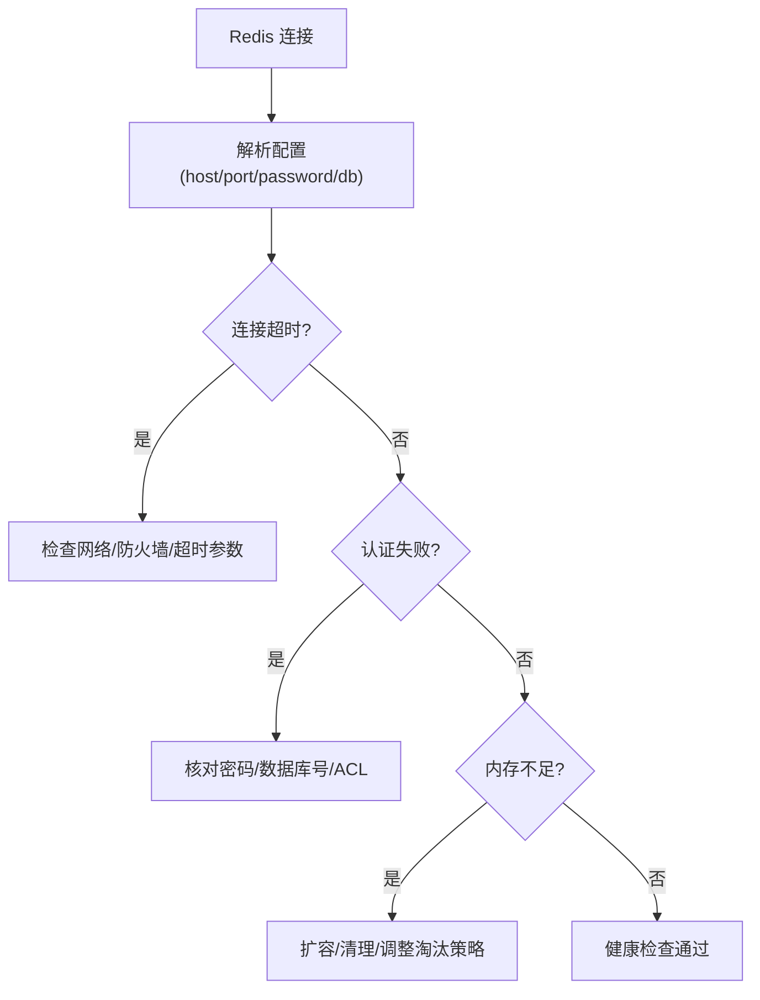
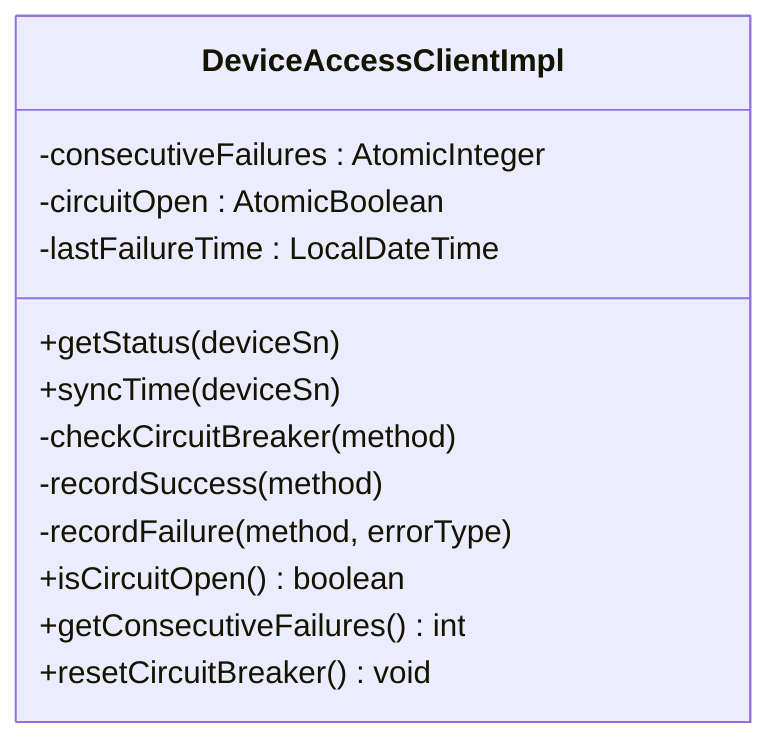
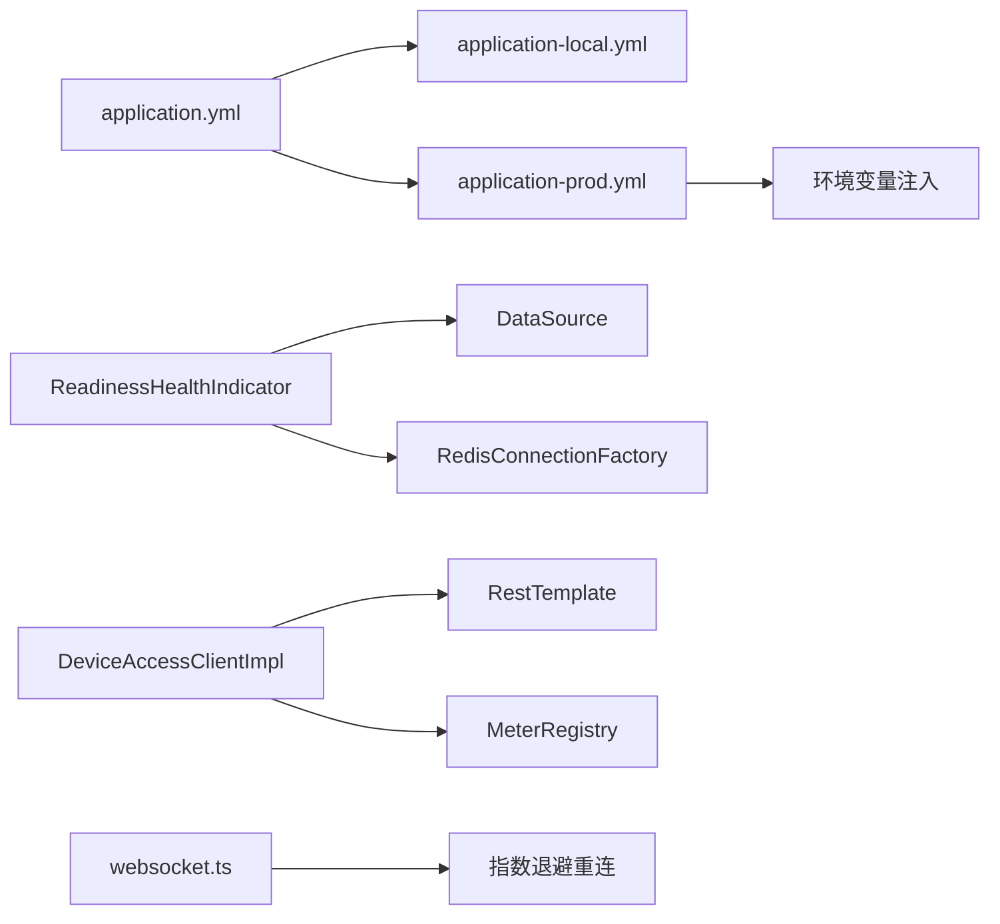

# 常见问题解决

<cite>
**本文引用的文件**
- [application.yml](file://parking-boot/src/main/resources/application.yml)
- [application-local.yml](file://parking-boot/src/main/resources/application-local.yml)
- [application-prod.yml](file://parking-boot/src/main/resources/application-prod.yml)
- [ProdConfigValidator.java](file://parking-boot/src/main/java/com/jushan/boot/config/ProdConfigValidator.java)
- [AppProperties.java](file://parking-boot/src/main/java/com/jushan/boot/config/AppProperties.java)
- [ReadinessHealthIndicator.java](file://parking-boot/src/main/java/com/jushan/boot/health/ReadinessHealthIndicator.java)
- [DeviceAccessClientImpl.java](file://parking-system/src/main/java/com/jushan/system/client/DeviceAccessClientImpl.java)
- [GlobalExceptionHandler.java](file://parking-framework/src/main/java/com/jushan/framework/web/GlobalExceptionHandler.java)
- [CommonErrorCode.java](file://parking-common/src/main/java/com/jushan/common/CommonErrorCode.java)
- [websocket.ts](file://booth-web/src/utils/websocket.ts)
</cite>

## 目录
1. [简介](#简介)
2. [项目结构](#项目结构)
3. [核心组件](#核心组件)
4. [架构总览](#架构总览)
5. [详细组件分析](#详细组件分析)
6. [依赖分析](#依赖分析)
7. [性能考虑](#性能考虑)
8. [故障排查指南](#故障排查指南)
9. [结论](#结论)
10. [附录：错误码对照表](#附录错误码对照表)

## 简介
本文件面向运维与研发，聚焦应用启动失败、数据库连接异常、Redis 连接异常、设备接入服务不可用等常见问题的定位与处理。文档结合健康检查、全局异常处理、降级策略与日志规范，提供可操作的步骤与可视化流程图，帮助快速恢复服务。

## 项目结构
本项目为多模块 Spring Boot 工程，关键配置集中在 parking-boot 的 resources 下；健康检查在 boot 模块实现；设备接入客户端在 system 模块；全局异常处理在 framework 模块；通用错误码在 common 模块；岗亭端 WebSocket 重连逻辑在 booth-web 前端。

图表来源
- [application.yml:1-108](file://parking-boot/src/main/resources/application.yml#L1-L108)
- [application-local.yml:1-87](file://parking-boot/src/main/resources/application-local.yml#L1-L87)
- [application-prod.yml:1-83](file://parking-boot/src/main/resources/application-prod.yml#L1-L83)
- [ReadinessHealthIndicator.java:1-114](file://parking-boot/src/main/java/com/jushan/boot/health/ReadinessHealthIndicator.java#L1-L114)
- [ProdConfigValidator.java:1-113](file://parking-boot/src/main/java/com/jushan/boot/config/ProdConfigValidator.java#L1-L113)
- [AppProperties.java:1-45](file://parking-boot/src/main/java/com/jushan/boot/config/AppProperties.java#L1-L45)
- [GlobalExceptionHandler.java:1-240](file://parking-framework/src/main/java/com/jushan/framework/web/GlobalExceptionHandler.java#L1-L240)
- [CommonErrorCode.java:1-62](file://parking-common/src/main/java/com/jushan/common/CommonErrorCode.java#L1-L62)
- [DeviceAccessClientImpl.java:1-346](file://parking-system/src/main/java/com/jushan/system/client/DeviceAccessClientImpl.java#L1-L346)
- [websocket.ts:144-181](file://booth-web/src/utils/websocket.ts#L144-L181)

章节来源
- [application.yml:1-108](file://parking-boot/src/main/resources/application.yml#L1-L108)
- [application-local.yml:1-87](file://parking-boot/src/main/resources/application-local.yml#L1-L87)
- [application-prod.yml:1-83](file://parking-boot/src/main/resources/application-prod.yml#L1-L83)

## 核心组件
- 应用配置与环境变量注入：通过 application.yml 与 profile 覆盖，敏感项使用环境变量注入，缺失时启动失败。
- 健康检查：自定义 ReadinessHealthIndicator 检查数据库与 Redis 连通性，供 K8s/Docker readiness probe 使用。
- 生产配置校验：ProdConfigValidator 在 prod 环境启动后逐项校验关键配置，缺失则抛出异常终止启动。
- 全局异常处理：统一将参数校验、业务异常、认证授权异常、未知异常转换为标准响应，并映射 HTTP 状态码。
- 设备接入客户端：封装 Device Access v0.2 调用，内置 Micrometer 指标与内存级熔断降级（连续失败阈值与恢复窗口）。
- 前端 WebSocket 重连：指数退避重连，避免风暴式重连。

章节来源
- [application.yml:1-108](file://parking-boot/src/main/resources/application.yml#L1-L108)
- [application-prod.yml:1-83](file://parking-boot/src/main/resources/application-prod.yml#L1-L83)
- [application-local.yml:1-87](file://parking-boot/src/main/resources/application-local.yml#L1-L87)
- [ReadinessHealthIndicator.java:1-114](file://parking-boot/src/main/java/com/jushan/boot/health/ReadinessHealthIndicator.java#L1-L114)
- [ProdConfigValidator.java:1-113](file://parking-boot/src/main/java/com/jushan/boot/config/ProdConfigValidator.java#L1-L113)
- [GlobalExceptionHandler.java:1-240](file://parking-framework/src/main/java/com/jushan/framework/web/GlobalExceptionHandler.java#L1-L240)
- [DeviceAccessClientImpl.java:1-346](file://parking-system/src/main/java/com/jushan/system/client/DeviceAccessClientImpl.java#L1-L346)
- [websocket.ts:144-181](file://booth-web/src/utils/websocket.ts#L144-L181)

## 架构总览
下图展示从请求进入、异常处理到外部依赖（DB/Redis/Device Access）的关键路径，以及健康检查探针的作用点。

图表来源
- [GlobalExceptionHandler.java:1-240](file://parking-framework/src/main/java/com/jushan/framework/web/GlobalExceptionHandler.java#L1-L240)
- [ReadinessHealthIndicator.java:1-114](file://parking-boot/src/main/java/com/jushan/boot/health/ReadinessHealthIndicator.java#L1-L114)
- [DeviceAccessClientImpl.java:1-346](file://parking-system/src/main/java/com/jushan/system/client/DeviceAccessClientImpl.java#L1-L346)

## 详细组件分析

### 应用启动失败排查
- 端口冲突
  - 现象：启动时报端口占用或无法监听。
  - 排查：确认 server.port 配置与运行参数是否一致；本地默认 8080，生产可通过 SERVER_PORT 覆盖。
  - 参考：[application.yml:54-56](file://parking-boot/src/main/resources/application.yml#L54-L56)、[application-prod.yml:10-12](file://parking-boot/src/main/resources/application-prod.yml#L10-L12)
- 配置文件错误
  - 现象：启动阶段因属性绑定或校验失败而退出。
  - 排查：检查 application.yml 与对应 profile 的配置块；确认必填项存在且格式正确；生产环境缺失敏感环境变量会直接导致启动失败。
  - 参考：[application.yml:8-12](file://parking-boot/src/main/resources/application.yml#L8-L12)、[application-prod.yml:14-46](file://parking-boot/src/main/resources/application-prod.yml#L14-L46)
- 依赖服务连接问题
  - 现象：启动成功但健康检查不通过，或后续请求失败。
  - 排查：查看 /actuator/health 中 database/redis 详情；根据错误信息定位网络、认证、权限等问题。
  - 参考：[ReadinessHealthIndicator.java:51-113](file://parking-boot/src/main/java/com/jushan/boot/health/ReadinessHealthIndicator.java#L51-L113)
- 生产环境关键配置校验
  - 机制：prod Profile 下启动后执行 ProdConfigValidator，缺失关键配置将抛出异常终止启动。
  - 建议：部署前按 .env.example 设置所有必需环境变量。
  - 参考：[ProdConfigValidator.java:25-40](file://parking-boot/src/main/java/com/jushan/boot/config/ProdConfigValidator.java#L25-L40)

图表来源
- [application.yml:1-108](file://parking-boot/src/main/resources/application.yml#L1-L108)
- [application-prod.yml:1-83](file://parking-boot/src/main/resources/application-prod.yml#L1-L83)
- [ProdConfigValidator.java:1-113](file://parking-boot/src/main/java/com/jushan/boot/config/ProdConfigValidator.java#L1-L113)
- [ReadinessHealthIndicator.java:1-114](file://parking-boot/src/main/java/com/jushan/boot/health/ReadinessHealthIndicator.java#L1-L114)

章节来源
- [application.yml:1-108](file://parking-boot/src/main/resources/application.yml#L1-L108)
- [application-prod.yml:1-83](file://parking-boot/src/main/resources/application-prod.yml#L1-L83)
- [application-local.yml:1-87](file://parking-boot/src/main/resources/application-local.yml#L1-L87)
- [ProdConfigValidator.java:1-113](file://parking-boot/src/main/java/com/jushan/boot/config/ProdConfigValidator.java#L1-L113)
- [ReadinessHealthIndicator.java:1-114](file://parking-boot/src/main/java/com/jushan/boot/health/ReadinessHealthIndicator.java#L1-L114)

### 数据库连接问题诊断
- 连接池配置
  - 本地默认 Hikari 最大连接数 10，最小空闲 2；生产可通过 DB_POOL_MAX/DB_POOL_MIN 覆盖。
  - 参考：[application.yml:22-31](file://parking-boot/src/main/resources/application.yml#L22-L31)、[application-prod.yml:16-26](file://parking-boot/src/main/resources/application-prod.yml#L16-L26)
- 权限验证
  - 检查用户名/密码是否正确，数据库用户是否有库访问权限；Flyway 迁移是否启用。
  - 参考：[application.yml:22-37](file://parking-boot/src/main/resources/application.yml#L22-L37)、[application-prod.yml:16-32](file://parking-boot/src/main/resources/application-prod.yml#L16-L32)
- 网络连通性检查
  - 使用 /actuator/health 查看 database 详情与错误信息；必要时直连 MySQL 验证可达性与版本。
  - 参考：[ReadinessHealthIndicator.java:66-87](file://parking-boot/src/main/java/com/jushan/boot/health/ReadinessHealthIndicator.java#L66-L87)

图表来源
- [application.yml:22-37](file://parking-boot/src/main/resources/application.yml#L22-L37)
- [application-prod.yml:16-32](file://parking-boot/src/main/resources/application-prod.yml#L16-L32)
- [ReadinessHealthIndicator.java:66-87](file://parking-boot/src/main/java/com/jushan/boot/health/ReadinessHealthIndicator.java#L66-L87)

章节来源
- [application.yml:22-37](file://parking-boot/src/main/resources/application.yml#L22-L37)
- [application-prod.yml:16-32](file://parking-boot/src/main/resources/application-prod.yml#L16-L32)
- [ReadinessHealthIndicator.java:66-87](file://parking-boot/src/main/java/com/jushan/boot/health/ReadinessHealthIndicator.java#L66-L87)

### Redis 连接异常处理
- 认证失败
  - 检查 host/port/password/database 配置；生产通过 REDIS_HOST/REDIS_PORT/REDIS_PASSWORD/REDIS_DATABASE 注入。
  - 参考：[application.yml:39-52](file://parking-boot/src/main/resources/application.yml#L39-L52)、[application-prod.yml:34-46](file://parking-boot/src/main/resources/application-prod.yml#L34-L46)
- 内存不足
  - 观察 Redis 内存使用率与淘汰策略；适当扩容或清理键空间；关注 maxmemory 与 policy。
  - 建议：结合监控告警与容量规划。
- 网络超时
  - 调整 timeout 与 Lettuce 连接池参数；检查网络延迟与丢包；必要时增加 max-wait。
  - 参考：[application.yml:39-52](file://parking-boot/src/main/resources/application.yml#L39-L52)
- 健康检查辅助
  - 通过 /actuator/health 查看 redis 详情与错误信息。
  - 参考：[ReadinessHealthIndicator.java:89-113](file://parking-boot/src/main/java/com/jushan/boot/health/ReadinessHealthIndicator.java#L89-L113)

图表来源
- [application.yml:39-52](file://parking-boot/src/main/resources/application.yml#L39-L52)
- [application-prod.yml:34-46](file://parking-boot/src/main/resources/application-prod.yml#L34-L46)
- [ReadinessHealthIndicator.java:89-113](file://parking-boot/src/main/java/com/jushan/boot/health/ReadinessHealthIndicator.java#L89-L113)

章节来源
- [application.yml:39-52](file://parking-boot/src/main/resources/application.yml#L39-L52)
- [application-prod.yml:34-46](file://parking-boot/src/main/resources/application-prod.yml#L34-L46)
- [ReadinessHealthIndicator.java:89-113](file://parking-boot/src/main/java/com/jushan/boot/health/ReadinessHealthIndicator.java#L89-L113)

### 设备接入服务不可用时的降级与恢复
- 降级触发
  - 当连续失败次数达到阈值时，打开内存级熔断，后续调用快速失败，避免级联阻塞。
  - 参考：[DeviceAccessClientImpl.java:63-82](file://parking-system/src/main/java/com/jushan/system/client/DeviceAccessClientImpl.java#L63-L82)
- 恢复策略
  - 超过恢复时间窗口后自动尝试恢复；也可手动重置降级状态。
  - 参考：[DeviceAccessClientImpl.java:170-201](file://parking-system/src/main/java/com/jushan/system/client/DeviceAccessClientImpl.java#L170-L201)、[DeviceAccessClientImpl.java:339-344](file://parking-system/src/main/java/com/jushan/system/client/DeviceAccessClientImpl.java#L339-L344)
- 指标观测
  - 暴露调用次数、失败率、延迟分布与熔断状态，便于 Prometheus 采集与告警。
  - 参考：[DeviceAccessClientImpl.java:92-107](file://parking-system/src/main/java/com/jushan/system/client/DeviceAccessClientImpl.java#L92-L107)

图表来源
- [DeviceAccessClientImpl.java:1-346](file://parking-system/src/main/java/com/jushan/system/client/DeviceAccessClientImpl.java#L1-L346)

章节来源
- [DeviceAccessClientImpl.java:1-346](file://parking-system/src/main/java/com/jushan/system/client/DeviceAccessClientImpl.java#L1-L346)

### 日志分析方法
- 日志级别与模式
  - 根日志级别与 com.jushan 包级别可在 application.yml 中配置；控制台输出包含线程与 traceId。
  - 参考：[application.yml:101-108](file://parking-boot/src/main/resources/application.yml#L101-L108)
- 全局异常日志
  - 参数错误、业务异常、未登录/无权限、404/405、系统异常均有统一日志记录，便于检索。
  - 参考：[GlobalExceptionHandler.java:49-231](file://parking-framework/src/main/java/com/jushan/framework/web/GlobalExceptionHandler.java#L49-L231)
- 健康检查日志
  - 数据库/Redis 连通性检查失败时会记录警告日志，包含错误摘要。
  - 参考：[ReadinessHealthIndicator.java:66-113](file://parking-boot/src/main/java/com/jushan/boot/health/ReadinessHealthIndicator.java#L66-L113)
- 设备接入客户端日志
  - 网络异常、空响应、业务错误均记录日志，并附带 method/deviceSn 等信息。
  - 参考：[DeviceAccessClientImpl.java:263-316](file://parking-system/src/main/java/com/jushan/system/client/DeviceAccessClientImpl.java#L263-L316)

章节来源
- [application.yml:101-108](file://parking-boot/src/main/resources/application.yml#L101-L108)
- [GlobalExceptionHandler.java:49-231](file://parking-framework/src/main/java/com/jushan/framework/web/GlobalExceptionHandler.java#L49-L231)
- [ReadinessHealthIndicator.java:66-113](file://parking-boot/src/main/java/com/jushan/boot/health/ReadinessHealthIndicator.java#L66-L113)
- [DeviceAccessClientImpl.java:263-316](file://parking-system/src/main/java/com/jushan/system/client/DeviceAccessClientImpl.java#L263-L316)

## 依赖分析
- 配置依赖
  - application.yml 作为通用配置，被 local/prod 等 profile 覆盖；敏感项通过环境变量注入。
- 运行时依赖
  - 健康检查依赖 DataSource 与 RedisConnectionFactory；设备接入客户端依赖 RestTemplate 与 MeterRegistry。
- 前端依赖
  - 岗亭端 WebSocket 客户端具备指数退避重连能力，降低服务端压力。

图表来源
- [application.yml:1-108](file://parking-boot/src/main/resources/application.yml#L1-L108)
- [application-local.yml:1-87](file://parking-boot/src/main/resources/application-local.yml#L1-L87)
- [application-prod.yml:1-83](file://parking-boot/src/main/resources/application-prod.yml#L1-L83)
- [ReadinessHealthIndicator.java:1-114](file://parking-boot/src/main/java/com/jushan/boot/health/ReadinessHealthIndicator.java#L1-L114)
- [DeviceAccessClientImpl.java:1-346](file://parking-system/src/main/java/com/jushan/system/client/DeviceAccessClientImpl.java#L1-L346)
- [websocket.ts:144-181](file://booth-web/src/utils/websocket.ts#L144-L181)

章节来源
- [application.yml:1-108](file://parking-boot/src/main/resources/application.yml#L1-L108)
- [application-local.yml:1-87](file://parking-boot/src/main/resources/application-local.yml#L1-L87)
- [application-prod.yml:1-83](file://parking-boot/src/main/resources/application-prod.yml#L1-L83)
- [ReadinessHealthIndicator.java:1-114](file://parking-boot/src/main/java/com/jushan/boot/health/ReadinessHealthIndicator.java#L1-L114)
- [DeviceAccessClientImpl.java:1-346](file://parking-system/src/main/java/com/jushan/system/client/DeviceAccessClientImpl.java#L1-L346)
- [websocket.ts:144-181](file://booth-web/src/utils/websocket.ts#L144-L181)

## 性能考虑
- 连接池调优
  - 根据并发与负载调整 Hikari 与 Lettuce 连接池大小与等待超时，避免连接饥饿与排队。
- 健康检查频率
  - 合理设置 readiness/liveness 探测间隔，避免频繁探测造成额外开销。
- 降级与限流
  - 设备接入客户端已内置内存级熔断，建议在网关层叠加限流与重试退避策略。
- 日志级别
  - 生产环境建议降低日志级别，减少 IO 开销；仅在排障时临时提升。

## 故障排查指南
- 启动失败
  - 检查端口占用与配置覆盖；确认生产环境变量齐全；查看 /actuator/health 与健康日志。
  - 参考：[application.yml:54-56](file://parking-boot/src/main/resources/application.yml#L54-L56)、[application-prod.yml:10-12](file://parking-boot/src/main/resources/application-prod.yml#L10-L12)、[ProdConfigValidator.java:25-40](file://parking-boot/src/main/java/com/jushan/boot/config/ProdConfigValidator.java#L25-L40)
- 数据库连接异常
  - 核对 URL/用户名/密码/时区；检查 Flyway 迁移；通过健康检查定位错误信息。
  - 参考：[application.yml:22-37](file://parking-boot/src/main/resources/application.yml#L22-L37)、[ReadinessHealthIndicator.java:66-87](file://parking-boot/src/main/java/com/jushan/boot/health/ReadinessHealthIndicator.java#L66-L87)
- Redis 连接异常
  - 核对 host/port/password/database；调整 timeout 与连接池；观察内存与淘汰策略。
  - 参考：[application.yml:39-52](file://parking-boot/src/main/resources/application.yml#L39-L52)、[application-prod.yml:34-46](file://parking-boot/src/main/resources/application-prod.yml#L34-L46)
- 设备接入服务不可用
  - 观察熔断状态与指标；超过恢复窗口后自动尝试恢复；必要时手动重置。
  - 参考：[DeviceAccessClientImpl.java:170-201](file://parking-system/src/main/java/com/jushan/system/client/DeviceAccessClientImpl.java#L170-L201)、[DeviceAccessClientImpl.java:339-344](file://parking-system/src/main/java/com/jushan/system/client/DeviceAccessClientImpl.java#L339-L344)
- 前端 WebSocket 断线
  - 客户端具备指数退避重连，关注重连次数与错误回调；检查后端 WebSocket 配置与鉴权。
  - 参考：[websocket.ts:144-181](file://booth-web/src/utils/websocket.ts#L144-L181)

章节来源
- [application.yml:54-56](file://parking-boot/src/main/resources/application.yml#L54-L56)
- [application-prod.yml:10-12](file://parking-boot/src/main/resources/application-prod.yml#L10-L12)
- [ProdConfigValidator.java:25-40](file://parking-boot/src/main/java/com/jushan/boot/config/ProdConfigValidator.java#L25-L40)
- [application.yml:22-37](file://parking-boot/src/main/resources/application.yml#L22-L37)
- [ReadinessHealthIndicator.java:66-87](file://parking-boot/src/main/java/com/jushan/boot/health/ReadinessHealthIndicator.java#L66-L87)
- [application.yml:39-52](file://parking-boot/src/main/resources/application.yml#L39-L52)
- [application-prod.yml:34-46](file://parking-boot/src/main/resources/application-prod.yml#L34-L46)
- [DeviceAccessClientImpl.java:170-201](file://parking-system/src/main/java/com/jushan/system/client/DeviceAccessClientImpl.java#L170-L201)
- [DeviceAccessClientImpl.java:339-344](file://parking-system/src/main/java/com/jushan/system/client/DeviceAccessClientImpl.java#L339-L344)
- [websocket.ts:144-181](file://booth-web/src/utils/websocket.ts#L144-L181)

## 结论
通过统一的配置管理、健康检查、全局异常处理与设备接入客户端的降级策略，平台能够在基础设施异常或服务不可用时快速定位问题并维持基本可用性。建议在生产环境完善监控告警与容量规划，持续优化连接池与超时参数，确保稳定性与可观测性。

## 附录：错误码对照表
- 通用错误码（平台内部）
  - 0 success
  - 400 PARAM_ERROR
  - 401 UNAUTHORIZED
  - 403 FORBIDDEN
  - 404 NOT_FOUND
  - 405 METHOD_NOT_ALLOWED
  - 1000 BUSINESS_ERROR
  - 1001 CONFLICT
  - 1002 UNSUPPORTED_OPERATION
  - 9999 INTERNAL_ERROR
- 协议级错误码到 HTTP 状态映射
  - 400 → BAD_REQUEST
  - 401 → UNAUTHORIZED
  - 403 → FORBIDDEN
  - 404 → NOT_FOUND
  - 409 → CONFLICT
  - 429 → TOO_MANY_REQUESTS
  - 其他业务码 → HTTP 200

章节来源
- [CommonErrorCode.java:1-62](file://parking-common/src/main/java/com/jushan/common/CommonErrorCode.java#L1-L62)
- [GlobalExceptionHandler.java:114-130](file://parking-framework/src/main/java/com/jushan/framework/web/GlobalExceptionHandler.java#L114-L130)