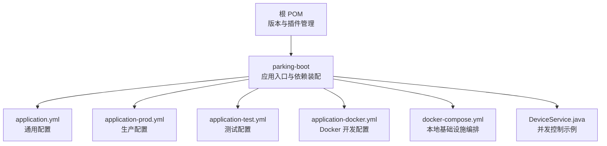
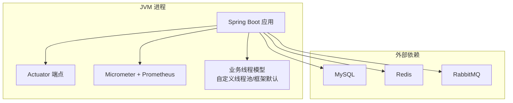
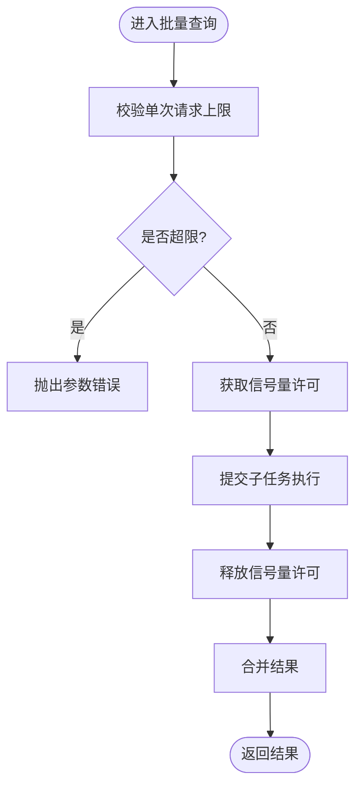
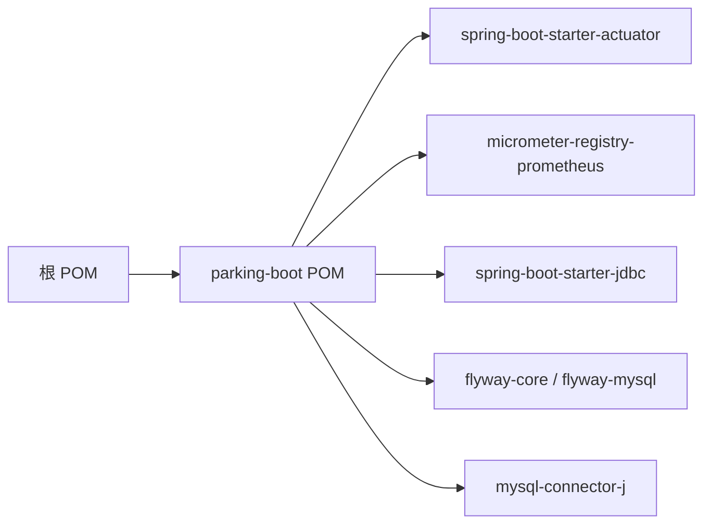

# JVM调优

<cite>
**本文引用的文件列表**
- [pom.xml](file://pom.xml)
- [parking-boot/pom.xml](file://parking-boot/pom.xml)
- [application.yml](file://parking-boot/src/main/resources/application.yml)
- [application-prod.yml](file://parking-boot/src/main/resources/application-prod.yml)
- [application-test.yml](file://parking-boot/src/main/resources/application-test.yml)
- [application-docker.yml](file://parking-boot/src/main/resources/application-docker.yml)
- [docker-compose.yml](file://docker-compose.yml)
- [DeviceService.java](file://parking-system/src/main/java/com/jushan/system/service/DeviceService.java)
</cite>

## 目录
1. [简介](#简介)
2. [项目结构](#项目结构)
3. [核心组件](#核心组件)
4. [架构总览](#架构总览)
5. [详细组件分析](#详细组件分析)
6. [依赖关系分析](#依赖关系分析)
7. [性能考量](#性能考量)
8. [故障排查指南](#故障排查指南)
9. [结论](#结论)
10. [附录](#附录)

## 简介
本指南面向基于 Spring Boot 的停车 SaaS 平台，聚焦 JVM 调优与线程池优化。内容涵盖：
- 堆内存设置（初始与最大堆）
- 新生代与老年代比例调整
- 垃圾回收器选择（推荐 G1GC）
- 线程池配置优化（核心线程数、最大线程数、队列容量）
- 不同环境（开发、测试、生产）的 JVM 参数模板
- 内存泄漏监控与 GC 日志分析技巧
- 容器化环境下的 JVM 调优注意事项（Docker 内存/CPU 限制）

说明：仓库中未直接包含 JVM 启动参数或线程池 Bean 定义，本文结合现有配置与通用最佳实践给出可落地的建议与模板，并标注相关源码位置以便对照。

## 项目结构
本项目为多模块 Maven 工程，后端以 parking-boot 作为应用入口，使用 Spring Boot 3.x 与 Java 21。关键资源包括各环境的 application 配置文件与 docker-compose 编排文件。

图表来源
- [pom.xml:1-52](file://pom.xml#L1-L52)
- [parking-boot/pom.xml:1-28](file://parking-boot/pom.xml#L1-L28)
- [application.yml:1-108](file://parking-boot/src/main/resources/application.yml#L1-L108)
- [application-prod.yml:1-83](file://parking-boot/src/main/resources/application-prod.yml#L1-L83)
- [application-test.yml:1-80](file://parking-boot/src/main/resources/application-test.yml#L1-L80)
- [application-docker.yml:1-88](file://parking-boot/src/main/resources/application-docker.yml#L1-L88)
- [docker-compose.yml:1-167](file://docker-compose.yml#L1-L167)
- [DeviceService.java:854-881](file://parking-system/src/main/java/com/jushan/system/service/DeviceService.java#L854-L881)

章节来源
- [pom.xml:1-52](file://pom.xml#L1-L52)
- [parking-boot/pom.xml:1-28](file://parking-boot/pom.xml#L1-L28)

## 核心组件
- 应用入口与依赖：parking-boot 聚合 framework 与 system 模块，引入 Actuator、Micrometer Prometheus、JDBC/HikariCP、Flyway、Redis/Lettuce、RabbitMQ 等能力。
- 配置分层：application.yml 提供默认值；application-prod/test/docker 分别覆盖敏感项与环境差异。
- 并发控制示例：DeviceService 中使用信号量限制外部设备访问并发度，体现“限流+可控并发”的设计思路。

章节来源
- [parking-boot/pom.xml:18-57](file://parking-boot/pom.xml#L18-L57)
- [application.yml:22-52](file://parking-boot/src/main/resources/application.yml#L22-L52)
- [application-prod.yml:14-55](file://parking-boot/src/main/resources/application-prod.yml#L14-L55)
- [DeviceService.java:854-881](file://parking-system/src/main/java/com/jushan/system/service/DeviceService.java#L854-L881)

## 架构总览
下图展示运行期关键组件与外部依赖的关系，便于理解 JVM 与线程模型对整体吞吐与延迟的影响面。

[此图为概念性架构图，不直接映射具体源码文件]

## 详细组件分析

### 堆内存与垃圾回收器（G1GC）
- 目标：在容器或物理机环境下稳定吞吐、降低长停顿风险。
- 建议策略：
  - 启用 G1GC，合理设置堆大小与分代比例，避免频繁 Full GC。
  - 将初始堆与最大堆设置为相同值，减少运行时堆扩容带来的抖动。
  - 针对大对象与混合收集进行适度调优，关注 Young/Mixed 停顿时间。
- 参考依据：
  - 项目使用 Java 21 与 Spring Boot 3.x，G1GC 是主流推荐。
  - 通过 Micrometer 暴露指标，便于观测 GC 行为。

章节来源
- [pom.xml:24-44](file://pom.xml#L24-L44)
- [parking-boot/pom.xml:41-51](file://parking-boot/pom.xml#L41-L51)

### 线程池与并发控制
- 现状：代码中存在基于信号量的并发控制示例，用于限制对外部设备的批量查询并发度，避免下游压力过大。
- 建议：
  - 为 IO 密集型任务（HTTP/RPC/DB/Redis/MQ）配置独立线程池，隔离热点路径。
  - 核心线程数与最大线程数按 CPU 核数与 IO 等待特征设定；队列容量需评估峰值 QPS 与背压策略。
  - 结合超时、重试与熔断降级，保障系统弹性。

图表来源
- [DeviceService.java:854-881](file://parking-system/src/main/java/com/jushan/system/service/DeviceService.java#L854-L881)

章节来源
- [DeviceService.java:854-881](file://parking-system/src/main/java/com/jushan/system/service/DeviceService.java#L854-L881)

### 连接池与外部依赖
- HikariCP（数据库）：根据应用并发与数据库承载能力调整最大连接数与空闲超时。
- Lettuce（Redis）：连接池大小与等待策略需与 Redis 实例容量匹配。
- RabbitMQ：消费者并发与预取数量影响吞吐与内存占用。

章节来源
- [application.yml:22-52](file://parking-boot/src/main/resources/application.yml#L22-L52)
- [application-prod.yml:14-55](file://parking-boot/src/main/resources/application-prod.yml#L14-L55)
- [application-docker.yml:13-54](file://parking-boot/src/main/resources/application-docker.yml#L13-L54)

## 依赖关系分析
- 构建与运行：根 POM 统一版本与插件；parking-boot 聚合业务与框架模块。
- 运行时依赖：Actuator 与 Micrometer 提供健康检查与指标采集；HikariCP、Lettuce、RabbitMQ 客户端驱动由 starter 自动装配。

图表来源
- [pom.xml:158-216](file://pom.xml#L158-L216)
- [parking-boot/pom.xml:41-75](file://parking-boot/pom.xml#L41-L75)

章节来源
- [pom.xml:158-216](file://pom.xml#L158-L216)
- [parking-boot/pom.xml:41-75](file://parking-boot/pom.xml#L41-L75)

## 性能考量
- 堆大小与分代：
  - 初始堆与最大堆一致，减少动态扩容开销。
  - 新生代占比适中，避免 Minor GC 过于频繁或晋升过快。
- 垃圾回收器：
  - 优先 G1GC，关注 Mixed GC 频率与停顿时间。
  - 若存在大量短生命周期对象，适当增大新生代空间。
- 线程模型：
  - 区分 IO 与 CPU 密集型任务，采用不同线程池。
  - 队列容量与拒绝策略需结合压测确定，避免 OOM 或雪崩。
- 外部依赖：
  - 数据库连接池上限不超过数据库 max_connections 的安全阈值。
  - Redis 连接池与命令超时需与缓存命中率配合调优。
  - MQ 消费者并发与预取数量平衡吞吐与内存。

[本节为通用指导，无需源码引用]

## 故障排查指南
- 指标与健康检查：
  - 使用 Actuator 暴露 health/info 端点，结合 readiness/liveness 探针。
  - 通过 Micrometer + Prometheus 采集 GC、线程、连接池等指标。
- GC 日志与分析：
  - 开启 GC 日志输出，定期归档，结合工具分析停顿与分配速率。
  - 关注 Old Gen 增长趋势与 Full GC 触发原因。
- 内存泄漏定位：
  - 观察堆使用曲线与对象分布，定位异常增长的对象类型。
  - 结合线程栈与慢查询，排查持有大对象的上下文。

章节来源
- [application.yml:75-92](file://parking-boot/src/main/resources/application.yml#L75-L92)
- [parking-boot/pom.xml:41-51](file://parking-boot/pom.xml#L41-L51)

## 结论
- 以 G1GC 为主，固定堆大小，合理设置新生代与分代比例，可有效降低停顿与抖动。
- 线程池应遵循“隔离+限流+超时+降级”的原则，结合信号量/令牌桶等手段保护下游。
- 通过 Actuator 与 Micrometer 建立完善的观测体系，持续验证调优效果。
- 容器化部署需严格限制内存与 CPU，确保 JVM 能正确感知资源边界。

[本节为总结性内容，无需源码引用]

## 附录

### 不同环境 JVM 参数模板（建议）
- 开发环境（本地单机）
  - 堆大小：较小堆，快速反馈
  - GC：G1GC，较短停顿优先
  - 日志：开启 GC 日志，便于学习
- 测试环境（CI/集成测试）
  - 堆大小：中等堆，模拟真实负载
  - GC：G1GC，关注稳定性
  - 指标：开启 Micrometer，采集基础指标
- 生产环境（高可用集群）
  - 堆大小：固定堆，避免动态扩容
  - GC：G1GC，关注 Mixed GC 与停顿
  - 监控：全量指标与告警，GC 日志归档

[本节为模板建议，无需源码引用]

### 容器化环境注意事项（Docker/Kubernetes）
- 内存限制：
  - 在 Compose 或编排平台中为容器设置 memory 限制，确保 JVM 能感知 cgroup 限制。
  - 避免容器内存限制小于堆大小，防止 OOM Kill。
- CPU 限制：
  - 设置 CPU 配额与份额，避免争抢导致抖动。
  - 结合线程池与连接池上限，避免超卖。
- 端口与网络：
  - 注意端口映射与 host 解析，保证服务间通信稳定。

章节来源
- [docker-compose.yml:29-145](file://docker-compose.yml#L29-L145)