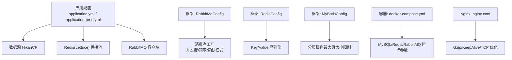
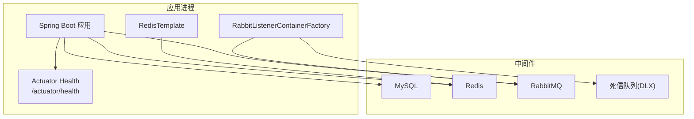
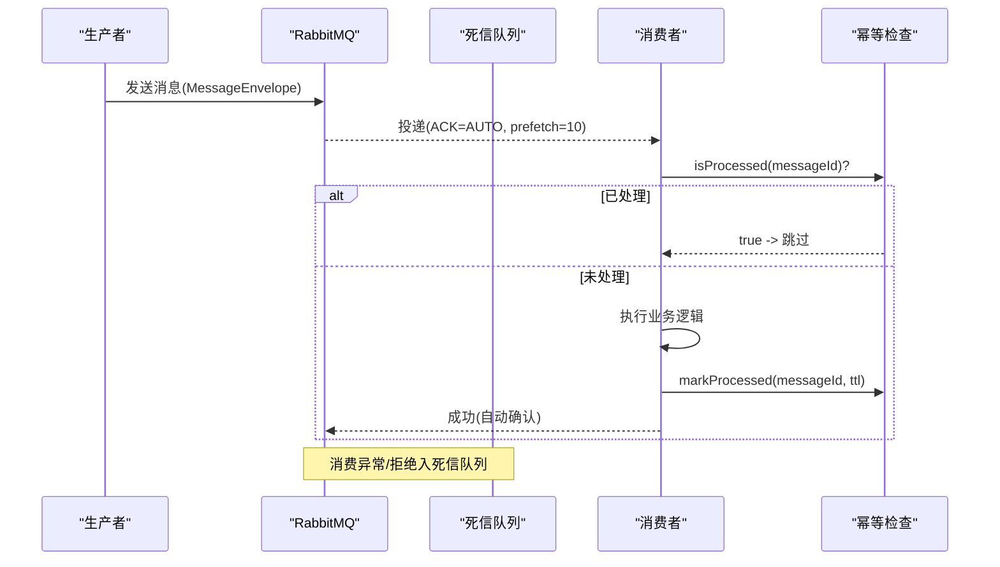
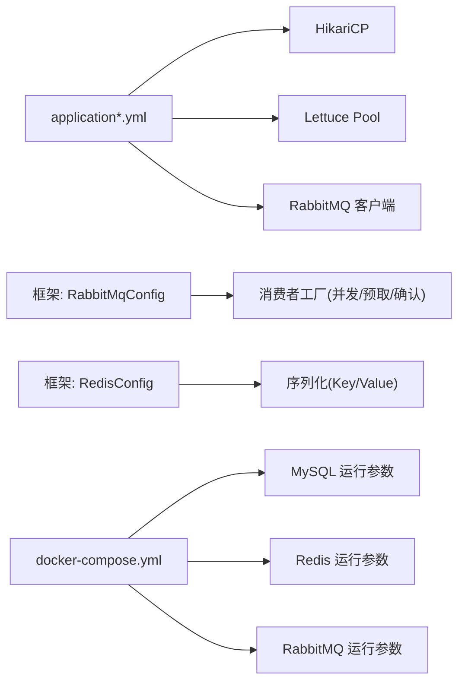

# 性能优化

<cite>
**本文引用的文件**   
- [application.yml](file://parking-boot/src/main/resources/application.yml)
- [application-prod.yml](file://parking-boot/src/main/resources/application-prod.yml)
- [MyBatisConfig.java](file://parking-boot/src/main/java/com/jushan/boot/config/MyBatisConfig.java)
- [ReadinessHealthIndicator.java](file://parking-boot/src/main/java/com/jushan/boot/health/ReadinessHealthIndicator.java)
- [RedisConfig.java](file://parking-framework/src/main/java/com/jushan/framework/redis/RedisConfig.java)
- [CacheNames.java](file://parking-framework/src/main/java/com/jushan/framework/redis/CacheNames.java)
- [RabbitMqConfig.java](file://parking-framework/src/main/java/com/jushan/framework/mq/RabbitMqConfig.java)
- [MessageEnvelope.java](file://parking-framework/src/main/java/com/jushan/framework/mq/MessageEnvelope.java)
- [MessageIdempotency.java](file://parking-framework/src/main/java/com/jushan/framework/mq/MessageIdempotency.java)
- [docker-compose.yml](file://docker-compose.yml)
- [nginx.conf](file://docker/nginx/nginx.conf)
</cite>

## 目录
1. [引言](#引言)
2. [项目结构](#项目结构)
3. [核心组件](#核心组件)
4. [架构总览](#架构总览)
5. [详细组件分析](#详细组件分析)
6. [依赖关系分析](#依赖关系分析)
7. [性能考虑](#性能考虑)
8. [故障排查指南](#故障排查指南)
9. [结论](#结论)
10. [附录](#附录)

## 引言
本指南聚焦于在现有代码与配置基础上，给出可落地的性能优化建议，覆盖 JVM 调优、数据库连接池与查询优化、缓存策略、消息队列消费能力与积压处理、以及系统监控指标采集与瓶颈分析方法。所有建议均结合仓库中的实际配置与实现进行说明，便于直接落地执行。

## 项目结构
本项目为多模块 Spring Boot 应用，关键性能相关配置集中在：
- 应用通用与生产配置：数据源、Redis、RabbitMQ、Actuator 健康检查等
- 框架层 Redis 模板与序列化、RabbitMQ 基础配置（Exchange/Queue/DLX、消费者工厂）
- 容器编排与反向代理：Docker Compose 中 MySQL/Redis/RabbitMQ/Nginx 的默认参数
- MyBatis-Plus 分页插件溢出保护

图表来源
- [application.yml:22-52](file://parking-boot/src/main/resources/application.yml#L22-L52)
- [application-prod.yml:16-54](file://parking-boot/src/main/resources/application-prod.yml#L16-L54)
- [RabbitMqConfig.java:147-162](file://parking-framework/src/main/java/com/jushan/framework/mq/RabbitMqConfig.java#L147-L162)
- [RedisConfig.java:45-63](file://parking-framework/src/main/java/com/jushan/framework/redis/RedisConfig.java#L45-L63)
- [MyBatisConfig.java:70-75](file://parking-boot/src/main/java/com/jushan/boot/config/MyBatisConfig.java#L70-L75)
- [docker-compose.yml:58-62](file://docker-compose.yml#L58-L62)
- [nginx.conf:32-67](file://docker/nginx/nginx.conf#L32-L67)

章节来源
- [application.yml:22-52](file://parking-boot/src/main/resources/application.yml#L22-L52)
- [application-prod.yml:16-54](file://parking-boot/src/main/resources/application-prod.yml#L16-L54)
- [RabbitMqConfig.java:147-162](file://parking-framework/src/main/java/com/jushan/framework/mq/RabbitMqConfig.java#L147-L162)
- [RedisConfig.java:45-63](file://parking-framework/src/main/java/com/jushan/framework/redis/RedisConfig.java#L45-L63)
- [MyBatisConfig.java:70-75](file://parking-boot/src/main/java/com/jushan/boot/config/MyBatisConfig.java#L70-L75)
- [docker-compose.yml:58-62](file://docker-compose.yml#L58-L62)
- [nginx.conf:32-67](file://docker/nginx/nginx.conf#L32-L67)

## 核心组件
- 数据源与连接池：HikariCP 默认值与生产环境变量注入；通过 Actuator 健康检查暴露连通性
- 缓存：Lettuce 连接池 + 自定义 RedisTemplate 序列化；按业务域划分缓存名称
- 消息队列：Topic Exchange + DLX；消费者工厂设置并发度与预取数；幂等接口规范
- 数据库迁移与分页：Flyway 启用；分页插件最大页大小限制
- 反向代理：Nginx 开启 Gzip、TCP 优化与 KeepAlive

章节来源
- [application.yml:22-52](file://parking-boot/src/main/resources/application.yml#L22-L52)
- [application-prod.yml:16-54](file://parking-boot/src/main/resources/application-prod.yml#L16-L54)
- [ReadinessHealthIndicator.java:72-113](file://parking-boot/src/main/java/com/jushan/boot/health/ReadinessHealthIndicator.java#L72-L113)
- [RedisConfig.java:45-63](file://parking-framework/src/main/java/com/jushan/framework/redis/RedisConfig.java#L45-L63)
- [CacheNames.java:18-39](file://parking-framework/src/main/java/com/jushan/framework/redis/CacheNames.java#L18-L39)
- [RabbitMqConfig.java:147-162](file://parking-framework/src/main/java/com/jushan/framework/mq/RabbitMqConfig.java#L147-L162)
- [MyBatisConfig.java:70-75](file://parking-boot/src/main/java/com/jushan/boot/config/MyBatisConfig.java#L70-L75)
- [docker-compose.yml:94-115](file://docker-compose.yml#L94-L115)
- [nginx.conf:32-67](file://docker/nginx/nginx.conf#L32-L67)

## 架构总览
下图展示后端与中间件的关键交互路径，以及与健康检查、序列化、幂等的关联点。

图表来源
- [application.yml:75-92](file://parking-boot/src/main/resources/application.yml#L75-L92)
- [ReadinessHealthIndicator.java:72-113](file://parking-boot/src/main/java/com/jushan/boot/health/ReadinessHealthIndicator.java#L72-L113)
- [RabbitMqConfig.java:147-162](file://parking-framework/src/main/java/com/jushan/framework/mq/RabbitMqConfig.java#L147-L162)
- [RedisConfig.java:45-63](file://parking-framework/src/main/java/com/jushan/framework/redis/RedisConfig.java#L45-L63)

## 详细组件分析

### 数据库与连接池优化
- 连接池参数
  - 本地默认 maximum-pool-size=10，minimum-idle=2，idle-timeout=300s，connection-timeout=10s
  - 生产通过环境变量注入：DB_POOL_MAX、DB_POOL_MIN，并保留 idle/connection timeout
- 健康检查
  - 启动时校验数据库连通性与元信息，失败则标记不可用，便于快速发现连接问题
- 分页溢出保护
  - 分页插件最大每页 200 条，避免深度分页拖垮数据库

优化建议
- 根据 QPS 与慢查询情况调整 maximum-pool-size，确保不超过数据库 max_connections 的安全比例
- 将 connection-timeout 控制在合理范围，避免线程长时间阻塞
- 对热点查询建立合适索引，使用 EXPLAIN 验证走索引；避免 SELECT *，只取必要字段
- 控制分页上限，必要时采用游标或时间戳分页替代深度 offset

章节来源
- [application.yml:22-31](file://parking-boot/src/main/resources/application.yml#L22-L31)
- [application-prod.yml:16-26](file://parking-boot/src/main/resources/application-prod.yml#L16-L26)
- [ReadinessHealthIndicator.java:72-87](file://parking-boot/src/main/java/com/jushan/boot/health/ReadinessHealthIndicator.java#L72-L87)
- [MyBatisConfig.java:70-75](file://parking-boot/src/main/java/com/jushan/boot/config/MyBatisConfig.java#L70-L75)

### 缓存策略与 Redis 优化
- 连接池
  - Lettuce pool：max-active/max-idle/min-idle 在本地与生产均有默认值，生产可通过 REDIS_POOL_MAX 覆盖
- 序列化
  - Key 使用 String 序列化，Value 使用 Jackson JSON 序列化，统一全局 Key 前缀
- 缓存命名空间
  - 按业务域划分缓存名称（停车场、设备状态、收费规则、会话、字典、验证码等），避免跨域污染

优化建议
- 提升命中率：热点数据加短 TTL 或主动预热；对复合查询结果做聚合缓存
- 防穿透：空值缓存（带短 TTL）、布隆过滤器前置拦截
- 防雪崩：随机化过期时间、限流降级、多级缓存（本地+Redis）
- 容量与淘汰：结合业务峰值设置 maxmemory，选择 allkeys-lru 或 volatile-ttl 策略

章节来源
- [application.yml:39-52](file://parking-boot/src/main/resources/application.yml#L39-L52)
- [application-prod.yml:34-46](file://parking-boot/src/main/resources/application-prod.yml#L34-L46)
- [RedisConfig.java:45-63](file://parking-framework/src/main/java/com/jushan/framework/redis/RedisConfig.java#L45-L63)
- [CacheNames.java:18-39](file://parking-framework/src/main/java/com/jushan/framework/redis/CacheNames.java#L18-L39)
- [docker-compose.yml:111-115](file://docker-compose.yml#L111-L115)

### 消息队列性能与积压治理
- 基础设施
  - Topic Exchange + DLX；识别事件队列绑定到内部 Exchange
- 消费者工厂
  - 自动确认模式；prefetchCount=10；concurrentConsumers=1；maxConcurrentConsumers=5
- 幂等与信封
  - 消息信封包含 messageId/type/tenant/parkingLot/timestamp/payload
  - 提供幂等接口，要求消费前先判重，成功后记录并设置 TTL

优化建议
- 并发度：根据 CPU/IO 与业务耗时，逐步提高 concurrentConsumers 至接近 maxConcurrentConsumers
- 吞吐：适当增大 prefetchCount，但需评估下游处理能力与内存占用
- 积压处理：观察 DLX 与队列长度，针对慢消费者扩容实例或拆分队列；对异常消息隔离重试
- 幂等：基于 messageId 去重，结合业务 eventId 双重幂等，防止重复投递导致副作用

图表来源
- [RabbitMqConfig.java:87-101](file://parking-framework/src/main/java/com/jushan/framework/mq/RabbitMqConfig.java#L87-L101)
- [RabbitMqConfig.java:147-162](file://parking-framework/src/main/java/com/jushan/framework/mq/RabbitMqConfig.java#L147-L162)
- [MessageEnvelope.java:27-48](file://parking-framework/src/main/java/com/jushan/framework/mq/MessageEnvelope.java#L27-L48)
- [MessageIdempotency.java:21-38](file://parking-framework/src/main/java/com/jushan/framework/mq/MessageIdempotency.java#L21-L38)

章节来源
- [RabbitMqConfig.java:87-101](file://parking-framework/src/main/java/com/jushan/framework/mq/RabbitMqConfig.java#L87-L101)
- [RabbitMqConfig.java:147-162](file://parking-framework/src/main/java/com/jushan/framework/mq/RabbitMqConfig.java#L147-L162)
- [MessageEnvelope.java:27-48](file://parking-framework/src/main/java/com/jushan/framework/mq/MessageEnvelope.java#L27-L48)
- [MessageIdempotency.java:21-38](file://parking-framework/src/main/java/com/jushan/framework/mq/MessageIdempotency.java#L21-L38)

### 反向代理与网络优化
- Nginx 开启 sendfile/tcp_nopush/tcp_nodelay/keepalive_timeout
- 启用 Gzip 压缩，覆盖常见文本与 JSON 类型
- 限制请求体大小，减少大报文带来的资源消耗

优化建议
- 根据前端静态资源体积与带宽，调整 gzip_comp_level 与 gzip_min_length
- 在高并发场景下，关注 keepalive_timeout 与 worker_processes/worker_connections 的匹配

章节来源
- [nginx.conf:32-67](file://docker/nginx/nginx.conf#L32-L67)

### 监控与健康检查
- Actuator 暴露 health/info，生产环境隐藏详细信息
- 自定义 Readiness 检查数据库与 Redis 连通性，失败时返回 down 并附带错误详情

优化建议
- 接入 Prometheus/Grafana 采集 JVM、Hikari、Lettuce、RabbitMQ 指标
- 对关键链路增加埋点（如 MQ 消费耗时、缓存命中率、SQL 耗时分布）

章节来源
- [application.yml:75-92](file://parking-boot/src/main/resources/application.yml#L75-L92)
- [application-prod.yml:67-76](file://parking-boot/src/main/resources/application-prod.yml#L67-L76)
- [ReadinessHealthIndicator.java:72-113](file://parking-boot/src/main/java/com/jushan/boot/health/ReadinessHealthIndicator.java#L72-L113)

## 依赖关系分析
- 应用配置驱动各中间件连接池与行为
- 框架层对 Redis 序列化、RabbitMQ 消费者工厂进行统一封装
- 容器编排提供中间件运行时的默认参数（如 Redis 内存与淘汰策略、MySQL 字符集与时区、最大连接数）

图表来源
- [application.yml:22-52](file://parking-boot/src/main/resources/application.yml#L22-L52)
- [application-prod.yml:16-54](file://parking-boot/src/main/resources/application-prod.yml#L16-L54)
- [RabbitMqConfig.java:147-162](file://parking-framework/src/main/java/com/jushan/framework/mq/RabbitMqConfig.java#L147-L162)
- [RedisConfig.java:45-63](file://parking-framework/src/main/java/com/jushan/framework/redis/RedisConfig.java#L45-L63)
- [docker-compose.yml:58-62](file://docker-compose.yml#L58-L62)
- [docker-compose.yml:111-115](file://docker-compose.yml#L111-L115)

章节来源
- [application.yml:22-52](file://parking-boot/src/main/resources/application.yml#L22-L52)
- [application-prod.yml:16-54](file://parking-boot/src/main/resources/application-prod.yml#L16-L54)
- [RabbitMqConfig.java:147-162](file://parking-framework/src/main/java/com/jushan/framework/mq/RabbitMqConfig.java#L147-L162)
- [RedisConfig.java:45-63](file://parking-framework/src/main/java/com/jushan/framework/redis/RedisConfig.java#L45-L63)
- [docker-compose.yml:58-62](file://docker-compose.yml#L58-L62)
- [docker-compose.yml:111-115](file://docker-compose.yml#L111-L115)

## 性能考虑
- JVM 调优（通用建议）
  - 堆大小：根据服务器内存与常驻对象规模设定 -Xms/-Xmx，保持相等以减少动态扩缩容抖动
  - GC 选择：低延迟场景优先 G1GC 或 ZGC；老生代对象较多且停顿敏感时可评估 ZGC
  - 元空间：-XX:MetaspaceSize 与 -XX:MaxMetaspaceSize 按需上调，避免频繁 Full GC
  - 线程栈：-Xss 视业务递归深度与并发量调整
  - 监控：开启 GC 日志与 JFR，结合 Prometheus/JMX 观测 STW、分配速率、晋升失败等
- 数据库
  - 连接池：maximum-pool-size 与数据库 max_connections 保持安全比例；connection-timeout 不宜过长
  - 索引：对高频过滤/排序/关联列建索引；避免函数包裹导致索引失效
  - 分页：限制最大页大小，采用游标分页
- 缓存
  - 命中率：热点数据预热、TTL 随机化、二级缓存
  - 容量：maxmemory 与淘汰策略配合业务特征
- 消息队列
  - 并发度：从 1 逐步提升到 maxConcurrentConsumers，观察 CPU/IO 与下游压力
  - 预取：prefetchCount 适度增大，避免背压
  - 积压：扩容消费者、拆分队列、异常隔离与重试
- 反向代理
  - Gzip 与 TCP 优化，合理设置 keepalive_timeout

[本节为通用指导，不直接分析具体文件]

## 故障排查指南
- 健康检查
  - 访问 /actuator/health 查看数据库与 Redis 状态；若显示 down，结合错误详情定位网络/认证/权限问题
- 连接池
  - 观察 Hikari 活跃连接数与等待队列，必要时提升 maximum-pool-size 或优化慢 SQL
- 缓存
  - 检查 Redis 内存使用率与淘汰命中；核对 Key 前缀与序列化一致性
- 消息队列
  - 查看 DLX 队列堆积与消费者消费速率；对反复失败的消息进行人工重放与修复
- 反向代理
  - 检查 Nginx 错误日志与上游响应码；确认 Gzip 生效与超时设置

章节来源
- [application.yml:75-92](file://parking-boot/src/main/resources/application.yml#L75-L92)
- [application-prod.yml:67-76](file://parking-boot/src/main/resources/application-prod.yml#L67-L76)
- [ReadinessHealthIndicator.java:72-113](file://parking-boot/src/main/java/com/jushan/boot/health/ReadinessHealthIndicator.java#L72-L113)

## 结论
通过对连接池、缓存、消息队列与反向代理的关键参数进行精细化调优，并结合健康检查与监控指标持续观测，可在不改变业务逻辑的前提下显著提升系统吞吐与稳定性。建议在生产环境逐步灰度调整参数，并以压测与线上指标为依据迭代优化。

## 附录
- 关键配置位置速查
  - 数据源与连接池：application.yml / application-prod.yml
  - Redis 连接池与序列化：application.yml / application-prod.yml / RedisConfig.java
  - RabbitMQ 消费者工厂与 DLX：RabbitMqConfig.java
  - 分页溢出保护：MyBatisConfig.java
  - 中间件运行参数：docker-compose.yml
  - 反向代理优化：nginx.conf

章节来源
- [application.yml:22-52](file://parking-boot/src/main/resources/application.yml#L22-L52)
- [application-prod.yml:16-54](file://parking-boot/src/main/resources/application-prod.yml#L16-L54)
- [RedisConfig.java:45-63](file://parking-framework/src/main/java/com/jushan/framework/redis/RedisConfig.java#L45-L63)
- [RabbitMqConfig.java:147-162](file://parking-framework/src/main/java/com/jushan/framework/mq/RabbitMqConfig.java#L147-L162)
- [MyBatisConfig.java:70-75](file://parking-boot/src/main/java/com/jushan/boot/config/MyBatisConfig.java#L70-L75)
- [docker-compose.yml:58-62](file://docker-compose.yml#L58-L62)
- [docker-compose.yml:111-115](file://docker-compose.yml#L111-L115)
- [nginx.conf:32-67](file://docker/nginx/nginx.conf#L32-L67)