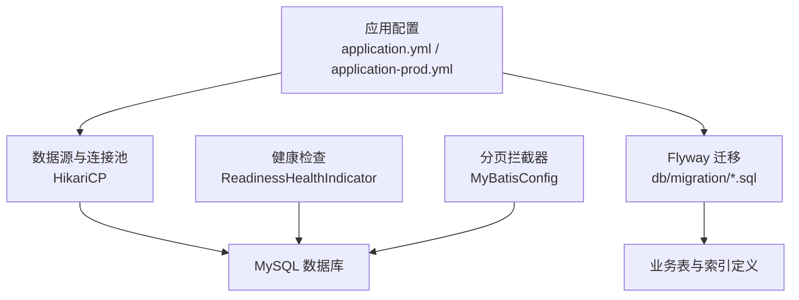
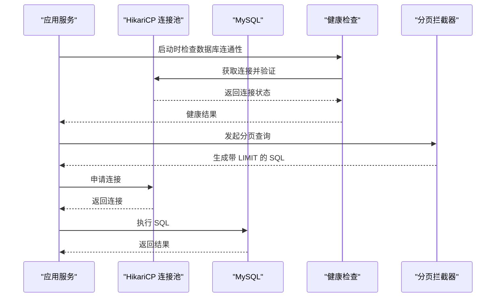
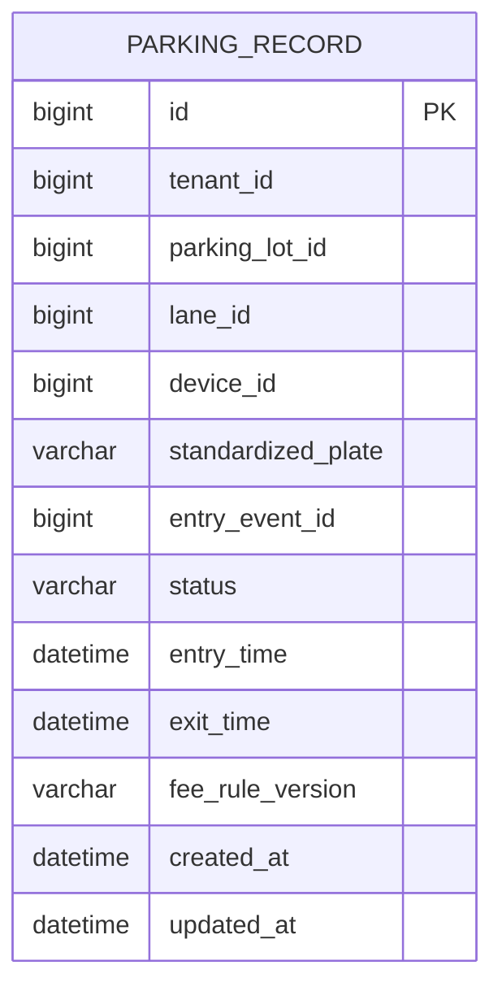
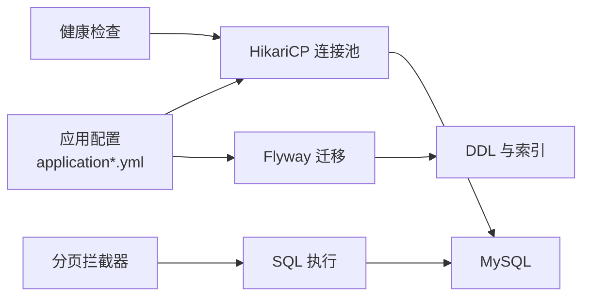

# 数据库优化

<cite>
**本文引用的文件列表**
- [application.yml](file://parking-boot/src/main/resources/application.yml)
- [application-prod.yml](file://parking-boot/src/main/resources/application-prod.yml)
- [application-docker.yml](file://parking-boot/src/main/resources/application-docker.yml)
- [MyBatisConfig.java](file://parking-boot/src/main/java/com/jushan/boot/config/MyBatisConfig.java)
- [ReadinessHealthIndicator.java](file://parking-boot/src/main/java/com/jushan/boot/health/ReadinessHealthIndicator.java)
- [V20260711002__sys_user_and_login_log.sql](file://parking-boot/src/main/resources/db/migration/V20260711002__sys_user_and_login_log.sql)
- [V20260712017__parking_record.sql](file://parking-boot/src/main/resources/db/migration/V20260712017__parking_record.sql)
- [section_03_ddl.md](file://docs/开发计划/section_03_ddl.md)
</cite>

## 目录
1. [引言](#引言)
2. [项目结构](#项目结构)
3. [核心组件](#核心组件)
4. [架构总览](#架构总览)
5. [详细组件分析](#详细组件分析)
6. [依赖关系分析](#依赖关系分析)
7. [性能考量](#性能考量)
8. [故障排查指南](#故障排查指南)
9. [结论](#结论)
10. [附录](#附录)

## 引言
本指南面向停车 SaaS 平台的数据库性能优化，聚焦以下目标：
- 索引设计与优化策略（复合索引、覆盖索引、失效场景规避）
- 慢查询分析方法（执行计划解读、日志配置与分析工具）
- 连接池调优（HikariCP 参数、连接数与超时）
- 分库分表与数据归档（租户隔离、历史数据清理）
- MySQL 配置建议与监控指标采集方法

## 项目结构
本项目采用多模块 Spring Boot 工程，数据库相关能力集中在 parking-boot 应用层与 DDL 迁移脚本中；索引与性能规范在 DDL 设计文档中统一约定。

图表来源
- [application.yml:21-37](file://parking-boot/src/main/resources/application.yml#L21-L37)
- [application-prod.yml:16-32](file://parking-boot/src/main/resources/application-prod.yml#L16-L32)
- [MyBatisConfig.java:70-75](file://parking-boot/src/main/java/com/jushan/boot/config/MyBatisConfig.java#L70-L75)
- [ReadinessHealthIndicator.java:66-87](file://parking-boot/src/main/java/com/jushan/boot/health/ReadinessHealthIndicator.java#L66-L87)

章节来源
- [application.yml:21-37](file://parking-boot/src/main/resources/application.yml#L21-L37)
- [application-prod.yml:16-32](file://parking-boot/src/main/resources/application-prod.yml#L16-L32)
- [MyBatisConfig.java:70-75](file://parking-boot/src/main/java/com/jushan/boot/config/MyBatisConfig.java#L70-L75)
- [ReadinessHealthIndicator.java:66-87](file://parking-boot/src/main/java/com/jushan/boot/health/ReadinessHealthIndicator.java#L66-L87)

## 核心组件
- 数据源与连接池：通过 HikariCP 管理连接，提供最大连接数、空闲超时、获取超时等关键参数。
- 分页控制：通过 MyBatis 分页插件限制最大页大小，避免深度分页拖垮数据库。
- 健康检查：启动时校验数据库连通性，便于快速发现连接问题。
- 迁移与索引：使用 Flyway 管理 DDL，集中定义索引与约束。

章节来源
- [application.yml:21-37](file://parking-boot/src/main/resources/application.yml#L21-L37)
- [application-prod.yml:22-26](file://parking-boot/src/main/resources/application-prod.yml#L22-L26)
- [MyBatisConfig.java:70-75](file://parking-boot/src/main/java/com/jushan/boot/config/MyBatisConfig.java#L70-L75)
- [ReadinessHealthIndicator.java:66-87](file://parking-boot/src/main/java/com/jushan/boot/health/ReadinessHealthIndicator.java#L66-L87)

## 架构总览
从应用到数据库的关键路径如下：
- 应用读取配置初始化 HikariCP 连接池
- 业务请求经 MyBatis 分页拦截器生成 SQL
- 执行前由健康检查确保连接可用
- 迁移脚本保证表结构与索引一致

图表来源
- [ReadinessHealthIndicator.java:66-87](file://parking-boot/src/main/java/com/jushan/boot/health/ReadinessHealthIndicator.java#L66-L87)
- [MyBatisConfig.java:70-75](file://parking-boot/src/main/java/com/jushan/boot/config/MyBatisConfig.java#L70-L75)
- [application.yml:21-37](file://parking-boot/src/main/resources/application.yml#L21-L37)

## 详细组件分析

### 索引设计与优化策略
- 基础规范
  - 所有业务表必须包含 tenant_id 与 deleted_at 索引，确保多租户隔离与软删除过滤高效。
  - 高频查询字段建立组合索引，例如按“租户+车场+时间”或“租户+车场+车牌”的组合。
  - 车牌统一大写存储，避免大小写混合导致索引失效；模糊搜索使用前缀匹配或搜索引擎。
  - 时间字段频繁用于范围查询，建议建立时间索引，必要时考虑分区。
  - 大表（如进出记录、订单）建议按 tenant_id 或时间进行分表/分区规划，控制单表规模。
- 复合索引设计原则
  - 将等值条件列置于左侧，范围条件列置后，遵循最左前缀原则。
  - 优先选择区分度高的列作为前导列，减少回表概率。
- 覆盖索引使用
  - 尽量让查询所需列落在索引中，避免回表。
  - 对报表类只读查询，可构建专用覆盖索引提升吞吐。
- 索引失效场景避免
  - 避免对索引列使用函数或表达式计算。
  - 避免隐式类型转换导致索引失效。
  - 避免全表扫描的 LIKE '%xxx' 模式，改用前缀匹配或全文检索。
- 功能性唯一索引
  - 利用 MySQL 8 功能索引实现条件唯一约束，例如仅对“在场”状态做唯一性保障，防止重复入场。

章节来源
- [section_03_ddl.md:2014-2026](file://docs/开发计划/section_03_ddl.md#L2014-L2026)
- [V20260712017__parking_record.sql:27-37](file://parking-boot/src/main/resources/db/migration/V20260712017__parking_record.sql#L27-L37)
- [V20260711002__sys_user_and_login_log.sql:38-41](file://parking-boot/src/main/resources/db/migration/V20260711002__sys_user_and_login_log.sql#L38-L41)

#### 示例：停车记录表索引设计

图表来源
- [V20260712017__parking_record.sql:11-37](file://parking-boot/src/main/resources/db/migration/V20260712017__parking_record.sql#L11-L37)

### 慢查询分析方法
- EXPLAIN 执行计划解读要点
  - type：访问类型，优先走 ref/range/const，尽量避免 ALL。
  - key/key_len：实际使用的索引及长度，评估是否命中预期索引。
  - rows：预估扫描行数，结合 filtered 估算实际 IO。
  - Extra：关注 Using filesort、Using temporary、Using index（覆盖索引）。
- 慢查询日志配置与分析工具
  - 建议在 MySQL 侧开启 slow_query_log，设置 long_query_time 阈值，并将日志输出至文件或审计系统。
  - 使用 pt-query-digest、mysqldumpslow 等工具聚合热点 SQL。
  - 结合业务 TraceId 关联日志，定位具体请求链路。
- 应用侧配合
  - 通过健康检查与连接池监控，识别连接瓶颈。
  - 分页上限保护，避免深度分页引发慢查询。

章节来源
- [MyBatisConfig.java:70-75](file://parking-boot/src/main/java/com/jushan/boot/config/MyBatisConfig.java#L70-L75)
- [ReadinessHealthIndicator.java:66-87](file://parking-boot/src/main/java/com/jushan/boot/health/ReadinessHealthIndicator.java#L66-L87)

### 连接池调优配置（HikariCP）
- 关键参数
  - maximum-pool-size：最大连接数，需根据 CPU 核数、IO 特性与并发量综合评估。
  - minimum-idle：最小空闲连接，降低突发流量下的连接创建开销。
  - idle-timeout：空闲连接回收时间，避免长期占用资源。
  - connection-timeout：获取连接超时，防止线程长时间阻塞。
- 环境差异
  - 本地/测试默认较小连接数，生产通过环境变量注入更大容量。
  - Docker 开发环境与生产环境分别提供独立 profile 配置。
- 调优建议
  - 以压测为依据，逐步提高 maximum-pool-size，观察等待时间与错误率。
  - 合理设置 connection-timeout，避免雪崩效应。
  - 结合慢查询治理，减少长事务与锁竞争。

章节来源
- [application.yml:21-37](file://parking-boot/src/main/resources/application.yml#L21-L37)
- [application-prod.yml:22-26](file://parking-boot/src/main/resources/application-prod.yml#L22-L26)
- [application-docker.yml:15-25](file://parking-boot/src/main/resources/application-docker.yml#L15-L25)

### 分库分表策略与数据归档方案
- 分库分表策略
  - 按租户维度拆分：tenant_id 作为路由键，天然支持多租户隔离与水平扩展。
  - 按时间维度拆分：对高写入日志表（如设备快照、进出记录）按时间分区或分表，便于冷热分离与清理。
  - 大表治理：对 parking_order、vehicle_access_log 等大表制定分片策略，控制单表规模。
- 数据归档方案
  - 保留期限：操作日志 1 年、车辆进出记录 3 年，超期自动归档至冷存储。
  - 归档索引：维护 archive_data 索引表，记录原表名、记录 ID、归档时间、冷存路径与时间范围。
  - 查询体验：归档数据只读，查询时显示“已归档”标识，响应时间控制在秒级以内。
- 历史数据清理策略
  - 定时任务按保留策略批量迁移至归档表，再物理删除热区数据。
  - 清理过程分批提交，避免长事务与锁竞争。
  - 归档完成后更新 archive_data 索引表，保持可追溯性。

章节来源
- [section_03_ddl.md:2029-2042](file://docs/开发计划/section_03_ddl.md#L2029-L2042)
- [section_03_ddl.md:1981-2011](file://docs/开发计划/section_03_ddl.md#L1981-L2011)

### MySQL 配置优化建议与监控指标采集
- 配置建议
  - 字符集与排序规则：utf8mb4 + utf8mb4_unicode_ci，统一编码与比较行为。
  - 连接数与缓冲：根据实例规格调整 max_connections、innodb_buffer_pool_size 等。
  - 日志与审计：开启慢查询日志，合理设置 long_query_time，定期导出分析。
- 监控指标采集
  - 连接池指标：活跃连接、等待队列、获取耗时。
  - 数据库指标：QPS/TPS、慢查询数量、锁等待、缓冲命中率。
  - 健康检查：应用侧健康探针探测数据库连通性与版本信息。
- 工具与集成
  - 使用 Micrometer 暴露指标，对接 Prometheus/Grafana 可视化。
  - 结合 Actuator health 端点，统一暴露健康状态。

章节来源
- [section_03_ddl.md:2014-2026](file://docs/开发计划/section_03_ddl.md#L2014-L2026)
- [ReadinessHealthIndicator.java:66-87](file://parking-boot/src/main/java/com/jushan/boot/health/ReadinessHealthIndicator.java#L66-L87)

## 依赖关系分析
- 应用配置驱动连接池与迁移
- 迁移脚本定义表结构与索引
- 健康检查与分页拦截器影响运行时性能与稳定性

图表来源
- [application.yml:21-37](file://parking-boot/src/main/resources/application.yml#L21-L37)
- [application-prod.yml:22-32](file://parking-boot/src/main/resources/application-prod.yml#L22-L32)
- [MyBatisConfig.java:70-75](file://parking-boot/src/main/java/com/jushan/boot/config/MyBatisConfig.java#L70-L75)
- [ReadinessHealthIndicator.java:66-87](file://parking-boot/src/main/java/com/jushan/boot/health/ReadinessHealthIndicator.java#L66-L87)

章节来源
- [application.yml:21-37](file://parking-boot/src/main/resources/application.yml#L21-L37)
- [application-prod.yml:22-32](file://parking-boot/src/main/resources/application-prod.yml#L22-L32)
- [MyBatisConfig.java:70-75](file://parking-boot/src/main/java/com/jushan/boot/config/MyBatisConfig.java#L70-L75)
- [ReadinessHealthIndicator.java:66-87](file://parking-boot/src/main/java/com/jushan/boot/health/ReadinessHealthIndicator.java#L66-L87)

## 性能考量
- 索引命中优先：通过 EXPLAIN 验证 key 与 rows，确保走索引且扫描行数可控。
- 覆盖索引：为高频只读查询构建覆盖索引，减少回表。
- 分页保护：限制最大页大小，避免深度分页造成数据库压力。
- 连接池容量：依据压测结果动态调整最大连接数与超时，避免连接争用。
- 归档与清理：按时效策略归档历史数据，保持热表轻量。

[本节为通用指导，不直接分析具体文件]

## 故障排查指南
- 连接失败
  - 检查健康检查返回状态与错误信息，确认 URL、用户名、密码与网络可达性。
- 连接耗尽
  - 观察连接池最大连接数与等待时间，结合慢查询治理减少长事务。
- 慢查询频发
  - 启用慢查询日志，使用 pt-query-digest 聚合热点 SQL，针对性优化索引与 SQL。
- 分页异常
  - 检查分页拦截器最大页限制，避免前端传入过大 page size。

章节来源
- [ReadinessHealthIndicator.java:66-87](file://parking-boot/src/main/java/com/jushan/boot/health/ReadinessHealthIndicator.java#L66-L87)
- [MyBatisConfig.java:70-75](file://parking-boot/src/main/java/com/jushan/boot/config/MyBatisConfig.java#L70-L75)

## 结论
通过规范的索引设计、严格的分页保护、合理的连接池配置以及完善的数据归档策略，可在多租户停车 SaaS 场景中显著提升数据库性能与稳定性。建议持续以 EXPLAIN 与慢查询日志为抓手，结合压测与监控指标，形成闭环优化机制。

[本节为总结，不直接分析具体文件]

## 附录
- 常用命令与工具
  - EXPLAIN ANALYZE：深入分析执行计划与真实耗时。
  - pt-query-digest：聚合慢查询，定位热点 SQL。
  - mysqldumpslow：快速统计慢查询分布。
- 参考配置位置
  - 连接池参数：application.yml、application-prod.yml、application-docker.yml
  - 分页限制：MyBatisConfig.java
  - 健康检查：ReadinessHealthIndicator.java
  - 索引与归档：section_03_ddl.md、各迁移脚本

章节来源
- [application.yml:21-37](file://parking-boot/src/main/resources/application.yml#L21-L37)
- [application-prod.yml:22-32](file://parking-boot/src/main/resources/application-prod.yml#L22-L32)
- [application-docker.yml:15-25](file://parking-boot/src/main/resources/application-docker.yml#L15-L25)
- [MyBatisConfig.java:70-75](file://parking-boot/src/main/java/com/jushan/boot/config/MyBatisConfig.java#L70-L75)
- [ReadinessHealthIndicator.java:66-87](file://parking-boot/src/main/java/com/jushan/boot/health/ReadinessHealthIndicator.java#L66-L87)
- [section_03_ddl.md:2014-2042](file://docs/开发计划/section_03_ddl.md#L2014-L2042)