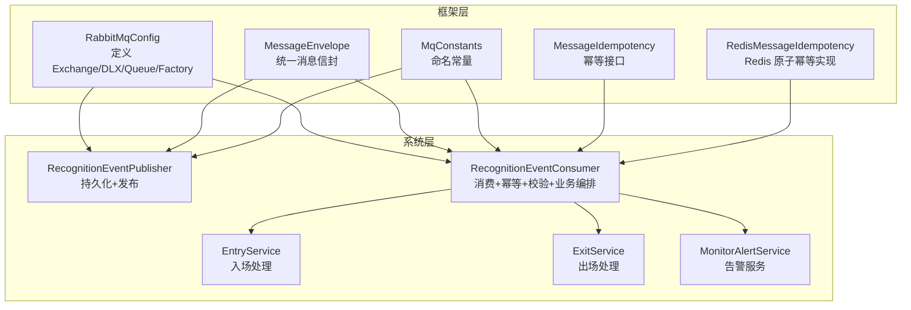
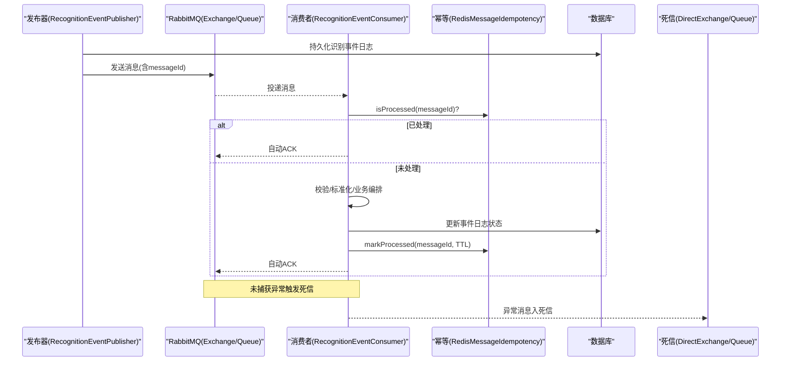
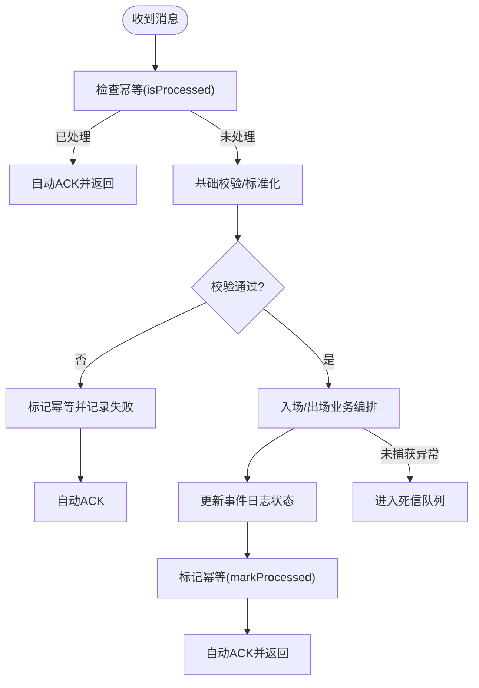
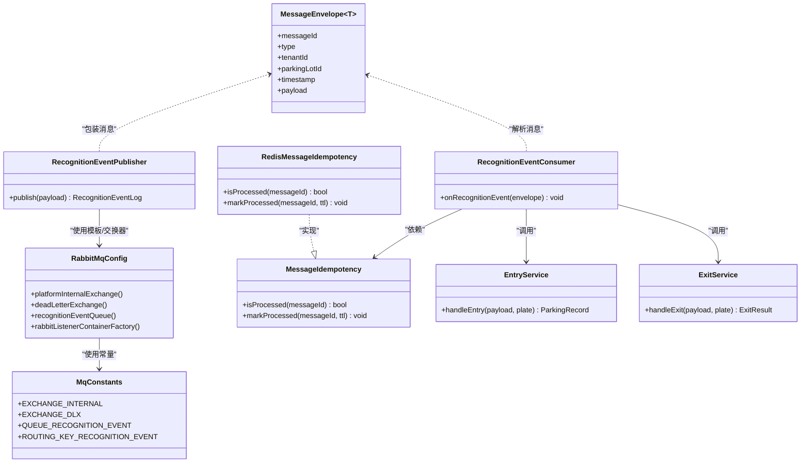

# 消息队列优化

<cite>
**本文引用的文件**   
- [RabbitMqConfig.java](file://parking-framework/src/main/java/com/jushan/framework/mq/RabbitMqConfig.java)
- [MessageEnvelope.java](file://parking-framework/src/main/java/com/jushan/framework/mq/MessageEnvelope.java)
- [MqConstants.java](file://parking-framework/src/main/java/com/jushan/framework/mq/MqConstants.java)
- [RedisMessageIdempotency.java](file://parking-framework/src/main/java/com/jushan/framework/mq/RedisMessageIdempotency.java)
- [MessageIdempotency.java](file://parking-framework/src/main/java/com/jushan/framework/mq/MessageIdempotency.java)
- [RecognitionEventConsumer.java](file://parking-system/src/main/java/com/jushan/system/event/RecognitionEventConsumer.java)
- [RecognitionEventPublisher.java](file://parking-system/src/main/java/com/jushan/system/event/RecognitionEventPublisher.java)
- [EntryService.java](file://parking-system/src/main/java/com/jushan/system/service/EntryService.java)
- [ExitService.java](file://parking-system/src/main/java/com/jushan/system/service/ExitService.java)
- [MonitorAlertService.java](file://parking-system/src/main/java/com/jushan/system/service/MonitorAlertService.java)
- [RabbitMqInfrastructureTest.java](file://parking-boot/src/test/java/com/jushan/boot/mq/RabbitMqInfrastructureTest.java)
</cite>

## 目录
1. [引言](#引言)
2. [项目结构](#项目结构)
3. [核心组件](#核心组件)
4. [架构总览](#架构总览)
5. [详细组件分析](#详细组件分析)
6. [依赖关系分析](#依赖关系分析)
7. [性能与并发调优](#性能与并发调优)
8. [积压处理与死信策略](#积压处理与死信策略)
9. [重试机制优化](#重试机制优化)
10. [幂等性保证机制](#幂等性保证机制)
11. [监控指标与告警建议](#监控指标与告警建议)
12. [故障排查指南](#故障排查指南)
13. [结论](#结论)

## 引言
本指南面向使用 RabbitMQ 的异步消息场景，聚焦消费者并发度、批量处理、积压治理、重试与幂等、以及监控与性能调优。文档基于仓库中现有实现进行提炼与扩展，既给出落地方案，也提供可操作的配置与流程建议。

## 项目结构
本项目在框架层提供统一的 MQ 基础设施（Exchange、DLX、模板、监听器工厂、幂等接口及 Redis 实现），业务层通过发布器投递识别事件，消费者完成校验、入库与业务编排（入场/出场）。

**图表来源**
- [RabbitMqConfig.java:63-101](file://parking-framework/src/main/java/com/jushan/framework/mq/RabbitMqConfig.java#L63-L101)
- [MessageEnvelope.java:27-48](file://parking-framework/src/main/java/com/jushan/framework/mq/MessageEnvelope.java#L27-L48)
- [MqConstants.java:30-74](file://parking-framework/src/main/java/com/jushan/framework/mq/MqConstants.java#L30-L74)
- [MessageIdempotency.java:21-38](file://parking-framework/src/main/java/com/jushan/framework/mq/MessageIdempotency.java#L21-L38)
- [RedisMessageIdempotency.java:35-51](file://parking-framework/src/main/java/com/jushan/framework/mq/RedisMessageIdempotency.java#L35-L51)
- [RecognitionEventPublisher.java:38-102](file://parking-system/src/main/java/com/jushan/system/event/RecognitionEventPublisher.java#L38-L102)
- [RecognitionEventConsumer.java:57-176](file://parking-system/src/main/java/com/jushan/system/event/RecognitionEventConsumer.java#L57-L176)
- [EntryService.java:44-131](file://parking-system/src/main/java/com/jushan/system/service/EntryService.java#L44-L131)
- [ExitService.java:47-134](file://parking-system/src/main/java/com/jushan/system/service/ExitService.java#L47-L134)
- [MonitorAlertService.java:180-205](file://parking-system/src/main/java/com/jushan/system/service/MonitorAlertService.java#L180-L205)

**章节来源**
- [RabbitMqConfig.java:53-175](file://parking-framework/src/main/java/com/jushan/framework/mq/RabbitMqConfig.java#L53-L175)
- [MessageEnvelope.java:27-137](file://parking-framework/src/main/java/com/jushan/framework/mq/MessageEnvelope.java#L27-L137)
- [MqConstants.java:24-74](file://parking-framework/src/main/java/com/jushan/framework/mq/MqConstants.java#L24-L74)
- [MessageIdempotency.java:21-38](file://parking-framework/src/main/java/com/jushan/framework/mq/MessageIdempotency.java#L21-L38)
- [RedisMessageIdempotency.java:35-90](file://parking-framework/src/main/java/com/jushan/framework/mq/RedisMessageIdempotency.java#L35-L90)
- [RecognitionEventPublisher.java:38-102](file://parking-system/src/main/java/com/jushan/system/event/RecognitionEventPublisher.java#L38-L102)
- [RecognitionEventConsumer.java:57-176](file://parking-system/src/main/java/com/jushan/system/event/RecognitionEventConsumer.java#L57-L176)
- [EntryService.java:44-131](file://parking-system/src/main/java/com/jushan/system/service/EntryService.java#L44-L131)
- [ExitService.java:47-134](file://parking-system/src/main/java/com/jushan/system/service/ExitService.java#L47-L134)
- [MonitorAlertService.java:180-205](file://parking-system/src/main/java/com/jushan/system/service/MonitorAlertService.java#L180-L205)

## 核心组件
- 平台内部 Exchange/DLX/队列：集中声明，业务模块按需绑定；支持 JSON 序列化与发送回调日志。
- 监听器容器工厂：默认 AUTO ACK，预取计数、并发数、最大并发数已设置。
- 消息信封：统一封装 messageId/type/tenant/parkingLot/timestamp/payload。
- 幂等接口与 Redis 实现：基于 SETNX 原子操作，TTL 控制键生命周期。
- 识别事件发布器：先落库再发 MQ，MQ 不可用或失败不阻断主流程。
- 识别事件消费者：消息级幂等 + 基础校验 + 业务编排（入场/出场）+ 结果回写。

**章节来源**
- [RabbitMqConfig.java:63-162](file://parking-framework/src/main/java/com/jushan/framework/mq/RabbitMqConfig.java#L63-L162)
- [MessageEnvelope.java:27-137](file://parking-framework/src/main/java/com/jushan/framework/mq/MessageEnvelope.java#L27-L137)
- [MessageIdempotency.java:21-38](file://parking-framework/src/main/java/com/jushan/framework/mq/MessageIdempotency.java#L21-L38)
- [RedisMessageIdempotency.java:35-90](file://parking-framework/src/main/java/com/jushan/framework/mq/RedisMessageIdempotency.java#L35-L90)
- [RecognitionEventPublisher.java:38-102](file://parking-system/src/main/java/com/jushan/system/event/RecognitionEventPublisher.java#L38-L102)
- [RecognitionEventConsumer.java:57-176](file://parking-system/src/main/java/com/jushan/system/event/RecognitionEventConsumer.java#L57-L176)

## 架构总览
识别事件从发布器进入平台内部 Topic Exchange，路由到识别事件队列；消费者拉取后执行幂等检查、校验与业务编排，成功则标记幂等并更新日志，异常则进入 DLX。

**图表来源**
- [RecognitionEventPublisher.java:64-102](file://parking-system/src/main/java/com/jushan/system/event/RecognitionEventPublisher.java#L64-L102)
- [RabbitMqConfig.java:63-101](file://parking-framework/src/main/java/com/jushan/framework/mq/RabbitMqConfig.java#L63-L101)
- [RecognitionEventConsumer.java:97-176](file://parking-system/src/main/java/com/jushan/system/event/RecognitionEventConsumer.java#L97-L176)
- [RedisMessageIdempotency.java:53-89](file://parking-framework/src/main/java/com/jushan/framework/mq/RedisMessageIdempotency.java#L53-L89)

## 详细组件分析

### 消费者并发度与批量处理
- 预取计数（prefetchCount）：默认 10，控制单消费者未确认消息上限，避免内存膨胀与背压。
- 初始并发消费者（concurrentConsumers）：默认 1，启动即创建的基础线程数。
- 最大并发消费者（maxConcurrentConsumers）：默认 5，按负载动态扩容至该阈值。
- 批量处理：当前为单条处理模式；如需批量，可在业务侧聚合固定时间窗或数量阈值后提交，但需确保幂等与事务边界清晰。

建议
- 根据 CPU/IO 特征调整 prefetchCount 与并发范围，使吞吐与延迟平衡。
- 对耗时 IO 任务（如外部调用）采用独立线程池隔离，避免阻塞消费者线程。

**章节来源**
- [RabbitMqConfig.java:147-162](file://parking-framework/src/main/java/com/jushan/framework/mq/RabbitMqConfig.java#L147-L162)

### 消息积压处理方案
- 积压监控告警：结合队列长度、消费速率、DLX 堆积、消费者空闲率等指标设定阈值告警。
- 动态扩容：依据 maxConcurrentConsumers 自动扩容；必要时水平扩展实例。
- 死信队列处理：将失败消息转入 DLX，保留 messageId，便于人工重放与离线修复。

实践要点
- 对关键队列设置合理的 TTL 与 max-length，防止无限增长。
- 建立“积压看板”，联动告警与自动化扩缩容策略。

**章节来源**
- [RabbitMqConfig.java:63-101](file://parking-framework/src/main/java/com/jushan/framework/mq/RabbitMqConfig.java#L63-L101)
- [RabbitMqConfig.java:169-174](file://parking-framework/src/main/java/com/jushan/framework/mq/RabbitMqConfig.java#L169-L174)

### 重试机制优化
- 当前消费者采用 AUTO ACK 模式：正常路径自动 ACK；业务异常被捕获后记录失败但不重试；未捕获异常进入 DLX。
- 推荐策略：
  - 指数退避：对可恢复错误（如临时网络抖动）采用指数退避+抖动，限制最大重试次数。
  - 最大重试次数：超过阈值直接入 DLX，避免雪崩。
  - 失败消息处理：DLX 消费端进行二次校验与补偿，必要时人工介入。

注意
- 若引入手动 ACK，需确保幂等与去重逻辑覆盖重试窗口。

**章节来源**
- [RecognitionEventConsumer.java:89-176](file://parking-system/src/main/java/com/jushan/system/event/RecognitionEventConsumer.java#L89-L176)
- [RabbitMqConfig.java:147-162](file://parking-framework/src/main/java/com/jushan/framework/mq/RabbitMqConfig.java#L147-L162)

### 幂等性保证机制
- 消息级幂等：基于 messageId 的 Redis SETNX 原子操作，TTL 控制清理周期。
- 业务级幂等：eventId 唯一约束，防止重复业务事件产生重复记录。
- 分布式锁：在热点资源竞争场景（如容量更新）可使用分布式锁保护临界区，避免竞态。

设计建议
- 幂等 Key 前缀规范：mq:consumed:{messageId}，TTL 建议与业务容忍窗口一致（例如 72 小时）。
- 幂等检查前置：消费者入口优先判断是否已处理，命中则直接 ACK。
- 幂等写入后置：业务成功后再标记，避免“假成功”导致重复处理。

**章节来源**
- [MessageIdempotency.java:21-38](file://parking-framework/src/main/java/com/jushan/framework/mq/MessageIdempotency.java#L21-L38)
- [RedisMessageIdempotency.java:35-90](file://parking-framework/src/main/java/com/jushan/framework/mq/RedisMessageIdempotency.java#L35-L90)
- [RecognitionEventConsumer.java:108-176](file://parking-system/src/main/java/com/jushan/system/event/RecognitionEventConsumer.java#L108-L176)

### 消费者处理流程（流程图）

**图表来源**
- [RecognitionEventConsumer.java:97-176](file://parking-system/src/main/java/com/jushan/system/event/RecognitionEventConsumer.java#L97-L176)
- [RedisMessageIdempotency.java:53-89](file://parking-framework/src/main/java/com/jushan/framework/mq/RedisMessageIdempotency.java#L53-L89)

## 依赖关系分析
- 消费者依赖幂等接口与 Redis 实现，用于快速去重。
- 消费者依赖入场/出场服务完成核心业务。
- 发布器依赖 RabbitTemplate 与日志 Mapper，具备 MQ 降级能力。
- 框架层提供 Exchange/DLX/Queue/Factory 的统一装配。

**图表来源**
- [RabbitMqConfig.java:63-162](file://parking-framework/src/main/java/com/jushan/framework/mq/RabbitMqConfig.java#L63-L162)
- [MessageEnvelope.java:27-137](file://parking-framework/src/main/java/com/jushan/framework/mq/MessageEnvelope.java#L27-L137)
- [MqConstants.java:30-74](file://parking-framework/src/main/java/com/jushan/framework/mq/MqConstants.java#L30-L74)
- [MessageIdempotency.java:21-38](file://parking-framework/src/main/java/com/jushan/framework/mq/MessageIdempotency.java#L21-L38)
- [RedisMessageIdempotency.java:35-90](file://parking-framework/src/main/java/com/jushan/framework/mq/RedisMessageIdempotency.java#L35-L90)
- [RecognitionEventPublisher.java:38-102](file://parking-system/src/main/java/com/jushan/system/event/RecognitionEventPublisher.java#L38-L102)
- [RecognitionEventConsumer.java:57-176](file://parking-system/src/main/java/com/jushan/system/event/RecognitionEventConsumer.java#L57-L176)
- [EntryService.java:44-131](file://parking-system/src/main/java/com/jushan/system/service/EntryService.java#L44-L131)
- [ExitService.java:47-134](file://parking-system/src/main/java/com/jushan/system/service/ExitService.java#L47-L134)

## 性能与并发调优
- 预取计数（prefetchCount）：在高吞吐低延迟场景可适当提高，但需评估消费者处理能力与下游依赖（DB/缓存）瓶颈。
- 并发消费者（concurrentConsumers/maxConcurrentConsumers）：CPU 密集型任务以 CPU 核数为参考；IO 密集型可按连接池与下游限流决定。
- 批量处理：若业务允许，可引入批处理窗口（时间/数量），减少 DB 往返与事务开销，同时保持幂等与一致性。
- 序列化：JSON 转换开销可通过对象复用、字段裁剪降低。
- 连接与线程池：合理设置连接池大小与消费者线程池，避免过度竞争。

[本节为通用指导，无需特定文件引用]

## 积压处理与死信策略
- 积压监控：关注队列长度、消费速率、消费者空闲率、DLX 堆积量。
- 动态扩容：利用 maxConcurrentConsumers 自动扩容；必要时横向扩展实例。
- 死信策略：消费失败（抛出异常）的消息进入 DLX，保留 messageId，支持人工重放与离线修复。
- 队列参数：为业务队列设置 TTL 与 max-length，避免无限增长。

**章节来源**
- [RabbitMqConfig.java:63-101](file://parking-framework/src/main/java/com/jushan/framework/mq/RabbitMqConfig.java#L63-L101)
- [RabbitMqConfig.java:169-174](file://parking-framework/src/main/java/com/jushan/framework/mq/RabbitMqConfig.java#L169-L174)

## 重试机制优化
- 指数退避：对可恢复错误采用指数退避+随机抖动，限制最大重试次数，避免雪崩。
- 最大重试次数：超过阈值转 DLX，交由人工或离线作业处理。
- 失败消息处理：DLX 消费者进行二次校验与补偿，必要时通知运营。

**章节来源**
- [RecognitionEventConsumer.java:89-176](file://parking-system/src/main/java/com/jushan/system/event/RecognitionEventConsumer.java#L89-L176)

## 幂等性保证机制
- 去重表设计：消息级幂等使用 Redis Key（mq:consumed:{messageId}），TTL 控制清理周期。
- Redis 原子操作：SETNX 保证并发安全，避免重复处理。
- 分布式锁：在热点资源（如容量更新）处加锁，避免并发冲突。
- 业务幂等：eventId 唯一约束作为最终防线。

**章节来源**
- [RedisMessageIdempotency.java:35-90](file://parking-framework/src/main/java/com/jushan/framework/mq/RedisMessageIdempotency.java#L35-L90)
- [MessageIdempotency.java:21-38](file://parking-framework/src/main/java/com/jushan/framework/mq/MessageIdempotency.java#L21-L38)
- [RecognitionEventConsumer.java:108-176](file://parking-system/src/main/java/com/jushan/system/event/RecognitionEventConsumer.java#L108-L176)

## 监控指标与告警建议
- 队列指标：长度、入队速率、出队速率、消费者数量、空闲率。
- 错误指标：DLX 堆积量、重试次数、超时率、异常类型分布。
- 业务指标：入场/出场成功率、费用计算耗时、订单生成耗时。
- 告警策略：阈值+趋势双维度，结合值班与自动化处置（扩容、限流、熔断）。

**章节来源**
- [MonitorAlertService.java:180-205](file://parking-system/src/main/java/com/jushan/system/service/MonitorAlertService.java#L180-L205)

## 故障排查指南
- 幂等测试：验证相同 messageId 第二次被识别为已处理；不同 messageId 互不影响。
- 重复投递：同一消息可被多次投递，消费侧负责幂等。
- 死信队列：确认 DLX 队列存在且可消费，定位失败原因。
- 序列化往返：确保消息体序列化/反序列化正确。

**章节来源**
- [RabbitMqInfrastructureTest.java:82-125](file://parking-boot/src/test/java/com/jushan/boot/mq/RabbitMqInfrastructureTest.java#L82-L125)

## 结论
通过合理的消费者并发度配置、完善的幂等与重试策略、有效的积压治理与监控告警，可以显著提升消息系统的稳定性与吞吐。建议在现有实现基础上，结合业务特征持续优化参数与流程，形成闭环的性能保障体系。