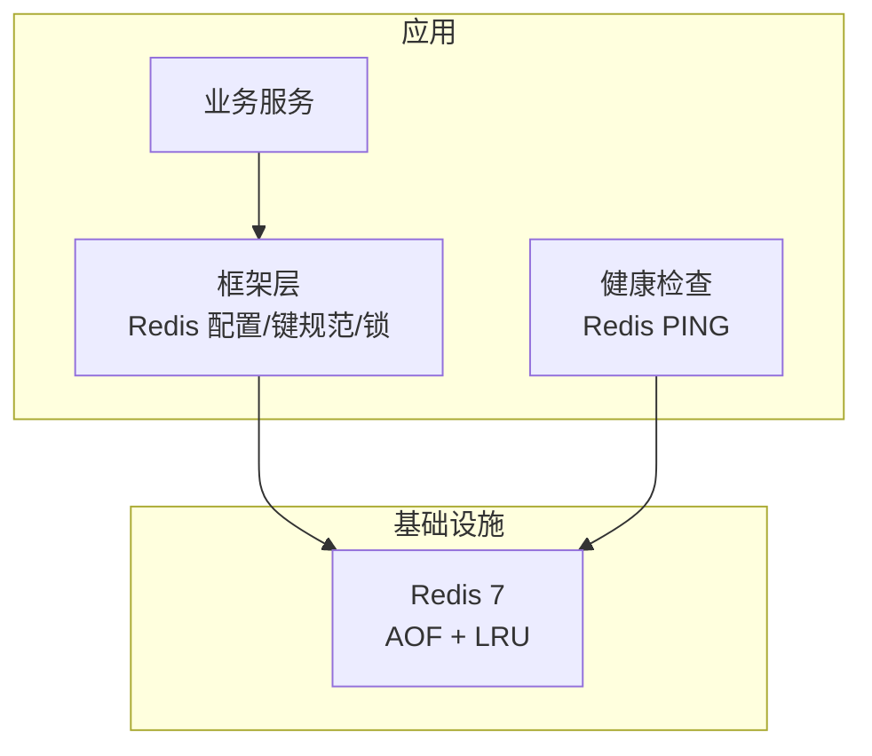
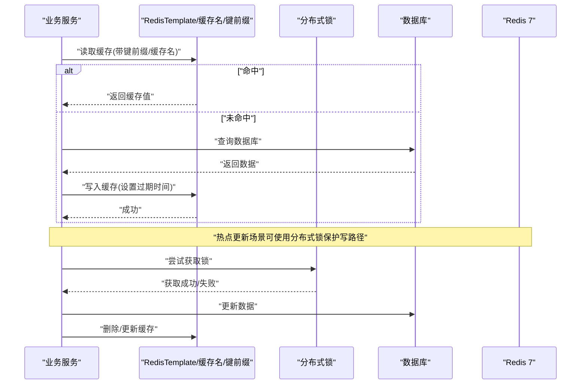
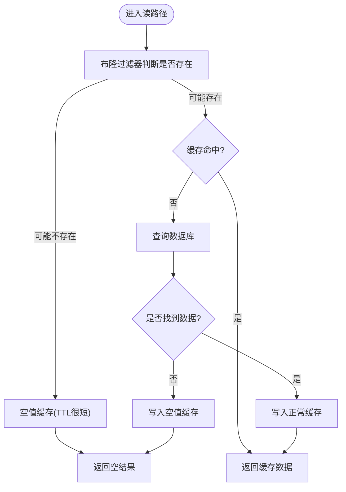
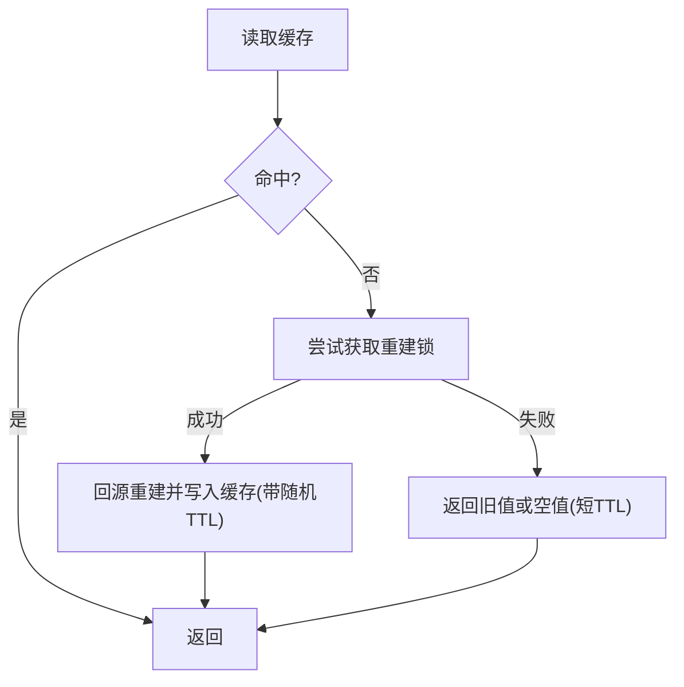
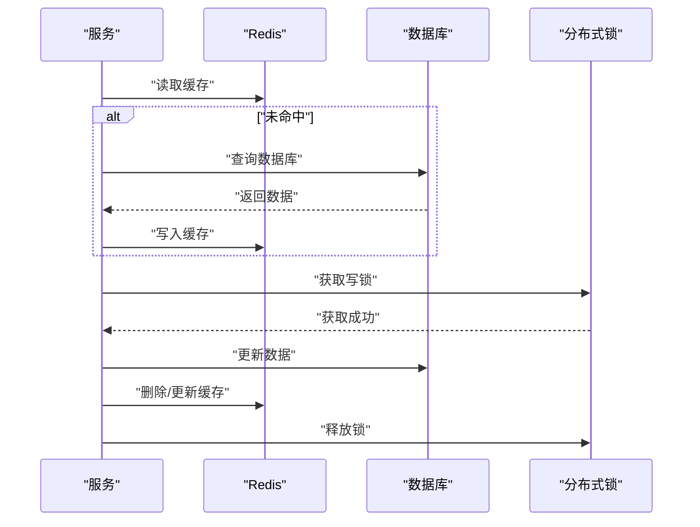
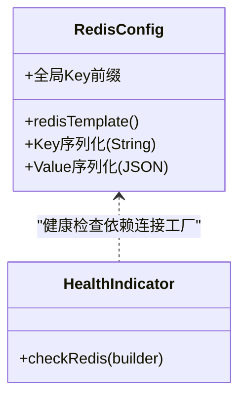
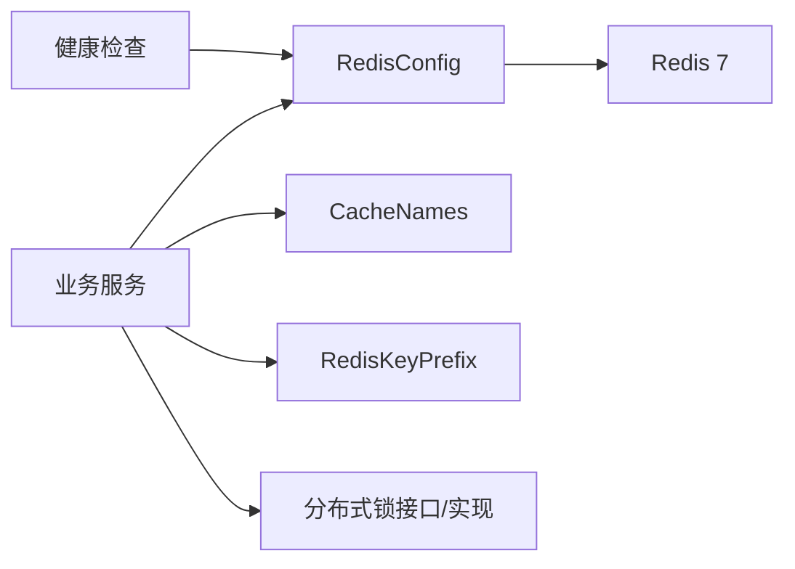

# 缓存优化

<cite>
**本文引用的文件**
- [docker-compose.yml](file://docker-compose.yml)
- [RedisConfig.java](file://parking-framework/src/main/java/com/jushan/framework/redis/RedisConfig.java)
- [CacheNames.java](file://parking-framework/src/main/java/com/jushan/framework/redis/CacheNames.java)
- [RedisKeyPrefix.java](file://parking-framework/src/main/java/com/jushan/framework/redis/RedisKeyPrefix.java)
- [DistributedLock.java](file://parking-framework/src/main/java/com/jushan/framework/lock/DistributedLock.java)
- [RedisDistributedLock.java](file://parking-framework/src/main/java/com/jushan/framework/lock/RedisDistributedLock.java)
- [ReadinessHealthIndicator.java](file://parking-boot/src/main/java/com/jushan/boot/health/ReadinessHealthIndicator.java)
- [CLAUDE.md](file://CLAUDE.md)
</cite>

## 目录
1. [引言](#引言)
2. [项目结构](#项目结构)
3. [核心组件](#核心组件)
4. [架构总览](#架构总览)
5. [详细组件分析](#详细组件分析)
6. [依赖关系分析](#依赖关系分析)
7. [性能考虑](#性能考虑)
8. [故障排查指南](#故障排查指南)
9. [结论](#结论)
10. [附录](#附录)

## 引言
本指南面向停车平台后端与运维团队，聚焦 Redis 缓存的性能优化与稳定性保障。内容覆盖命中率提升、穿透防护、雪崩防护、一致性保证、集群配置与监控指标等关键主题，并结合仓库中已有的 Redis 配置、键命名规范、分布式锁与健康检查能力，给出可落地的实践建议。

## 项目结构
本项目在框架层提供 Redis 通用配置、缓存名称常量与 Key 前缀规范；在启动健康检查中包含 Redis 连通性探测；在部署编排中定义了 Redis 实例的内存策略与持久化开关。这些为后续缓存优化提供了基础支撑。

**图表来源**
- [RedisConfig.java:1-70](file://parking-framework/src/main/java/com/jushan/framework/redis/RedisConfig.java#L1-L70)
- [CacheNames.java:1-40](file://parking-framework/src/main/java/com/jushan/framework/redis/CacheNames.java#L1-L40)
- [RedisKeyPrefix.java:1-67](file://parking-framework/src/main/java/com/jushan/framework/redis/RedisKeyPrefix.java#L1-L67)
- [ReadinessHealthIndicator.java:89-113](file://parking-boot/src/main/java/com/jushan/boot/health/ReadinessHealthIndicator.java#L89-L113)
- [docker-compose.yml:91-116](file://docker-compose.yml#L91-L116)

**章节来源**
- [RedisConfig.java:1-70](file://parking-framework/src/main/java/com/jushan/framework/redis/RedisConfig.java#L1-L70)
- [CacheNames.java:1-40](file://parking-framework/src/main/java/com/jushan/framework/redis/CacheNames.java#L1-L40)
- [RedisKeyPrefix.java:1-67](file://parking-framework/src/main/java/com/jushan/framework/redis/RedisKeyPrefix.java#L1-L67)
- [ReadinessHealthIndicator.java:89-113](file://parking-boot/src/main/java/com/jushan/boot/health/ReadinessHealthIndicator.java#L89-L113)
- [docker-compose.yml:91-116](file://docker-compose.yml#L91-L116)

## 核心组件
- Redis 通用配置：定义全局 Key 前缀、Key/Value 序列化策略（String + JSON），并安全降级（无连接工厂时不创建 Bean）。
- 缓存名称常量：按业务域划分独立缓存空间，避免跨域污染。
- Key 前缀规范：统一层级命名，便于管理与隔离。
- 分布式锁接口与实现：基于 SET NX PX 的轻量分布式锁，支持优雅降级。
- 健康检查：对 Redis 进行 PING 探测，辅助就绪探针。

**章节来源**
- [RedisConfig.java:1-70](file://parking-framework/src/main/java/com/jushan/framework/redis/RedisConfig.java#L1-L70)
- [CacheNames.java:1-40](file://parking-framework/src/main/java/com/jushan/framework/redis/CacheNames.java#L1-L40)
- [RedisKeyPrefix.java:1-67](file://parking-framework/src/main/java/com/jushan/framework/redis/RedisKeyPrefix.java#L1-L67)
- [DistributedLock.java:1-52](file://parking-framework/src/main/java/com/jushan/framework/lock/DistributedLock.java#L1-L52)
- [RedisDistributedLock.java:1-38](file://parking-framework/src/main/java/com/jushan/framework/lock/RedisDistributedLock.java#L1-L38)
- [ReadinessHealthIndicator.java:89-113](file://parking-boot/src/main/java/com/jushan/boot/health/ReadinessHealthIndicator.java#L89-L113)

## 架构总览
下图展示缓存相关的关键路径：业务调用通过框架层的 RedisTemplate 访问 Redis，使用统一的 Key 前缀与缓存名；热点数据可通过本地缓存+Redis 二级架构（见“架构约束”）；分布式锁用于并发控制与一致性保护；健康检查确保服务就绪。

**图表来源**
- [RedisConfig.java:1-70](file://parking-framework/src/main/java/com/jushan/framework/redis/RedisConfig.java#L1-L70)
- [CacheNames.java:1-40](file://parking-framework/src/main/java/com/jushan/framework/redis/CacheNames.java#L1-L40)
- [RedisKeyPrefix.java:1-67](file://parking-framework/src/main/java/com/jushan/framework/redis/RedisKeyPrefix.java#L1-L67)
- [RedisDistributedLock.java:1-38](file://parking-framework/src/main/java/com/jushan/framework/lock/RedisDistributedLock.java#L1-L38)

## 详细组件分析

### 组件一：缓存命中率提升策略
- 热点识别与预加载
  - 结合业务统计（如 QPS、访问频次）识别热点 Key，预热至 Redis；对字典/配置类数据，可在服务启动或定时任务中批量加载。
  - 参考架构约束中的 L1/L2 分层思想：热点配置/字典优先走本地缓存（短 TTL），并通过消息或事件刷新，降低 Redis 压力。
- 缓存键设计优化
  - 遵循统一前缀与层级命名，避免冲突与扫描风暴；将租户、资源维度纳入 Key，提高隔离性与命中率。
  - 使用稳定的业务标识作为 Key 后缀，减少变更带来的失效面扩大。
- 序列化方式选择
  - 当前采用 String + Jackson JSON 序列化，兼顾可读性与兼容性；对于大对象，评估压缩或分片存储，避免单次序列化开销过大。
- 过期策略与局部刷新
  - 合理设置 TTL，避免集中过期；对热点数据可采用随机抖动延长有效期，降低雪崩风险。
  - 对强一致要求低的场景，允许短暂不一致，配合读路径重试与兜底。

**章节来源**
- [RedisConfig.java:1-70](file://parking-framework/src/main/java/com/jushan/framework/redis/RedisConfig.java#L1-L70)
- [CacheNames.java:1-40](file://parking-framework/src/main/java/com/jushan/framework/redis/CacheNames.java#L1-L40)
- [RedisKeyPrefix.java:1-67](file://parking-framework/src/main/java/com/jushan/framework/redis/RedisKeyPrefix.java#L1-L67)
- [CLAUDE.md:491-496](file://CLAUDE.md#L491-L496)

### 组件二：缓存穿透防护方案
- 布隆过滤器
  - 在热点集合（如车牌、设备号）前增加布隆过滤器，快速判断不存在的数据，避免大量无效请求打到缓存与数据库。
- 空值缓存
  - 对确认不存在的 Key 缓存一个极短 TTL 的空值标记，防止重复穿透；注意控制容量与清理策略。
- 请求限流
  - 针对异常流量或恶意探测，结合令牌桶/滑动窗口在网关或应用层限流，保护下游。

[本节为概念流程，无需源码映射]

### 组件三：缓存雪崩防护措施
- 随机过期时间
  - 为热点 Key 的 TTL 添加随机抖动，避免同一时刻大规模失效。
- 互斥锁重建
  - 在缓存失效重建时加分布式锁，仅允许单实例回源重建，其余实例等待或返回旧值。
- 多级缓存架构
  - 引入本地缓存（Caffeine）作为 L1，Redis 作为 L2；本地缓存短 TTL，配合消息/事件刷新，进一步削峰。

**章节来源**
- [RedisDistributedLock.java:1-38](file://parking-framework/src/main/java/com/jushan/framework/lock/RedisDistributedLock.java#L1-L38)
- [CLAUDE.md:491-496](file://CLAUDE.md#L491-L496)

### 组件四：缓存一致性保证方案
- 读写穿透
  - 读路径：先查缓存，未命中再查库并回填；写路径：先更新数据库，再删除或更新缓存。
- 更新删除策略
  - 推荐“先更库后删缓存”，避免脏读；必要时结合延迟双删或订阅 binlog 异步删除。
- 分布式锁使用
  - 对高并发写热点（如余额、库存）加分布式锁串行化，配合数据库乐观锁（version）双重保护。

**图表来源**
- [RedisDistributedLock.java:1-38](file://parking-framework/src/main/java/com/jushan/framework/lock/RedisDistributedLock.java#L1-L38)
- [DistributedLock.java:1-52](file://parking-framework/src/main/java/com/jushan/framework/lock/DistributedLock.java#L1-L52)

**章节来源**
- [RedisDistributedLock.java:1-38](file://parking-framework/src/main/java/com/jushan/framework/lock/RedisDistributedLock.java#L1-L38)
- [DistributedLock.java:1-52](file://parking-framework/src/main/java/com/jushan/framework/lock/DistributedLock.java#L1-L52)
- [CLAUDE.md:497-506](file://CLAUDE.md#L497-L506)

### 组件五：Redis 集群配置优化与监控指标
- 内存与淘汰策略
  - 已启用 AOF 持久化与 allkeys-lru 淘汰策略，适合缓存场景；生产需根据数据规模调整 maxmemory。
- 连接与网络
  - 合理设置客户端连接池大小、超时与重试；避免长事务占用连接。
- 监控指标
  - 关注命中率、内存使用率、慢查询、主从延迟、连接数、命令耗时分布；结合健康检查与告警阈值。
- 健康检查
  - 应用侧已实现 Redis PING 健康检查，可作为就绪探针的一部分。

**图表来源**
- [RedisConfig.java:1-70](file://parking-framework/src/main/java/com/jushan/framework/redis/RedisConfig.java#L1-L70)
- [ReadinessHealthIndicator.java:89-113](file://parking-boot/src/main/java/com/jushan/boot/health/ReadinessHealthIndicator.java#L89-L113)
- [docker-compose.yml:111-116](file://docker-compose.yml#L111-L116)

**章节来源**
- [docker-compose.yml:91-116](file://docker-compose.yml#L91-L116)
- [ReadinessHealthIndicator.java:89-113](file://parking-boot/src/main/java/com/jushan/boot/health/ReadinessHealthIndicator.java#L89-L113)

## 依赖关系分析
- 组件耦合
  - 业务服务依赖框架层 RedisTemplate、缓存名与键前缀；分布式锁与缓存更新路径解耦，便于替换实现。
- 外部依赖
  - Redis 实例由编排文件管理，包含内存策略与持久化开关；健康检查依赖连接工厂。
- 潜在循环依赖
  - 当前配置以条件装配为主，避免在无 Redis 环境报错，降低耦合风险。

**图表来源**
- [RedisConfig.java:1-70](file://parking-framework/src/main/java/com/jushan/framework/redis/RedisConfig.java#L1-L70)
- [CacheNames.java:1-40](file://parking-framework/src/main/java/com/jushan/framework/redis/CacheNames.java#L1-L40)
- [RedisKeyPrefix.java:1-67](file://parking-framework/src/main/java/com/jushan/framework/redis/RedisKeyPrefix.java#L1-L67)
- [DistributedLock.java:1-52](file://parking-framework/src/main/java/com/jushan/framework/lock/DistributedLock.java#L1-L52)
- [RedisDistributedLock.java:1-38](file://parking-framework/src/main/java/com/jushan/framework/lock/RedisDistributedLock.java#L1-L38)
- [ReadinessHealthIndicator.java:89-113](file://parking-boot/src/main/java/com/jushan/boot/health/ReadinessHealthIndicator.java#L89-L113)

**章节来源**
- [RedisConfig.java:1-70](file://parking-framework/src/main/java/com/jushan/framework/redis/RedisConfig.java#L1-L70)
- [CacheNames.java:1-40](file://parking-framework/src/main/java/com/jushan/framework/redis/CacheNames.java#L1-L40)
- [RedisKeyPrefix.java:1-67](file://parking-framework/src/main/java/com/jushan/framework/redis/RedisKeyPrefix.java#L1-L67)
- [DistributedLock.java:1-52](file://parking-framework/src/main/java/com/jushan/framework/lock/DistributedLock.java#L1-L52)
- [RedisDistributedLock.java:1-38](file://parking-framework/src/main/java/com/jushan/framework/lock/RedisDistributedLock.java#L1-L38)
- [ReadinessHealthIndicator.java:89-113](file://parking-boot/src/main/java/com/jushan/boot/health/ReadinessHealthIndicator.java#L89-L113)

## 性能考虑
- 热点数据优先走本地缓存，缩短响应时间并降低 Redis 压力。
- 合理设置 TTL 与随机抖动，避免集中过期导致的雪崩。
- 使用合适的序列化器，避免大对象序列化瓶颈；必要时分片或压缩。
- 对写热点加分布式锁，配合数据库乐观锁，减少竞争与回源。
- 开启 AOF 与合理的淘汰策略，平衡数据可靠性与内存占用。

[本节为通用指导，无需源码映射]

## 故障排查指南
- 缓存不可用
  - 检查健康检查日志与 Redis PING 结果；确认连接工厂可用与网络可达。
- 命中率低
  - 审查 Key 设计与 TTL 策略；定位热点 Key 并评估是否需要本地缓存或预热。
- 雪崩现象
  - 检查是否集中过期；为热点 Key 增加随机抖动；在重建路径加锁。
- 一致性异常
  - 核对写路径顺序（先更库后删缓存）；在高并发写场景补充分布式锁与乐观锁。

**章节来源**
- [ReadinessHealthIndicator.java:89-113](file://parking-boot/src/main/java/com/jushan/boot/health/ReadinessHealthIndicator.java#L89-L113)
- [RedisDistributedLock.java:1-38](file://parking-framework/src/main/java/com/jushan/framework/lock/RedisDistributedLock.java#L1-L38)

## 结论
通过统一的键命名与序列化配置、热点数据的多级缓存、完善的穿透与雪崩防护、以及分布式锁与乐观锁的一致性保障，可有效提升缓存命中率与系统稳定性。结合健康检查与监控指标，持续观测与调优，形成闭环优化机制。

[本节为总结，无需源码映射]

## 附录
- 架构约束要点（节选）
  - L1 本地缓存（热点配置/字典，短 TTL，监听刷新）
  - L2 Redis（业务对象、会话、锁、计数，Cache-Aside + 更新失效）
  - 并发控制：分布式锁 + 数据库乐观锁（version）
  - 部署：健康探针、JSON 日志、配置外置

**章节来源**
- [CLAUDE.md:491-521](file://CLAUDE.md#L491-L521)