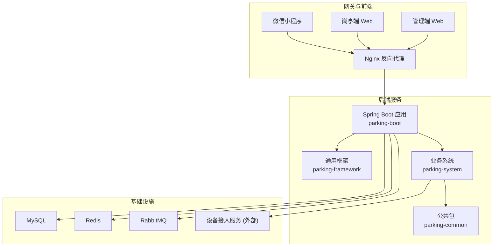
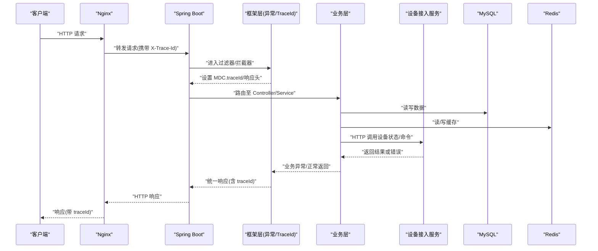
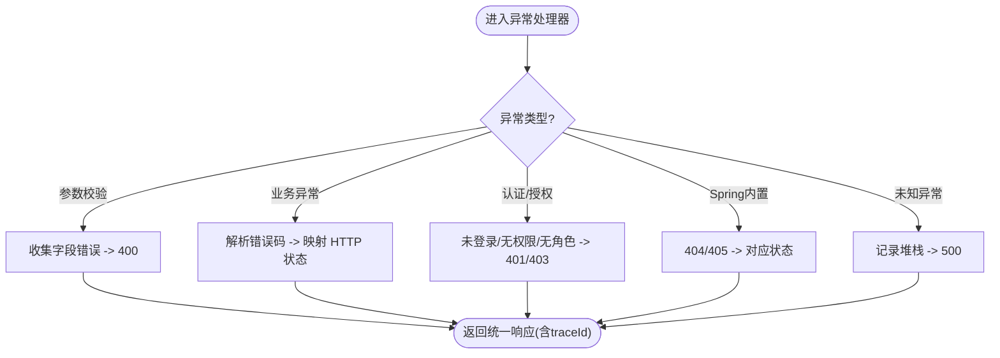
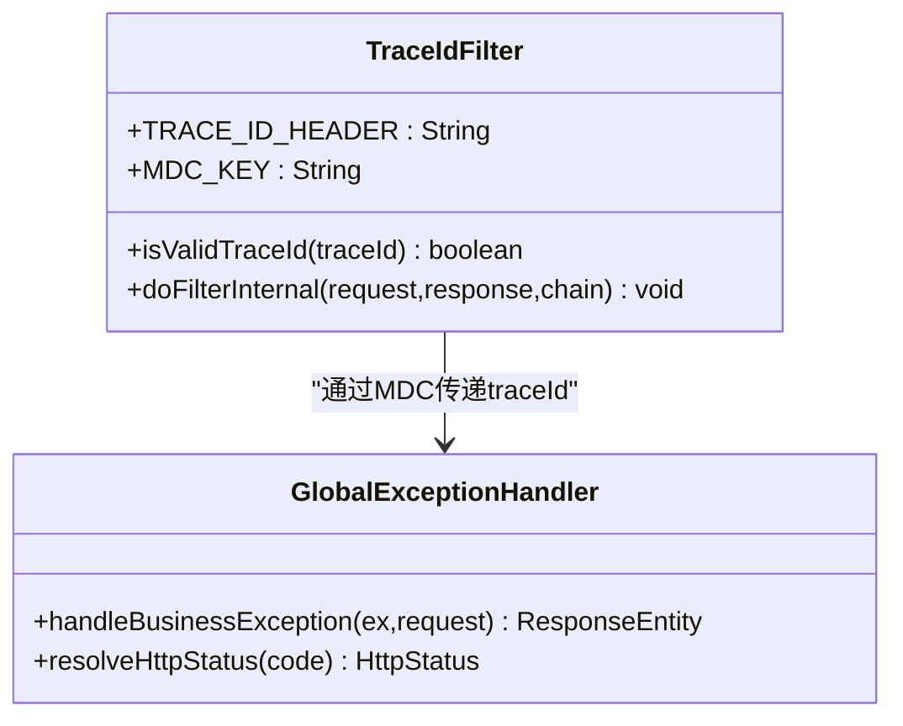
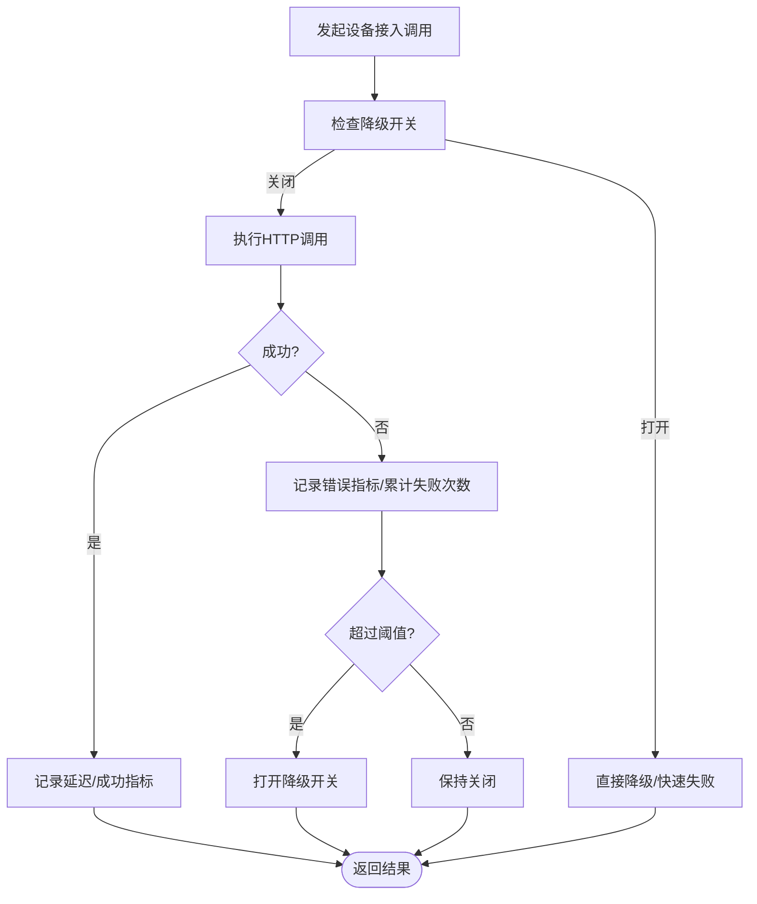
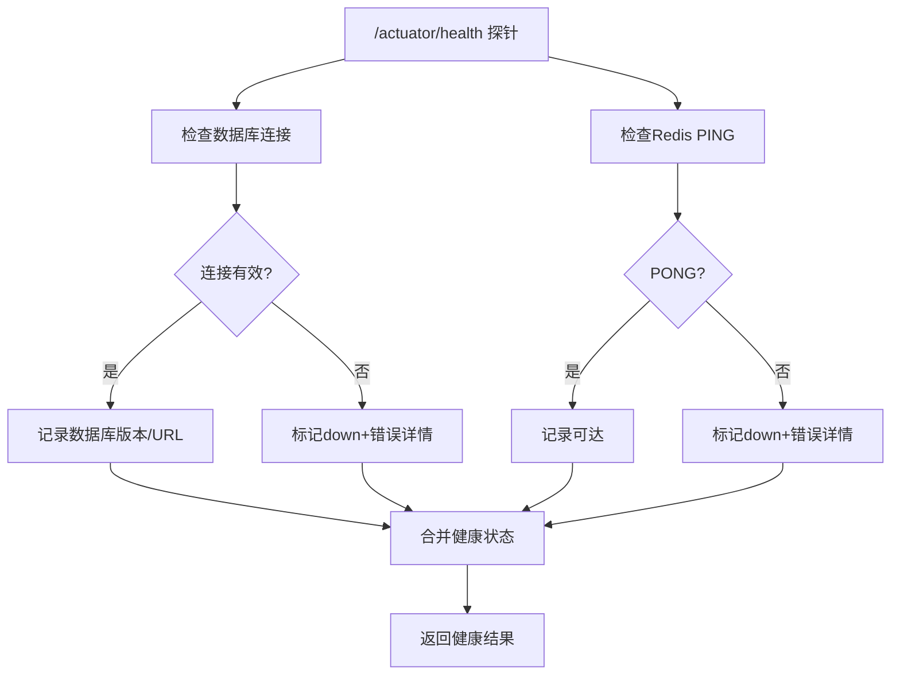
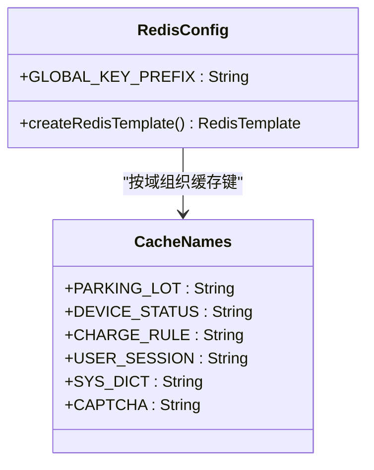
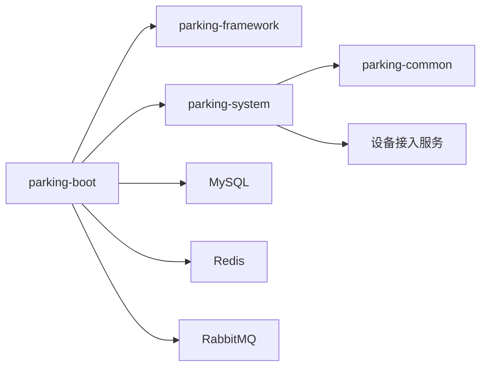

# 故障排查

<cite>
**本文引用的文件**   
- [README.md](file://README.md)
- [application.yml](file://parking-boot/src/main/resources/application.yml)
- [application-prod.yml](file://parking-boot/src/main/resources/application-prod.yml)
- [docker-compose.yml](file://docker-compose.yml)
- [nginx.conf](file://docker/nginx/nginx.conf)
- [TraceIdFilter.java](file://parking-framework/src/main/java/com/jushan/framework/web/TraceIdFilter.java)
- [GlobalExceptionHandler.java](file://parking-framework/src/main/java/com/jushan/framework/web/GlobalExceptionHandler.java)
- [BusinessException.java](file://parking-common/src/main/java/com/jushan/common/BusinessException.java)
- [DeviceAccessClientImpl.java](file://parking-system/src/main/java/com/jushan/system/client/DeviceAccessClientImpl.java)
- [ReadinessHealthIndicator.java](file://parking-boot/src/main/java/com/jushan/boot/health/ReadinessHealthIndicator.java)
- [RedisConfig.java](file://parking-framework/src/main/java/com/jushan/framework/redis/RedisConfig.java)
- [CacheNames.java](file://parking-framework/src/main/java/com/jushan/framework/redis/CacheNames.java)
- [ProdConfigValidator.java](file://parking-boot/src/main/java/com/jushan/boot/config/ProdConfigValidator.java)
- [V20260711002__sys_user_and_login_log.sql](file://parking-boot/src/main/resources/db/migration/V20260711002__sys_user_and_login_log.sql)
- [AuditService.java](file://parking-system/src/main/java/com/jushan/system/service/AuditService.java)
- [TraceIdAndHttpStatusTest.java](file://parking-boot/src/test/java/com/jushan/boot/controller/TraceIdAndHttpStatusTest.java)
- [DeviceAccessClientRobustnessTest.java](file://parking-boot/src/test/java/com/jushan/boot/client/DeviceAccessClientRobustnessTest.java)
</cite>

## 目录
1. [引言](#引言)
2. [项目结构](#项目结构)
3. [核心组件](#核心组件)
4. [架构总览](#架构总览)
5. [详细组件分析](#详细组件分析)
6. [依赖关系分析](#依赖关系分析)
7. [性能考虑](#性能考虑)
8. [故障排查指南](#故障排查指南)
9. [结论](#结论)
10. [附录](#附录)

## 引言
本指南面向运维与研发人员，聚焦于智慧停车 SaaS 平台的故障定位、性能优化、监控告警、日志分析与应急响应。内容覆盖启动问题、数据库连接异常、缓存与消息中间件问题、外部服务（设备接入）不稳定、分布式链路追踪、根因分析、回滚与灾难恢复、安全事件响应等。所有建议均基于仓库现有实现与配置进行提炼，确保可落地执行。

## 项目结构
平台采用多模块 Maven 工程：
- parking-boot：应用入口、环境配置、健康检查、迁移脚本加载
- parking-framework：通用框架能力（全局异常、链路追踪、Redis、WebSocket、分布式锁、MQ 基础）
- parking-system：业务领域（控制器、服务、实体、DTO/VO、客户端调用）
- parking-common：公共错误码与统一响应体
- docker：Nginx 反向代理与容器编排
- docs：契约、设计、部署与开发计划文档

图表来源
- [application.yml:1-108](file://parking-boot/src/main/resources/application.yml#L1-L108)
- [docker-compose.yml:64-115](file://docker-compose.yml#L64-L115)
- [nginx.conf:1-67](file://docker/nginx/nginx.conf#L1-L67)

章节来源
- [README.md:1-77](file://README.md#L1-L77)

## 核心组件
- 全局异常处理：将参数校验、业务异常、认证授权异常、Spring 内置异常统一转换为结构化响应，并保证不泄露内部细节。
- 全链路 TraceId：在请求入口处生成或复用合法 TraceId，写入 MDC 与响应头，贯穿日志与下游调用。
- 健康检查：自定义 Readiness 探针，检测数据库与 Redis 连通性，暴露 /actuator/health。
- 外部服务客户端：对设备接入服务的 HTTP 调用封装，包含指标采集、失败计数与降级开关。
- 缓存与键空间：Redis 模板与缓存命名常量，按业务域隔离缓存空间。
- 生产配置校验：关键环境变量缺失或越界时阻止启动，避免“半可用”状态上线。

章节来源
- [GlobalExceptionHandler.java:1-240](file://parking-framework/src/main/java/com/jushan/framework/web/GlobalExceptionHandler.java#L1-L240)
- [TraceIdFilter.java:1-76](file://parking-framework/src/main/java/com/jushan/framework/web/TraceIdFilter.java#L1-L76)
- [ReadinessHealthIndicator.java:72-113](file://parking-boot/src/main/java/com/jushan/boot/health/ReadinessHealthIndicator.java#L72-L113)
- [DeviceAccessClientImpl.java:92-126](file://parking-system/src/main/java/com/jushan/system/client/DeviceAccessClientImpl.java#L92-L126)
- [RedisConfig.java:1-35](file://parking-framework/src/main/java/com/jushan/framework/redis/RedisConfig.java#L1-L35)
- [CacheNames.java:1-39](file://parking-framework/src/main/java/com/jushan/framework/redis/CacheNames.java#L1-L39)
- [ProdConfigValidator.java:97-113](file://parking-boot/src/main/java/com/jushan/boot/config/ProdConfigValidator.java#L97-L113)

## 架构总览
下图展示一次典型请求从 Nginx 到后端、再到外部设备接入服务的调用链与观测点（TraceId、指标、审计）。

图表来源
- [TraceIdFilter.java:1-76](file://parking-framework/src/main/java/com/jushan/framework/web/TraceIdFilter.java#L1-L76)
- [GlobalExceptionHandler.java:1-240](file://parking-framework/src/main/java/com/jushan/framework/web/GlobalExceptionHandler.java#L1-L240)
- [DeviceAccessClientImpl.java:92-126](file://parking-system/src/main/java/com/jushan/system/client/DeviceAccessClientImpl.java#L92-L126)
- [application.yml:1-108](file://parking-boot/src/main/resources/application.yml#L1-L108)

## 详细组件分析

### 全局异常处理与协议级状态映射
- 参数校验失败：提取字段级错误信息，返回 BAD_REQUEST。
- 业务异常：根据错误码映射为对应 HTTP 状态（如 401/403/404/409/429），其余保持 HTTP 200 + code 非 0。
- 认证/授权异常：未登录、无权限、无角色分别返回 401/403。
- Spring 内置异常：404/405 统一处理。
- 兜底异常：记录完整堆栈但不泄露给前端。

图表来源
- [GlobalExceptionHandler.java:1-240](file://parking-framework/src/main/java/com/jushan/framework/web/GlobalExceptionHandler.java#L1-L240)

章节来源
- [GlobalExceptionHandler.java:1-240](file://parking-framework/src/main/java/com/jushan/framework/web/GlobalExceptionHandler.java#L1-L240)
- [BusinessException.java:1-49](file://parking-common/src/main/java/com/jushan/common/BusinessException.java#L1-L49)
- [TraceIdAndHttpStatusTest.java:79-174](file://parking-boot/src/test/java/com/jushan/boot/controller/TraceIdAndHttpStatusTest.java#L79-L174)

### 全链路 TraceId 与日志关联
- 入站校验：仅接受字母数字连字符下划线且长度不超过 64 的 TraceId；非法则重新生成。
- 上下文传播：写入 SLF4J MDC，并在响应头回传 X-Trace-Id。
- 线程安全：请求结束清理 MDC，避免线程池复用污染。
- 测试覆盖：合法/非法/空/空白/连续请求不污染等场景均有验证。

图表来源
- [TraceIdFilter.java:1-76](file://parking-framework/src/main/java/com/jushan/framework/web/TraceIdFilter.java#L1-L76)
- [GlobalExceptionHandler.java:1-240](file://parking-framework/src/main/java/com/jushan/framework/web/GlobalExceptionHandler.java#L1-L240)

章节来源
- [TraceIdFilter.java:1-76](file://parking-framework/src/main/java/com/jushan/framework/web/TraceIdFilter.java#L1-L76)
- [TraceIdAndHttpStatusTest.java:79-174](file://parking-boot/src/test/java/com/jushan/boot/controller/TraceIdAndHttpStatusTest.java#L79-L174)

### 外部服务（设备接入）健壮性与降级
- 指标采集：调用总数、错误数、延迟计时器、降级状态 Gauge。
- 失败统计与降级：连续失败达到阈值后打开降级开关，后续快速失败或走本地策略。
- 错误分类：按 error_type 标签区分不同错误原因，便于告警与排障。
- 测试验证：延迟指标与降级 Gauge 存在性、默认值正确性。

图表来源
- [DeviceAccessClientImpl.java:92-126](file://parking-system/src/main/java/com/jushan/system/client/DeviceAccessClientImpl.java#L92-L126)
- [DeviceAccessClientImpl.java:232-248](file://parking-system/src/main/java/com/jushan/system/client/DeviceAccessClientImpl.java#L232-L248)
- [DeviceAccessClientRobustnessTest.java:374-415](file://parking-boot/src/test/java/com/jushan/boot/client/DeviceAccessClientRobustnessTest.java#L374-L415)

章节来源
- [DeviceAccessClientImpl.java:92-126](file://parking-system/src/main/java/com/jushan/system/client/DeviceAccessClientImpl.java#L92-L126)
- [DeviceAccessClientImpl.java:232-248](file://parking-system/src/main/java/com/jushan/system/client/DeviceAccessClientImpl.java#L232-L248)
- [DeviceAccessClientRobustnessTest.java:374-415](file://parking-boot/src/test/java/com/jushan/boot/client/DeviceAccessClientRobustnessTest.java#L374-L415)

### 健康检查与就绪探针
- 数据库连通性：尝试获取连接并查询元数据，失败标记 down 并附带错误详情。
- Redis 连通性：PING/PONG 判定，异常时记录不可达与错误信息。
- Actuator 暴露：/actuator/health 与 probes 启用，生产模式隐藏敏感细节。

图表来源
- [ReadinessHealthIndicator.java:72-113](file://parking-boot/src/main/java/com/jushan/boot/health/ReadinessHealthIndicator.java#L72-L113)
- [application.yml:75-92](file://parking-boot/src/main/resources/application.yml#L75-L92)

章节来源
- [ReadinessHealthIndicator.java:72-113](file://parking-boot/src/main/java/com/jushan/boot/health/ReadinessHealthIndicator.java#L72-L113)
- [application.yml:75-92](file://parking-boot/src/main/resources/application.yml#L75-L92)

### 缓存与键空间治理
- Redis 模板：Key 使用字符串序列化，Value 使用 JSON 序列化，便于调试与跨语言兼容。
- 全局前缀：统一 key 前缀，避免不同环境/租户冲突。
- 缓存命名：按业务域划分缓存名称，降低耦合与误用风险。

图表来源
- [RedisConfig.java:1-35](file://parking-framework/src/main/java/com/jushan/framework/redis/RedisConfig.java#L1-L35)
- [CacheNames.java:1-39](file://parking-framework/src/main/java/com/jushan/framework/redis/CacheNames.java#L1-L39)

章节来源
- [RedisConfig.java:1-35](file://parking-framework/src/main/java/com/jushan/framework/redis/RedisConfig.java#L1-L35)
- [CacheNames.java:1-39](file://parking-framework/src/main/java/com/jushan/framework/redis/CacheNames.java#L1-L39)

### 生产配置校验与环境变量
- 必填项校验：缺失关键环境变量时阻止启动，避免“半可用”上线。
- 范围校验：对数值型配置进行最小/最大范围检查，防止极端值导致资源耗尽。
- 示例：数据库连接池大小、超时时间等关键参数的合法性检查。

章节来源
- [ProdConfigValidator.java:97-113](file://parking-boot/src/main/java/com/jushan/boot/config/ProdConfigValidator.java#L97-L113)
- [application-prod.yml:1-83](file://parking-boot/src/main/resources/application-prod.yml#L1-L83)

## 依赖关系分析
- 应用与基础设施：
  - 数据库：HikariCP 连接池、Flyway 迁移
  - 缓存：Redis（Letuce 连接池）
  - 消息：RabbitMQ（AMQP）
  - 外部服务：设备接入 HTTP API
- 框架与业务：
  - 框架提供异常、追踪、缓存、鉴权、WebSocket 等横切能力
  - 业务通过客户端访问外部服务，并通过 Mapper/Service 操作数据库与缓存

图表来源
- [application.yml:1-108](file://parking-boot/src/main/resources/application.yml#L1-L108)
- [docker-compose.yml:64-115](file://docker-compose.yml#L64-L115)

章节来源
- [application.yml:1-108](file://parking-boot/src/main/resources/application.yml#L1-L108)
- [docker-compose.yml:64-115](file://docker-compose.yml#L64-L115)

## 性能考虑
- JVM 调优（通用建议）
  - 堆大小：根据服务器内存与服务 QPS 设定 -Xms/-Xmx，建议相等以避免动态扩容抖动。
  - GC 选择：G1GC 适合大堆与低延迟场景；ZGC 适合超低延迟与大对象。
  - 元空间：-XX:MetaspaceSize 与 -XX:MaxMetaspaceSize 合理设置，避免频繁类卸载/加载。
  - 线程池：控制 Tomcat 线程数与队列长度，避免线程饥饿与排队过长。
- 数据库连接池（HikariCP）
  - maximum-pool-size：结合 CPU 核数与 IO 特性估算，避免过大导致上下文切换开销。
  - connection-timeout/idle-timeout：根据慢查询与峰值流量调整，缩短等待时间以快速失败。
- Redis 连接池（Letuce）
  - max-active/max-idle：与并发量匹配，避免阻塞等待。
  - timeout：短超时配合重试/降级，提升整体可用性。
- 外部服务调用
  - connect-timeout/read-timeout：严格限制，避免长尾拖垮线程池。
  - 指标与降级：利用 .latency/.calls.errors/.circuit_breaker.state 进行容量规划与熔断策略。
- 缓存策略
  - 热点数据优先缓存（停车场、设备快照、收费规则等）。
  - 合理 TTL 与失效策略，避免雪崩与穿透。
  - 使用 CacheNames 规范键空间，减少误命中。
- Nginx 优化
  - sendfile/tcp_nopush/tcp_nodelay/keepalive_timeout 已开启，可按负载微调。
  - gzip 压缩适用于文本与 JSON，注意 CPU 与带宽权衡。

[本节为通用指导，无需源码引用]

## 故障排查指南

### 启动问题
- 症状
  - 端口占用或服务无法监听
  - 数据库/Redis/RabbitMQ 连接失败导致启动中止
  - 生产环境缺少必要环境变量导致启动失败
- 排查步骤
  - 检查 application.yml 与 application-prod.yml 中 server.port、datasource、redis、rabbitmq 配置。
  - 确认 docker-compose 中各服务端口映射与健康检查是否通过。
  - 核对生产环境变量是否齐全且符合范围要求（ProdConfigValidator）。
  - 查看 /actuator/health 输出，关注 database/redis 子项状态与错误详情。
- 常见原因与修复
  - 端口冲突：修改 SERVER_PORT 或释放占用端口。
  - 数据库不可达：检查 DB_URL/用户名/密码/网络连通性；确认 Flyway 迁移脚本是否存在。
  - Redis 不可达：检查 REDIS_HOST/PORT/PASSWORD；确认容器健康检查通过。
  - 环境变量缺失：补齐 .env 或运行环境注入，确保必填项不为空。

章节来源
- [application.yml:1-108](file://parking-boot/src/main/resources/application.yml#L1-L108)
- [application-prod.yml:1-83](file://parking-boot/src/main/resources/application-prod.yml#L1-L83)
- [docker-compose.yml:64-115](file://docker-compose.yml#L64-L115)
- [ProdConfigValidator.java:97-113](file://parking-boot/src/main/java/com/jushan/boot/config/ProdConfigValidator.java#L97-L113)
- [ReadinessHealthIndicator.java:72-113](file://parking-boot/src/main/java/com/jushan/boot/health/ReadinessHealthIndicator.java#L72-L113)

### 数据库连接问题
- 症状
  - 启动时报连接失败或迁移失败
  - 运行时出现连接池耗尽、查询超时
- 排查步骤
  - 查看 HikariCP 配置：maximum-pool-size、connection-timeout、idle-timeout。
  - 使用 /actuator/health 的 database 子项判断连通性与错误信息。
  - 检查数据库实例状态、账号权限、防火墙与安全组。
  - 观察慢查询与锁等待，必要时临时增大连接池或优化 SQL。
- 常见原因与修复
  - 连接池过小：根据并发与慢查询情况适当提高 maximum-pool-size。
  - 超时过短：延长 connection-timeout 或优化上游调用链。
  - 迁移脚本缺失或语法错误：核对 db/migration 目录与版本号顺序。

章节来源
- [application.yml:21-32](file://parking-boot/src/main/resources/application.yml#L21-L32)
- [ReadinessHealthIndicator.java:72-113](file://parking-boot/src/main/java/com/jushan/boot/health/ReadinessHealthIndicator.java#L72-L113)

### 缓存与键空间问题
- 症状
  - 缓存命中率低或数据不一致
  - 键冲突导致脏读
- 排查步骤
  - 确认 RedisConfig 的全局前缀与序列化方式是否符合预期。
  - 检查 CacheNames 的使用是否按业务域隔离。
  - 观察缓存过期时间与更新策略，避免雪崩。
- 常见原因与修复
  - 键空间混用：统一使用 CacheNames 常量，避免硬编码键名。
  - 未设置 TTL：为短期数据设置合理过期时间。
  - 序列化不一致：确保 Key/Value 序列化一致，避免跨语言读取异常。

章节来源
- [RedisConfig.java:1-35](file://parking-framework/src/main/java/com/jushan/framework/redis/RedisConfig.java#L1-L35)
- [CacheNames.java:1-39](file://parking-framework/src/main/java/com/jushan/framework/redis/CacheNames.java#L1-L39)

### 外部服务（设备接入）不稳定
- 症状
  - 设备状态查询失败率升高
  - 调用延迟飙升或频繁超时
  - 触发降级导致功能受限
- 排查步骤
  - 查看 Micrometer 指标：.calls.total/.calls.errors/.latency/.circuit_breaker.state。
  - 检查错误类型标签 error_type，定位具体失败原因（网络、超时、服务端错误）。
  - 确认降级开关状态，评估是否需要扩容或限流。
- 常见原因与修复
  - 外部服务宕机或过载：启用降级策略，保护自身服务。
  - 超时配置不当：调整 connect-timeout/read-timeout，避免长尾。
  - 重试风暴：引入退避与幂等，避免雪崩。

章节来源
- [DeviceAccessClientImpl.java:92-126](file://parking-system/src/main/java/com/jushan/system/client/DeviceAccessClientImpl.java#L92-L126)
- [DeviceAccessClientImpl.java:232-248](file://parking-system/src/main/java/com/jushan/system/client/DeviceAccessClientImpl.java#L232-L248)
- [DeviceAccessClientRobustnessTest.java:374-415](file://parking-boot/src/test/java/com/jushan/boot/client/DeviceAccessClientRobustnessTest.java#L374-L415)

### 认证与授权问题
- 症状
  - 401 未登录或 Token 无效
  - 403 无权限或无角色
- 排查步骤
  - 检查 Sa-Token 配置（token-name/token-prefix/is-read-header 等）。
  - 确认请求头 Authorization 格式是否正确。
  - 查看全局异常处理中的认证/授权分支日志。
- 常见原因与修复
  - 前端未携带 Bearer Token：修正请求头。
  - Token 过期或共享策略不正确：调整 sa-token.timeout/is-share。
  - 权限/角色未分配：完善权限模型与数据。

章节来源
- [application.yml:58-74](file://parking-boot/src/main/resources/application.yml#L58-L74)
- [GlobalExceptionHandler.java:149-191](file://parking-framework/src/main/java/com/jushan/framework/web/GlobalExceptionHandler.java#L149-L191)

### 日志与链路追踪
- 症状
  - 无法跨服务关联日志
  - 日志中缺少 traceId
- 排查步骤
  - 确认 TraceIdFilter 是否生效（请求头 X-Trace-Id 与响应头一致）。
  - 检查日志 pattern 是否包含 %X{traceId}。
  - 查看 Nginx access.log 是否透传 trace_id。
- 常见原因与修复
  - 非法 traceId 被拒绝：客户端需遵循合法字符集与长度限制。
  - 日志未包含 traceId：调整 logback pattern。
  - Nginx 未透传：检查 nginx.conf 的 log_format 与 upstream 配置。

章节来源
- [TraceIdFilter.java:1-76](file://parking-framework/src/main/java/com/jushan/framework/web/TraceIdFilter.java#L1-L76)
- [application.yml:101-108](file://parking-boot/src/main/resources/application.yml#L101-L108)
- [nginx.conf:24-32](file://docker/nginx/nginx.conf#L24-L32)

### 审计与合规
- 症状
  - 代理操作审计缺失或失败
- 排查步骤
  - 检查审计写入逻辑是否 fail-close（代理操作不允许在不可审计情况下继续）。
  - 查看 sys_audit_log 与相关表结构与索引。
- 常见原因与修复
  - 审计表不可写：修复权限或磁盘空间。
  - 审计写入失败：按策略 fail-close 或记录 ERROR 日志并告警。

章节来源
- [AuditService.java:248-265](file://parking-system/src/main/java/com/jushan/system/service/AuditService.java#L248-L265)
- [V20260711002__sys_user_and_login_log.sql:25-41](file://parking-boot/src/main/resources/db/migration/V20260711002__sys_user_and_login_log.sql#L25-L41)

### 监控指标采集与告警
- 指标清单
  - 设备接入调用：.calls.total、.calls.errors、.latency、.circuit_breaker.state
- 采集与可视化
  - 集成 Micrometer 与 Prometheus/Grafana，拉取指标并绘制面板。
- 告警规则建议
  - 错误率：.calls.errors 比率超过阈值持续 N 分钟
  - 延迟：.latency p95/p99 超过阈值
  - 降级：.circuit_breaker.state=1 持续一段时间
  - 健康：/actuator/health 中 database/redis 为 down

章节来源
- [DeviceAccessClientImpl.java:92-126](file://parking-system/src/main/java/com/jushan/system/client/DeviceAccessClientImpl.java#L92-L126)
- [DeviceAccessClientImpl.java:232-248](file://parking-system/src/main/java/com/jushan/system/client/DeviceAccessClientImpl.java#L232-L248)
- [application.yml:75-92](file://parking-boot/src/main/resources/application.yml#L75-L92)

### 分布式系统故障定位与根因分析
- 方法
  - 使用 traceId 串联 Nginx、后端、外部服务日志。
  - 结合指标与降级状态判断是否为外部依赖问题。
  - 通过健康检查与审计日志缩小影响面。
- 工具
  - 日志聚合（ELK/Loki）、APM（SkyWalking/Jaeger）、指标（Prometheus/Grafana）
- 根因分析流程
  - 症状识别 → 假设建立 → 证据收集（日志/指标/健康）→ 近因定位 → 根因确认 → 修复与回归验证

[本节为方法论，无需源码引用]

### 应急响应流程、回滚策略与灾难恢复
- 应急响应
  - 发现：监控告警/用户反馈
  - 分级：依据影响范围与持续时间定级
  - 处置：降级/限流/回滚/扩容
  - 复盘：根因分析与改进措施
- 回滚策略
  - 代码回滚：镜像版本回退
  - 配置回滚：环境变量与配置文件版本化
  - 数据回滚：谨慎评估，必要时通过补偿任务修复
- 灾难恢复
  - 备份：数据库与 Redis AOF/RDB
  - 演练：定期演练恢复流程与 RTO/RPO 目标
  - 多活：跨区域容灾与流量切换

[本节为通用指导，无需源码引用]

### 调试工具与性能分析技巧
- 调试
  - 使用 MockMvc 与 WireMock 复现问题（参考测试用例）
  - 开启 DEBUG 日志定位参数校验与异常路径
- 性能分析
  - JFR/Async Profiler 抓取 CPU/内存热点
  - 数据库慢查询分析与索引优化
  - 压测工具（JMeter/Wrk）评估容量与瓶颈

[本节为通用指导，无需源码引用]

### 安全事件响应与漏洞修复流程
- 事件响应
  - 隔离受影响实例，阻断攻击源 IP
  - 保留证据（日志、请求样本、指标）
  - 通知相关方并升级处理级别
- 漏洞修复
  - 依赖扫描与补丁升级
  - 安全配置加固（Sa-Token 仅 Header 读取 Token）
  - 回归测试与灰度发布

章节来源
- [application.yml:69-73](file://parking-boot/src/main/resources/application.yml#L69-L73)

## 结论
本指南围绕平台的关键组件与配置，提供了从启动、数据库、缓存、外部服务到监控告警与应急响应的系统化故障排查方法。通过 TraceId 与指标体系，可实现端到端的可观测性；通过健康检查与生产配置校验，可有效降低“半可用”风险。建议在变更过程中严格执行回滚与演练，持续提升系统的韧性与可维护性。

## 附录
- 常用命令与路径
  - 健康检查：/actuator/health
  - 日志位置：容器内 /var/log/nginx/access.log 与应用日志文件
  - 配置覆盖：通过环境变量注入生产配置
- 参考文档
  - README 与部署说明、配置说明、契约文档

章节来源
- [README.md:1-77](file://README.md#L1-L77)
- [nginx.conf:32-67](file://docker/nginx/nginx.conf#L32-L67)
- [application-prod.yml:1-83](file://parking-boot/src/main/resources/application-prod.yml#L1-L83)